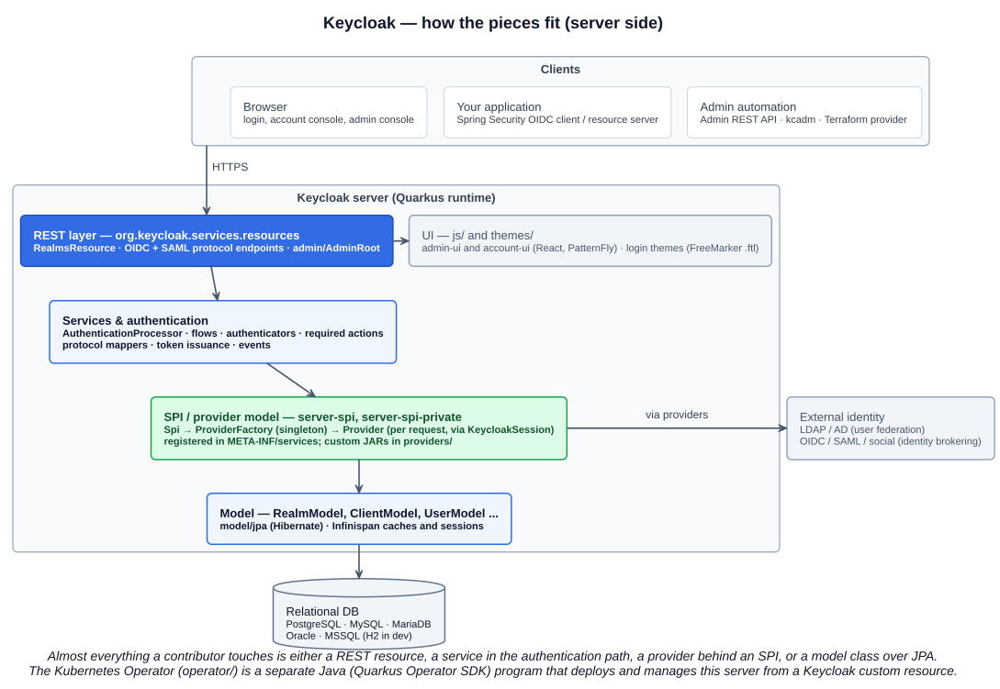

# Keycloak — a contributor's starter guide

A path from "what is it" to a merged pull request, for a Java developer who wants a cloud native open source project to get involved in. Keycloak is a good pick: the core is Java (Quarkus), it is a CNCF incubating project with real governance, it sits squarely in the security domain the KCSA exam covers, and it ships a Kubernetes operator written in Java — so the same codebase connects application development, identity, and Kubernetes.

Everything here was checked against the project's own docs on 2026-09-16. Versions and commands drift; the repo's `docs/` folder is the source of truth.

## 0. The facts

| | |
|---|---|
| What | Open source **identity and access management**: single sign-on, OpenID Connect / OAuth 2.0 / SAML 2.0, identity brokering and social login, user federation (LDAP, Active Directory), fine-grained authorization, admin and account consoles |
| Language / runtime | Java on **Quarkus** (the WildFly distribution was retired in 2022). Builds on JDK 17, 21 or 25. Admin and account consoles are React + PatternFly under `js/` |
| License | Apache 2.0 |
| Governance | CNCF **Incubating** since April 2023; originally a Red Hat project (it is the upstream of Red Hat build of Keycloak) |
| Release | 26.7.3 on 2026-08-31; frequent minor releases, a major every few months |
| Repo | `github.com/keycloak/keycloak` — one Maven monorepo, ~30 top-level modules |
| Community | GitHub Discussions (design and questions), CNCF Slack `#keycloak` and `#keycloak-dev`, `keycloak-dev` mailing list, community meetings listed at keycloak.org/community |
| Labels that matter | `good first issue`, `help wanted`, `area/*` (`area/authentication`, `area/oidc`, `area/saml`, `area/storage`, `area/operator`, `area/docs`, `area/testsuite`, …) |

---

## 1. Use it before you read it (two evenings)

You cannot navigate the code without the product's vocabulary in your head. Run it, click through it, secure something with it.

### 1.1 Run it

```bash
docker run --name keycloak -p 8080:8080 \
  -e KC_BOOTSTRAP_ADMIN_USERNAME=admin \
  -e KC_BOOTSTRAP_ADMIN_PASSWORD=admin \
  quay.io/keycloak/keycloak:26.7.3 start-dev
```

`start-dev` uses an embedded H2 database and relaxed TLS so it just works. Open http://localhost:8080, log in as `admin`.

### 1.2 The vocabulary

| Concept | What it is | Where you meet it in the code later |
|---|---|---|
| **Realm** | An isolated tenant: its own users, clients, roles, settings. `master` administers the others | `RealmModel` |
| **Client** | An application or service that uses Keycloak to authenticate users or obtain tokens. Has a protocol (OIDC or SAML), a client ID, redirect URIs, and an access type (public / confidential) | `ClientModel` |
| **User, Group, Role** | Users belong to groups; roles (realm-level or client-level) are what tokens carry as claims. Composite roles bundle others | `UserModel`, `GroupModel`, `RoleModel` |
| **Authentication flow** | The ordered set of steps a login goes through (username/password → OTP → …), built from *authenticators*; also flows for registration, reset credentials, first broker login | `AuthenticationProcessor`, `Authenticator` |
| **Required action** | Something a user must do at next login (update password, configure OTP, verify email) | `RequiredActionProvider` |
| **Identity provider (brokering)** | Keycloak delegating login to another OIDC/SAML provider or a social login (Google, GitHub) | `IdentityProvider` |
| **User federation** | Keycloak reading users from an external store — LDAP/AD — instead of its own database | `UserStorageProvider` |
| **Protocol mapper** | Turns user/role/attribute data into token claims (or SAML assertions) | `ProtocolMapper` |
| **Client scope** | A reusable bundle of mappers and roles that clients opt into (`profile`, `email`, `roles`…) | `ClientScopeModel` |
| **Theme** | The look of login, account, admin, and email pages; FreeMarker templates for login | `themes/` |
| **Event** | Login, logout, token refresh, admin changes — persisted and pluggable via listeners | `EventListenerProvider` |

### 1.3 First exercises

1. Create a realm `demo`, a user with a password, and log into the **account console** at `http://localhost:8080/realms/demo/account`.
2. Read `http://localhost:8080/realms/demo/.well-known/openid-configuration`. Every URL Keycloak exposes for OIDC is in there — authorization, token, userinfo, JWKS, logout.
3. Create a **confidential client**, run the authorization code flow by hand (browser to the `auth` endpoint, code back, `curl` the `token` endpoint), then paste the access token into jwt.io. Look at `iss`, `aud`, `azp`, `realm_access.roles`, `scope`.
4. Add a realm role and a protocol mapper; watch the claim appear in the token.
5. Change the login **authentication flow**: copy the browser flow, make OTP required, log in again.

### 1.4 Secure a Spring Boot app with it

Keycloak retired its own Java adapters; the modern way is plain Spring Security, which is also what you'd use with any other OIDC provider — good for your résumé either way.

- **Resource server** (an API that validates Keycloak tokens): `spring-boot-starter-oauth2-resource-server` with `spring.security.oauth2.resourceserver.jwt.issuer-uri=http://localhost:8080/realms/demo`. Spring fetches the JWKS from the discovery document and validates signatures and `iss` for you. Map `realm_access.roles` to `GrantedAuthority` with a custom `JwtAuthenticationConverter`.
- **OIDC client** (a web app that logs users in): `spring-boot-starter-oauth2-client` with a `spring.security.oauth2.client.registration.keycloak.*` block (client ID, secret, scope `openid`) and `provider.keycloak.issuer-uri`.

Build a two-service demo — a UI that logs in and calls an API with the bearer token — and you have exercised the whole product surface you'll later read the code for.

---

## 2. Understand the architecture (a week of evenings)



### 2.1 The shape of the server

Five layers, top to bottom:

1. **REST layer** — JAX-RS resources under `org.keycloak.services.resources`. `RealmsResource` fans out to per-realm endpoints; the OIDC and SAML protocol endpoints (authorization, token, userinfo, logout) live under `org.keycloak.protocol.oidc` and `org.keycloak.protocol.saml`; the admin API under `org.keycloak.services.resources.admin` starting at `AdminRoot`.
2. **Services and authentication** — `AuthenticationProcessor` walks an authentication flow, invoking `Authenticator` implementations, rendering forms via the login theme, and ending in a `UserSessionModel`; token issuance runs protocol mappers to build the JWT.
3. **The SPI / provider model** — the extension mechanism *and* the internal structure. Every pluggable capability (authenticators, user storage, event listeners, themes, mappers, password hashing, …) is an `Spi` with a `ProviderFactory` (singleton, configured at startup, registered through `META-INF/services`) that creates a `Provider` per request. Internally, almost everything is obtained through the `KeycloakSession` (`session.users()`, `session.clients()`, `session.getProvider(...)`) — there is no Spring or CDI wiring in the core, which is unusual for Java and worth internalising early.
4. **Model** — `RealmModel`, `ClientModel`, `UserModel`, `RoleModel`, `GroupModel` and friends are interfaces in `server-spi`; the JPA implementation in `model/jpa` maps them to the database with Hibernate; Infinispan provides caches and user/client session storage, and clustering.
5. **Storage** — a relational database (PostgreSQL, MySQL, MariaDB, Oracle, MSSQL; H2 in dev mode).

Alongside: the **UI** (`js/apps/admin-ui`, `js/apps/account-ui`, `js/libs/keycloak-js`) talks to the server purely through the REST API — a good reminder that anything the console can do, the admin API can do; and the **Operator** (`operator/`, Java, Quarkus Operator SDK) which deploys and reconciles Keycloak instances on Kubernetes from a `Keycloak` custom resource.

### 2.2 Module map

| Module | Contains |
|---|---|
| `core`, `common`, `crypto`, `util` | Representations (the JSON shapes of the REST API), constants, crypto abstractions, shared utilities |
| `server-spi`, `server-spi-private` | The SPI interfaces and model interfaces — public (stable) and private (may change) |
| `services` | The server: REST resources, authentication, protocols, token issuance, events, the admin API |
| `model/` | Model implementations: `jpa`, `infinispan`, `map`, `storage` |
| `federation/` | LDAP / Kerberos user storage providers |
| `authz`, `authzen` | Authorization services (UMA, policies, permissions) and the OpenID AuthZEN API |
| `saml-core`, `saml-core-api` | SAML protocol implementation |
| `scim`, `ssf` | SCIM provisioning; Shared Signals Framework |
| `quarkus/` | The Quarkus distribution: `deployment` (build-time), `runtime`, `server`, `dist`, `config-api` |
| `js/` | Admin console, account console, `keycloak-js` adapter |
| `themes/` | Built-in themes (login `.ftl` templates, account, admin, email) |
| `operator/` | The Kubernetes operator |
| `test-framework/`, `tests/`, `testsuite/` | The JUnit 5 Keycloak Test Framework and its tests (where new tests go); the legacy Arquillian testsuite being migrated from |
| `docs/` | Contributor docs (`building.md`, `tests-development.md`, `documentation/` = the published guides) |

### 2.3 Read these docs before the code

- **Server Administration guide** — the product from the admin's view; the concepts table above comes from here.
- **Server Developer guide** — the SPI chapter: `Provider` / `ProviderFactory` / `Spi`, `META-INF/services` registration, deploying a provider JAR into `providers/` followed by `kc.sh build`, and the catalogue of extension points (authenticators, required actions, event listeners, user storage, protocol mappers, themes, custom REST endpoints).
- **Securing applications guide** — OIDC/SAML flows and the token formats; helps you recognise the endpoints when you read `protocol/oidc`.

---

## 3. Build and run from source (a weekend)

Prerequisites: JDK 17, 21 or 25; Git; the Maven wrapper is in the repo. The first build takes a while (it also builds the JavaScript consoles through Maven).

```bash
git clone https://github.com/<you>/keycloak.git   # your fork
cd keycloak
git remote add upstream https://github.com/keycloak/keycloak.git

# full build without tests — do this once before opening the IDE, so generated sources exist
./mvnw clean install -DskipTests

# faster rebuilds
./mvnw clean install -DskipTests -Dmaven.build.cache.enabled=true

# only the server distribution
./mvnw -pl quarkus/deployment,quarkus/dist -am -DskipTests clean install
# → quarkus/dist/target/keycloak-<version>.zip
```

Run the server from source in Quarkus dev mode (hot reload, debugger on 5005):

```bash
cd quarkus
../mvnw -f server/pom.xml compile quarkus:dev -Dkc.config.built=true -Dquarkus.args="start-dev"
```

Then http://localhost:8080 as before. From the IDE, the `quarkus/README.md` describes running the `org.keycloak.Keycloak` main class with the listed JVM options.

**IDE:** IntelliJ IDEA imports the root `pom.xml` as a Maven project. Build with Maven first, mark the project as Java 21, and expect the first index to take a few minutes — it is a large codebase. Attach the debugger to port 5005 while dev mode runs.

---

## 4. Read code with a question (two weeks)

Reading a large codebase top-down fails; reading it along a request works. Three traces, each an evening, each with the debugger attached:

### Trace 1 — a browser login

1. Breakpoint in `org.keycloak.protocol.oidc.endpoints.AuthorizationEndpoint` (the `/protocol/openid-connect/auth` endpoint).
2. Log in from the account console. Follow into `AuthenticationProcessor` → the browser flow → `UsernamePasswordForm` (an `Authenticator`) → the `login.ftl` theme template being rendered → the form POST coming back → credential validation through `session.users()` and the password hashing SPI.
3. Success creates a `UserSessionModel` and redirects with a code; the client exchanges it at `TokenEndpoint`, where `TokenManager` runs the protocol mappers and signs the JWT.

You now know where authentication, sessions, and tokens live.

### Trace 2 — an admin API call

1. Breakpoint in `org.keycloak.services.resources.admin.UsersResource` (or `RealmAdminResource`).
2. Create a user in the admin console. Follow the representation (`UserRepresentation` from `core`) → the model (`UserModel`) → the JPA entity in `model/jpa` → Hibernate → the database. Notice the permission checks (`AdminPermissionEvaluator`) at the top and the `EventBuilder` admin events at the bottom.

You now know how the REST API maps to the model and how admin authorization works.

### Trace 3 — write an extension

The classic first Keycloak extension is an **event listener**: a `EventListenerProviderFactory` + `EventListenerProvider` that logs (or forwards) every login event.

1. A small Maven project depending on `org.keycloak:keycloak-server-spi` and `keycloak-server-spi-private` (`provided` scope), one factory, one provider, and `META-INF/services/org.keycloak.events.EventListenerProviderFactory` naming the factory.
2. Build the JAR, drop it into the distribution's `providers/`, run `bin/kc.sh build`, then `bin/kc.sh start-dev`.
3. Enable it under Realm settings → Events → Event listeners, log in, see your output.

Then do the same with a custom `Authenticator` (the developer guide walks through a "secret question" authenticator with its own `.ftl` form). After these two you understand the SPI model from the outside — which is exactly how most of the server's own features are built.

---

## 5. Tests — the part maintainers care about most

Two test systems coexist, and the contributor docs lag the code, so know both:

| | New **Keycloak Test Framework** | Legacy **Arquillian testsuite** |
|---|---|---|
| Where | `test-framework/` (the framework) and `tests/` (the tests: `base`, `clustering`, `webauthn`, `conformance`, `custom-providers`…) | `testsuite/integration-arquillian/tests/base` |
| Style | JUnit 5; a test class is annotated `@KeycloakIntegrationTest` and *injects* what it needs — `@InjectRealm`, `@InjectUser`, `@InjectOAuthClient`, `@InjectWebDriver`, `@InjectPage`, `@InjectEvents`, `@InjectRunOnServer` — with builders (`RealmBuilder`, `ClientBuilder`, `UserBuilder`) for fixtures | JUnit 4 + Arquillian, `AbstractKeycloakTest` base classes, hand-written realm JSON |
| Status | Where new tests go; migration of the old suite is in progress (`tests/migration-util`, `tests/docs/MIGRATING_TESTS.md`) | Still large, still run in CI, being migrated |
| Docs | `test-framework/docs/`: `GETTING_STARTED.md`, `WRITING_TESTS.md`, `RUNNING_TESTS.md`, `BEST_PRACTICES.md`, `DEBUGGING.md` | `docs/tests-development.md` |

Note: `docs/tests-development.md` still points at `org.keycloak.testsuite.forms.LoginTest`; the file now lives at **`tests/base/src/test/java/org/keycloak/tests/forms/LoginTest.java`** in the new framework. Read that one first — it exercises the realm/user/OAuth injections, page objects, and event assertions in a single file.

Rules that apply to both:

- Tests are **integration tests against a running server**; the framework starts and configures the server for you. The project **does not accept mocking frameworks**.
- Tests can execute code *inside* the server (`@InjectRunOnServer` / `RunOnServerClient`) to reach things the API doesn't expose.
- Assert with Hamcrest `assertThat(...)` and matchers, not `org.junit.Assert.*`.
- A bug fix comes with a test: extend the closest existing test class, or copy the nearest similar test as a template — in the new framework if the area has been migrated.

Running tests: from the IDE like any JUnit test, or with Maven — the framework starts an embedded server by default and can be pointed elsewhere with environment variables:

```bash
# one test class in the new framework
./mvnw -f tests/base/pom.xml test -Dtest=LoginTest

# against a server you already have running on :8080 (e.g. your dev-mode server with a debugger attached)
KC_TEST_SERVER=remote ./mvnw -f tests/base/pom.xml test -Dtest=LoginTest

# against a real database instead of the embedded one
KC_TEST_DATABASE=postgres ./mvnw -f tests/base/pom.xml test -Dtest=LoginTest
```

---

## 6. The first contribution

The rules from `CONTRIBUTING.md`, which reviewers will hold you to:

| Rule | Detail |
|---|---|
| Discuss large changes first | Open a GitHub Discussion (Ideas) before coding anything non-trivial; design proposals go to the `keycloak-community` repo |
| Small footprint | At most **2 open PRs** at a time for new contributors |
| One commit | Squash to a single commit; rebase on `upstream/main` (`git rebase`, never merge) |
| Commit message | Short summary line, optional body, then `Closes #<issue>` |
| DCO | Every commit signed off: `git commit --signoff` |
| Tests and docs | A fix without a test, or a feature without docs, will be sent back |

A realistic first-month sequence:

1. **Docs** (`docs/documentation/`, label `area/docs`) — fix something you found wrong or unclear while doing section 1. Smallest possible PR, teaches you the review flow and the DCO check.
2. **A test** (`area/testsuite`) — pick an issue asking for coverage, or add a test for an edge case you noticed in a trace.
3. **A `good first issue` or `help wanted` bug** in an area you traced (`area/authentication`, `area/oidc`). Reproduce it with a test first, then fix.
4. Only then: a small feature, after a Discussion.

Check `clotributor.dev` filtered to Keycloak, and the labels above, for current candidates. Join `#keycloak-dev` on CNCF Slack and lurk for a week before asking — the tone and the recurring topics tell you what maintainers are busy with.

---

## 7. A six-week plan

| Week | Do | Outcome |
|---|---|---|
| 1 | Section 1: run it, learn the vocabulary, do the exercises, secure a Spring Boot app | You can explain realms, clients, flows, mappers, and tokens |
| 2 | Section 2: read the admin and developer guides, study the module map, draw your own diagram | You know which module owns what |
| 3 | Section 3: fork, build, run dev mode, attach the debugger | The codebase runs on your machine |
| 4 | Section 4: the three traces; the event listener extension | You can find any feature by following a request |
| 5 | Section 5: read the new-framework `LoginTest`, run it, write one test with the injection annotations | You can add a test the way the project does |
| 6 | Section 6: first docs PR, then a test or `good first issue` | A merged contribution and a Slack presence |

Where this connects back to the certifications: the operator (`operator/`) is a Java Kubernetes operator — read it after Section 4 of the KCNA course and it doubles as a controller-pattern tutorial; and Keycloak *is* the identity layer in the KCSA syllabus (authentication, OIDC for the Kubernetes API server, service-to-service identity), so the product knowledge is not a detour.

## Links

- Keycloak site and guides: https://www.keycloak.org/ · Server Administration, Server Developer, Securing Applications under https://www.keycloak.org/guides
- Repository: https://github.com/keycloak/keycloak · `CONTRIBUTING.md` · `docs/building.md` · `quarkus/README.md` · `test-framework/docs/` (new tests) · `docs/tests-development.md` (legacy)
- Issues to work on: https://github.com/keycloak/keycloak/issues?q=is%3Aopen+label%3A%22good+first+issue%22 · label `help wanted` · https://clotributor.dev
- Community: https://www.keycloak.org/community · GitHub Discussions · CNCF Slack `#keycloak`, `#keycloak-dev`
- CNCF project page: https://www.cncf.io/projects/keycloak/
