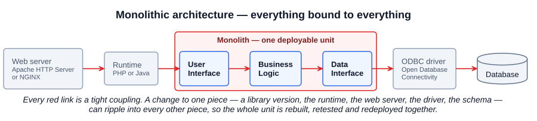
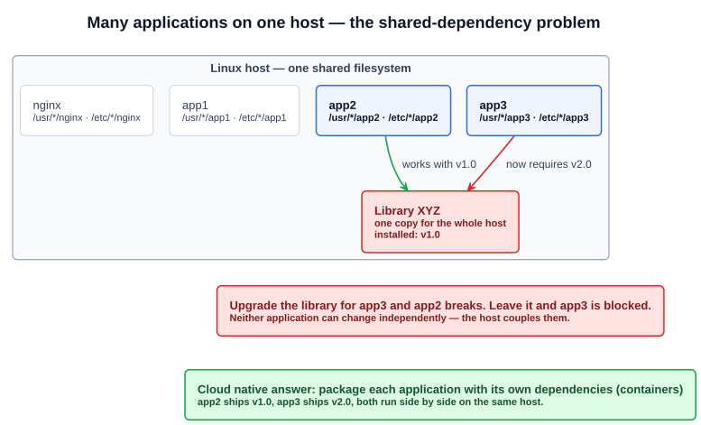
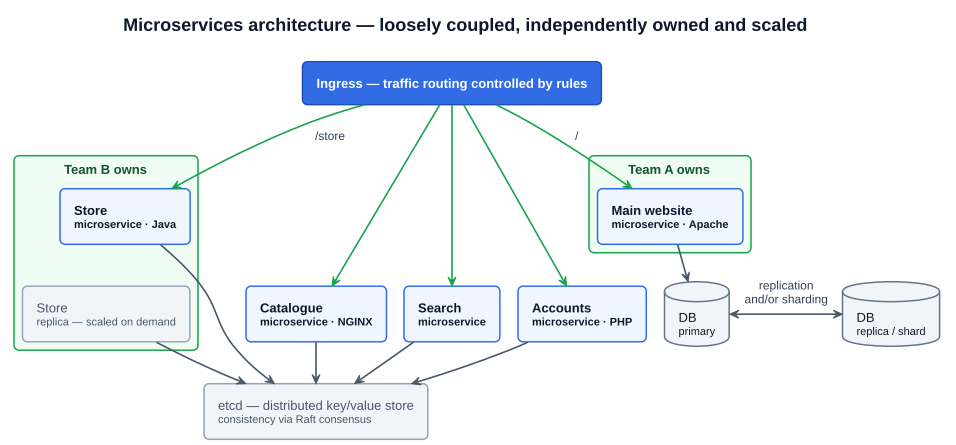

# 01 — Cloud Native Architecture Fundamentals: Monolithic vs Microservices

## 1. What cloud native architecture optimizes for

Cloud native architecture is a set of best practices for designing applications so that they score well on four things at once:

| Goal | What it means in practice |
|---|---|
| **Application availability** | The application keeps serving when components, hosts, or zones fail; changes roll out without downtime |
| **Cost management** | Resources are consumed in proportion to demand — scale up under load, scale down (to zero, if possible) when idle |
| **Efficiency** | Teams ship independently, infrastructure is automated, capacity isn't wasted on parts of the system that aren't busy |
| **Reliability** | Behaviour is predictable and repeatable; failures are contained rather than cascading |

Everything in this section — microservices, autoscaling, serverless, resilience patterns — is a technique in service of those four goals. The starting point is understanding what they replace.

---

## 2. Monolithic architecture (before cloud native)

**Definition.** A monolith is an application that contains all of its functionality in a **single deployable unit**. The CNCF glossary calls it "the simplest starting point" — easy to begin, hard to maintain as it grows.

### 2.1 Tightly coupled by construction

A typical monolith has three layers — **user interface**, **business logic**, **data interface** — compiled, tested, and deployed together, in front of a single database. The layers depend directly on one another, so **a change to one area can potentially affect any other area**. The CNCF glossary's definition of a tightly coupled architecture is exactly this: components are interdependent, and a change in one is likely to impact the others.

The coupling doesn't stop at the application's own layers. The monolith is also bound to the stack underneath it:

- The **UI and business logic** are bound to a specific **runtime** (PHP or Java) and **web server** (Apache HTTP Server or NGINX).
- The **business logic and data interface** are bound to a specific **database** through a driver — classically an **ODBC** (Open Database Connectivity) driver.

Upgrading the runtime, swapping the web server, or changing the database version is therefore never a local change. The whole unit has to be rebuilt, retested, and redeployed.

### 2.2 Installed directly on the host: the shared-dependency problem

Before containers, applications were installed **directly on a machine, on top of the operating system**. Several applications typically share one host, and they all write into the same filesystem — `/usr/*/app1`, `/etc/*/app1`, `/usr/*/app2`, `/etc/*/app2`, and so on, alongside system services such as nginx.

That shared filesystem means shared libraries. The lecture's example:

1. `app2` and `app3` both depend on **Library XYZ**, and the host has **v1.0** installed. Both work.
2. Later, `app3` needs **v2.0** of the same library.
3. There is only **one copy** of the library on the host. Upgrade it and `app2` breaks; leave it and `app3` is blocked.

Neither application can change independently, because the **host** couples them — even though they are otherwise unrelated. This is the problem containers solve: each application ships with its own copy of its dependencies, so `app2` with v1.0 and `app3` with v2.0 run side by side on the same host. Section 3 covers the mechanics.

### 2.3 Consequences

| Concern | In a monolith |
|---|---|
| Scaling | Scale the **entire** application, even if only one function (say, checkout) is under load |
| Deployment | All-or-nothing; one release train for every feature |
| Failure | A bug or resource leak in one module can take down the whole process |
| Technology | One language, one runtime, one web server, one database for everything |
| Team coordination | Every team works in the same codebase and the same release; conflicts and coordination overhead grow with team size |

---

## 3. Microservices architecture (using cloud native approaches)

**Definition.** A microservices architecture breaks an application into **individual, independent services**, each focused on a **specific piece of functionality**, communicating over the network. Each service can be built, deployed, scaled, and owned separately.

The same website from section 2 becomes a user interface in front of several independent services, with the properties below.

### 3.1 Ingress routing — traffic routing is controlled by rules

Requests enter through a single entry point and are routed to the right service by **rules** — typically on the request path or host name. The main website (`/`) goes to one service; `/store` goes to another. In Kubernetes this entry point is the **Ingress** resource, whose docs define it in exactly those words: an API object that manages external access to the services in a cluster, where *traffic routing is controlled by rules defined on the Ingress resource*.

### 3.2 Independent technology choices

Because services only meet at the network, each one can use whatever fits: one service on Apache, another on NGINX, one written in PHP, another in Java. The runtime and web server coupling from the monolith disappears — a service's stack is its own concern. This is sometimes called a **polyglot** architecture.

### 3.3 Independent ownership

Different teams (or different personas — a developer, an SRE, a data engineer) can work on different services without stepping on each other. A change to the store service doesn't require rebuilding, retesting, or redeploying the main website.

### 3.4 Independent scaling

Only the service under load is scaled. If `/store` is busy, run more replicas of the store service; the catalogue and search services stay as they are. This is the direct fix for the monolith's "scale everything" problem and the main lever behind the cost-management goal.

### 3.5 A decoupled data layer

The data layer is separated from the services layer, and it can vary a lot from service to service:

- A service can own its **own database** rather than sharing one schema with everything else.
- Relational stores can be scaled with **replication** (copies for availability and read capacity) and/or **sharding** (splitting data across nodes).
- Services that need small amounts of shared, strongly consistent state can use a **distributed key/value store** such as **etcd**, which keeps its copies in agreement with the **Raft consensus** algorithm. (etcd is also the datastore behind the Kubernetes control plane — Section 4.)

---

## 4. Monolith vs microservices

| | Monolithic | Microservices |
|---|---|---|
| Deployable unit | One | One per service |
| Coupling | Tight — layers and stack interdependent | Loose — services meet only at network APIs |
| Change impact | A change anywhere can affect everything | Contained to the service (and its API consumers) |
| Scaling | Whole application | Per service |
| Failure blast radius | Whole application | One service; others keep running |
| Technology | Single stack | Per service (polyglot) |
| Team ownership | Shared codebase, shared release | Service-aligned teams, independent releases |
| Data | One shared database | Per-service data stores; replication/sharding; distributed stores like etcd |
| Where it wins | Small apps, early stage, small teams — simplest to start | Scale, availability, cost control, large or many teams |
| Cost | Cheap to start; expensive to change and scale later | Operational overhead: networking, service discovery, observability, more things to deploy and monitor |

Microservices are not free. The CNCF glossary is explicit that decomposing a monolith adds operational overhead — more testing, more deployment, more maintenance. The exam can ask for a *disadvantage* of microservices as readily as an advantage.

---

## Exam angle

- "Which of the following describes a **monolithic** application?" — look for *single deployable unit* / *all functionality in one program* / *tightly coupled*. Distractors describe microservices (independent services, independent scaling).
- "In a tightly coupled architecture, a change to one component..." — *is likely to impact other components* and requires coordinated rollouts. That phrase is straight from the CNCF glossary.
- The **shared-library conflict** (two apps, one host, one copy of a library, different version requirements) is the canonical motivation for **containers**. If a question asks what problem containers solve at the host level, this is it — not "making apps cloud native" (see chapter 01-01).
- **Ingress** = traffic routing **controlled by rules** (path- or host-based) to services inside the cluster. A distractor will offer a Service, a NetworkPolicy, or a LoadBalancer as the thing that routes by URL path.
- Microservices advantages the exam expects: **independent scaling, independent deployment, independent technology choice, fault isolation, team autonomy**. Disadvantage: **operational complexity** (networking, observability, more deployments).
- **etcd** = distributed key/value store, consistency via **Raft**. Remember the pairing; Paxos or gossip protocols show up as distractors.
- The four goals of cloud native architecture per the course: **availability, cost management, efficiency, reliability**.

## References

- [Monolithic Apps — CNCF Cloud Native Glossary](https://glossary.cncf.io/monolithic-apps/) — definition plus the pros (simple to start) and cons (hard to maintain, costly to decompose later)
- [Microservices Architecture — CNCF Cloud Native Glossary](https://glossary.cncf.io/microservices-architecture/) — definition and the independent-scaling argument against monoliths
- [Tightly Coupled Architecture — CNCF Cloud Native Glossary](https://glossary.cncf.io/tightly-coupled-architecture/) — "a change in one component will likely impact other components"
- [Ingress — Kubernetes docs](https://kubernetes.io/docs/concepts/services-networking/ingress/) — "Traffic routing is controlled by rules defined on the Ingress resource"
- [etcd](https://etcd.io/) — distributed, reliable key-value store, distributed via the Raft protocol
