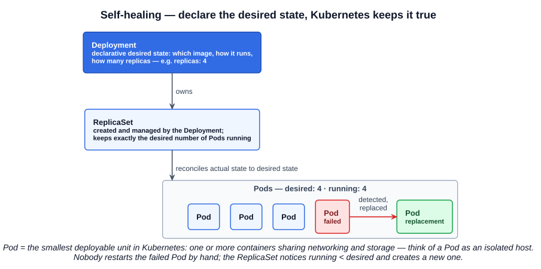
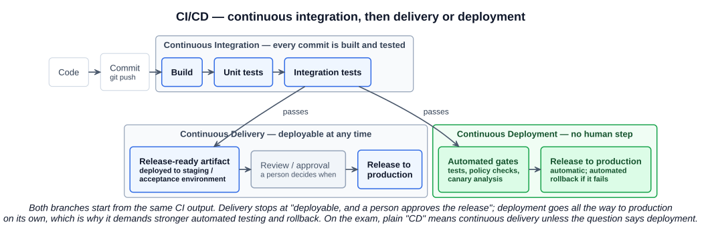
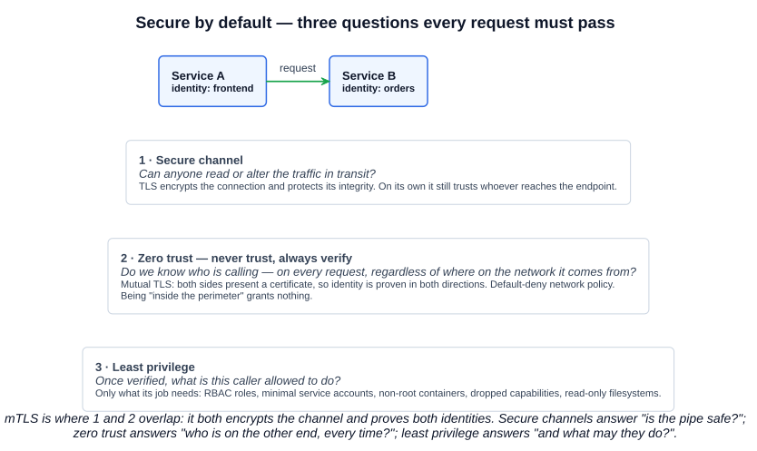

# 02 — Cloud Native Practices

The lecture walks through the practices that turn the goals of chapter 01 (availability, cost, efficiency, reliability) into concrete behaviour: self-healing, automation, CI/CD, secure by default, serverless, and service discovery — framed by four characteristics and, for the exam, four pillars.

## 1. Characteristics of cloud native applications

Cloud native applications harness the cloud to provide four things:

| Characteristic | Definition | Typical patterns |
|---|---|---|
| **Resiliency** | Withstands failures and continues to function, or recovers quickly | Redundancy, failover, graceful degradation, **self-healing** (systems detect and recover from failure automatically — Kubernetes maintaining a desired number of Pod replicas is the canonical example) |
| **Agility** | Ability to quickly build, modify, and deploy | Microservices, continuous delivery pipelines, automation |
| **Operability** | Ease of deploying, running, and managing | Easy to monitor, configure, maintain; automation and **Infrastructure as Code** (Terraform) to minimise toil |
| **Observability** | Ability to understand internal state from external outputs | Logs, metrics, traces (Section 6) |

Memorise the four words: **resilience, agility, operability, observability**. The exam asks for the list, and for which practice supports which characteristic.

---

## 2. Self-healing

Self-healing means the platform detects a failed component and replaces it **without a human**. In Kubernetes it comes from three objects working as a chain of desired state:

| Object | Role |
|---|---|
| **Deployment** | A **declarative** definition of desired state: how the application should run and **how many replicas** should be running |
| **ReplicaSet** | **Managed by the Deployment**; a declarative resource that keeps the **desired number of Pods** running |
| **Pod** | The **smallest deployable unit** you can create and manage in Kubernetes. Provides **shared networking and storage** for one or more containers. Think of a Pod as an isolated host |

The mechanism is reconciliation: the ReplicaSet continuously compares *running* against *desired*. A Pod dies, running drops below desired, a new Pod is created. Nothing is "restarted" by an operator — the desired state is simply re-established. You never create ReplicaSets directly; the Deployment does, which is what lets Deployments also handle rolling updates and rollbacks (Section 5).

---

## 3. Application automation

| | Cloud native |
|---|---|
| Speed and agility | Yes |
| Manual steps | **No** |
| Rapid infrastructure *and* application deployment | Yes |
| Frequent updates | Yes |

The lecture names two tools. Both are automation, but they sit at different layers, and the exam can ask which is which:

| Tool | What it is | Style | CNCF? |
|---|---|---|---|
| **Terraform** (HashiCorp) | **Infrastructure as Code** — provisions cloud resources (VMs, networks, managed Kubernetes clusters) through provider APIs | Declarative: describe the end state, Terraform works out the changes | No |
| **Ansible** (Red Hat) | Configuration management and automation — installs packages, applies config, orchestrates steps across hosts; can also provision | Procedural playbooks (YAML), agentless over SSH | No |

Neither is a CNCF project; both are standard parts of a cloud native toolchain because they remove manual steps, which is the actual point.

---

## 4. CI/CD

The pipeline every commit goes through:

1. **Code** is written and **committed** to version control (git).
2. **Continuous Integration (CI)** — the commit automatically triggers a pipeline that **builds** the application, runs **unit tests**, then **integration tests**. CI's job is to prove, on every change, that the codebase still integrates and works.
3. What happens *after* CI passes is where the two meanings of "CD" split.

### 4.1 Continuous Delivery vs Continuous Deployment

The names are confusing because in everyday English "delivering" software sounds like giving it to users — which is what a deployment does. The jargon uses the words differently, and the difference is one specific thing: **is there a human decision between "tested" and "in production"?**

| | Continuous **Delivery** | Continuous **Deployment** |
|---|---|---|
| After CI passes, the change is… | automatically built, tested, packaged and deployed to a **staging / acceptance environment**. It is proven **deployable** | automatically pushed **all the way to production** |
| Production release is… | a **manual decision** — a person reviews and approves (a button, a ticket, a change window) | **automatic** — no human in the loop |
| "Delivery" / "deployment" means… | the software is *delivered to the business* in a releasable state, at any time | the software is *deployed to users*, every time |
| What it demands | A pipeline you trust enough to say "this could go live right now" | Everything delivery demands, **plus** comprehensive automated testing, automated **rollback**, and progressive rollout (canary, feature flags) — because nobody is watching the button |
| Relationship | Superset of CI | Superset of continuous delivery — "goes a step further by deploying finished software directly to production" (CNCF glossary) |

So to your question — *isn't a deployment just delivering the new version to users?* In plain language yes, and that is exactly why the terms trip people up. The distinction the industry settled on is about **where the automation stops**:

- **Delivery** = the pipeline delivers a *release-ready artifact* to the door. The change is deployable at any moment; *when* to open the door is a business decision (marketing timing, compliance sign-off, a change freeze). The word "delivery" is aimed at the business, not the end user.
- **Deployment** = the pipeline opens the door itself. Every passing change goes live. The word "deployment" is literal.

A useful mental picture: delivery is a parcel packed, labelled, and waiting at dispatch — you choose when it ships. Deployment ships it the moment it is packed.

**For the exam:** the course's rule, and the safer default, is that a bare **"CD"** or **"CI/CD"** means **Continuous *Delivery***. Only read it as Continuous *Deployment* when the question explicitly says "deployment" or describes changes reaching production "automatically" / "without manual intervention". The KCNA domain is even named *Cloud Native Application Delivery*.

---

## 5. Secure by default

Cloud native applications are secure from the start rather than hardened afterwards. The lecture's three checkmarks:

| Practice | One-liner |
|---|---|
| **Zero trust** — "never trust, always verify" | No component is trusted because of *where* it is (inside the network, behind the firewall). Every access is verified. Always use **mutual authentication (mTLS)** between services |
| **Secure channels** | Traffic between components is encrypted and integrity-protected in transit (TLS) |
| **Least privilege** | Every identity gets only the permissions its job needs |

### 5.1 Zero trust vs secure channels — aren't they the same thing?

They overlap in one place, which is why the lecture mentions mTLS right after zero trust, but they answer different questions:

- A **secure channel** answers *"can anyone read or tamper with this traffic while it travels?"* — TLS encrypts the connection and guarantees its integrity. Standard TLS verifies the **server's** identity only; the client is anonymous at the transport layer. A secure channel says nothing about whether the caller should be talking to the service at all.
- **Zero trust** answers *"do we know who is calling, and is it allowed — on this request, regardless of network location?"* The CNCF glossary defines it as an architecture where trust is removed: even inside the network perimeter, components must verify themselves before any communication. It is a **trust model**, not a transport mechanism. Its building blocks are strong workload identity, **mutual TLS** (both sides present a certificate, so both identities are proven), authentication and authorization on **every request**, default-deny networking, short-lived credentials — and least privilege.

Where they meet is **mTLS**: it both encrypts the channel *and* verifies identity in both directions, so one mechanism satisfies both checkmarks. That is the overlap you spotted. Where they differ:

- You can have a secure channel **without** zero trust. The classic perimeter model: TLS from the internet to the load balancer, then plain HTTP inside the "trusted" network, and any workload that can reach the database is allowed to talk to it. The pipe is secure; the trust model is broken.
- Zero trust goes **beyond** channels: authorization decisions, workload/device posture, re-verifying continuously with short-lived tokens. None of that is something TLS does.

So: secure channels are about *how* data moves safely; zero trust is about *whether* the party on the other end is allowed to talk, decided every time; **least privilege** is about *what* they may do once allowed. Verification is part of a secure channel only in the narrow sense that TLS checks the server certificate — zero trust extends verification to both sides, to every request, and to the authorization step, and removes network location from the equation entirely.

### 5.2 How each maps onto Kubernetes

| Practice | Kubernetes / cloud native mechanisms |
|---|---|
| Secure channels | TLS on the API server and etcd; mTLS between services via a service mesh (Istio, Linkerd) |
| Zero trust | mTLS with workload identity (SPIFFE/SPIRE certificates); every API request authenticated and authorized; `NetworkPolicy` default-deny so Pods can only reach what is explicitly allowed |
| Least privilege | RBAC roles scoped to what a workload needs; dedicated ServiceAccounts (and `automountServiceAccountToken: false` when a Pod doesn't need the API); `securityContext` — `runAsNonRoot`, dropped capabilities, `readOnlyRootFilesystem`; Pod Security Standards |

Section 5 covers RBAC and security contexts; the KCSA (the next Kubestronaut cert) goes much deeper.

---

## 6. Speed, efficiency and cost — serverless and scale to zero

The lecture's example is Interflora, a flower-delivery business: demand is extremely spiky — Mother's Day, Father's Day, Valentine's Day — and comparatively quiet the rest of the year. A fixed fleet sized for the peak wastes money for months; a fleet sized for the quiet period falls over on the peak.

Cloud native practice is to **scale with demand in both directions**: add capacity as load arrives, remove it as load falls, and pay only for what is used. Taken to its limit that is **serverless** — the platform runs your code on request and, when there are no requests, runs **nothing**.

**Knative** is the Kubernetes serverless solution the course names: a serverless application layer on top of Kubernetes that can **scale to zero** — no requests, no Pods, no cost — and scale back up when traffic returns. CNCF status: accepted March 2022 as Incubating, **Graduated September 2025** (the course predates this and may still say incubating).

---

## 7. Service discovery

**Definition (CNCF glossary):** service discovery is the process of finding the individual instances that make up a service. In a cloud native environment containers start, stop, and move constantly, so addresses can't be hard-coded.

The lecture's three checkmarks:

- **Automatic detection** of services on a network.
- **Minimise manual configuration** requirements.
- **Leverage cloud native tooling** — Kubernetes uses **environment variables and DNS**.

How Kubernetes does it:

| Mechanism | How it works | Caveat |
|---|---|---|
| **DNS** | Every Service gets a stable DNS name (`<service>.<namespace>.svc.cluster.local`) resolved by the cluster DNS (CoreDNS). Clients just use the name | The recommended method |
| **Environment variables** | When a Pod starts, the kubelet injects `<SERVICE>_SERVICE_HOST` / `<SERVICE>_SERVICE_PORT` variables for every Service that exists at that moment | **The Service must exist before the Pod is created**; Services created later are not visible this way |

---

## 8. The four pillars of cloud native architecture

The course's further-study text frames cloud native architecture as founded on four pillars, and gives a mnemonic: **Morning Coffee Delivers Caffeine Delight** — **M**icroservices, **C**ontainerisation, **D**evOps, **C**ontinuous **D**elivery.

| Pillar | Definition |
|---|---|
| **Microservices architecture** | Break the application into loosely coupled, independently deployable components, each with a single responsibility → agility, scalability, resilience (chapter 01) |
| **Containerisation** | Encapsulate an application with its dependencies into a container that runs uniformly across environments → isolation, consistency, efficiency (Section 3) |
| **DevOps** | Collaborative approach combining software development (Dev) and IT operations (Ops); emphasises automation, monitoring, and collaboration across teams → efficiency, reliability, speed of delivery |
| **Continuous Delivery** | Code changes are automatically built, tested, and prepared for release to production → faster release cycle, less risk and downtime |

Note that the pillar is Continuous **Delivery** — consistent with the CD rule in section 4.

---

## Exam angle

- The four **characteristics**: resilience, agility, operability, observability. The four **pillars**: microservices, containerisation, DevOps, continuous delivery (MCDC). Don't mix the two lists — a distractor will put "containerisation" among the characteristics or "observability" among the pillars.
- **Self-healing chain**: Deployment (declares desired state + replica count) → ReplicaSet (managed by the Deployment, maintains Pod count) → Pod (smallest deployable unit; shared network and storage for its containers). A question may ask which object *directly* maintains the number of Pods — the answer is the ReplicaSet, not the Deployment.
- **CI vs CD**: CI = build + test every commit. Continuous **Delivery** = deployable at any time, human approves production. Continuous **Deployment** = automatic to production, no human. Bare "CD" on the exam → Delivery.
- **Zero trust** = "never trust, always verify"; no implicit trust from network location; mTLS for mutual authentication. **mTLS** = both sides validated (vs one side in plain TLS). Distractors: "trust everything inside the firewall", "VPN access equals trust".
- **Least privilege** = minimum permissions needed; in Kubernetes that is RBAC + scoped ServiceAccounts + security contexts.
- **Knative** = Kubernetes serverless, **scale to zero**. If offered alongside Kubernetes autoscaling options, Knative is the one that reaches zero.
- **Service discovery in Kubernetes** = **DNS and environment variables**; DNS preferred; env vars only see Services that existed before the Pod started.
- **Terraform** = infrastructure as code, declarative. **Ansible** = configuration management/automation. Neither is a CNCF project.

## References

- [Continuous Delivery](https://glossary.cncf.io/continuous-delivery/), [Continuous Deployment](https://glossary.cncf.io/continuous-deployment/) — CNCF glossary; deployment "goes a step further… deploying finished software directly to production"
- [Zero Trust Architecture](https://glossary.cncf.io/zero-trust-architecture/), [Mutual TLS](https://glossary.cncf.io/mutual-transport-layer-security/) — CNCF glossary; trust removed even inside the perimeter; mTLS validates both sides
- [Service Discovery](https://glossary.cncf.io/service-discovery/) — CNCF glossary definition
- [Discovering services — Kubernetes docs](https://kubernetes.io/docs/concepts/services-networking/service/#discovering-services) — environment variables vs DNS, and the Service-before-Pod caveat
- [Pods — Kubernetes docs](https://kubernetes.io/docs/concepts/workloads/pods/) — "the smallest deployable units of computing that you can create and manage in Kubernetes", with shared storage and network
- [Knative — CNCF project page](https://www.cncf.io/projects/knative/) — serverless application layer for Kubernetes; incubating 2022, graduated 2025
