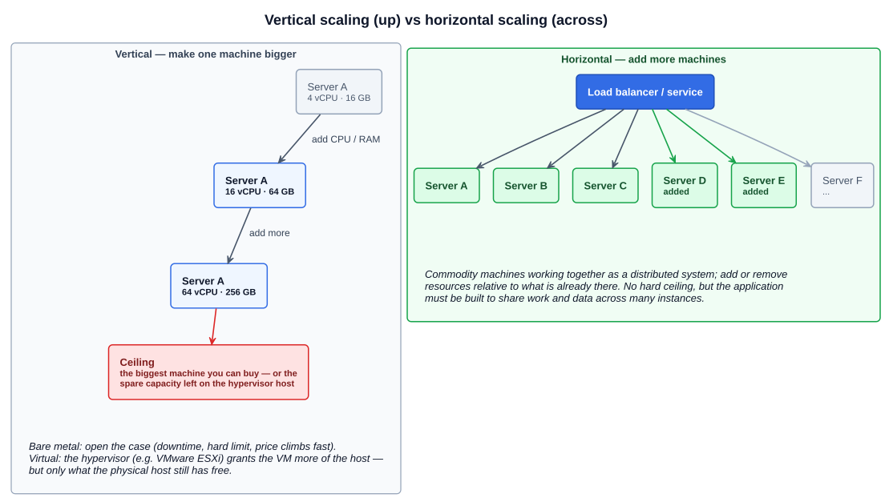
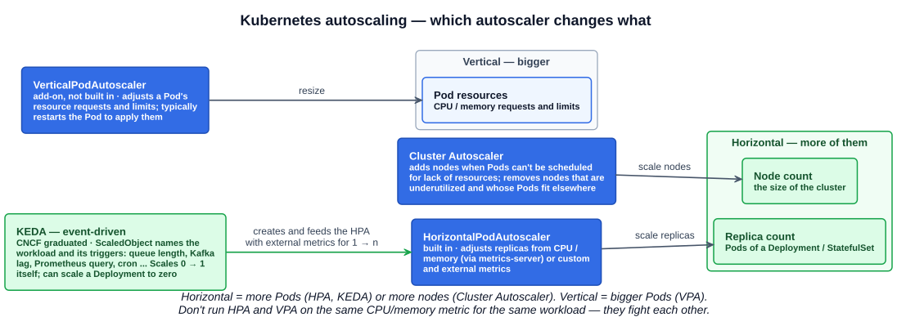

# 03 — Autoscaling

## 1. Definition

**Autoscaling** is a pattern for the **automatic scaling of infrastructure or application components according to metrics or other requirements** — capacity follows demand without a person adding or removing resources.

Two words the lecture is careful to separate, because the exam can be too:

| Word | Meaning |
|---|---|
| **Automatic** | Describes anything that works independently |
| **Automated** | To make a process independent of human intervention |

Autoscaling is an **automated** process (people designed it so no person is needed) that makes scaling **automatic** (it happens on its own). The lecture's own summary, three alliterations long: autoscaling *accelerates application availability and access*; *always add automation as an appropriate action*; *approach anywhere autoscaling acts as an advantage*.

---

## 2. Three ways to decide when to scale

| Type | Trigger | Example | Trade-off |
|---|---|---|---|
| **Reactive** | Circumstances in the environment — a metric crosses a threshold (CPU, memory, requests/second, queue length) and the system reacts | CPU across the fleet passes 70%, add instances; drops under 30%, remove them | Simplest and most common, but it responds *after* demand has arrived, so there is a lag while new capacity starts |
| **Scheduled** | A known time | An e-commerce site pre-scales for Black Friday; a batch system scales up for the end-of-month run and down for the weekend | Capacity is ready before the demand, but only for demand you can predict from a calendar |
| **Predictive** | A forecast from AI / machine learning over historical metrics | The platform learns the daily and weekly traffic curve and scales ahead of it | Ahead of demand without a manual schedule, at the cost of needing history and a model |

Reactive autoscaling is "scale according to workload": as the request curve rises the number of servers rises with it, and as the curve falls servers are removed. Kubernetes' built-in HPA is reactive; KEDA's `cron` scaler gives you scheduled; predictive is typically a cloud-provider feature layered on top.

---

## 3. Vertical vs horizontal scaling

### 3.1 Vertical — scaling *up*

Add resources — CPU, memory, storage — to a **single machine** so that one machine can do more work.

- **Bare metal:** physically add RAM or CPUs. Needs downtime, is limited by the chassis, and cost climbs steeply toward the top of the range.
- **Virtual (the more common meaning today):** a **hypervisor** such as VMware ESXi or KVM allocates more vCPU or memory to a virtual machine, sometimes without a reboot. This is what "vertical scaling" usually refers to in practice.

The catch you spotted is real: a VM can only be given what the **physical host still has free**. The hypervisor moves the ceiling, it doesn't remove it — the VM is capped by the host, and the host is capped by the biggest server you can buy.

### 3.2 Horizontal — scaling *across*

Use **commodity machines working together as a distributed system**. To do more work, add machines; to do less, remove them — **the addition or removal of resources in relation to existing resources**. Six ordinary servers behind a load balancer instead of one enormous one.

The lecture's four points on horizontal scaling:

| | |
|---|---|
| **Hardware agnostic** | Some horizontal-scaling solutions work on whole clusters — adding full compute nodes; others are more specific, scaling on CPU or memory demand at the workload level |
| **Cloud native** | Horizontal scaling is used **more than vertical** in cloud native systems, but there are still cases for either or both |
| **Automation** | A key component and consideration when scaling — a horizontal fleet is only useful if adding and removing members is automated |
| **Testing** | Critical when building autoscaling. Horizontal scaling **increases the complexity of data sharing**: more instances means more routes and more concurrency, so the application must be tested under that concurrency, not just for correctness on one node |

### 3.3 Side by side

| | Vertical (up) | Horizontal (across / out) |
|---|---|---|
| What changes | Size of one machine | Number of machines |
| Ceiling | Hard — biggest machine, or free capacity on the host | Practically none; add another node |
| Cost curve | Steep at the top end | Roughly linear, commodity hardware |
| Application changes | None — the app just gets a bigger box | Must be designed to distribute: stateless instances or shared/replicated state |
| Availability | One machine is still one failure domain | Loss of a node is absorbed by the rest |
| Downtime to scale | Often (bare metal), sometimes (VM hot-add) | None — instances join and leave |
| Kubernetes analogue | **VPA** resizes a Pod's requests/limits | **HPA / KEDA** add Pods; **Cluster Autoscaler** adds nodes |
| Fits | Databases and legacy apps that can't be distributed; quick wins on a VM | Cloud native services — the default |

---

## 4. Autoscaling in Kubernetes

Kubernetes autoscaling works at three levels — nodes, replicas, and Pod resources — and there is a dedicated autoscaler for each. The exam's study tips single out all four below.

| Autoscaler | Level | What it changes | Built in? |
|---|---|---|---|
| **Cluster Autoscaler** | Cluster (nodes) | Automatically adjusts the **size of the cluster** when (a) there are Pods that **fail to run owing to insufficient resources**, or (b) there are **nodes that have been underutilized** and their Pods can be placed on other existing nodes | Separate component from the `kubernetes/autoscaler` project, integrated with the cloud provider's node groups |
| **HorizontalPodAutoscaler (HPA)** | Workload (replicas) | **Scales the number of replicas** of a Deployment, StatefulSet, or ReplicaSet to match observed utilization — CPU and memory via the metrics-server, or custom/external metrics | Yes — a core API object and controller |
| **VerticalPodAutoscaler (VPA)** | Pod (resources) | **Scales the resource requests and limits** of a Pod's containers, based on observed usage; typically has to restart the Pod to apply the new values | No — an add-on you deploy, also from `kubernetes/autoscaler` |
| **KEDA** | Workload (replicas), event-driven | Scales on **events** rather than resource usage — the length of a queue, Kafka consumer lag, a Prometheus query, a cron schedule. Can **scale a Deployment to zero** | No — a CNCF **graduated** project (Aug 2023) |

### 4.1 HPA vs VPA

| | HPA | VPA |
|---|---|---|
| Direction | Horizontal | Vertical |
| Changes | Replica **count** | Pod **requests and limits** |
| Result | More or fewer Pods | Same number of Pods, each bigger or smaller |
| Applied how | Live — the ReplicaSet adds/removes Pods | Usually by evicting and recreating the Pod with new values |
| Ships with Kubernetes | Yes | No (add-on) |
| Both need | The **metrics-server** (for CPU/memory metrics) | |

Don't run HPA and VPA against the same workload on the same metric (CPU or memory): one adds Pods while the other resizes them and the two fight. Use VPA to right-size, HPA on a different metric, or KEDA.

### 4.2 KEDA and the ScaledObject

**KEDA** (Kubernetes Event-Driven Autoscaling) adds event-based scaling on top of what Kubernetes already has, rather than replacing it:

- A **`ScaledObject`** is the KEDA resource that says *which* workload to scale (a Deployment or StatefulSet), *what* the triggers are, and the min/max replicas. A `ScaledJob` does the same for batch work — one Job per queue message.
- **Scalers / triggers** are connectors to external sources: message queues (Kafka, RabbitMQ, AWS SQS, Azure Service Bus), Prometheus queries, databases, a `cron` schedule, and many more.
- **How it scales:** KEDA handles **0 → 1** itself (waking an idle Deployment when the first event arrives) and creates and manages an **HPA** fed with the external metric for **1 → n**.
- **Scale to zero:** because triggers are external events, KEDA can take a Deployment to **zero replicas** when there is nothing to process — something the plain HPA cannot do. (Scale-to-zero is not possible with CPU/memory triggers: with no Pods running there is nothing to measure.)

Knative (chapter 02) and KEDA both reach zero; the difference is that Knative is a serverless *application platform* with request-driven scaling and eventing, while KEDA is purely an *autoscaler* you attach to ordinary Deployments.

---

## Exam angle

- **Vertical = bigger machine** (add CPU/RAM to one host; today usually a hypervisor giving a VM more of the host). **Horizontal = more machines** ("scaling across", commodity hardware, distributed system). Cloud native favours horizontal.
- The cost of horizontal scaling is **complexity of data sharing and concurrency**, hence the emphasis on testing. The cost of vertical scaling is the **ceiling** and price.
- **Reactive** = metric crosses a threshold; **scheduled** = known time (Black Friday); **predictive** = AI/ML forecast. A question describing "scale before the sale starts" is scheduled, not reactive.
- **Cluster Autoscaler** — memorise both halves of its definition: adds nodes when Pods can't be scheduled for **insufficient resources**; removes **underutilized** nodes whose Pods fit elsewhere. It scales *nodes*, never Pods.
- **HPA scales replicas; VPA scales requests and limits.** HPA is built in; VPA is an add-on. Both rely on the metrics-server for resource metrics.
- **KEDA**: event-driven, **ScaledObject**, external triggers, **scale to zero**, CNCF graduated. If a question asks how to scale on queue length or to zero, the answer is KEDA, not HPA.
- HPA works with Deployments and StatefulSets; the exam only needs that high-level pairing (chapter-level detail on those objects comes in Section 5).
- **Automatic** = works independently; **automated** = a process made independent of human intervention.

## References

- [Autoscaling Workloads — Kubernetes docs](https://kubernetes.io/docs/concepts/workloads/autoscaling/) — horizontal vs vertical definitions, HPA, VPA (add-on; restarts Pods), event-driven (KEDA), scheduled, and cluster autoscaling in one page
- [Cluster Autoscaler README — kubernetes/autoscaler](https://github.com/kubernetes/autoscaler/blob/master/cluster-autoscaler/README.md) — the two conditions under which it resizes the cluster
- [KEDA Concepts](https://keda.sh/docs/concepts/) — ScaledObject/ScaledJob, scalers, 0 → 1 vs 1 → n, scale to zero
- [KEDA — CNCF project page](https://www.cncf.io/projects/keda/) — sandbox Mar 2020, incubating Aug 2021, graduated Aug 2023
