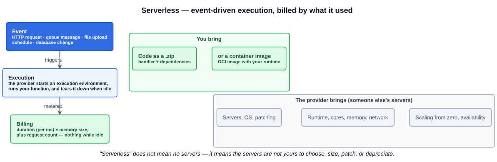
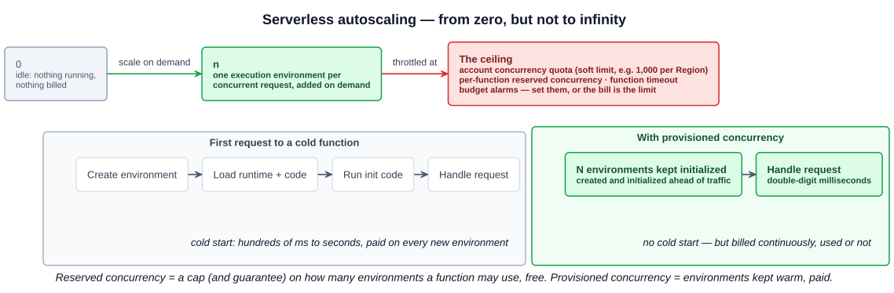
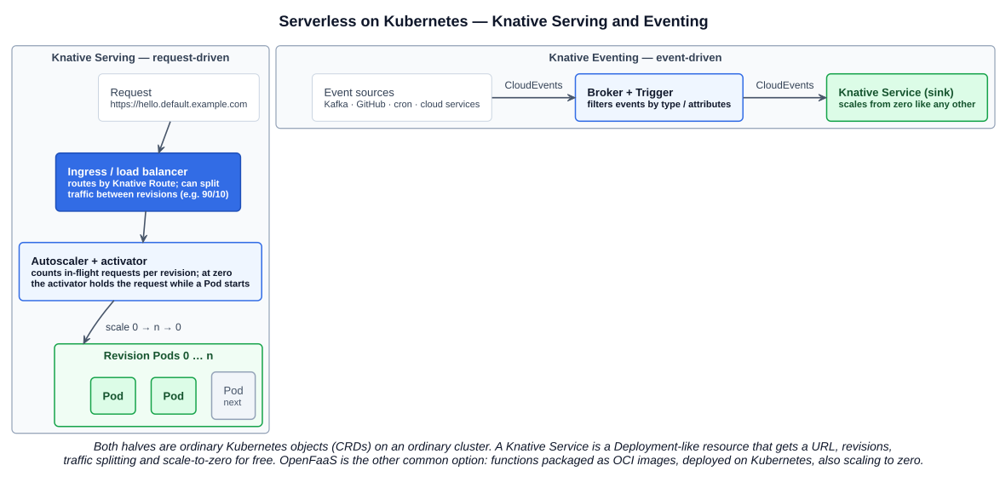

# 04 — Serverless

## 1. What serverless means

**Serverless does not mean there are no servers.** It means the servers are **someone else's** — the public cloud provider's, or a platform team's on top of Kubernetes — and their existence is hidden from you. You never choose the number of cores, the memory, the networking, or the connectivity, and you never patch, replace, or depreciate the hardware. That is the burden serverless removes: server maintenance and capital cost.

What you interact with instead is the **code** (or a **container image**) and the **events** that should run it.

The model is event-driven:

| Stage | What happens |
|---|---|
| **Event** | Something triggers the function — an HTTP request, a message on a queue, a file landing in storage, a schedule, a database change |
| **Execution** | The provider starts an execution environment, runs your code, and tears it down when it goes idle |
| **Billing** | You pay for what the execution used — duration (per millisecond) × memory size, plus a per-request charge. Idle costs nothing |

Serverless is the extreme end of the scaling story in chapter 03: not just "scale with demand" but **scale to zero** — no requests, nothing running, nothing billed.

---

## 2. AWS Lambda — the reference FaaS

Every major cloud has an equivalent (Azure Functions, Google Cloud Functions / Cloud Run), but the course uses **AWS Lambda** as the example of **FaaS — Function as a Service**: you upload a function, the platform runs it per event.

Two ways to ship code to Lambda:

- **A .zip file** containing the handler and its dependencies.
- **A container image** (OCI image), which is how you bring your own runtime or larger dependency sets — and which ties Lambda back to the container story of Section 3.

### 2.1 The four promises on the Lambda product page

The lecture walks the four boxes from AWS's own landing page. Each maps to a cloud native goal from chapter 01:

| Promise | What it means | Goal it serves |
|---|---|---|
| **Run code without provisioning or managing infrastructure** — write and upload a .zip or container image | No servers, VMs, or clusters to size or maintain | Efficiency, operability |
| **Automatically respond to code execution requests at any scale** — from a dozen events per day to hundreds of thousands per second | Scaling is native and automatic; each concurrent request gets its own execution environment | Availability, scalability |
| **Save costs by paying only for the compute time you use — per millisecond** — instead of provisioning for peak capacity | Billing follows execution, not reserved capacity; the Free Tier includes 1 million requests a month | Cost management |
| **Optimize execution time and performance with the right function memory size; respond in double-digit milliseconds with Provisioned Concurrency** | Memory is the one knob you turn (CPU scales with it); provisioned concurrency removes cold-start latency | Reliability, performance |

### 2.2 Cold starts and provisioned concurrency

When a request arrives and no execution environment is available, Lambda has to **create one**: allocate it, load the runtime and your code, and run any initialization code before the handler executes. That is a **cold start**, and it costs anywhere from a couple of hundred milliseconds to several seconds depending on the runtime (JVMs are the slow end). Subsequent requests reuse the warm environment until it idles out.

Lambda offers two concurrency controls, and the names are easy to confuse:

| | **Reserved concurrency** | **Provisioned concurrency** |
|---|---|---|
| What it is | A **cap and a guarantee** on how many concurrent environments a function may use; that capacity is set aside for it and no other function can take it | A number of execution environments **pre-initialized and kept warm** for a function version or alias |
| Solves | Protecting downstream systems (e.g. database connections) and ensuring critical functions always have capacity | **Cold-start latency** — requests are served in double-digit milliseconds because init already happened |
| Cost | Free | **Billed continuously**, whether or not requests arrive |
| Typical use | Any function | Latency-sensitive, interactive workloads (web and mobile APIs); rarely worth it for asynchronous pipelines |

Provisioned concurrency is therefore a deliberate trade: you give up part of "pay only for what runs" to buy predictable latency. It can be scheduled (warm up before the morning peak) or driven by utilization through Application Auto Scaling.

---

## 3. Serverless autoscaling — native, but bounded

Autoscaling is **native to most serverless offerings**: the platform scales from **zero** toward, in theory, **unlimited** concurrency as events arrive. Two things stop it being unlimited in practice, and the lecture's second slide — the figure with crossed arms — is the warning:

1. **Platform limits.** Accounts have a **concurrency quota** (Lambda's classic default is 1,000 concurrent executions per Region — a soft limit you can raise); functions have a maximum **timeout**; per-function reserved concurrency caps a single function. Hit a limit and requests are throttled.
2. **Your bill.** Everything that runs is billed, and the platform will happily run a great deal. A retry loop, a recursive trigger (a function writing to the bucket that triggers it), or an unexpected traffic spike turns "pay for what you use" into a very large invoice — the runaway-serverless-bill stories are real. **Keep the workload and the billing in mind together**: set budgets and alarms, set reserved concurrency as a ceiling on anything that can fan out, and put timeouts on everything.

---

## 4. Cloud native serverless — running it on Kubernetes

The cloud provider's FaaS is convenient but proprietary. The cloud native answer is to get the same developer experience — deploy code, get a URL, scale to zero — on **any** Kubernetes cluster. The course names two projects.

| | **Knative** | **OpenFaaS** |
|---|---|---|
| What it is | A Kubernetes-based platform providing the middleware for building, deploying, and managing **serverless workloads** | A serverless platform for deploying **functions** to Kubernetes |
| Unit of deployment | A **Knative Service** — a Deployment-like resource that gets a URL, immutable **revisions**, and **traffic splitting** between them | A **function**, packaged as a portable **OCI image** |
| Scaling | Request-driven; **scale to zero** and back | Scale to zero when idle |
| Eventing | **Knative Eventing** — sources, brokers, triggers, delivered as **CloudEvents** | Event connectors (Kafka, cron, etc.) |
| Governance | CNCF **Graduated** (Sep 2025; incubating since Mar 2022) | Independent — OpenFaaS Ltd; Community Edition and a commercial Pro edition. On the CNCF landscape, **not** a CNCF project |

### 4.1 How Knative Serving scales a web application

A Knative Service is an ordinary web application (any container that listens on a port) with the serverless behaviour bolted on by the platform:

1. A request hits the cluster's **ingress / load balancer**, which routes it by the Knative **Route** — and can split traffic between revisions (90% to the current revision, 10% to the new one).
2. The **autoscaler** watches in-flight requests per revision and sets the number of Pods. At **zero** Pods the **activator** holds the request, triggers a scale-up, and forwards it once a Pod is ready.
3. Traffic drops, the Pods drain, and the revision scales back to **zero**.

Underneath, it is all standard Kubernetes: the Service, Route, Configuration, and Revision objects are CRDs, the Pods are Pods, and the load balancer is whatever ingress layer the cluster has (Kourier, Istio, Contour). That is why you can run it on a kind cluster on a laptop.

---

## 5. CloudEvents — standardising event data

Serverless is event-driven, and every event source historically had its own envelope: a Kafka message, an S3 notification, a GitHub webhook, and a cron tick all describe "something happened" differently. **CloudEvents** is a **specification for describing event data in a common way**, so that producers, brokers, and consumers can be mixed without custom glue.

| | |
|---|---|
| Describes event data in a common format | A small set of required attributes — `id`, `source`, `specversion`, `type` — plus optional ones (`time`, `subject`, `datacontenttype`) around the payload |
| Hosted by the CNCF | **Graduated** (Jan 2024; accepted May 2018, incubating Oct 2019); organised through the CNCF Serverless Working Group |
| SDKs | Go, Java, JavaScript, Python, Ruby, Rust, C#, PHP, PowerShell |
| Protocol bindings | AMQP, HTTP, Kafka, MQTT, NATS, WebSockets |
| Event formats | JSON, Avro, Protobuf, XML |

Knative Eventing speaks CloudEvents natively — that is the "CloudEvents" label on the arrows in the diagram above — and KEDA's and other tools' event integrations increasingly do too.

---

## Exam angle

- "Serverless means..." — the correct framing is **the servers are managed by the provider and abstracted away; you deploy code or an image and pay per execution**. "No servers are involved" is the distractor.
- **FaaS** = Function as a Service; **AWS Lambda** is the example; code goes up as a **.zip or a container image**.
- **Billing** = per request + duration in **milliseconds × memory**; idle costs nothing; provisioned concurrency is the exception (billed while warm).
- **Provisioned concurrency** = pre-initialized environments to eliminate **cold starts** (double-digit ms). **Reserved concurrency** = a cap/guarantee on a function's concurrency, free. Don't swap them.
- Serverless autoscaling is native and starts from **zero**, but is bounded by **quotas, timeouts, and your budget**.
- **Knative** = Kubernetes serverless platform (Serving + Eventing), CNCF **graduated**, **scale to zero**. **OpenFaaS** = functions as OCI images on Kubernetes, **not** a CNCF project. A question asking for the CNCF serverless project wants Knative.
- **CloudEvents** = the CNCF **specification for describing event data in a common format**; graduated; SDKs in many languages; bindings for AMQP, HTTP, Kafka, MQTT, NATS. It is a *spec*, not a message broker — Kafka or NATS as "the CNCF eventing standard" is the distractor.

## References

- [AWS Lambda — provisioned concurrency](https://docs.aws.amazon.com/lambda/latest/dg/provisioned-concurrency.html) — reserved vs provisioned concurrency, cold starts, double-digit millisecond response, billing while idle
- [Knative documentation](https://knative.dev/docs/) — Serving (request-driven autoscaling from zero, revisions, traffic splitting) and Eventing (sources, brokers, triggers, CloudEvents)
- [Knative — CNCF project page](https://www.cncf.io/projects/knative/) — incubating Mar 2022, graduated Sep 2025
- [CloudEvents](https://cloudevents.io/) and [CloudEvents — CNCF project page](https://www.cncf.io/projects/cloudevents/) — the specification, SDK languages, and the maturity timeline (graduated Jan 2024); bindings and formats listed in the [spec README](https://github.com/cloudevents/spec/blob/main/README.md)
- [OpenFaaS](https://www.openfaas.com/) — functions as OCI images on Kubernetes; independently governed
