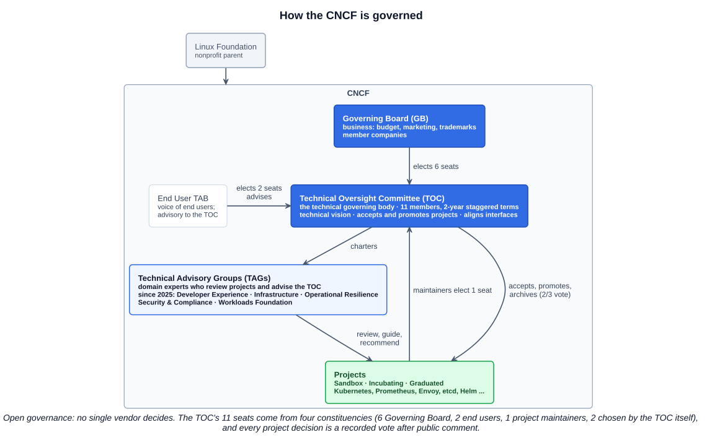
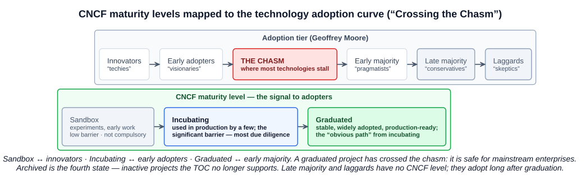
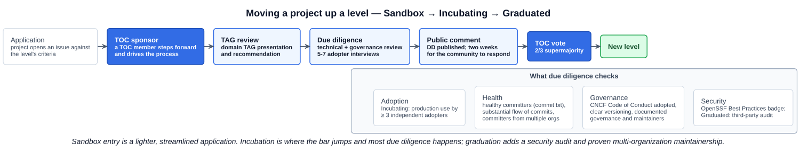

# 05 — Community and Governance

## 1. Why the CNCF governs projects

The CNCF is the vendor-neutral home for Kubernetes, Prometheus, Envoy, etcd, Helm, and well over a hundred other projects. "Home" means more than hosting the code: the foundation provides **open governance** — no single company decides a project's direction, project levels are earned through a documented process, and every significant decision is a recorded vote after public comment. That neutrality is why competitors (Google, AWS, Microsoft, Red Hat, and the rest) are willing to build on the same projects.

---

## 2. How the CNCF is structured

The CNCF is part of the **Linux Foundation**. Inside it, four bodies matter for the exam:

| Body | Role | Composition |
|---|---|---|
| **Governing Board (GB)** | Business side: budget, marketing, trademarks, brand compliance, fundraising | Representatives of member companies |
| **Technical Oversight Committee (TOC)** | *The technical governing body*: defines the technical vision, **accepts new projects and moves them between levels**, aligns interfaces across projects, defines common practices | **11 members**, two-year staggered terms — 6 elected by the GB, 2 by end users, 1 by project maintainers, 2 by the TOC itself |
| **End User Technical Advisory Board (TAB)** | "The voice of end users" — feedback to the TOC on direction and adoption; oversees end-user groups. Advisory only | Elected from end-user member organizations |
| **Technical Advisory Groups (TAGs)** | Domain experts chartered by the TOC who review projects, guide sandbox applicants, and advise on their area | Open community groups with TOC liaisons |

The split to remember: the **GB handles business**, the **TOC handles technology**. A question about who approves a new project or a graduation is asking about the TOC.

---

## 3. Project maturity levels and "Crossing the Chasm"

Every CNCF project has a **maturity level**: **Sandbox**, **Incubating**, or **Graduated** (plus **Archived** for projects no longer in active development). The CNCF's own description says the level "is a signal by CNCF as to what sorts of enterprises should be adopting different projects", and it maps the three levels onto the tiers of Geoffrey Moore's *Crossing the Chasm* technology-adoption curve:

| CNCF level | Adoption tier | Who adopts | What it means |
|---|---|---|---|
| **Sandbox** | Innovators — "techies" | People who will try anything new | Experiments and early work; a low-barrier, low-reward entry point that is **not a compulsory step** |
| **Incubating** | Early adopters — "visionaries" | Organizations willing to bet on a promising project | Used successfully in production by a few; the **significant barrier** — this is where the majority of due diligence happens |
| *— the chasm —* | | | Where most technologies stall: the gap between visionaries and pragmatists |
| **Graduated** | Early majority — "pragmatists" | Mainstream enterprises that want proven technology | Stable, widely adopted, production-ready; the "obvious path" from incubation |
| *(none)* | Late majority — "conservatives"; Laggards — "skeptics" | Adopt only once everyone else has | No CNCF level corresponds |

A graduated project has, in the book's terms, crossed the chasm. That is the practical meaning of the level: safe for the pragmatists.

### 3.1 What the Sandbox is for

The Sandbox is the entry point for early-stage projects, with four stated goals:

1. Encourage **public visibility** of experiments or early work that could grow into an incubation-level project.
2. Facilitate **alignment with existing projects** — if, and only if, the project wants it.
3. **Nurture** projects (for example through CNCF service-desk requests).
4. Remove **legal and governance obstacles** to adoption and contribution by requiring CNCF legal, Code of Conduct, and IP policy compliance.

Incubating projects additionally get access to all CNCF services for projects and a presence at KubeCon + CloudNativeCon.

---

## 4. Moving up a level

### 4.1 What the TOC looks for

Projects increase their maturity by demonstrating **sustainability** to the TOC:

- **Adoption** — for Incubating, documented successful production use by **at least three independent adopters**; for Graduated, a public adopters list and broader use.
- **A healthy rate of changes** — a substantial, ongoing flow of commits and merged contributions.
- **A healthy number of committers** (people with the commit bit), and for Graduated, **committers from multiple organizations**, so no single employer can kill the project.
- The **CNCF Code of Conduct** adopted.
- The **OpenSSF Best Practices Badge** achieved and maintained (older material calls it the CII — Core Infrastructure Initiative — badge; same thing, renamed).
- A **clear versioning scheme**; specifications must have at least one public reference implementation.
- For Graduated: a **third-party security audit**, documented governance and maintainer lifecycle.

### 4.2 The process

1. The project **applies** against the level's criteria.
2. A **TOC sponsor** — a TOC member — steps forward and drives the application.
3. The relevant **TAG** presents the project and gives a recommendation.
4. **Due diligence**: the sponsor evaluates the project against the criteria and interviews **5–7 adopters**.
5. The due diligence is published for **two weeks of public comment**.
6. The **TOC votes** — a **two-thirds supermajority** is needed.
7. The project moves to the new level.

Sandbox entry is lighter: a streamlined application through the sandbox-applications repository, reviewed by the TOC with TAG input, without the full due-diligence cycle.

---

## 5. Elections and voting

The course's phrase is "cloud native discussion reconciliation": disagreements are settled by **discussion, then a vote**, and the vote is public. This applies at every layer:

- **TOC seats** are elected by their constituencies (GB, end users, project maintainers, the TOC) for two-year staggered terms — no seat is permanent.
- **Project decisions** (accept, promote, archive) are TOC votes after public comment: two-thirds supermajority for level changes.
- **Projects themselves** are expected to have documented governance — how maintainers are added and removed, how decisions are made — as part of graduating.

---

## 6. Terminology: TOC, SIG, TAG — and why the name changed twice

| Acronym | Expansion | What it is |
|---|---|---|
| **TOC** | Technical Oversight Committee | The CNCF's technical governing body (section 2) |
| **SIG** | Special Interest Group | In **Kubernetes**: the groups that build and own parts of the project (SIG Network, SIG Node, SIG Apps…). In the **CNCF**, 2019–2021: the *former* name of the TAGs |
| **TAG** | Technical Advisory Group | CNCF-wide domain groups reporting to the TOC |

### 6.1 What TAGs do

- Provide **technical guidance** across specific domains.
- **Guide and support new projects** through the onboarding of Sandbox proposals.
- **Support and review** CNCF projects transitioning from Sandbox to Incubation and beyond (the "TAG review" step in section 4).
- **Coordinate the needs and requirements** of users and participants within the TAG's space.

### 6.2 From SIG to TAG to the 2025 restructure

| When | What | Why |
|---|---|---|
| **June 2019** | With the CNCF at 37 projects, the TOC created **CNCF SIGs**, modelled on the Kubernetes SIG structure, to give it domain expertise for reviewing projects | The TOC's 11 members could not evaluate every project in every domain themselves |
| **February 2021** | CNCF SIGs renamed **TAGs** (Technical Advisory Groups) by TOC vote | Two different things were called "SIG": Kubernetes SIGs *build* Kubernetes; CNCF SIGs *advise* the TOC. Kubernetes used the term first, so it kept it. "Working Group" was rejected as the new name because WGs already existed too |
| **2021–2025** | Domain TAGs: **App Delivery, Contributor Strategy, Environmental Sustainability, Network, Observability, Runtime, Security, Storage** | This is the list the course slide shows (Storage, Security, App Delivery, Network, Observability, Runtime, Contributor Strategy) |
| **May 2025** | TOC restructured into five TAGs — **Developer Experience, Infrastructure, Operational Resilience, Security and Compliance, Workloads Foundation** — plus three permanent TOC SubProjects (**Contributor Strategy and Advocacy, Mentoring, Project Reviews**) and a time-boxed AI initiative | 223 projects contributed (16 archived); the eight-TAG structure did not scale. New leadership seated 2 June 2025 |

Expect the exam to test the expansions (TOC, SIG, TAG) and possibly a pre-2025 TAG name; it is unlikely to test the 2025 restructure yet. Know both lists.

---

## 7. Where the community meets

Governance is the formal side; most participation happens at events and through community programs.

| | What it is | How to take part |
|---|---|---|
| **KubeCon + CloudNativeCon** | The CNCF's flagship conference, run by the Linux Foundation several times a year (North America, Europe, China, India, Japan). Project maintainers, end users, and vendors in one place; where graduations and new projects are announced | Attend, or submit a talk through the **CFP** (call for proposals) months ahead; the CNCF also funds scholarships |
| **Kubernetes Community Days (KCDs)** | Regional, **community-organised**, one- to two-day events supported by the CNCF — grown from 12 in 2021 to dozens a year. Since 2026 they are tiered (first-time up to 200 attendees, tier 1 at 350+, tier 2 up to 600) with CNCF funding and program support | Each KCD runs its own **CFP** through the CNCF CfP system — the most accessible first speaking slot in the ecosystem; organisers are local volunteers |
| **CNCF Ambassadors** | Experienced practitioners recognised by the CNCF for community leadership: they advocate for cloud native, organise KCDs and meetups, speak, write, and mentor new contributors | Application-based cohorts; a track record of community work (meetups, KCD organising, content) is the qualification |
| **Other channels** | CNCF Slack (`slack.cncf.io`) with a channel per project, project mailing lists, the **CNCF Glossary** (`glossary.cncf.io`), **CLOTributor** (`clotributor.dev`) for finding issues to work on, and the mentoring programs (LFX Mentorship, Google Summer of Code) | Every project's `CONTRIBUTING.md` links its own |

---

## Exam angle

- **TOC = Technical Oversight Committee**, the technical governing body; it **accepts projects and moves them between levels**. The Governing Board is the business/budget body — a common distractor for "who approves graduation".
- **TOC composition**: 11 members, two-year staggered terms, seats elected by the GB (6), end users (2), project maintainers (1), and the TOC (2).
- **Maturity levels** in order: **Sandbox → Incubating → Graduated** (plus Archived). Mapped to **innovators → early adopters → early majority** of *Crossing the Chasm*. Graduated = crossed the chasm = mainstream-safe.
- **Sandbox is not compulsory** and is the low-barrier entry point; **Incubation is where most due diligence happens**.
- **Level-move mechanics**: TOC sponsor, TAG recommendation, due diligence with **5–7 adopter interviews**, **two weeks** public comment, **two-thirds** TOC vote. Incubating needs **≥ 3 independent production adopters**.
- Sustainability signals: adoption, healthy rate of changes, committers from multiple organizations, **Code of Conduct**, **OpenSSF (formerly CII) Best Practices Badge**; Graduated adds a **security audit**.
- **SIG** = Special Interest Group (Kubernetes' own working structure; the CNCF's *former* name for TAGs). **TAG** = Technical Advisory Group — CNCF domain groups that guide sandbox onboarding and review level moves. Renamed in 2021 to stop the confusion with Kubernetes SIGs.
- **KubeCon + CloudNativeCon** = the flagship conference; **KCD** = Kubernetes Community Day, a regional community-run event with its own **CFP** (call for proposals); **CNCF Ambassadors** = recognised community leaders who organise, speak, and mentor.
- Firsts worth a question: Kubernetes was the **first project** (2015) and the **first to graduate** (March 2018); Prometheus was the **second project** (May 2016) and the **second to graduate** (August 2018); Envoy graduated third (November 2018).

## References

- [CNCF TOC — repository README](https://github.com/cncf/toc) — the TOC's mandate, 11 members, the current TAGs and TOC SubProjects
- [CNCF project lifecycle — `process/README.md`](https://github.com/cncf/toc/blob/main/process/README.md) — the four stages, the level-move process (sponsor, due diligence, 5–7 adopter interviews, two weeks of comment, 2/3 vote) and the `project-stages.png` diagram
- [CNCF Charter](https://github.com/cncf/foundation/blob/main/charter.md) — Governing Board vs TOC responsibilities, TOC seat allocation and terms, End User TAB
- [CNCF Project Metrics](https://www.cncf.io/project-metrics/) — the Crossing the Chasm mapping and the sustainability criteria in the CNCF's own words; [CNCF Projects](https://www.cncf.io/projects/) lists every project by level
- [10 Years in Cloud Native: TOC Restructures Technical Groups](https://www.cncf.io/blog/2025/05/07/10-years-in-cloud-native-toc-restructures-technical-groups/) — the 2019 SIG creation, 2021 rename, and the 2025 five-TAG structure
- [Rename CNCF SIGs to avoid confusion with other types of SIG — cncf/toc #549](https://github.com/cncf/toc/issues/549) — the rename discussion
- [Kubernetes Community Days — CNCF](https://www.cncf.io/kcds/) and [Announcing H2 2026 KCDs](https://www.cncf.io/blog/2026/02/25/announcing-h2-2026-kcds/) — the program, CFPs, and the 2026 tiers
- [CNCF Ambassadors](https://www.cncf.io/people/ambassadors/) — the program and what ambassadors do
