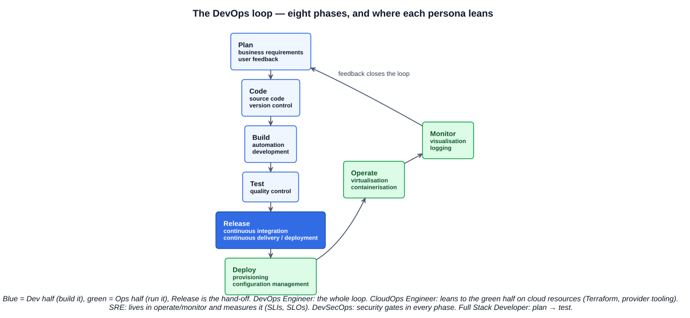
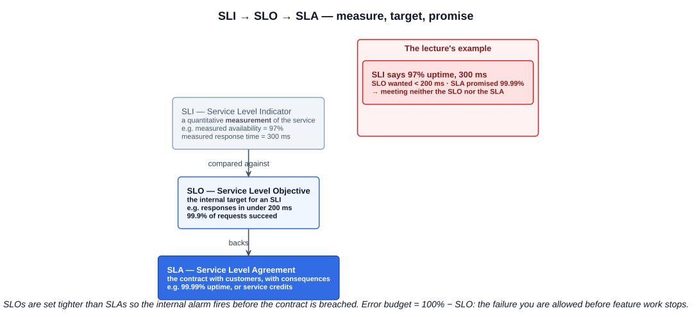

# 06 — Cloud Native Personas

Chapter 01 defined cloud native *culture* as different personas promoting and driving change using cloud native practices. This lecture names them: DevOps Engineer, Site Reliability Engineer, CloudOps Engineer, Security Engineer, DevSecOps Engineer, Full Stack Developer, Cloud Architect, and Data Engineer, with FinOps Engineer, Data Scientist, and Machine Learning Engineer as further study. The exam asks which persona owns which concern, so the definitions and the contrasts matter more than the skill lists.

---

## 1. DevOps Engineer

**Definition (CNCF glossary):** DevOps is a methodology in which **teams own the entire process from application development to production operations**. It is a cultural shift, not a toolset: the alternative it replaces is a queue of hand-offs where each team finishes its part and "throws it over the wall" to the next, so nobody owns the outcome.

### 1.1 Dev, Ops, and the combination

| Developer | Operations | DevOps |
|---|---|---|
| Development | Has it been tested? | Best of development |
| Speed / performance | Is it fully documented? | Best of operations |
| CI/CD pipelines | Is this monitored? | Shared ownership of the whole lifecycle |

The two sides' instincts are in tension — developers optimise for shipping fast, operations for not being paged — and DevOps resolves it by making one team responsible for both outcomes.

### 1.2 The eight-phase loop

The DevOps "infinity loop" is the lifecycle a DevOps engineer owns end to end:

| Phase | Covers |
|---|---|
| **Plan** | Identify business requirements, collect user feedback |
| **Code** | Source code, version control |
| **Build** | Automation, development |
| **Test** | Quality control |
| **Release** | Continuous integration, continuous delivery / deployment |
| **Deploy** | Provisioning, configuration management |
| **Operate** | Virtualisation, containerisation |
| **Monitor** | Visualisation, logging — which feeds the next *Plan* |

### 1.3 Typical skillset

Infrastructure provisioning · system administration · storage · networking · internet services · automation and scripting · CI/CD · source version control (Git) · GitOps · configuration management · performance analytics and monitoring. The breadth is the point: a DevOps engineer is a generalist across the loop rather than a specialist in one phase.

---

## 2. Site Reliability Engineer (SRE)

**Definition (CNCF glossary):** SRE is a discipline that **combines operations and software engineering**: engineers build systems to run applications — automating operational tasks — rather than building product features. The contrast the glossary draws: *DevOps focuses on getting code to production; SRE ensures that code running in production works properly.* The role originated at Google (2003) as "what happens when a software engineer is tasked with what used to be called operations".

### 2.1 Specific focus

Uptime · availability · scalability · resilience · robustness · the ability to resolve unforeseen problems. Where a DevOps engineer owns the loop, an SRE owns the *reliability* of what comes out of it, and measures it.

### 2.2 SLA, SLO, SLI

The measurement vocabulary is the exam-relevant part of SRE. The lecture's examples, reconciled with the canonical (Google SRE book) definitions:

| Term | Definition | Lecture's example |
|---|---|---|
| **SLI — Service Level Indicator** | A carefully defined **quantitative measurement** of some aspect of the service: availability, latency, error rate, throughput | "We are achieving 97% uptime and our response time is 300 ms" |
| **SLO — Service Level Objective** | A **target value or range** for an SLI — the internal goal the team holds itself to | "A response from this service will take less than 200 ms" |
| **SLA — Service Level Agreement** | The **contract with customers**, including **consequences** (usually financial credits) if the objectives aren't met | "Our service should achieve 99.99% uptime" |

Read the lecture's example the way the exam will: the SLI is the *measurement* (97%, 300 ms); the SLO (< 200 ms) and SLA (99.99%) are the *targets* — and the measured values meet **neither**. Two related ideas:

- SLOs are set **tighter than SLAs** so the internal alarm fires before the contract is breached.
- **Error budget** = 100% − SLO. A 99.9% SLO allows ~43 minutes of downtime a month; while the budget lasts, the team can ship risky changes, and when it is spent, reliability work takes priority over features. This is the mechanism that keeps developers and SREs aligned instead of fighting.

---

## 3. CloudOps Engineer

The same eight-phase loop as DevOps, but with the emphasis on the **right-hand, operations half — deploy, operate, monitor** — and on resources that are heavier on the cloud itself: cloud compute, cloud networking and storage services, and cloud-oriented toolsets such as **Terraform** for infrastructure as code and for deploying across different cloud providers. A CloudOps engineer is closer to the provider's APIs and billing than a DevOps engineer, and less involved in the plan → test half.

---

## 4. Security Engineer

| Focus | Meaning |
|---|---|
| Broad range of knowledge | Security spans every layer — OS, network, application, identity, supply chain |
| Attack vectors | How systems are actually compromised, so defences target real paths |
| Best practices in operating systems | Hardening, patching, least privilege on the host |
| Network-based security | Segmentation, firewalls, network policies, TLS |
| External threat detection | Seeing an attack as it happens — logging, intrusion detection, runtime security |
| External threat reduction | Shrinking the attack surface before an attack — minimal images, closed ports, secrets management |

---

## 5. DevSecOps Engineer

**DevSecOps = DevOps ∩ Security Engineer.** Security is not a gate at the end of the loop but a concern built into *every* phase — "shifting left":

| Phase | Security built in |
|---|---|
| Plan / Code | Threat modelling; secrets never in source; dependency policy |
| Build / Test | Static analysis (SAST), dependency and container **image scanning**, license checks |
| Release / Deploy | **Signed artifacts**, SBOMs, policy-as-code admission control (only approved images run) |
| Operate / Monitor | Runtime detection, audit logging, automated patching |

On the job market this work is often advertised as "DevOps Engineer" or "Platform Engineer" with security responsibilities, or sits with a security team that owns the pipeline gates; the *DevSecOps Engineer* title itself is rarer than the practice. For the exam the concept is what matters: security integrated into the DevOps lifecycle rather than bolted on after.

---

## 6. Full Stack Developer

Frontend development · web frameworks · operating system and mobile UI · backend development · languages such as Go, Rust, C, C++, Python (and Java, TypeScript, and the rest) · interaction with many components. In the loop this persona lives in **plan → test** and, in a cloud native team, also owns the Dockerfile and the manifests that ship the code — the boundary with DevOps is where the pipeline starts.

---

## 7. Cloud Architect

Decides **target platforms** · **multi-cloud** strategy · cloud tooling · **cloud native interoperability** (open standards so workloads move between providers) · ensures the design **meets requirements** · **interpersonal skills** — the architect spends as much time aligning teams and stakeholders as drawing diagrams. This is the persona that chooses *whether* something runs on Kubernetes, serverless, or a managed service, and on which cloud.

---

## 8. Data Engineer

Provide **access to data** · **scale en masse** · **distributed processing** (Spark, Flink, Kafka) · algorithmic usage · **data set compliance** (privacy, retention, residency) · **prevent vendor lock-in** (open formats and open standards for data as well as compute). The cloud native angle: data pipelines run as containerised, autoscaled workloads on the same platform as the applications.

---

## 9. Further study and newer titles

The course flags three more; the last three are titles that have become common since it was recorded.

| Persona | What they own | Cloud native tie-in |
|---|---|---|
| **FinOps Engineer** | Cloud **cost**: visibility, allocation to teams, optimisation, forecasting — the cultural practice of making engineering accountable for spend | Right-sizing requests and limits, autoscaling policy, spot capacity; OpenCost (CNCF) for Kubernetes cost allocation; the FinOps Foundation is a Linux Foundation project |
| **Data Scientist** | Extracting insight from data: statistics, experiments, models | Consumes the data engineer's pipelines; notebooks and training jobs as Kubernetes workloads |
| **Machine Learning Engineer** | Taking models to production: training pipelines, serving, monitoring for drift — "MLOps" | Kubeflow, KServe, GPU scheduling; the model is deployed like any other service |
| **AI Engineer** | Building products on foundation models: prompting, retrieval (RAG), agents, evaluation, guardrails | LLM inference on Kubernetes, vector stores, the CNCF TOC's AI initiative (2025) |
| **Platform Engineer** | Builds and runs the **internal developer platform** — the paved road (cluster, CI/CD, observability, golden paths) that product teams consume as a product | The most common cloud native *ops* title today; Backstage (CNCF) for developer portals |
| **Forward Deployed Engineer** | An engineer embedded with a customer to deploy, integrate, and adapt the product on the customer's infrastructure | Common at AI and infrastructure companies; hands-on with the customer's Kubernetes and cloud |

---

## 10. Personas side by side

| Persona | Primary concern | Loop position | Typical tools |
|---|---|---|---|
| DevOps Engineer | The whole lifecycle, automated | All eight phases | Git, CI/CD, Terraform, Ansible, Kubernetes, monitoring |
| SRE | Reliability, measured by SLIs against SLOs | Operate, monitor | Prometheus, alerting, incident tooling, error budgets |
| CloudOps Engineer | Running on the cloud provider's resources | Deploy, operate, monitor | Terraform, provider CLIs/consoles, cost tooling |
| Security Engineer | Threats, attack surface, hardening | Cross-cutting | Scanners, network policy, IDS, secrets managers |
| DevSecOps Engineer | Security inside the pipeline | Every phase | SAST/DAST, image scanning, signing, policy-as-code |
| Full Stack Developer | The application, front to back | Plan → test | Languages, frameworks, Docker |
| Cloud Architect | Platform choice and interoperability | Before the loop | Reference architectures, open standards |
| Data Engineer | Data at scale, compliant and portable | Its own pipelines | Kafka, Spark, Flink, object storage |

---

## Exam angle

- **DevOps** = teams own the process from development to production operations; a **cultural** methodology, not a tool. **SRE** = operations done as software engineering; "DevOps gets code to production, SRE keeps it working in production."
- **SLI / SLO / SLA**: indicator = *measurement*, objective = *target*, agreement = *customer contract with consequences*. Given values, be able to say which are being met. SLOs are tighter than SLAs; error budget = 100% − SLO.
- The **eight phases** in order: Plan, Code, Build, Test, Release, Deploy, Operate, Monitor. **CloudOps** leans to the second half on cloud resources.
- **DevSecOps** = DevOps with security in every phase ("shift left"); the distractor is "a security review before release".
- **SRE focus list**: uptime, availability, scalability, resilience, robustness, unforeseen problems. **Cloud Architect**: target platforms, multi-cloud, interoperability, requirements, interpersonal skills. **Data Engineer**: access, scale, distributed processing, compliance, no vendor lock-in.
- The three personas named in chapter 01's culture definition — **DevOps, SRE, FinOps** — are the ones most likely to be asked as "which persona owns cost / reliability / delivery".

## References

- [DevOps — CNCF Cloud Native Glossary](https://glossary.cncf.io/devops/) — "teams own the entire process from application development to production operations"
- [Site Reliability Engineering — CNCF Cloud Native Glossary](https://glossary.cncf.io/site-reliability-engineering/) — combines operations and software engineering; the DevOps-vs-SRE contrast
- [Service Level Objectives — Google SRE Book](https://sre.google/sre-book/service-level-objectives/) — canonical SLI/SLO/SLA definitions and error budgets
