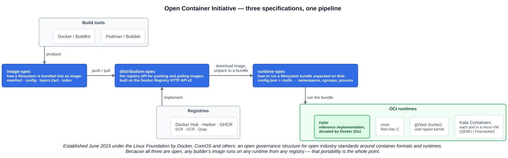
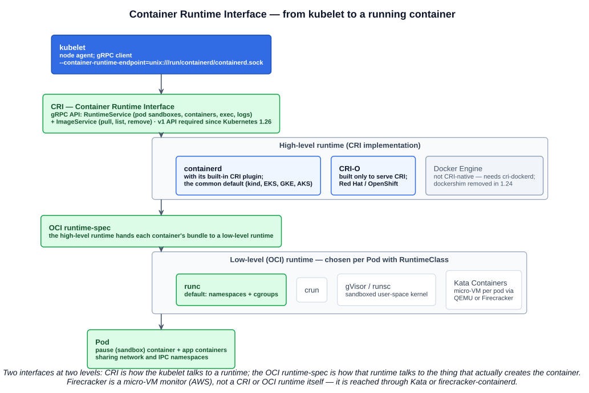
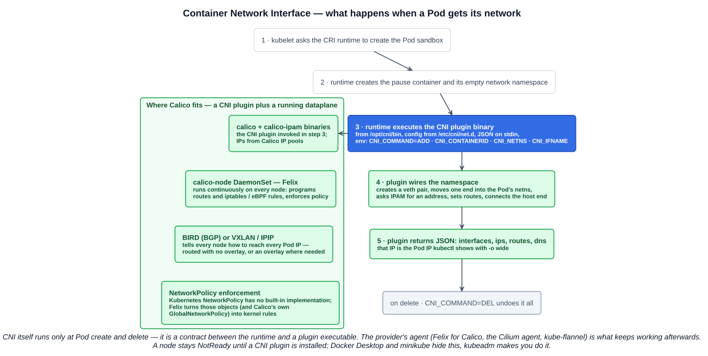
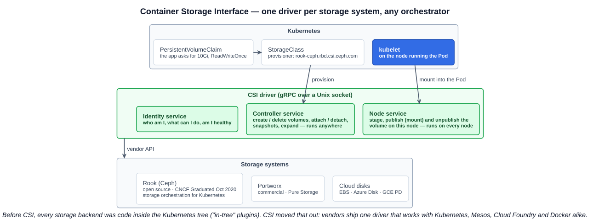

# 07 — Open Standards

## 1. What an open standard is

An **open standard** is a specification that is **openly accessible and can be freely adopted and implemented** by anyone. It is what lets independent projects and vendors interoperate without agreeing on a single implementation — and it is a key component of open source: the specification is the contract, the projects are competing implementations of it.

Docker is the example that makes the idea concrete. Docker paved the way for containers and grew their use for the better — but a single company's format and runtime is not a standard. In **June 2015**, Docker and other industry leaders (CoreOS among them) launched the **Open Container Initiative** under the **Linux Foundation** so that the container format and runtime would belong to everyone. The cloud native ecosystem is built on that pattern: a standard interface, many implementations.

The exam's four:

| Standard | Governs | Who calls it |
|---|---|---|
| **OCI** — Open Container Initiative | Image format, runtime behaviour, distribution API | Builders, registries, runtimes |
| **CRI** — Container Runtime Interface | How Kubernetes' kubelet talks to a container runtime | kubelet |
| **CNI** — Container Network Interface | How a runtime gives a container a network | container runtime |
| **CSI** — Container Storage Interface | How an orchestrator provisions and mounts storage | Kubernetes (and others) |

Plus **SMI** — Service Mesh Interface — which the course covers and which has since been archived (section 6).

---

## 2. Open Container Initiative (OCI)

**Definition (opencontainers.org):** an open governance structure, formed under the Linux Foundation, for the express purpose of creating **open industry standards around container formats and runtimes**. Established **June 2015** by Docker and other container-industry leaders.

Three specifications, which together describe the whole life of a container image:

| Specification | What it defines | Implementations |
|---|---|---|
| **image-spec** | **How to bundle a filesystem into an image**: the manifest, the config, the layers (tar archives) and the index that lists variants per platform | Built by Docker / BuildKit, Podman, Buildah, kaniko, Jib |
| **runtime-spec** | **How to run a filesystem bundle** that has been unpacked on disk — a `config.json` plus a `rootfs` — as an isolated process: namespaces, cgroups, mounts, hooks | **runc** (the reference implementation), crun, gVisor's runsc, Kata Containers |
| **distribution-spec** | Open standards and API protocols for **distributing content** — pushing and pulling images to and from a registry. Built on the **Docker Registry HTTP API v2** that Docker Hub already used | Docker Hub, Harbor (CNCF graduated), GHCR, ECR, GCR, Quay |

The three fit into one sentence from the OCI itself: an implementation **downloads an OCI image** (distribution-spec), **unpacks it into an OCI runtime filesystem bundle** (image-spec), and the bundle is **run by an OCI runtime** (runtime-spec).

### 2.1 runc — the reference implementation

Docker donated **runC** to the OCI at its founding as the reference implementation of an OCI-compliant runtime — the cornerstone the standard was built around. It is a small Go program that takes a bundle and creates the Linux namespaces, cgroups and process. Every other OCI runtime is judged against it:

| OCI runtime | What is different |
|---|---|
| **runc** | The reference: plain Linux namespaces and cgroups, shared host kernel |
| **crun** | Same model, written in C by Red Hat — faster start, lower memory; Podman's default |
| **gVisor** (`runsc`) | Google; runs the container against a user-space kernel that intercepts syscalls — stronger isolation, some performance cost |
| **Kata Containers** | Runs each pod inside a lightweight virtual machine (QEMU, Cloud Hypervisor, or **Firecracker** as the hypervisor) — VM-grade isolation with a container interface |
| **Firecracker** | AWS's micro-VM monitor (Rust) that powers Lambda and Fargate. Not an OCI runtime by itself; it is reached through Kata or `firecracker-containerd`. The course lists it with the others because that is the role it plays |

---

## 3. Container Runtime Interface (CRI)

### 3.1 What it is

**CRI** is the **plugin interface — a gRPC API — between the kubelet and the container runtime.** It lets the kubelet use any container runtime without recompiling Kubernetes. Two gRPC services:

- **RuntimeService** — pod sandboxes and containers: create, start, stop, remove, exec, attach, logs.
- **ImageService** — pull, list, inspect, remove images.

The kubelet is the gRPC client, connecting over a Unix socket set with `--container-runtime-endpoint` (containerd: `unix:///run/containerd/containerd.sock`; CRI-O: `unix:///var/run/crio/crio.sock`). The v1 API is stable since 1.23 and mandatory from 1.26: a runtime that doesn't speak it can't register a node.

### 3.2 kubelet → CRI plugin → runtime → OCI runtime — how they relate

The lecture's picture — kubelet → "CRI plugin" → containerd / CRI-O / Kata / Firecracker → pod — flattens two layers into one. The precise chain has **two interfaces at two levels**:

1. **kubelet** decides a Pod should run on this node and calls the runtime over **CRI**.
2. The **high-level runtime** implements CRI. It manages images, snapshots, and the pod sandbox, and it *does not create containers itself*:
   - **containerd** — the common default (kind, EKS, GKE, AKS). Its CRI support is a **plugin built into the containerd daemon** — this is the "CRI plugin" on the slide: the piece of containerd that listens on the CRI socket and translates CRI calls into containerd operations. (It began life as a separate `cri-containerd` process and was merged in as a plugin in containerd 1.1.)
   - **CRI-O** — Red Hat's runtime built *only* to serve CRI, nothing else; OpenShift's default.
   - **Docker Engine** is *not* CRI-native. Kubernetes carried a built-in adapter, the **dockershim**, until it was **removed in 1.24**; Docker can still be used through the external **cri-dockerd** adapter.
3. For each container, the high-level runtime writes an OCI bundle and hands it to a **low-level OCI runtime** via the **runtime-spec** — normally **runc**, or a sandboxed alternative (crun, gVisor, Kata) selected per Pod with a **`RuntimeClass`**.
4. The low-level runtime creates the namespaces and cgroups and starts the process; the containers of a Pod share the sandbox's network and IPC namespaces (the **pause** container holds them open).

So: **CRI is the kubelet's interface to a runtime; OCI's runtime-spec is that runtime's interface to the thing that actually makes the container.** Kata Containers and Firecracker sit at the *bottom* of the chain (they replace runc's isolation model), not beside containerd; the slide draws them as peers of containerd for simplicity.

---

## 4. Container Network Interface (CNI)

### 4.1 What it is

**CNI** is a **specification and a set of libraries for configuring network interfaces in Linux containers**, plus a handful of reference plugins. It is a CNCF project (Incubating, accepted May 2017), originally from CoreOS. It is deliberately minimal: it says nothing about how packets get from node to node — only how a container gets *connected* to a network and disconnected again.

The spec defines two things:

- A **network configuration format** — JSON files in `/etc/cni/net.d/` naming the plugin(s) to run and their settings.
- An **execution protocol** — a plugin is an **executable** in `/opt/cni/bin/`; the runtime runs it with the configuration on stdin and parameters in environment variables (`CNI_COMMAND`, `CNI_CONTAINERID`, `CNI_NETNS`, `CNI_IFNAME`).

The operations (spec v1.1.0):

| Operation | Meaning |
|---|---|
| **ADD** | Add the container to the network, or apply modifications |
| **DEL** | Remove the container from the network, or un-apply modifications |
| **CHECK** | Check the container's networking is as expected |
| **VERSION** | Probe which spec versions the plugin supports |
| STATUS | Is the plugin ready to accept ADDs (added in 1.1) |
| GC | Clean up resources for containers that no longer exist (added in 1.1) |

The course slide shows the first four; the exam is unlikely to ask about the two new ones.

### 4.2 What CNI actually does to a running container

It is easy to imagine CNI as a networking daemon. It isn't. **CNI runs only at two moments in a Pod's life — creation and deletion — and it is the container runtime, not the kubelet, that invokes it.** What happens on `ADD`:

1. The kubelet asks the CRI runtime to create the **Pod sandbox**.
2. The runtime starts the **pause** container, which owns a brand-new, **empty network namespace** — no interfaces except loopback.
3. The runtime **executes the CNI plugin binary** with `CNI_COMMAND=ADD` and the path to that namespace.
4. The plugin **wires the namespace**: creates a **veth pair** (a virtual cable), moves one end *into* the Pod's namespace as `eth0`, connects the other end on the host (to a bridge, or as a routed interface); asks an **IPAM** plugin for an IP address; writes routes and a default gateway inside the namespace.
5. The plugin **returns a JSON result** — interfaces, IPs, routes, DNS — which becomes the Pod's IP that you see in `kubectl get pods -o wide`.
6. When the Pod is deleted, the runtime calls `DEL` and the plugin tears the interface and address down.

Between those two moments, CNI does nothing. The Pod's containers just use `eth0`. Anything that has to keep working *after* creation — reaching Pods on other nodes, enforcing policy, reacting to nodes joining — is the job of the **CNI provider's agent**, which is a separate, long-running component that happens to ship alongside the plugin binary.

This is why **Kubernetes requires a CNI plugin**: the kubelet reports a node **`NotReady`** until one is installed, because it cannot create Pod sandboxes with networking. It is also why the requirement is more or less visible depending on the distribution: **Docker Desktop hides it**, **minikube hides it but lets you override** the choice, **kubeadm requires you to install one** — which is the moment `kubectl get nodes` flips from `NotReady` to `Ready`.

### 4.3 Where Calico fits

**Calico** (Tigera; open source, Apache 2.0 — not a CNCF project) is the most widely adopted CNI *provider*. That word matters: Calico is not "a CNI", it is **a CNI plugin plus a networking and security dataplane**. Its pieces:

| Component | Role | When it runs |
|---|---|---|
| `calico` and `calico-ipam` binaries | The **CNI plugin**: what the runtime executes on ADD/DEL; IPs come from Calico IP pools | Pod create / delete only |
| **calico-node** DaemonSet → **Felix** | Programs each node's kernel: routes, and **iptables or eBPF** rules for policy; reports health | Continuously, on every node |
| **BIRD** (BGP) — or VXLAN / IP-in-IP overlays | Distributes "Pod 10.244.3.7 lives on node 3" to every node, so Pod IPs are **routed** without an overlay when the network allows it | Continuously |
| **Typha** | Fan-out cache between the datastore and Felix on large clusters | Continuously |
| **kube-controllers** | Watches the Kubernetes API for policies, namespaces, service accounts, nodes | Continuously |
| Datastore | The Kubernetes API itself (default) or etcd | — |

The part that answers your work question: **Kubernetes `NetworkPolicy` is an API object with no built-in implementation.** The API server will happily store a policy on a cluster where nothing enforces it. Enforcement is the CNI provider's job, and **Felix is what turns your NetworkPolicy manifests into iptables/eBPF rules** on every node. Calico also adds its own richer CRDs — `NetworkPolicy` (Calico flavour), `GlobalNetworkPolicy`, `GlobalNetworkSet` — with ordering, deny rules, and cluster-wide scope that the Kubernetes object lacks. So when you apply a NetworkPolicy at work, the object is Kubernetes'; the behaviour is Calico's.

Three dataplanes: **standard Linux (iptables)**, **eBPF**, and **Windows HNS**. The main alternatives to Calico: **Cilium** (eBPF-native, CNCF Graduated Oct 2023), **Flannel** (simple overlay, no policy enforcement), and the cloud providers' own plugins (AWS VPC CNI, Azure CNI).

---

## 5. Container Storage Interface (CSI)

**Purpose:** a standard so that **a storage vendor writes one plugin that works with every container orchestrator** — Kubernetes, Mesos, Cloud Foundry, and Docker were the original co-authors. Before CSI, every storage backend was code compiled *into* Kubernetes ("in-tree" volume plugins); adding or fixing one meant a Kubernetes release. CSI moved storage out of tree: a driver is a separate program Kubernetes talks to over gRPC. CSI is an independent specification (github.com/container-storage-interface), not a CNCF project; it went GA in Kubernetes 1.13.

A CSI driver exposes three gRPC services:

| Service | Does | Runs |
|---|---|---|
| **Identity** | Reports the driver's name, capabilities, and health | Everywhere |
| **Controller** | Creates and deletes volumes, attaches and detaches them to nodes, snapshots, expansion | Anywhere (a Deployment) |
| **Node** | Stages, publishes (mounts) and unpublishes a volume on the node where the Pod runs | Every node (a DaemonSet) |

The two implementations the course names:

| | **Rook** | **Portworx** |
|---|---|---|
| Kind | Open source — CNCF **Graduated** (Oct 2020; joined Jan 2018) | Commercial, by Pure Storage |
| What | **Storage orchestration for Kubernetes**: runs Ceph (block, file, object) as Kubernetes workloads and exposes it through CSI drivers | Software-defined storage layer for Kubernetes with its own CSI driver |

Every cloud disk (EBS, Azure Disk, GCE PD) is a CSI driver too; the in-tree cloud plugins were all migrated to CSI.

---

## 6. Service Mesh Interface (SMI) — and what replaced it

The course presents **SMI** (`smi-spec.io`) as **a standard interface for service meshes on Kubernetes**: a basic feature set for the common use cases (traffic policy, traffic telemetry, traffic splitting), flexibility for new capabilities, and room for the ecosystem to innovate. Its point was that Istio, Linkerd, Consul and the rest would expose the same CRDs so tools such as Flagger and Argo Rollouts could drive any mesh.

What happened since: SMI never gained enough adoption, its maintainers moved their effort to the Kubernetes **Gateway API**'s **GAMMA initiative** (Gateway API for Mesh Management and Administration), and the CNCF TOC **archived SMI on 25 September 2023**. The Gateway API's mesh support (a Service as a route's `parentRef`) is the current standard, GA in the Standard channel from Gateway API v1.1.

For the exam: know what SMI *was* — the course still lists it — and, if a question is current, that mesh standardisation now lives in the Gateway API.

---

## 7. The other open standards you will meet

| Standard | Domain | Notes |
|---|---|---|
| **OpenTelemetry** (OTel) | Observability — traces, metrics, logs | CNCF **Graduated** (May 2026); the merger of OpenTracing and OpenCensus (Section 6) |
| **OpenMetrics** | Metrics exposition format | Prometheus' text format spun out as a standard (2018); **archived July 2024** and merged back into Prometheus, where OpenMetrics 2.0 continues |
| **CloudEvents** | Event data format | CNCF Graduated (chapter 04) |
| **SPIFFE / SPIRE** | Workload identity | CNCF Graduated (chapter 02) |
| **Gateway API** | Ingress and mesh traffic routing | Kubernetes SIG Network; successor to Ingress and to SMI |
| **OCI Distribution** | Registry API | Also used for Helm charts and other artifacts via ORAS |

---

## Exam angle

- **OCI**: founded **June 2015** by Docker and others under the **Linux Foundation**; three specs — **image**, **runtime**, **distribution**. **runc** is the **reference implementation of the runtime-spec**, donated by Docker. Distribution-spec descends from the **Docker Registry HTTP API v2**.
- Build tools implement the image-spec (Docker, BuildKit, Podman, Buildah); runtimes implement the runtime-spec (runc, crun, gVisor, Kata); registries implement the distribution-spec.
- **CRI** = the **gRPC interface between the kubelet and the container runtime**; implementations are **containerd** and **CRI-O**. **dockershim was removed in 1.24** — Docker Engine needs cri-dockerd. Kata and Firecracker are *isolation* runtimes below containerd, not CRI implementations.
- **CNI** = the standard for **configuring network interfaces in containers**; a plugin is an executable invoked by the runtime with **ADD / DEL / CHECK / VERSION**. **Required by Kubernetes**: nodes stay **NotReady** until a CNI plugin is installed. Calico, Cilium, Flannel are providers; **NetworkPolicy is enforced by the CNI provider**, not by Kubernetes itself.
- **CSI** = the standard so **one storage driver works across orchestrators**; services **Identity / Controller / Node**. **Rook** = open source, CNCF **Graduated**; **Portworx** = commercial.
- **SMI** = the (archived) standard interface for service meshes; its role passed to the **Gateway API**.
- The pattern behind all of them: Kubernetes defines the **interface**, the ecosystem supplies the **implementations** — a distractor will claim Kubernetes ships its own container runtime, network plugin, or storage driver.

## References

- [Open Container Initiative — overview](https://opencontainers.org/about/overview/) — mission, June 2015 founding, the three specs, runC as the cornerstone, and the download → unpack → run sentence
- [Container Runtime Interface — Kubernetes docs](https://kubernetes.io/docs/concepts/architecture/cri/) and [Container Runtimes](https://kubernetes.io/docs/setup/production-environment/container-runtimes/) — the gRPC services, socket paths, v1 requirement, dockershim removal and cri-dockerd
- [CNI specification](https://github.com/containernetworking/cni/blob/main/SPEC.md) — configuration format, execution protocol, the operations, and what ADD returns
- [Calico architecture — component overview](https://docs.tigera.io/calico/latest/reference/architecture/overview) — Felix, BIRD, confd, the CNI and IPAM plugins, Typha, kube-controllers
- [Container Storage Interface specification](https://github.com/container-storage-interface/spec/blob/master/spec.md) — purpose and the Identity / Controller / Node services
- [CNCF archives the Service Mesh Interface project](https://www.cncf.io/blog/2023/10/03/cncf-archives-the-service-mesh-interface-smi-project/) — SMI archived, work moved to Gateway API GAMMA
