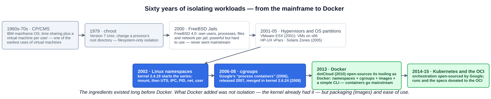
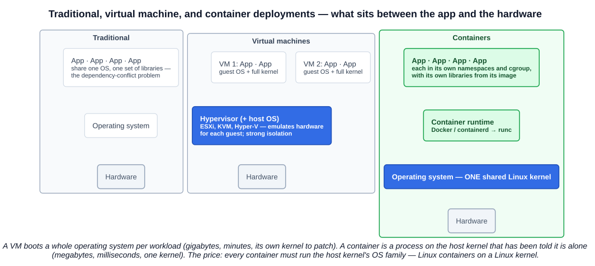
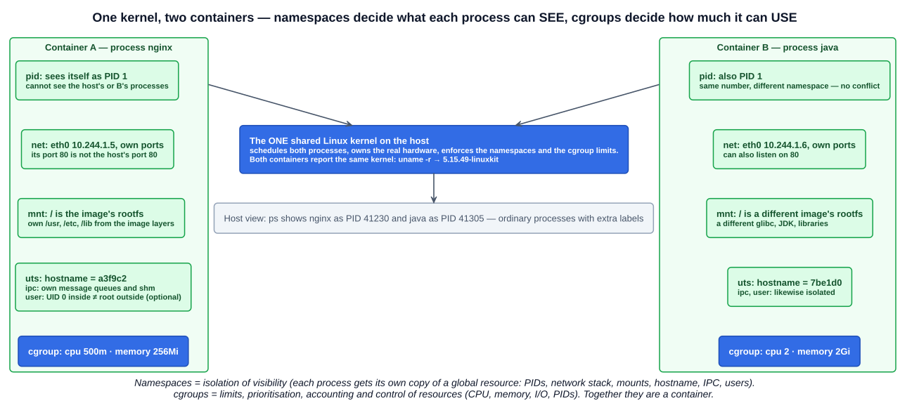

# 01 — Introduction to Containers

The instructor's steer for this section: pay attention to **namespaces**, **cgroups**, and **how containers share a kernel** — and what that buys over virtual machines. Everything Docker and Kubernetes do is built on those three ideas, so this chapter spends most of its length there. The history comes first because the exam asks about it, and because it shows that Docker's contribution was not isolation but packaging and ease of use.

---

## 1. Sixty years of isolating workloads



### 1.1 Mainframes and CP/CMS (1960s–70s)

A **mainframe** is a large, centralised computer built for **throughput and reliability** rather than raw single-thread speed: enormous I/O capacity, hardware redundancy in every component, and decades of backward compatibility. IBM has sold them continuously since the System/360 (1964); today's IBM Z machines running z/OS still process most of the world's card transactions, airline bookings, and bank ledgers, often through COBOL programs written decades ago behind CICS or IMS transaction monitors, with **IBM MQ** as the usual messaging bridge to newer systems.

Mainframes were so expensive that many users had to share one. Two answers emerged:

| | What it is |
|---|---|
| **Time sharing** | Sharing a large computer among **multiple users simultaneously**, each getting slices of the processor and storage — the users share one operating system |
| **CP/CMS** (late 1960s – early 1970s) | An IBM mainframe operating system that went further: the **Control Program** gave **each user their own virtual machine** with its own copy of the single-user **CMS** operating system, virtualised within the machine. One of the **earliest references to virtual machines** |

CP/CMS is the seed of everything on the timeline: the idea that a machine can be carved into isolated copies of itself, each looking like a whole computer to the software inside. Its descendants (VM/370, z/VM) are still shipped.

### 1.2 chroot — "change root" (Unix, 1979)

Introduced in **Version 7 Unix in 1979**, `chroot` **changes the root directory for a process and its children**: a process started inside `/srv/jail` sees `/srv/jail` as `/`, and `/srv/jail/home` as `/home`. It can only see files and directories under the new root.

It is filesystem isolation only, and a weak form of it:

- **Still visible:** the hostname, IP addresses, other processes, the network.
- **Cannot** safely run superuser processes (root can escape a chroot).
- Directories must be `root:root` owned to be safe.

Use cases: SSH shells confined to a chroot, services such as Apache running in a chroot, basic user isolation. chroot never stopped evolving — it is still one of the things a container runtime does, just alongside much more.

### 1.3 FreeBSD Jails (2000)

**FreeBSD** is an open source operating system descended from the **Berkeley Software Distribution (BSD)** flavour of Unix. **Jails**, introduced in **FreeBSD 4.0 in 2000**, partition a FreeBSD system into isolated environments each with **its own users, processes, filesystem, and networking stack** — functionally very close to a modern container.

They were extremely popular with **internet service providers in the early 2000s** for the security they offered. But Jails were **difficult to use and manage**, and that limited their adoption: the technology was years ahead of Docker, the end-user experience was not. The lesson the course draws is the one Docker later proved — **ease of use decides adoption**.

### 1.4 Other Unix vendors: Solaris Zones and HP-UX vPars

- **Sun Solaris Zones** (Solaris 10, 2005): divided the Solaris OS into multiple isolated environments sharing one kernel — the same idea as Jails, better tooling.
- **HP-UX Virtual Partitions (vPars)**: segmented an HP-UX system into logical partitions, each with its own OS instance — closer to a hypervisor than to a container.

Neither left the proprietary Unix world, which is why they are hints at the trend rather than ancestors of Docker.

### 1.5 The virtual machine era

A **virtual machine** is a **software emulation of a physical computer**. A **hypervisor** lets multiple virtual machines run across physical compute, providing an **abstraction layer between the physical resources and the guests**, each of which runs a full operating system with its own kernel.

- **VMware** became the market leader; its hypervisor is **ESXi**, with **vCenter** managing fleets of hosts.
- Over time the **hypervisor and the operating system merged into one component** (ESXi is itself a minimal OS; KVM is inside the Linux kernel; Hyper-V ships with Windows).
- Mature hypervisors added **live migration** of running VMs between hosts, GPU pass-through, the foundation for **cloud computing** (every EC2 instance is a VM), and **virtual desktop infrastructure (VDI)**.

VMs solved the shared-host dependency problem from chapter 02-01 by giving every application its own OS. The cost is that every application also carries a whole OS: gigabytes on disk, minutes to boot, and one more kernel to patch.

### 1.6 Linux gets the pieces: namespaces (2002) and cgroups (2008)

Two kernel features, developed independently, became the building blocks of containers. They get their own sections below.

### 1.7 Docker (2013)

**Docker** began in **2010 as dotCloud**, a platform-as-a-service for running cloud applications. The tooling dotCloud built to run customer workloads was **open-sourced in 2013 and renamed Docker**. It combined two things:

- **Linux kernel technology** — namespaces and cgroups — to give each container its own users, hostname, IP addresses, mount points, and resource allocation.
- A **shared kernel**: the container runtime runs every container on the host's Linux kernel; no guest OS, no hypervisor.

Plus the part the kernel could not provide: **images** (a portable, layered package of a filesystem) and a **simple CLI**. The course's verdict is that **Docker's success can be attributed to ease of use** — the same capability had existed in FreeBSD for thirteen years. Docker is written in Go; its runtime lineage (containerd, runc) is the one chapter 02-07 traced.

---

## 2. What a container is, precisely

A container is **an ordinary process (or group of processes) on the host, that the kernel has been told to isolate**: it is given its own view of the system by **namespaces** and a resource budget by **cgroups**, and its filesystem comes from an **image**. There is no emulated hardware and no second kernel. `ps` on the host shows the container's processes as normal PIDs; inside the container they see only themselves.



### 2.1 Containers vs virtual machines

| | Virtual machine | Container |
|---|---|---|
| Isolation mechanism | Hypervisor emulates hardware; guest runs its own kernel | Kernel namespaces and cgroups around a process |
| Kernel | One per VM | **One, shared** by every container on the host |
| Size | Gigabytes (a whole OS) | Megabytes (the app and its libraries) |
| Start time | Seconds to minutes (boots an OS) | Milliseconds (starts a process) |
| Density | Tens per host | Hundreds to thousands per host |
| Overhead | Guest OS memory and CPU per VM | Near zero — the process runs natively |
| Isolation strength | Strong — a compromised guest still has to break out of the hypervisor | Weaker — a kernel exploit affects every container; hardened with seccomp, AppArmor/SELinux, user namespaces, or a sandbox runtime (gVisor, Kata) |
| Portability | Images are large and hypervisor-specific | OCI images run on any OCI runtime |
| Constraint | Any guest OS | Must match the host kernel's OS family — Linux containers need a Linux kernel (Docker Desktop on macOS/Windows runs a hidden Linux VM to provide one) |
| Patching | Patch every guest kernel | Patch one host kernel; rebuild images for userspace fixes |

### 2.2 Seeing the shared kernel

The lecture's demo, run on a Mac with Docker Desktop:

```bash
docker run ubuntu uname -a
# Linux f6c571bf32b4 5.15.49-linuxkit #1 SMP PREEMPT Tue Sep 13 07:51:32 UTC 2022 aarch64 aarch64 ...
docker run amazonlinux uname -a
# Linux 53eda13bc0d8 5.15.49-linuxkit ...
docker run centos uname -a
# Linux 99e02b7de09f 5.15.49-linuxkit ...
```

Three different distributions — Ubuntu, Amazon Linux, CentOS — report **the same kernel**, `5.15.49-linuxkit`, because there is only one: the Linux kernel of the VM Docker Desktop runs (LinuxKit is the toolkit that builds it). What differs between the images is **userspace**: `/bin`, `/lib`, the package manager, glibc. Each container's hostname is its container ID — that is the UTS namespace at work.

---

## 3. Linux namespaces

### 3.1 What a namespace is

The kernel's own definition (`namespaces(7)`): a namespace **wraps a global system resource in an abstraction that makes it appear to the processes within the namespace that they have their own isolated instance of the global resource.** Changes to the resource are visible to other members of the namespace and invisible to everyone else.

"Global system resource" is the key phrase. On a normal Linux system there is one process table, one network stack, one hostname, one set of mount points, one set of user IDs. A namespace lets the kernel hand a group of processes their own private copy of one of those things. Stack up one namespace of each kind around a process and it is, for all it can tell, alone on the machine.

Three system calls operate on namespaces: **`clone()`** creates a process in new namespaces, **`unshare()`** moves the calling process into new ones, and **`setns()`** joins an existing one. Each process's namespaces are exposed as links in **`/proc/<pid>/ns/`**, which is how tools like `docker exec` and `nsenter` step into a container.

**Introduced into the Linux kernel in 2002 (2.4.19), originally six namespaces** — that is the course's framing and the quiz answer. (Strictly, 2.4.19 added only the mount namespace and the other five arrived between 2006 and 2013; the exam wants "six, 2002".)

### 3.2 The six original namespaces



| # | Namespace | Isolates | What it means for a container |
|---|---|---|---|
| 1 | **user** | **User and group IDs** — processes in the namespace have their own set of UIDs/GIDs, mapped onto different IDs outside | A process can be **UID 0 (root) inside the container while being an unprivileged user on the host**. The foundation of rootless containers; the biggest single security improvement available, and still off by default in Docker |
| 2 | **pid** | **Process IDs** — a separate process tree with its own numbering | The container's first process is **PID 1** (and gets PID 1's duties: reaping children, handling signals). It cannot see or signal host processes or other containers'. From the host, the same process has an ordinary high PID |
| 3 | **network** | **The whole networking stack** — interfaces, IP addresses, routing table, ports, firewall rules | Each container gets its own `eth0` and IP, its **own port space** (two containers can both listen on 80), and its own loopback. This is the empty namespace the CNI plugin wires up in chapter 02-07. Containers in one Kubernetes Pod deliberately **share** a network namespace |
| 4 | **mount** | **The set of mount points** — an independent filesystem hierarchy | The container's `/` is its image's root filesystem; it can mount and unmount without affecting the host. This is chroot done properly, plus volumes and bind mounts |
| 5 | **uts** | **Hostname and NIS domain name** (UTS = *Unix Time-Sharing* — the historical name of the struct) | Each container has its own hostname — the container ID by default, the Pod name in Kubernetes |
| 6 | **ipc** | **Inter-process communication objects** — System V IPC, POSIX message queues, shared memory | Processes in different containers cannot share memory segments or queues by accident; Pod containers share one IPC namespace so sidecars can |

Two more arrived later and complete the set: **cgroup** (Linux 4.6, 2016) virtualises the process's view of the cgroup hierarchy so a container cannot see or escape its own resource tree, and **time** (Linux 5.6, 2020) lets a container have its own boot-time and monotonic clock offsets — mainly for checkpoint/restore.

### 3.3 Seeing them on a Linux host

```bash
lsns                              # every namespace on the host, with the PID that owns it
ls -l /proc/$$/ns/                # your shell's namespaces: cgroup, ipc, mnt, net, pid, user, uts, time
sudo unshare --pid --fork --mount-proc bash   # a shell in a new PID namespace; run ps — you are PID 1
docker inspect --format '{{.State.Pid}}' <container>   # the container's PID as the host sees it
sudo nsenter -t <that pid> -n ip addr                  # enter its network namespace and look around
```

A container is exactly what `unshare` builds, with every flag set, plus a cgroup and a mounted image.

---

## 4. Control groups (cgroups)

Namespaces limit what a process can **see**; they do nothing about what it can **consume**. A runaway container could still eat every CPU cycle and byte of memory on the host. That is what cgroups are for.

**Definition (`cgroups(7)`):** a Linux kernel feature which allows processes to be **organised into hierarchical groups whose usage of various types of resources can then be limited and monitored.**

History: development at **Google started in 2006** under the name **"process containers"**, renamed **cgroups** (control groups) to avoid confusion, **initially released in 2007** and **merged into the Linux kernel in 2008** (2.6.24). The course calls cgroups the "7th namespace" as a memory aid; technically they are a separate mechanism (though there is also a cgroup *namespace*, see above).

Four capabilities:

| Capability | Meaning | In Kubernetes terms |
|---|---|---|
| **Resource limits** | How much of a resource — CPU, memory, I/O bandwidth, number of PIDs — a group may use | `resources.limits` — the container is throttled (CPU) or **OOM-killed** (memory) at the line |
| **Prioritisation** | Relative shares of a resource when there is contention | `resources.requests` — CPU shares/weights that decide who wins when the node is busy |
| **Accounting** | Measuring and reporting what a group actually used | What the kubelet, cAdvisor and the metrics-server read for `kubectl top` and the HPA |
| **Control** | Acting on every process in the group at once: **start, stop, freeze, thaw, restart** | Pausing and killing containers cleanly |

Resources are managed by **controllers** — `cpu`, `cpuset`, `memory`, `io`, `pids`, `devices`, `freezer`, and more. Two versions exist: **cgroups v1** (2008, one hierarchy per controller) and **cgroups v2** (official in Linux 4.5, 2016; a single unified hierarchy), which Kubernetes and the runtimes now prefer. The `cgroupDriver: systemd` setting from chapter 02-07's runtime page is about which component owns this tree.

```bash
cat /proc/self/cgroup                          # which cgroup your shell is in
cat /sys/fs/cgroup/cgroup.controllers          # controllers available (cgroups v2)
docker run -d --memory=256m --cpus=0.5 nginx   # Docker writes exactly these limits into a cgroup
docker stats                                   # cgroup accounting, live
```

---

## 5. Putting it together

| Question | Answered by |
|---|---|
| What can this process see? | **Namespaces** (pid, net, mnt, uts, ipc, user) |
| How much can it use? | **cgroups** (limits, priority, accounting, control) |
| What does its filesystem contain? | The **image** (chapter 02 onwards) |
| Which kernel runs it? | The **host's** — always, for every container on the node |
| What creates all of the above? | The **OCI runtime** (runc), told what to do by containerd, told by the kubelet |

That last row is why chapter 02-07's runtime chain and this chapter are the same story from two ends.

---

## Exam angle

- **Six namespaces, 2002, kernel 2.4.19**: user, pid, network, mount, uts, ipc. The quiz asked "how many namespaces were originally added in 2002" — the answer is **6**, and the distractors are 5, 7, 8. Don't let cgroups ("the 7th") change the count.
- Match each namespace to what it isolates: **pid** → process IDs; **net** → network stack and ports; **mnt** → mount points/filesystem view; **uts** → hostname; **ipc** → message queues and shared memory; **user** → UIDs/GIDs.
- **cgroups**: Google, 2006, "process containers", merged 2008; **limits, prioritisation, accounting, control**. cgroups restrict *usage*; namespaces restrict *visibility* — a question will swap them.
- **Shared kernel** is *the* difference from VMs: no guest OS, no hypervisor; hence small, fast, dense, portable — and hence Linux containers need a Linux kernel and are less isolated than VMs.
- The **two key ingredients Docker brought together**: Linux kernel isolation (namespaces + cgroups) and ease of use (images + a simple CLI). Docker was **originally dotCloud** (2010), open-sourced and renamed in **2013**.
- History facts: **CP/CMS** (IBM mainframe, late 1960s) = early virtual machines and time sharing; **chroot** = 1979, Version 7 Unix, changes a process's root directory; **FreeBSD Jails** = 2000, FreeBSD 4.0, isolated users/processes/filesystem/network, held back by complexity; **Solaris Zones**, **HP-UX vPars**; **VMware ESXi** = hypervisor.
- `docker run <image> uname -a` on several images prints the same kernel version — the demonstration of the shared kernel.

## References

- [namespaces(7) — Linux manual page](https://man7.org/linux/man-pages/man7/namespaces.7.html) — the definition, the namespace types and what each isolates, `clone`/`unshare`/`setns`, `/proc/[pid]/ns/`
- [cgroups(7) — Linux manual page](https://man7.org/linux/man-pages/man7/cgroups.7.html) — definition, v1 (2.6.24) and v2 (4.5), the controllers
- [Docker overview — docs.docker.com](https://docs.docker.com/get-started/docker-overview/) — what a container is, the underlying technology (Go, namespaces), containers as an alternative to hypervisor-based VMs
- [Kubernetes — Overview: going back in time](https://kubernetes.io/docs/concepts/overview/#going-back-in-time) — the traditional → virtualised → container deployment eras in Kubernetes' own words
