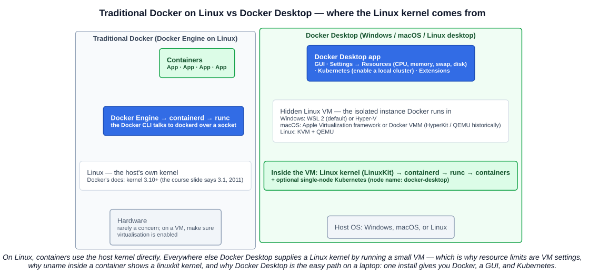

# 02 — Setup and Install of Docker

A short lecture: what "Docker" means on a Linux server versus on a laptop, installing Docker Desktop, switching on its Kubernetes, and running a first container. The quiz points are the flags and the architecture facts, so those are the focus.

---

## 1. Traditional Docker — Docker Engine on Linux

On a Linux host, Docker runs **natively on the host's kernel**. The stack, bottom up:

| Layer | Notes |
|---|---|
| **Hardware** | Rarely a concern. If the host is itself a **virtual machine, check that virtualisation (VT-x/AMD-V, nested virtualisation) is enabled** — otherwise containers work but anything that needs a VM inside (Docker Desktop, kind with certain runtimes, Kata) will not |
| **Operating system** | Linux. Docker's documentation requires **kernel 3.10 or higher**; the course slide gives **3.1, released 2011** (3.10 shipped in June 2013). Either way: any current distribution qualifies |
| **Container runtime** | **containerd and runc** — Docker Engine (`dockerd`) delegates to containerd, which delegates to runc, exactly the chain in chapter 02-07 |
| **Containers** | Built and run through the **Docker CLI**, which talks to the daemon over a Unix socket |

Install on Linux is a package (`apt`/`dnf`) or the convenience script; there is no VM involved.

---

## 2. Docker Desktop

**Docker Desktop** is the packaged product for **Windows, macOS, and Linux desktops**: a graphical application that bundles Docker Engine, the CLI, Docker Compose, BuildKit, an optional Kubernetes cluster, and an extensions marketplace.

The architectural point the quiz tests: **Docker Desktop runs Docker inside a hidden, isolated Linux virtual machine.** Containers need a Linux kernel; Windows and macOS don't have one; so Docker Desktop brings its own, using whatever virtualisation the host OS provides:

| Host OS | Virtualisation backend for the hidden VM |
|---|---|
| **Windows** | **WSL 2** (default, better performance) or **Hyper-V** |
| **macOS** | **Apple Virtualization framework** (default) or **Docker VMM**; the course lists **HyperKit** and **QEMU**, which were the earlier backends |
| **Linux** | **KVM + QEMU** — yes, Docker Desktop on Linux also uses a VM, unlike bare Docker Engine |



Consequences of the VM you will notice:

- **Resources are VM settings.** On a Mac, *Settings → Resources* sets the CPU, memory (default 50% of host RAM), swap and disk the VM may use — containers cannot use more than the VM has, whatever the host has. On Windows with the WSL 2 backend those limits are set on the WSL utility VM (`.wslconfig`) instead. On Linux Docker Engine there is no such layer: containers see the host directly.
- `uname -r` inside any container reports the VM's **LinuxKit** kernel (chapter 01's demo).
- Files and ports are bridged into the VM for you, which is why bind mounts and `localhost` ports work transparently.

### 2.1 Advantages over traditional Docker

| Advantage | What it gives you |
|---|---|
| **Works on Windows and macOS** | A Linux container environment without managing a VM yourself |
| **Graphical UI** | Containers, images, volumes, logs, a terminal, resource usage — all clickable |
| **Bundled Kubernetes** | A local cluster with one toggle (section 3) |
| **Docker Extensions** | Third-party tools that plug into the Desktop UI from a marketplace — log viewers, disk-usage analysers, database GUIs, security scanners — adding functionality without leaving the app |
| **One installer, auto-updates** | Engine, CLI, Compose, BuildKit, credential helpers kept in step |

Licensing: Docker Desktop is free for personal use, education, and small businesses; larger companies need a paid subscription (check Docker's current terms). Docker Engine on Linux is Apache-licensed and free everywhere.

### 2.2 OS differences worth knowing

| OS | Notes |
|---|---|
| **Windows** | Two modes: **Linux containers** (the default, via the WSL 2/Hyper-V VM) and **Windows containers** (need a Windows kernel; used for .NET Framework and IIS workloads). Switching modes is a tray-menu option |
| **macOS** | Apple silicon Macs run **arm64** images by default — hence `aarch64` in chapter 01's `uname` output; x86 images run through emulation (Rosetta) and are slower. Multi-architecture images make this invisible most of the time |
| **Linux** | Docker Engine runs natively; Docker Desktop for Linux exists for people who want the GUI and Kubernetes bundle, at the cost of a VM |

---

## 3. Kubernetes in Docker Desktop

*Settings → Kubernetes → Enable Kubernetes* installs a local cluster inside the same VM. Newer versions let you choose the provisioner: **kubeadm** (single node, version fixed by Docker Desktop) or **kind** (multi-node, version selectable). It also installs `kubectl` and adds a `docker-desktop` context.

```bash
kubectl config get-contexts              # docker-desktop appears; use-context if it isn't current
kubectl config use-context docker-desktop
kubectl get nodes
# NAME             STATUS   ROLES           AGE   VERSION
# docker-desktop   Ready    control-plane   86d   v1.24.2
```

One node, `Ready`, role `control-plane` — a single machine playing every part. The CNI, runtime and kubelet setup that kubeadm makes you do by hand (chapter 02-07) is all pre-done, which is why the node is `Ready` immediately. Good enough for every lab in this course; not representative of a multi-node cluster's scheduling and networking.

---

## 4. Running a container

```bash
docker run -it ubuntu bash
```

| Piece | Meaning |
|---|---|
| `docker run <image>` | Create a container from the image and **start it** — pulling the image from Docker Hub first if it isn't local |
| `-i` (`--interactive`) | Keep **STDIN open** so you can type into the container's process |
| `-t` (`--tty`) | Allocate a **pseudo-terminal**, so you get a proper shell with a prompt, line editing and colours |
| `bash` | The command to run as the container's main process (overriding the image's default) |

`-i` without `-t` gives you input but no terminal; `-t` without `-i` gives you a terminal you can't type into. Together (`-it`) they are how you get an interactive shell; for a service you use `-d` (detached) instead.

Inside the lecture's container:

```bash
apt update && apt install -y htop
htop
```

What `htop` showed, and what each thing means:

- **`bash` is PID 1** — the **main container process**. This is the PID namespace from chapter 01: the process you asked `docker run` to start is the first process in its own tree. When PID 1 exits (you type `exit`), **the container stops** — a container lives exactly as long as its main process.
- **`htop` is PID 255**, a child of bash — "our container command" — the only other process visible. No host processes, no other containers.
- The CPU meters showed **10 cores and 7.67 GB of memory** even though the container had no such allocation. That is the VM's hardware: **namespaces hide processes, mounts and networks, but `/proc/cpuinfo` and `/proc/meminfo` are not namespaced**, so tools like `htop`, `free` and `nproc` report the whole kernel's view. cgroups would *limit* what the container may use (`--memory`, `--cpus`) without changing what it *sees*. This surprises JVMs in particular — Java 10+ reads cgroup limits to size its heap for precisely this reason.
- The **root** user is the container's root (UID 0 in the container's user context), which is why `apt install` worked without `sudo`.

Exiting: `exit` ends bash → container stops (`docker ps -a` shows it *Exited*). `docker rm` removes it; `--rm` on the `run` would have done that automatically.

---

## Exam angle

- **What does Docker Desktop use to run an isolated instance of Docker?** A **hidden Linux virtual machine** — via WSL 2 or Hyper-V on Windows, the Apple Virtualization framework (earlier HyperKit/QEMU) on macOS, KVM + QEMU on Linux.
- **Main advantage of Docker Desktop over traditional Docker:** it runs on **Windows and macOS** with a **GUI**, bundling **Kubernetes** and **Extensions** — convenience and cross-platform, not performance.
- **Resource management on a Mac** is done in Docker Desktop's **Settings → Resources** because the limits apply to the VM; on Linux Engine, containers use the host directly.
- **Docker Extensions** add third-party tools into the Docker Desktop UI.
- **`docker run <image>`** creates and starts a container from an image; **`-i`** keeps STDIN open (interactive); **`-t`** allocates a pseudo-TTY.
- Traditional Docker's runtime is **containerd + runc**; minimum kernel per the course **3.1 (2011)**, per Docker's docs **3.10**. On VMs, **enable virtualisation**.
- The container's main process is **PID 1**; when it exits, the container stops.

## References

- [Docker Desktop settings — docs.docker.com](https://docs.docker.com/desktop/settings-and-maintenance/settings/) — Resources, the Virtual Machine Manager options (WSL 2 / Hyper-V; Apple Virtualization framework / Docker VMM), Kubernetes (kubeadm or kind), Extensions
- [Install Docker Desktop on Mac — docs.docker.com](https://docs.docker.com/desktop/setup/install/mac-install/) — requirements, Apple silicon vs Intel
- [Install Docker Engine from binaries — docs.docker.com](https://docs.docker.com/engine/install/binaries/) — "Version 3.10 or higher of the Linux kernel"
- [docker run reference — docs.docker.com](https://docs.docker.com/reference/cli/docker/container/run/) — `-i`, `-t`, `-d`, `--rm` and friends
