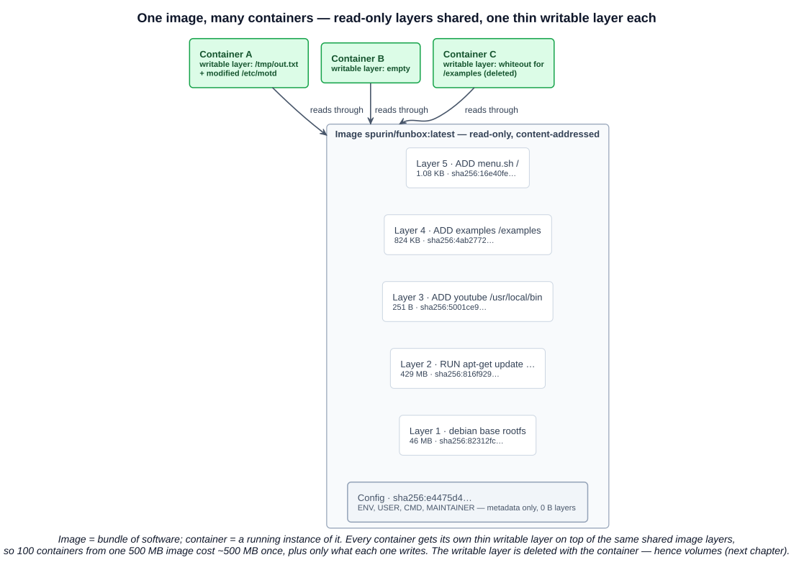
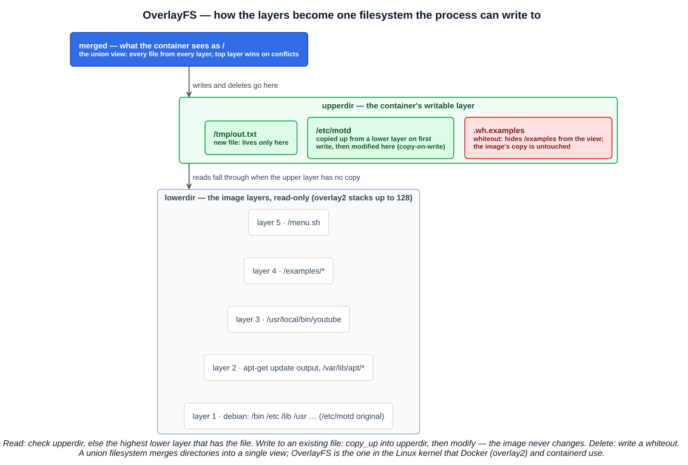
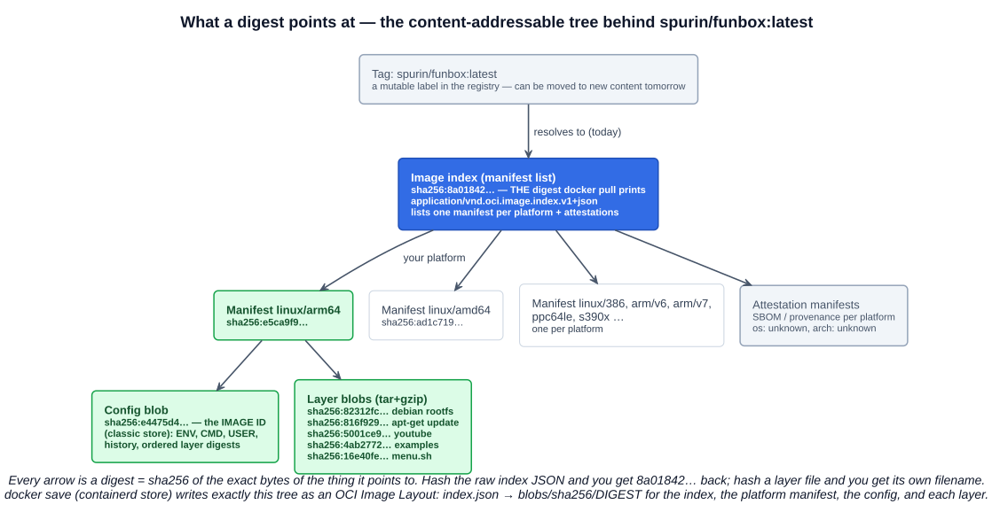

# 03 — Container Images

Chapter 01 explained the *process* side of a container — namespaces and cgroups. This chapter is the *filesystem* side: what an image is, how it is named, stored, layered, and identified, and how those layers become the `/` a container writes to. It ends where the next lecture starts: the writable layer dies with the container, which is why volumes exist.

---

## 1. What a container image is

A **container image** is a **portable, self-contained bundle of software and its dependencies** — the application, its libraries, the userspace of an OS (`/bin`, `/lib`, `/etc`…), and metadata saying how to run it. It is **versatile**: the same image runs consistently on a laptop, a CI runner, and a production cluster, because everything the software needs is inside it and the kernel is supplied by the host.

Terminology: they are often called "Docker images" because Docker made them. The precise term is an **OCI-compliant container image** — the format is the OCI **image-spec** (chapter 02-07), and Podman, Buildah, BuildKit, kaniko, and Jib all produce it; containerd, CRI-O, and Docker all consume it. Nothing about the format is Docker-specific any more.

### 1.1 Image vs container

| | Container image | Container |
|---|---|---|
| What | A **bundle of software** — read-only files plus config | A **running instance of that software** |
| Analogy | A class, a `.jar`, a template | An object, a running JVM, an instance |
| State | Immutable; identified by a digest | Mutable; has a writable layer, processes, an IP |
| Cardinality | One image → **many** containers, at once | Each container from exactly one image |
| Lifetime | Until you delete it from the registry/host | From `docker run` until PID 1 exits and it is removed |

`docker run nginx` four times gives four independent web servers from one `nginx` image — same bytes, four writable layers, four PID 1s.

---

## 2. Naming: registries, repositories, tags

### 2.1 The full reference

```
docker.io/spurin/funbox:latest
└──┬───┘ └─┬──┘ └─┬──┘ └─┬─┘
registry  namespace repository tag
```

| Part | Meaning | Default when omitted |
|---|---|---|
| **Registry** | The server that stores and serves images — the OCI **distribution-spec** API | `docker.io` (Docker Hub) |
| **Namespace** | A user or organisation on that registry | `library` — Docker Hub's **official images** (`ubuntu` = `docker.io/library/ubuntu`) |
| **Repository** | One piece of software, holding many versions | — |
| **Tag** | A label picking one version from the repository | `latest` |

So `docker pull ubuntu` is shorthand for `docker pull docker.io/library/ubuntu:latest`. Other registries need the host in the name: `ghcr.io/org/app:1.2`, `123456789.dkr.ecr.us-east-1.amazonaws.com/app:1.2`, `myregistry.local:5000/app:1.2`, `quay.io/…`, `registry.k8s.io/…`.

### 2.2 Registries

A **container registry** is a service that stores images and serves them over the OCI distribution API (push, pull, list tags, fetch blobs by digest). **Docker Hub** is the default and largest public one; the page for `spurin/funbox` shows what a registry tracks per image: tags, the **digest**, the **size**, last update, and the pull command. Alternatives: **Harbor** (open source, CNCF graduated), **GitHub Container Registry**, and every cloud's — ECR, GCR/Artifact Registry, ACR. Enterprises run a private registry so production only pulls vetted, scanned images.

### 2.3 Tags

A **tag** is a **label used to distinguish a version of a container image**. Tags are **flexible**: the repository owner decides what they mean. Two common schemes on one repository:

- **Versions:** `1.0.0`, `1.1.0`, `2.0.0`, `2.0.1`, `2.1.0` — semantic versioning, plus floating aliases such as `2`, `2.1`.
- **Variants:** `ubuntu`, `centos`, `rocky`, `aws`, `suse` — the same software on different base images; or `alpine`, `slim`, `jdk21`.

A tag is a **pointer, not content**: the owner can re-point `2.1.0` at a rebuilt image tomorrow. That is fine for `latest`; it is the reason production systems pin by digest (section 5).

### 2.4 The `latest` tag — three facts

| | |
|---|---|
| **Convenience** | `latest` is the **default tag used when no tag is specified** — on `pull`, `run`, `build -t`, and `push` |
| **Remember** | It is **just a default name**. It does **not** mean "the newest image". A `latest` tag exists only if someone pushed one, and it points wherever they last pointed it |
| **Warning** | A repository can easily have **newer images under other tags** than whatever `latest` points at — e.g. `latest` frozen at `1.4` while `2.0` ships under its own tag, or a `latest` that is a dev build |

The **quiz-grade takeaway**: `latest` = *default*, not *newest*. In Kubernetes, `:latest` (or no tag) also flips the default `imagePullPolicy` to `Always`, which is another reason to avoid it in manifests.

---

## 3. The Docker CLI — two syntaxes

Docker 1.13 (January 2017) reorganised the CLI into **management commands**: `docker <noun> <verb>`. The old `docker <verb>` forms still work as aliases and are what most people type.

| Traditional `docker <verb>` | Management `docker <noun> <verb>` | Does |
|---|---|---|
| `docker pull IMAGE` | `docker image pull IMAGE` | Download an image (all layers not already present) |
| `docker images` | `docker image ls` | List local images |
| `docker rmi IMAGE` | `docker image rm IMAGE` | Delete a local image |
| `docker run IMAGE` | `docker container run IMAGE` | Create and start a container |
| `docker ps` | `docker container ls` | List running containers (`-a` for all) |
| `docker rm ID` | `docker container rm ID` | Delete a container |
| `docker inspect X` | `docker image inspect` / `docker container inspect` | Full JSON metadata |
| `docker build -t NAME .` | `docker image build -t NAME .` (or `docker buildx build`) | Build an image from a Dockerfile |
| `docker tag SRC DST` | `docker image tag SRC DST` | Add another name/tag to a local image |
| `docker push IMAGE` | `docker image push IMAGE` | Upload to a registry |

Both forms appear in exam questions and in the CKA/CKS labs; know that they are the same thing. The noun form is self-documenting (`docker image --help` lists everything you can do to an image) and is the one this repo uses in its command files, with the short form alongside.

### 3.1 Pulling and what you see

```bash
docker pull docker.io/spurin/funbox:latest
# latest: Pulling from spurin/funbox
# 16e40fe69804: Pull complete
# 4ab2772cb1b5: Pull complete
# 82312fccb35f: Pull complete
# 5001ce9b1072: Pull complete
# 816f929598b0: Pull complete
# Digest: sha256:8a01842539972507846c938e120ecc1f5b9f921da77f4d0e81cae17f42f10b90
# Status: Downloaded newer image for spurin/funbox:latest
```

Each `Pull complete` line is one **layer**, identified by the start of its digest. Layers download **concurrently — three at a time by default** (`--max-concurrent-downloads` on the daemon) — and any layer already on the host is skipped ("Already exists"), which is what makes pulling a new version of an image you already have fast. The **Digest** line is the identity of what you pulled; section 5 explains it.

---

## 4. Layers and the union filesystem

### 4.1 An image is a stack of layers

An image is not one big file. It is an **ordered stack of layers**, each a tar archive of **filesystem changes** relative to the layer below — files added, changed, or deleted. Each layer corresponds to a Dockerfile instruction that touched the filesystem. The Docker Desktop view of `spurin/funbox`:

| # | Instruction | Size | Layer? |
|---|---|---|---|
| 1 | `# debian.sh --arch arm64 out/` (the base rootfs) | 46.09 MB | yes |
| 2 | `MAINTAINER …` | 0 B | no — metadata |
| 3 | `RUN /bin/sh -c apt-get update` | 429.24 MB | yes |
| 4 | `USER john` | 0 B | no |
| 5 | `ENV PATH=…` | 0 B | no |
| 6 | `ENV TERM=xterm-256color` | 0 B | no |
| 7 | `ADD youtube /usr/local/bin/youtube` | 251 B | yes |
| 8 | `ADD examples /examples` | 824.5 KB | yes |
| 9 | `ADD menu.sh /` | 1.08 KB | yes |
| 10 | `CMD ["/menu.sh"]` | 0 B | no |

Ten instructions, **five layers** — exactly the five `Pull complete` lines. The **0 B instructions** (`MAINTAINER`, `USER`, `ENV`, `CMD`, also `LABEL`, `EXPOSE`, `WORKDIR`, `ENTRYPOINT`) change **only metadata**: they are recorded in the image's **config** (`history` entries marked `empty_layer`) and grouped with the neighbouring filesystem layer in the display. Only instructions that **modify the filesystem** — the base `FROM`, `RUN`, `COPY`, `ADD` — produce a layer. This is why Dockerfile advice says "chain `RUN` commands with `&&`": one `RUN` = one layer, and a file created in one layer then deleted in a later one still costs its full size in the image.



### 4.2 Why layers

- **Sharing.** Layers are identified by their content hash, so two images built on the same `debian` base share that 46 MB on disk and in the registry, once.
- **Caching.** `docker build` reuses any layer whose instruction and inputs haven't changed; a pull skips layers already present.
- **Immutability.** A layer, once built, never changes; a new build produces new layers with new digests.

### 4.3 The union filesystem — OverlayFS

A stack of tar archives is not something a process can `open()` a file in. When a container starts, the runtime **merges the layers into a single view** with a **union filesystem** — a filesystem that overlays several directories and presents them as one. The one in the Linux kernel is **OverlayFS**; Docker's `overlay2` storage driver and containerd's overlayfs snapshotter both use it.



| OverlayFS term | Is |
|---|---|
| **lowerdir** | The image layers — **read-only**; `overlay2` stacks up to 128 of them |
| **upperdir** | The container's **thin writable layer**, created empty when the container is created |
| **merged** | The **unified view** mounted as the container's `/` — every file from every layer, the highest layer winning where paths collide |
| workdir | Scratch space OverlayFS needs internally |

What happens to file operations inside the container:

| Operation | Mechanism |
|---|---|
| **Read** an image file | Served straight from whichever lower layer has it — no copy, no cost |
| **Create** a new file | Written to the upperdir only |
| **Modify** an image file | **Copy-on-write**: on the first write, OverlayFS **copies the whole file up** into the upperdir (`copy_up`) and the write lands on the copy. The image's original is untouched; later writes hit the copy directly |
| **Delete** an image file | A **whiteout** entry is written to the upperdir that hides the lower file from the merged view. The bytes are still in the image layer |

Two consequences worth knowing as a developer:

- **Image layers are never modified by running containers.** That is what makes one image safely shareable by many containers and what makes "it works the same everywhere" true.
- **The writable layer is per container and ephemeral.** It is **deleted when the container is removed**; it is not portable; it is slower than a normal filesystem for write-heavy work because of copy-up; and it is invisible to other containers. Databases, uploads, logs you need to keep — anything that must outlive the container or be shared — must live **outside** the layer stack, in a **volume** or **bind mount**. That is the next lecture.

### 4.4 What this looks like from the host

On a Linux Docker host, every layer and every container's upperdir is a real directory under `/var/lib/docker/overlay2/`, and `docker inspect <container>` shows the exact `LowerDir`, `UpperDir`, `MergedDir` paths. `docker diff <container>` lists the upperdir's contents — every file the container has added (`A`), changed (`C`) or deleted (`D`) — which is the cleanest way to *see* the writable layer.

---

## 5. Digests vs image IDs vs tags

### 5.1 Content addressing

Everything in an OCI image is **content-addressed**: its identifier is the **SHA-256 hash of its own bytes**. That applies at every level of the tree — the index, each manifest, the config, each layer:



| Object | Contains | Its digest is |
|---|---|---|
| **Image index** (manifest list) | One entry per platform, each with a manifest digest and `platform: {os, architecture, variant}`; plus **attestation manifests** (SBOM/provenance, `os: unknown`) | `sha256(index JSON)` — **the digest `docker pull` prints** for a multi-arch image |
| **Manifest** (per platform) | The config digest and the ordered list of layer digests, with sizes and media types | `sha256(manifest JSON)` |
| **Config** | `ENV`, `CMD`, `USER`, `WORKDIR`, the `history`, and `rootfs.diff_ids` (the layers in order) | `sha256(config JSON)` — the classic **image ID** |
| **Layer** | A tar (usually gzip) of filesystem changes | `sha256(layer bytes)` |

Because an identifier *is* a hash of the content, a digest is **immutable**: the only way to get a different digest is to change the bytes. A tag is the opposite — a mutable name in the registry that *currently* resolves to some index or manifest digest. The registry itself stores blobs by digest and tags as pointers; the Dockerfile's `FROM` line and every `Pull complete` are digest lookups underneath.

### 5.2 Reproducing the digest yourself

The lecture's demo, and why it works:

```bash
docker buildx imagetools inspect spurin/funbox --raw | sha256sum   # Linux
docker buildx imagetools inspect spurin/funbox --raw | shasum -a 256   # macOS
# 8a01842539972507846c938e120ecc1f5b9f921da77f4d0e81cae17f42f10b90
```

`imagetools inspect --raw` fetches the image's **index document from the registry, byte for byte** (`mediaType: application/vnd.oci.image.index.v1+json`, `manifests: [...]` — the JSON you saw on Windows). Hashing those exact bytes gives `8a01842…`, which is the `Digest:` from the pull. Nothing was looked up: **the digest is the hash, so hashing the content reproduces it**. Change one byte of the index — one platform entry, one annotation — and the digest changes.

On Windows the pipe is the awkward part, not the concept: PowerShell 5.1 re-encodes text going through `|` to a native command, which changes the bytes and therefore the hash. Two ways that work:

```powershell
# 1. Skip --raw: imagetools prints the digest it computed on the first line
docker buildx imagetools inspect spurin/funbox
# Name:      docker.io/spurin/funbox:latest
# MediaType: application/vnd.oci.image.index.v1+json
# Digest:    sha256:8a01842539972507846c938e120ecc1f5b9f921da77f4d0e81cae17f42f10b90

# 2. Write the raw bytes via cmd (no re-encoding), then hash the file
cmd /c "docker buildx imagetools inspect spurin/funbox --raw > index.json"
Get-FileHash index.json -Algorithm SHA256
```

Or run the Linux form inside WSL — `wsl sha256sum index.json` — which is also the honest answer to "everything is harder on Windows" until the ThinkPad gets its Linux install.

### 5.3 The `docker save` walkthrough — the tree on disk

```bash
docker save spurin/funbox -o funbox.tar
tar xvf funbox.tar
# blobs/sha256/16e40fe6…  4ab2772c…  5001ce9b…  816f9295…  82312fcc…   ← the 5 arm64 layers
# blobs/sha256/8a018425…                                              ← the index  (the pull digest)
# blobs/sha256/e4475d4c…                                              ← the config
# blobs/sha256/e5ca9f9c…                                              ← the arm64 manifest
# index.json  manifest.json  oci-layout
```

This is an **OCI Image Layout** — the on-disk form the OCI image-spec defines: an `oci-layout` version file, an `index.json` entry point, and `blobs/<algorithm>/<digest>` where **each file's content must hash to its own filename**. The lecture's breakdown, following the references:

1. `index.json` (top level) points at digest `8a01842…` — the image index — with annotations naming `docker.io/spurin/funbox:latest`. `manifest.json` is Docker's legacy companion listing the config and layers for the platform that was saved.
2. Blob `8a01842…` *is* the index: it lists every platform's manifest digest.
3. The entry matching the host (`arm64` on the instructor's Mac) is `e5ca9f9…`.
4. Blob `e5ca9f9…` is the arm64 **manifest**: it names the config `e4475d4…` and the five layer digests.
5. Those five blobs are the **layers**, in the order they stack.

And the proof of content addressing on disk: `cat blobs/sha256/8a01842… | sha256sum` prints `8a01842…`. The file is named by its own hash. (Bonus: the `docker save` output being an OCI layout, and `docker images` showing `8a0184253997` as the IMAGE ID, both tell you the instructor's Docker Desktop is using the **containerd image store** — default since Docker Desktop 4.34 — which stores and identifies images by their OCI index/manifest digest. The classic store showed the config digest as the ID and saved a different tarball shape.)

### 5.4 Pulling by digest — and what your pipeline is doing

```bash
docker pull spurin/funbox@sha256:8a01842539972507846c938e120ecc1f5b9f921da77f4d0e81cae17f42f10b90
docker pull spurin/funbox:latest@sha256:8a01842…      # tag for readability, digest for identity
```

A reference with `@sha256:…` **ignores the tag** and fetches exactly those bytes; if the registry's content doesn't hash to that digest, the pull fails. Kubernetes accepts the same form in `image:`, and it is how security-conscious deployments guarantee that what was scanned is what runs.

About the pipeline at work: an image name like `app:3f9c2a1` — the git commit SHA as the tag — is a **tag**, not a digest. It is a good tag, because it is unique per build and traces straight back to the source, and it is how you tell deployed instances apart. But it is still a mutable pointer that a rebuild could overwrite. The digest is what the registry computed from the bytes that build produced; a pipeline that wants both readability and immutability records the digest after the push (`docker push` prints it; `docker inspect --format '{{index .RepoDigests 0}}'` retrieves it) and deploys `app:3f9c2a1@sha256:…`.

### 5.5 Three identifiers, side by side

| | Tag | Image ID | Digest |
|---|---|---|---|
| Example | `spurin/funbox:latest` | `8a0184253997` (12-char prefix shown by `docker images`) | `sha256:8a01842…` (64 hex) |
| Is | A human label in a registry/host | A local identifier — the config digest (classic store) or the index/manifest digest (containerd store) | The content hash of the index or manifest in the **registry** |
| Mutable? | **Yes** — can be re-pointed | No | **No** |
| Same across hosts/registries? | Only by convention | Config-based IDs, yes; but not usable for pulling | **Yes** — the same everywhere the same bytes live |
| Use it for | Humans, `docker run`, dev | `docker rmi`, local scripting | **Pinning** in production, supply-chain verification |

---

## Exam angle

- A **container image** is a **portable, self-contained bundle of software and dependencies**; a **container is a running instance** of an image; one image can back many containers.
- The proper term is an **OCI-compliant container image**, not "Docker image" — built by Docker, BuildKit, Podman, Buildah; run by any OCI runtime.
- **Registry** stores images (Docker Hub is the default, `docker.io`); official images live under `library/`; **tag** distinguishes a version; a reference is `registry/namespace/repository:tag`.
- **`latest`** is the **default tag when none is given**; it does **not** mean newest; newer images may exist under other tags.
- `docker pull` = `docker image pull`; management commands are `docker <noun> <verb>` (since 1.13). Layers download concurrently (3 at a time by default).
- An image is a **stack of read-only layers**; only filesystem-changing instructions (`FROM`, `RUN`, `COPY`, `ADD`) create layers; `ENV`, `CMD`, `USER`, `LABEL`… are metadata (0 B).
- A **union filesystem** (OverlayFS / `overlay2`) merges the layers into a **single view**; each container gets a **thin writable layer** on top; writes use **copy-on-write**; deletes use **whiteouts**; image layers are never modified; the writable layer is deleted with the container — persist data with **volumes**.
- **Digest** = **SHA-256 hash of the image's content (index/manifest, layers, metadata)** — immutable, content-addressable; you can **pull by digest** with `@sha256:…`. A tag is mutable. Hashing the raw index reproduces the digest.
- Multi-architecture images have an **image index** (manifest list) with one manifest per `os/architecture`; the runtime picks the one matching the host.

## References

- [Docker storage drivers — images and layers, the container layer, copy-on-write](https://docs.docker.com/engine/storage/drivers/) — "each layer represents an instruction in the image's Dockerfile", the thin writable layer, layer sharing
- [OverlayFS storage driver](https://docs.docker.com/engine/storage/drivers/overlayfs-driver/) — lowerdir / upperdir / merged, copy_up, whiteouts, 128 lower layers
- [docker image pull reference](https://docs.docker.com/reference/cli/docker/image/pull/) — `:latest` as the default tag, pulling by digest, concurrent layer downloads, other registries
- [OCI Image Layout specification](https://github.com/opencontainers/image-spec/blob/main/image-layout.md) — `oci-layout`, `index.json`, `blobs/<alg>/<digest>` and the rule that a blob's content must match its digest
- [containerd image store in Docker Desktop](https://docs.docker.com/desktop/features/containerd/) — default since 4.34; multi-platform images and attestations
