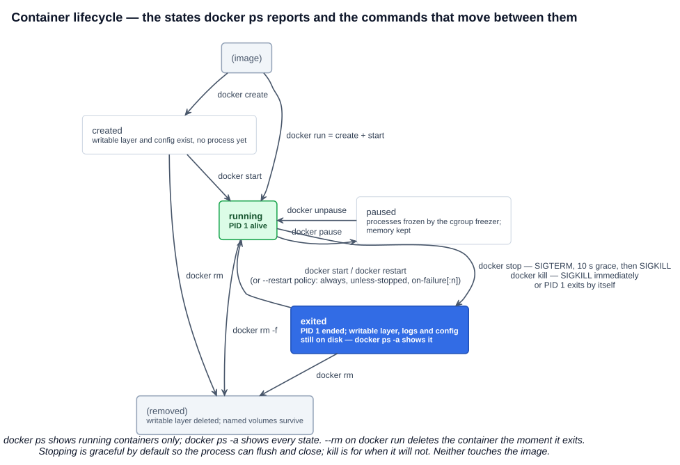

# 04 — Running Containers

The lecture is hands-on, so the substance lives in [`../commands/docker.md`](../commands/docker.md), which this chapter turns into a full reference of the Docker commands worth knowing for daily use and for the certification labs. What follows is the small set of concepts the commands assume.

---

## 1. The lifecycle

A container is a process with state that outlives the process. `docker ps` reports that state, and every lifecycle command is a transition between states:



| State | Meaning |
|---|---|
| **created** | `docker create` built the container — writable layer, config, network attachment — but nothing is running yet |
| **running** | The main process (PID 1) is alive |
| **paused** | Every process frozen in place by the cgroup freezer; memory retained; nothing scheduled |
| **exited** | PID 1 ended (by itself, or via `stop`/`kill`). The container still exists: its writable layer, logs, and config are on disk, and `docker ps -a` lists it with the exit code |
| **restarting** | The daemon is bringing it back under a restart policy |
| (removed) | `docker rm` deleted the writable layer and config. Named volumes attached to it survive |

Two things trip people up:

- **`docker run` is two commands** — `docker create` then `docker start`. Almost every flag you pass to `run` is really a `create` flag: the container's name, ports, mounts, environment, and command are fixed at creation and cannot be changed with `start`. To change them, create a new container.
- **A stopped container is not gone.** It holds disk (its writable layer) and its name (you can't reuse `--name web` until it is removed). `docker ps -a`, `docker container prune`, and `--rm` exist because of this.

### 1.1 stop vs kill

| | `docker stop` | `docker kill` |
|---|---|---|
| Signal | **SIGTERM** to PID 1, then after a grace period **SIGKILL** | **SIGKILL** immediately (or any signal with `-s`) |
| Grace period | **10 seconds** by default (`-t`); 30 s for Windows containers | none |
| Use | Normal shutdown — lets the app finish requests, flush, close connections | A hung process |
| Override | The image's `STOPSIGNAL` or `--stop-signal` picks a different first signal (nginx uses `SIGQUIT` for graceful drain) | — |

Kubernetes does the same dance on Pod deletion: SIGTERM, `terminationGracePeriodSeconds` (default 30), then SIGKILL. An application that ignores SIGTERM gets killed uncleanly in both worlds — for a Java service that means shutdown hooks never run unless the JVM is PID 1 or the entrypoint forwards signals (`exec java …`, not `java …` from a shell script).

### 1.2 Restart policies

`--restart` is the daemon's own supervision, independent of Kubernetes:

| Policy | Behaviour |
|---|---|
| `no` (default) | Never restart |
| `on-failure[:N]` | Restart if the process exits non-zero, at most N times |
| `always` | Restart whenever it stops, and start it on daemon boot — even after a manual `docker stop` once the daemon restarts |
| `unless-stopped` | Like `always`, except a manually stopped container stays stopped across daemon restarts |

---

## 2. Interacting with a running container

| Command | What it does | When |
|---|---|---|
| `docker exec -it C sh` | Starts an **additional process** inside the container's namespaces | The normal way to get a shell or run a one-off command; exiting it leaves PID 1 running |
| `docker attach C` | Connects your terminal to **PID 1's** stdin/stdout | Rarely what you want: `Ctrl-C` sends SIGINT to the main process and can stop the container; detach with `Ctrl-P Ctrl-Q` |
| `docker logs C` | Shows what PID 1 wrote to **stdout/stderr** (`-f` follow, `--tail`, `--since`, `-t` timestamps) | The container convention: log to stdout, not to files; the runtime captures it and Kubernetes' `kubectl logs` reads the same stream |
| `docker cp` | Copies files in or out of a container's filesystem | Pulling a log or config out of a stopped container |
| `docker top` / `docker stats` | Processes inside / live cgroup CPU, memory, network, I/O | Quick diagnosis |
| `docker inspect C` | Full JSON: state, config, mounts, network settings, IP | Scripting with `--format '{{…}}'` |

---

## 3. The `docker run` flags that matter

```
docker run [flags] IMAGE [COMMAND] [ARGS]
```

| Flag | Meaning |
|---|---|
| `-d` | Detached — background, print the ID |
| `-it` | Interactive + TTY — a usable shell |
| `--rm` | Delete the container when it exits |
| `--name NAME` | A name instead of a random one (`adoring_mendel`); used by other commands and by DNS on user-defined networks |
| `-p HOST:CONTAINER` / `-P` | Publish a port / publish all `EXPOSE`d ports to random host ports (chapter 05) |
| `-v` / `--mount` | Volumes and bind mounts (chapter 05) |
| `-e KEY=VALUE`, `--env-file` | Environment variables — the standard way to configure a container |
| `-w DIR` | Working directory inside the container |
| `-u USER[:GROUP]` | Run as a non-root user (do this in production) |
| `--network NET` | Which network to attach to (chapter 05) |
| `--memory`, `--cpus` | cgroup limits (chapter 01) |
| `--restart POLICY` | Section 1.2 |
| `--entrypoint` | Override the image's `ENTRYPOINT`; `COMMAND` after the image overrides `CMD` |

The `COMMAND` you put after the image **replaces the image's `CMD`** and becomes PID 1 — `docker run ubuntu` runs the image's default `bash` and exits immediately (no TTY, nothing to do); `docker run ubuntu sleep 3600` stays up for an hour. A container lives exactly as long as its PID 1.

---

## Exam angle

- `docker run` = `docker create` + `docker start`; flags are fixed at creation.
- **`docker stop` sends SIGTERM, waits 10 s, then SIGKILL; `docker kill` sends SIGKILL at once.** A question offering "stop sends SIGKILL" is the distractor.
- **`docker ps` lists running containers; `docker ps -a` lists all** including exited ones; `docker rm` deletes a stopped container, `docker rm -f` a running one; `--rm` auto-deletes on exit.
- **`docker exec` runs a new process in an existing container** (the way to get a shell); `docker attach` attaches to PID 1. Logs come from PID 1's stdout/stderr via `docker logs`.
- Restart policies: `no`, `on-failure[:N]`, `always`, `unless-stopped`.
- The container's main process is whatever command runs as PID 1; when it exits the container exits. The command after the image name overrides `CMD`; `--entrypoint` overrides `ENTRYPOINT`.
- The management-command spelling is `docker container run/ls/stop/rm/exec/logs`; the short forms are aliases.

## References

- [docker container run](https://docs.docker.com/reference/cli/docker/container/run/) — every flag, including `-P`, `-p`, `--restart`, `--mount`
- [docker container stop](https://docs.docker.com/reference/cli/docker/container/stop/) — SIGTERM, the grace period, SIGKILL, `--signal`
- [docker container ls](https://docs.docker.com/reference/cli/docker/container/ls/) — the `status` filter values: created, restarting, running, removing, paused, exited, dead
