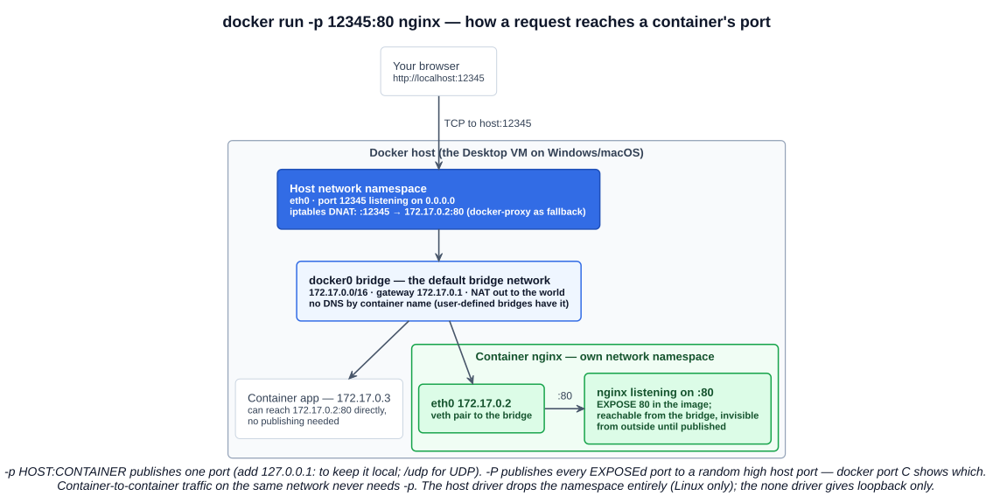
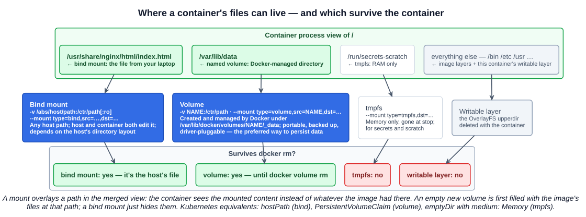

# 05 — Container Networking and Volumes

Two consequences of chapter 01's namespaces: a container has its **own network namespace**, so nothing inside it is reachable until you say so; and its **own mount namespace** with an ephemeral writable layer, so nothing it writes survives unless you put it somewhere else. The lecture uses nginx for both because it listens on port 80 by default and serves a directory you can replace.

---

## 1. Network services — publishing ports

### 1.1 Why a container is unreachable by default

`docker run -d nginx` starts a web server listening on port 80 — **inside the container's network namespace**. That namespace has its own `eth0` (an address on the `docker0` bridge, `172.17.0.x`), its own routing table, and its own port space. The host's port 80 is untouched; `curl localhost` from your laptop gets nothing. Other containers on the same bridge *can* reach `172.17.0.2:80` directly, because they share the bridge — publishing is only about crossing the boundary to the host and the outside world.

The image's `EXPOSE 80` is **documentation plus metadata**: it tells `docker inspect`, `docker ps`, and `-P` which ports the software uses. It opens nothing by itself.

### 1.2 `-p` and `-P`

| Flag | Does | Example |
|---|---|---|
| `-p HOST:CONTAINER` (`--publish`) | Maps one host port to one container port; the host listens on **all interfaces** (`0.0.0.0`) unless you prefix an IP | `-p 12345:80` → `http://localhost:12345`; `-p 127.0.0.1:12345:80` local only; `-p 5353:53/udp` |
| `-P` (`--publish-all`) | Publishes **every `EXPOSE`d port to a random high host port** (32768+) | `docker port C` or `docker ps` shows `0.0.0.0:55001->80/tcp` |
| `-p CONTAINER` | Same as `-P` for one port — random host port | `-p 80` |

The instructor's `docker run -d -P -p 12345:80 nginx` does both: port 80 gets the explicit 12345 *and* `-P` would publish anything else exposed (nginx exposes only 80, so nothing extra).



Under the hood, `-p` installs an **iptables DNAT rule** on the host (and a `docker-proxy` userspace fallback) so packets arriving at host `:12345` are rewritten to `172.17.0.2:80` and sent across the bridge. On Docker Desktop this happens inside the hidden VM and the app forwards the port to Windows/macOS, which is why `localhost:12345` still works from the browser.

One thing to know for production Linux hosts: because `-p` writes rules into the `DOCKER` iptables chain ahead of the host's own firewall rules, **a published port is reachable from outside even if `ufw` or `firewalld` would otherwise block it**. Bind to `127.0.0.1` when a port should stay local.

### 1.3 Network drivers

`docker network ls` on a fresh install shows three networks; the driver decides what "connected" means:

| Driver | Behaviour | Use |
|---|---|---|
| **bridge** (default) | A private virtual switch (`docker0`) per host; containers get a private IP and NAT out; ports must be published to be reached | Everything on a single host |
| **host** | No network namespace — the container shares the host's stack; `:80` in the container *is* host `:80`; no `-p` possible or needed | Performance-sensitive or network tooling; Linux only (on Desktop it's the VM's stack) |
| **none** | Loopback only | Batch jobs that must not talk to anything |
| **overlay** | A virtual network spanning several Docker hosts (Swarm) | Multi-host without Kubernetes |
| **macvlan** / **ipvlan** | Containers get addresses on the physical LAN, appearing as real hosts | Legacy apps that need a routable IP |

### 1.4 User-defined networks — the one habit to adopt

The default `bridge` has **no DNS**: containers find each other by IP only. A **user-defined bridge** (`docker network create app-net`) gives every container on it a DNS name equal to its `--name`, isolates it from containers on other networks, and lets you connect/disconnect at runtime:

```bash
docker network create app-net
docker run -d --name db  --network app-net postgres:16
docker run -d --name api --network app-net -e DB_HOST=db myapi     # "db" resolves — no IPs in config
```

That is exactly the model Kubernetes generalises: a Service name resolves via cluster DNS, and Pods never hard-code IPs. Docker Compose creates a user-defined network per project for the same reason.

---

## 2. Changing what nginx serves

### 2.1 Inside the container — the wrong way

```bash
docker exec -it C bash
echo "hello" > /usr/share/nginx/html/index.html
```

It works, and it teaches the mechanics: the edit lands in the container's **writable layer** (chapter 03), so `docker diff C` shows `C /usr/share/nginx/html/index.html`. But it is a bad way to run anything:

- The change lives in **one container**. Start a second from the same image and it has the original page. `docker rm` and it is gone.
- It cannot be versioned, reviewed, or reproduced; nobody can tell from the image what is running.
- Copy-up on every edit and growth of the writable layer.

Content that changes independently of the image belongs **outside** the layer stack, delivered to the container by a **mount**.

### 2.2 Mount types



| | **Bind mount** | **Volume** | **tmpfs** |
|---|---|---|---|
| Source | Any **absolute path on the host** you name | A directory **Docker creates and manages** under `/var/lib/docker/volumes/NAME/_data` | Host **memory** |
| Syntax | `-v /abs/path:/ctr/path[:ro]` · `--mount type=bind,src=/abs/path,dst=/ctr/path[,readonly]` | `-v NAME:/ctr/path[:ro]` · `--mount type=volume,src=NAME,dst=/ctr/path` | `--mount type=tmpfs,dst=/ctr/path` |
| Created if missing | With `-v`, Docker silently **creates an empty directory** at a missing host path (the classic "my file became a folder" bug); `--mount` **errors** instead — one reason to prefer it | **Yes**, automatically | n/a |
| Contents at first mount | Host content **hides** whatever the image had at that path | An **empty new volume is pre-populated** with the image's files at that path (so `postgres` volumes start initialised) | Empty |
| Survives `docker rm` | Yes — it is the host's file | Yes — until `docker volume rm` | No |
| Portable / backed up / driver-pluggable | No — depends on the host's directory layout | Yes — the **preferred way to persist data** | No |
| Typical use | Source code and config from your laptop during **development**; this lecture's `index.html` | **Databases**, uploads, anything the app owns and must keep | Secrets, scratch space that must never hit disk |
| Kubernetes analogue | `hostPath` | `PersistentVolumeClaim` (via CSI) | `emptyDir` with `medium: Memory` |

`-v` and `--mount` do the same thing; `--mount` is explicit about the type and is the form Docker's docs recommend. `:ro` / `readonly` makes the mount read-only inside the container — right for content the container should only serve.

### 2.3 The lecture's bind mount

```bash
mkdir my_web_page
echo "hello from James" > my_web_page/index.html
docker run -d --rm -p 12345:80 -v /Users/james/my_web_page:/usr/share/nginx/html nginx
```

The host directory `my_web_page` is **overlaid onto `/usr/share/nginx/html`** — the "volume layer" in the lecture's words. nginx, which knows nothing about Docker, reads `index.html` from what it thinks is a normal directory; edit the file on the laptop and the next refresh serves the new content, no restart, no rebuild. Mounting the **directory** replaces nginx's whole document root (its default `index.html` and `50x.html` disappear from view); mounting **just the file** overlays only that one path and leaves the rest of the image's directory intact.

### 2.4 The same thing on Windows — and the command that finally worked

Two rules make Windows bind mounts painful: with `-v` the **host path must be absolute** (anything without a leading `/` or drive letter is read as a *volume name*, so `-v index.html:/…` silently creates a volume called `index.html`), and the **shell you type in decides the path syntax**. `--mount type=bind` accepts relative paths in current Docker, but the container side is always absolute.

| Shell | Working directory expansion | Path form |
|---|---|---|
| PowerShell | `${PWD}` (or `$PWD`) | `C:\Users\casey\Downloads\index.html` — quote the whole argument |
| cmd | `%cd%` | `C:\Users\casey\Downloads\index.html` |
| WSL | `$(pwd)` | `/mnt/c/Users/casey/Downloads/index.html` |
| Git Bash | `$(pwd)` | `/c/Users/casey/…` — but Git Bash rewrites the *container* path too; prefix `MSYS_NO_PATHCONV=1` |

The version that worked here, mounting the single file read-only from PowerShell:

```powershell
docker run -d --rm -p 12345:80 -v "${PWD}\index.html:/usr/share/nginx/html/index.html:ro" nginx
```

Why each piece is there: `${PWD}` expands to the absolute directory so the path is absolute; the quotes stop PowerShell from splitting on the colon or the backslash; `:ro` because a web root should be read-only; and mounting the **file** rather than the directory means the page at `/usr/share/nginx/html/index.html` is replaced while nginx's other files stay. The runnable copy of that page is in [`examples/docker/nginx-bind-mount/`](../../examples/docker/nginx-bind-mount/).

Two Windows-specific facts behind the friction: Docker Desktop has to **share the drive** into its Linux VM (Settings → Resources → File sharing on Hyper-V; automatic under WSL 2), and files under `C:\` are served to the VM across that share, which is slow for large trees — keeping projects inside the WSL filesystem (`~/…` in Ubuntu) and running Docker from there is the fast path, and the main reason the ThinkPad-on-Linux plan will make all of this simpler.

### 2.5 Named volumes — the persistent-data path

```bash
docker volume create pgdata
docker run -d --name db -v pgdata:/var/lib/postgresql/data -e POSTGRES_PASSWORD=x postgres:16
docker rm -f db                                          # container gone
docker run -d --name db2 -v pgdata:/var/lib/postgresql/data -e POSTGRES_PASSWORD=x postgres:16   # data still there
docker volume inspect pgdata                             # "Mountpoint": "/var/lib/docker/volumes/pgdata/_data"
docker volume ls ; docker volume rm pgdata ; docker volume prune
```

A volume's lifecycle is **independent of any container** — that is the whole point, and it is what a PersistentVolume is in Kubernetes. `docker rm -v` also removes a container's *anonymous* volumes (those created by a Dockerfile `VOLUME` instruction without a name); named ones are never deleted implicitly.

---

## Exam angle

- A container's ports are **not reachable from the host by default** (own network namespace). **`-p HOST:CONTAINER`** publishes one; **`-P`** publishes **all `EXPOSE`d ports to random host ports**. `EXPOSE` alone opens nothing.
- The **default network driver is `bridge`** (`docker0`); **`host`** shares the host's network stack; **`none`** is isolated; **`overlay`** spans hosts. **User-defined bridges provide DNS by container name; the default bridge does not.**
- Editing files inside a running container changes only that container's **writable layer** — not the image, not other containers, and it is lost on `rm`.
- Three mount types: **volumes** (Docker-managed, **preferred for persistence**, survive container removal), **bind mounts** (a host path, for development and config), **tmpfs** (memory only). `-v` and `--mount` are equivalent; `--mount` is recommended; `:ro` / `readonly` for read-only.
- An **empty volume is pre-populated** from the image's directory; a **bind mount hides** it. With `-v`, a source that isn't an absolute path is treated as a **volume name**; `-v` creates missing host directories, `--mount` errors.
- Volumes live under `/var/lib/docker/volumes/` and are managed with `docker volume create/ls/inspect/rm/prune`; their lifecycle is independent of containers.
- Kubernetes mapping: `hostPath` ≈ bind mount, `PersistentVolumeClaim` ≈ volume, `emptyDir` (`medium: Memory`) ≈ tmpfs; Service DNS ≈ user-defined-network DNS; `containerPort` ≈ `EXPOSE`.

## References

- [Networking overview — docs.docker.com](https://docs.docker.com/engine/network/) — drivers, the default bridge, user-defined networks and DNS, published ports
- [Storage overview](https://docs.docker.com/engine/storage/) and [Volumes](https://docs.docker.com/engine/storage/volumes/) — volumes vs bind mounts vs tmpfs, `-v` vs `--mount`, pre-population of empty volumes, read-only mounts
- [docker container run — `-p`, `-P`, `-v`, `--mount`, `--network`](https://docs.docker.com/reference/cli/docker/container/run/)
- [Bind mounts](https://docs.docker.com/engine/storage/bind-mounts/) — absolute paths, hiding container content, Windows/macOS file-sharing notes
