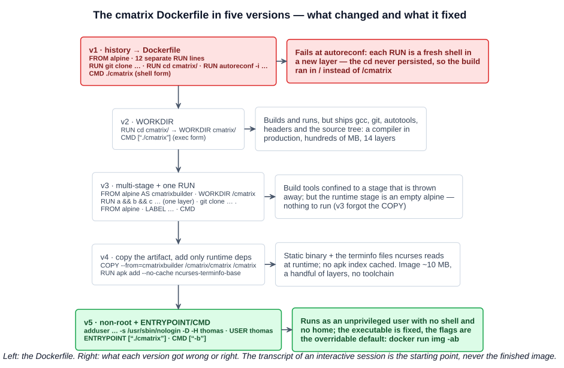
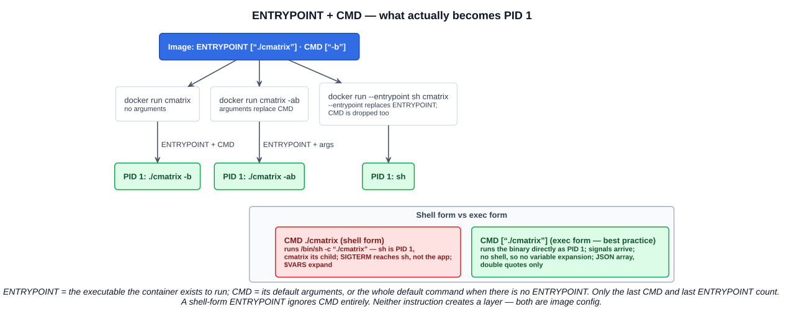
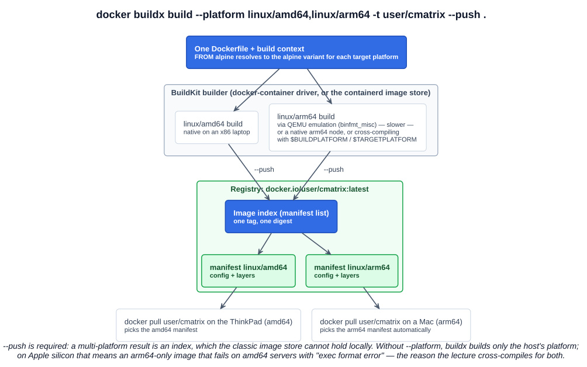

# 06 — Building Container Images

Three lectures, one thread: take a program's source (**cmatrix**, the Matrix rain for your terminal), compile it inside a container, capture the steps as a **Dockerfile**, then improve that Dockerfile five times until it is small, safe, and reproducible. The improvements are the lesson — each one is a rule you will see again in every production Dockerfile and in the certification labs.

---

## 1. From an interactive session to a Dockerfile

### 1.1 Work it out by hand first

The instructor's method is worth copying: get an interactive shell in the base image, fumble through the build until it works, then read back `history`. That transcript is the first draft of the Dockerfile.

```bash
docker run -it alpine sh
```

```
apk update ; apk add git
git clone https://github.com/spurin/cmatrix.git
cd cmatrix
autoreconf -i                 # fails: needs autoconf → apk add autoconf; then automake
./configure LDFLAGS="-static" # fails: needs a compiler → apk add alpine-sdk; then ncurses-dev ncurses-static
mkdir -p /usr/lib/kbd/consolefonts /usr/share/consolefonts   # configure wants these to exist
./configure LDFLAGS="-static"
make
./cmatrix                     # it rains
history
```

Two decisions taken here matter later. **Alpine** as the base: a ~8 MB Linux with the `apk` package manager and musl libc, the usual choice when image size matters. **`LDFLAGS="-static"`**: link the binary statically so it carries its own copy of ncurses and libc — which is what will let the final image ship the binary *without* any of the libraries it was built against.

### 1.2 Version 1 — the transcript as a Dockerfile

```dockerfile
FROM alpine

LABEL org.opencontainers.image.authors="Casey Quinn"
LABEL org.opencontainers.image.description="Container image for https://github.com/abishekvashok/cmatrix"

RUN apk update
RUN apk add git
RUN git clone https://github.com/spurin/cmatrix.git
RUN cd cmatrix/
RUN apk add autoconf
RUN apk add automake
RUN autoreconf -i
RUN apk add alpine-sdk
RUN apk add ncurses-dev ncurses-static
RUN mkdir -p /usr/lib/kbd/consolefonts /usr/share/consolefonts
RUN ./configure LDFLAGS="-static"
RUN make
CMD ["./cmatrix"]
```

`docker build -t cmatrix .` fails — not at `RUN cd cmatrix/`, which succeeds, but at `RUN autoreconf -i`, which cannot find `configure.ac`. **Each `RUN` executes in its own shell, in its own new layer.** The `cd` changed the working directory of a shell that exited the moment the instruction finished; the next `RUN` started fresh in `/`. Nothing about a `RUN` persists except the **filesystem changes** it made.

The fix is the instruction built for this:

```dockerfile
WORKDIR cmatrix/
```

**`WORKDIR`** sets the working directory for every `RUN`, `CMD`, `ENTRYPOINT`, `COPY` and `ADD` that follows, creates the directory if it doesn't exist, and is recorded in the image config so `docker run` starts there too — which is why `CMD ["./cmatrix"]` with a relative path works. That is version 2, and it builds and runs:

```bash
docker build -t cmatrix .
docker run --rm -it cmatrix      # -it: cmatrix draws to a terminal
```

It works, and it is a bad image: 14 layers, hundreds of megabytes, and it ships **git, gcc, autotools, the ncurses headers and the whole source tree** alongside a binary that needs none of them. The rest of the chapter is about fixing that.



---

## 2. The instructions

Before the optimisation passes, the vocabulary — every instruction the series uses, with the rule that matters for each.

| Instruction | Does | Layer? | Rule to remember |
|---|---|---|---|
| **`FROM image[:tag] [AS name]`** | Starts a build stage from a base image | the base's layers | First instruction (after optional `ARG`s); `AS name` names the stage for `COPY --from` |
| **`RUN cmd`** | Executes a command in a new layer and commits the result | **yes** | Every `RUN` is a fresh shell; only filesystem changes persist. Chain with `&&` to make one layer |
| **`WORKDIR /path`** | Working directory for subsequent instructions and for the container | no | Use it instead of `RUN cd`; created if missing; relative paths chain from the previous `WORKDIR` |
| **`COPY src dst`** / **`COPY --from=stage src dst`** | Copies files from the build context, or from another stage/image, into the image | **yes** | `COPY` over `ADD` unless you need `ADD`'s tar-extraction or URL fetch |
| **`LABEL key=value …`** | Attaches metadata to the image | no | Use the **OCI annotation keys** (`org.opencontainers.image.*`); several per instruction to avoid extra config entries |
| **`ENV KEY=value`** | Environment variable at build time and run time | no | Persists into the container; `ARG` is build-time only |
| **`EXPOSE port`** | Documents a listening port | no | Opens nothing; feeds `-P` (chapter 05) |
| **`USER name[:group]`** | User (and group) for the rest of the stage and for the running container | no | The user must exist — create it with `adduser`/`useradd` first |
| **`CMD [...]`** | The default command, or the default arguments to `ENTRYPOINT` | no | Only the **last** `CMD` counts; `docker run IMG args` replaces it |
| **`ENTRYPOINT [...]`** | The executable the container runs | no | `docker run` arguments are **appended**; `--entrypoint` overrides |
| `MAINTAINER` | Deprecated author field | no | Replaced by `LABEL org.opencontainers.image.authors` — the course comments it out for that reason |

### 2.1 Shell form vs exec form

`RUN`, `CMD` and `ENTRYPOINT` accept two syntaxes, and the difference is not cosmetic:

| | Shell form | Exec form |
|---|---|---|
| Syntax | `CMD ./cmatrix` | `CMD ["./cmatrix"]` — a JSON array, **double quotes only** |
| Runs as | `/bin/sh -c "./cmatrix"` — the **shell** is PID 1, your program is its child | The program itself is **PID 1** |
| Signals | `SIGTERM` from `docker stop` goes to `sh`, which does not forward it; the app is SIGKILLed after the grace period | Signals reach the app; clean shutdown works |
| Variables | `$HOME`, `$PATH` expand | No shell → no expansion (use `["sh", "-c", "…$VAR…"]` if you must) |
| Use | `RUN` (where a shell is handy) | **`CMD` and `ENTRYPOINT`, always** — the course's "best practice" |

### 2.2 `ENTRYPOINT` and `CMD` together

The two compose. Docker's own table, in its useful form:

| `ENTRYPOINT` | `CMD` | `docker run img` runs | `docker run img -ab` runs |
|---|---|---|---|
| — | `["./cmatrix"]` | `./cmatrix` | `-ab` (CMD replaced — and fails) |
| `["./cmatrix"]` | — | `./cmatrix` | `./cmatrix -ab` |
| `["./cmatrix"]` | `["-b"]` | `./cmatrix -b` | `./cmatrix -ab` |
| shell form `./cmatrix` | anything | `sh -c ./cmatrix` — **CMD ignored** | same |



The pattern the final Dockerfile lands on — **`ENTRYPOINT` for the executable, `CMD` for its default flags** — is how most well-built images behave: `docker run postgres` runs the server; `docker run postgres --help` runs the server with `--help`; and because `CMD` is only defaults, users override the flags without knowing the binary's path. Use `CMD` alone when the image is a general-purpose environment (a base image, a toolbox) where the whole command should be replaceable.

Two facts that show up in questions: neither `CMD` nor `ENTRYPOINT` creates a layer — they are **image config**; and **only the last** of each in a Dockerfile takes effect.

---

## 3. Optimisation, version by version

### 3.1 Version 3 — multi-stage build, one `RUN`

```dockerfile
# Build Container Image
FROM alpine AS cmatrixbuilder

WORKDIR /cmatrix

RUN apk update && \
    apk add git autoconf automake alpine-sdk ncurses-dev ncurses-static && \
    git clone https://github.com/spurin/cmatrix.git . && \
    autoreconf -i && \
    mkdir -p /usr/lib/kbd/consolefonts /usr/share/consolefonts && \
    ./configure LDFLAGS="-static" && \
    make

# cmatrix Container Image
FROM alpine

LABEL org.opencontainers.image.authors="Casey Quinn" \
      org.opencontainers.image.description="Container image for https://github.com/abishekvashok/cmatrix"

CMD ["./cmatrix"]
```

Two changes:

- **Twelve `RUN`s become one.** Chained with `&&` (stop at the first failure) and `\` line continuations, the whole build is a **single layer**. It is also correct in a way the separate lines were not: with separate `RUN apk update` and `RUN apk add`, a later edit to the `add` line reuses the cached, stale `update` layer — the docs' reason to always combine "update" and "install" in one instruction. The clone target is now `.` (the `WORKDIR`), so there is no `cd` at all.
- **Two `FROM`s = two stages.** The first, named **`cmatrixbuilder`**, has the compiler and produces the binary. The second starts again from a clean `alpine` and will contain only what is copied into it. Everything in the first stage — git, gcc, headers, source — is **discarded**; the final image is the last stage. Before multi-stage builds (Docker 17.05) this needed two Dockerfiles and a script to shuttle artifacts between them — the "builder pattern".

Version 3 builds — and runs nothing: the second stage is an empty alpine with a `CMD` pointing at a file that isn't there. The build stage was thrown away *with* the binary in it.

### 3.2 Version 4 — copy the artifact, add only what the runtime needs

```dockerfile
RUN apk update --no-cache && apk add ncurses-terminfo-base

COPY --from=cmatrixbuilder /cmatrix/cmatrix /cmatrix

CMD ["./cmatrix"]
```

- **`COPY --from=cmatrixbuilder /cmatrix/cmatrix /cmatrix`** reaches into the named stage and copies exactly one file — the statically linked binary — into the runtime stage. This is the whole point of multi-stage: the compiler was needed to *make* the artifact, not to *run* it. `--from` can also name any image (`COPY --from=nginx:alpine /etc/nginx/nginx.conf /tmp/`).
- **`ncurses-terminfo-base`** — the binary is static, so it needs no ncurses *library*; but ncurses reads the **terminfo database** (files under `/usr/share/terminfo`, describing what escape codes a terminal understands) at *runtime*. Static linking bundles code, not data files. Without them cmatrix dies with an "Error opening terminal" — the kind of missing-runtime-dependency bug multi-stage builds make you discover.
- **`--no-cache`** — Alpine's `apk` keeps a copy of the package index under `/var/cache/apk/`; `--no-cache` fetches it transiently instead, so it never lands in a layer. The usual idiom is **`apk add --no-cache pkg`** (which fetches a fresh index by itself, making a separate `apk update` unnecessary); the course's `apk update --no-cache && apk add …` works the same way.

Version 4 is the shape of a production image: a base, its runtime dependencies, the artifact, the command. Roughly 10 MB, three or four layers, no toolchain to exploit and no source to leak.

### 3.3 Version 5 — a non-privileged user, `ENTRYPOINT` + `CMD`

```dockerfile
RUN apk update --no-cache && \
    apk add ncurses-terminfo-base && \
    adduser -g "Thomas Anderson" -s /usr/sbin/nologin -D -H thomas

COPY --from=cmatrixbuilder /cmatrix/cmatrix /cmatrix

USER thomas
ENTRYPOINT ["./cmatrix"]
CMD ["-b"]
```

- **`adduser -g "Thomas Anderson" -s /usr/sbin/nologin -D -H thomas`** creates a user the least-privilege way: `-g` sets the GECOS/display name, `-s /usr/sbin/nologin` gives it a shell that refuses logins, `-D` means no password, `-H` means no home directory. It exists to own a process and nothing else.
- **`USER thomas`** — every following `RUN` and, more importantly, the **container's process** run as that user. Until this line, the container ran as **root**, the default in almost every base image. A process running as root inside a container is root for the kernel too (unless user namespaces are on); a breakout is a root breakout. Kubernetes' `runAsNonRoot: true` and the Pod Security "restricted" profile exist to enforce this — an image with no `USER` fails them.
- **`ENTRYPOINT ["./cmatrix"]` + `CMD ["-b"]`** — `-b` (bold) is the default; `docker run --rm -it cmatrix -ab` swaps in `-ab` without anyone typing the executable.

That is the final image: a static binary, its terminfo files, an unprivileged user, and a fixed entrypoint with overridable defaults — built from a Dockerfile anyone can read and rebuild.

### 3.4 Build cache and instruction order

`docker build` caches every layer and reuses it while the instruction *and everything before it* are unchanged; the first changed instruction invalidates the rest. So order instructions **from least to most frequently changing**: base image and OS packages first, dependency manifests next, source last. For a Java app that is `COPY pom.xml` + resolve dependencies *before* `COPY src/`, so a code change doesn't re-download Maven Central. `docker build --no-cache` forces a full rebuild; `--pull` refreshes the base image.

A **`.dockerignore`** file (same syntax as `.gitignore`) keeps `.git/`, `target/`, `node_modules/` and secrets out of the **build context** — the directory sent to the daemon on every build, which is otherwise the whole of `.`.

### 3.5 The best-practice checklist

| Practice | Why |
|---|---|
| **Multi-stage builds** | Toolchain and source stay out of the runtime image |
| **Small, official, pinned base** (`alpine:3.20`, not `alpine`; a `@sha256:` digest for reproducibility) | Fewer CVEs, reproducible builds |
| **One `RUN` per logical step**, `apt-get update && install` / `apk add --no-cache` together, clean caches in the same layer | Fewer layers, no stale index, smaller size |
| **Only what the runtime needs** — no compilers, debuggers, docs | Size and attack surface |
| **`.dockerignore`** | Faster builds, no secrets or `.git` in the image |
| **Order for the cache**: stable first, volatile last | Fast rebuilds |
| **`LABEL` with OCI keys** — `authors`, `source`, `version`, `revision`, `licenses`, `description` | Tooling and registries read them; `docker inspect` shows them |
| **Exec form for `CMD`/`ENTRYPOINT`** | The app is PID 1 and gets signals |
| **`ENTRYPOINT` for the program, `CMD` for default args** | Overridable without knowing the binary path |
| **Non-root `USER`** | Least privilege; required by Kubernetes restricted policies |
| **One process per container** | Scale, restart and log each concern independently |
| **Rebuild regularly** (`--pull --no-cache`) | Base-image security fixes only arrive on rebuild |

---

## 4. Cross-compilation — one tag, several architectures

An image built on an Apple-silicon Mac is **arm64**; run it on an x86 server and the kernel refuses with `exec format error`. The fix is a **multi-platform image**: one tag whose index lists a manifest per platform (chapter 03), so every host pulls the variant it can run.

```bash
docker buildx create --name multi --use --driver docker-container   # a BuildKit builder that can emit an index
docker buildx build --platform linux/amd64,linux/arm64 -t caseythecoder90/cmatrix --push .
docker buildx imagetools inspect caseythecoder90/cmatrix             # one manifest per platform
```



How the "other" architecture gets built, in order of effort:

| Strategy | How | Trade-off |
|---|---|---|
| **QEMU emulation** | BuildKit runs the foreign-arch build under QEMU via the kernel's `binfmt_misc` handler (Docker Desktop ships it; on Linux `docker run --privileged tonistiigi/binfmt --install all`) | Zero Dockerfile changes; slow — a compile under emulation can take many times longer |
| **Multiple native nodes** | A builder made of an amd64 node and an arm64 node, each building its own platform | Fast; needs the hardware (or Docker Build Cloud) |
| **Cross-compilation** | Build on the native platform, tell the compiler to target the other, using BuildKit's `$BUILDPLATFORM` / `$TARGETPLATFORM` args | Fastest; language-specific — trivial for Go, fiddly for C/autotools |

Two mechanics the exam and the labs both touch: **`--push` is required** for a multi-platform build with the `docker-container` driver, because the result is an index and the classic local image store cannot hold one (the containerd image store can); and `FROM alpine` needs no change — the base image is itself multi-platform, so BuildKit resolves the right variant per target.

---

## 5. Registries — pushing to Docker Hub

```bash
docker login                                       # Docker Hub; docker login ghcr.io etc. for others
docker image tag cmatrix caseythecoder90/cmatrix:1.0.0    # a name the registry accepts: <user>/<repo>:<tag>
docker image push caseythecoder90/cmatrix:1.0.0    # uploads only layers the registry doesn't have; prints the digest
docker image tag caseythecoder90/cmatrix:1.0.0 caseythecoder90/cmatrix:latest && docker image push caseythecoder90/cmatrix:latest
```

The registry stores blobs by digest, so a push sends each layer once and the second tag is a pointer — free. The **digest printed by `push`** is the thing to record in a deployment manifest (`image: caseythecoder90/cmatrix:1.0.0@sha256:…`) if you want the deployed bytes pinned. Public Docker Hub repositories are free; credentials go through `docker login` into the credential store, never into a Dockerfile or an `ENV`.

The lecture ran `docker run --rm -it spurin/cmatrix` at the end as the payoff: anyone, on any architecture, one command.

---

## 6. Doing it on Windows

This series is friendlier to Windows than the last one: the build clones the source *inside* the image, so there is no bind mount and no path translation — `docker build -t cmatrix .` from a directory holding the Dockerfile is identical everywhere. The one requirement is that the terminal is a real TTY for `docker run -it`, which Windows Terminal, PowerShell and WSL all provide. The WSL prompt in the screenshots (`/mnt/c/Users/casey/Downloads/cmatrix`) is the right place to run this — and moving the project into the WSL filesystem, or onto the Linux install planned for this weekend, removes the last of the friction.

---

## Exam angle

- **Each `RUN` runs in a new layer with a fresh shell; only filesystem changes persist** — `RUN cd dir` affects nothing that follows. Use **`WORKDIR`**, which also creates the directory and applies to `RUN`, `CMD`, `ENTRYPOINT`, `COPY`, `ADD`.
- **Exec form** (`["…"]`, JSON array, double quotes) is the best practice for `CMD`/`ENTRYPOINT`: the process is PID 1 and receives signals; **shell form** wraps it in `/bin/sh -c`.
- **`CMD`** = default command/arguments, **replaced** by `docker run` arguments; **`ENTRYPOINT`** = the executable, arguments **appended**; together: `ENTRYPOINT` + `CMD` = defaults. Only the last of each counts. A shell-form `ENTRYPOINT` ignores `CMD`.
- **Multi-stage build**: several `FROM`s; `FROM … AS name`; `COPY --from=name`; the **last stage is the image**; `--target` builds an earlier one. Purpose: **build tools and source out of the runtime image** → smaller, safer.
- **Fewer layers**: chain commands with `&&` in one `RUN`; combine package-index update and install; `apk add --no-cache`. Layer-creating instructions: `FROM`, `RUN`, `COPY`, `ADD`; the rest are metadata.
- **`LABEL`** with OCI keys (`org.opencontainers.image.authors`, `.description`, `.source`, `.version`, `.licenses`) replaces the deprecated **`MAINTAINER`**.
- **Non-root**: create a user (`adduser -D -H -s /usr/sbin/nologin`), then **`USER`**; containers run as **root by default**.
- **Multi-platform**: `docker buildx build --platform linux/amd64,linux/arm64 … --push`; strategies are **QEMU emulation, native nodes, cross-compilation**; the result is an **index / manifest list**; `--push` because the classic store can't hold an index.
- **Push**: `docker login` → `docker tag` to `<user>/<repo>:<tag>` → `docker push`; only missing layers upload; the digest is printed.

## References

- [Dockerfile reference](https://docs.docker.com/reference/dockerfile/) — every instruction; shell vs exec form; the `CMD`/`ENTRYPOINT` interaction table; `WORKDIR`, `USER`, `LABEL`
- [Multi-stage builds](https://docs.docker.com/build/building/multi-stage/) — `FROM … AS`, `COPY --from`, `--target`, copying from external images
- [Multi-platform builds](https://docs.docker.com/build/building/multi-platform/) — QEMU / native nodes / cross-compilation, the builder requirement, `--platform … --push`
- [Building best practices](https://docs.docker.com/build/building/best-practices/) — the checklist in section 3.5 in Docker's words
- [OCI image annotations](https://github.com/opencontainers/image-spec/blob/main/annotations.md) — the `org.opencontainers.image.*` label keys
- [cmatrix](https://github.com/abishekvashok/cmatrix) — the program, its flags (`-a`, `-b`, `-C`, `-r`, `-s`) and the autotools build
