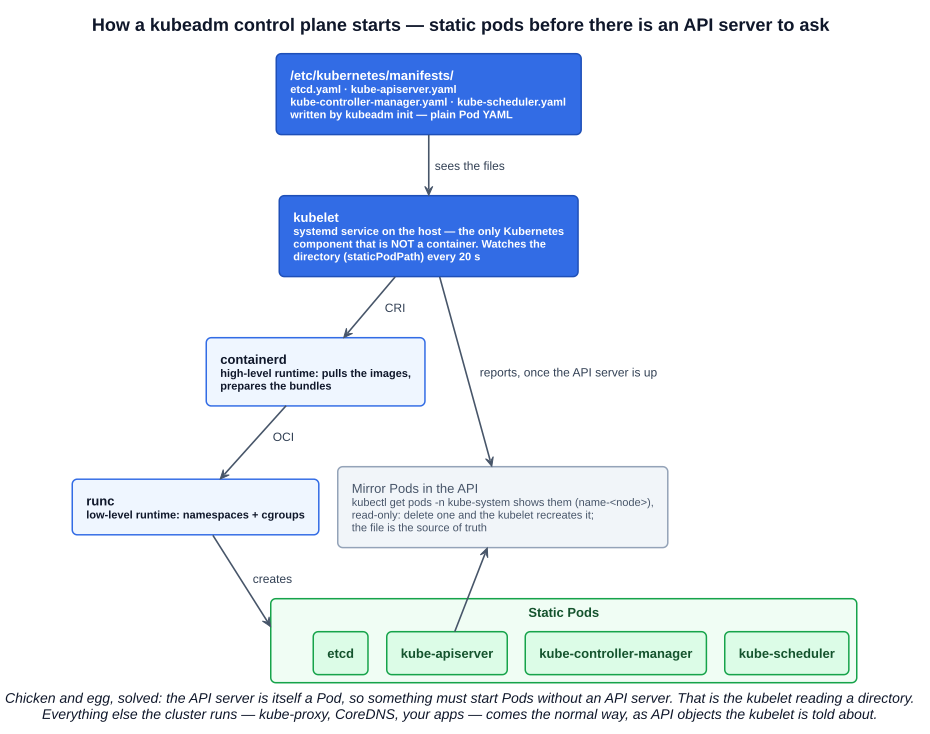
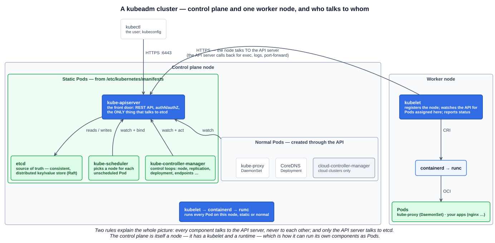
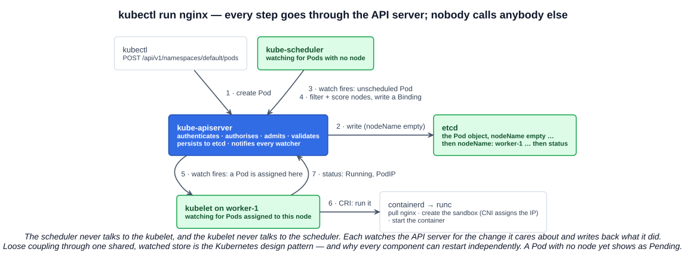
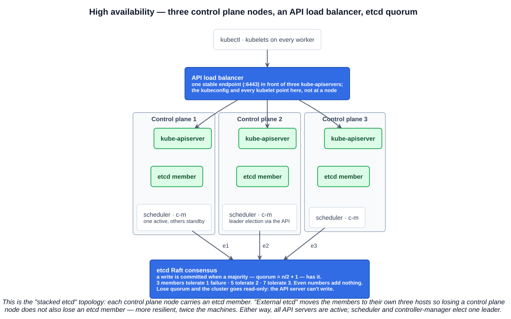
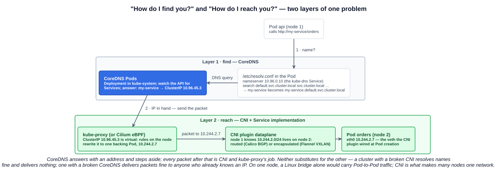

# 01 — Container Orchestration and Kubernetes Architecture

Section 3 ended with one image, one container, one machine. This chapter is about what happens when it is a thousand containers on a hundred machines — the problem orchestrators solve — and then takes apart a **kubeadm**-built cluster component by component, because that is the architecture the exam's *Kubernetes Fundamentals* domain (44%) is built on.

---

## 1. Scaling containers — the era of container orchestrators

`docker run` scales to one host. Past that, the questions pile up: which machine has room? What restarts a container when its host dies? How does a container on host A find one on host B? How do you roll out a new version across 200 replicas without downtime? Each has an answer in scripts and cron jobs, and every company that tried that route built a worse orchestrator by accident.

A **container orchestrator** is the platform that answers those questions as a product. The lecture's list of what one helps with:

| Concern | What the orchestrator does |
|---|---|
| **Provisioning** | Turns declared resources into running containers on real machines: picks nodes, pulls images, allocates IPs and storage |
| **Deployment** | Rolls out new versions across a fleet — rolling updates, rollbacks, canaries |
| **Scaling and more** | Replicas up and down, on demand or automatically; self-healing when containers or nodes fail; service discovery; load balancing; configuration and secrets |
| **Standards and frameworks** | Provides a common API and object model so tooling, vendors and teams converge — the CRI/CNI/CSI interfaces of chapter 02-07 are Kubernetes' version of this |
| **Integration with core components** | Plugs into the runtime, network, storage, DNS, identity and cloud provider through those standard interfaces |

The conveyor-belt picture on the slide is the mental model: the orchestrator is the factory floor; you declare what should come off the line, and it keeps the machines fed.

### 1.1 Where orchestration excels — extending the API

The lecture's example is deliberately not a web app. It is a MySQL InnoDB cluster:

```yaml
apiVersion: mysql.oracle.com/v2
kind: InnoDBCluster
metadata:
  name: mycluster
spec:
  secretName: mypwds
  tlsUseSelfSigned: true
  instances: 3
  router:
    instances: 1
```

`InnoDBCluster` is not a built-in Kubernetes kind. It is a **Custom Resource Definition (CRD)** shipped by Oracle's MySQL Operator: the operator teaches the API server a new object type, and a controller watches for those objects and does what a MySQL DBA would do — create three replicated instances, wire up the router, manage the secrets and TLS, handle failover. The user writes eleven lines of YAML; the orchestrator runs a database cluster. That is the point where orchestration stops being "containers at scale" and becomes a **platform for automating operations**: the same declarative, reconcile-to-desired-state machinery that runs Pods can run anything with a controller. CRDs and operators return in Section 5.

### 1.2 The market

| | Story |
|---|---|
| **Docker Swarm** | Docker's own orchestrator, built into the Docker Engine (`docker swarm init`). Simplest to start; lost the ecosystem battle and is now maintained but not growing |
| **HashiCorp Nomad** | A general workload scheduler — containers, VMs, plain binaries, Java — with a single small binary. A respected niche, especially where Kubernetes is too much |
| **Red Hat OpenShift** | Began as its own PaaS; from version 3 (2015) **rebuilt on top of Kubernetes** — the arrow on the slide. Today it is Kubernetes plus an opinionated distribution: registry, build pipelines, developer console, stricter security defaults |
| **Kubernetes** | Google's design (from Borg), open-sourced 2014, donated to the CNCF 2015 — and the winner. Every cloud sells a managed version (EKS, GKE, AKS), every vendor's platform (OpenShift, Rancher, Tanzu) is a distribution of it, and the CNCF ecosystem is built around it |

The exam's framing: Kubernetes won because it is **open, extensible (CRDs, operators, the pluggable interfaces), and vendor-neutral** under the CNCF, and because the ecosystem consolidated on it — including competitors like OpenShift.

---

## 2. Why kubeadm is the reference architecture

There are many ways to get a cluster — Docker Desktop's toggle, kind, minikube, k3s, MicroK8s, the managed cloud services, kubespray, or a fully manual "Kubernetes the Hard Way". The small distributions hide or merge components to be convenient; the managed services hide the control plane entirely. **kubeadm** is the Kubernetes project's own bootstrapping tool, and it lays the components out one at a time in their canonical form: every control-plane piece as its own visible Pod, the kubelet as a host service, nothing merged or hidden. From an understanding standpoint that makes it the **gold standard**: when you can explain a kubeadm cluster you can recognise every other distribution as a variation on it. It is also what the CKA exam is built on.

---

## 3. Every node: the runtime stack

Whatever the node's role, three things run on it. They are the CRI chain from chapter 02-07, seen from the node's point of view.

### 3.1 runc — the low-level container runtime

- **Spawns and runs containers**: takes an OCI bundle and creates the process with its **namespaces and cgroups** (chapter 03-01).
- The **reference implementation** of a low-level, OCI-compatible runtime; **donated by Docker Inc.** to the OCI.
- Alternatives at the same level: **crun** (Red Hat, "a fast and low-memory footprint OCI Container Runtime fully written in C", conforming to the OCI runtime-spec), **kata-runtime** (a VM per Pod), **gVisor** (a user-space kernel).
- **Typically installed as a component of a high-level runtime** — you `apt install containerd`, and runc comes with it. You rarely touch it directly.

### 3.2 containerd — the high-level container runtime

- **Created by and used within Docker**, split out, **donated to the CNCF, now Graduated** (Feb 2019).
- Operates one level up: **manages the entire container lifecycle** — pulls **and stores images**, manages snapshots and the Pod sandbox, handles networking hand-off to CNI, streams logs.
- **Calls runc** (or another OCI runtime) to actually create each container.
- Speaks **CRI**, which is how the kubelet talks to it. The kubelet never sees runc.

### 3.3 kubelet — the node agent

The kubelet is the piece the rest of the picture hangs on:

| Fact | Detail |
|---|---|
| Often described as **"the node"** of a cluster | Because it is what registers the machine with the API server and makes it a schedulable Node object |
| Runs on **every node — workers and the control plane** | The control plane's own components are Pods, and something has to run them |
| **Maintains Pods** | Its job is that the containers described in each Pod are running and healthy — starting them, restarting them, running probes, reporting status |
| Works from a **PodSpec** | A description of a Pod in YAML or JSON |
| Gets PodSpecs **two ways** | From the **API server** (the normal way — it watches for Pods assigned to its node), or by **monitoring a directory** of manifest files — by kubeadm convention **`/etc/kubernetes/manifests`** |
| Is **not a container** | The kubelet runs as a host service (`systemd`); it is the one Kubernetes component installed as a package, because it has to exist before any container does |

The second way of getting PodSpecs is the key to how a cluster starts.

---

## 4. Static pods — how the control plane bootstraps itself

The control plane components — API server, etcd, scheduler, controller-manager — run as Pods. But a Pod is created by asking the API server, and the API server *is one of those Pods*. Something has to run Pods before there is anything to ask.

That something is the kubelet's directory watch. `kubeadm init` writes four ordinary Pod manifests into **`/etc/kubernetes/manifests/`**; the kubelet, watching that directory, sees them and does exactly what it would do for any Pod: passes the request to **containerd**, which passes it to **runc**, which creates the containers. Pods created this way are **static pods** — **managed directly by the kubelet on that node, from files, without the API server observing them.**



What that implies:

- The **file is the source of truth**. Change `kube-apiserver.yaml` and the kubelet restarts the API server with the new flags (this is how `kubeadm upgrade` works, and how CKA candidates fix a broken control plane). Delete the file and the Pod goes.
- Once the API server is up, the kubelet creates a **mirror Pod** for each static Pod so they show in `kubectl get pods -n kube-system` (named `kube-apiserver-<node>` etc.). Mirror Pods are **read-only from the API's side**: `kubectl delete` one and the kubelet immediately recreates it from the file.
- Static Pod specs **cannot reference other API objects** — no ServiceAccounts, ConfigMaps or Secrets — because no API is assumed to exist. Their config comes from host files mounted with `hostPath` (that is why `/etc/kubernetes/pki` and the etcd data directory live on the control plane's disk).
- The directory path is the kubelet setting `staticPodPath`; `/etc/kubernetes/manifests` is kubeadm's choice, not a kernel constant. A `staticPodURL` variant fetches manifests over HTTP.

Everything else — kube-proxy, CoreDNS, your applications — is created the normal way, as API objects, once the API server exists. The slide's split between **Static Pods** and **Pods** on the control plane is exactly that line.

---

## 5. The control plane components

### 5.1 etcd — the source of truth

- A **strongly consistent, distributed key-value store**; the **backing store for all cluster data**. Every object you create — Pods, Deployments, Secrets, Nodes, the lot — is a key in etcd. Back up etcd and you have backed up the cluster.
- **Handles leader election and network partitions** with the **Raft** consensus algorithm (chapter 02-01): one leader, writes committed when a **majority (quorum = n/2 + 1)** has them.
- **Handles machine failures in a highly available configuration** — as long as quorum holds.
- **Production setup: multiple instances, an odd number, ideally 5** (the course's figure; etcd's own guidance is 3 for most clusters, 5 where two simultaneous failures must be survivable, 7 the practical maximum). Odd because even numbers add no tolerance: 3 members tolerate 1 failure, 4 still only 1, 5 tolerate 2. **Backups are recommended** — `etcdctl snapshot save` is the CKA's favourite task.
- Ports **2379** (clients — the API server) and **2380** (peers). CNCF Graduated.

### 5.2 kube-apiserver — the central point

- **The main gateway for access — user access and component communication.** `kubectl`, the kubelets, the scheduler, the controllers, the dashboard, CI pipelines: every one of them talks to the API server and **nothing else**. Components never talk to each other directly.
- **Provides a RESTful API** over HTTPS (port **6443** by kubeadm convention): resources are URLs (`/api/v1/namespaces/default/pods`), verbs are HTTP verbs, and `watch` streams changes. Everything `kubectl` does is a REST call.
- On every request: **authentication** (who are you), **authorization** (may you — RBAC), **admission control** (should this be allowed or mutated), validation — then it **stores the object in etcd**. It is the **only component that talks to etcd**; the rest go through the API.
- **Communicates with the kubelet via its API** for the operations that need a node's cooperation — `kubectl exec`, `logs`, `port-forward` — the "other route" to a node besides the kubelet's own watch.
- Stateless and horizontally scalable: run three behind a load balancer and they are all active (section 7).

### 5.3 kube-scheduler

- A **control plane process**, **started as a static Pod** via `/etc/kubernetes/manifests`.
- **Watches for newly created Pods with no node assigned** and **determines a valid node according to constraints and resources**: first **filtering** (which nodes *can* run it — enough CPU/memory for the requests, node selectors, taints and tolerations, affinity rules, volume constraints), then **scoring** the survivors (spread, locality, image already present) and **binding** the Pod to the winner by writing `nodeName`.
- It **does not start anything**. It writes a field; the kubelet on that node sees it. A Pod that cannot be placed stays **Pending**.
- One active scheduler at a time in an HA control plane (leader election); the default can be replaced or supplemented with custom schedulers.

### 5.4 kube-controller-manager

- Runs the **controllers**: **control loops that monitor the state of the cluster** through the API server and **make or request changes as required** to move the current state toward the desired state — the thermostat pattern. A ReplicaSet says 3; the controller sees 2; it creates one.
- One binary, many loops. The ones the slide names: the **Replication controller** (ReplicaSets keep their Pod count), the **Node controller** (notices nodes going unhealthy, evicts their Pods), the **Deployment controller** (rollouts and rollbacks by managing ReplicaSets). Also Endpoints/EndpointSlice, ServiceAccount and token, Job, CronJob, DaemonSet, StatefulSet, garbage collection, and dozens more.
- Controllers act **through the API** — they create Pods by asking the API server, not by touching containerd. That is what makes **CoreDNS-as-a-Deployment dependent on controllers**: a Deployment is nothing but a wish until the Deployment and ReplicaSet controllers turn it into Pods. No controller-manager, no Pods from any Deployment.
- Started as a static Pod; leader-elected in HA.

### 5.5 cloud-controller-manager

- **Not present on every cluster — typically found in public-cloud Kubernetes offerings** (EKS, GKE, AKS) and any cluster with a cloud provider integration. Bare-metal and kubeadm-on-VMs clusters usually have none.
- **Bridges the cloud provider's functionality to Kubernetes**: it embeds cloud-specific control loops so the core stays vendor-neutral. Its controllers: the **node controller** (map cloud instances to Node objects, notice deleted VMs), the **route controller** (Pod network routes in the cloud VPC), and the **service controller**.
- The lecture's example is the service controller: create a Kubernetes **`Service` of type `LoadBalancer`** and the CCM asks the cloud API for a real load balancer — an ELB, a GCP forwarding rule — and writes its address back into the Service's status. On a cluster without a CCM the same Service sits at `<pending>` forever.
- Runs as a normal Pod, not a static one, since it needs the API to exist.

---

## 6. The node components

### 6.1 kube-proxy

- **Runs on every instance in the cluster as a DaemonSet** — a workload type that guarantees one Pod per node, so new nodes get one automatically. Control plane nodes included.
- **Started as a normal Pod through Kubernetes — it is not a static Pod.** It needs the API server to exist and is created by the DaemonSet controller after bootstrap.
- **Watches the API server for Services and Endpoints and dynamically configures TCP, UDP and SCTP forwarding on the node it runs on**: when you create a Service with a ClusterIP, kube-proxy on every node writes the rules that send traffic to that IP to one of the backing Pods. Modes: **iptables** (the classic default), **IPVS**, **nftables**; on Windows, kernelspace.
- Increasingly optional: eBPF-based CNI plugins such as Cilium can replace it entirely.

### 6.2 CoreDNS — cluster DNS

- **CoreDNS is a Kubernetes Deployment** — the cluster DNS server runs as ordinary Pods in `kube-system`, behind a Service still named `kube-dns` for backwards compatibility. It resolves `<service>.<namespace>.svc.cluster.local` (chapter 02-02) and forwards everything else upstream.
- The slide uses it to introduce **Deployments**: *a Deployment describes how an application should run — for example that it should have x replicas.* Two CoreDNS replicas, rolled out and kept alive by the Deployment controller.
- Hence the dependency: **Deployments such as CoreDNS depend on Kubernetes controllers.** It is also the default cluster DNS kubeadm installs (since 1.11, replacing kube-dns), and a CNCF Graduated project.

### 6.3 Pods, and the control plane as a node

Application workloads — the nginx on the slide's worker — run on nodes, placed by the scheduler, run by that node's kubelet → containerd → runc. But look at the control plane box: it has the **same** kubelet, containerd and runc, and it runs Pods too. The control plane *is* a node; kubeadm merely puts a taint on it so the scheduler keeps application Pods off it by default. On a single-node cluster (Docker Desktop, kind) the taint is removed and everything runs in one place.

---

## 7. The whole picture



Two rules explain every arrow on it:

1. **Everything talks to the API server; nothing talks to anything else.** The scheduler doesn't call the kubelet; the controller-manager doesn't call the scheduler; kube-proxy doesn't call the controller-manager. Each one watches the API for the objects it cares about and writes back what it did.
2. **Only the API server talks to etcd.**

The consequence is loose coupling: any component can restart, be upgraded, or run in triplicate without the others noticing, because the shared, watched store is the only contract.

### 7.1 Following one Pod through it



1. `kubectl run nginx --image=nginx` sends `POST /api/v1/namespaces/default/pods`.
2. The **API server** authenticates, authorises, admits, validates, and writes the Pod to **etcd** with no `nodeName`.
3. The **scheduler**, watching for exactly that, filters and scores the nodes and writes a binding — `nodeName: worker-1` — back through the API.
4. The **kubelet** on worker-1, watching for Pods bound to it, calls **containerd** over CRI; containerd pulls the image, creates the sandbox (the CNI plugin assigns the IP), and has **runc** start the container.
5. The kubelet reports **status** back through the API — `Running`, the Pod IP — and `kubectl get pods` shows it.

Until step 3 completes the Pod is `Pending`; until step 4 it is `ContainerCreating`. Those two statuses are your first diagnostic: `Pending` means the scheduler could not place it, `ContainerCreating` means the node is struggling to start it.

---

## 8. High availability

A single control plane node is a single point of failure for *management* — running Pods keep running when it dies, but nothing can be changed, rescheduled or healed. Production runs **three (or five) control plane nodes**:



| Element | Role |
|---|---|
| **API load balancer** | One stable endpoint in front of every `kube-apiserver`; `kubectl`'s kubeconfig and every kubelet point at it, never at an individual node. All API servers are active — they are stateless |
| **etcd cluster** | One member per control plane node ("**stacked**" topology, the slide's layout) or on separate hosts ("**external**"). Raft keeps them consistent; the cluster survives the loss of a minority. Three members tolerate one failure; five tolerate two |
| **scheduler and controller-manager** | One instance of each is **active**, elected through a lease in the API; the others stand by and take over on failure. Two active schedulers would fight |
| **Worker nodes** | Unchanged — their kubelets and kube-proxies just talk to the load balancer |

The stacked topology is simpler (three machines) but losing one node loses both an API server and an etcd member; external etcd (three control plane + three etcd hosts) decouples the failure domains at twice the cost. Both need the load balancer.

---

## 9. Further study — the elevator pitches, and the lines between the Pods

The course's further-study page zooms in on two things the architecture diagram draws as plain lines: how packets actually move between Pods, and how a Pod learns the address to send them to. It also gives one-sentence "elevator pitches" for the components that show up most in questions. Both are worth having in exactly that compressed form.

### 9.1 Elevator pitches

If you can say these from memory, most architecture questions become reasoning rather than recall:

| Component | Elevator pitch |
|---|---|
| **kubelet** (node agent) | Runs on **every node**. Talks to the **API server** and makes sure the Pods that *should* be running on its node are **running and healthy**. Starts, stops and monitors containers through the **container runtime** (containerd) |
| **Controller Manager** (the control-loop brain) | Runs in the **control plane**. Watches the cluster's **desired state** (what's in etcd, via the API server) and compares it with the **current state**. Runs controllers — Deployment, Node, and the rest — that **make changes** (create Pods, replace failed ones, mark nodes NotReady) to move reality toward the desired state |
| **etcd** (cluster database) | A **key-value store** holding **all cluster state** — Pods, Deployments, ConfigMaps, Nodes, everything. The **API server is the main component that talks to it**; scheduler, controllers and kubelets read and write **via the API server**, not directly. Because it holds the **source of truth**, it is what **backup, restore and high availability** are about |
| **CoreDNS** (cluster DNS / service discovery) | Runs as **Pods inside the cluster**, usually a **Deployment in `kube-system`**. Answers queries like `my-service.default.svc.cluster.local` with a **ClusterIP**, so Pods talk to Services **by name instead of IP**. Works with the Service implementation and CNI: **CoreDNS gives the IP, networking gets the packets there** |

The page's point about CoreDNS: it is usually labelled an "addon", but every cluster depends on it for name resolution, so treat it as part of the core architecture.

### 9.2 The network model Kubernetes promises

Before the mechanism, the contract. Kubernetes requires that whatever networking is installed satisfies three rules:

1. **Every Pod gets its own cluster-wide unique IP address.**
2. **All Pods can communicate with all other Pods, on the same node or different nodes, directly — without NAT** and without proxies.
3. **Agents on a node** (the kubelet, system daemons) **can reach every Pod on that node.**

That is why Kubernetes never needed Docker's `-p` port mapping: a Pod is a first-class host on a flat network, reachable at its IP from anywhere in the cluster. Four problems fall out of it, and the model answers each: **container-to-container** inside a Pod (they share a network namespace, so `localhost`); **Pod-to-Pod** (the pod network — this section); **Pod-to-Service** (Services, next chapters); **external-to-Service** (Ingress / Gateway API).

### 9.3 Pods talking on a single node

On **one Linux host**, two Pods can talk to each other with nothing fancy at all. Each Pod's network namespace has a veth pair whose host end sits on a **Linux bridge** — a tiny virtual switch, the same idea as Docker's `docker0` from chapter 03-05 — and the bridge forwards frames between them. That alone satisfies Pod-to-Pod on the same host.

The hard part is **host-to-host**: Pod `10.244.1.5` on node 1 sending to `10.244.2.7` on node 2. Node 1's bridge knows nothing about node 2's Pods. Something has to teach every node how to reach every other node's Pod subnet — by **routes** (node 2's subnet is via node 2's address) or by **encapsulation** (wrap the packet in a UDP/VXLAN packet addressed to node 2, unwrap it there). Even on a single host, Kubernetes delegates this to a plugin so the same mechanism works when a second node joins: the **CNI**.

### 9.4 What CNI actually is — from the cluster's point of view

Chapter 02-07 covered the CNI specification; this is the same thing seen from inside a cluster. **CNI is a contract between the container runtime (called by the kubelet) and a plugin binary on each node.** When a Pod is created, the runtime calls the plugin to:

1. **Add an interface** to the Pod's network namespace.
2. **Assign an IP** (through an IPAM helper) from the node's Pod subnet.
3. **Program routes or encapsulation** so traffic can reach Pods on **other nodes**.
4. Optionally apply **policy** or other node-local wiring.

That's it — a small hook, invoked at Pod create and delete, that enables cluster networking. The plugin's long-running agent (Felix, the Cilium agent, `kube-flannel`) is what keeps the routes current afterwards.

The three to know, with the one thing that distinguishes each:

| CNI | Approach | Notes |
|---|---|---|
| **Flannel** | **Simple overlay** — encapsulates Pod traffic between nodes, commonly **VXLAN** | The easiest on-ramp; great for labs and small clusters; **no NetworkPolicy** enforcement |
| **Calico** | **Routing-first (BGP)** with optional overlays (VXLAN / IP-in-IP) where the underlying network can't route | Strong **NetworkPolicy**; can run an **eBPF** dataplane to speed up Services; the most widely adopted |
| **Cilium** | **eBPF dataplane** end to end | Observability and security built in (Hubble); **can replace kube-proxy** for faster Services; CNCF Graduated |

### 9.5 Where CoreDNS fits — find vs reach

A Pod calling `http://my-service/orders` needs two different things from the cluster, and two different components provide them:



- The **find** layer. The kubelet wrote the Pod's `/etc/resolv.conf` to point at the cluster DNS Service (`kube-dns`, typically `10.96.0.10`) with a search list of `<namespace>.svc.cluster.local svc.cluster.local cluster.local` — which is why a Pod can say just `my-service` for a Service in its own namespace and `my-service.other-ns` across namespaces. The query goes to a **CoreDNS Pod**, which watches the API for Services and answers with the Service's **ClusterIP**.
- The **reach** layer. The ClusterIP is virtual — no interface anywhere has it. **kube-proxy's rules on the node** (or Cilium's eBPF) rewrite the destination to one backing Pod's IP, and the **CNI plugin's routes or encapsulation** carry the packet to that Pod, on whichever node it lives.

In the page's words:

> **CoreDNS = "How do I find you?"** (name → IP)
> **CNI = "How do I reach you?"** (routing / encapsulation to that IP)

They solve different layers of one problem, and neither replaces the other: a cluster with a broken CNI still resolves names and delivers nothing; one with a broken CoreDNS still delivers packets to anyone who already knows an IP. The Docker analogue from chapter 03-05 — user-defined-network DNS plus the bridge — is the same split on one host.

### 9.6 What the KCNA needs from this

High-level knowledge only: **Kubernetes uses CNI plugins to provide Pod networking across nodes**, and **CoreDNS provides cluster DNS / service discovery** so Pods resolve Service names to IPs. Specific plugin internals are not tested; the names (CNI, CoreDNS, "cluster DNS", Flannel/Calico/Cilium) at a conceptual level are. The CKA and CKS go further — installing a CNI, writing NetworkPolicy, debugging DNS.

---

## Exam angle

- **What a container orchestrator does**: provisioning, deployment, scaling, self-healing, service discovery, standards, integration. The 2010s contenders: **Docker Swarm, HashiCorp Nomad, OpenShift (now built on Kubernetes), Kubernetes** — the winner, open and extensible via **CRDs**.
- **kubeadm** = the Kubernetes project's bootstrapper and the reference architecture: components visible and separate.
- **runc**: low-level, spawns containers via namespaces and cgroups, **reference OCI implementation, donated by Docker**; peers crun, kata, gVisor; installed with the high-level runtime. **containerd**: high-level, **CNCF Graduated**, created by Docker, manages the lifecycle, **pulls and stores images**, calls runc.
- **kubelet**: runs on **every node including the control plane**; **maintains Pods**; works from a **PodSpec** (YAML/JSON); gets PodSpecs from the **API server or a monitored directory** — **`/etc/kubernetes/manifests`**; the one component that is not a container.
- **Static pods**: managed by the **kubelet directly from files**, without the API server; how kubeadm runs **etcd, kube-apiserver, kube-scheduler, kube-controller-manager**; **mirror Pods** make them visible but not controllable via the API. **kube-proxy and CoreDNS are NOT static pods.**
- **etcd**: strongly consistent, distributed **key-value store**; **source of truth / backing store**; **Raft**; leader election, partitions, machine failures; **odd number, 3 or 5** (course: "ideally 5"); **back it up**; only the API server talks to it.
- **kube-apiserver**: the **gateway** for users and components; **RESTful**; **stores everything in etcd**; talks to the kubelet for exec/logs. Nothing bypasses it.
- **kube-scheduler**: control plane process, static pod; **picks a node** for unscheduled Pods by **constraints and resources** (filter, then score); does not run anything.
- **kube-controller-manager**: **controllers = control loops** watching state and **making or requesting changes**; **Replication, Node, Deployment** controllers among many. **Deployments depend on controllers.**
- **cloud-controller-manager**: **not on every cluster — public cloud offerings**; **bridges the cloud provider**; a **`LoadBalancer` Service** creating a cloud load balancer is the example.
- **kube-proxy**: **DaemonSet on every node**; **normal Pod, not static**; watches the API and configures **TCP/UDP/SCTP forwarding** for Services.
- **CoreDNS**: **a Deployment** (x replicas); cluster DNS; depends on controllers.
- **HA**: **API load balancer** in front of active-active API servers; **etcd quorum** over an odd number of members (stacked vs external topology); scheduler and controller-manager **leader-elected**.
- **Network model**: every Pod has a **unique cluster-wide IP**; **Pod-to-Pod without NAT** across nodes; implemented by **CNI plugins**. A Linux bridge suffices on one node; CNI makes many nodes one network.
- **CoreDNS = find (name → ClusterIP); CNI = reach (routes/encapsulation to the IP)**; kube-proxy or an eBPF CNI turns the virtual ClusterIP into a real Pod IP. Distractor: "CoreDNS routes traffic" or "CNI resolves names".
- **Flannel** = simple overlay (VXLAN), no policy · **Calico** = routing-first (BGP), strong NetworkPolicy, optional eBPF · **Cilium** = eBPF dataplane, can replace kube-proxy.
- Service DNS: `my-svc.my-namespace.svc.cluster.local`; short name works within a namespace because the kubelet writes the Pod's `resolv.conf` search list.

## References

- [Cluster Architecture — Kubernetes docs](https://kubernetes.io/docs/concepts/architecture/) — the control plane and node components in the project's own words
- [Create static Pods — Kubernetes docs](https://kubernetes.io/docs/tasks/configure-pod-container/static-pod/) — managed directly by the kubelet, mirror Pods, `staticPodPath` / `/etc/kubernetes/manifests`
- [kubelet reference](https://kubernetes.io/docs/reference/command-line-tools-reference/kubelet/) — "the primary node agent", PodSpecs from the API server, a file, or an HTTP endpoint
- [kube-scheduler](https://kubernetes.io/docs/concepts/scheduling-eviction/kube-scheduler/) — filtering, scoring, binding; Pending until placed
- [Controllers](https://kubernetes.io/docs/concepts/architecture/controller/) and [Cloud Controller Manager](https://kubernetes.io/docs/concepts/architecture/cloud-controller/) — control loops; the node, route and service controllers
- [kube-proxy reference](https://kubernetes.io/docs/reference/command-line-tools-reference/kube-proxy/) — reflects Services on each node; TCP, UDP, SCTP; iptables / IPVS / nftables modes
- [kubeadm HA topology options](https://kubernetes.io/docs/setup/production-environment/tools/kubeadm/ha-topology/) and [etcd FAQ — cluster size](https://etcd.io/docs/v3.6/faq/) — stacked vs external etcd, the load balancer, quorum and the odd-number rule
- [Services, Load Balancing, and Networking — the Kubernetes network model](https://kubernetes.io/docs/concepts/services-networking/) — unique Pod IPs, Pod-to-Pod without NAT, implemented via CNI; the four networking problems
- [DNS for Services and Pods](https://kubernetes.io/docs/concepts/services-networking/dns-pod-service/) — `my-svc.my-namespace.svc.cluster.local`, the Pod `resolv.conf` search list, ClusterIP records
