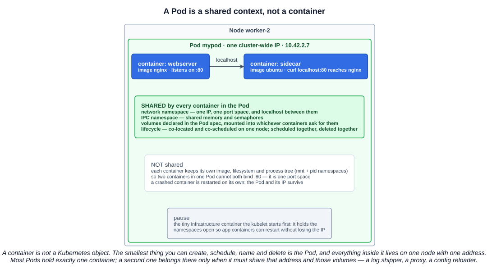
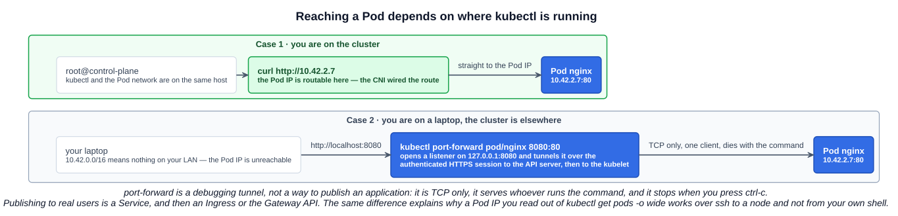
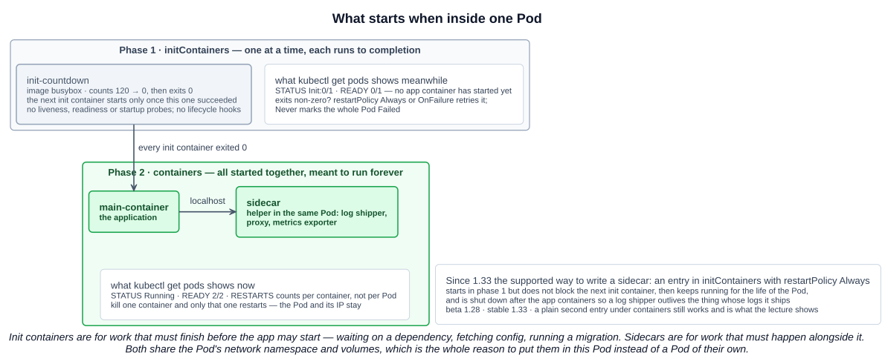

# 02 — Pods

Chapter 01 was about machines: which component runs where, and who talks to whom. This chapter is the object all of that exists to serve. Every piece of the control plane is ultimately in the business of getting a Pod running somewhere and keeping it there.

It is also where the course's kubectl vocabulary starts, so the command blocks here are the ones the rest of Sections 4 and 5 build on. They live in [`../commands/kubectl-basics.md`](../commands/kubectl-basics.md) as well.

---

## 1. What a Pod is

The canonical definition, from the Kubernetes documentation:

> A *Pod* (as in a pod of whales or pea pod) is a group of one or more containers, with shared storage and network resources, and a specification for how to run the containers. A Pod's contents are always co-located and co-scheduled, and run in a shared context.

And the line the exam likes best:

> Pods are the smallest deployable units of computing that you can create and manage in Kubernetes.

Read that carefully: the smallest unit is the **Pod**, not the container. A container is not a Kubernetes object at all — you cannot `kubectl get containers`, you cannot name one, schedule one, or give one an address. Everything Kubernetes does, it does to Pods.

The lecture's five properties, and what each one actually means:

| Property | What it means |
|---|---|
| **One or more containers** | One is the normal case. A second belongs there only when it has to share the first one's address and volumes |
| **Containers share the networking provided by the Pod and communicate over `localhost`** | They are in **one network namespace** — so it is also one port space, and two containers in a Pod cannot both bind `:80` |
| **Each Pod gets a unique IP address within the cluster** | Not per container, and not per node. The Pod is the addressable thing |
| **Containers in a Pod can use Inter-Process Communication (IPC)** | They share the **IPC namespace**: shared memory segments, semaphores, message queues |
| **A Pod encapsulates an application, its dependencies, shared storage and networking into a single deployable unit** | The Pod is the boundary you deploy, scale and delete as one |

The docs call this "a logical host": the containers in a Pod are as close together as two processes on the same machine used to be.



### 1.1 Shared and not shared

The distinction is worth memorizing because most Pod questions are really questions about it.

| Shared across the Pod | Private to each container |
|---|---|
| Network namespace — one IP, one port space, `localhost` between containers | Image and filesystem (mount namespace) |
| IPC namespace — shared memory, semaphores | Process tree (PID namespace, by default) |
| Volumes declared in `spec.volumes`, mounted by whichever containers ask | Resource requests and limits, set per container |
| Lifecycle and placement — co-located and co-scheduled on one node | Restart handling — a crashed container is restarted on its own, the Pod stays |

The mechanism behind the shared half is the **pause container** (also called the infrastructure or sandbox container): a near-empty container the kubelet starts first, whose only job is to hold the namespaces open. Application containers join its namespaces, which is why a container can crash and restart without the Pod losing its IP. You never write it in a manifest; the kubelet adds it. It is not KCNA material, but it makes the model make sense.

### 1.2 You usually do not create Pods directly

> Usually you don't need to create Pods directly, even singleton Pods. Instead, create them using workload resources such as Deployment or Job.

A bare Pod has nothing watching it. Delete the node it is on and it is simply gone — no controller recreates it. Deployments, StatefulSets, DaemonSets and Jobs exist to own Pods and hold their count at the declared number, which is why chapter 01's controller-manager is what actually keeps a cluster running. Section 5 covers those. Creating Pods by hand, as this chapter does, is for learning and debugging.

---

## 2. The Pod IP, and why the network is flat

The lecture makes the point with a thought experiment: imagine a cluster of hundreds of nodes. If Pods could not reach each other directly, every connection would need port mappings, NAT, or some other hack, and every one of those hacks would have to be maintained by hand.

Kubernetes removes the problem by requirement rather than by tooling. The network model, covered in [01 §9.2](./01-container-orchestration-and-architecture.md#92-the-network-model-kubernetes-promises), demands that every Pod gets a unique cluster-wide IP and that **any Pod can reach any Pod on any node without NAT**. The CNI plugin's job is to make that true.

Two consequences you can see immediately:

- **No port publishing.** There is no `-p 8080:80` in Kubernetes because there is nothing to translate. The Pod has its own IP and the container listens on its own port on it.
- **`curl` between Pods just works.** Read a Pod's IP out of `kubectl get pods -o wide`, exec into another Pod, and `curl` it. Nothing had to be configured for that to work.

The catch, and the reason Services exist: **Pod IPs are ephemeral**. A Pod that is deleted and recreated gets a new address, and nothing sends a memo. Hard-coding a Pod IP is fine for a five-minute experiment and wrong in an application — that is the problem Services and CoreDNS solve in the next chapters.

---

## 3. Running a Pod and reading its state

```bash
kubectl run nginx --image=nginx
kubectl get pods
kubectl get pods -o wide        # adds IP and NODE
kubectl describe pod nginx      # spec, container statuses, and Events at the bottom
```

`kubectl run` creates a **Pod** and only a Pod. Older kubectl versions had generators that could produce Deployments from it; those were removed, and the modern equivalent is `kubectl create deployment`.

What the columns in `kubectl get pods` mean:

| Column | Reading it |
|---|---|
| `READY` | **ready containers / total containers in the Pod**, e.g. `1/2`. Not replicas — that is a Deployment's column |
| `STATUS` | `Pending` (not yet scheduled, or image not pulled), `ContainerCreating`, `Running`, `Init:0/1`, `CrashLoopBackOff`, `Completed`, `Error` |
| `RESTARTS` | Summed **per container**, not per Pod. A Pod is never restarted; its containers are |
| `AGE` | Since the Pod object was created, not since the last restart |

`kubectl describe pod` is the first stop when something will not start, and the **Events** list at the bottom is why: `Scheduled`, `Pulling`, `Pulled`, `Created`, `Started`, or the failure that replaced one of them (`FailedScheduling`, `ErrImagePull`, `Back-off restarting failed container`).

### 3.1 Logs and exec

```bash
kubectl logs nginx
kubectl logs mypod -c sidecar         # -c is required once the Pod has more than one container
kubectl logs -f mypod -c sidecar      # follow
kubectl logs mypod --previous         # the log of the instance that crashed, not the running one
kubectl exec mypod -- ls /usr/share/nginx/html
kubectl exec -it mypod -c sidecar -- bash
```

Everything after `--` is the command for the container, not for kubectl. `--previous` is the one people forget in an outage and the one that has the answer in it.

---

## 4. Reaching a Pod depends on where kubectl is running

The course calls this "environmental differences", and it explains a confusion almost everyone hits once.

If you are shelled into a cluster node — the lecture's `root@control-plane`, or your own node over ssh — your host is part of the Pod network. `curl http://10.42.2.7` reaches the Pod directly.

If kubectl is on your laptop and the cluster is somewhere else, kubectl works fine (it only needs to reach the API server on 6443) but the Pod IP is meaningless on your LAN. `kubectl port-forward` bridges the gap: it opens a local listener and tunnels it through your authenticated session with the API server down to the kubelet and into the Pod.



```bash
kubectl port-forward pod/nginx 8080:80        # then browse http://localhost:8080
kubectl port-forward deployment/mongo :27017  # let kubectl pick the local port
```

The format is `<local>:<remote>`, and it works against a Pod, Deployment, ReplicaSet or Service. Three limits worth knowing:

- **TCP only.** UDP is not supported.
- **It is yours alone.** One client, on your machine, for as long as the command runs. Ctrl-C ends it.
- **It is a debugging tool, not a way to publish an application.** Real exposure is a Service, then an Ingress or the Gateway API.

### 4.1 Testing from inside the cluster instead

Often the better move is to put the client inside the cluster, where the Pod network already works:

```bash
kubectl exec -it mypod -- curl http://10.42.2.7          # from a Pod you already have
kubectl run tmp --image=curlimages/curl -it --rm --restart=Never -- curl -s http://10.42.2.7
```

The second is the trick from the lecture, and it is worth keeping: `--rm` deletes the Pod when the command exits, so you get a disposable client on the Pod network with one line and no cleanup. Any small image with the tool you need works the same way — `busybox` for `nslookup` and `wget`, `nicolaka/netshoot` for a full network toolbox.

---

## 5. Imperative and declarative

Kubernetes documents **three** object management techniques. The exam contrasts the first and the third.

| Technique | Operates on | Commands | Recommended for |
|---|---|---|---|
| **Imperative commands** | Live objects | `kubectl run`, `create`, `scale`, `delete`, `expose`, `edit` | Development, one-offs, the exam clock |
| **Imperative object configuration** | Individual files | `kubectl create -f`, `replace -f`, `delete -f` | Production, single author |
| **Declarative object configuration** | Directories of files | `kubectl apply -f`, `diff -f` | Production, multiple authors |

**Imperative** means you state the operation: create this, replace that, delete the other. You are telling the cluster *what to do*. It is fast and it is how you get through a hands-on exam, but nothing records the intent. The course's warning is the one to remember: imperative work **causes configuration drift**, because the desired state was never written down anywhere that can be compared against reality.

**Declarative** means you state the result: here is the object I want to exist. `kubectl apply` sends the file, the API server compares it with what is stored, and changes only the difference. Re-running it is harmless. The file is the source of truth, which is what makes version control, code review and GitOps possible — the whole of Section 7 depends on this being the model.

```bash
kubectl apply -f mypod.yaml
kubectl diff -f mypod.yaml       # what apply would change, before it changes it
```

`apply` on an object that does not exist creates it, which is why `apply` can replace `create` in a declarative workflow but not the other way around.

### 5.1 Generating the YAML instead of writing it

Nobody types a PodSpec from memory. `--dry-run=client -o yaml` renders what an imperative command *would* have sent, without sending it:

```bash
kubectl run mypod --image=nginx --dry-run=client -o yaml
```

There are two dry-run modes, and the difference matters:

| Mode | What happens |
|---|---|
| `--dry-run=client` | kubectl builds the object locally and prints it. The API server is never contacted |
| `--dry-run=server` | The object is sent, authenticated, validated, defaulted and run through admission — then discarded instead of persisted |

Use client mode to generate a starting file, server mode to check that a file the cluster has never seen is actually valid.

### 5.2 `tee` — see it and save it

```bash
kubectl run mypod --image=nginx --dry-run=client -o yaml | tee mypod.yaml
```

`tee` writes its input to the file **and** passes it through to stdout, so you get the manifest on screen and on disk in one command. With plain `>` the output disappears into the file and you have to `cat` it back. Same idea anywhere a command is worth both keeping and reading: `kubectl get pod mypod -o yaml | tee snapshot.yaml`. `tee -a` appends instead of overwriting.

The generated file has some noise in it — `creationTimestamp: null`, `status: {}`, `resources: {}`. It is harmless, and deleting it is optional.

### 5.3 One manifest out of several

A YAML file can hold any number of objects separated by a `---` line. That makes concatenation a valid way to build one:

```bash
{ cat nginx.yaml; echo "---"; cat ubuntu.yaml; } | tee combined.yaml
kubectl apply -f combined.yaml
```

The braces group the three commands so their combined output goes into the single pipe. The trailing `;` before `}` is required in `sh`/`bash` — without it the shell is still waiting for the closing brace. (`( ... )` works too, in a subshell.)

Two alternatives that do not need the trick:

```bash
kubectl apply -f nginx.yaml -f ubuntu.yaml   # repeat -f
kubectl apply -f ./manifests/                # or point apply at a whole directory
```

Concatenating is still useful when you want a single artifact to keep, review or hand to someone.

### 5.4 `kubectl explain` — the field reference, offline

```bash
kubectl explain pod
kubectl explain pod.spec
kubectl explain pod.spec.containers
kubectl explain pod.spec.restartPolicy        # prints the allowed values: Always, OnFailure, Never
kubectl explain pod.spec.containers --recursive   # every field below this point, names only
```

It reads the OpenAPI schema from the API server you are connected to, so it describes **your** cluster's version, including CRDs that were installed after kubectl was built. It answers "what is this field called and what may it contain" faster than any web search, and it works with no internet — which is the entire reason it matters in a proctored exam.

---

## 6. Multi-container Pods — the sidecar

A **sidecar** is a helper container that runs alongside the application container in the same Pod, sharing its network and volumes: a log shipper, a proxy, a metrics exporter, a config reloader. The service-mesh data plane is the canonical example — an Envoy sidecar intercepting the application's traffic without the application knowing ([02-02 §Service mesh](../02-cloud-native-architecture/02-cloud-native-practices.md)).

The lecture's demonstration Pod, generated with `--dry-run` and then hand-edited to add the second container:

```yaml
apiVersion: v1
kind: Pod
metadata:
  creationTimestamp: null
  labels:
    run: mypod
  name: mypod
spec:
  containers:
  - name: webserver
    image: nginx
    resources: {}
  - name: sidecar
    image: ubuntu
    args:
    - /bin/sh
    - -c
    - while true; do echo "$(date +'%T') - Hello from the sidecar"; sleep 5; if [ -f /tmp/crash ]; then exit 1; fi; done
    resources: {}
  dnsPolicy: ClusterFirst
  restartPolicy: Always
status: {}
```

It is deliberately built to be poked at:

```bash
kubectl apply -f sidecar-pod.yaml
kubectl get pod mypod                       # READY 2/2
kubectl logs mypod -c sidecar               # the timestamped messages
kubectl exec -it mypod -c sidecar -- bash
curl localhost:80                           # from the sidecar, nginx answers — same network namespace
kubectl exec mypod -c sidecar -- touch /tmp/crash
kubectl get pod mypod -w                    # RESTARTS climbs; READY dips to 1/2 and comes back
```

What that sequence shows, in order: two containers in one Pod, one address between them (`localhost:80` reaches nginx from the ubuntu container), per-container logs, and `restartPolicy: Always` acting on **one container** — the webserver never stopped, the Pod was never rescheduled, and the Pod's IP never changed.

`restartPolicy` is set on the Pod and applies to all its containers:

| Value | Behaviour |
|---|---|
| `Always` | Restart the container whenever it exits, success or failure. The default, and what long-running services want |
| `OnFailure` | Restart only on a non-zero exit. For Jobs and batch work |
| `Never` | Never restart. The Pod goes to `Succeeded` or `Failed` |

Repeated fast crashes put a container into **`CrashLoopBackOff`**: the kubelet is still restarting it, but with an exponential delay up to five minutes. It is a symptom, not a cause — `kubectl logs --previous` has the cause.

A second container is the wrong answer more often than it is the right one. It belongs in the Pod only if it must share the network namespace or a volume with the application, and if it should be scheduled, scaled and deleted as one unit with it. Anything that could live on its own node should be its own Pod.

---

## 7. Init containers

> Init containers are specialized containers that run **before** app containers in a Pod. Init containers can contain utilities or setup scripts not present in an app image.

They go in `spec.initContainers`, and the exam expects a conceptual understanding rather than fluency.



The rules:

- They **run to completion** and exit — they are not services.
- They run **one at a time, in the order listed**. Each must succeed before the next starts.
- **All of them must succeed** before any app container starts. Then the app containers all start together.
- They do **not support probes** (`livenessProbe`, `readinessProbe`, `startupProbe`) or `lifecycle` hooks, because there is nothing long-running to probe. Everything else — volumes, resources, security context, environment — works as normal.
- While they run, the Pod shows `STATUS Init:0/1` and `READY 0/1`.
- On failure, the Pod's `restartPolicy` decides: `Always` or `OnFailure` retries the init container until it succeeds; `Never` marks the whole Pod `Failed`.

Typical uses: wait for a database or a Service to answer before the app starts, run a schema migration, clone config or secrets into a shared volume, set a file permission the app image cannot.

### 7.1 Init containers vs sidecars

| | Init container | Sidecar |
|---|---|---|
| Field | `initContainers` | `containers` (or `initContainers` with `restartPolicy: Always`) |
| Runs | Before the app containers, to completion | Alongside the app containers, continuously |
| Order | Sequential, one after another | All app containers start in parallel |
| Probes and lifecycle hooks | Not supported | Supported |
| Ends when | Its command exits successfully | The Pod ends |
| Purpose | Work that must **finish** before the app may start | Work that must **happen alongside** the app |

Since **Kubernetes 1.33** there is a native sidecar: an entry in `initContainers` that carries `restartPolicy: Always`. It starts during the init phase without blocking the init containers after it, keeps running for the life of the Pod, and is shut down *after* the app containers — so a log shipper outlives the thing whose logs it ships. It was beta in 1.28 and stable in 1.33. A plain second entry under `containers`, as in the lecture, still works and is still common.

### 7.2 The countdown example

```yaml
apiVersion: v1
kind: Pod
metadata:
  name: countdown-pod
spec:
  initContainers:
  - name: init-countdown
    image: busybox
    command: ['sh', '-c', 'for i in $(seq 120 -1 0); do echo init-countdown: $i; sleep 1; done']
  containers:
  - name: main-container
    image: busybox
    command: ['sh', '-c', 'while true; do count=$((count + 1)); echo main-container: sleeping for 30 seconds - iteration $count; sleep 30; done']
```

```bash
kubectl apply -f countdown-pod.yaml
kubectl get pods -o wide        # READY 0/1, STATUS Init:0/1 for two minutes
kubectl logs pod/countdown-pod -c init-countdown --follow
kubectl logs pod/countdown-pod -c main-container --follow
```

Two minutes of `Init:0/1` makes the point that nothing in `containers` is running yet, and the `-c` flag is how you watch each phase. The course wraps each `kubectl logs` in an `until` loop because the container may not be startable the instant you ask:

```bash
until kubectl logs pod/countdown-pod -c init-countdown --follow --pod-running-timeout=5m; do sleep 1; done
```

One shell detail from the lecture's snippet: it creates the file with `cat <<EOF > countdown-pod.yaml` and writes `\$(seq 120 -1 0)` with a backslash. That escape exists only to stop the **local** shell expanding `$(...)` while it writes the file. In a committed YAML file there is no shell involved and it is a plain `$`. (Quoting the delimiter — `cat <<'EOF'` — disables expansion entirely and removes the need for escapes.)

---

## 8. How big this goes

The limits to memorize, from the Kubernetes documentation on large clusters:

| Limit | Value |
|---|---|
| Nodes per cluster | **5,000** |
| Pods per node | **110** |
| Total Pods per cluster | **150,000** |
| Total containers per cluster | **300,000** |

These are the criteria a cluster must meet *all* of for the project to consider it a supported configuration, not hard-coded ceilings. The 110 Pods per node is the closest to a real default: it is the kubelet's `maxPods` setting, and the one you actually bump into, because it is per node rather than per cluster. Note that 5,000 × 110 is far more than 150,000 — the totals bind before the per-node figure does on a large cluster.

---

## Exam angle

- **"What is the smallest deployable unit in Kubernetes?"** The **Pod**. The distractor is "container" — a container is not a Kubernetes object and cannot be created or managed on its own.
- **"How do containers in the same Pod communicate?"** Over **`localhost`**, because they share one network namespace; and via **IPC** for shared memory. The distractors are "by Service name" or "by Pod IP" — both work but are the long way round, and a question that says *within the same Pod* wants `localhost`.
- **IP addressing.** One unique cluster-wide IP **per Pod**, not per container and not per node. All containers in the Pod share it, which is also why they share a port space.
- **Imperative vs declarative.** Imperative = `create`, `replace`, `delete` — you state the operation, and unrecorded changes cause **configuration drift**. Declarative = `apply` against YAML or JSON — you state the desired state and Kubernetes reconciles the difference. If a question mentions drift, GitOps, or version control, the answer is declarative.
- **Init containers.** Run **to completion, in order, before** any app container; all must succeed first; **no probes or lifecycle hooks**; Pod shows `Init:0/1`. The distractor is the sidecar description — running *alongside* the app container is a sidecar, not an init container.
- **`kubectl port-forward`** is for reaching a Pod from outside the cluster network while debugging: TCP only, single user, dies with the command. It is not how an application is exposed — that is a Service.
- **Cluster limits.** 5,000 nodes · 110 Pods per node · 150,000 Pods · 300,000 containers. Worth rote memorization; the numbers appear as a set.

## References

- [Pods](https://kubernetes.io/docs/concepts/workloads/pods/) — kubernetes.io
- [Init Containers](https://kubernetes.io/docs/concepts/workloads/pods/init-containers/) — kubernetes.io
- [Kubernetes Object Management](https://kubernetes.io/docs/concepts/overview/working-with-objects/object-management/) — the three techniques and their trade-offs
- [Considerations for large clusters](https://kubernetes.io/docs/setup/best-practices/cluster-large/) — the 5,000 / 110 / 150,000 / 300,000 limits
