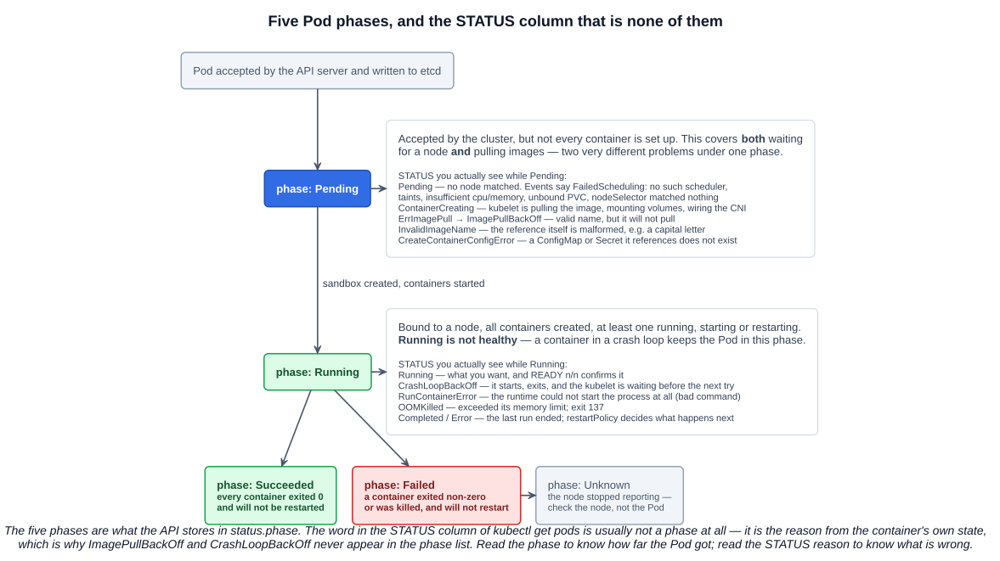
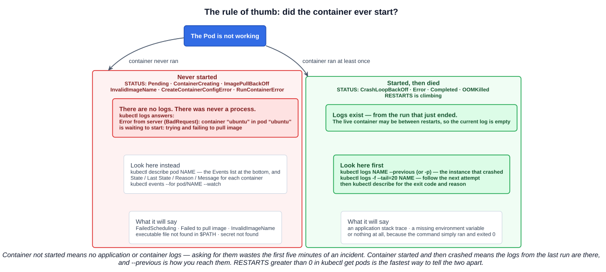

# 03 — Troubleshooting Pods

Chapter 02 created Pods that worked. This one is about the other case, which is most of them. Four deliberate failures — a Pod that is never scheduled, an image name that is malformed, an image name that is valid but does not exist, and a container that starts and immediately exits — cover almost everything a Pod does wrong in practice.

For the exam the useful output is recognition: given a `STATUS` string, know which layer failed and which command shows why. That mapping is the whole chapter.

---

## 1. Phases, container states, and the column that is neither

Three different things get called "status", and mixing them up is where most confusion starts.

### 1.1 Pod phase — `status.phase`

A simple, high-level summary. **Five values, and only five:**

| Phase | Meaning |
|---|---|
| `Pending` | Accepted by the cluster, but one or more containers is not set up and running yet. **Includes both waiting to be scheduled and downloading images** |
| `Running` | Bound to a node, all containers created, and **at least one** is running, starting or restarting |
| `Succeeded` | All containers terminated **successfully** and will not be restarted |
| `Failed` | All containers terminated and **at least one failed** — non-zero exit or killed — and will not be restarted |
| `Unknown` | The Pod's state could not be obtained, normally because the node stopped reporting |

Note what `Running` does *not* mean: a container crash-looping keeps the Pod in `Running`, because a container is restarting. Phase is progress, not health.

### 1.2 Container state — per container, inside the Pod

| State | What it records |
|---|---|
| `Waiting` | Not running yet. Carries a **`Reason`** (`ImagePullBackOff`, `CrashLoopBackOff`, `RunContainerError`, …) and a `Message` |
| `Running` | Executing without issue. Carries `startedAt` |
| `Terminated` | Finished. Carries **`Exit Code`**, `Reason`, `Message`, `startedAt` and `finishedAt` |

`kubectl describe pod` prints both the current `State:` and the previous `Last State:` for every container. That pair is the single most informative thing in the output — current state says what it is doing now, last state says how the previous attempt ended.

### 1.3 The `STATUS` column is neither of them

This is the part worth internalizing: the word in `kubectl get pods` is **synthesized**, mostly from the container's `Waiting.Reason` or `Terminated.Reason`. `ImagePullBackOff` and `CrashLoopBackOff` are not phases and never appear in `status.phase`.

```bash
kubectl get pod ubuntu -o jsonpath='{.status.phase}{"\n"}'   # Pending or Running
kubectl get pod ubuntu                                        # ImagePullBackOff or CrashLoopBackOff
```



### 1.4 Pod conditions

`kubectl describe` also prints a `Conditions:` block — five booleans that say how far setup got:

| Condition | True when |
|---|---|
| `PodScheduled` | The Pod has been scheduled to a node |
| `PodReadyToStartContainers` | The Pod sandbox was created and networking configured |
| `Initialized` | All init containers completed successfully |
| `ContainersReady` | All containers in the Pod are ready |
| `Ready` | The Pod can receive traffic and belongs in Service load balancing |

Reading them top to bottom tells you where it stopped. In the lecture's broken-command Pod, `PodScheduled`, `PodReadyToStartContainers` and `Initialized` are all `True` while `ContainersReady` and `Ready` are `False` — scheduling and networking were fine, the container itself is the problem.

---

## 2. The rule of thumb

The course states it as a slide, and it decides which command to run first:

> **Container not started → no application or container logs.**
> **Container started, then crashed → logs available from the last run.**

Ask for logs from a container that never ran and the API server tells you so:

```
$ kubectl logs ubuntu
Error from server (BadRequest): container "ubuntu" in pod "ubuntu" is waiting to start: trying and failing to pull image
```

That message is not a failure of the command — it is the answer. There is no log because there was never a process. Go to `describe` and events instead.

The fastest way to tell the two cases apart is the **`RESTARTS` column**: greater than zero means a container has run at least once, so logs exist.



---

## 3. Failure 1 — the Pod is never scheduled

The lecture forces this by naming a scheduler that does not exist:

```yaml
apiVersion: v1
kind: Pod
metadata:
  name: ubuntu
spec:
  schedulerName: does-not-exist
  containers:
  - name: ubuntu
    image: ubuntu
    args: ["sleep", "infinity"]
```

`spec.schedulerName` tells the API server which scheduler is responsible for binding this Pod. `default-scheduler` is the one from chapter 01; naming anything else means the default scheduler ignores the Pod, and since no other scheduler is running, nobody ever binds it.

The result is a Pod that sits in `Pending` **forever, with no events at all** — not even a failure. Nothing has gone wrong; nothing is looking.

```bash
kubectl get pod ubuntu                                  # Pending, 0/1, age climbing
kubectl get pod ubuntu -o jsonpath='{.spec.nodeName}'   # empty — never bound
kubectl describe pod ubuntu                             # Events: <none>
```

That silence is diagnostic. Compare it with the ordinary unschedulable Pod, where the scheduler *did* look and reports why:

```
Events:
  Warning  FailedScheduling  0/3 nodes are available: 1 node(s) had untolerated taint
           {node-role.kubernetes.io/control-plane: }, 2 Insufficient cpu.
```

The common real causes of `Pending`, all visible in that one event:

| Cause | What the event says |
|---|---|
| Not enough CPU or memory anywhere | `Insufficient cpu` / `Insufficient memory` |
| Node taints with no matching toleration | `had untolerated taint` |
| `nodeSelector` or affinity matches no node | `didn't match Pod's node affinity/selector` |
| A PersistentVolumeClaim is unbound | `had volume node affinity conflict` / pod has unbound immediate PersistentVolumeClaims |
| No scheduler is watching | **no events at all** |

---

## 4. Failure 2 — the image

Two different failures that look similar and are not.

### 4.1 `ubuntuX` — `InvalidImageName`

Changing the image to `ubuntuX` fails before anything is contacted. **Image repository names must be lowercase** in the OCI/Docker reference grammar, so `ubuntuX` is not a malformed *reference to something*, it is not a valid reference at all. The kubelet rejects it locally:

```
STATUS: InvalidImageName
Events:  Warning  InspectFailed  Failed to apply default image tag "ubuntuX":
         couldn't parse image name "ubuntuX": invalid reference format: repository name must be lowercase
```

No registry request is ever made, and there is no back-off cycle — the name cannot be fixed by retrying.

### 4.2 `ubuntux` — `ErrImagePull` → `ImagePullBackOff`

Lowercase it and the reference becomes legal, so the kubelet asks Docker Hub for `docker.io/library/ubuntux:latest`, which does not exist. Now you get the cycle from the terminal capture:

```
ubuntu   0/1   ContainerCreating   0   0s
ubuntu   0/1   ErrImagePull        0   3s
ubuntu   0/1   ImagePullBackOff    0   17s
ubuntu   0/1   ErrImagePull        0   30s
ubuntu   0/1   ImagePullBackOff    0   42s
```

The two alternate, and they are two halves of one loop:

- **`ErrImagePull`** — a pull was just attempted and failed.
- **`ImagePullBackOff`** — the kubelet is waiting before trying again, with the same exponential back-off it uses for crash loops.

`RESTARTS` stays at `0` throughout, because no container ever started. That zero is the tell that this is a pull problem and not a crash problem.

Other things that produce the same pair:

| Cause | Give-away in the event message |
|---|---|
| Typo in the image or tag | `manifest unknown` / `not found` |
| Private registry, no `imagePullSecret` | `unauthorized` / `authentication required` |
| Docker Hub anonymous rate limit | `toomanyrequests` |
| Image built for the wrong architecture | `no matching manifest for linux/arm64` |
| Air-gapped node, `imagePullPolicy: Always` | `dial tcp … i/o timeout` |

---

## 5. Failure 3 — it starts, exits, and restarts: `CrashLoopBackOff`

The lecture's demo removes `sleep infinity` from a working `ubuntu` Pod and watches it fall over:

```
ubuntu   0/1   ContainerCreating   0             0s
ubuntu   0/1   Completed           0             1s
ubuntu   0/1   Completed           1 (1s ago)    2s
ubuntu   0/1   CrashLoopBackOff    1 (11s ago)   13s
ubuntu   0/1   Completed           2 (11s ago)   13s
ubuntu   0/1   CrashLoopBackOff    2 (25s ago)   38s
```

### 5.1 Why removing the args breaks it

This is worth getting exactly right, because it is the `ENTRYPOINT`/`CMD` rules from chapter 03-06 showing up under different field names.

| Pod spec field | Overrides the image's |
|---|---|
| `command` | `ENTRYPOINT` |
| `args` | `CMD` |

And the resulting command line is always **entrypoint + args**, taking each from the Pod spec if present and the image if not:

| Pod spec | What actually runs in an `ubuntu` container |
|---|---|
| neither | `/bin/bash` — the image's `CMD` |
| `args: ["sleep","infinity"]` | `sleep infinity` |
| `command: ["/bin/bash"], args: ["-c","sleep infinity"]` | `/bin/bash -c "sleep infinity"` |

The `ubuntu` image has **no `ENTRYPOINT`** and `CMD ["/bin/bash"]`:

```
$ docker image inspect ubuntu --format 'Entrypoint={{json .Config.Entrypoint}} Cmd={{json .Config.Cmd}}'
Entrypoint=null Cmd=["/bin/bash"]
```

So with `args: ["sleep","infinity"]` the container runs `sleep infinity` — the `/bin/bash` from `CMD` is replaced, not prefixed. (The lecture describes this as running `/bin/bash sleep infinity`; the observable outcome is the same, but the mechanism is the substitution above, which matters as soon as an image *does* have an `ENTRYPOINT`.)

Remove the args and the container falls back to `CMD`, so it runs plain `/bin/bash`. A non-interactive bash with no script and no attached terminal reads end-of-input immediately and **exits 0**. That is `Completed`.

### 5.2 Why `Completed` turns into a crash loop

`restartPolicy` defaults to `Always`, and `Always` means *restart when the container exits, successfully or not*. So: exit 0, restart, exit 0, restart. The kubelet notices the pattern and inserts a delay, which is what `CrashLoopBackOff` is:

- delay starts at **10 seconds** and doubles — 10s, 20s, 40s …
- capped at **300 seconds (5 minutes)**
- **resets after the container has run for 10 minutes** without a problem

`CrashLoopBackOff` is therefore **not an error state**. It is the waiting room between restarts. The error is whatever made the container exit, and that is in the logs of the previous run.

The general lesson is the container rule from Section 3: **a container lives exactly as long as its main process**. Anything that forks to the background and returns, or runs to completion, cannot be a long-running Pod.

---

## 6. Failure 4 — the process cannot start: `RunContainerError`

The last demo mistypes the command as `sleeep infinity`. The image pulls fine, the sandbox is created, and then `runc` cannot find the binary:

```
State:          Waiting
  Reason:       RunContainerError
Last State:     Terminated
  Reason:       StartError
  Message:      failed to create containerd task: failed to create shim task: OCI runtime
                create failed: runc create failed: unable to start container process:
                error during container init: exec: "sleeep": executable file not found in $PATH
  Exit Code:    128
  Started:      Thu, 01 Jan 1970 00:00:00 +0000
  Finished:     Tue, 13 Jan 2026 13:43:30 +0000
```

Several things in that block are worth reading closely:

- The error chain names every layer from chapter 01 in order: **containerd → shim → OCI runtime → runc → container init**. The failure is at the very bottom, in `exec`.
- **`Started: Thu, 01 Jan 1970`** — the Unix epoch, meaning *never started*. A zero timestamp is the giveaway that no process ever existed.
- The Pod phase is still `Running` and the IP is assigned, because the sandbox came up. Only the container failed.

Exit codes worth recognizing:

| Code | Meaning |
|---|---|
| `0` | Exited successfully. With `restartPolicy: Always` this still restarts |
| `1` | Generic application error |
| `126` | The command was found but is not executable |
| `127` | Command not found (reported by a shell) |
| `128` | Container failed to start — as here, the binary is not in `$PATH` |
| `137` | `128 + 9` (SIGKILL) — usually **OOMKilled**, sometimes a forced delete |
| `143` | `128 + 15` (SIGTERM) — a normal graceful shutdown |

The pattern to take away: **`ImagePullBackOff` is the image, `RunContainerError` is the command, `CrashLoopBackOff` is the application.**

---

## 7. The four tools

### 7.1 `kubectl describe pod`

The one command that covers every failure above. Read it in this order: **Events** at the bottom first, then `State` / `Last State` / `Reason` / `Message` for each container, then `Conditions`, then the image and args to check they are what you meant.

```bash
kubectl describe pod ubuntu
```

### 7.2 Events

Events are objects in their own right, produced by the scheduler, kubelet and controllers. Two commands read them:

```bash
# The purpose-built command
kubectl events                                   # this namespace, newest last
kubectl events --for pod/ubuntu                  # only events about this object
kubectl events --for pod/ubuntu --watch          # and keep streaming
kubectl events --types=Warning                   # or Warning,Normal
kubectl events -A                                # every namespace

# The older way, still everywhere
kubectl get events --sort-by=.metadata.creationTimestamp
kubectl get events --field-selector involvedObject.name=ubuntu,type=Warning
```

`kubectl events` exists because `kubectl get events` is awkward: it sorts badly by default and needs a field selector to filter by object. `--for` replaces that field selector, and `--watch` after `--for` is the one to remember for watching a Pod come up or fail.

The catch that costs people time: **events expire**. The API server discards them after a TTL — typically about an hour, set by its `--event-ttl` flag. A Pod that has been broken since yesterday shows `Events: <none>` even though something clearly went wrong; the record simply aged out. `describe` on a long-broken Pod can look deceptively clean, which is why `Last State` matters.

### 7.3 `kubectl logs`

```bash
kubectl logs ubuntu                                   # the current container
kubectl logs ubuntu -p                                # --previous: the instance that crashed
kubectl logs -f ubuntu                                # follow
kubectl logs -f --tail=20 ubuntu                      # follow, starting from the last 20 lines
kubectl logs ubuntu -c ubuntu -f --tail=20            # and pick the container explicitly
kubectl logs ubuntu --all-containers -f --tail=20     # every container in the Pod at once
kubectl logs ubuntu --all-containers --prefix         # prefix each line with pod/container
kubectl logs --since=15m ubuntu                       # or --since-time=2026-01-13T13:00:00Z
kubectl logs -l run=ubuntu --all-containers -f        # by label, across Pods
```

The flags worth knowing well:

| Flag | What it does |
|---|---|
| `-p`, `--previous` | The **previous** instance's log. In a crash loop, the only one with the error in it |
| `-f`, `--follow` | Stream. Combines with everything below |
| `--tail=N` | Start from the last N lines instead of the whole file. **`-f --tail=20` is the useful pair** — you get recent context and then live output, instead of a wall of history |
| `--all-containers` | Every container in the Pod in one stream. Combines with `-f` and `--tail`; add `--prefix` so you can tell which line came from where |
| `--since=5m` | Only logs newer than a relative duration |
| `--timestamps` | Prefix each line with its time |
| `-l`, `--selector` | Across all Pods matching a label. `--tail` defaults to 10 here, and `--max-log-requests` (default 5) caps how many are followed at once |

`--all-containers` is the one most people never find. In a Pod with an app plus a sidecar, it replaces two terminals with one command, and with `--prefix` it stays readable.

### 7.4 `kubectl exec`

For when the Pod runs but does the wrong thing.

```bash
kubectl exec ubuntu -- env                            # what the container actually sees
kubectl exec ubuntu -- cat /etc/resolv.conf
kubectl exec ubuntu -- ls -l /app/config
kubectl exec -it ubuntu -c ubuntu -- bash             # interactive shell
kubectl exec -it ubuntu -- sh                         # if the image has no bash
```

Everything after `--` is the container's command. `-i` keeps stdin open and `-t` allocates a TTY; you need both for a usable shell. `-c` is required once the Pod has more than one container.

`exec` needs the binary to exist **inside the image**. Distroless and scratch images have no shell at all, and the answer there is `kubectl debug`, which attaches an ephemeral container with your tools to the running Pod:

```bash
kubectl debug -it ubuntu --image=busybox:1.36 --target=ubuntu
```

That is beyond KCNA, but it is the thing to reach for when `exec` reports `executable file not found`.

---

## 8. The replace-and-recreate idiom

Most of a Pod's spec is **immutable** once created — you cannot edit the image or the command of a running Pod and apply it. The lecture works around that with:

```bash
kubectl replace --force=true --grace-period=0 -f ubuntu.yaml; kubectl get pods --watch
```

`--force` makes `replace` **delete the object and create it again** rather than patch it, and `--grace-period=0` skips the termination grace period so the loop is immediate. The output shows both halves:

```
pod "ubuntu" deleted from default namespace
pod/ubuntu replaced
```

Chaining `kubectl get pods --watch` onto the same line means the watch starts against the fresh Pod and every state transition scrolls past — which is how all the state sequences in this chapter were captured. Useful for a lab; in real work, change a Deployment and let the rollout handle it.

---

## Exam angle

- **Phases versus statuses.** `status.phase` has exactly five values: `Pending`, `Running`, `Succeeded`, `Failed`, `Unknown`. If a question offers `CrashLoopBackOff` or `ImagePullBackOff` as a *phase*, that is the distractor — they are container state reasons that `kubectl get pods` prints in the `STATUS` column.
- **`Running` does not mean healthy.** A Pod with a crash-looping container is still in phase `Running`. `READY 0/1` and a climbing `RESTARTS` are what tell you otherwise.
- **Which command for which failure.** Container never started (`Pending`, `ImagePullBackOff`, `InvalidImageName`, `RunContainerError`) → **`describe` and events**, because no logs exist. Container started then died (`CrashLoopBackOff`, `Error`, `OOMKilled`) → **`kubectl logs --previous`**.
- **`ImagePullBackOff` versus `CrashLoopBackOff`.** The first is the image — nothing ever ran and `RESTARTS` is `0`. The second is the application — it ran, exited, and is being restarted with a back-off of 10s doubling to a 5-minute cap.
- **`InvalidImageName` is a *name* problem.** The reference is malformed (uppercase letters are illegal in a repository name) and no registry is ever contacted. `ErrImagePull` means the name was valid and the registry said no.
- **A container lives as long as its main process.** A Pod whose command exits — including exiting 0 — restarts forever under the default `restartPolicy: Always`. `Completed` with a rising `RESTARTS` count is this.
- **`kubectl exec` syntax.** `kubectl exec -it <pod> -c <container> -- <command>`; everything after `--` belongs to the container, `-c` is required for multi-container Pods.

## References

- [Pod Lifecycle](https://kubernetes.io/docs/concepts/workloads/pods/pod-lifecycle/) — phases, container states, conditions and the restart back-off
- [Debug Running Pods](https://kubernetes.io/docs/tasks/debug/debug-application/debug-running-pod/) — `exec`, ephemeral containers and `kubectl debug`
- [kubectl logs](https://kubernetes.io/docs/reference/kubectl/generated/kubectl_logs/) — every flag, with examples
- [kubectl events](https://kubernetes.io/docs/reference/kubectl/generated/kubectl_events/) — `--for`, `--types`, `--watch`
