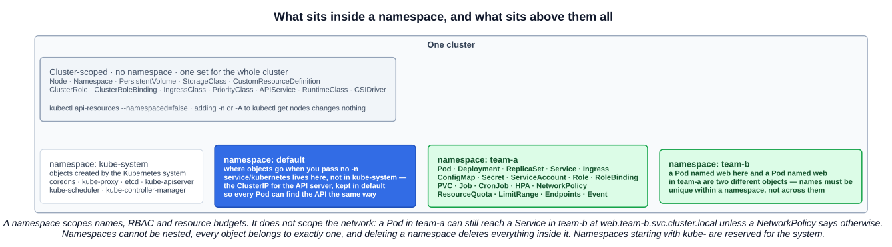
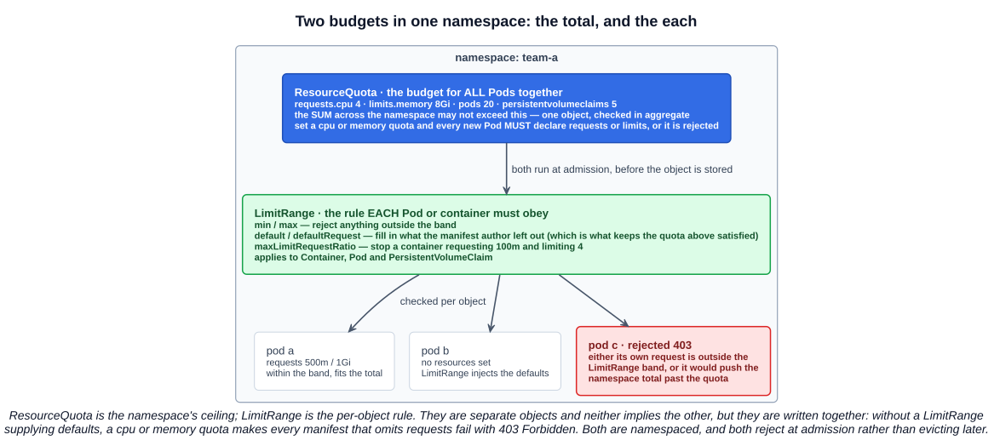

# 04 — Namespaces

A namespace is the answer to a question that only appears at scale: two teams both want to deploy something called `web`, and one of them should not be able to delete the other's. Everything else namespaces do — quotas, RBAC boundaries, tidier `kubectl` output — follows from that.

The exam goes further than "create a namespace and put a Pod in it". It wants the default namespaces and their purposes, which objects are namespaced and which are not, and the difference between a ResourceQuota and a LimitRange.

---

## 1. What a namespace is

> In Kubernetes, *namespaces* provide a mechanism for isolating groups of resources within a single cluster. Names of resources need to be unique within a namespace, but not across namespaces. Namespace-based scoping is applicable only for namespaced objects (e.g. Deployments, Services, etc.) and not for cluster-wide objects (e.g. StorageClass, Nodes, PersistentVolumes, etc.).

The course's picture is a town: the cluster is the town, a namespace is one house in it, and the Pods are the rooms inside that house. The useful part of the analogy is that the houses share the town's roads and utilities — namespaces are an organizational boundary drawn on top of one shared cluster, not separate clusters.

Three structural rules follow:

- **Every object belongs to exactly one namespace** (if it is namespaced at all).
- **Namespaces cannot be nested.** There is no hierarchy — the list is flat.
- **Deleting a namespace deletes everything in it.** `kubectl delete namespace team-a` is one of the most destructive commands available.



---

## 2. The four default namespaces

A fresh cluster starts with four, and the exam asks what each is for:

| Namespace | Purpose |
|---|---|
| **`default`** | So you can start using a new cluster without creating a namespace first. Objects with no namespace specified land here |
| **`kube-system`** | **Objects created by the Kubernetes system** — CoreDNS, kube-proxy, and on a kubeadm cluster the control plane static pods |
| **`kube-public`** | **Readable by all clients, including unauthenticated ones.** Reserved mostly for cluster usage; in practice it holds the `cluster-info` ConfigMap that bootstrapping nodes read |
| **`kube-node-lease`** | Holds a **Lease object per node**. Node leases are how the kubelet sends heartbeats so the control plane can detect node failure |

Two rules about naming:

- **The `kube-` prefix is reserved** for Kubernetes system namespaces. Do not create your own with it.
- For a production cluster the documentation suggests **not using `default` at all** — make named namespaces and use those.

`kube-node-lease` is the one people forget. It exists for scale: before it, every kubelet updated its whole Node object to say "still here", which was a large write every few seconds per node. A Lease is a tiny object, so heartbeats got cheap.

---

## 3. The one exception: `service/kubernetes` in `default`

Almost everything the system creates is in `kube-system`. The exception is the `kubernetes` Service:

```bash
$ kubectl get service kubernetes
NAME         TYPE        CLUSTER-IP   EXTERNAL-IP   PORT(S)   AGE
kubernetes   ClusterIP   10.96.0.1    <none>        443/TCP   4d
```

It lives in **`default`**, and it is the in-cluster ClusterIP for the API server itself — the address behind `KUBERNETES_SERVICE_HOST` that every ServiceAccount-authenticated Pod uses to talk to the API. It sits in `default` for ease of discovery: the short name `kubernetes` resolves from the default namespace, and `kubernetes.default.svc.cluster.local` works from anywhere, so any Pod can find the API the same way without knowing a control-plane IP.

---

## 4. Namespaced versus cluster-scoped

Not every object can be put in a namespace. The split is not arbitrary: **things that describe the cluster itself are cluster-scoped; things that are your workload are namespaced.**

| Cluster-scoped (no namespace) | Namespaced |
|---|---|
| `Node` | `Pod` |
| `Namespace` (itself) | `Deployment`, `ReplicaSet`, `StatefulSet`, `DaemonSet` |
| `PersistentVolume` | `PersistentVolumeClaim` |
| `StorageClass`, `CSIDriver` | `Service`, `Ingress`, `Endpoints` |
| `ClusterRole`, `ClusterRoleBinding` | `Role`, `RoleBinding`, `ServiceAccount` |
| `CustomResourceDefinition` | `ConfigMap`, `Secret` |
| `IngressClass`, `PriorityClass`, `RuntimeClass` | `Job`, `CronJob`, `HorizontalPodAutoscaler` |
| `APIService`, webhook configurations | `ResourceQuota`, `LimitRange`, `NetworkPolicy`, `Event` |

The PV/PVC pair is the clearest illustration of the rule: a **PersistentVolume** is a piece of storage the cluster owns, so it is cluster-scoped; a **PersistentVolumeClaim** is one team's request to use some, so it is namespaced. Same for `StorageClass` versus the claim that references it, and `ClusterRole` versus `Role`.

### 4.1 Checking, rather than memorizing

```bash
kubectl api-resources --namespaced=true      # everything that lives in a namespace
kubectl api-resources --namespaced=false     # everything that does not
kubectl api-resources | more                 # the whole table, one screen at a time
```

`kubectl api-resources` also prints the **short names** — `po`, `svc`, `deploy`, `ns`, `cm`, `pv`, `pvc`, `sa`, `netpol` — and the API group and version for each kind. It is the fastest answer to "is this thing namespaced" and "what do I abbreviate this as", and it reads the live API server, so CRDs installed on your cluster appear too.

Adding `-n` or `-A` to a cluster-scoped query changes nothing: `kubectl get nodes -n kube-system` returns every node, because nodes have no namespace to filter on.

### 4.2 `kubectl get all` is not all

```bash
kubectl get all              # this namespace
kubectl get all -A           # every namespace — the lecture's cluster tour
```

`all` is an API **category**, not a literal everything. It covers roughly Pods, Services, Deployments, ReplicaSets, StatefulSets, DaemonSets, Jobs, CronJobs and HorizontalPodAutoscalers. It does **not** include ConfigMaps, Secrets, ServiceAccounts, Ingresses, PVCs, Roles or any CRD. Useful for a quick tour of a namespace; misleading if you believe the name before deleting something.

---

## 5. What a namespace does and does not isolate

This is where the word "isolation" on the benefits slide needs qualifying. The KCNA and the KCSA both like this distinction.

| | Isolated by a namespace? |
|---|---|
| **Object names** | **Yes.** `web` in `team-a` and `web` in `team-b` are different objects |
| **RBAC permissions** | **Yes** — a Role and RoleBinding grant access only within their namespace |
| **Resource budgets** | **Yes** — a ResourceQuota applies to one namespace |
| **Default `kubectl` scope** | **Yes** — `kubectl get pods` shows only the current namespace |
| **Network traffic** | **No.** Any Pod can reach any Pod or Service in any namespace by default |
| **DNS visibility** | **No.** `web.team-b.svc.cluster.local` resolves from `team-a` |
| **Nodes and the kernel** | **No.** Pods from different namespaces share the same nodes |

Service DNS is where the boundary is softest, and it is worth being precise:

- From inside a namespace, the **short name** resolves locally: `nginx` from `team-a` means `nginx.team-a.svc.cluster.local`.
- **To reach across namespaces you need the qualified name**: `nginx.team-b`, or the FQDN `nginx.team-b.svc.cluster.local`.

That is a convenience default, not a wall. Cross-namespace traffic is allowed unless a **NetworkPolicy** forbids it — and NetworkPolicy needs a CNI that enforces it (Calico, Cilium; not plain Flannel). A namespace is an *administrative* boundary. A network boundary is something you add.

---

## 6. ResourceQuota and LimitRange

Two namespaced objects that both constrain resources, at two different scopes. The exam contrasts them directly.



### 6.1 ResourceQuota — the total for the namespace

> A resource quota, defined by a ResourceQuota object, provides constraints that limit **aggregate resource consumption per namespace**.

Budgets the **sum across every object** in the namespace:

```yaml
apiVersion: v1
kind: ResourceQuota
metadata:
  name: team-a-quota
  namespace: team-a
spec:
  hard:
    requests.cpu: "4"
    requests.memory: 8Gi
    limits.cpu: "8"
    limits.memory: 16Gi
    pods: "20"
    persistentvolumeclaims: "5"
```

It covers three kinds of thing:

| Quota type | Example keys |
|---|---|
| **Compute** | `requests.cpu`, `requests.memory`, `limits.cpu`, `limits.memory`, `requests.nvidia.com/gpu` |
| **Storage** | `requests.storage`, `persistentvolumeclaims`, per-StorageClass variants |
| **Object count** | `pods`, `services`, `configmaps`, `secrets`, `services.loadbalancers` |

**The gotcha worth remembering:** once a namespace has a `cpu` or `memory` quota, **every new Pod must declare requests or limits for that resource**, or the API server rejects it with `403 Forbidden`. Adding a quota to a namespace full of manifests that never set resources will break all of them at once.

### 6.2 LimitRange — the rule for each object

> A LimitRange is a policy to constrain the resource allocations that you can specify for **each applicable object kind** in a namespace.

What it can enforce, per `Container`, per `Pod`, or per `PersistentVolumeClaim`:

| Field | Effect |
|---|---|
| `min` / `max` | Reject anything requesting less than, or limiting more than, the band |
| `default` | The **limit** injected into a container that did not set one |
| `defaultRequest` | The **request** injected into a container that did not set one |
| `maxLimitRequestRatio` | Cap how far a limit may exceed its request — stops `request: 100m, limit: 4` |

```yaml
apiVersion: v1
kind: LimitRange
metadata:
  name: team-a-limits
  namespace: team-a
spec:
  limits:
  - type: Container
    default:          { cpu: 500m, memory: 512Mi }
    defaultRequest:   { cpu: 100m, memory: 128Mi }
    min:              { cpu: 50m,  memory: 64Mi }
    max:              { cpu: "2",  memory: 2Gi }
```

### 6.3 Side by side

| | ResourceQuota | LimitRange |
|---|---|---|
| Scope | **All objects in the namespace, in aggregate** | **Each individual Pod, container or PVC** |
| Answers | "How much may this whole team use?" | "How much may any one container ask for?" |
| Can inject defaults | No | **Yes** — `default` and `defaultRequest` |
| Can cap object counts | **Yes** — `pods: "20"` | No |
| On violation | `403 Forbidden` at admission | `403 Forbidden` at admission |

They are separate objects and neither implies the other, but they are written together: the LimitRange's defaults are what keep manifests that omit `resources` from failing the quota.

---

## 7. RBAC and namespaces

RBAC is what turns a namespace from tidiness into a security boundary. Section 5 covers it properly; what matters here is the namespaced/cluster-scoped split, because it mirrors section 4 exactly.

| Object | Scope | Grants |
|---|---|---|
| **`Role`** | Namespaced | Permissions **within its own namespace** |
| **`RoleBinding`** | Namespaced | Binds a Role (or a ClusterRole) to subjects, **within its own namespace** |
| **`ClusterRole`** | Cluster-scoped | Permissions on **cluster-scoped resources**, **non-resource endpoints** like `/healthz`, or namespaced resources **across all namespaces** |
| **`ClusterRoleBinding`** | Cluster-scoped | Binds a ClusterRole **cluster-wide** |

The combination worth knowing, because it is the one that trips people up:

> A RoleBinding may reference any Role in the same namespace. Alternatively, a RoleBinding can reference a ClusterRole and bind that ClusterRole to the namespace of the RoleBinding.

So a **ClusterRole bound by a RoleBinding** grants that role's permissions *only inside that one namespace*. That is how the built-in `view`, `edit` and `admin` ClusterRoles are reused per team: write the permission set once cluster-wide, bind it namespace by namespace. It is the **ClusterRoleBinding** that makes it cluster-wide.

---

## 8. Working with namespaces

### 8.1 Creating

```bash
kubectl create namespace team-a
kubectl get namespaces                 # or `ns`
kubectl describe namespace team-a      # shows any quota and limit range in effect
```

Or declaratively:

```yaml
apiVersion: v1
kind: Namespace
metadata:
  name: team-a
```

### 8.2 Imperative commands

```bash
kubectl get pods                       # the current namespace only
kubectl get pods -n kube-system        # a named namespace
kubectl get pods --all-namespaces      # or -A
kubectl run nginx --image=nginx -n team-a
kubectl delete namespace team-a        # and everything in it
```

### 8.3 In a manifest

```yaml
apiVersion: v1
kind: Pod
metadata:
  name: nginx
  namespace: team-a
```

A `metadata.namespace` in the file **wins over the current context** but conflicts with an explicit `-n` on the command line, which errors rather than guessing. Many teams leave `namespace` out of manifests so the same file can be applied to dev and prod, and pass `-n` or use a per-environment context instead.

### 8.4 Setting the default namespace in your kubeconfig

Typing `-n team-a` fifty times is how mistakes happen. The namespace is part of the **context** — a kubeconfig context is a *(cluster, user, namespace)* triple:

```bash
kubectl config set-context --current --namespace=team-a   # change the current context's namespace
kubectl config view --minify | grep namespace:            # confirm it
```

And for moving between clusters:

```bash
kubectl config get-contexts        # the * marks the current one
kubectl config current-context
kubectl config use-context docker-desktop
kubectl config view --minify       # just the current context, resolved
```

The file is `~/.kube/config` by default, overridable with `$KUBECONFIG`. The community tools `kubectx` and `kubens` wrap the two commands above and are worth installing for daily work — not exam material, but the reason experienced people never type `kubectl config set-context`.

---

## 9. When to use namespaces, and when not to

The documentation is unusually direct about this:

- **Use them** when there are many users across multiple teams or projects, and when cluster resources need dividing between them with quotas.
- **Do not bother** on a cluster with a handful of users.
- **Do not use them to separate slightly different versions of the same software** — `v1` and `v2` of one application belong in one namespace, distinguished by **labels**. Namespaces are for tenancy, labels are for variants.

That last point is a good exam distractor: a question about separating two releases of the same app wants labels and selectors, not namespaces.

---

## Exam angle

- **The four default namespaces and their purposes.** `default` (no namespace specified), `kube-system` (objects created by the Kubernetes system), `kube-public` (**readable by all clients, including unauthenticated**), `kube-node-lease` (**Lease objects for node heartbeats**). `kube-public` and `kube-node-lease` are the two that get asked.
- **Namespaced versus cluster-scoped.** Pods are namespaced, **nodes are not**. Others worth knowing cold: `PersistentVolume` cluster-scoped but `PersistentVolumeClaim` namespaced; `ClusterRole`/`ClusterRoleBinding` cluster-scoped but `Role`/`RoleBinding` namespaced; `Namespace` itself is cluster-scoped. Check with `kubectl api-resources --namespaced=false`.
- **ResourceQuota versus LimitRange.** Quota = the **total for all Pods in the namespace**, and can also cap object counts. LimitRange = the rule **each** Pod or container must obey, and the only one of the two that can **inject defaults**. If the question says "all" it is a quota; if it says "each" it is a LimitRange.
- **A namespace is not a network boundary.** Pods in different namespaces reach each other by default; cross-namespace DNS just needs the qualified name. Isolating traffic takes a **NetworkPolicy**.
- **RBAC scoping.** A `RoleBinding` referencing a `ClusterRole` grants those permissions **only within that namespace**. Cluster-wide needs a `ClusterRoleBinding`.
- **`service/kubernetes` lives in `default`,** not `kube-system` — the API server's ClusterIP, kept there so every Pod can discover the API the same way.
- **Namespaces versus labels.** Different teams or tenants → namespaces. Different versions of one application → labels.

## References

- [Namespaces](https://kubernetes.io/docs/concepts/overview/working-with-objects/namespaces/) — the definition, the four initial namespaces, when to use them
- [Resource Quotas](https://kubernetes.io/docs/concepts/policy/resource-quotas/) — aggregate limits per namespace, and the requests/limits requirement
- [Limit Ranges](https://kubernetes.io/docs/concepts/policy/limit-range/) — per-object min, max, defaults and ratio
- [Using RBAC Authorization](https://kubernetes.io/docs/reference/access-authn-authz/rbac/) — Role vs ClusterRole, RoleBinding vs ClusterRoleBinding
