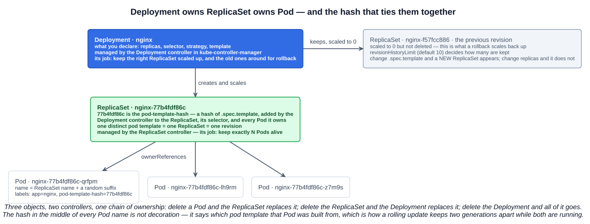
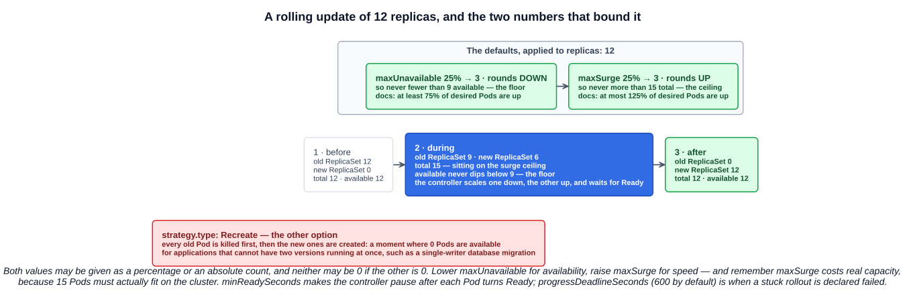

# 05 — Deployments and ReplicaSets

Chapter 02 ended on a warning: a bare Pod has nothing watching it. This chapter is the thing that watches — and the reason nobody runs production workloads as loose Pods.

The exam wants more than "a Deployment runs replicas". It wants the **relationship** between a Deployment and a ReplicaSet, the **default strategy and its parameters**, what does and does not create a **revision**, and how rollout and rollback are driven.

---

## 1. Three objects, two controllers, one chain of ownership

A Deployment does not manage Pods. It manages **ReplicaSets**, and a ReplicaSet manages Pods.



You can watch the chain appear:

```bash
$ kubectl create deployment nginx --image=nginx
$ kubectl get deployment
NAME    READY   UP-TO-DATE   AVAILABLE   AGE
nginx   1/1     1            1           13s

$ kubectl get replicaset
NAME               DESIRED   CURRENT   READY   AGE
nginx-77b4fdf86c   1         1         1       21s

$ kubectl get pods
NAME                     READY   STATUS    RESTARTS   AGE
nginx-77b4fdf86c-qrfpm   1/1     Running   0          30s
```

The names are not random, and the middle segment is the point:

| Object | Name | Where the name comes from |
|---|---|---|
| Deployment | `nginx` | You chose it |
| ReplicaSet | `nginx-`**`77b4fdf86c`** | Deployment name + the **`pod-template-hash`** |
| Pod | `nginx-77b4fdf86c-`**`qrfpm`** | ReplicaSet name + a random suffix |

### 1.1 `pod-template-hash`

> The `pod-template-hash` label is added by the Deployment controller to every ReplicaSet that a Deployment creates or adopts. This label ensures that child ReplicaSets of a Deployment do not overlap. It is generated by hashing the `PodTemplate` of the ReplicaSet and using the resulting hash as the label value that is added to the ReplicaSet selector, Pod template labels, and in any existing Pods that the ReplicaSet might have.

Read that as a chain of consequences:

- The hash is **derived from `.spec.template`**. Same template, same hash.
- It goes into the **ReplicaSet's selector**, so a ReplicaSet only ever owns Pods built from its own template.
- It goes into **every Pod's labels**, which is why it appears in the middle of every Pod name.
- Therefore **one distinct pod template = one ReplicaSet = one revision.**

That last line is the whole model. It explains why a rolling update can have two generations of Pods running at once without either ReplicaSet stealing the other's Pods, and it explains the revision numbering later in this chapter.

The documentation is blunt about it: **do not change this label.**

### 1.2 Ownership is what makes it self-healing

Each level is tied to the one above by `metadata.ownerReferences`:

- Delete a **Pod** → the ReplicaSet notices `CURRENT` is below `DESIRED` and creates another.
- Delete a **ReplicaSet** → the Deployment controller recreates it.
- Delete the **Deployment** → garbage collection removes the ReplicaSets and their Pods.

This is the controller reconciliation loop from chapter 01, two levels deep.

---

## 2. What a ReplicaSet is on its own

> A ReplicaSet's purpose is to maintain a stable set of replica Pods running at any given time.

That is all it does: count Pods matching its selector, and create or delete to reach `replicas`. It has no concept of versions, updates or rollbacks.

The documentation's advice is explicit:

> A Deployment is a higher-level concept that manages ReplicaSets and provides declarative updates to Pods along with a lot of other useful features. Therefore, we recommend using Deployments instead of directly using ReplicaSets, unless you require custom update orchestration or don't require updates at all.

One historical note the exam sometimes reaches for: the **ReplicationController** is the original version of this, and a **ReplicaSet** is its successor. The practical difference is the selector — a ReplicaSet supports **set-based** selectors (`matchExpressions`, with `In`, `NotIn`, `Exists`), a ReplicationController only equality-based ones. ReplicationControllers are legacy; nothing new should use them.

A ReplicaSet will also **adopt** a stray Pod that matches its selector and has no controller owner, which is a good reason to keep selectors specific.

---

## 3. What a Deployment adds

The lecture's three headline features, and the one sentence each that matters:

| Feature | What it means |
|---|---|
| **Replication** | Should a Pod crash or get deleted, the number of Pods is restored to what was declared |
| **Updates** | Changes are **phased out gradually** so all instances are not replaced simultaneously — the application stays available during the update |
| **Rollbacks** | If the new version misbehaves, you can revert to an older one |

Or, as the slide puts it: **update the application predictably, and maintain availability even during the update.**

---

## 4. A Pod versus a Pod inside a Deployment

The course flags this as an exam area, and it is a common source of YAML errors. The same container spec sits at two different depths.

```yaml
# A Pod                          # A Deployment
apiVersion: v1                   apiVersion: apps/v1
kind: Pod                        kind: Deployment
metadata:                        metadata:
  name: nginx                      name: nginx
  labels:                        spec:
    app: nginx                     replicas: 3
spec:                              selector:
  containers:                        matchLabels:
  - name: nginx                        app: nginx
    image: nginx                   template:            # <- a PodTemplateSpec
                                     metadata:
                                       labels:
                                         app: nginx     # must match the selector
                                     spec:
                                       containers:
                                       - name: nginx
                                         image: nginx
```

| | Pod | Deployment |
|---|---|---|
| `apiVersion` | **`v1`** (core group) | **`apps/v1`** |
| Containers live at | `spec.containers` | **`spec.template.spec.containers`** |
| `metadata.name` | the Pod's actual name | the **Deployment's** name — Pods get generated names |
| Pod labels at | `metadata.labels` | **`spec.template.metadata.labels`** |
| Extra required fields | none | **`spec.selector`**, and it must match the template's labels |

Two rules that bite:

- **`spec.selector` must match `spec.template.metadata.labels`**, or the API server rejects the object.
- **`spec.selector` is immutable** once the Deployment exists. Changing it means deleting and recreating.

When in doubt, generate rather than type — and the lecture's one-liner does the generating, saving and applying in a single command:

```bash
kubectl create deployment nginx --image=nginx --dry-run=client -o yaml | tee nginx-deployment.yaml | kubectl apply -f -
```

Reading it left to right: `--dry-run=client -o yaml` builds the manifest locally and prints it without contacting the API server; **`tee` writes it to the file and passes the same text along the pipe**; and **`kubectl apply -f -` reads the manifest from stdin**, which is what the lone `-` means. One command, and you keep the YAML.

---

## 5. Scaling

```bash
kubectl scale deployment nginx --replicas=12
kubectl scale deployment nginx --current-replicas=12 --replicas=6   # only if it is currently 12
```

Or declaratively, by changing `spec.replicas` and re-applying.

The study-tips page makes a point of the direction: **you scale the Deployment, which in turn scales the ReplicaSet, which creates or removes Pods.** There is no such thing as scaling a Pod — a Pod is one instance. "Scale the Pods" in a question is a distractor; the object you scale is the Deployment (or the ReplicaSet beneath it, or a StatefulSet).

The detail worth carrying into section 6: **scaling does not create a revision.** It changes `spec.replicas`, not `spec.template`, so the same ReplicaSet simply gets a new `DESIRED` count and `kubectl rollout history` is unchanged.

Autoscaling is the same operation done by a controller — the HorizontalPodAutoscaler from [02-03](../02-cloud-native-architecture/03-autoscaling.md) writes `spec.replicas` on your behalf.

---

## 6. Update strategies

`spec.strategy.type` has exactly two values:

| Strategy | Behaviour | When |
|---|---|---|
| **`RollingUpdate`** | **The default.** Gradually scale the old ReplicaSet down and the new one up, so the application stays available throughout | Almost always |
| **`Recreate`** | **Kill all existing Pods before creating new ones** — a window with zero Pods available | When two versions must never run at once: a schema migration, a single-writer process, a licence-limited app |

### 6.1 The two parameters, and the arithmetic

`RollingUpdate` is bounded by two fields, both defaulting to **25%**:

| Field | Meaning | Default | Rounding |
|---|---|---|---|
| **`maxUnavailable`** | The maximum number of Pods that can be **unavailable** during the update | `25%` | **Rounds down** |
| **`maxSurge`** | The maximum number of Pods that can be created **above** the desired count | `25%` | **Rounds up** |

Stated the other way round, which is how the documentation puts it: by default at least **75%** of the desired Pods are up, and at most **125%** of the desired Pods are up.

With the lecture's `replicas: 12`:

- `maxUnavailable` 25% of 12 = 3, rounded down = **3** → **never fewer than 9 available**
- `maxSurge` 25% of 12 = 3, rounded up = **3** → **never more than 15 in total** (running plus creating)

Which is exactly what the lecture's live counter shows.



Both accept an absolute number or a percentage, and **neither may be `0` if the other is `0`** — that combination would leave the controller no room to make any move at all.

The trade-off is worth stating plainly: lowering `maxUnavailable` protects availability, raising `maxSurge` speeds the rollout up — and `maxSurge` costs real capacity, because those 15 Pods have to actually fit on the cluster.

### 6.2 The other timing fields

| Field | Default | What it does |
|---|---|---|
| **`minReadySeconds`** | `0` | How long a new Pod must be Ready, without any container crashing, before it counts as **available**. A cheap guard against a container that is Ready and then dies two seconds later |
| **`progressDeadlineSeconds`** | `600` | How long the Deployment may make no progress before it is marked failed with `ProgressDeadlineExceeded`. This is the clock that makes `kubectl rollout status` eventually give up |
| **`revisionHistoryLimit`** | `10` | How many **old ReplicaSets** are kept so you can roll back to them. Set it to `0` and you keep no rollback history |

---

## 7. Triggering a rollout

> A Deployment's rollout is triggered if and only if the Deployment's Pod template (that is, `.spec.template`) is changed, for example if the labels or container images of the template are updated. Other updates, such as scaling the Deployment, do not trigger a rollout.

"If and only if" is doing real work in that sentence. So, to answer the question directly: **yes, changing the image creates a new ReplicaSet and therefore a new revision**, because the image lives inside `.spec.template`, which changes the `pod-template-hash`, which means no existing ReplicaSet matches and a new one must be created.

| Change | New revision? |
|---|---|
| `kubectl set image` | **Yes** — the image is in the template |
| Editing the template's labels, env, resources, volumes | **Yes** |
| `kubectl scale` / changing `spec.replicas` | **No** |
| Changing `spec.strategy`, `revisionHistoryLimit`, `paused` | **No** — outside the template |
| `kubectl rollout restart` | **Yes** — it works by stamping a timestamp annotation *into* the template |

Four ways to make the change:

```bash
kubectl set image deployment/nginx nginx=nginx:1.27      # <container-name>=<new-image>
kubectl edit deployment nginx                            # opens the live object in $EDITOR
kubectl apply -f nginx-deployment.yaml                   # declarative, the one to prefer
kubectl patch deployment nginx -p '{"spec":{"template":{"spec":{"containers":[{"name":"nginx","image":"nginx:1.27"}]}}}}'
kubectl rollout restart deployment/nginx                 # same image, fresh Pods
```

`kubectl rollout restart` is the one people are surprised exists. It replaces every Pod without changing the image — the standard way to make an application re-read a mounted ConfigMap or Secret, or to clear a bad in-memory state, and it does it as a proper rolling update rather than a mass delete.

### 7.1 Watching it happen

```bash
kubectl rollout status deployment/nginx    # blocks until complete, non-zero exit if it fails
kubectl get replicaset -w                  # old RS scaling down, new RS scaling up
watch kubectl get pods -o wide             # the lecture's view of the transition
```

`kubectl rollout status` is the one for scripts and CI: it waits and returns a failure exit code if the rollout does not finish inside `progressDeadlineSeconds`.

The Deployment's own columns say where the rollout is:

| Column | Meaning |
|---|---|
| `READY` | **ready replicas / desired replicas** |
| `UP-TO-DATE` | Replicas already running the **latest** pod template |
| `AVAILABLE` | Replicas that have been Ready for at least `minReadySeconds` |

Mid-rollout, `UP-TO-DATE` below `READY` is the signal that old-generation Pods are still around.

---

## 8. History and `CHANGE-CAUSE`

```bash
$ kubectl rollout history deployment/nginx
deployment.apps/nginx
REVISION   CHANGE-CAUSE
1          <none>
```

`<none>` is the default, and it is not useful. The fix:

> `CHANGE-CAUSE` is copied from the Deployment annotation `kubernetes.io/change-cause` to its revisions upon creation.

```bash
kubectl annotate deployment/nginx kubernetes.io/change-cause="initial deployment"
kubectl annotate deployment/nginx kubernetes.io/change-cause="bump nginx to 1.27 for CVE-2026-1234" --overwrite
```

```
REVISION   CHANGE-CAUSE
1          initial deployment
```

Worth adopting as a habit, as it applies to anything with a rollout — **Deployments, StatefulSets and DaemonSets** all support `kubectl rollout history` and read the same annotation. The one catch that makes it fiddly: the annotation is copied to a revision **when that revision is created**, so it has to be set as part of the same change to land on the right revision. In practice that means either putting the annotation in the manifest you apply, or setting it with `--overwrite` immediately before the change:

```bash
kubectl annotate deployment/nginx kubernetes.io/change-cause="bump to 1.27" --overwrite
kubectl set image deployment/nginx nginx=nginx:1.27
```

The old `--record` flag did this automatically. It is **deprecated and being removed**, so the annotation is the supported way.

To see what a revision actually contained:

```bash
kubectl rollout history deployment/nginx --revision=3    # labels, image, ports for that revision
```

---

## 9. Rollback, and the revision numbering surprise

```bash
kubectl rollout undo deployment/nginx                   # back one revision
kubectl rollout undo deployment/nginx --to-revision=4   # back to a specific one
```

Now the behaviour the lecture demonstrates, which looks like a bug the first time you see it. Start with five revisions, where 5 is broken:

| Revision | ReplicaSet | Image |
|---|---|---|
| 1 | `nginx-aaaaaaaaa` | `nginx:1.0` |
| 2 | `nginx-bbbbbbbbb` | `nginx:1.1` |
| 3 | `nginx-ccccccccc` | `nginx:1.2` |
| 4 | `nginx-ddddddddd` | `nginx:1.3` |
| 5 | `nginx-eeeeeeeee` | `nginx:1.4` — broken |

Run `kubectl rollout undo --to-revision=4` and the history becomes:

| Revision | ReplicaSet | Image |
|---|---|---|
| 1 | `nginx-aaaaaaaaa` | `nginx:1.0` |
| 2 | `nginx-bbbbbbbbb` | `nginx:1.1` |
| 3 | `nginx-ccccccccc` | `nginx:1.2` |
| 5 | `nginx-eeeeeeeee` | `nginx:1.4` — broken |
| **6** | `nginx-ddddddddd` | `nginx:1.3` — **this was revision 4** |

**There is no revision 4 any more.** The history reads 1, 2, 3, 5, 6.

The reason follows directly from section 1.1. A revision number is not a stored list entry — it is the **`deployment.kubernetes.io/revision` annotation on a ReplicaSet**, and there is exactly one ReplicaSet per distinct pod template. Rolling back does not build anything new: it points the Deployment's template back at an existing ReplicaSet and scales it up. That ReplicaSet is then the newest thing that happened, so it gets re-annotated with the next revision number — and its old number goes with it.

The Kubernetes documentation's own worked example shows the same thing: with revisions 1, 2 and 3 in the history, rolling back to revision 2 leaves the Deployment annotated `deployment.kubernetes.io/revision=4`.

The practical consequence: **revision numbers are not stable identifiers.** A runbook that says "roll back to revision 4" is wrong the moment someone rolls back once. Identify a version by its image tag or its `CHANGE-CAUSE`, and read `kubectl rollout history` fresh every time.

---

## 10. Pause and resume

```bash
kubectl rollout pause deployment/nginx
kubectl set image deployment/nginx nginx=nginx:1.27
kubectl set resources deployment/nginx -c=nginx --limits=cpu=200m,memory=512Mi
kubectl rollout resume deployment/nginx                 # one rollout for both changes
```

Pausing stops the controller acting on template changes, so several edits can be batched into a single rollout instead of triggering one each. It is also the safety catch for a canary: pause partway through, look at the metrics, then resume or undo. While paused, `progressDeadlineSeconds` does not count.

---

## Exam angle

- **The relationship.** A Deployment manages **ReplicaSets**; a ReplicaSet manages **Pods**. A Deployment never touches Pods directly. "A Deployment manages Pods" is the distractor.
- **One template, one ReplicaSet, one revision.** Changing `.spec.template` — the image, labels, env, anything — creates a **new ReplicaSet** and a new revision. The `pod-template-hash` in the middle of every Pod name is the hash of that template.
- **What does not create a revision:** scaling. A rollout is triggered **if and only if `.spec.template` changes**.
- **Scale the Deployment, not the Pod.** Increasing replicas is a Deployment operation; there is no way to scale a Pod.
- **The default strategy is `RollingUpdate`**, with **`maxSurge: 25%`** and **`maxUnavailable: 25%`**. So at least 75% available and at most 125% total. `maxSurge` rounds **up**, `maxUnavailable` rounds **down**. The alternative is **`Recreate`**, which kills everything first and accepts downtime.
- **The rollout commands.** `kubectl rollout status` (watch/block), `history` (revisions and CHANGE-CAUSE), `undo` and `undo --to-revision=N` (roll back), `restart` (replace Pods without changing anything), `pause`/`resume`.
- **`CHANGE-CAUSE`** comes from the **`kubernetes.io/change-cause`** annotation, not from magic. `--record` is deprecated.
- **Defaults worth memorizing:** `revisionHistoryLimit` **10**, `progressDeadlineSeconds` **600**, `minReadySeconds` **0**.

## References

- [Deployments](https://kubernetes.io/docs/concepts/workloads/controllers/deployment/) — rollout triggers, strategies, history, rollback, `pod-template-hash`
- [ReplicaSet](https://kubernetes.io/docs/concepts/workloads/controllers/replicaset/) — the definition, ownerReferences, and why to use a Deployment instead
- [Deployment API reference](https://kubernetes.io/docs/reference/kubernetes-api/workload-resources/deployment-v1/) — every field with its default and rounding rule
- [kubectl rollout](https://kubernetes.io/docs/reference/kubectl/generated/kubectl_rollout/) — `status`, `history`, `undo`, `restart`, `pause`, `resume`
