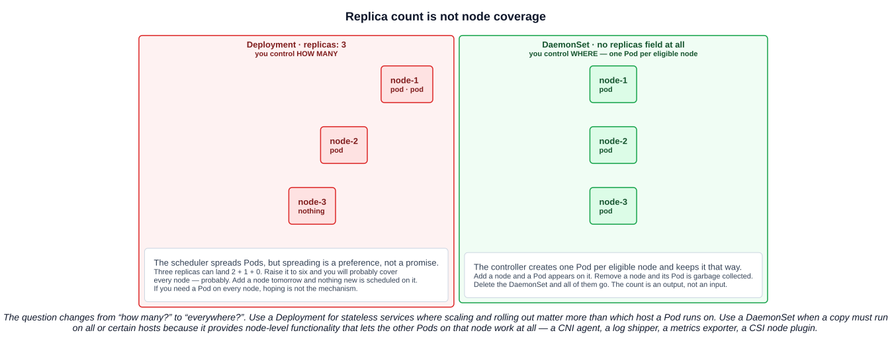
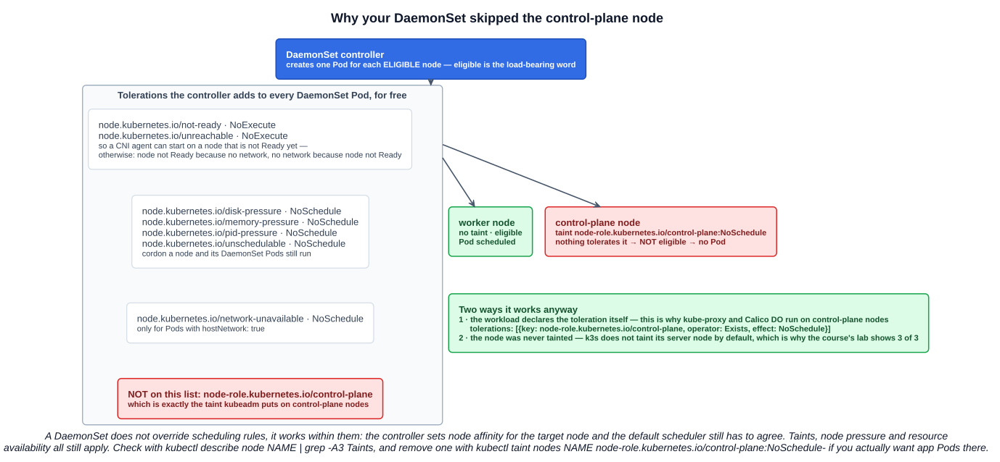

# 06 — DaemonSets

A Deployment answers "how many?". A DaemonSet answers "everywhere?". That is the whole distinction, and everything else in this chapter follows from it.

---

## 1. Where the name comes from

Worth thirty seconds, because the name explains the behaviour.

**In Unix**, a *daemon* is a long-running background process with no controlling terminal, usually started at boot, that provides a service to the rest of the system rather than to a person sitting at a keyboard. The convention is a trailing `d`: `sshd`, `crond`, `systemd`, `dockerd`, `containerd`. It is infrastructure — nobody logs in to use `crond`, they rely on it being there.

**In Java**, `Thread.setDaemon(true)` marks a thread as background in one specific sense: **a daemon thread does not keep the JVM alive.** The JVM exits when the last non-daemon (user) thread finishes, and any daemon threads still running are killed abruptly — `finally` blocks do not run, shutdown is not graceful. It must be set before `start()`. The garbage collector's threads, the JIT compiler threads and the common `ForkJoinPool` workers are all daemon threads: they support the application, they are not the application, and the program's lifetime is not defined by them.

The shared idea across both: **a daemon is supporting infrastructure running in the background so the real work can happen.**

A **DaemonSet** is that idea at cluster scale. Each node is a machine that needs its own background agents — something to ship its logs, something to export its metrics, something to wire up its networking. A DaemonSet is how you say "run this agent on every machine, and keep doing that as machines come and go."

---

## 2. What a DaemonSet is

> A DaemonSet ensures that all (or some) Nodes run a copy of a Pod. As nodes are added to the cluster, Pods are added to them. As nodes are removed from the cluster, those Pods are garbage collected. Deleting a DaemonSet will clean up the Pods it created.

The documentation's own summary of the purpose: *a DaemonSet defines Pods that provide **node-local facilities***.

The typical uses it lists:

- running a **cluster storage** daemon on every node
- running a **logs collection** daemon on every node
- running a **node monitoring** daemon on every node

---

## 3. Replica count is not node coverage

The lecture demonstrates this the honest way: create a Deployment whose Pod prints the node it landed on, then scale the replicas up and see whether every node gets covered.

It does not work reliably, and the reason is worth stating precisely. The scheduler *prefers* to spread Pods of the same workload across nodes, but that preference is a scoring input, not a constraint. Three replicas on three nodes can land 2 + 1 + 0. Push it to six or eight and you will *probably* hit every node — and "probably" is not a property you can build a log pipeline on. Worse, the coverage is a snapshot: add a node tomorrow and the Deployment does not react, because its desired state was a number and that number is still satisfied.



A DaemonSet inverts the input. **There is no `replicas` field in a DaemonSet spec at all.** The count is an output — however many eligible nodes there are. The controller watches nodes, not a number.

The documentation states the choice directly:

> Use a Deployment for stateless services, like frontends, where scaling up and down the number of replicas and rolling out updates are more important than controlling exactly which host the Pod runs on. Use a DaemonSet when it is important that a copy of a Pod always run on all or certain hosts, if the DaemonSet provides node-level functionality that allows other Pods to run correctly on that particular node.

### 3.1 The three workload controllers side by side

| | Deployment | StatefulSet | DaemonSet |
|---|---|---|---|
| You control | **How many** replicas | How many, **plus stable identity** | **Which nodes** — coverage |
| Pod identity | Interchangeable, random names | **Stable, ordered** (`db-0`, `db-1`) | One per node |
| Storage | Usually none or shared | **Per-Pod persistent volumes** | Usually the node's own filesystem |
| `replicas` field | Yes | Yes | **No** |
| For | Stateless apps — web, APIs | Databases, clustered systems | **Node-local platform agents** |

---

## 4. What actually runs as a DaemonSet

This is the part that makes the concept concrete, and the exam likes the examples:

| Category | Examples |
|---|---|
| **Networking** | **CNI agents** — Calico's `calico-node`, Cilium, Flannel — and **`kube-proxy`** itself |
| **Logging** | **Fluentd**, **Fluent Bit**, **Filebeat**, Promtail — tail the node's container logs and ship them off-cluster |
| **Monitoring** | **Prometheus node-exporter**, the OpenTelemetry Collector in agent mode, Datadog and New Relic agents |
| **Storage** | **CSI node plugins** — the per-node half of a CSI driver that actually mounts volumes |
| **Security** | Falco, and most runtime-security and compliance agents |

You have already met two of these without the label. Chapter 01 noted that **kube-proxy is a DaemonSet** — a normal Pod, not a static pod — and that CNI providers install a per-node agent. Both are DaemonSets because both are useless unless they are on *every* node: a node without kube-proxy cannot route Service traffic, and a node without a CNI agent cannot give its Pods working networking at all.

The pattern is the same every time: **the workload needs to be where the data or the hardware is.** A log shipper must be on the node whose `/var/log` it reads. A node-exporter must be on the node whose CPU it measures. Running three copies "somewhere" is not a weaker version of that — it is useless.

---

## 5. Writing one

There is **no `kubectl create daemonset`** subcommand. `kubectl create` covers deployment, job, cronjob, service, configmap, secret, namespace, role and a handful more — DaemonSet is not among them. The course's workaround is the right one: **generate a Deployment and edit it.**

```bash
kubectl create deployment logger --image=alpine --dry-run=client -o yaml \
  -- /bin/sh -c "while true; do date +'%Y-%m-%d-%H:%M:%S - Hello from \$NODE_NAME'; sleep 30; done" \
  | tee logger.yaml
```

Then three edits turn it into a DaemonSet:

| In the Deployment | In the DaemonSet |
|---|---|
| `kind: Deployment` | **`kind: DaemonSet`** |
| `spec.replicas: 1` | **delete it** — the field does not exist |
| `spec.strategy: {}` | **delete it**, or replace with `spec.updateStrategy` |

`apiVersion` stays **`apps/v1`**, and `spec.selector` and `spec.template` work exactly as they do in a Deployment — including the rule that the selector must match the template's labels.

### 5.1 Proving coverage with the downward API

The lecture's Pod prints the node it is running on, which is what makes the experiment legible. The mechanism is the **downward API** — exposing a field of the Pod's own spec as an environment variable:

```yaml
env:
- name: NODE_NAME
  valueFrom:
    fieldRef:
      fieldPath: spec.nodeName
```

Then:

```bash
kubectl logs -l app=logger --prefix
```

One line per node, and `--prefix` from chapter 03 tells you which Pod each came from.

---

## 6. The naming difference

The course highlights this, and it is a genuine structural fact rather than trivia:

| | Pattern | Example |
|---|---|---|
| Deployment Pod | `name-`**`replicaset-id`**`-id` | `logger-76df8d86f6-74kmw` |
| DaemonSet Pod | `name-`**`id`** | `logger-5jm78` |

The Deployment name has an extra segment because there **is** an extra object: Deployment → ReplicaSet → Pod, and the middle segment is the ReplicaSet's `pod-template-hash` from chapter 05.

**A DaemonSet owns its Pods directly.** There is no ReplicaSet in between, so there is no hash to put in the name — just the DaemonSet name and a random suffix. Confirm it from the Pod itself:

```bash
kubectl get pod <daemonset-pod> -o jsonpath='{.metadata.ownerReferences[0].kind}{"\n"}'   # DaemonSet, not ReplicaSet
```

DaemonSets still keep rollout history (`kubectl rollout history ds/<name>`, `revisionHistoryLimit` default **10**) — they store it in **ControllerRevision** objects rather than in old ReplicaSets, which is the same mechanism StatefulSets use.

---

## 7. Why your DaemonSet skipped the control-plane node

This is the behaviour you hit, and it has a precise answer: **the control-plane node is tainted, and a DaemonSet does not automatically tolerate that taint.**



### 7.1 The taint

kubeadm applies this to every control-plane node it builds:

> **`node-role.kubernetes.io/control-plane:NoSchedule`** — Taint that kubeadm applies on control plane nodes to restrict placing Pods and allow only specific pods to schedule on them.

`NoSchedule` means the scheduler will not place a Pod there unless the Pod carries a matching **toleration**. That is deliberate: the control plane is running etcd and the API server, and you do not want an application Pod competing with them for CPU.

```bash
kubectl describe node <control-plane-node> | grep -A3 Taints
kubectl get nodes -o custom-columns='NAME:.metadata.name,TAINTS:.spec.taints[*].key'
```

### 7.2 The tolerations a DaemonSet gets for free

The DaemonSet controller does add tolerations automatically — seven of them:

| Toleration key | Effect | Why |
|---|---|---|
| `node.kubernetes.io/not-ready` | `NoExecute` | Schedule onto nodes that are not Ready, and **do not evict** when they go not-Ready |
| `node.kubernetes.io/unreachable` | `NoExecute` | Same, for nodes the node controller cannot reach |
| `node.kubernetes.io/disk-pressure` | `NoSchedule` | Run despite disk pressure |
| `node.kubernetes.io/memory-pressure` | `NoSchedule` | Run despite memory pressure |
| `node.kubernetes.io/pid-pressure` | `NoSchedule` | Run despite PID pressure |
| `node.kubernetes.io/unschedulable` | `NoSchedule` | **Keep running on a cordoned node** |
| `node.kubernetes.io/network-unavailable` | `NoSchedule` | Only for Pods with `hostNetwork: true` |

The first two exist to break a specific deadlock, and the docs spell it out: without them, a node would never become Ready because the network plugin is not running, and the network plugin would never run because the node is not Ready.

**What is not on that list: `node-role.kubernetes.io/control-plane`.** So a plain DaemonSet covers every worker and stops at the control plane. Exactly what you saw.

### 7.3 Why kube-proxy and Calico do run there

Because they declare the toleration themselves. Look at any of them:

```bash
kubectl get daemonset kube-proxy -n kube-system -o jsonpath='{.spec.template.spec.tolerations}' | python -m json.tool
```

The usual form in a platform DaemonSet is either the specific taint:

```yaml
tolerations:
- key: node-role.kubernetes.io/control-plane
  operator: Exists
  effect: NoSchedule
```

or the blanket "tolerate everything", which is what kube-proxy and most CNI agents use:

```yaml
tolerations:
- operator: Exists
```

An empty `operator: Exists` with no key matches **every** taint — appropriate for something the node genuinely cannot function without, and inappropriate for anything else.

### 7.4 Why the course's lab showed three out of three

The lecture's cluster is **k3s**, and k3s does not taint its server node by default — it runs workloads like any other node. So every node was eligible and `DESIRED` was 3. On a kubeadm cluster like yours, the control-plane node is tainted out of the box, so `DESIRED` counts only the workers.

Nothing is broken in either case. `DESIRED` is the count of **eligible** nodes, and eligibility depends on your cluster's taints.

### 7.5 If you want it there

Add the toleration to your DaemonSet's pod template — the right answer for an agent that genuinely needs node coverage, since you want the control plane's logs and metrics too:

```yaml
spec:
  template:
    spec:
      tolerations:
      - key: node-role.kubernetes.io/control-plane
        operator: Exists
        effect: NoSchedule
```

Removing the taint from the node instead is possible but much broader — it opens the control plane to *every* workload, not just yours:

```bash
kubectl taint nodes <node> node-role.kubernetes.io/control-plane:NoSchedule-   # the trailing - removes it
```

### 7.6 The general rule

A DaemonSet **does not override scheduling** — it works within it. The controller creates a Pod for each eligible node and sets its node affinity; the **default scheduler** still binds it, and can still refuse. So a "missing" DaemonSet Pod is always one of:

- a **taint** with no matching toleration (by far the most common)
- a **`nodeSelector` or affinity** in the template that the node does not match
- **insufficient resources** on the node — `kubectl describe pod` shows `FailedScheduling`

---

## 8. Running on a subset of nodes

"All nodes" is the default, not the only option:

> If you specify a `.spec.template.spec.nodeSelector`, then the DaemonSet controller will create Pods on nodes which match that node selector. Likewise if you specify a `.spec.template.spec.affinity` […] If you do not specify either, then the DaemonSet controller will create Pods on all nodes.

```yaml
spec:
  template:
    spec:
      nodeSelector:
        gpu: "true"        # only nodes labelled gpu=true
```

```bash
kubectl label node worker-1 gpu=true
```

And the coverage tracks the labels: **change a node's labels and the DaemonSet promptly adds Pods to newly matching nodes and deletes them from newly non-matching ones.** That is a genuinely useful property — a GPU driver DaemonSet follows the GPU label around the fleet.

---

## 9. Updates

DaemonSets roll out like Deployments, with different field names and different defaults:

| Field | Default | Notes |
|---|---|---|
| `updateStrategy.type` | **`RollingUpdate`** | The alternative is **`OnDelete`**: new Pods are only created when you delete the old ones by hand |
| `rollingUpdate.maxUnavailable` | **`1`** | Only one node at a time loses its agent — much more conservative than a Deployment's 25% |
| `rollingUpdate.maxSurge` | **`0`** | Two copies of a node agent on one node is usually wrong, so surging is off by default |
| `revisionHistoryLimit` | **`10`** | Same as a Deployment |
| `minReadySeconds` | **`0`** | Same as a Deployment |

`OnDelete` exists for agents where the operator wants to control the blast radius node by node — upgrade the CNI on one node, check it, then move on.

The `kubectl rollout` verbs all work: `status`, `history`, `undo`, `restart`.

---

## 10. Reading `kubectl get daemonset`

```
NAME     DESIRED   CURRENT   READY   UP-TO-DATE   AVAILABLE   NODE SELECTOR   AGE
logger   3         3         3       3            3           <none>          14s
```

| Column | Means |
|---|---|
| `DESIRED` | Nodes that **should** be running the Pod — **the eligible node count**, not a number you set |
| `CURRENT` | Nodes running at least one of its Pods |
| `READY` | Nodes where the Pod is **Ready** |
| `UP-TO-DATE` | Nodes running the **latest** pod template |
| `AVAILABLE` | Nodes where the Pod has been Ready for `minReadySeconds` |
| `NODE SELECTOR` | The selector limiting which nodes are eligible — `<none>` means all of them |

`DESIRED` lower than your node count is the signal to go looking at taints. There is also a `numberMisscheduled` in the status: Pods running on nodes that should *not* have them, normally left over after a label change.

---

## Exam angle

- **The definition.** A DaemonSet **ensures that all (or some) nodes run a copy of a Pod**. Nodes added → Pods added; nodes removed → Pods garbage collected; delete the DaemonSet → its Pods go.
- **DaemonSet versus Deployment.** Deployment = you control **how many replicas**; DaemonSet = you control **node coverage**. **A DaemonSet has no `replicas` field** — scaling it is not a thing, and a question that offers "scale the DaemonSet to 3" is a distractor.
- **Why not just add replicas?** Because the scheduler spreads by preference, not guarantee: replicas can double up on one node and miss another, and adding a node later changes nothing.
- **The examples.** **CNI agents and `kube-proxy`**, **log collectors** (Fluentd, Fluent Bit, Filebeat), **node metrics agents** (node-exporter), **CSI node plugins**, security agents. Anything that must be where the node's data or hardware is.
- **StatefulSet is the third option** — for stable identity and per-Pod storage (databases). Deployment for stateless, StatefulSet for stateful identity, DaemonSet for node coverage.
- **Control-plane nodes.** kubeadm taints them **`node-role.kubernetes.io/control-plane:NoSchedule`**. DaemonSet Pods get automatic tolerations for **not-ready, unreachable, disk/memory/PID pressure and unschedulable** — but **not** for the control-plane taint, so a plain DaemonSet skips those nodes until you add the toleration yourself.
- **Update defaults differ from a Deployment:** `maxUnavailable` **1** and `maxSurge` **0**, not 25%. The second strategy type is **`OnDelete`**.

## References

- [DaemonSet](https://kubernetes.io/docs/concepts/workloads/controllers/daemonset/) — the definition, scheduling, the automatic tolerations, and the comparison with Deployments
- [DaemonSet API reference](https://kubernetes.io/docs/reference/kubernetes-api/workload-resources/daemon-set-v1/) — `updateStrategy`, and every status field behind the `kubectl get` columns
- [Taints and Tolerations](https://kubernetes.io/docs/concepts/scheduling-eviction/taint-and-toleration/) — how `NoSchedule` and tolerations interact
- [Well-Known Labels, Annotations and Taints](https://kubernetes.io/docs/reference/labels-annotations-taints/) — the `node-role.kubernetes.io/control-plane` taint and label
