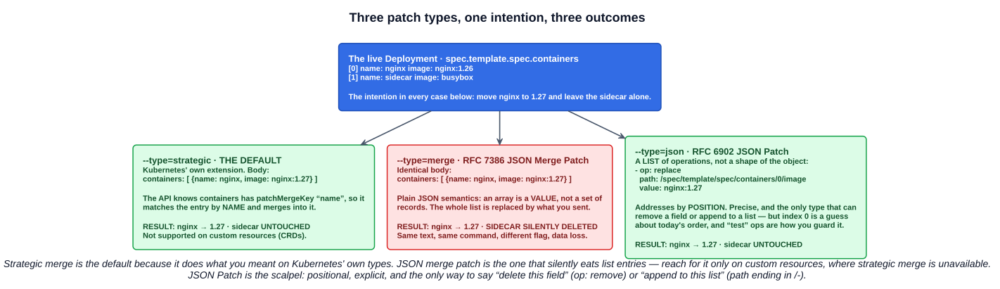
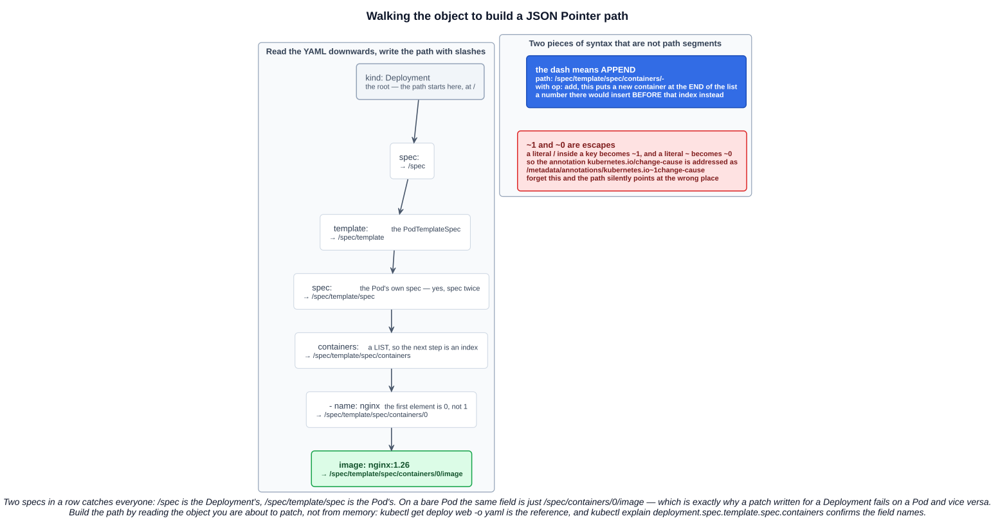

# 07 — `kubectl set image` and `kubectl patch`

Chapter 05 listed five ways to change a running Deployment. This chapter takes the two that change a live object *without* a full manifest: `kubectl set image` for the one thing you change most often, and `kubectl patch` for everything else.

Both are **imperative** commands that end up doing the same thing at the wire level — an HTTP `PATCH` against the API server. The difference is how much of the object you have to describe, and how well the server understands what you meant.

---

## 1. Where these sit

Four ways to change a live object, in increasing order of how much you have to know:

| Command | You supply | Good for |
|---|---|---|
| `kubectl set image` | Just the container name and new image | The 90% case, scripted or at speed |
| `kubectl set <other>` | One specific concern — resources, env, serviceaccount | Targeted, still imperative |
| `kubectl edit` | The whole object, in an editor | Exploring, one-off fixes |
| `kubectl patch` | **Only the fields you are changing** | Automation, scripts, surgical edits |
| `kubectl apply -f` | The whole manifest | The declarative path — what production should use |

`kubectl set` is a family, not a single command. Alongside `image` there are `resources`, `env`, `serviceaccount`, `selector` and `subject`. They are all thin wrappers that build a patch for you.

---

## 2. `kubectl set image`

```
kubectl set image <resource-type>/<name> <container-name>=<new-image>[:tag]
```

```bash
kubectl set image deployment/web nginx=nginx:1.27
kubectl set image pod/nginx nginx=nginx:alpine-slim
kubectl set image daemonset/logger logger=alpine:3.21
```

It works on **`pod`, `replicationcontroller`, `deployment`, `daemonset`, `statefulset`, `cronjob` and `replicaset`** (and their short names: `po`, `rc`, `deploy`, `ds`, `sts`, `cj`, `rs`).

### 2.1 The container name is not the resource name

This is the study-tips page's warning, and it is the single most common mistake with this command. The left-hand side of the `=` is the **container name from the pod template**, which has nothing to do with the Deployment's name:

```bash
kubectl get deployment web -o jsonpath='{.spec.template.spec.containers[*].name}{"\n"}'
kubectl get deployment web -o wide     # the CONTAINERS and IMAGES columns, side by side
```

Get it wrong and the command does not fail loudly — it reports `error: unable to find container named "web"`, which is at least clear, but in a script that exit code is easy to swallow.

### 2.2 The `*` wildcard

```bash
kubectl set image daemonset/abc '*=nginx:1.9.1'
```

The documentation's own comment on that example: *"Update image of all containers of daemonset abc to `nginx:1.9.1`"*.

So to answer the obvious question directly: **yes, on a multi-container Pod the wildcard sets *every* container to that same image.** It is not "update whichever container matches" — it is "all of them, to this one image". On a Pod with an app and a sidecar, `*=nginx:1.27` leaves you with two nginx containers.

That makes `*` safe and convenient in exactly one situation — **a single-container workload whose container name you do not want to look up** — and a footgun everywhere else. When there really are several containers to change, name them:

```bash
kubectl set image deployment/web nginx=nginx:1.27 sidecar=busybox:1.36
```

### 2.3 Useful flags

```bash
kubectl set image deployments,rc nginx=nginx:1.9.1 --all        # every resource of those types in the namespace
kubectl set image deployment -l app=web nginx=nginx:1.27        # by label selector
kubectl set image deployment/web nginx=nginx:1.27 --dry-run=client -o yaml   # show me, do not send it
kubectl set image -f deploy.yaml nginx=nginx:1.9.1 --local -o yaml           # edit a FILE, never contact the server
```

`--local` is the interesting one: it makes `set image` a YAML-editing tool that happens to understand Kubernetes schemas. Piped into a file, it beats hand-editing in a script.

### 2.4 What actually happens: Pod versus Deployment

The study-tips page calls this out as *the* key exam detail, and it follows straight from chapters 02 and 05.

**On a Deployment**, `set image` changes `spec.template.spec.containers[*].image`. Because `.spec.template` changed, the pod-template-hash changes, so a **new ReplicaSet is created** and the Deployment performs a **rolling update** — every Pod is replaced. Exactly what the lecture demonstrates.

**On a bare Pod**, there is no template. It changes `spec.containers[*].image` on the Pod object itself. That works because image is one of the very few mutable Pod fields:

> Pod updates may not change fields other than `spec.containers[*].image`, `spec.initContainers[*].image`, `spec.activeDeadlineSeconds`, `spec.terminationGracePeriodSeconds`, `spec.tolerations` or `spec.schedulingGates`. For `spec.tolerations`, you can only add new entries.

The kubelet then restarts **that container in place**. The Pod is not recreated, it keeps its name and its IP, and `RESTARTS` increments. No ReplicaSet, no rollout, no revision.

| | Deployment | Bare Pod |
|---|---|---|
| Field touched | `spec.template.spec.containers[].image` | `spec.containers[].image` |
| Result | **New ReplicaSet, rolling update, all Pods replaced** | **Container restarted in place**, same Pod, same IP |
| New revision? | **Yes** | No — Pods have no revisions |
| Survives Pod deletion? | Yes, it is in the template | **No** — nothing recreates a bare Pod |

That last row is the practical warning: patching a bare Pod's image is a debugging move, not a deployment.

### 2.5 Verify, every time

The study-tips page is explicit about building the habit, and there are three levels of confidence:

```bash
kubectl rollout status deployment/web                      # did it finish, or is it stuck?
kubectl get deployment web -o wide                         # what the SPEC now says
kubectl get pods -o jsonpath='{range .items[*]}{.metadata.name}{"\t"}{.spec.containers[*].image}{"\n"}{end}'
                                                           # what is ACTUALLY running
```

The distinction matters: the first two read your intent back to you. Only the third tells you the Pods came up on the new image. A rollout that is stuck on `ImagePullBackOff` still shows the new image in `get deployment -o wide` — the spec changed, the Pods did not.

---

## 3. `kubectl patch`

> Update fields of a resource using strategic merge patch, a JSON merge patch, or a JSON patch. **JSON and YAML formats are accepted.**

A patch is a **partial update**: you send only what changes, and the API server applies it to the stored object. The command is:

```bash
kubectl patch <type> <name> [--type=<strategic|merge|json>] -p '<patch>'
kubectl patch <type> <name> [--type=...] --patch-file=<file>
```

There are exactly **three** `--type` values — `strategic`, `merge`, `json` — and the default is **`strategic`**.



### 3.1 Strategic merge patch — the default

Kubernetes' own extension to JSON merge patch. The API server knows the schema of its built-in types, including how to merge **lists**: each mergeable list field carries a **merge key** in its Go struct tag.

The ones worth knowing:

| List field | Merge key |
|---|---|
| `spec.containers`, `spec.initContainers`, `spec.ephemeralContainers` | **`name`** |
| `spec.volumes` | `name` (with `retainKeys`) |
| `containers[].env` | `name` |
| `containers[].ports` | **`containerPort`** |
| `spec.imagePullSecrets` | `name` |
| A Service's `spec.ports` | **`port`** — not `name` |

So this patch updates the nginx container and leaves every other container alone:

```bash
kubectl patch deployment web -p '{"spec":{"template":{"spec":{"containers":[{"name":"nginx","image":"nginx:1.27"}]}}}}'
```

`name` is doing the work. The docs make the requirement explicit: *"spec.containers[*].name is required because it's a merge key."* Omit it and the patch is rejected or merges into the wrong place.

**Strategic merge patch is not supported for custom resources.** The server has no merge-key metadata for a CRD, so on custom resources you fall back to `merge` or `json`.

### 3.2 JSON merge patch (RFC 7386) — `--type=merge`

Plain JSON semantics, no schema awareness. Objects merge key by key; **arrays are replaced wholesale**, because in JSON an array is a single value.

The identical patch body from above, sent with `--type=merge`, sets `containers` to a one-element list — **deleting every other container**. Same text, same command, one different flag, and a sidecar disappears.

It also has one capability strategic merge lacks: setting a key to `null` **deletes** that key.

```bash
kubectl patch deployment web --type=merge -p '{"metadata":{"annotations":{"old-key":null}}}'
```

Use it on custom resources, and on flat scalar fields where there are no lists to lose.

### 3.3 JSON Patch (RFC 6902) — `--type=json`

Not a shape of the object at all — **a list of operations**:

```bash
kubectl patch deployment web --type=json \
  -p '[{"op":"replace","path":"/spec/template/spec/containers/0/image","value":"nginx:1.27"}]'
```

The six operations:

| `op` | Does | Note |
|---|---|---|
| `replace` | Overwrite a value | The path **must already exist** |
| `add` | Add a key, or insert into a list | On a list, the index inserts *before* it; **`-` appends to the end** |
| `remove` | Delete a key or list element | **The only way to remove a field** |
| `copy` | Copy from `from` to `path` | Rare |
| `move` | Move from `from` to `path` | Rare |
| `test` | Fail the whole patch unless the value matches | The safety catch for positional edits |

JSON Patch is **atomic**: if any operation fails, none are applied. That is what makes `test` useful — assert the container is the one you think it is, then replace it:

```bash
kubectl patch deployment web --type=json -p '[
  {"op":"test","path":"/spec/template/spec/containers/0/name","value":"nginx"},
  {"op":"replace","path":"/spec/template/spec/containers/0/image","value":"nginx:1.27"}
]'
```

Appending a container, as in the lecture:

```bash
kubectl patch deployment web --type=json -p '[{"op":"add","path":"/spec/template/spec/containers/-","value":{"name":"busybox","image":"busybox","args":["sleep","infinity"]}}]'
```

### 3.4 Building the path



A `path` is a **JSON Pointer** (RFC 6901): slash-separated keys from the root of the object, with list elements addressed by **zero-based index**.

Two rules that are not path segments:

- **`-` means append.** `/spec/template/spec/containers/-` with `op: add` puts a new element at the end. A number would insert *before* that position.
- **`~1` and `~0` are escapes.** A literal `/` inside a key is written `~1`; a literal `~` is `~0`. This matters constantly for annotations:

```bash
kubectl patch deployment web --type=json \
  -p '[{"op":"add","path":"/metadata/annotations/kubernetes.io~1change-cause","value":"bump to 1.27"}]'
```

And the trap the diagram exists for: **a Deployment has two `spec`s in a row.** `/spec` is the Deployment's, `/spec/template/spec` is the Pod's. The same field on a bare Pod is just `/spec/containers/0/image`, which is why a patch written for one fails on the other.

### 3.5 Patching a Deployment versus a Pod

The study-tips page's other key point, and it is the same rule as `set image`:

> For Deployments, changes to a pod must generally go through `spec.template` (the pod template). That's the key exam detail: updating fields under `spec.template` is what updates the ReplicaSet and triggers a rollout of the pods.

| Patch target | Effect |
|---|---|
| `spec.template.*` on a Deployment | **New ReplicaSet, new revision, rolling update** |
| `spec.replicas` on a Deployment | Scales. **No new revision, no rollout** |
| `spec.strategy`, `spec.revisionHistoryLimit`, `spec.paused` | Changes behaviour. **No rollout** — outside the template |
| Anything on a bare Pod | Only the six mutable fields are allowed; everything else is rejected |

There is also a subresource form for scaling, which avoids touching the spec at all:

```bash
kubectl patch deployment web --subresource=scale --type=merge -p '{"spec":{"replicas":2}}'
```

---

## 4. Patch files, and whether you need `yq`

The lecture writes the patch in a file, which is much easier to get right than a shell-quoted one-liner:

```bash
cat > patch.yaml <<'EOF'
spec:
  template:
    spec:
      containers:
      - name: nginx
        image: nginx:1.27
EOF

kubectl patch deployment web --patch-file=patch.yaml
```

The lecture then installs **`yq`** to convert a YAML patch into JSON before using it. That is a genuinely clever move — but for `kubectl patch` specifically, **it is not necessary.**

`kubectl patch` reads `--patch-file` (or `-p`) and runs the bytes through a YAML-to-JSON conversion **before** looking at `--type`. YAML is accepted for *all three* patch types, including `--type=json`. So a JSON 6902 patch can be written as an ordinary YAML list:

```yaml
# add-container.yaml
- op: add
  path: /spec/template/spec/containers/-
  value:
    name: busybox
    image: busybox
    args:
    - sleep
    - infinity
```

```bash
kubectl patch deployment web --type=json --patch-file=add-container.yaml
```

That sidesteps the whole problem you flagged: hand-writing nested JSON on one line, with shell quoting on top, is slow and error-prone under time pressure. Writing readable YAML in a file and pointing `--patch-file` at it gives the same result with none of the quoting.

`yq` is still worth knowing — `cat patch.yaml | yq -o=json -I=0` prints the one-line JSON, which is handy for pasting into a script, a CI config or a `kubectl patch -p '...'` where a file is not an option. Just do not assume you need it, and do not assume it is installed on an exam machine.

### 4.1 On exam strategy

Since you raised it: for CKA and CKAD, the fastest correct answer is usually **not** a patch. `kubectl edit`, or `kubectl get -o yaml > f.yaml`, edit, `kubectl apply -f f.yaml`, is quicker to get right and easier to verify. Patches earn their place when:

- you are writing a **script or CI step** that must be idempotent and must not clobber fields it does not own;
- you need to change **one field of a large object** you do not want to round-trip;
- you need something only JSON Patch can do — **`remove`**, or **append to a list**;
- a question explicitly says to use `kubectl patch`.

For the **KCNA** none of this is hands-on. What it can ask is conceptual: which command updates an image, that a Deployment change goes through `spec.template`, and that a patch is a partial update.

---

## 5. Reading the help without losing it

Both the lecture and chapter 04 use this, and it is worth naming once:

```bash
kubectl set image --help | more
kubectl patch --help | less
```

`|` is a **pipe** — the stdout of the left command becomes the stdin of the right. `more` is a **pager**: it shows one screenful and waits (`Space` next page, `Enter` next line, `q` quit). `kubectl --help` output runs well past a terminal's height, and kubectl has no built-in pager the way `git` does, so you add one yourself.

`less` is the better pager — it scrolls backwards with the arrow keys, searches with `/` then `n`/`N`, and jumps with `g`/`G`. In a proctored exam, `kubectl patch --help` is also the fastest legitimate reference for the exact `--type` values and an example of each.

---

## Exam angle

- **`kubectl set image` syntax.** `kubectl set image <type>/<name> <container-name>=<image>`. The left of the `=` is the **container name from the pod template**, not the Deployment's name — they frequently differ.
- **The `*` wildcard sets every container to that one image.** Convenient for single-container workloads; on a multi-container Pod it overwrites the sidecar too.
- **`set image` on a Deployment triggers a rollout** — `.spec.template` changed, so a new ReplicaSet and a new revision. **On a bare Pod it restarts the container in place**: same Pod, same IP, `RESTARTS` increments, no revision.
- **Mutable Pod fields.** Only `containers[*].image`, `initContainers[*].image`, `activeDeadlineSeconds`, `terminationGracePeriodSeconds`, `tolerations` (**additions only**) and `schedulingGates`. Everything else needs a new Pod.
- **The three patch types.** **`strategic`** is the default and merges lists by **merge key** (`name` for containers). **`merge`** is RFC 7386 and **replaces whole lists** — the data-loss one. **`json`** is RFC 6902, a list of **op/path/value** operations addressed by position. Strategic merge **does not work on custom resources**.
- **JSON Pointer paths.** Zero-based indexes, `/spec/template/spec/containers/0/image` on a Deployment versus `/spec/containers/0/image` on a Pod. **`-` appends** to a list; **`~1` escapes a `/`** inside a key.
- **Only JSON Patch can remove a field** (`op: remove`) or append to a list. JSON merge patch can delete a key by setting it to **`null`**.
- **Changes to a Deployment's Pods must go through `spec.template`.** Patching `spec.replicas` scales without creating a revision.

## References

- [kubectl set image](https://kubernetes.io/docs/reference/kubectl/generated/kubectl_set/kubectl_set_image/) — syntax, the `*` wildcard example, `--all` and `--local`
- [kubectl patch](https://kubernetes.io/docs/reference/kubectl/generated/kubectl_patch/) — the three `--type` values and an example of each
- [Update API Objects in Place Using kubectl patch](https://kubernetes.io/docs/tasks/manage-kubernetes-objects/update-api-object-kubectl-patch/) — strategic merge versus JSON merge patch, worked through on a Deployment
- [Pods — Pod update and replacement](https://kubernetes.io/docs/concepts/workloads/pods/#pod-update-and-replacement) — the exact list of mutable Pod fields
