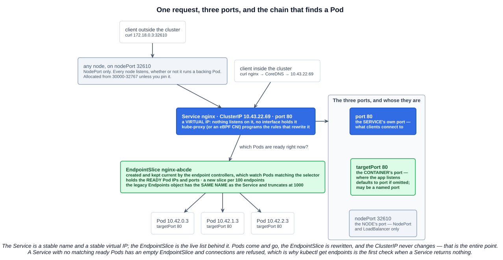
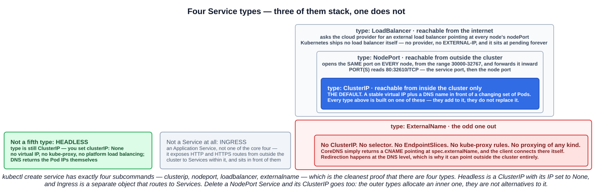
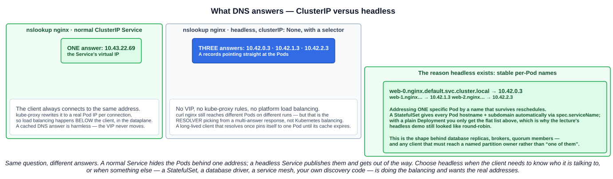

# 08 — Services

Chapter 02 left a loose end: **Pod IPs are ephemeral**. A Pod that is deleted and recreated gets a new address and nothing sends a memo. A Service is the fix — a stable name and a stable address in front of a set of Pods that keeps changing underneath.

> Expose an application running in your cluster behind a single outward-facing endpoint, even when the workload is split across multiple backends.

There are **four** Service types. Headless is not a fifth — it is a ClusterIP with its IP switched off. Ingress is not one either.

---

## 1. Creating one: `kubectl expose`

```bash
kubectl create deployment nginx --image=spurin/nginx-debug --port=80 --replicas=3
kubectl expose deployment/nginx
```

`expose` reads the Deployment and fills in the Service for you. Two things it copies, both worth understanding rather than memorizing:

- **The selector.** The Deployment's `spec.selector.matchLabels` (`app: nginx`) becomes the Service's `spec.selector`. That is the *only* link between them — a Service does not know what a Deployment is. It matches **Pods by label**, and would happily pick up Pods from a second Deployment, a bare Pod, or a StatefulSet if they carried the same labels.
- **The port.** The `--port=80` from the Deployment's container port becomes the Service's `port` and `targetPort`.

Check what it will make before making it:

```bash
kubectl expose deployment/nginx --dry-run=client -o yaml
```

```yaml
apiVersion: v1
kind: Service
metadata:
  labels:
    app: nginx
  name: nginx
spec:
  ports:
  - port: 80
    protocol: TCP
    targetPort: 80
  selector:
    app: nginx          # matches the Deployment's Pods
```

---

## 2. Endpoints and EndpointSlices

Create a Service and a second object appears beside it, with **the same name**:

```
$ kubectl get services
NAME         TYPE        CLUSTER-IP     EXTERNAL-IP   PORT(S)   AGE
kubernetes   ClusterIP   10.43.0.1      <none>        443/TCP   3m7s
nginx        ClusterIP   10.43.22.69    <none>        80/TCP    7s

$ kubectl get endpoints
NAME         ENDPOINTS                                   AGE
kubernetes   172.18.0.2:6443                             3m23s
nginx        10.42.0.3:80,10.42.1.3:80,10.42.2.3:80      23s
```

Those are the **Pod IPs and ports** of every *ready* Pod matching the selector, maintained automatically by the endpoint controllers. `kubectl describe service nginx` shows the same list.

This is the single most useful debugging fact about Services: **a Service with an empty endpoints list has no backends**, and connections to it fail. Cross-check with `kubectl get pods -o wide` — if the Pod IPs there do not appear in the endpoints, the selector does not match, or the Pods are not `Ready`.



### 2.1 EndpointSlice is the modern form

The study-tips page frames the chain as **Service → EndpointSlice → Pod**, and that is the current API:

| | Endpoints (v1) | EndpointSlice (discovery.k8s.io/v1) |
|---|---|---|
| Status | **Deprecated in v1.33** | **Stable since v1.21** — the one to use |
| Shape | One object, same name as the Service | **Many objects**, a new one per **100** endpoints |
| Limit | **Truncates at 1000** backing endpoints | No practical limit |
| Dual-stack | No | Yes |

```bash
kubectl get endpointslices
kubectl get endpointslice -l kubernetes.io/service-name=nginx -o yaml
```

`kubectl get endpoints` still works and is still the quicker thing to type, but the object behind modern kube-proxy and every serious controller is the EndpointSlice.

---

## 3. The three ports

The lecture's `80:32610/TCP` confuses everyone once. Three different ports belong to three different things:

| Field | Whose port | Notes |
|---|---|---|
| **`port`** | **The Service's** | What clients connect to |
| **`targetPort`** | **The container's** | Where the app actually listens. Defaults to `port` if omitted; can be a **named** port from the Pod spec |
| **`nodePort`** | **The node's** | NodePort and LoadBalancer only. From **30000-32767** unless pinned |

So in `PORT(S): 80:32610/TCP`, the **first is the Service port**, the **second is the node port**.

Using a *named* target port is the flexible version — the Service references the name, and the Pods can change their actual port numbers between versions without breaking it:

```yaml
# Service                        # Pod
ports:                           ports:
- port: 80                       - containerPort: 8080
  targetPort: http-web-svc         name: http-web-svc
```

---

## 4. The four types



The first three **stack**: a NodePort Service also gets a ClusterIP, and a LoadBalancer Service also gets a node port. They add to each other rather than replacing one another.

### 4.1 `ClusterIP` — the default

> Exposes the Service on a cluster-internal IP. Choosing this value makes the Service only reachable from within the cluster. This is the default that is used if you don't explicitly specify a `type` for a Service.

The lecture's framing: *the perfect Service for internal components such as APIs or database Services — not accessible outside the cluster.*

```bash
kubectl expose deployment/nginx                 # type defaults to ClusterIP
curl 10.43.22.69                                # from a node or another Pod
```

Repeat the `curl` and the `Hostname:` in the response changes — that is kube-proxy balancing across the endpoints. The ClusterIP itself is **virtual**: nothing listens on it and no interface holds it. It exists only as rules that rewrite the destination.

To reach one from your laptop, port-forward it (chapter 02):

```bash
kubectl port-forward service/nginx 8080:80      # then http://localhost:8080
```

### 4.2 `NodePort` — reachable from outside

> Exposes the Service on each Node's IP at a static port (the `NodePort`). To make the node port available, Kubernetes sets up a cluster IP address, the same as if you had requested a Service of `type: ClusterIP`.

```bash
kubectl expose deployment/nginx --type=NodePort
```
```
NAME    TYPE       CLUSTER-IP    EXTERNAL-IP   PORT(S)        AGE
nginx   NodePort   10.43.7.194   <none>        80:32610/TCP   8s
```
```bash
curl 172.18.0.3:32610                           # ANY node's IP, whether or not it runs a Pod
```

**Every node** opens that same port, including nodes with no backing Pod — they forward inward. Good for labs and on-prem clusters with an external load balancer in front; rarely what you want facing users, because clients need node IPs and the port is from a high, unmemorable range.

### 4.3 `LoadBalancer` — reachable from the internet

> Exposes the Service externally using an external load balancer. **Kubernetes does not directly offer a load balancing component; you must provide one**, or you can integrate your Kubernetes cluster with a cloud provider.

```bash
kubectl expose deployment/nginx --type=LoadBalancer --port 8080 --target-port 80
```
```
NAME    TYPE           CLUSTER-IP     EXTERNAL-IP                          PORT(S)          AGE
nginx   LoadBalancer   10.43.88.152   172.18.0.2,172.18.0.3,172.18.0.4     8080:30143/TCP   7s
```

That "you must provide one" is the exam point, and it connects back to the **cloud-controller-manager** from chapter 01: on a cloud provider its service controller sees the object and provisions a real load balancer. On a cluster with no provider and no bare-metal implementation like MetalLB, `EXTERNAL-IP` stays **`<pending>` forever**. Nothing is broken — nobody is listening.

The `EXTERNAL-IP` column varies: the lecture's lab lists all three node IPs, while a cloud load balancer usually shows one address or a hostname.

### 4.4 `ExternalName` — an alias, not a proxy

> Maps the Service to the contents of the `externalName` field (for example, to the hostname `api.foo.bar.example`). The mapping configures your cluster's DNS server to return a **CNAME** record with that external hostname value. **No proxying of any kind is set up.**

This is the one that needs a worked example, and the lecture's is a good one. Two Deployments serving different pages, each with an ordinary ClusterIP Service:

```bash
kubectl create deployment nginx-red  --image=spurin/nginx-red  --port 80
kubectl create deployment nginx-blue --image=spurin/nginx-blue --port 80
kubectl expose deployment/nginx-red
kubectl expose deployment/nginx-blue

kubectl create service externalname my-service --external-name nginx-red.default.svc.cluster.local
```

```
NAME         TYPE           CLUSTER-IP     EXTERNAL-IP                             PORT(S)
nginx-red    ClusterIP      10.43.238.29   <none>                                  80/TCP
nginx-blue   ClusterIP      10.43.5.203    <none>                                  80/TCP
my-service   ExternalName   <none>         nginx-red.default.svc.cluster.local     <none>
```

Note the shape: **no CLUSTER-IP, no PORT(S)**. There is nothing to proxy. From a Pod:

```
~ $ nslookup my-service
my-service.default.svc.cluster.local  canonical name = nginx-red.default.svc.cluster.local
Name:    nginx-red.default.svc.cluster.local
Address: 10.43.238.29

~ $ curl my-service        # red page
```

Edit the Service to point at `nginx-blue.default.svc.cluster.local`, and the same `curl my-service` returns the blue page. **The client never changed.** One field moved, and every consumer of that name followed.

That is the benefit: **an indirection layer in DNS**. Applications hard-code `my-service`, and you repoint it — to a different Deployment, to a managed database at `my.database.example.com`, to a service in another cluster — without touching a single client. As the docs put it, if you later move that database into the cluster you can start its Pods, add selectors, and just change the Service's `type`.

Two caveats worth carrying:

- **HTTP and HTTPS are awkward.** The hostname the client used (`my-service`) is not the name the CNAME points to, so the `Host:` header may be unrecognized by the origin and a TLS certificate will not match. Fine for protocols that do not care about hostnames; a real problem for web traffic.
- **It cannot take an IP.** An ExternalName that looks like an IPv4 address is treated as a DNS name made of digits and will not resolve. To map a Service to a fixed IP, use a headless Service or a Service without selectors and hand-written endpoints.

`kubectl create service` has **exactly four** subcommands — `clusterip`, `nodeport`, `loadbalancer`, `externalname` — which is the tidiest confirmation of how many types exist.

### 4.5 Comparison

| | ClusterIP | NodePort | LoadBalancer | ExternalName |
|---|---|---|---|---|
| Reachable from | Inside the cluster | Inside + **any node's IP** | Inside + **the internet** | Inside, via DNS only |
| Gets a ClusterIP | Yes | **Yes** (plus a node port) | **Yes** (plus a node port) | **No** |
| Has a selector | Yes | Yes | Yes | **No** |
| Has endpoints | Yes | Yes | Yes | **No** |
| kube-proxy involved | Yes | Yes | Yes | **No** |
| Needs infrastructure | No | No | **Yes — a cloud provider or MetalLB** | No |
| What it returns in DNS | The ClusterIP | The ClusterIP | The ClusterIP | **A CNAME** |

---

## 5. Headless Services

> Sometimes you don't need load-balancing and a single Service IP. In this case, you can create what are termed *headless Services*, by explicitly specifying `"None"` for the cluster IP address (`.spec.clusterIP`).

```yaml
apiVersion: v1
kind: Service
metadata:
  name: nginx
spec:
  type: ClusterIP        # still ClusterIP — this is not a fifth type
  clusterIP: None        # this is what makes it headless
  selector:
    app: nginx
  ports:
  - port: 80
    targetPort: 80
```

> For headless Services, a cluster IP is not allocated, **kube-proxy does not handle these Services**, and there is **no load balancing or proxying done by the platform** for them.

With a selector, the endpoint controllers still create EndpointSlices, and **DNS returns A records pointing directly at the Pods**.



### 5.1 Why `curl nginx` still hit different Pods

This is the lecture's confusing moment, and the answer matters.

`nslookup nginx` against a headless Service returns **three A records** — one per Pod. `curl` resolves the name, gets a list, and connects to one of them. Run it again, the resolver returns the list in a different order, and you land somewhere else. It **looks** like load balancing.

It is not. The difference:

| | Normal ClusterIP | Headless |
|---|---|---|
| DNS returns | One virtual IP | **All the Pod IPs** |
| Who balances | **kube-proxy**, per connection, below the client | **The client**, by picking from a DNS answer |
| A cached DNS result | Harmless — the VIP never moves | **Pins the client to one Pod** until the cache expires |
| A Pod dies | The VIP is unchanged; it is removed from the endpoints | The client may hold a dead address |

That last row is the practical consequence. A connection-pooling client — a JDBC pool, an HTTP client with keep-alive — resolves once at startup and then talks to that one Pod forever. With a normal ClusterIP that is fine. With a headless Service it is a load-distribution bug, unless the client is *designed* to re-resolve and spread across the answers.

### 5.2 What headless is actually for: stable per-Pod names

The real reason headless Services exist is the case you have at work — **addressing one specific Pod by a name that survives rescheduling**:

```
web-0.nginx.default.svc.cluster.local  → 10.42.0.3
web-1.nginx.default.svc.cluster.local  → 10.42.1.3
```

The mechanism is `spec.hostname` + `spec.subdomain` on the Pod: if a **headless Service exists in the same namespace with the same name as the subdomain**, DNS serves an A record for `<hostname>.<subdomain>.<ns>.svc.cluster.local`.

A **StatefulSet sets both automatically** from `spec.serviceName`, which is why the pattern is always described as "StatefulSet plus headless Service". With a plain Deployment — the lecture's setup — nothing sets `hostname`/`subdomain`, so you get only the flat list of A records and no per-Pod names. That is exactly why the demo looked like round-robin and your memory of `web-0.…` is attached to StatefulSets.

Which makes the use cases clear: database replicas where clients must reach the primary, brokers and quorum members that address each other by identity, and — as in your bulkhead work — routing to the instance that owns a particular partition. In every case the client needs to know *who* it is talking to, not just "one of them".

---

## 6. Service discovery and DNS

CoreDNS watches the API and creates a record for every Service. The form the exam wants:

```
<service>.<namespace>.svc.cluster.local
```

From the throwaway Pod in the lecture:

```
~ $ cat /etc/resolv.conf
search default.svc.cluster.local svc.cluster.local cluster.local
nameserver 10.43.0.10
options ndots:5
```

That `search` list is what makes the short names work, and it explains the `NXDOMAIN` lines in the lecture's `nslookup` output — the resolver tries each suffix in order, and the misses are printed before the hit.

| From | Use | Resolves because |
|---|---|---|
| Same namespace | `nginx` | First search suffix matches |
| Another namespace | `nginx.other-ns` | Second suffix completes it |
| Anywhere, unambiguously | `nginx.other-ns.svc.cluster.local` | Fully qualified |

Also worth knowing:

- **SRV records** exist for **named** ports: `_http._tcp.nginx.default.svc.cluster.local` returns the port number as well as the address.
- **Environment variables** are the other discovery mechanism — the kubelet injects `NGINX_SERVICE_HOST` and `NGINX_SERVICE_PORT` into Pods. The catch: **only for Services that already existed when the Pod started.** DNS has no such ordering problem, which is why it is the one to use.
- The **`kubernetes` Service in `default`** (chapter 04) is the same machinery pointed at the API server.

### 6.1 The throwaway test Pod

The command worth memorizing, straight from the lecture:

```bash
kubectl run -it --rm curl --image=curlimages/curl --restart=Never -- sh
```

`-it` attaches, `--rm` deletes the Pod on exit, `--restart=Never` makes it a Pod rather than something that restarts. You land in a shell **on the Pod network**, where `curl nginx`, `nslookup nginx` and `cat /etc/resolv.conf` all behave the way your application will.

Variants worth having:

```bash
kubectl run -it --rm curl --image=curlimages/curl --restart=Never -- curl -s nginx    # one shot
kubectl run -it --rm net --image=busybox:1.36 --restart=Never -- sh                   # nslookup, wget, ping
kubectl run -it --rm net --image=nicolaka/netshoot --restart=Never -- bash            # dig, tcpdump, the lot
```

---

## 7. Ingress is not a Service type

The lecture calls this out and so does the exam:

> Ingress is not considered one of the core Services — it is an **Application Service** which exposes HTTP and HTTPS routes from outside the cluster to Services within the cluster.

An Ingress is a separate object that sits **in front of** Services and routes by hostname and path, so one external address can serve many applications. It needs an **ingress controller** running in the cluster to do anything — the object on its own is inert, the same way a `LoadBalancer` Service is inert without a provider. The Gateway API is its successor. Both are Section 5 material.

If a question lists Service types and one of the options is `Ingress`, that option is wrong.

---

## Exam angle

- **There are four Service types:** `ClusterIP`, `NodePort`, `LoadBalancer`, `ExternalName`. **`Ingress` is not one** — it is an application-layer object that routes *to* Services. **Headless is not one either** — it is `type: ClusterIP` with `clusterIP: None`.
- **`ClusterIP` is the default** and is reachable **only from inside the cluster**. Exposing it externally takes an Ingress or a Gateway.
- **They stack.** A `NodePort` Service also has a ClusterIP; a `LoadBalancer` also has a node port. `PORT(S): 80:32610` is **service port : node port**, and node ports come from **30000-32767**.
- **`LoadBalancer` needs infrastructure.** Kubernetes ships no load balancer; without a cloud provider or something like MetalLB, `EXTERNAL-IP` stays `<pending>`.
- **`ExternalName` returns a CNAME and does no proxying.** No ClusterIP, no selector, no endpoints, no kube-proxy. It is a DNS alias, and repointing it redirects every client at once.
- **Services select Pods by label**, not by Deployment. **Endpoints/EndpointSlices hold the ready Pod IPs**, carry the same name as the Service (for Endpoints), and an **empty endpoints list means no backends** — the first thing to check when a Service returns nothing. The chain is **Service → EndpointSlice → Pod**; EndpointSlice is stable since **1.21** and Endpoints was **deprecated in 1.33**.
- **DNS name form:** `<service>.<namespace>.svc.cluster.local`. Short name within a namespace, `<service>.<namespace>` across namespaces.
- **Headless (`clusterIP: None`)**: no virtual IP, **kube-proxy does not handle it**, no platform load balancing; DNS returns the Pod IPs directly. Combined with a **StatefulSet** it gives stable per-Pod names like `web-0.nginx.default.svc.cluster.local`.
- **The three ports:** `port` is the Service's, `targetPort` is the container's, `nodePort` is the node's.

## References

- [Service](https://kubernetes.io/docs/concepts/services-networking/service/) — the four types, ports, headless Services and discovery
- [DNS for Services and Pods](https://kubernetes.io/docs/concepts/services-networking/dns-pod-service/) — record formats, SRV records, `hostname`/`subdomain` per-Pod names
- [EndpointSlices](https://kubernetes.io/docs/concepts/services-networking/endpoint-slices/) — the modern backing-endpoint API and how it scales
- [Connecting Applications with Services](https://kubernetes.io/docs/tutorials/services/connect-applications-service/) — the end-to-end walkthrough
