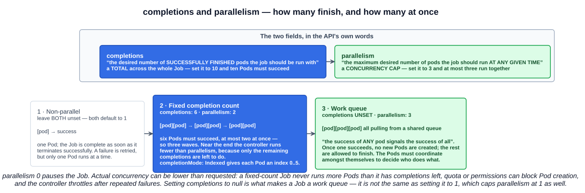
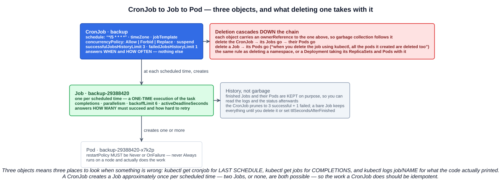

# 09 — Jobs and CronJobs

Every workload so far has been meant to run forever. A Deployment that stops is broken; a DaemonSet Pod that exits gets restarted. **Jobs are the opposite**: work that is supposed to finish, and a controller whose job is to notice that it did.

The lecture's framing: a **supervisor for Pods carrying out batch tasks** — it manages execution, tracks progress, and retries as required. A **CronJob** adds a clock in front of it.

---

## 1. What a Job is

A Job creates one or more Pods and **retries until a specified number of them terminate successfully**. When enough have succeeded, the Job is complete.

```bash
kubectl create job calculatepi --image=perl:5.34.0 -- perl -Mbignum=bpi -wle "print bpi(2000)"
kubectl get jobs
```
```
NAME          STATUS     COMPLETIONS   DURATION   AGE
calculatepi   Complete   1/1           22s        45s
```

`COMPLETIONS` reads **succeeded / wanted**, and `DURATION` is how long the work actually took — two columns no other workload has.

| | Deployment / DaemonSet | Job |
|---|---|---|
| The Pod is meant to | Run forever | **Run once and exit 0** |
| Exit code 0 means | Something went wrong — restart it | **Success** |
| `restartPolicy` | `Always` (default) | **`Never` or `OnFailure` only** |
| Finishes? | No | **Yes** — `Complete` or `Failed` |

That `restartPolicy` restriction is a hard rule and a favourite exam question:

> Only a `RestartPolicy` equal to `Never` or `OnFailure` is allowed.

`Always` is rejected at admission, because "restart it whenever it exits" and "run to completion" are contradictory instructions.

The two values differ in *where* the retry happens. With **`OnFailure`** the kubelet restarts the container inside the same Pod. With **`Never`** the Pod is left as `Failed` and the Job controller creates a **new Pod**. For debugging prefer `Never` — the docs point out that with `OnFailure` the Pod is deleted once the backoff limit is reached, taking your logs with it.

---

## 2. `completions` and `parallelism`

This is the pair the quiz asked about, and your reading of the documentation is the correct one. Straight from `kubectl explain job.spec`:

> **`completions`** — Specifies the desired number of **successfully finished pods** the job should be run with.
>
> **`parallelism`** — Specifies the maximum desired number of pods the job should run **at any given time**.

So `completions: 10` means **ten Pods must succeed in total**, and `parallelism: 3` means **at most three run concurrently**. One is a total, the other is a concurrency cap. They are independent, and a Job with `completions: 10, parallelism: 3` runs ten Pods three at a time.



### 2.1 The three Job patterns

The documentation names three, and which one you get depends entirely on whether `completions` is set:

| Pattern | Set | Behaviour |
|---|---|---|
| **Non-parallel** | Leave **both unset** — both default to `1` | One Pod; complete as soon as it terminates successfully. A failure is retried, but only one runs at a time |
| **Fixed completion count** | **`completions: N`**, optionally `parallelism: M` | Complete when there are **N successful Pods**, at most M at once |
| **Work queue** | **`completions` unset**, `parallelism: M` | *"When **any** Pod from the Job terminates with success, no new Pods are created."* The Pods coordinate among themselves over what to work on |

The `explain` text for `completions` describes all three in one sentence, which is why it reads oddly at first:

> Setting to **null** means that the success of **any** pod signals the success of all pods, and allows parallelism to have any positive value. Setting to **1** means that parallelism is limited to 1 and the success of that pod signals the success of the job.

Read as: **null = work queue**, **1 = non-parallel**, **N = fixed count**. Null and 1 are *not* the same thing — that is the trap.

### 2.2 Actual parallelism can be lower

Requested parallelism is a ceiling, not a promise:

- A **fixed-count** Job never runs more Pods than it has completions remaining, so the last wave is smaller. Setting `parallelism` higher than `completions` is effectively ignored.
- A **work queue** Job starts no new Pods once one has succeeded.
- Quota, missing permissions or a busy controller can all mean fewer Pods.
- **`parallelism: 0` pauses the Job** until you raise it.

### 2.3 Indexed Jobs

With a fixed completion count you can set `completionMode: Indexed` (stable since **1.24**) and each Pod gets an index from `0` to `completions-1`, exposed as the annotation/label `batch.kubernetes.io/job-completion-index` and in the Pod's hostname as `$(job-name)-$(index)`. The default is `NonIndexed`, where every completion is interchangeable.

Indexed is how you split a fixed workload — shard 0 through shard 9 — without a queue to coordinate through.

---

## 3. Failure handling

| Field | Default | What it does |
|---|---|---|
| **`backoffLimit`** | **`6`** | Retries before the Job is marked `Failed` |
| **`activeDeadlineSeconds`** | unset | Wall-clock limit for the **whole Job**; on expiry all running Pods are terminated and the Job fails with `reason: DeadlineExceeded` |
| **`ttlSecondsAfterFinished`** | unset | Delete the finished Job (and cascade to its Pods) this many seconds after it completes or fails. Stable since **1.23** |

Failed Pods are recreated with an exponential delay — **10s, 20s, 40s …, capped at six minutes**. Worth noting that is the *Job controller's* cap; the kubelet's `CrashLoopBackOff` cap from chapter 03 is five minutes. Different controllers, different limits.

Two rules about precedence and finality:

- **`activeDeadlineSeconds` beats `backoffLimit`.** A Job that hits its deadline stops creating Pods even with retries left.
- **A failed Job stays failed.** `restartPolicy` applies to the Pod, not the Job — there is no automatic Job restart once the status is `Failed`. It needs manual intervention.

### 3.1 Finished Jobs are kept on purpose

> When a Job completes, no more Pods are created, but the Pods are usually not deleted either. Keeping them around allows you to still view the logs of completed pods.

This surprises people who expect cleanup. A completed Job and its Pods sit there until you delete them — which is exactly what makes `kubectl logs job/calculatepi` work after the fact. `ttlSecondsAfterFinished` is how you automate the tidying.

---

## 4. CronJobs

A CronJob is a **time-based Job scheduler**: it uses the traditional Unix cron scheduling system to **create Job objects on a schedule**.

```yaml
apiVersion: batch/v1
kind: CronJob
metadata:
  name: calculatepi
spec:
  schedule: "* * * * *"
  jobTemplate:
    spec:
      template:
        spec:
          restartPolicy: OnFailure
          containers:
          - name: pi
            image: perl:5.34.0
            command: ["perl", "-Mbignum=bpi", "-wle", "print bpi(2000)"]
```

```bash
kubectl create cronjob calculatepi --image=perl:5.34.0 --schedule="* * * * *" \
  -- perl -Mbignum=bpi -wle "print bpi(2000)"
```

### 4.1 The schedule

Five fields, and the exam expects the order:

```
# ┌───────────── minute        (0 - 59)
# │ ┌───────────── hour        (0 - 23)
# │ │ ┌───────────── day of month (1 - 31)
# │ │ │ ┌───────────── month   (1 - 12)
# │ │ │ │ ┌───────────── day of week (0 - 6, Sunday to Saturday; or sun, mon, …)
# │ │ │ │ │
  * * * * *
```

| Expression | Means |
|---|---|
| `* * * * *` | Every minute |
| `*/5 * * * *` | Every five minutes — `*/n` is a step value |
| `0 3 * * 1` | Weekly, Monday at 03:00 |
| `0 0 1 * *` | Midnight on the first of the month |
| `30 2 * * 1-5` | 02:30 on weekdays |

Macros also work: **`@yearly`** (= `@annually`), **`@monthly`**, **`@weekly`**, **`@daily`** (= `@midnight`), **`@hourly`**. A `?` means the same as `*`.

**[crontab.guru](https://crontab.guru/)** is worth bookmarking — it renders any expression in plain English and shows the next few run times. It is not just a community tool; the Kubernetes documentation recommends it by name.

### 4.2 Time zone

Without `spec.timeZone`, schedules are interpreted in the **kube-controller-manager's local time zone** — which is whatever the control-plane node is set to, usually UTC, and not necessarily yours. Set it explicitly to remove the ambiguity:

```yaml
spec:
  schedule: "0 3 * * *"
  timeZone: "Etc/UTC"       # or "America/New_York"
```

`timeZone` has been stable since **1.27**.

---

## 5. The chain: CronJob → Job → Pod

Creating a CronJob does not create one object, it starts a chain.



| Object | Owns | Answers |
|---|---|---|
| **CronJob** | Jobs | **When** and **how often** |
| **Job** | Pods | **How many** must succeed, and how hard to retry |
| **Pod** | — | Actually runs the container |

```bash
kubectl get cronjobs     # SCHEDULE, SUSPEND, ACTIVE, LAST SCHEDULE, AGE
kubectl get jobs         # one per fired schedule, named <cronjob>-<timestamp>
kubectl get pods         # one per Job
kubectl logs job/calculatepi-29388420
```

That is also the debugging order: `LAST SCHEDULE` says whether the CronJob fired, `COMPLETIONS` says whether the Job finished, and the Pod's logs say what the code did.

### 5.1 History limits

Old Jobs do not accumulate forever. Two fields prune them, and their defaults are worth memorizing:

| Field | Default |
|---|---|
| **`successfulJobsHistoryLimit`** | **`3`** |
| **`failedJobsHistoryLimit`** | **`1`** |

So a CronJob running every minute keeps the last three successes and the last failure; everything older is deleted, Pods included. Setting either to `0` keeps none of that kind. This is why `kubectl get jobs` on a busy CronJob shows a handful of entries rather than hundreds.

### 5.2 `concurrencyPolicy`

What happens when the next schedule arrives and the previous Job is still running:

| Value | Behaviour |
|---|---|
| **`Allow`** | **The default.** Run them concurrently |
| **`Forbid`** | Skip the new run entirely |
| **`Replace`** | Kill the running Job and start the new one |

`Allow` is the wrong default for anything that touches shared state — a backup that overruns its window will happily start a second copy. The policy applies only within one CronJob; separate CronJobs never block each other.

### 5.3 The rest of the fields

- **`suspend: true`** stops future runs without deleting anything. Already-started Jobs keep going. Careful on unsuspend: missed schedules count as missed Jobs, and without a starting deadline they may all be scheduled at once.
- **`startingDeadlineSeconds`** — how late a missed run may still start. Unset means no deadline. Below **10 seconds** it may never fire at all, because the controller only checks every 10 seconds.
- If the controller is down long enough to miss **more than 100 schedules**, it gives up on catching up and logs `too many missed start times`. Setting `startingDeadlineSeconds` changes the window it counts over and avoids this.
- **Editing a CronJob affects only new Jobs.** Running Jobs and their Pods continue unchanged.
- A CronJob creates a Job **approximately** once per scheduled time — two Jobs, or none, are both possible — so **the work should be idempotent**.

---

## 6. Deletion cascades

The quiz point you got wrong is the general Kubernetes rule, and your instinct about namespaces is exactly the right analogy.

Every object created by a controller carries a **`metadata.ownerReferences`** entry pointing at its owner. Garbage collection follows those references, so deleting an owner deletes its dependents:

```bash
kubectl delete cronjob calculatepi    # → its Jobs → their Pods
kubectl delete job calculatepi        # → its Pods
```

The documentation says it plainly: *"When you delete the job using kubectl, all the pods it created are deleted too."*

It is the same mechanism you have already met several times:

| Delete this | And these go too |
|---|---|
| A **Namespace** | Every namespaced object inside it |
| A **Deployment** | Its ReplicaSets, and their Pods |
| A **DaemonSet** | Its Pods on every node |
| A **CronJob** | Its Jobs, and their Pods |
| A **Job** | Its Pods |

The escape hatch is `--cascade=orphan`, which deletes the owner and leaves the dependents running. Rarely what you want, occasionally what saves you.

---

## Exam angle

- **A Job runs to completion**; a Deployment runs forever. `COMPLETIONS` reads succeeded/wanted, and the Job ends as `Complete` or `Failed`.
- **`restartPolicy` in a Job's Pod template must be `Never` or `OnFailure`** — **`Always` is not allowed**. This is the single most-asked Job fact.
- **`completions` = how many Pods must finish successfully in total. `parallelism` = how many may run at once.** `completions: 10, parallelism: 3` means ten successes, three at a time. Leaving `completions` **null** makes it a work queue where **any** Pod's success completes the Job — not the same as setting it to 1.
- **Defaults:** `backoffLimit` **6**, both `completions` and `parallelism` **1** when unset, `concurrencyPolicy` **`Allow`**, `successfulJobsHistoryLimit` **3**, `failedJobsHistoryLimit` **1**.
- **`activeDeadlineSeconds` takes precedence over `backoffLimit`**, and a Job that has failed does not restart itself.
- **Finished Jobs and their Pods are kept deliberately** so you can read the logs. `ttlSecondsAfterFinished` cleans them up automatically.
- **A CronJob creates Job objects on a schedule** using standard Unix cron syntax — five fields, **minute hour day-of-month month day-of-week**. `*/5 * * * *` is every five minutes.
- **`concurrencyPolicy`:** `Allow` (default), `Forbid` (skip the new run), `Replace` (kill the old one).
- **Deleting a CronJob deletes its Jobs and their Pods.** Ownership cascades — the same rule as deleting a Namespace or a Deployment.

## References

- [Jobs](https://kubernetes.io/docs/concepts/workloads/controllers/job/) — the three parallel patterns, `backoffLimit`, termination and cleanup
- [CronJob](https://kubernetes.io/docs/concepts/workloads/controllers/cron-jobs/) — schedule syntax, concurrency policy, history limits, time zones
- [Automatic Cleanup for Finished Jobs](https://kubernetes.io/docs/concepts/workloads/controllers/ttlafterfinished/) — `ttlSecondsAfterFinished`
- [crontab.guru](https://crontab.guru/) — the schedule expression editor the Kubernetes docs recommend
