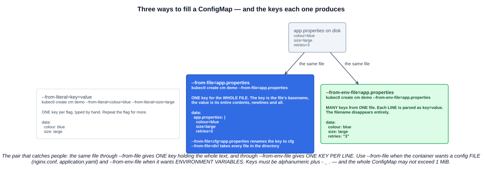
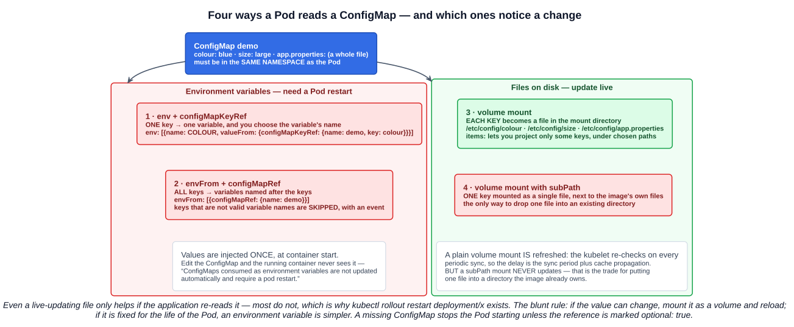

# 10 — ConfigMaps

The twelve-factor rule from chapter 02-02 was **store config in the environment**: one image, promoted unchanged from dev to prod, with everything environment-specific injected at run time. A ConfigMap is where Kubernetes keeps that configuration.

> Use a ConfigMap for setting configuration data separately from application code.

The documentation's own example is the shape of the whole idea: your code reads `DATABASE_HOST`; locally it is `localhost`, in the cluster it is a Service name. Same image, same binary, different value.

---

## 1. The object

A ConfigMap is unusual — **it has no `spec`**. It has `data` and `binaryData`:

```yaml
apiVersion: v1
kind: ConfigMap
metadata:
  name: demo
data:                       # UTF-8 strings
  colour: blue
  size: large
  app.properties: |         # a value can be a whole file
    retries=3
    timeout=30s
binaryData:                 # base64-encoded bytes
  logo.png: iVBORw0KGgo...
```

The rules worth knowing:

| Rule | Detail |
|---|---|
| **Size limit** | **1 MiB** for the data. Larger config belongs in a volume, a database or a file service |
| Name | Must be a valid **DNS subdomain name** |
| Keys | Must be **alphanumeric, `-`, `_` or `.`**, and `data` keys must not overlap `binaryData` keys |
| Namespace | The **Pod and the ConfigMap must be in the same namespace** |
| Static Pods | **Cannot reference a ConfigMap** — no API server in the loop (chapter 01) |

**A ConfigMap is not a Secret.** The values are stored in etcd as plain text and are visible to anyone who can `kubectl get configmap -o yaml`. Passwords, tokens and keys go in a Secret — which is the next chapter and, to be honest about it, is only base64-encoded rather than encrypted unless encryption at rest is turned on.

---

## 2. Creating one

### 2.1 Imperatively



**`--from-literal`** — one key per flag, typed by hand:

```bash
kubectl create configmap demo --from-literal=colour=blue --from-literal=size=large
```

**`--from-file`** — **one key for the whole file**. The key defaults to the file's basename and the value is its entire contents:

```bash
kubectl create configmap demo --from-file=app.properties            # key: app.properties
kubectl create configmap demo --from-file=cfg=app.properties        # key: cfg
kubectl create configmap demo --from-file=./config-dir/             # every file in the directory
```

Pointed at a directory, it packages **each file whose basename is a valid key**; subdirectories, symlinks and other non-regular files are ignored.

**`--from-env-file`** — **many keys from one file**, each line parsed as `key=value`:

```bash
kubectl create configmap demo --from-env-file=app.properties
```

### 2.2 The distinction that matters

The same `app.properties` through the two file flags produces completely different objects:

```
colour=blue
size=large
retries=3
```

| Flag | Result |
|---|---|
| `--from-file=app.properties` | **One key**, `app.properties`, whose value is the three-line text |
| `--from-env-file=app.properties` | **Three keys** — `colour`, `size`, `retries`. The filename is gone |

Which you want depends on what the container expects:

- The app reads a **config file** (`nginx.conf`, `application.yaml`, `my.cnf`) → **`--from-file`**, and mount it as a volume.
- The app reads **environment variables** → **`--from-env-file`**, and inject them with `envFrom`.

### 2.3 Declaratively

The imperative commands are for speed; the manifest is what belongs in git. Generate one rather than typing it:

```bash
kubectl create configmap demo \
  --from-literal=colour=blue \
  --from-file=app.properties \
  --dry-run=client -o yaml | tee demo-cm.yaml
```

```bash
kubectl apply -f demo-cm.yaml
```

`--append-hash` is worth knowing about: it appends a hash of the content to the name (`demo-9f8cbt2k4m`), so changing the data produces a *new object* with a new name. That is how Kustomize forces a rollout when config changes — the Deployment's template now references a different name, so it is a new pod template, so a new ReplicaSet.

---

## 3. Consuming one



### 3.1 One key as one environment variable

```yaml
env:
- name: COLOUR                      # the variable name is yours to choose
  valueFrom:
    configMapKeyRef:
      name: demo
      key: colour
      optional: true                # without this, a missing key stops the Pod starting
```

### 3.2 Every key as environment variables

```yaml
envFrom:
- configMapRef:
    name: demo
  prefix: APP_                      # optional: APP_COLOUR, APP_SIZE
```

The variables are named after the keys. **Keys that are not valid environment variable names are skipped** — which is exactly what happens to a key like `app.properties`, since a `.` is not legal in a shell variable name. Kubernetes records an event about it rather than failing.

### 3.3 Every key as a file

```yaml
volumes:
- name: config
  configMap:
    name: demo
containers:
- name: app
  volumeMounts:
  - name: config
    mountPath: /etc/config          # /etc/config/colour, /etc/config/size, /etc/config/app.properties
```

Each key becomes a file named after the key, containing the value. `items` narrows it to specific keys and lets you choose paths:

```yaml
    configMap:
      name: demo
      items:
      - key: app.properties
        path: application.properties    # mounted as /etc/config/application.properties
      defaultMode: 0440
```

### 3.4 One key as a single file, with `subPath`

A plain `mountPath` **replaces** the directory's contents. To drop one config file into a directory the image already populates, use `subPath`:

```yaml
  volumeMounts:
  - name: config
    mountPath: /etc/nginx/nginx.conf
    subPath: nginx.conf
```

### 3.5 In the command line

ConfigMap-derived environment variables can be referenced with `$(VAR_NAME)`:

```yaml
command: ["/bin/sh", "-c", "echo running in $(COLOUR) mode"]
```

---

## 4. What happens when the ConfigMap changes

This is the part that decides which consumption method to pick.

| Method | Updates when the ConfigMap changes? |
|---|---|
| `env` / `envFrom` | **No.** *"ConfigMaps consumed as environment variables are not updated automatically and require a pod restart"* |
| Volume mount | **Yes**, eventually |
| Volume mount with **`subPath`** | **No.** *"A container using a ConfigMap as a subPath volume mount will not receive ConfigMap updates"* |

For a volume mount, the kubelet re-checks freshness **on every periodic sync**, reading from its local cache. So the total delay is the **kubelet sync period plus cache propagation delay** — seconds to a minute or so, not instant.

Two consequences:

- **A live-updating file only helps if the application re-reads it.** Most do not; they parse config once at startup. That is what `kubectl rollout restart deployment/x` (chapter 05) is for — it replaces every Pod as a proper rolling update so the new values are picked up.
- **`subPath` trades updates for placement.** If you need both, mount the whole directory and use a symlink, or accept the restart.

The blunt rule: **if the value can change while the Pod runs, mount it as a volume and have the app reload. If it is fixed for the life of the Pod, an environment variable is simpler.**

---

## 5. Immutable ConfigMaps

The `immutable` field became available in **v1.19** and the feature is **stable since v1.21**:

```yaml
apiVersion: v1
kind: ConfigMap
metadata:
  name: demo
data:
  colour: blue
immutable: true
```

Two stated advantages:

- **Protection from accidental updates** that could cause an application outage.
- **Cluster performance** — the kube-apiserver can **close its watches** for ConfigMaps marked immutable. The docs frame this for clusters with "at least tens of thousands of unique ConfigMap to Pod mounts", so the performance argument is a scale argument, not an everyday one.

The catch, and the exam point: **it cannot be undone.**

> Once a ConfigMap is marked as immutable, it is *not* possible to revert this change nor to mutate the contents of the `data` or the `binaryData` field. You can only delete and recreate the ConfigMap.

And because existing Pods keep a mount point to the deleted object, the docs recommend recreating those Pods too. Combined with `--append-hash`, immutability is the versioned-config pattern: never edit, always create a new named object and roll the Deployment onto it.

---

## 6. Missing references

By default, a Pod that references a ConfigMap or key that does not exist **will not start** — it sits in `CreateContainerConfigError` (chapter 03). `optional: true` changes that to "carry on without it":

```yaml
envFrom:
- configMapRef:
    name: maybe-missing
    optional: true
```

Failing fast is usually right for required configuration. `optional` is for genuinely optional overrides.

---

## Exam angle

- **A ConfigMap stores non-confidential configuration data as key-value pairs**, so the same image runs in every environment. It has **`data` and `binaryData`, not a `spec`**, and is limited to **1 MiB**.
- **It is not a Secret.** Values are plain text in etcd and readable with `kubectl get -o yaml`.
- **The three creation flags.** `--from-literal=k=v` (one key per flag) · **`--from-file`** (**one key per file**, key = basename, value = the whole file; a directory takes every file) · **`--from-env-file`** (**one key per line** of a `key=value` file). The `--from-file` versus `--from-env-file` contrast is the likely question.
- **Four ways to consume one:** `env` + `configMapKeyRef` (one key), `envFrom` + `configMapRef` (all keys), a **volume mount** (each key becomes a file), and a volume mount with **`subPath`** (one key as one file).
- **Volume mounts update automatically; environment variables do not** and need a Pod restart. **`subPath` mounts do not update either.**
- **The Pod and the ConfigMap must be in the same namespace**, and **static Pods cannot reference one**.
- **`immutable: true`** protects against accidental change and lets the API server close its watches. **It cannot be reverted** — delete and recreate is the only way.
- **A missing ConfigMap prevents the Pod from starting** unless the reference sets **`optional: true`**.

## References

- [ConfigMaps](https://kubernetes.io/docs/concepts/configuration/configmap/) — the object, the 1 MiB limit, auto-update behaviour and immutability
- [Configure a Pod to Use a ConfigMap](https://kubernetes.io/docs/tasks/configure-pod-container/configure-pod-configmap/) — every consumption pattern with worked examples
- [kubectl create configmap](https://kubernetes.io/docs/reference/kubectl/generated/kubectl_create/kubectl_create_configmap/) — `--from-literal`, `--from-file`, `--from-env-file`, `--append-hash`
- [Twelve-Factor App — Config](https://12factor.net/config) — the principle underneath all of this
