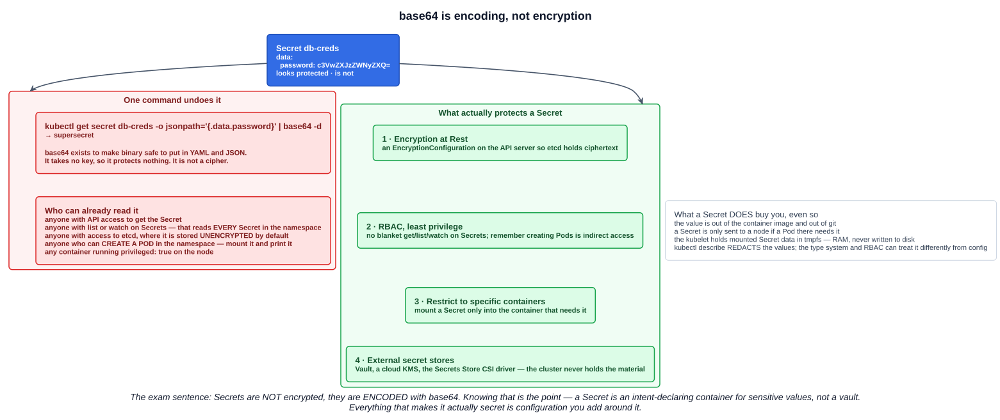
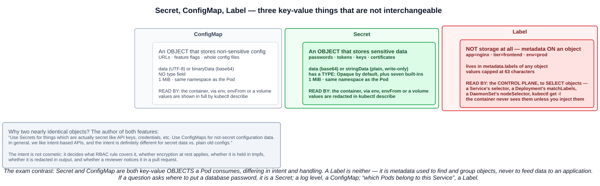

# 11 — Secrets

A Secret is the object for **passwords, tokens, keys** — anything you would not want baked into a container image or committed to git. Structurally it is a ConfigMap with a different name and a `type` field.

The single most important thing the KCNA wants you to know about it is what it is **not**.

---

## 1. Secrets are encoded, not encrypted

The study-tips page leads with it, and so does the Kubernetes documentation:

> Kubernetes Secrets are, **by default, stored unencrypted** in the API server's underlying data store (etcd). Anyone with API access can retrieve or modify a Secret, and so can anyone with access to etcd. Additionally, **anyone who is authorized to create a Pod in a namespace can use that access to read any Secret in that namespace**; this includes indirect access such as the ability to create a Deployment.

The `data` values are **base64**. Base64 is a transport encoding — it makes arbitrary bytes safe to put inside YAML and JSON. It takes no key, so it conceals nothing:

```bash
kubectl create secret generic db-creds --from-literal=password=supersecret
kubectl get secret db-creds -o jsonpath='{.data.password}' | base64 -d     # supersecret
```



### 1.1 What actually protects a Secret

The documentation's own list, in order:

| Layer | What it does |
|---|---|
| **1. Encryption at Rest** | An `EncryptionConfiguration` on the API server, so etcd stores ciphertext rather than base64 |
| **2. RBAC, least privilege** | No blanket `get`/`list`/`watch` on Secrets. Granting **`list` or `watch` reads every Secret in the namespace**, not just the ones a Pod references |
| **3. Restrict to specific containers** | Mount a Secret only into the container that needs it |
| **4. External secret stores** | Vault, a cloud KMS, or the Secrets Store CSI driver — the cluster never holds the material |

Also worth knowing: **any container running `privileged: true` on a node can access all Secrets used on that node.**

### 1.2 What a Secret does buy you

Being honest about base64 does not make Secrets pointless. Even with no extra configuration:

- The value is **out of the image and out of git** — the twelve-factor win.
- A Secret is **only sent to a node if a Pod on that node requires it**.
- For volume mounts, the kubelet stores the data in **`tmpfs`** — RAM, never written to durable storage — and deletes its copy when the Pod goes.
- **`kubectl describe` redacts the values.** `kubectl get -o yaml` does not.
- The distinct object type means RBAC, admission policies, encryption at rest and code review can all treat it differently from ordinary config.

---

## 2. Secret versus ConfigMap versus Label

The study-tips page asks for this three-way comparison, and the third item is the interesting one.



| | Secret | ConfigMap | Label |
|---|---|---|---|
| What it is | **An object holding sensitive data** | **An object holding non-sensitive config** | **Metadata on an object** — not storage |
| Fields | `data` (base64), `stringData` (plain) | `data` (UTF-8), `binaryData` (base64) | `metadata.labels` |
| Has a `type` | **Yes** — `Opaque` by default | **No** | n/a |
| Size limit | **1 MiB** | **1 MiB** | 63 characters per value |
| Read by | The container — `env`, `envFrom`, volume | The container — same three ways | **The control plane, to select objects** |
| Shown by `describe` | **Redacted** | In full | In full |
| Use for | Passwords, tokens, keys, certificates | URLs, feature flags, config files | `app=nginx`, `tier=frontend` |

**A Label is not a place to put data.** Labels are how the control plane *finds* things: a Service's `selector`, a Deployment's `matchLabels`, a DaemonSet's `nodeSelector`, `kubectl get -l`. The container never sees them unless you deliberately inject them with the downward API.

As for why two nearly identical objects exist, the author of both features answered it directly:

> Use **Secrets** for things which are actually secret like API keys, credentials, etc. Use **ConfigMaps** for not-secret configuration data. […] In general, we like **intent-based APIs**, and the intent is definitely different for secret data vs. plain old configs.

The intent is not cosmetic. It decides which RBAC rule covers the object, whether encryption at rest applies, whether the kubelet keeps it in tmpfs, whether the value is redacted in output — and whether a reviewer notices it in a pull request.

---

## 3. Secret types

The study tips single this out, so it is worth memorizing the table. **Eight built-in types:**

| Type | Usage | Required keys |
|---|---|---|
| **`Opaque`** | **Arbitrary user-defined data — the DEFAULT** when no type is specified | none |
| `kubernetes.io/service-account-token` | ServiceAccount token | — |
| `kubernetes.io/dockercfg` | Serialized `~/.dockercfg` | `.dockercfg` |
| `kubernetes.io/dockerconfigjson` | Serialized `~/.docker/config.json` | `.dockerconfigjson` |
| `kubernetes.io/basic-auth` | Basic authentication credentials | `username`, `password` |
| `kubernetes.io/ssh-auth` | SSH credentials | `ssh-privatekey` |
| **`kubernetes.io/tls`** | **Data for a TLS client or server** | **`tls.crt`, `tls.key`** |
| `bootstrap.kubernetes.io/token` | Bootstrap token data | — |

Points that get asked:

- **`Opaque` is the default.** An empty string for `type` is treated as `Opaque` too, and `kubectl create secret generic` produces one.
- The type is there **to facilitate programmatic handling** — the API server validates that the required keys exist, and controllers know where to look.
- You can **invent your own type** by setting any non-empty string. The convention for a public one is a domain prefix: `cloud-hosting.example.net/cloud-api-credentials`.

In `kubectl get secrets`, `TYPE` is a column and `DATA` is the **number of key-value pairs**, not their size:

```
NAME          TYPE                 DATA   AGE
db-creds      Opaque               1      10s
my-site-tls   kubernetes.io/tls    2      23s
```

---

## 4. Creating Secrets

`kubectl create secret` has **three** subcommands, matching the three most common types:

```bash
# generic → Opaque
kubectl create secret generic db-creds --from-literal=username=admin --from-literal=password=supersecret
kubectl create secret generic ssh-key --from-file=ssh-privatekey=~/.ssh/id_rsa
kubectl create secret generic app-env --from-env-file=app.env

# docker-registry → kubernetes.io/dockerconfigjson
kubectl create secret docker-registry regcred \
  --docker-server=registry.example.com --docker-username=me --docker-password=pw

# tls → kubernetes.io/tls
kubectl create secret tls my-site-tls --cert=tls.crt --key=tls.key
```

The `--from-literal`, `--from-file` and `--from-env-file` flags behave **exactly as they do for ConfigMaps** (chapter 10), including the distinction that `--from-file` makes one key holding a whole file while `--from-env-file` makes one key per line.

### 4.1 `data` versus `stringData`

In a manifest you have two options:

```yaml
apiVersion: v1
kind: Secret
metadata:
  name: db-creds
type: Opaque
data:
  password: c3VwZXJzZWNyZXQ=     # you base64-encode it yourself
stringData:
  username: admin                # Kubernetes encodes it for you
```

- **`data`** takes **base64-encoded** strings.
- **`stringData`** takes **plain strings** and is **write-only** — Kubernetes merges it into `data` on save, and reading the object back shows only `data`. If a key appears in both, **`stringData` wins**.

`stringData` is far more pleasant to write and review, but be clear-eyed: a `stringData` value in a manifest is a plaintext credential in a file. That is exactly why sealed-secrets, SOPS and external secret operators exist.

Keys in both fields must be **alphanumeric, `-`, `_` or `.`**, the name must be a valid **DNS subdomain**, and the whole Secret is limited to **1 MiB**.

---

## 5. Consuming Secrets

The same four ways as a ConfigMap, plus one that is unique to Secrets.

**All keys as environment variables** — what the lecture demonstrates:

```yaml
envFrom:
- secretRef:
    name: db-creds
```

**One key as one environment variable:**

```yaml
env:
- name: DB_PASSWORD
  valueFrom:
    secretKeyRef:
      name: db-creds
      key: password
      optional: false        # the default — a missing Secret stops the Pod starting
```

**As files:**

```yaml
volumes:
- name: creds
  secret:
    secretName: db-creds
    defaultMode: 0400        # tighter than a ConfigMap's default is good practice
containers:
- volumeMounts:
  - name: creds
    mountPath: /etc/creds
    readOnly: true
```

**As an image pull Secret** — the one with no ConfigMap equivalent:

```yaml
spec:
  imagePullSecrets:
  - name: regcred
```

That is how a Pod pulls from a private registry, and it fixes the `ErrImagePull … unauthorized` case from chapter 03. It can also be attached automatically by adding it to the Pod's **ServiceAccount**.

The update rules from chapter 10 carry over unchanged: **volume mounts refresh, environment variables do not, `subPath` mounts do not.** And as with ConfigMaps, the **Pod and the Secret must be in the same namespace**, and a **static Pod cannot reference one**.

### 5.1 Immutable Secrets

Identical to ConfigMaps — `immutable: true`, **stable since v1.21**, protects against accidental updates and lets the kubelet drop its watch. **It cannot be reverted**; delete and recreate is the only route, and the Pods that mounted it should be recreated too.

---

## 6. Further study: TLS Secrets

`kubernetes.io/tls` exists mainly as a **standard convention**, so that components — especially Ingress and Gateway controllers — know exactly where to find a certificate and its key without extra configuration.

A TLS Secret holds:

| Key | Contents |
|---|---|
| **`tls.crt`** | The server certificate, PEM-encoded |
| **`tls.key`** | The private key, PEM-encoded |
| `ca.crt` (optional) | A CA bundle, for client auth and mTLS chains |

```bash
# a throwaway self-signed pair
openssl req -x509 -nodes -newkey rsa:2048 -keyout tls.key -out tls.crt -days 365 -subj "/CN=example.com"

kubectl create secret tls my-site-tls --cert=tls.crt --key=tls.key
kubectl get secret my-site-tls                          # TYPE kubernetes.io/tls, DATA 2

# and it is still just base64 underneath
kubectl get secret my-site-tls -o jsonpath='{.data.tls\.crt}' | base64 -d | openssl x509 -noout -subject -dates
```

The documentation is candid that the type is **provided only for convenience** — an `Opaque` Secret would hold the same bytes. What you get by using the declared type is that the API server **verifies the required keys are set**, and every controller that consumes certificates knows to look for `tls.crt` and `tls.key`.

An Ingress references it by name:

```yaml
spec:
  tls:
  - hosts: ["example.com"]
    secretName: my-site-tls
```

### 6.1 cert-manager

Hand-rolling certificates does not scale, and certificates expire. **cert-manager** is the CNCF project that automates it: it watches `Certificate` custom resources, obtains and renews the certificates from an issuer (Let's Encrypt, Vault, a private CA), and **writes the result into a `kubernetes.io/tls` Secret** — which is exactly the format the Ingress controller already expects.

The TLS Secret is cert-manager's output format. That is the whole reason a standard type is worth having.

---

## Exam angle

- **Secrets are NOT encrypted — they are ENCODED with base64.** By default they are stored **unencrypted in etcd**, and `base64 -d` reverses the encoding in one command. This is the most likely Secret question on the paper.
- **What makes them safe is configuration you add:** encryption at rest, RBAC least privilege, restricting them to specific containers, and external secret stores. Note that **anyone who can create a Pod in a namespace can read any Secret in it**.
- **`Opaque` is the default type** when none is specified. The other built-ins to recognize: `kubernetes.io/service-account-token`, `dockercfg`, `dockerconfigjson`, `basic-auth`, `ssh-auth`, **`kubernetes.io/tls`**, `bootstrap.kubernetes.io/token`.
- **`kubernetes.io/tls` requires `tls.crt` and `tls.key`.** Created with `kubectl create secret tls --cert= --key=`, and consumed by Ingress via `secretName`. **cert-manager** writes into this format.
- **Secret vs ConfigMap:** same shape, different **intent** — sensitive versus non-sensitive. Secrets have a `type`, are redacted in `describe`, are held in `tmpfs` when mounted, and are only sent to nodes that need them. **Neither is a Label** — labels are metadata used to *select* objects, not to store data.
- **`data` is base64; `stringData` is plaintext and write-only**, merged into `data` on save, and wins on a key conflict.
- **Consumption is the same four ways as a ConfigMap** — `secretKeyRef`, `envFrom` + `secretRef`, a volume, and `subPath` — plus **`imagePullSecrets`** for private registries. Volume mounts update; environment variables do not.
- **1 MiB limit**, same-namespace rule, and **`immutable: true` cannot be reverted**.

## References

- [Secrets](https://kubernetes.io/docs/concepts/configuration/secret/) — the types table, the base64 caution, information security for Secrets
- [Good practices for Kubernetes Secrets](https://kubernetes.io/docs/concepts/security/secrets-good-practices/) — encryption at rest, least privilege, external providers
- [Encrypting Confidential Data at Rest](https://kubernetes.io/docs/tasks/administer-cluster/encrypt-data/) — what turns base64 in etcd into ciphertext
- [cert-manager](https://cert-manager.io/docs/) — automating TLS Secrets
