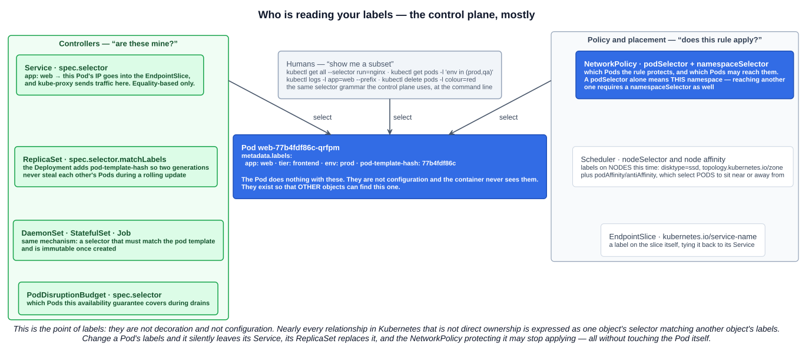
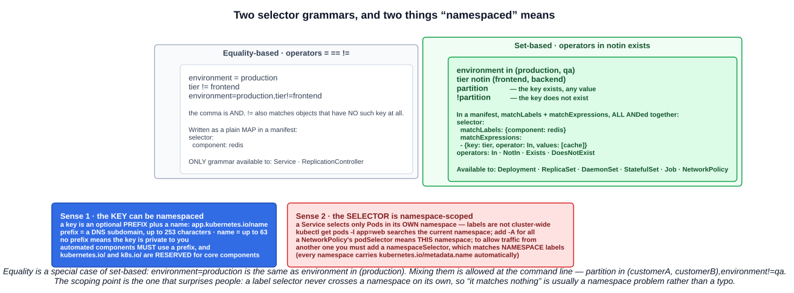

# 12 — Labels and Selectors

Labels have appeared in almost every chapter of this section without being explained. A Service finds its Pods with one. A ReplicaSet owns its Pods with one. A DaemonSet picks its nodes with one. This chapter is the mechanism underneath all of it.

> Labels are key/value pairs that are attached to objects such as Pods. Labels are intended to be used to specify **identifying attributes** of objects that are meaningful and relevant to users, but **do not directly imply semantics to the core system**. Labels can be used to **organize and to select subsets of objects**.

That last sentence is the whole chapter: **organize, and select**.

---

## 1. What labels are not

Two contrasts clear up most confusion.

**A label is not configuration.** The container never sees it. Labels are metadata *about* the object, read by other objects — as chapter 11 put it, a Secret or ConfigMap feeds data *into* an application, while a label helps the control plane *find* the application.

**A label is not an annotation.** Both are key-value maps in `metadata`, and the difference is the only thing that matters about them:

| | Label | Annotation |
|---|---|---|
| Purpose | **Identifying** attributes | **Non-identifying** arbitrary metadata |
| **Selectable** | **Yes** — this is the entire point | **No** — you cannot select on annotations |
| Size | Value **≤ 63 characters** | Large values are fine |
| Typical contents | `app: web`, `env: prod`, `tier: frontend` | Build IDs, checksums, tool state, `kubernetes.io/change-cause` |

If you want to *find* objects by it, it is a label. If you just want to *record* something, it is an annotation. The `kubernetes.io/change-cause` from chapter 05 is an annotation precisely because nothing ever selects on it.

---

## 2. Syntax rules

A label **key** has two parts — an optional prefix and a required name, separated by `/`:

```
app.kubernetes.io/name
└────── prefix ──────┘└name┘
```

| Part | Rule |
|---|---|
| **Name** (required) | **≤ 63 characters**; begins and ends with an alphanumeric; may contain `-`, `_`, `.` |
| **Prefix** (optional) | A **DNS subdomain**, **≤ 253 characters** total, followed by `/` |
| **Value** | **≤ 63 characters**, **may be empty**; if not empty, begins and ends with an alphanumeric; may contain `-`, `_`, `.` |

Two rules about prefixes that the exam likes:

- **If the prefix is omitted, the key is presumed private to the user.** Your own `app: web` needs no prefix.
- **Automated components must specify a prefix**, and **`kubernetes.io/` and `k8s.io/` are reserved for Kubernetes core components.** That is why the scheduler writes `kubernetes.io/hostname` and the Deployment controller writes `pod-template-hash` — the latter without a prefix for historical reasons.

```yaml
apiVersion: v1
kind: Pod
metadata:
  name: label-demo
  labels:
    environment: production
    app: nginx
```

---

## 3. What labels actually do — the internal machinery

This is the part worth internalizing, because it is how Kubernetes is wired together. **Almost every relationship that is not direct ownership is a selector matching a label.**



| Who selects | Field | What it decides |
|---|---|---|
| **Service** | `spec.selector` | Which Pods' IPs go into the EndpointSlice, and therefore where kube-proxy sends traffic |
| **ReplicaSet** (via Deployment) | `spec.selector.matchLabels` | Which Pods it owns and counts. The Deployment injects **`pod-template-hash`** so two generations never claim each other's Pods mid-rollout |
| **DaemonSet, StatefulSet, Job** | `spec.selector` | Same mechanism. In all of these the selector **must match the pod template's labels** and is **immutable after creation** |
| **NetworkPolicy** | `podSelector`, `namespaceSelector` | Which Pods the rule protects, and which Pods may reach them |
| **Scheduler** | `nodeSelector`, node affinity | Which **nodes** a Pod may run on — labels on Nodes rather than Pods |
| **Scheduler** | `podAffinity`, `podAntiAffinity` | Which **Pods** to sit near or away from, per a `topologyKey` |
| **PodDisruptionBudget** | `spec.selector` | Which Pods the availability guarantee covers during a drain |
| **EndpointSlice** | `kubernetes.io/service-name` label | Ties the slice back to its Service |
| **You** | `kubectl -l` | Any command, filtered to a subset |

The consequence is worth stating bluntly: **relabel a running Pod and it silently changes hands.** Remove `app: web` and it drops out of the Service's endpoints, its ReplicaSet sees one fewer replica and creates a replacement, and the NetworkPolicy protecting it may stop applying. Nothing about the Pod itself changed.

That is also a legitimate debugging technique — pull a misbehaving Pod out of a Service to inspect it live while its replacement takes the traffic:

```bash
kubectl label pod web-77b4fdf86c-qrfpm app=web-quarantined --overwrite
```

### 3.1 The lecture's demonstration

Three identical Pods, distinguished only by a `colour` label:

```bash
YAML=$(kubectl run --image=ubuntu ubuntu -o yaml --dry-run=client --command sleep infinity)
echo -e "${YAML}\n---\n${YAML}\n---\n${YAML}" | tee coloured_pods.yaml
# edit each document: name ubuntu-red/green/pink, and add colour: red/green/pink
kubectl apply -f coloured_pods.yaml
```

```bash
kubectl get pods --show-labels
kubectl get pods -l colour=red
kubectl get pods -l 'colour in (red,pink)'
kubectl delete pods -l colour=pink
```

Note the shell trick in that first line too: capturing a generated manifest in a variable and echoing it three times with `---` separators is the same multi-document idea as chapter 02's `{ cat a; echo "---"; cat b; }`.

And the one from the terminal capture, which shows why selectors beat names:

```bash
kubectl get all --selector run=nginx
```

That returns the Pod **and** the Service, because `kubectl run` and `kubectl expose` both stamped `run=nginx` on what they created. One selector, every related object, across kinds.

---

## 4. Selectors

Two grammars. The exam contrasts them, and which one you can use depends on the object.



### 4.1 Equality-based — `=`, `==`, `!=`

```
environment = production
tier != frontend
environment=production,tier!=frontend
```

`=` and `==` are synonyms. The comma is **AND**. One subtlety: **`!=` also matches objects that have no such key at all** — `tier != frontend` selects everything that is not frontend *plus* everything with no `tier` label.

In a manifest this is a plain map:

```yaml
selector:
  component: redis
```

**Service and ReplicationController support only this grammar.** That is a real limitation, not trivia — you cannot write a Service that targets `env in (prod, staging)`.

### 4.2 Set-based — `in`, `notin`, `exists`

```
environment in (production, qa)
tier notin (frontend, backend)
partition            # the key exists, any value
!partition           # the key does not exist
```

In a manifest, `matchLabels` and `matchExpressions`, with everything **ANDed** together:

```yaml
selector:
  matchLabels:
    component: redis
  matchExpressions:
  - {key: tier, operator: In, values: [cache]}
  - {key: environment, operator: NotIn, values: [dev]}
```

Operators are **`In`, `NotIn`, `Exists`, `DoesNotExist`**. `In` and `NotIn` require a non-empty `values` list; `Exists` and `DoesNotExist` take no values.

**Job, Deployment, ReplicaSet, DaemonSet, StatefulSet and NetworkPolicy support set-based requirements.**

Equality is just a special case: `environment=production` is identical to `environment in (production)`. At the command line the two can be mixed:

```bash
kubectl get pods -l 'partition in (customerA, customerB),environment!=qa'
```

---

## 5. "Labels are namespaced" — both senses

The study-tips page flags this, and it means two different things that are both worth knowing.

### 5.1 The key can be namespaced

That is the **prefix** from section 2: `app.kubernetes.io/name` is the `name` key in the `app.kubernetes.io` namespace. It exists so that a tool's labels cannot collide with yours, and `kubernetes.io/` is reserved for the core.

### 5.2 The selector is namespace-scoped

**A label selector never crosses a namespace on its own.** Labels are not cluster-wide identifiers:

- A **Service** in `team-a` selects only Pods in `team-a`, even if `team-b` has Pods with identical labels.
- **`kubectl get pods -l app=web`** searches the current namespace. Add **`-A`** for every namespace.
- A **NetworkPolicy**'s `podSelector` means *this namespace*. To allow traffic from another namespace you must add a **`namespaceSelector`**, which matches labels on the **Namespace object** rather than on Pods:

```yaml
ingress:
- from:
  - namespaceSelector:
      matchLabels:
        kubernetes.io/metadata.name: team-b    # every Namespace gets this label automatically
    podSelector:
      matchLabels:
        app: client
```

Written as two items in one `from` entry (as above) it means *Pods labelled `app: client` **in** namespace `team-b`*. Written as two separate list items it would mean *any Pod in `team-b`* **or** *any Pod labelled `app: client` in this namespace* — a much wider rule. That distinction is a classic KCSA question and worth seeing once now.

The practical takeaway: when a selector "matches nothing", check the namespace before you check the spelling.

---

## 6. The recommended labels

Kubernetes defines a set of common labels under the `app.kubernetes.io` prefix so that tools — dashboards, Helm, operators — can understand applications they did not deploy:

| Label | Meaning |
|---|---|
| `app.kubernetes.io/name` | The application's name |
| `app.kubernetes.io/instance` | A unique name for this instance of it |
| `app.kubernetes.io/version` | The current version |
| `app.kubernetes.io/component` | The component within the architecture |
| `app.kubernetes.io/part-of` | The higher-level application this belongs to |
| `app.kubernetes.io/managed-by` | The tool managing it — `helm`, `kustomize` |

Nothing enforces these, and a plain `app: web` works fine. They matter when other tools have to make sense of your objects.

The lecture's closing point stands on its own: **a thoughtful labelling strategy is what makes a cluster administrable.** Scoping by `environment`, grouping by `team`, and tagging by `app` is what lets you answer "what is running in production for team A" with one command instead of a spreadsheet.

---

## Exam angle

- **Labels are key/value pairs used to identify and select subsets of objects.** They are **metadata**, not configuration — the container never reads them. They **do not directly imply semantics to the core system**.
- **Labels vs annotations:** labels are **identifying and selectable**; annotations are **non-identifying and cannot be selected on**. A label value is capped at **63 characters**.
- **Labels + selectors are how Kubernetes wires itself together.** A **Service** finds Pods with `spec.selector`; a **ReplicaSet** owns Pods with `matchLabels`; a **NetworkPolicy** applies with `podSelector`; the **scheduler** places Pods with `nodeSelector` and affinity. Relabel a Pod and it changes hands.
- **Two selector grammars.** **Equality-based** (`=`, `==`, `!=`) — the **only** kind **Service** and **ReplicationController** support. **Set-based** (`in`, `notin`, `exists`, `!key`; `In`/`NotIn`/`Exists`/`DoesNotExist` in YAML) — supported by **Deployment, ReplicaSet, DaemonSet, StatefulSet, Job and NetworkPolicy** via `matchLabels` + `matchExpressions`. The comma is always **AND**.
- **Key syntax:** optional **prefix** (a DNS subdomain, ≤253 chars) plus a **name** (≤63 chars). **`kubernetes.io/` and `k8s.io/` are reserved**, and automated components must use a prefix.
- **Selectors are namespace-scoped.** A Service selects only Pods in its own namespace; `kubectl -l` searches the current one unless you add `-A`; a NetworkPolicy needs a **`namespaceSelector`** to reach another namespace, and that matches labels on the **Namespace object**.
- **A controller's selector must match its pod template's labels and is immutable** once the object exists.

## References

- [Labels and Selectors](https://kubernetes.io/docs/concepts/overview/working-with-objects/labels/) — syntax, both selector grammars, which APIs support which
- [Annotations](https://kubernetes.io/docs/concepts/overview/working-with-objects/annotations/) — the non-selectable counterpart
- [Recommended Labels](https://kubernetes.io/docs/concepts/overview/working-with-objects/common-labels/) — the `app.kubernetes.io` set
- [Well-Known Labels, Annotations and Taints](https://kubernetes.io/docs/reference/labels-annotations-taints/) — every reserved key and what writes it
