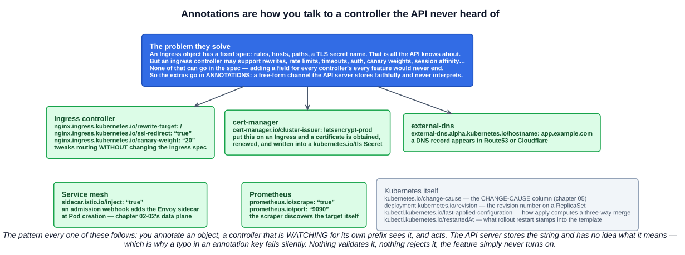
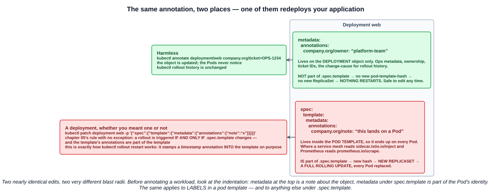

# 13 — Annotations

Chapter 12 introduced annotations as the thing labels are *not*. This chapter is the other half: what they are for, and why almost every real cluster is held together by them.

> You can use Kubernetes annotations to attach arbitrary **non-identifying** metadata to objects. Clients such as **tools and libraries** can retrieve this metadata.

Two words carry the definition. **Non-identifying** — annotations never take part in selection. **Tools and libraries** — annotations exist to be read by something other than Kubernetes itself.

---

## 1. Where they live

Annotations sit beside labels in `metadata`, on any object that has one — Pods, Deployments, Services, Ingresses, ConfigMaps, Secrets, Namespaces, Nodes:

```yaml
apiVersion: v1
kind: Pod
metadata:
  name: my-pod
  labels:
    app: web                              # selectable
  annotations:
    company.org/owner: "platform-team"    # not selectable
    company.org/ticket: "OPS-1234"
spec:
  ...
```

---

## 2. Annotations versus labels

Same shape, opposite purpose.

| | Labels | Annotations |
|---|---|---|
| **Purpose** | **Identify and select** — grouping | **Extra metadata and hints** |
| **Used by the Kubernetes API** | **Yes**, for filtering | **No — never query-selectable** |
| Typical content | Stable identity keys: `app`, `tier`, `env` | Controller hints, build info, ownership |
| **Value limit** | **63 characters** | **256 KiB total across all annotations on the object** |
| Value character set | Restricted — alphanumeric start/end, `-`, `_`, `.` | **No restrictions at all** |
| Structured values | No | **Yes** — JSON, YAML, whitespace, anything |

The **key** syntax is identical to labels: an optional **prefix** that must be a DNS subdomain (≤253 characters), a `/`, then a **name** of ≤63 characters. **`kubernetes.io/` and `k8s.io/` are reserved** for core components, and automated tooling must use a prefix.

Three details worth holding onto:

- **Keys and values must both be strings.** You cannot write `replicas: 3` or `enabled: true` as an annotation value — it has to be `"3"` and `"true"`. That is why every annotation example is quoted.
- **The 256 KiB limit is a total**, covering all keys and values on one object combined, not a per-annotation cap.
- Binary data should be **base64-encoded** first.

The size difference explains the split neatly. A label value is capped at 63 characters because it is an *index key* — it has to be cheap to match against, millions of times. An annotation can be a quarter of a megabyte of JSON because nothing ever matches on it.

---

## 3. What annotations are used for

### 3.1 Build information and ownership

The least glamorous and most immediately useful: who owns this, where did it come from, what shipped it.

```yaml
metadata:
  annotations:
    company.org/owner: "platform-team"
    company.org/ticket: "OPS-1234"
    company.org/git-commit: "a3f9c1e"
    company.org/slack: "#platform-oncall"
```

At 3am, `kubectl describe deployment web` telling you who to page is worth a great deal. This is also what the documentation means by *"phone or pager numbers of persons responsible"* and *"pointers to logging, monitoring, analytics, or audit repositories"*.

### 3.2 Operational metadata

You have already used one: **`kubernetes.io/change-cause`** from chapter 05, which populates the `CHANGE-CAUSE` column of `kubectl rollout history`. It is an annotation precisely because nothing selects on it — it exists to be read by a human later.

Kubernetes itself writes several:

| Annotation | Written by | Purpose |
|---|---|---|
| `kubernetes.io/change-cause` | You | The `CHANGE-CAUSE` column |
| `deployment.kubernetes.io/revision` | Deployment controller | The revision number on each ReplicaSet — the thing that renumbers on rollback (chapter 05) |
| `kubectl.kubernetes.io/last-applied-configuration` | `kubectl apply` | The previous manifest, so `apply` can compute a three-way merge |
| `kubectl.kubernetes.io/restartedAt` | `kubectl rollout restart` | A timestamp stamped into the pod template to force a rollout |
| `endpoints.kubernetes.io/over-capacity` | Endpoints controller | Marks a truncated Endpoints object (chapter 08) |

### 3.3 Controller configuration — the big one

This is what the study-tips page singles out, and it is the pattern worth genuinely understanding.



An **Ingress** object has a fixed spec: rules, hosts, paths, a TLS secret name. That is everything the Kubernetes API knows about ingress. But an ingress *controller* may support URL rewrites, rate limits, timeouts, authentication, canary weights, session affinity, custom headers — dozens of features, all different between NGINX, Traefik, HAProxy and the cloud providers.

None of that can go in the spec. Adding an API field for every controller's every feature would never end, and would bake one vendor's model into the core API.

So the extras go in **annotations** — a free-form channel the API server stores faithfully and never interprets:

```yaml
metadata:
  annotations:
    nginx.ingress.kubernetes.io/rewrite-target: /
    nginx.ingress.kubernetes.io/ssl-redirect: "true"
    cert-manager.io/cluster-issuer: letsencrypt-prod
    external-dns.alpha.kubernetes.io/hostname: app.example.com
```

The pattern is always the same: **you annotate an object; a controller watching for its own prefix sees it and acts.** Four examples that between them cover most clusters:

| Annotation | Who reads it | Effect |
|---|---|---|
| `nginx.ingress.kubernetes.io/*` | The NGINX ingress controller | Tweaks routing without changing the Ingress spec |
| `cert-manager.io/cluster-issuer` | cert-manager (chapter 11) | Obtains and renews a certificate into a `kubernetes.io/tls` Secret |
| `external-dns.alpha.kubernetes.io/hostname` | external-dns | Creates the DNS record in Route53, Cloudflare, etc. |
| `sidecar.istio.io/inject: "true"` | An Istio admission webhook | Injects the Envoy sidecar at Pod creation |
| `prometheus.io/scrape: "true"` | Prometheus service discovery | Makes the Pod a scrape target |

The consequence of "the API server never interprets it" is worth stating plainly: **a typo in an annotation key fails silently.** Nothing validates it, nothing rejects it, the feature simply never turns on and there is no error anywhere. `nginx.ingress.kubernetes.io/rewrite-targets` (plural) is a perfectly valid annotation that does absolutely nothing.

### 3.4 Triggering behaviour

The fourth use is the one that bites, and it is not really a feature of annotations at all — it is chapter 05's rule meeting chapter 12's metadata.



A Deployment manifest has **two** `metadata` blocks, and where you put an annotation decides whether anything restarts:

```yaml
apiVersion: apps/v1
kind: Deployment
metadata:
  name: web
  annotations:
    company.org/owner: "platform-team"    # on the DEPLOYMENT — harmless
spec:
  template:
    metadata:
      annotations:
        company.org/note: "this lands on a Pod"   # in the POD TEMPLATE — triggers a rollout
```

Recall the rule from chapter 05: *a rollout is triggered **if and only if** the Deployment's Pod template (`.spec.template`) is changed.* The template's annotations **are part of the template**, so changing one changes the `pod-template-hash`, which means a new ReplicaSet, which means every Pod is replaced.

| Where | Effect |
|---|---|
| `metadata.annotations` | Updates the object. **Nothing restarts.** No new revision |
| `spec.template.metadata.annotations` | **New ReplicaSet, new revision, full rolling update** |

Both behaviours are legitimate — and Kubernetes relies on the second deliberately. **`kubectl rollout restart` works by stamping `kubectl.kubernetes.io/restartedAt` into the pod template**, precisely to force a rollout without changing the image. It is also the standard trick for making Pods pick up a changed ConfigMap (chapter 10): annotate the template with a checksum of the config, and every config change becomes a rollout.

The hazard is doing it by accident. Adding an ownership note to what you thought was harmless metadata, at the wrong indentation, redeploys production. Before annotating a workload, look at where the block sits.

---

## 4. Working with them

```bash
kubectl annotate deployment/web company.org/owner="platform-team"
kubectl annotate deployment/web company.org/owner="sre-team" --overwrite   # required to change an existing key
kubectl annotate deployment/web company.org/owner-                         # trailing hyphen REMOVES it
kubectl annotate pods --all company.org/reviewed="2026-09-26"

kubectl describe pod web-abc | grep -A5 Annotations
kubectl get pod web-abc -o jsonpath='{.metadata.annotations}' | python -m json.tool
```

Two things `kubectl` does *not* offer, both following from the definition:

- **There is no `--annotation-selector`.** You cannot filter by annotation the way `-l` filters by label. To find objects by an annotation you have to fetch them and filter client-side:

```bash
kubectl get pods -o json | jq -r '.items[] | select(.metadata.annotations."company.org/owner"=="platform-team") | .metadata.name'
```

- **There is no `--show-annotations`.** `--show-labels` has no counterpart, because annotations can be 256 KiB and would destroy the output.

If you ever find yourself wanting to select on an annotation, that is the signal it should have been a label.

---

## Exam angle

- **Annotations attach arbitrary non-identifying metadata to objects**, meant to be read by **tools and controllers**. They live in **`metadata.annotations`**, beside labels.
- **Annotations are NOT selectable.** No selector, no `-l`, no `matchLabels`, no controller ever picks objects by annotation. That is the whole difference from a label. If a question asks how a Service finds its Pods, the answer is labels — annotations is the distractor.
- **Size and character set:** a label value is capped at **63 characters** with a restricted character set; annotation values have **no character restrictions** and may hold structured data, with a **256 KiB total** across all annotations on one object. **Keys and values must both be strings.**
- **Key syntax is identical to labels:** optional prefix (DNS subdomain ≤253) plus a name (≤63), with **`kubernetes.io/` and `k8s.io/` reserved**.
- **The main real-world use is signalling external controllers** — Ingress controllers tweak routing behaviour through annotations without changing the Ingress spec; cert-manager, external-dns, service meshes and Prometheus all work this way. The API server stores the string and never interprets it, so **a mistyped annotation key fails silently**.
- **`kubernetes.io/change-cause`** populates `kubectl rollout history`. Other core annotations: `deployment.kubernetes.io/revision`, `kubectl.kubernetes.io/last-applied-configuration`, `kubectl.kubernetes.io/restartedAt`.
- **An annotation in a Deployment's pod template triggers a rollout**, because `.spec.template` changed. One in the Deployment's own `metadata` does not. `kubectl rollout restart` exploits this deliberately.

## References

- [Annotations](https://kubernetes.io/docs/concepts/overview/working-with-objects/annotations/) — the definition, syntax, and what belongs in one
- [Labels and Selectors](https://kubernetes.io/docs/concepts/overview/working-with-objects/labels/) — the selectable counterpart
- [Well-Known Labels, Annotations and Taints](https://kubernetes.io/docs/reference/labels-annotations-taints/) — every reserved key and what writes it
- [NGINX Ingress Controller annotations](https://kubernetes.github.io/ingress-nginx/user-guide/nginx-configuration/annotations/) — the canonical example of a controller configured entirely through annotations
