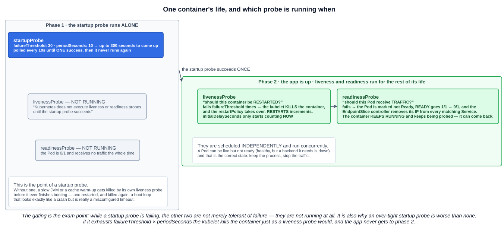
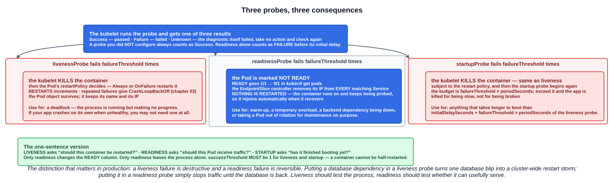

# 14 — Startup, Liveness and Readiness Probes

> Kubernetes lets you define **probes** to continuously monitor the health of containers in a Pod. A probe is a diagnostic performed periodically by the **kubelet** on a container. To perform a diagnostic, the kubelet either executes code within the container or makes a network request.

Chapter 03 established that a container lives as long as its main process. Probes are the answer to the obvious follow-up: **a process can be running and useless.** A JVM in a deadlock, a worker that has lost its database connection, an app still loading a 4 GB model — all "running", none serving.

Three probes, three different questions:

| Probe | Asks | If it fails |
|---|---|---|
| **`startupProbe`** | **Has the app finished starting?** | The container is **killed** and restarted |
| **`livenessProbe`** | **Should this container be restarted?** | The container is **killed** and restarted |
| **`readinessProbe`** | **Should this Pod receive traffic?** | The Pod is marked **not Ready** and pulled from Service endpoints — **nothing restarts** |

---

## 1. Check mechanisms

Every probe defines **exactly one** of four mechanisms.

| Mechanism | Succeeds when |
|---|---|
| **`httpGet`** | An HTTP GET against the Pod's IP returns a status **≥ 200 and < 400** |
| **`exec`** | A command run inside the container exits **0** |
| **`tcpSocket`** | A TCP connection to the port **opens** (an immediate close still counts as healthy) |
| **`grpc`** | A gRPC health check returns status **`SERVING`** |

`httpGet` is the default choice for anything with an HTTP surface. `exec` is the flexible one — and the docs carry a warning worth heeding: **`exec` forks a process on every check**, so on a node with high Pod density and short `periodSeconds` it adds real CPU overhead. Prefer `httpGet` or `tcpSocket` where you can.

One point the lecture makes and that saves time: the *mechanism* is independent of the *probe type*. The YAML under `startupProbe`, `livenessProbe` and `readinessProbe` is the same schema, so an example for one can be pasted under another and adjusted.

---

## 2. Configuration fields

All five apply to all three probes. The defaults are exam material.

| Field | Default | Meaning |
|---|---|---|
| **`initialDelaySeconds`** | **0** | Wait this long after the container starts before the first probe. **If a startup probe is defined, liveness and readiness delays do not begin until the startup probe has succeeded** |
| **`periodSeconds`** | **10** | How often to probe. Minimum 1 |
| **`timeoutSeconds`** | **1** | How long to wait for a response. Minimum 1 — and 1 second is aggressive for a JVM health endpoint |
| **`successThreshold`** | **1** | Consecutive successes needed after a failure. **Must be 1 for liveness and startup probes** |
| **`failureThreshold`** | **3** | Consecutive failures before the check is considered failed |
| `terminationGracePeriodSeconds` | inherits the Pod's (30) | Grace period between the kill signal and forcing the runtime to stop the container |

Two behaviours worth knowing:

- **A probe you did not configure always counts as `Success`.** No liveness probe means the container is never restarted for health reasons.
- **Readiness alone counts as `Failure` before its initial delay** — so a Pod with a readiness probe starts out *not* ready and receives no traffic until the probe passes. That is exactly the intent.

A probe result is `Success`, `Failure`, or **`Unknown`** — the last meaning the diagnostic itself failed, in which case the kubelet takes no action and tries again.

---

## 3. The interaction — this is the exam point

The study-tips page flags it specifically: **probe checks are scheduled independently, and can be delayed or gated depending on which probes are present.**



> Startup probes verify whether the application within a container is started. **If a startup probe is configured, Kubernetes does not execute liveness or readiness probes until the startup probe succeeds**, allowing the application time to finish its initialization.
>
> This type of probe is **only executed at startup**, unlike liveness and readiness probes, which are run periodically.

So the lifecycle is two phases:

**Phase 1 — the startup probe runs alone.** Liveness and readiness are not merely tolerant of failure, they are **not running at all**. The Pod is `0/1` and receives no traffic. The startup probe polls until it succeeds **once**, and then never runs again for the life of the container.

**Phase 2 — liveness and readiness run concurrently**, independently, for the rest of the container's life. `initialDelaySeconds` on those probes only starts counting now.

### 3.1 Why this matters, especially for a JVM

Without a startup probe, a slow-starting app has to fit inside its liveness probe's tolerance. If a Spring Boot service takes 90 seconds to come up and the liveness probe allows `initialDelaySeconds: 10 + failureThreshold: 3 × periodSeconds: 10` = 40 seconds, the kubelet kills it at 40 seconds. It restarts, gets killed at 40 seconds again, and you have a **boot loop that looks exactly like a crash** but is really a misconfigured timeout.

The historical workaround was a huge `initialDelaySeconds` on the liveness probe — which "fixes" startup at the cost of leaving the app unmonitored for 90 seconds *every* restart, including after it is warm. A startup probe gives you a long budget **once**, and then hands over to a tight liveness probe.

The docs state the rule directly:

> If your container usually starts in more than `initialDelaySeconds + failureThreshold × periodSeconds`, you should specify a **startup probe that checks the same endpoint as the liveness probe**. You should then set its `failureThreshold` high enough to allow the container to start, **without changing the default values of the liveness probe**.

### 3.2 Sizing one

The startup budget is **`failureThreshold × periodSeconds`**:

```yaml
startupProbe:
  httpGet: {path: /healthz, port: 8080}
  failureThreshold: 30
  periodSeconds: 10        # 30 × 10 = 300 seconds of grace
```

Pick a number comfortably above your worst observed cold start — a cold JIT, an empty page cache, a busy node. Being generous costs nothing in the healthy case, because the probe stops the moment it first succeeds.

The failure mode cuts the other way too: **an over-tight startup probe is worse than none.** Exhaust `failureThreshold × periodSeconds` and the kubelet kills the container exactly as a liveness probe would — the app is killed for being slow, not for being broken.

---

## 4. What each failure actually does



### 4.1 Liveness — destructive

> If a container fails its liveness probe more times than the configured tolerance, the kubelet **restarts that container**.

The container is killed and the Pod's `restartPolicy` takes over. `RESTARTS` increments, and repeated failures produce `CrashLoopBackOff` (chapter 03). The **Pod object survives** — same name, same IP.

Its proper use is a **deadlock**: the process is running but cannot make progress, so nothing short of a restart will help. And the docs make a point people miss:

> If the process in your container is able to crash on its own whenever it encounters an issue, **you do not necessarily need a liveness probe**; the kubelet will automatically perform the correct action in accordance with the Pod's `restartPolicy`.

### 4.2 Readiness — reversible

> If the readiness probe returns a failed state, the **EndpointSlice controller removes the Pod's IP address from the EndpointSlices of all Services** that match the Pod.

This is the direct link to chapter 08. The Pod is marked not Ready, **`READY` goes `1/1` → `0/1`**, and its IP leaves every matching Service's EndpointSlice. **Nothing is restarted** — the container keeps running and keeps being probed, so it rejoins automatically when it recovers.

> Readiness probes run on the container during its **whole lifecycle**.

That last point is the one that surprises people: readiness is not just a startup gate. It is a continuous "am I able to serve right now" signal, which is what makes it useful for temporary overload, a warm-up after a cache flush, or deliberately taking a Pod out of rotation.

### 4.3 The anti-pattern worth one paragraph

**Do not put external dependencies in a liveness probe.** If `/healthz` checks the database and the database blips, every Pod fails liveness simultaneously, every container is killed, and you have turned a brief database outage into a cluster-wide restart storm — which makes recovery *slower*, because the whole fleet is cold-starting against a struggling database.

The docs' own guidance splits it correctly:

> When your app has a strict dependency on back-end services, you can implement both a liveness and a readiness probe. The **liveness probe passes when the app itself is healthy**, but the **readiness probe additionally checks that each required back-end service is available**.

**Liveness tests the process. Readiness tests whether it can usefully serve.** A Pod that is live but not ready is not a bug — it is the correct state for a healthy app whose dependency is down.

---

## 5. Seeing them work

Probes are quiet by design, as the lecture notes:

```
$ kubectl describe pod my-app
Events:
  Warning  Unhealthy  Liveness probe failed: HTTP 503
```

**Events show failures, not the steady stream of successes.** There is no "probe succeeded" event, so a working probe is invisible.

```bash
kubectl describe pod probe-demo | grep -A15 Events
kubectl get pod probe-demo                     # the READY column is the readiness probe's verdict
kubectl get pod probe-demo -o jsonpath='{.status.conditions}' | python -m json.tool
kubectl get endpoints my-service               # a not-ready Pod's IP is absent
```

The `Conditions` block from chapter 03 is where readiness lands: `ContainersReady` and `Ready` go `False` while a readiness probe is failing, with `Initialized` and `PodScheduled` still `True`.

### 5.1 The chaos demo app

The lecture uses a purpose-built image — [`spurin/readiness-liveness-startup-probe-api`](https://github.com/spurin/readiness-liveness-startup-probe-api) — that **logs every probe request** and lets you inject failures with environment variables:

| Variable | Effect |
|---|---|
| `STARTUP_DELAY` | Seconds before `/startup` starts succeeding |
| `READY_DELAY` | Seconds before `/ready` starts succeeding |
| `HEALTHZ_CHAOS_FREQUENCY` | Make `/healthz` fail every Nth call |
| `HEALTHZ_PERMANENT_FAILURE_THRESHOLD` | Make `/healthz` fail permanently after N calls |

That turns an invisible mechanism into something you can watch:

```
16:54:21 - Healthz probe failed permanently after reaching threshold of 10 calls: consecutive_failures:7
16:54:21 - Ready probe successful: consecutive_success:14
...
Warning  Unhealthy  Startup probe failed: HTTP probe failed with statuscode: 500
Warning  Unhealthy  Readiness probe failed: HTTP probe failed with statuscode: 500
Warning  Unhealthy  Liveness probe failed: HTTP probe failed with statuscode: 500
Normal   Killing    Container probe-demo failed liveness probe, will be restarted
```

Read that transcript carefully and the whole model is in it: startup failing first and alone, readiness and liveness only appearing after it passed, then liveness crossing its threshold and triggering `Killing` while readiness kept succeeding independently.

---

## Exam angle

- **Three probes, three questions.** **Startup** — has the app finished starting? **Liveness** — should this container be **restarted**? **Readiness** — should this Pod receive **traffic**?
- **The startup probe gates the other two.** While it is running, **liveness and readiness are not executed at all**. It runs **only at startup**, stops after its first success, and their `initialDelaySeconds` only begins counting once it passes.
- **Liveness failure kills and restarts the container** (per `restartPolicy`, incrementing `RESTARTS`). **Readiness failure restarts nothing** — it marks the Pod not Ready and the EndpointSlice controller removes its IP from matching Services.
- **Readiness controls the `READY` column.** A failing readiness probe is why you see **`0/1` instead of `1/1`**.
- **Startup failure kills the container too**, exactly like liveness.
- **Four mechanisms, exactly one per probe:** `httpGet` (**200–399**), `exec` (**exit 0**), `tcpSocket` (**port opens**), `grpc` (**`SERVING`**).
- **Defaults:** `initialDelaySeconds` **0**, `periodSeconds` **10**, `timeoutSeconds` **1**, `successThreshold` **1**, `failureThreshold` **3**. **`successThreshold` must be 1 for liveness and startup.**
- **An unconfigured probe always counts as Success**; a readiness probe counts as **Failure** before its initial delay.
- **Events show probe failures, never successes.**

## References

- [Liveness, Readiness, and Startup Probes](https://kubernetes.io/docs/concepts/workloads/pods/probes/) — mechanisms, every configuration field, and when to use each
- [Pod Lifecycle — Container probes](https://kubernetes.io/docs/concepts/workloads/pods/pod-lifecycle/#container-probes) — what each probe does on failure
- [Configure Liveness, Readiness and Startup Probes](https://kubernetes.io/docs/tasks/configure-pod-container/configure-liveness-readiness-startup-probes/) — worked examples of all four mechanisms
- [spurin/readiness-liveness-startup-probe-api](https://github.com/spurin/readiness-liveness-startup-probe-api) — the course's chaos-testing demo app
