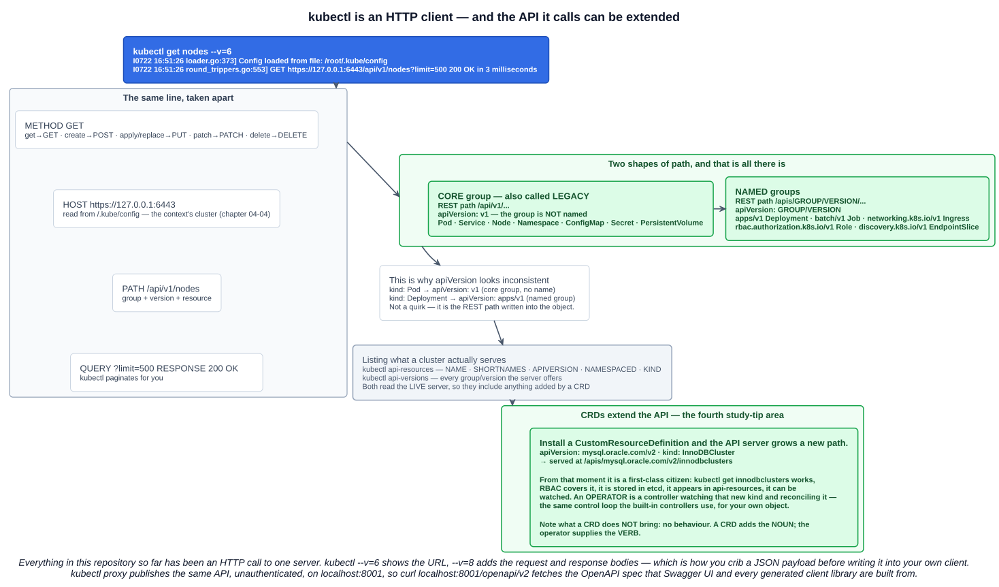
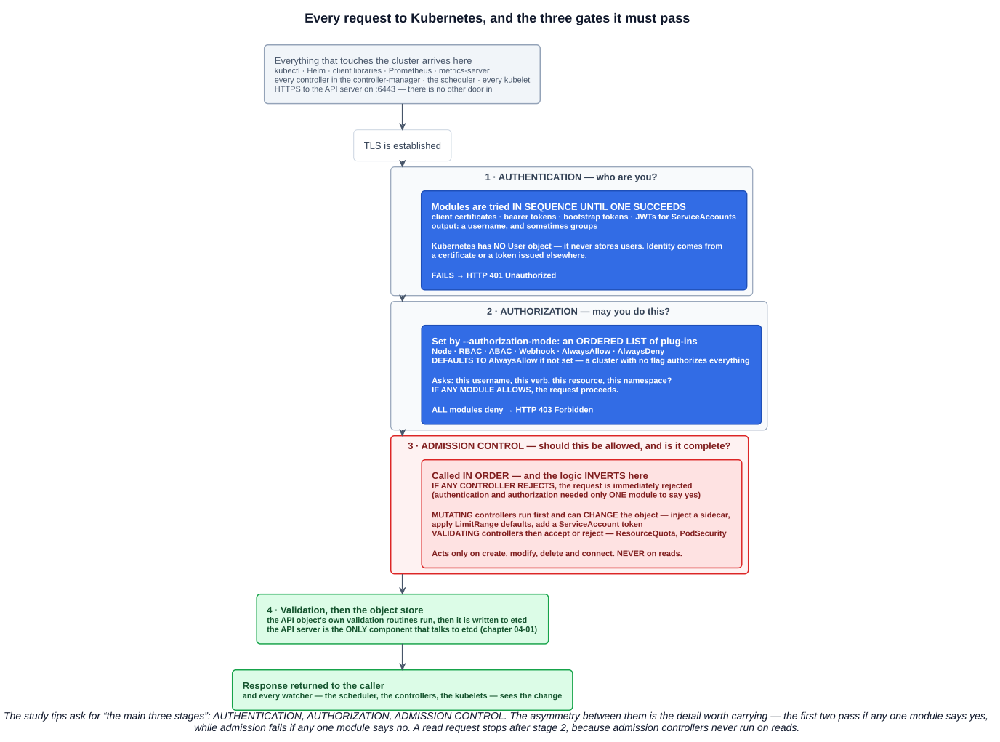
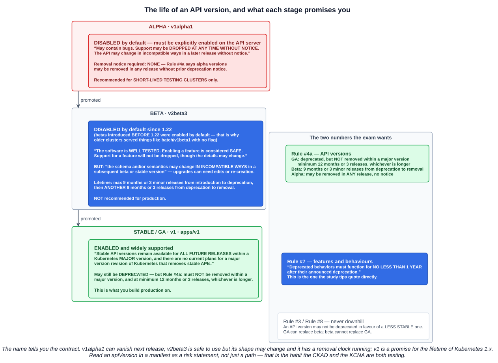

# 01 — The Kubernetes API

Section 4 built up the objects. This section takes them apart, and it starts in the right place: **the API is the cluster.** Every chapter so far has been an HTTP request to one server.

> The Kubernetes API is the **primary interface** through which users and system components interact with a cluster. It is a **RESTful API** providing operations to create, read, update and delete resources such as Pods, Services and volumes.

Chapter 04-01 put it as a design rule: **every component talks only to the API server, and only the API server talks to etcd.** This chapter is that server from the outside.

---

## 1. Everything is a client

There is no second door into a Kubernetes cluster. The list of things making HTTPS calls to `:6443`:

| Client | What it does |
|---|---|
| **kubectl** | Every command you have run in this repository |
| **Helm** | Renders charts and applies the objects |
| **Client libraries** | `client-go`, `fabric8`/`client-java`, Python, and the operators built on them |
| **Prometheus, metrics-server** | Discover targets and read metrics through the API |
| **Every controller** | Watches for objects and writes back status |
| **The scheduler** | Watches unbound Pods, writes `nodeName` |
| **Every kubelet** | Reads its PodSpecs, reports status |

That uniformity is the design. A controller is not privileged over kubectl — it is another authenticated client making the same REST calls.

---

## 2. kubectl is a wrapper over HTTP

Every kubectl command becomes an HTTP request. `-v` makes it visible:

```
$ kubectl get nodes --v=6
I0722 16:51:26  loader.go:373]         Config loaded from file: /root/.kube/config
I0722 16:51:26  round_trippers.go:553] GET https://127.0.0.1:6443/api/v1/nodes?limit=500 200 OK in 3 milliseconds
```



That one line decomposes into everything an HTTP client needs:

| Part | Value | Where it came from |
|---|---|---|
| Method | `GET` | `get` → GET, `create` → POST, `apply`/`replace` → PUT, `patch` → PATCH, `delete` → DELETE |
| Host | `https://127.0.0.1:6443` | The current context's cluster in `~/.kube/config` (chapter 04-04) |
| Path | `/api/v1/nodes` | Group + version + resource |
| Query | `?limit=500` | kubectl paginates for you |
| Response | `200 OK` | |

The verbosity levels worth knowing:

| Level | Shows |
|---|---|
| `--v=6` | The **URL** and the response code |
| `--v=7` | Adds **request headers** |
| `--v=8` | Adds the **request and response bodies** (truncated) |
| `--v=9` | The same, **untruncated** |

`--v=8` is the practical one, and it is a genuinely good trick for building against the API: run the kubectl command that does what you want, read the JSON body it sent, and use that as the starting payload for your own client. It is simpler than the OpenAPI schema because it is the *minimal* object kubectl actually sends rather than every possible field.

---

## 3. The shape of the API surface

Two path forms, and that is all there is:

| | Core (legacy) group | Named groups |
|---|---|---|
| REST path | **`/api/v1/...`** | **`/apis/<GROUP>/<VERSION>/...`** |
| `apiVersion` | **`v1`** — the group is not named | **`<GROUP>/<VERSION>`** |
| Examples | Pod, Service, Node, Namespace, ConfigMap, Secret, PersistentVolume | `apps/v1` Deployment, `batch/v1` Job, `networking.k8s.io/v1` Ingress, `rbac.authorization.k8s.io/v1` Role |

This finally explains something you have been writing since chapter 02: why `kind: Pod` takes `apiVersion: v1` while `kind: Deployment` takes `apiVersion: apps/v1`. It is not inconsistency — **the `apiVersion` field is the REST path written into the object.** Pods live at `/api/v1/pods`; Deployments live at `/apis/apps/v1/deployments`.

### 3.1 Listing what a cluster actually serves

One of the four areas the study tips name:

```bash
kubectl api-resources                       # NAME · SHORTNAMES · APIVERSION · NAMESPACED · KIND
kubectl api-resources --namespaced=true     # chapter 04-04's question
kubectl api-resources --api-group=apps
kubectl api-versions                        # every group/version this server offers
```

Both read the **live API server**, which is why they are authoritative rather than a documentation lookup: they include whatever CRDs this particular cluster has installed, and they reflect its version. `kubectl explain <kind>` reads the same OpenAPI schema from the same server.

---

## 4. The three stages a request passes through

The study tips call these "the main three stages", and they are **authentication → authorization → admission control**.



### 4.1 Authentication — who are you?

> Multiple authentication modules can be specified, in which case **each one is tried in sequence, until one of them succeeds**. If the request cannot be authenticated, it is rejected with **HTTP status code 401**.

Modules include **client certificates, bearer tokens, bootstrap tokens, and JWTs** (which is how ServiceAccounts authenticate). The output is a **username**, and sometimes group memberships.

One fact that surprises people and is very exam-able:

> While Kubernetes uses usernames for access control decisions and in request logging, **it does not have a `User` object** nor does it store usernames or other information about users in its API.

There is no `kubectl get users`. Human identity always comes from somewhere else — a certificate signed by the cluster CA, an OIDC provider, a cloud IAM. Only **ServiceAccounts** are real API objects.

### 4.2 Authorization — may you do this?

The request now carries a username, a verb, a resource and a namespace. The API server asks its authorization modules.

This is where **`--authorization-mode`** comes in, the third area the study tips name. Straight from the `kube-apiserver` reference:

> **Ordered list of plug-ins to do authorization on secure port. Defaults to `AlwaysAllow`** if `--authorization-config` is not used. Comma-delimited list of: `AlwaysAllow`, `AlwaysDeny`, `ABAC`, `Webhook`, `RBAC`, `Node`.

| Mode | What it does |
|---|---|
| **`RBAC`** | Roles and RoleBindings (chapter 04-04). The normal choice |
| **`Node`** | A special authorizer restricting each kubelet to the objects its own Pods need |
| **`ABAC`** | Attribute-based policy from a file. Legacy — needs an API server restart to change |
| **`Webhook`** | Delegates the decision to an external HTTP service |
| **`AlwaysAllow`** | **Authorizes everything** |
| **`AlwaysDeny`** | Denies everything. Testing only |

Two things to take from that:

- **The default is `AlwaysAllow`.** An API server started without the flag authorizes every authenticated request. A real cluster runs `--authorization-mode=Node,RBAC` — which is what kubeadm configures.
- It is an **ordered list**, and the logic is permissive: **if any module authorizes the request, it proceeds.** Only if **all** modules deny does it fail with **HTTP 403**.

### 4.3 Admission control — should this be allowed, and is it complete?

> Admission Control modules are software modules that **can modify or reject requests**. In addition to the attributes available to Authorization modules, Admission Control modules can **access the contents of the object** being created or modified.

Three properties make this stage different:

- **The logic inverts.** Authentication and authorization pass if *any one* module says yes. Admission is the opposite: *"if any admission controller module rejects, then the request is immediately rejected."*
- **They run in order**, and in two passes: **mutating** controllers first, which can *change* the object, then **validating** controllers, which only accept or reject.
- **They act only on writes.** *"Admission controllers act on requests that create, modify, delete, or connect to (proxy) an object. Admission controllers do not act on requests that merely read objects."* A `kubectl get` never reaches this stage.

You have already been on the receiving end of several, without the name:

| Admission controller | What you saw |
|---|---|
| `LimitRanger` | The `default` and `defaultRequest` values injected into a container (chapter 04-04) |
| `ResourceQuota` | The `403 Forbidden` when a Pod would exceed the namespace quota |
| `ServiceAccount` | The token automatically mounted into every Pod |
| `DefaultStorageClass` | A PVC with no `storageClassName` getting the default |
| Mesh sidecar injector | `sidecar.istio.io/inject` turning into an Envoy container (chapter 04-13) |

That last one is a **MutatingAdmissionWebhook** — and it explains how annotations end up changing objects. The annotation is inert; an admission webhook watching for it does the work.

### 4.4 And then it is stored

> Once a request passes all admission controllers, it is **validated** using the validation routines for the corresponding API object, and then **written to the object store**.

At that point the write is visible to every **watcher** — the scheduler sees a new unbound Pod, controllers see their objects change, kubelets see work assigned to them. Every flow in chapter 04-01 begins with a watch on this API.

---

## 5. The OpenAPI specification

The API server publishes its own schema, which is what `kubectl explain` reads, what generated client libraries are built from, and what you can load into Swagger UI.

```bash
kubectl proxy &                             # an authenticated proxy on localhost:8001
curl -s localhost:8001/openapi/v2 | head    # the OpenAPI v2 (Swagger) document
curl -s localhost:8001/openapi/v3 | head    # the v3 index, split per group/version
curl -s localhost:8001/api/v1/nodes | head  # or just call the API directly, no auth needed locally
```

`kubectl proxy` is worth understanding: it handles authentication using your kubeconfig and then exposes the API **unauthenticated on localhost**, so `curl` and a browser can talk to it without certificates. Convenient for exploration — and the reason you never run it on an interface other than loopback.

Feeding `/openapi/v2` into Swagger UI gives a browsable, executable reference for every endpoint your cluster serves, CRDs included. For anyone building a UI or monitoring tool against the API, that plus a `--v=8` capture of the equivalent kubectl command is a fast path from "what does the payload look like" to working code.

---

## 6. CRDs — extending the API

The first area the study tips name, and the reason this chapter is in section 5 rather than section 4.

A **CustomResourceDefinition** registers a new kind with the API server. Install one and the server **grows a new REST path**:

```yaml
apiVersion: mysql.oracle.com/v2
kind: InnoDBCluster
metadata:
  name: mycluster
spec:
  secretName: mypwds
  tlsUseSelfSigned: true
  instances: 3
  router:
    instances: 1
```

That object is served at `/apis/mysql.oracle.com/v2/innodbclusters`, and from the moment the CRD is installed it is a **first-class citizen**:

- `kubectl get innodbclusters` works, with short names if the CRD defines them
- It appears in `kubectl api-resources` and `kubectl explain`
- It is **stored in etcd** like any other object
- **RBAC covers it** — you can write a Role granting access to it
- It can be **watched**, which is the whole point

The critical distinction: **a CRD adds the noun, not the verb.** Installing a CRD gives you a new object type that the API server will store and validate — and nothing else happens. Creating an `InnoDBCluster` produces no MySQL at all unless something is watching.

That something is an **operator**: a controller running in the cluster, watching the custom kind and reconciling reality toward the declared spec — exactly the control loop the built-in controllers use in chapter 04-01, applied to your own object. CRD + operator is how "orchestration excels" from that chapter actually works: a few lines of YAML deploying and managing a whole MySQL cluster.

This is also the extension point behind almost every CNCF project in this repository. Prometheus has `ServiceMonitor`, cert-manager has `Certificate` and `Issuer`, Argo CD has `Application`, Istio has `VirtualService` — none of them patched Kubernetes. They all registered CRDs and shipped a controller.

---

## 7. Further study — API versioning and deprecation

You have been writing `apiVersion` since chapter 02 without anyone explaining what `v1alpha1`, `v2beta3` and `apps/v1` are *promising* you. They are not arbitrary labels — **each one is a support contract**, and reading them that way is what the CKAD is testing when it hands you a manifest with an old API version in it.



### 7.1 The three levels

| | **Alpha** | **Beta** | **Stable (GA)** |
|---|---|---|---|
| Looks like | `v1alpha1` | `v2beta3` | `v1`, or `apps/v1` |
| Enabled by default | **No** — must be explicitly enabled on the API server | **No** since 1.22 (betas introduced *before* 1.22 were enabled by default) | **Yes** |
| Stability | **May contain bugs. Support may be dropped at any time without notice.** The API may change incompatibly without notice | **Well tested; enabling is considered safe.** Support will not be dropped, though **details may change** | Backwards-compatible within a major version |
| Migration risk | Total | **Schema and semantics may change incompatibly** in a later beta or stable version — upgrades may require edits or re-creation, possibly downtime | None within `1.x` |
| Longevity | **No guarantees** | Max **9 months or 3 minor releases** introduction → deprecation, then **another 9 months or 3 releases** deprecation → removal | **Remains available for all future releases within a major version** |
| Use it in production? | No — short-lived test clusters only | **Not recommended** | Yes |

The name is the risk statement. `v1alpha1` can vanish in the next release. `v2beta3` is safe to *use* but has a removal clock running and its shape may change under you. `v1` is a promise for the lifetime of Kubernetes 1.x.

### 7.2 The deprecation rules

The **[deprecation policy](https://kubernetes.io/docs/reference/using-api/deprecation-policy/)** is a numbered list of guarantees. Three matter for the exam:

**Rule #4a — how long an API version survives after deprecation:**

| Level | Guarantee |
|---|---|
| **GA** | May be deprecated, but **must not be removed within a major version** — minimum **12 months or 3 releases**, whichever is longer |
| **Beta** | No longer served **9 months or 3 minor releases** after deprecation, whichever is longer |
| **Alpha** | **May be removed in any release without prior deprecation notice** |

**Rule #7 — the one the study tips quote verbatim**, and it covers features and behaviours rather than API versions:

> **Deprecated behaviors must function for no less than 1 year after their announced deprecation.**

**Rules #3 and #8 — deprecation never goes downhill.** An API version may not be deprecated in favour of a *less stable* one: GA can replace beta, but beta cannot replace GA. The same holds for features. So when something is deprecated, its replacement is always at least as mature.

Two more worth knowing exist: **Rule #1** says API elements can only be removed by incrementing the API group version — an element never disappears from a version that already shipped it. **Rule #2** says objects must round-trip between versions in a release without information loss, which is what makes automated conversion possible at all.

### 7.3 The practical part — what this looks like on the job

This is the bit that catches people out, because the failure is usually silent until a cluster upgrade.

**The API server warns you.** Since 1.19 it returns a warning header on requests to deprecated APIs, and kubectl prints it:

```
Warning: policy/v1beta1 PodDisruptionBudget is deprecated in v1.21+, unavailable in v1.25+;
use policy/v1 PodDisruptionBudget
```

That message contains everything: what is deprecated, when it stops being served, and what to use instead. It goes to stderr, which means **CI pipelines happily swallow it** — worth grepping for deliberately.

**Find what a cluster actually serves:**

```bash
kubectl api-versions                          # every group/version this server offers
kubectl api-resources --api-group=policy      # what is available in one group
kubectl explain pdb --api-version=policy/v1   # pin the version explicitly
```

If a version is absent from `kubectl api-versions`, applying a manifest that uses it fails with `no matches for kind ... in version ...` — which is the error you see after an upgrade removes something.

**Convert old manifests** with the `kubectl-convert` plugin (a separate download since 1.20):

```bash
kubectl convert -f old-ingress.yaml --output-version networking.k8s.io/v1
```

**The migrations that have actually bitten people** — worth recognising because they turn up in older manifests, blogs and Stack Overflow answers:

| Old | New | Removed in |
|---|---|---|
| `extensions/v1beta1` Ingress | **`networking.k8s.io/v1`** | 1.22 |
| `apps/v1beta1`, `apps/v1beta2` Deployment/ReplicaSet/StatefulSet | **`apps/v1`** | 1.16 |
| `batch/v1beta1` CronJob | **`batch/v1`** | 1.25 |
| `policy/v1beta1` PodDisruptionBudget | **`policy/v1`** | 1.25 |
| `policy/v1beta1` PodSecurityPolicy | **Removed entirely** — replaced by Pod Security Admission | 1.25 |
| `extensions/v1beta1` NetworkPolicy | **`networking.k8s.io/v1`** | 1.16 |
| `autoscaling/v2beta2` HPA | **`autoscaling/v2`** | 1.26 |
| Docker via dockershim | **CRI runtimes** — containerd, CRI-O (chapter 04-01) | 1.24 |

The pattern is consistent: `<something>/v1beta1` becomes a properly named group at `v1`. If a manifest you find online says `extensions/v1beta1`, it predates 1.16 and needs updating before it will apply.

**Before upgrading a cluster**, the community tools for this are [`pluto`](https://github.com/FairwindsOps/pluto) and [`kubent`](https://github.com/doitintl/kube-no-trouble) — both scan live objects and Helm releases for API versions that the target Kubernetes version will no longer serve. The official [Deprecated API Migration Guide](https://kubernetes.io/docs/reference/using-api/deprecation-guide/) lists every removal by release.

---

## Exam angle

- **The Kubernetes API is the primary interface** for users and system components, and it is **RESTful**. Every client — kubectl, Helm, Prometheus, every controller, every kubelet — speaks HTTPS to the API server on **6443**. There is no other way in.
- **kubectl is a wrapper over HTTP.** `--v=6` shows the URL and status; `--v=8` adds request and response bodies.
- **The three stages of a request: authentication → authorization → admission control**, then validation and the write to etcd.
  - **Authentication** tries modules **in sequence until one succeeds**; failure is **401**. Kubernetes has **no User object**.
  - **Authorization**: **if any module allows, the request proceeds**; all deny is **403**.
  - **Admission control** inverts the logic — **if any controller rejects, the request is rejected** — runs **mutating then validating**, and **never acts on reads**.
- **`--authorization-mode`** is an **ordered list** of `AlwaysAllow`, `AlwaysDeny`, `ABAC`, `Webhook`, `RBAC`, `Node`, and **defaults to `AlwaysAllow`** when unset. Real clusters use `Node,RBAC`.
- **Two API path shapes:** the **core (legacy) group** at **`/api/v1`** with `apiVersion: v1`, and **named groups** at **`/apis/<group>/<version>`** with `apiVersion: <group>/<version>`. That is why a Pod is `v1` and a Deployment is `apps/v1`.
- **List resource types with `kubectl api-resources`** (and `kubectl api-versions` for group/versions). Both read the live server, so they include CRDs.
- **CRDs extend the API** by registering a new kind, which then behaves like any built-in: stored in etcd, covered by RBAC, visible to kubectl, watchable. **A CRD adds the object; an operator adds the behaviour.**
- **API version levels are support contracts.** **Alpha** (`v1alpha1`) — **disabled by default**, may be **removed with no notice**, testing clusters only. **Beta** (`v2beta3`) — **disabled by default since 1.22**, well tested and safe to enable, but **may change incompatibly**, and not recommended for production. **Stable/GA** (`v1`, `apps/v1`) — enabled, and **remains available for all future releases within a major version**.
- **The deprecation guarantees.** **Rule #7: "Deprecated behaviors must function for no less than 1 year after their announced deprecation."** For API versions (Rule #4a): **GA** must not be removed within a major version and gets at least **12 months or 3 releases**; **beta** is removed **9 months or 3 minor releases** after deprecation; **alpha** may be removed in any release with no notice.
- **Deprecation never goes downhill** — nothing may be deprecated in favour of a *less stable* replacement.

## References

- [The Kubernetes API](https://kubernetes.io/docs/concepts/overview/kubernetes-api/) — groups, versioning and the OpenAPI specification
- [Controlling Access to the Kubernetes API](https://kubernetes.io/docs/concepts/security/controlling-access/) — the authentication, authorization and admission-control stages
- [kube-apiserver reference](https://kubernetes.io/docs/reference/command-line-tools-reference/kube-apiserver/) — `--authorization-mode` and every other flag
- [Custom Resources](https://kubernetes.io/docs/concepts/extend-kubernetes/api-extension/custom-resources/) — CRDs, and when you also need a controller
- [Kubernetes API versioning](https://kubernetes.io/docs/reference/using-api/#api-versioning) — the alpha, beta and stable definitions quoted above
- [Deprecation Policy](https://kubernetes.io/docs/reference/using-api/deprecation-policy/) — every numbered rule, including Rule #4a and Rule #7
- [Deprecated API Migration Guide](https://kubernetes.io/docs/reference/using-api/deprecation-guide/) — what was removed in each release, and what to use instead
