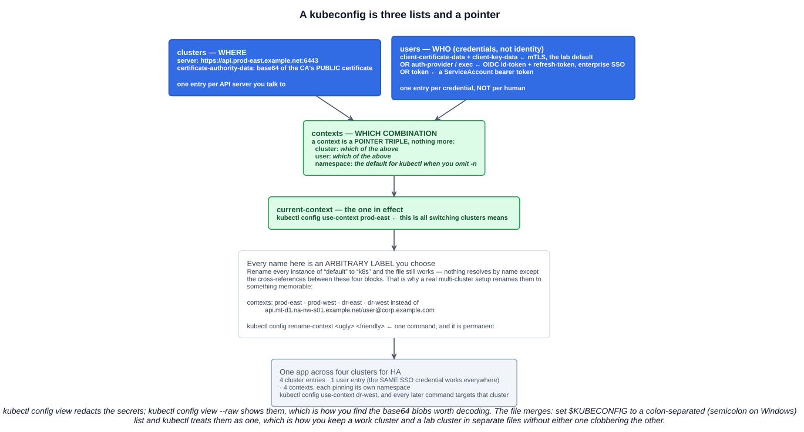
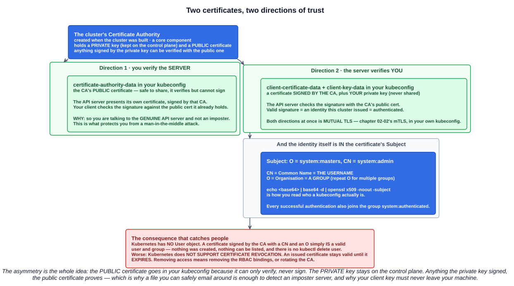
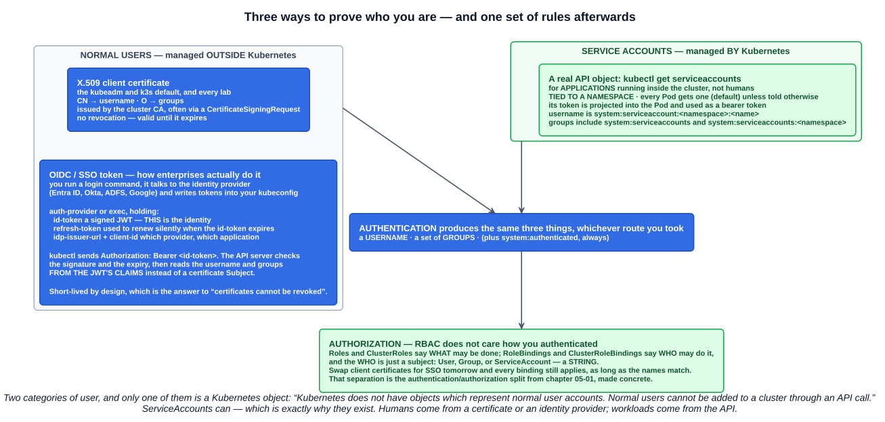

# 02 — RBAC part 1: identity, certificates and kubeconfig

> RBAC **regulates access to resources** in the Kubernetes cluster — **policy-based access for users, groups and service accounts**, so that only authorized identities can access or modify resources.

Chapter 05-01 separated a request into **authentication** ("who are you?") and **authorization** ("may you do this?"). RBAC lives in the second stage, but it is useless without the first — a rule that grants `alice` access means nothing until something can prove you *are* alice.

This chapter is that first half: **where your identity comes from, and how it reaches the cluster.** Roles and bindings — the permissions themselves — are the next chapter.

The course's framing is worth keeping: most RBAC material starts halfway through, skipping the parts you have already been using without realising. **You have had a working identity since chapter 04-01.** It is sitting in `~/.kube/config`.

---

## 1. Start where you already are: the kubeconfig

```bash
kubectl config view            # secrets redacted
kubectl config view --raw      # the real file, base64 blobs and all
cat ~/.kube/config
```



Four top-level blocks, and that is the entire file:

| Block | Holds | Think of it as |
|---|---|---|
| **`clusters`** | `server:` (the API endpoint) and `certificate-authority-data:` | **Where** |
| **`users`** | Credentials — a client certificate and key, an OIDC token, or a bearer token | **Who** (credentials, not identity) |
| **`contexts`** | A pointer triple: `cluster` + `user` + `namespace` | **Which combination** |
| **`current-context`** | The name of the context in effect | The one being used right now |

The single most clarifying fact: **a context is nothing but three pointers.** It contains no credentials and no addresses — it says "use *that* cluster with *those* credentials, defaulting to *this* namespace".

### 1.1 Every name is an arbitrary label

The lecture makes this point well by doing something that feels illegal: rename every instance of `default` in a working kubeconfig to `k8s`, and the file still works perfectly.

Nothing resolves by name except the cross-references between the four blocks. `name: default` under `clusters` is meaningful only because a context says `cluster: default`. Change both and nothing notices.

This matters because a real multi-cluster kubeconfig is unreadable by default. Managed platforms generate context names like:

```
api.region-a.example.net/user@corp.example.com
```

Which is accurate, and useless when you have five of them and need to know which is production. So rename them:

```bash
kubectl config rename-context api.region-a.example.net/user@corp.example.com prod-east
```

An application deployed across four clusters for high availability ends up with four `clusters` entries, often **one** `users` entry (the same SSO credential works everywhere), and four contexts named `prod-east`, `prod-west`, `dr-east`, `dr-west`, each pinning its own namespace. Switching cluster becomes:

```bash
kubectl config use-context dr-west
```

---

## 2. Customizing the kubeconfig

`kubectl config` has fifteen subcommands and you only need a handful.

### 2.1 Looking around

```bash
kubectl config get-contexts               # the * marks the current one
kubectl config get-clusters
kubectl config get-users
kubectl config current-context
kubectl config view --minify              # only the current context, resolved
kubectl config view --minify -o jsonpath='{.contexts[0].context.namespace}{"\n"}'
```

### 2.2 The two you will use daily

```bash
kubectl config use-context prod-east                       # switch cluster
kubectl config set-context --current --namespace=team-a    # switch namespace (chapter 04-04)
```

### 2.3 Renaming and tidying

```bash
kubectl config rename-context <long-generated-name> prod-east
kubectl config delete-context old-cluster
kubectl config delete-cluster old-cluster
kubectl config delete-user old-user
kubectl config unset users.old-user.password
```

### 2.4 Building entries by hand

```bash
kubectl config set-cluster lab \
  --server=https://10.0.0.10:6443 \
  --certificate-authority=/etc/kubernetes/pki/ca.crt \
  --embed-certs=true

kubectl config set-credentials alice \
  --client-certificate=alice.crt --client-key=alice.key --embed-certs=true

kubectl config set-context alice@lab --cluster=lab --user=alice --namespace=dev
kubectl config use-context alice@lab
```

**`--embed-certs=true`** is the flag worth knowing: without it the kubeconfig stores *file paths*, so the file only works on that machine. With it, the certificate contents are base64-embedded and the file is portable. That is why the generated configs you are handed are full of long base64 strings rather than paths.

### 2.5 Multiple files

`$KUBECONFIG` takes a **list** of files, colon-separated on Linux and macOS, **semicolon-separated on Windows**. kubectl merges them into one logical config:

```bash
export KUBECONFIG=~/.kube/config:~/.kube/work-config:~/.kube/lab-config
kubectl config get-contexts                    # everything from all three
kubectl config view --flatten > ~/.kube/merged # collapse to a single self-contained file
```

This is the clean way to keep a work cluster and a lab cluster apart without either clobbering the other, and it is how most tooling hands you a new cluster — a separate file you add to the list.

`--flatten` is the companion: it resolves every file reference into embedded data and emits one portable file.

### 2.6 The convenience tools

`kubectx` and `kubens` wrap `use-context` and `set-context --namespace` with fuzzy search and a `-` shortcut for "previous". Not exam material, and the reason experienced people never type `kubectl config set-context` by hand.

---

## 3. Certificates, properly

This is where a lot of people (reasonably) glaze over, so it is worth doing slowly. There are **two certificates in play and they point in opposite directions**.



### 3.1 The Certificate Authority

When the cluster was built, a **Certificate Authority** was created — a **core component**, and a **trusted entity used by the cluster for creating and verifying certificates**. It holds:

- a **private key**, which stays on the control plane and can **sign** things;
- a **public certificate**, which can **verify** signatures but cannot create them.

That asymmetry is the whole of public-key cryptography as it applies here: **anything signed by the private key can be verified by anyone holding the public certificate, and only the holder of the private key could have signed it.**

### 3.2 Direction one — you verify the server

```yaml
clusters:
- cluster:
    server: https://127.0.0.1:6443
    certificate-authority-data: LS0tLS1CRUdJTiBDRVJUSUZJQ0FURS0tLS0t...
```

That base64 blob is **the CA's public certificate**. When you connect, the API server presents its own certificate — signed by that CA — and your client checks the signature against the public certificate it already has.

Why it matters: **so you know you are talking to the genuine API server and not an imposter.** Without it, anything that could intercept your connection could impersonate the cluster, collect your credentials, and return whatever it liked. This is standard TLS server verification, and it is what protects you from a man-in-the-middle attack.

It is also why this value is safe to share: a public certificate can verify, never sign.

### 3.3 Direction two — the server verifies you

```yaml
users:
- name: default
  user:
    client-certificate-data: LS0tLS1CRUdJTiBDRVJUSUZJQ0FURS0tLS0t...
    client-key-data: LS0tLS1CRUdJTiBFQyBQUklWQVRFIEtFWS0tLS0t...
```

Two different things:

- **`client-certificate-data`** — your certificate, **signed by the cluster CA**. It states who you are, and the CA's signature is what makes that claim credible.
- **`client-key-data`** — **your private key**. It never leaves your machine and is never sent to the server; it is what proves the certificate is yours rather than a copy someone stole.

Both directions at once is **mutual TLS** — the mTLS from chapter 02-02, in your own kubeconfig.

### 3.4 Reading it

```bash
kubectl config view --raw -o jsonpath='{.users[0].user.client-certificate-data}' \
  | base64 -d \
  | openssl x509 -noout -text
```

Decoding the client certificate data actually yields **two** PEM blocks: your certificate, followed by the **CA's public certificate**, chained together to prove the first one's validity.

And in the output:

```
Subject: O = system:masters, CN = system:admin
```

**That line is your identity.**

| Field | Means | Becomes |
|---|---|---|
| **`CN`** | Common Name | **The username** |
| **`O`** | Organisation | **A group** — repeat `O` for multiple groups |

The documentation is explicit:

> Kubernetes determines the username from the **common name** field in the 'subject' of the cert (e.g. `/CN=bob`).
>
> For each group that the user is a member of, add the group name as an **organization** in your certificate's subject.

So `CN=Ada Lovelace, O=Users, O=Staff` authenticates as user `Ada Lovelace` in groups `Users` and `Staff`. And regardless of how you authenticated, **every successful authentication also places you in the group `system:authenticated`.**

The quickest version of that command:

```bash
kubectl config view --raw -o jsonpath='{.users[0].user.client-certificate-data}' \
  | base64 -d | openssl x509 -noout -subject -dates
```

`system:masters` is worth recognising — it is the group bound to `cluster-admin` by default, which is why the admin kubeconfig your cluster installer generated can do everything.

---

## 4. Kubernetes does not manage users

This follows directly from chapter 05-01's "there is no `User` object", and the slide states it bluntly: **Kubernetes does not manage user and group accounts.**

> All Kubernetes clusters have two categories of users: **service accounts managed by Kubernetes**, and **normal users**.
>
> In this regard, **Kubernetes does not have objects which represent normal user accounts. Normal users cannot be added to a cluster through an API call.**

Instead:

> Any user that presents a **valid certificate signed by the cluster's certificate authority** is considered authenticated.

A certificate signed by the CA carrying a `CN` and an `O` **simply is** a valid user and group. Nothing was created; there is nothing to list, and no `kubectl delete user`.

### 4.1 The consequence worth internalizing

> Kubernetes does not support certificate **revocation**. Any certificate that is issued remains valid until it expires.

Hand out a client certificate valid for a year and that identity authenticates for a year, full stop. Removing someone's access means **removing their RBAC bindings** (so they authenticate but can do nothing), or rotating the CA — which invalidates everyone.

This is the practical argument for **short-lived, centrally-issued credentials** over long-lived certificates, and it is why enterprises use SSO rather than distributing certificates by hand.

### 4.2 The CertificateSigningRequest flow

When certificates *are* the mechanism, Kubernetes provides an API for issuing them, and the lecture's six steps are the standard flow:

1. The user generates a **private key** and a **Certificate Signing Request** with the subject they want — `CN=James, O=Wales`.
2. That CSR is wrapped in a **Kubernetes `CertificateSigningRequest` object**.
3. It is submitted to the API server.
4. **An administrator approves it** — `kubectl certificate approve <name>`.
5. The **signed certificate** becomes available in the object's status.
6. The signed certificate and the user's private key go into a **kubeconfig**.

```bash
openssl genrsa -out james.key 2048
openssl req -new -key james.key -out james.csr -subj "/CN=James/O=Wales"

kubectl get csr
kubectl certificate approve james
kubectl get csr james -o jsonpath='{.status.certificate}' | base64 -d > james.crt
```

Note step 4: **approval is a human decision, gated by RBAC.** Asking for a certificate that says `CN=system:admin, O=system:masters` is easy — getting it approved is the control.

---

## 5. Users, Groups and ServiceAccounts



| | **Users** | **Groups** | **ServiceAccounts** |
|---|---|---|---|
| What | Individuals or applications interacting with the cluster | A set of users attached to a set of permissions | **Applications running inside the cluster** |
| Managed by | **Outside Kubernetes** | **Outside Kubernetes** | **Kubernetes — they are API objects** |
| Is it an API object? | **No** | **No** | **Yes** — `kubectl get serviceaccounts` |
| Scope | Cluster-wide string | Cluster-wide string | **Tied to a namespace** |
| Represented as | A string: `alice`, `alice@example.com` | A string: `Staff`, `system:masters` | `system:serviceaccount:<ns>:<name>` |

**Groups are the leverage.** As the slide puts it: *when permissions are given to a group, all users that are part of that group receive those permissions.* You almost never bind a Role to an individual — you bind it to a group and let the identity provider decide who is in it. That is how access survives people joining and leaving.

**ServiceAccounts are the one you can actually create.** They exist because a Pod needs an identity too: the API calls a controller or an application makes are authenticated the same way yours are. Every Pod gets the namespace's `default` ServiceAccount unless told otherwise, and its token is projected into the Pod — which is the `ServiceAccount` admission controller from chapter 05-01 doing its job. They get their own chapter alongside roles and bindings.

---

## 6. The enterprise route: OIDC instead of certificates

Almost no large organization hands out client certificates. What you meet instead is **OpenID Connect**, and once you have seen the certificate version the token version is easy.

The kubeconfig user entry looks completely different — no `client-certificate-data` at all:

```yaml
users:
- name: user@corp.example.com
  user:
    auth-provider:
      config:
        client-id: <the application registered with the identity provider>
        id-token: eyJ0eXAiOiJKV1QiLCJhbGciOi...       # a signed JWT — THIS is the identity
        refresh-token: <used to get a new id-token silently>
        idp-issuer-url: https://sso.corp.example.com/adfs
      name: oidc
```

The flow, from the Kubernetes documentation:

1. **Log in to the identity provider** — typically a small login command your platform team provides, which prompts for your corporate password and possibly MFA.
2. The provider returns an **`access_token`, an `id_token` and a `refresh_token`**.
3. Those tokens are **written into your kubeconfig** — which is the "file being updated in the background" you notice after logging in.
4. kubectl sends **`Authorization: Bearer <id_token>`** with every request.
5. The API server checks **the JWT's signature**.
6. It checks **whether the JWT has expired** (`iat` + `exp`).
7. Then it **authorizes** the request.

Three things follow that are worth having straight:

- **The `id_token` is the identity, not the `access_token`.** It is a JWT — a signed JSON document — and the API server reads the **username and groups from its claims**, where the certificate route read them from the Subject's `CN` and `O`. Different envelope, same two values.
- **The `refresh_token` is why it renews silently.** ID tokens are deliberately short-lived (often minutes to hours). When one expires, the client uses the refresh token to get another without prompting you. That is the background file-update you observe, and it is the direct answer to "certificates cannot be revoked": a short-lived token that stops being reissued *is* revocation.
- **Entitlement requests and project IDs are outside Kubernetes entirely.** Requesting access through a corporate entitlement system puts you into a **group** in the identity provider. That group name then arrives in your JWT's claims, and a **ClusterRoleBinding or RoleBinding in the cluster maps that group to permissions**. Kubernetes never knew your request existed — it only ever sees the group string.

That last point is the whole architecture in one sentence, and it is why the "Kubernetes does not manage users" rule is a feature rather than a gap.

`auth-provider` is the older form; the modern equivalent is an **`exec` credential plugin**, where kubectl runs an external binary that returns a token on demand. Both end up sending a bearer token.

**And none of it changes RBAC.** Whether your username and groups came from a certificate Subject, a JWT claim or a ServiceAccount token, authentication produces the same three outputs — a **username**, a set of **groups**, and `system:authenticated` — and the authorization stage works purely on those strings.

---

## Exam angle

- **RBAC regulates access to resources**, providing **policy-based access for users, groups and service accounts**. It is the `RBAC` mode of **`--authorization-mode`** (chapter 05-01) and runs in the **authorization** stage — after authentication, before admission.
- **A kubeconfig has four blocks:** `clusters` (where), `users` (credentials), `contexts` (a pointer triple of cluster + user + namespace), and `current-context`. **All the names are arbitrary labels.**
- **`kubectl config use-context`** switches cluster; **`set-context --current --namespace=`** switches namespace; **`rename-context`** gives a generated name a friendly one. **`$KUBECONFIG`** takes a list of files that kubectl merges.
- **Two certificates, opposite directions.** `certificate-authority-data` is the **CA's public certificate**, used by *you* to verify the **server** is genuine (anti-MITM). `client-certificate-data` + `client-key-data` are used by the **server** to verify **you**. Together: **mutual TLS**.
- **In a client certificate, `CN` is the username and `O` is a group** (repeat `O` for several). Every authenticated request also joins **`system:authenticated`**.
- **Kubernetes does not manage normal users.** There is **no User object** and normal users **cannot be added through an API call** — any certificate signed by the cluster CA is accepted. **Certificate revocation is not supported**; an issued certificate is valid until it expires.
- **ServiceAccounts are the exception** — they *are* Kubernetes objects, **tied to a namespace**, used by **applications inside the cluster**, with the username form `system:serviceaccount:<namespace>:<name>`.
- **Permissions given to a group apply to every user in it** — which is why bindings target groups, not individuals.
- **OIDC is the enterprise alternative**: the **`id_token`** (a JWT) carries the identity, the **`refresh_token`** renews it silently, and the username and groups come from the token's **claims** instead of a certificate Subject. **RBAC is identical either way.**

## References

- [Using RBAC Authorization](https://kubernetes.io/docs/reference/access-authn-authz/rbac/) — the authorization half, covered in the next chapter
- [Authenticating](https://kubernetes.io/docs/reference/access-authn-authz/authentication/) — normal users versus service accounts, X.509 CN/O mapping, OIDC tokens
- [Organizing Cluster Access Using kubeconfig Files](https://kubernetes.io/docs/concepts/configuration/organize-cluster-access-kubeconfig/) — contexts, merging, and the `$KUBECONFIG` list
- [Certificate Signing Requests](https://kubernetes.io/docs/reference/access-authn-authz/certificate-signing-requests/) — requesting and approving a user certificate
