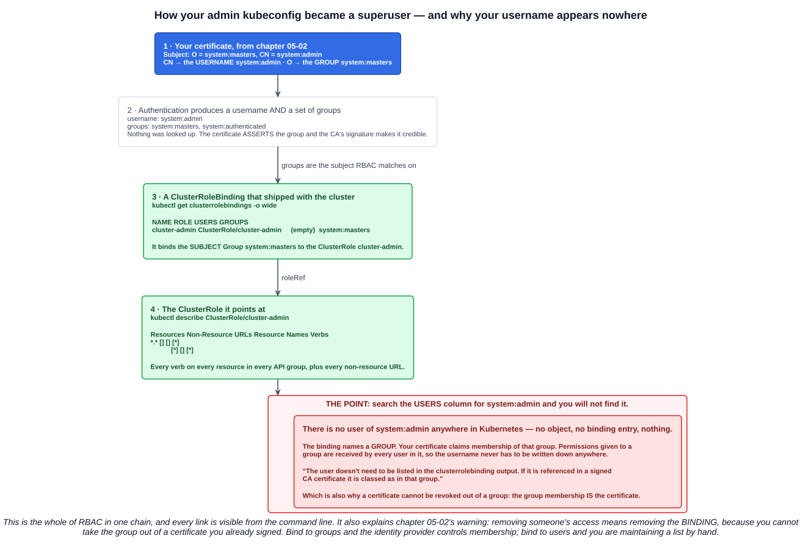
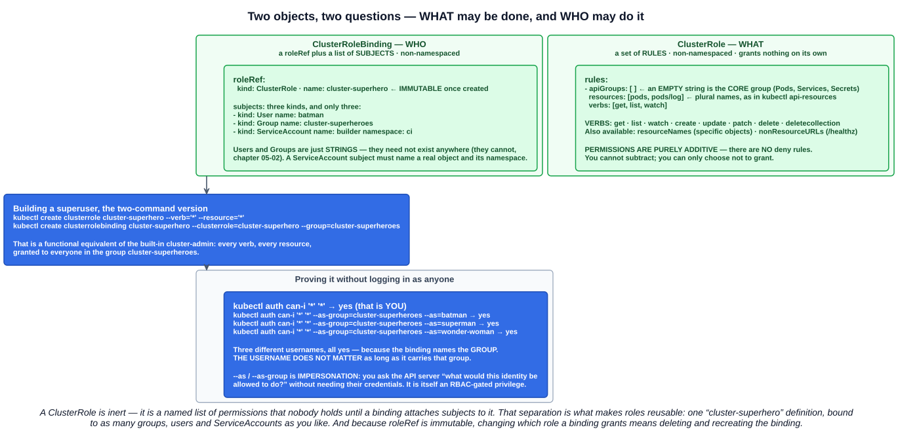

# 03 — RBAC part 2: ClusterRoles and ClusterRoleBindings

Chapter 05-02 ended on a deliberate `403`: a certificate that authenticated perfectly and could do nothing. This chapter is the other half — **the objects that turn an identity into permissions**, starting from the one every cluster already has.

The approach the lecture takes is the right one: rather than inventing a Role from scratch, **take apart the superuser you have been using since chapter 04-01**, then rebuild an equivalent from first principles.

---

## 1. The four objects

| Object | Scope | Answers |
|---|---|---|
| **`Role`** | Namespaced | **What** may be done, within one namespace |
| **`ClusterRole`** | **Cluster-wide (non-namespaced)** | **What** may be done, anywhere |
| **`RoleBinding`** | Namespaced | **Who** may do it, within one namespace |
| **`ClusterRoleBinding`** | **Cluster-wide (non-namespaced)** | **Who** may do it, everywhere |

Two properties govern everything that follows:

> An RBAC Role or ClusterRole **contains rules that represent a set of permissions**. **Permissions are purely additive (there are no "deny" rules).**

**There is no deny.** You cannot subtract a permission, only decline to grant it. If someone has access they should not, something granted it — find the binding.

And the roles are **inert**. A ClusterRole is a named list of permissions that **nobody holds** until a binding attaches subjects to it. That separation is what makes them reusable.

This chapter covers the cluster-scoped pair; the namespaced `Role`/`RoleBinding` follow in part 3.

---

## 2. Taking apart the superuser you already are

```
$ kubectl get clusterrolebindings -o wide
NAME            ROLE                        AGE     USERS                          GROUPS
cluster-admin   ClusterRole/cluster-admin   5m39s                                  system:masters
system:monitoring ClusterRole/system:monitoring 5m39s                              system:monitoring
system:discovery  ClusterRole/system:discovery  5m39s                              system:authenticated
system:basic-user ClusterRole/system:basic-user 5m39s                              system:authenticated
system:public-info-viewer ...                  5m39s                              system:authenticated, system:unauthenticated
system:node-proxier ...                        5m39s   system:kube-proxy
system:kube-controller-manager ...             5m39s   system:kube-controller-manager
```

A fresh cluster ships with dozens of these. The interesting one is the first.

### 2.1 The observation that makes RBAC click

Chapter 05-02 decoded your admin certificate and found:

```
Subject: O = system:masters, CN = system:admin
```

So your username is `system:admin`. Now search the `USERS` column above for it.

**It is not there.** There is no user of `system:admin` anywhere in this cluster — no object, no binding entry, nothing. And yet that kubeconfig can do absolutely anything.



The chain:

1. Your certificate's **`CN`** is the username `system:admin`, and its **`O`** is the group `system:masters`.
2. **Authentication produces a username *and a set of groups*.** Nothing was looked up — the certificate *asserts* the group, and the CA's signature makes the assertion credible.
3. The **`cluster-admin` ClusterRoleBinding** names the **Group `system:masters`** as its subject — with the `USERS` column empty.
4. It points at the **`cluster-admin` ClusterRole**.

The lecture states the consequence exactly right:

> **All users who are part of that group receive those permissions.** Therefore our user `system:admin` will receive the permissions of the group `system:masters`.
>
> **Note:** the user doesn't need to be listed in the clusterrolebinding output. **If it is referenced in a signed CA certificate it is classed as in that group.**

That is the whole idea. **Group membership lives in the credential, not in Kubernetes.** The cluster never maintains a list of who is in `system:masters` — it trusts whatever the certificate (or the JWT, chapter 05-02) claims.

It also explains the warning from last chapter: you cannot take a group out of a certificate you have already signed. **Removing access means removing the binding.**

### 2.2 What `cluster-admin` actually contains

```
$ kubectl describe ClusterRole/cluster-admin
Name:         cluster-admin
Labels:       kubernetes.io/bootstrapping=rbac-defaults
Annotations:  rbac.authorization.kubernetes.io/autoupdate: true
PolicyRule:
  Resources  Non-Resource URLs  Resource Names  Verbs
  ---------  -----------------  --------------  -----
  *.*        []                 []              [*]
             [*]                []              [*]
```

Two rules, and they are as broad as the syntax allows:

- **`*.*`** — every **resource** in every **API group**, with verbs `[*]`.
- **`[*]`** under Non-Resource URLs — every **non-resource endpoint** too, things like `/healthz` and `/metrics` that are not API objects at all.

`rbac.authorization.kubernetes.io/autoupdate: true` is worth noticing: the control plane **repairs the default roles on startup**, so you cannot permanently weaken `cluster-admin` by editing it.

---

## 3. Building the same thing from scratch

The lecture's demonstration, and the fastest way to prove you understand the model.



```bash
kubectl create clusterrole cluster-superhero --verb='*' --resource='*'
kubectl create clusterrolebinding cluster-superhero \
  --clusterrole=cluster-superhero --group=cluster-superheroes
```

```
$ kubectl get clusterrolebindings -o wide | egrep 'NAME|^cluster-'
NAME                ROLE                              AGE
cluster-admin       ClusterRole/cluster-admin         8m51s
cluster-superhero   ClusterRole/cluster-superhero     25s
```

Two commands, and a functional equivalent of the built-in superuser — **granted to a group that does not exist anywhere**, because groups never do.

### 3.1 The ClusterRole — what

```yaml
apiVersion: rbac.authorization.k8s.io/v1
kind: ClusterRole
metadata:
  name: pod-reader        # no namespace — ClusterRoles are non-namespaced
rules:
- apiGroups: [""]         # "" is the CORE group (Pod, Service, Secret, ConfigMap…)
  resources: ["pods", "pods/log"]
  verbs: ["get", "list", "watch"]
```

| Field | Notes |
|---|---|
| **`apiGroups`** | **`""`** (empty string) means the **core group** from chapter 05-01 — `/api/v1`. Named groups are `"apps"`, `"batch"`, `"networking.k8s.io"`. `"*"` means all |
| **`resources`** | **Plural, lowercase**, exactly as `kubectl api-resources` prints them. Subresources use a slash: `pods/log`, `pods/exec`, `deployments/scale` |
| **`verbs`** | `get`, `list`, `watch`, `create`, `update`, `patch`, `delete`, `deletecollection` |
| `resourceNames` | Restrict to **specific named objects**. An empty set means everything |
| `nonResourceURLs` | For endpoints that are not API objects — `/healthz`, `/metrics`. ClusterRole only |

The verbs divide neatly: **`get`/`list`/`watch`** are reads (and `list` is the dangerous one — it returns *contents*, which is why the built-in `view` role deliberately excludes Secrets), while `create`/`update`/`patch`/`delete`/`deletecollection` are writes.

Three things a ClusterRole can do that a Role cannot, straight from the docs:

1. grant access to **cluster-scoped resources** (like Nodes);
2. grant access to **non-resource endpoints** (like `/healthz`);
3. grant access to **namespaced resources across all namespaces** — for example, letting someone run `kubectl get pods --all-namespaces`.

### 3.2 The ClusterRoleBinding — who

```yaml
apiVersion: rbac.authorization.k8s.io/v1
kind: ClusterRoleBinding
metadata:
  name: cluster-superhero
roleRef:                          # WHAT — immutable once created
  apiGroup: rbac.authorization.k8s.io
  kind: ClusterRole
  name: cluster-superhero
subjects:                         # WHO — exactly three kinds exist
- kind: Group
  name: cluster-superheroes
  apiGroup: rbac.authorization.k8s.io
- kind: User
  name: batman
  apiGroup: rbac.authorization.k8s.io
- kind: ServiceAccount
  name: builder
  namespace: ci                   # ServiceAccounts always carry a namespace
```

| Subject kind | Must exist? |
|---|---|
| **`User`** | **No** — it is just a string. It cannot exist (chapter 05-02) |
| **`Group`** | **No** — also just a string |
| **`ServiceAccount`** | **Yes** — a real object, and you must give its `namespace` |

**`roleRef` is immutable.** Changing which role a binding grants means deleting and recreating the binding — a deliberate safety property, so a binding cannot be quietly repointed at something more powerful.

---

## 4. `kubectl auth can-i`

The command that makes all of this checkable, and the lecture uses it to land the point.

```bash
kubectl auth can-i '*' '*'                     # yes — that is you
kubectl auth can-i create deployments
kubectl auth can-i delete pods -n kube-system
kubectl auth can-i --list                      # everything you can do, as a table
```

Then the interesting form — **impersonation**:

```
$ kubectl auth can-i '*' '*' --as-group="cluster-superheroes" --as="batman"
yes
$ kubectl auth can-i '*' '*' --as-group="cluster-superheroes" --as="superman"
yes
$ kubectl auth can-i '*' '*' --as-group="cluster-superheroes" --as="wonder-woman"
yes
```

Three completely different usernames. Three yeses. None of them exists anywhere, and none was ever mentioned in the binding.

**The username does not matter as long as it carries the group.** That is the same lesson as `system:admin` and `system:masters`, this time built by hand instead of inherited from the installer.

`--as` and `--as-group` are **impersonation**: you ask the API server *"what would this identity be allowed to do?"* without holding their credentials. It is the fastest way to test an RBAC change before handing it to someone — and it is itself an RBAC-gated privilege (the `impersonate` verb on `users`, `groups` and `serviceaccounts`), precisely because it would otherwise be a trivial privilege escalation.

Related and worth knowing:

```bash
kubectl auth whoami                                  # the username and groups the server sees
kubectl auth can-i --list --as=system:serviceaccount:default:default
```

---

## 5. The default ClusterRoles

Every cluster ships with four **user-facing** ClusterRoles — the ones without a `system:` prefix.

| ClusterRole | Default binding | Grants |
|---|---|---|
| **`cluster-admin`** | **`system:masters` group** | **Super-user access — any action on any resource.** In a ClusterRoleBinding: full control of the whole cluster. In a **RoleBinding**: full control **of that namespace only** |
| **`admin`** | None | Read/write most resources in a namespace **including creating Roles and RoleBindings there**. Intended for a RoleBinding. No write access to ResourceQuota or the Namespace itself |
| **`edit`** | None | Read/write most objects in a namespace, but **cannot view or modify Roles or RoleBindings** |
| **`view`** | None | **Read-only**, and **deliberately excludes Secrets** — reading a Secret would expose ServiceAccount credentials |

Two details worth carrying:

- **`cluster-admin` in a RoleBinding is namespace-scoped.** The same ClusterRole means "everything, everywhere" or "everything, here" depending on which binding references it. That is the `ClusterRole` + `RoleBinding` combination from chapter 04-04, and part 3 covers it properly.
- **`view` excluding Secrets is a design decision, not an oversight** — and `edit` can still run Pods as any ServiceAccount in the namespace, so it is closer to admin than the name suggests.

The **`system:` prefix is reserved** for Kubernetes, so avoid creating users or groups that start with it.

---

## 6. Where this leaves us

Chapter 05-02 built an identity that could not do anything. This chapter has the tool to fix it:

```bash
kubectl create clusterrole pod-reader --verb=get,list,watch --resource=pods
kubectl create clusterrolebinding james-pod-reader \
  --clusterrole=pod-reader --user=james
kubectl --context=james@<cluster> get pods      # the 403 becomes a 200
```

Nothing about the certificate changed. The identity was always valid; only the authorization stage's answer moved.

Part 3 takes this down to namespace scope — `Role`, `RoleBinding`, and the ServiceAccounts that let workloads do the same thing.

---

## Exam angle

- **Four RBAC objects:** `Role` and `RoleBinding` are **namespaced**; **`ClusterRole` and `ClusterRoleBinding` are non-namespaced**. Roles say **what**, bindings say **who**.
- **Permissions are purely additive — there are no deny rules.** You cannot revoke a permission with another rule; you remove the binding that granted it.
- **A role grants nothing on its own.** It is inert until a binding attaches subjects to it.
- **A ClusterRole can do three things a Role cannot:** cluster-scoped resources (Nodes), **non-resource URLs** (`/healthz`), and namespaced resources **across all namespaces**.
- **`cluster-admin` is bound to the `system:masters` group** by a ClusterRoleBinding, and contains `*.*` with verbs `[*]` plus all non-resource URLs. **The admin user is never named** — it inherits through the group its certificate's `O` claims.
- **Bindings target groups, and group membership lives in the credential.** A user need not appear in any binding, or exist at all — *"if it is referenced in a signed CA certificate it is classed as in that group"*.
- **Three subject kinds:** `User`, `Group` and `ServiceAccount`. Users and groups are **just strings and need not exist**; a ServiceAccount subject must be real and carry a `namespace`.
- **`roleRef` is immutable** — repointing a binding means recreating it.
- **`apiGroups: [""]`** is the **core** API group. Resources are **plural**, subresources use a slash (`pods/log`).
- **`kubectl auth can-i`** checks permissions, and **`--as` / `--as-group`** impersonate another identity to test a binding without their credentials.
- **Default user-facing ClusterRoles:** `cluster-admin`, `admin`, `edit`, `view`. **`view` cannot read Secrets.** **`cluster-admin` used in a RoleBinding is limited to that namespace.**

## References

- [Using RBAC Authorization](https://kubernetes.io/docs/reference/access-authn-authz/rbac/) — the four objects, subjects, default roles and the `kubectl create` helpers
- [Authorization Overview](https://kubernetes.io/docs/reference/access-authn-authz/authorization/) — where RBAC sits among the authorization modes
- [kubectl auth can-i](https://kubernetes.io/docs/reference/kubectl/generated/kubectl_auth/kubectl_auth_can-i/) — checking and impersonating
- [Controlling Access to the Kubernetes API](https://kubernetes.io/docs/concepts/security/controlling-access/) — the authentication and authorization stages from chapter 05-01
