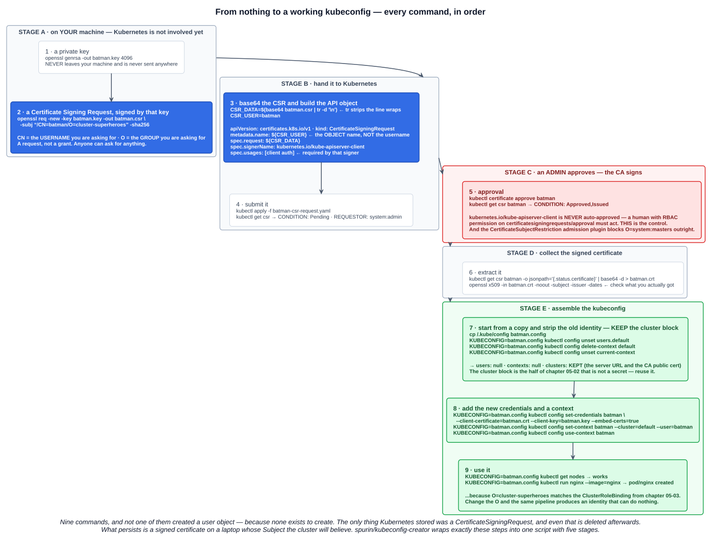
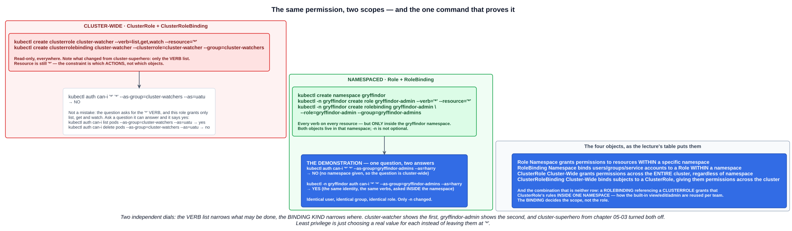

# 04 — RBAC part 3: the CSR-to-kubeconfig pipeline, and namespaced Roles

Chapter 05-02 described the certificate flow as six boxes on a slide. Chapter 05-03 built the permissions but had no real user to give them to. This chapter closes the loop: **every command, in order, from an empty directory to a working kubeconfig** — then automates it, then narrows the permissions down from "everything" to something you would actually grant.

---

## 1. The pipeline, end to end



### Stage A — on your machine, before Kubernetes is involved

```bash
openssl genrsa -out batman.key 4096
openssl req -new -key batman.key -out batman.csr \
  -subj "/CN=batman/O=cluster-superheroes" -sha256
```

Two files, and neither has touched the cluster:

- **`batman.key`** — the private key. It never leaves this machine and is never sent anywhere.
- **`batman.csr`** — a Certificate Signing Request, signed by that key, **asking** for the username `batman` in the group `cluster-superheroes`.

The `-subj` is the whole identity: **`CN` is the username, `O` is the group** (chapter 05-02). And it is a *request* — **anyone can ask for anything**.

### Stage B — hand it to Kubernetes

```bash
CSR_DATA=$(base64 batman.csr | tr -d '\n')
CSR_USER=batman

cat <<EOF > batman-csr-request.yaml
apiVersion: certificates.k8s.io/v1
kind: CertificateSigningRequest
metadata:
  name: ${CSR_USER}
spec:
  request: ${CSR_DATA}
  signerName: kubernetes.io/kube-apiserver-client
  usages:
  - client auth
EOF

kubectl apply -f batman-csr-request.yaml
kubectl get csr
```

```
NAME     AGE   SIGNERNAME                            REQUESTOR      CONDITION
batman   15s   kubernetes.io/kube-apiserver-client   system:admin   Pending
```

Four details worth pausing on:

| Detail | Why |
|---|---|
| **`tr -d '\n'`** | `base64` wraps its output at 76 characters. The API field needs one unbroken string, so the newlines are stripped |
| **`metadata.name`** | The **object's** name. It happens to match the username here for readability, but it is *not* the identity — the identity is inside the encoded CSR |
| **`signerName`** | **`kubernetes.io/kube-apiserver-client`** signs certificates *"that will be honored as client certificates by the API server"*. This is the one for humans |
| **`usages: [client auth]`** | **Required** by that signer, which rejects anything without it |
| **`REQUESTOR`** | `system:admin` — *your* identity, recorded on the request. The audit trail of who asked |

### Stage C — approval

```bash
kubectl certificate approve batman
kubectl get csr batman
```

```
NAME     AGE   SIGNERNAME                            REQUESTOR      CONDITION
batman   44s   kubernetes.io/kube-apiserver-client   system:admin   Approved,Issued
```

`Approved,Issued` is two things: an administrator **approved** the request, and the CA then **issued** the certificate.

This step is the control, and the documentation is explicit about why:

> `kubernetes.io/kube-apiserver-client`: signs certificates that will be honored as client certificates by the API server. **Never auto-approved by kube-controller-manager.**

A human — or something holding RBAC permission on the `certificatesigningrequests/approval` subresource — must act. Anyone can generate a CSR claiming `CN=system:admin, O=system:masters`; nobody can sign it for them.

There is a second guard worth knowing:

> The **`CertificateSubjectRestriction` admission plugin is enabled by default to restrict `system:masters`**, but it is often not the only cluster-admin subject in a cluster.

So the single most obvious escalation — asking for `O=system:masters` — is blocked by an **admission controller** (chapter 05-01) before approval is even possible. The caveat in that sentence matters though: a cluster may have other groups bound to `cluster-admin`, and those are *not* automatically protected.

### Stage D — collect the certificate

```bash
kubectl get csr batman -o jsonpath='{.status.certificate}'            # base64
kubectl get csr batman -o jsonpath='{.status.certificate}' | base64 -d  # the PEM
kubectl get csr batman -o jsonpath='{.status.certificate}' | base64 -d > batman.crt

openssl x509 -in batman.crt -noout -subject -issuer -dates
```

Always check what you actually got — the Subject should read `O = cluster-superheroes, CN = batman`, and the Issuer should be the cluster CA.

### Stage E — assemble the kubeconfig

The clever part of the lecture's approach: **start from a copy of the working config and strip out the identity**, keeping the cluster block.

```bash
cp ~/.kube/config batman-clustersuperheroes.config

KUBECONFIG=batman-clustersuperheroes.config kubectl config unset users.default
KUBECONFIG=batman-clustersuperheroes.config kubectl config delete-context default
KUBECONFIG=batman-clustersuperheroes.config kubectl config unset current-context
```

```yaml
clusters:
- cluster:
    certificate-authority-data: LS0tLS1CRUdJTiBDRVJUSUZJQ0FURS0t...
    server: https://127.0.0.1:6443
  name: default
contexts: null
current-context: ""
users: null
```

**Why keep the cluster block:** it holds the server URL and the **CA's public certificate** — the half of chapter 05-02 that is *not* a secret. Every user of this cluster needs exactly that, and it is safe to copy around.

Then add the new identity:

```bash
KUBECONFIG=batman-clustersuperheroes.config kubectl config set-credentials batman \
  --client-certificate=batman.crt --client-key=batman.key --embed-certs=true

KUBECONFIG=batman-clustersuperheroes.config kubectl config set-context batman \
  --cluster=default --user=batman
KUBECONFIG=batman-clustersuperheroes.config kubectl config use-context batman
```

`--embed-certs=true` inlines the data rather than storing paths, so the file is portable (chapter 05-02).

```bash
KUBECONFIG=batman-clustersuperheroes.config kubectl get nodes          # works
KUBECONFIG=batman-clustersuperheroes.config kubectl run nginx --image=nginx
# pod/nginx created
```

It works because `O=cluster-superheroes` matches the ClusterRoleBinding from chapter 05-03. **Change one letter of that `-subj` and the identical pipeline produces a kubeconfig that authenticates perfectly and can do nothing** — the `403` from chapter 05-02.

And notice what was *not* created: **no user object**, because none exists to create. The only thing Kubernetes stored was a CertificateSigningRequest, and that gets deleted afterwards. What persists is a signed certificate on a laptop whose Subject the cluster will believe.

---

## 2. Automating it

Nine commands per user does not scale. The course provides a script that wraps exactly these steps:

```bash
git clone https://github.com/spurin/kubeconfig-creator.git
cd kubeconfig-creator
./kubeconfig_creator.sh -u superman -g cluster-superheroes
```

It reports five stages, which map onto the sections above:

| Stage | What it does |
|---|---|
| **1 — User** | Configures user keys and certificate signing requests (`openssl genrsa`, the `.cnf` embedding `CN` and `O`, the CSR YAML) |
| **2 — Kubernetes** | Applies the CSR and approves it |
| **3 — Information Capture** | Reads back what it needs: `CLUSTER_NAME`, `CLIENT_CERTIFICATE_DATA`, `CLIENT_KEY_DATA`, `CLUSTER_CA`, `CLUSTER_ENDPOINT` |
| **4 — Kubeconfig** | Assembles the kubeconfig from the captured values |
| **5 — Cleanup** | Moves temporary files into a timestamped directory and **deletes the CSR object** |

Stage 3 is the interesting one — it is the same `kubectl config view --raw -o jsonpath=...` extraction from chapter 05-02, used programmatically:

```bash
kubectl config view --minify -o jsonpath={.current-context}
kubectl get csr mycsr -o jsonpath='{.status.certificate}'
cat superman-clustersuperheroes.key | base64 | tr -d '\n'
kubectl config view --raw -o json | jq -r '.clusters[] | select(.name == "default") | .cluster."certificate-authority-data"'
kubectl config view --raw -o json | jq -r '.clusters[] | select(.name == "default") | .cluster."server"'
```

Worth reading the script rather than just running it — it is a compact demonstration of every idea in these three chapters, and the cleanup stage is a good reminder that **the CSR object is disposable**: once the certificate is issued, deleting it changes nothing. The certificate is already signed, and there is no revocation (chapter 05-02).

---

## 3. Narrowing the permissions

`cluster-superhero` granted `*` on `*`. Real roles do not.



### 3.1 A read-only ClusterRole

```bash
kubectl create clusterrole cluster-watcher --verb=list,get,watch --resource='*'
kubectl create clusterrolebinding cluster-watcher \
  --clusterrole=cluster-watcher --group=cluster-watchers
```

Only one thing changed from `cluster-superhero`: **the verb list**. The resource is still `*` — this identity can *see* everything and *change* nothing.

```
$ kubectl auth can-i '*' '*' --as-group="cluster-watchers" --as="uatu"
no
```

**That `no` is correct, and it is worth understanding rather than skipping.** The question asks whether the identity may perform the **`*` verb**, and the role grants only `list`, `get` and `watch`. `*` is not a member of that set.

Ask a question the role can actually answer:

```bash
kubectl auth can-i list pods   --as-group="cluster-watchers" --as="uatu"   # yes
kubectl auth can-i get nodes   --as-group="cluster-watchers" --as="uatu"   # yes
kubectl auth can-i delete pods --as-group="cluster-watchers" --as="uatu"   # no
kubectl auth can-i --list      --as-group="cluster-watchers" --as="uatu"   # the whole picture
```

The lesson for testing RBAC: **`can-i '*' '*'` only returns yes for a genuine superuser.** For anything narrower, ask the specific question — or use `--list`.

### 3.2 Namespaced Roles and RoleBindings

Same two objects, one scope down. Both live **inside** a namespace, so `-n` is not optional:

```bash
kubectl create namespace gryffindor

kubectl -n gryffindor create role gryffindor-admin --verb='*' --resource='*'
kubectl -n gryffindor create rolebinding gryffindor-admin \
  --role=gryffindor-admin --group=gryffindor-admins
```

Every verb on every resource — but only inside `gryffindor`. And then the demonstration that makes namespace scoping concrete:

```
$ kubectl auth can-i '*' '*' --as-group="gryffindor-admins" --as="harry"
no

$ kubectl -n gryffindor auth can-i '*' '*' --as-group="gryffindor-admins" --as="harry"
yes
```

**Identical user. Identical group. Identical verbs. The only difference is `-n gryffindor`.**

Without a namespace the question is cluster-wide, and this identity has no cluster-wide permissions at all. Inside the namespace it is effectively an admin. That is the whole of namespaced RBAC in two commands.

### 3.3 The four objects

The lecture's summary table:

| | Scope | Purpose |
|---|---|---|
| **`Role`** | **Namespace** | Grants permissions to resources **within a specific namespace** |
| **`RoleBinding`** | **Namespace** | Binds specific users/groups/service accounts to a Role **within a namespace** |
| **`ClusterRole`** | **Cluster-wide** | Grants permissions to resources **across the entire cluster, regardless of namespace** |
| **`ClusterRoleBinding`** | **Cluster-wide** | Binds subjects to a ClusterRole, **giving them permissions across the cluster** |

And the combination that is in neither row, from chapter 04-04: a **RoleBinding referencing a ClusterRole** grants that ClusterRole's rules **inside one namespace**. That is how the built-in `view`, `edit` and `admin` ClusterRoles get reused per team — write the permission set once, bind it namespace by namespace.

The rule that falls out: **the binding decides the scope, not the role.**

### 3.4 Two independent dials

Putting the three roles from these chapters side by side makes the model obvious:

| Role | Verbs | Scope | Result |
|---|---|---|---|
| `cluster-superhero` | `*` | Cluster-wide | Can do anything, anywhere |
| `cluster-watcher` | `list,get,watch` | Cluster-wide | Can see anything, change nothing |
| `gryffindor-admin` | `*` | One namespace | Can do anything, in one place |

**The verb list narrows *what*; the binding kind narrows *where*.** Least privilege is just choosing a real value for each instead of leaving both at `*`.

---

## Exam angle

- **The CSR pipeline:** generate a **private key**, create a **CSR** whose `-subj` sets **`CN` (username)** and **`O` (group)**, base64 it into a **`CertificateSigningRequest`** object with **`signerName: kubernetes.io/kube-apiserver-client`** and **`usages: [client auth]`**, have an admin **approve** it, then extract **`.status.certificate`** and build a kubeconfig.
- **`kubernetes.io/kube-apiserver-client` is never auto-approved.** Approval requires RBAC permission on the **`certificatesigningrequests/approval`** subresource — anyone can *ask* for any identity, only an approver can grant it.
- **The `CertificateSubjectRestriction` admission plugin blocks `O=system:masters`** by default, though other cluster-admin subjects may not be protected.
- **A kubeconfig needs the cluster block** (server URL + CA public certificate) plus credentials. The cluster block is **not secret** and is the same for every user.
- **No user object is ever created** — the CSR object is disposable, and the certificate is what persists.
- **`kubectl auth can-i '*' '*'` returns `no` for any non-superuser**, because `*` is a literal verb being asked about, not a wildcard match against the granted list. Test specific verbs, or use **`--list`**.
- **Role and RoleBinding are namespaced; ClusterRole and ClusterRoleBinding are cluster-wide.** The same `auth can-i` question answers **no** without `-n` and **yes** with it, when the grant came from a RoleBinding.
- **A RoleBinding referencing a ClusterRole** applies that ClusterRole's rules **within one namespace only** — **the binding decides the scope, not the role**.
- **Two dials:** the **verb list** constrains what may be done; the **binding kind** constrains where.

## References

- [Certificate Signing Requests](https://kubernetes.io/docs/reference/access-authn-authz/certificate-signing-requests/) — the signers, their requirements, and the approval process
- [Certificates and Certificate Signing Requests](https://kubernetes.io/docs/tasks/tls/managing-tls-in-a-cluster/) — the end-to-end task version of this pipeline
- [Using RBAC Authorization](https://kubernetes.io/docs/reference/access-authn-authz/rbac/) — Role versus ClusterRole and the binding combinations
- [spurin/kubeconfig-creator](https://github.com/spurin/kubeconfig-creator) — the course's script automating the whole pipeline
