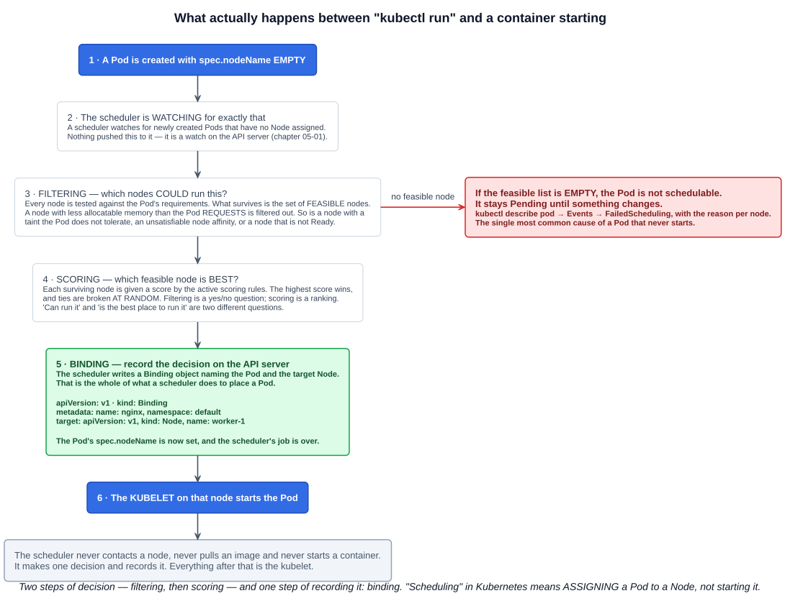
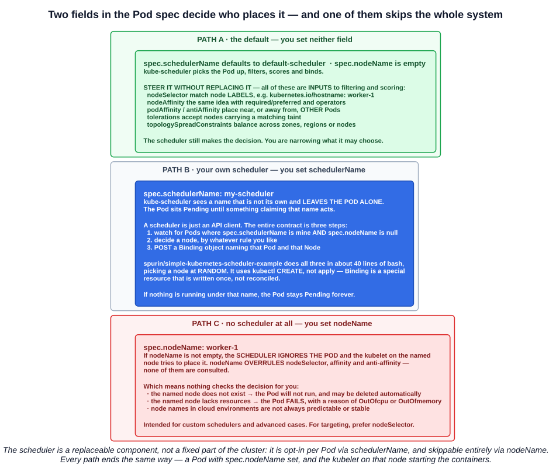

# 05 — The kube-scheduler

Chapter 05-01 traced a request through the API server. This chapter follows what happens *after* the object lands in etcd: something has to decide which Node runs the Pod, and that decision is a separate, replaceable component.

---

## 1. What scheduling means

> In Kubernetes, **scheduling** refers to making sure that **Pods are matched to Nodes** so that the **kubelet can run them**.

That sentence is the whole definition, and the distractor is inside it. **Scheduling assigns a Pod to a Node. It does not start the Pod.** The kubelet does that.

> A scheduler **watches for newly created Pods that have no Node assigned**. For every Pod that the scheduler discovers, the scheduler becomes responsible for **finding the best Node for that Pod to run on**.

**`kube-scheduler` is the default scheduler for Kubernetes and runs as part of the control plane.** Nothing pushes work to it — it holds a watch on the API server (chapter 05-01) and reacts to Pods whose `spec.nodeName` is empty.

The lecture's four-step summary:

| Step | What happens |
|---|---|
| **1** | A Pod is created — kube-scheduler takes this on as a task to complete |
| **2** | It checks available resources and identifies the best node to run on |
| **3** | **Pod placement** — the Pod is assigned to a Node |
| **4** | **The kubelet running on the chosen node starts the Pod** |

---

## 2. Filtering, scoring, binding



> kube-scheduler selects a node for the pod in a **2-step operation**: **Filtering**, then **Scoring**.

### Filtering

Every Node is tested against the Pod's requirements. The survivors are the **feasible** nodes:

> In a cluster, Nodes that meet the scheduling requirements for a Pod are called **feasible** nodes. **If none of the nodes are suitable, the pod remains unscheduled** until the scheduler is able to place it.

The canonical example is resources — a Node with less allocatable memory than the Pod *requests* is filtered out. Taints without a matching toleration, unsatisfiable node affinity and a Node that is not `Ready` all remove candidates the same way.

**If the feasible list is empty, the Pod stays `Pending`.** This is the most common reason a Pod never starts, and the diagnosis is always the same:

```bash
kubectl describe pod <name>    # Events -> FailedScheduling, with the reason per node
```

### Scoring

> In the **scoring** step, the scheduler **ranks** the remaining nodes to choose the most suitable Pod placement... kube-scheduler assigns the Pod to the **Node with the highest ranking**. **If there is more than one node with equal scores, kube-scheduler selects one of these at random.**

Filtering answers a yes/no question; scoring answers a ranking question. Both are needed — "can run it" and "is the best place to run it" are not the same.

### Binding

> The scheduler then **notifies the API server about this decision in a process called binding**.

Binding is a real API object, and it is the *only* thing a scheduler does to place a Pod:

```yaml
apiVersion: v1
kind: Binding
metadata:
  name: nginx
  namespace: default
target:
  apiVersion: v1
  kind: Node
  name: worker-1
```

Writing it sets the Pod's `spec.nodeName`. At that moment the scheduler's job is over, and the kubelet on `worker-1` takes it from there.

---

## 3. Everything that feeds the decision

The course flags this as important beyond the exam syllabus: **the scheduler evaluates both resource requirements and scheduling constraints**, and knowing the categories is what lets you diagnose an unschedulable Pod.

| Input | What it contributes |
|---|---|
| **Resource requests and limits** | A Pod declares CPU/memory **requests** (the minimum it needs) and **limits** (the maximum allowed). **The scheduler only places a Pod on a node that can meet its requests without overcommitting** — it schedules on **requests**, not limits, and not on current usage |
| **Node resources and availability** | Each Node reports its **allocatable** resources (CPU, memory, GPU, storage). The scheduler checks current usage against that availability |
| **Node affinity and anti-affinity** | Preferences or requirements for particular nodes, expressed through **node labels** (`zone=us-east`). Anti-affinity keeps Pods off nodes carrying certain labels |
| **Taints and tolerations** | **Nodes are tainted to repel workloads**; a Pod carries **tolerations** saying which tainted nodes it will accept. The mechanism from the DaemonSets chapter, and the reason the control plane node is usually empty |
| **Topology spread and Pod affinity** | Distribute Pods across zones, regions or nodes for balance; Pod affinity/anti-affinity influences **colocation with other Pods** |
| **Other scheduling plugins** | Custom policies for specialised rules — GPU workloads, storage locality |

**Why it matters:** if a Pod is not scheduled, it is almost always **resource exhaustion** (CPU/memory) or an **unmet constraint** (affinity, taints). Those two categories cover nearly every `FailedScheduling` event.

There are two supported ways to configure filtering and scoring:

- **Scheduling Policies** — configure **Predicates** for filtering and **Priorities** for scoring.
- **Scheduling Profiles** — configure **Plugins** implementing the different stages: `QueueSort`, `Filter`, `Score`, `Bind`, `Reserve`, `Permit` and others. One kube-scheduler can run **several profiles**.

---

## 4. Three paths to a node



### 4.1 The default path

Two fields in the Pod spec control all of this, and both have defaults you never have to think about:

```
spec.schedulerName   defaults to "default-scheduler"
spec.nodeName        empty until something binds the Pod
```

Everything in section 3 — `nodeSelector`, affinity, tolerations, topology spread — steers this path **without replacing it**. Those are inputs to filtering and scoring; the scheduler still decides.

### 4.2 A custom scheduler

> kube-scheduler is designed so that, **if you want and need to, you can write your own scheduling component and use that instead**.

The hook is one field:

```yaml
spec:
  schedulerName: my-scheduler
```

```
schedulerName <string>
  If specified, the pod will be dispatched by specified scheduler. If not
  specified, the pod will be dispatched by default scheduler.
```

When kube-scheduler sees a name that is not its own, **it leaves the Pod alone**. Apply that Pod with nothing else running and it sits in `Pending` indefinitely — which is itself the proof that the scheduler is opt-in per Pod.

**A scheduler is an ordinary API client.** The entire contract is three steps:

1. Watch for Pods where `spec.schedulerName` is yours **and** `spec.nodeName` is null.
2. Decide a node, by whatever rule you like.
3. `POST` a **`Binding`** object naming that Pod and that Node.

The course demonstrates this with a bash script that does all three in about forty lines, choosing a node **at random**:

```bash
nodes=( $(kubectl get nodes -o jsonpath='{.items[*].metadata.name}') )

unscheduled_pods=$(kubectl get pods --all-namespaces -o json | jq -r '.items[]
  | select(.spec.schedulerName=="my-scheduler" and .spec.nodeName==null)
  | .metadata.namespace + "/" + .metadata.name')

node=${nodes[$RANDOM % ${#nodes[@]}]}     # the entire "scheduling algorithm"
```

Two details in it are worth keeping:

- **`${nodes[$RANDOM % ${#nodes[@]}]}`** — a random index into the node array. Filtering and scoring, replaced by a coin toss. It works, which is the point: Kubernetes does not care *how* the decision is made.
- **`kubectl create`, not `kubectl apply`.** The script comments on this explicitly: `Binding` is a special resource that is **written, not reconciled**. There is no desired state to converge on, so `apply`'s create-or-update semantics do not fit.

Because the contract is just "watch Pods, write Bindings", the language is irrelevant — Kubernetes publishes official client libraries for **Go, Python, Java, JavaScript, C#, Haskell and C**, and any of them can do it. Go is what the in-tree scheduler and the [scheduler framework](https://kubernetes.io/docs/concepts/scheduling-eviction/scheduling-framework/) are written in, so it is the path of least resistance for a *production* scheduler; a learning exercise has no such constraint.

Running more than one scheduler in a cluster is a supported configuration — deploy the second one and give it a distinct `schedulerName` in its `KubeSchedulerProfile`, which must match what the Pods ask for. If you run **multiple replicas** of it, enable **leader election** so only one instance is active.

### 4.3 Bypassing the scheduler entirely

```yaml
spec:
  nodeName: worker-1
```

The `kubectl explain` text is loose about what this does:

```
nodeName <string>
  NodeName is a request to schedule this pod onto a specific node. If it is
  non-empty, the scheduler simply schedules this pod onto that node, assuming
  that it fits resource requirements.
```

The concept documentation is precise, and the difference matters:

> If the `nodeName` field is **not empty**, **the scheduler ignores the Pod** and **the kubelet on the named node tries to place the Pod** on that node. **Using `nodeName` overrules using `nodeSelector` or affinity and anti-affinity rules.**

So it is not that the scheduler places the Pod quickly — **the scheduler is not involved at all**. That also means nothing checks the decision for you:

- **If the named node does not exist**, the Pod will not run, and **in some cases may be automatically deleted**.
- **If the named node lacks the resources**, the **Pod fails**, with a reason such as **`OutOfmemory`** or **`OutOfcpu`** — note that it *fails*, rather than waiting `Pending` as it would under the scheduler.
- **Node names in cloud environments are not always predictable or stable.**

The documentation's own guidance:

> `nodeName` is intended for use by **custom schedulers** or **advanced use cases where you need to bypass any configured schedulers**.

That first use is the honest one — a custom scheduler could set `nodeName` directly instead of writing a `Binding`. For everyday targeting, the next section is the right tool.

### 4.4 nodeSelector — targeting without bypassing

> It is also possible to use a more targeted approach than `nodeName` through the use of **NodeSelectors** — instead of a direct node we will make use of **Kubernetes labels** to identify our desired target.

Nodes carry labels out of the box:

```bash
kubectl describe node/worker-1 | more
```

```
Name:     worker-1
Roles:    <none>
Labels:   beta.kubernetes.io/arch=arm64
          beta.kubernetes.io/instance-type=k3s
          beta.kubernetes.io/os=linux
          kubernetes.io/arch=arm64
          kubernetes.io/hostname=worker-1
          kubernetes.io/os=linux
          node.kubernetes.io/instance-type=k3s
```

```yaml
apiVersion: v1
kind: Pod
metadata:
  name: nginx
spec:
  nodeSelector:
    kubernetes.io/hostname: worker-1
  containers:
  - image: nginx
    name: nginx
```

This reaches the same node as `nodeName: worker-1`, and it is a genuinely different mechanism: **`nodeSelector` is a constraint the scheduler applies during filtering**, so the Pod still goes through the normal pipeline. If the node cannot take it, the Pod waits `Pending` with a `FailedScheduling` event rather than failing outright.

| | Who places the Pod | What it matches | If it cannot be satisfied |
|---|---|---|---|
| **`nodeName`** | **Nobody** — the scheduler is skipped, the kubelet is handed the Pod | **A node name**, exactly | The Pod **fails** (`OutOfcpu`/`OutOfmemory`) or does not run at all |
| **`nodeSelector`** | The scheduler, normally | **Node labels** | The Pod stays **`Pending`** with `FailedScheduling` |
| **`nodeAffinity`** | The scheduler, normally | Node labels, with operators and **required vs preferred** | Required: `Pending`. Preferred: scheduled anyway, on a lower-scoring node |

Labels are the same mechanism as chapter 04-12 — `nodeSelector` is a selector over Node labels rather than Pod labels, and `kubernetes.io/hostname` is the label that makes label-based selection as specific as a node name.

---

## Exam angle

- **The scheduler assigns Pods to Nodes; the kubelet starts them.** Any answer saying the scheduler *runs*, *launches* or *creates* containers is the distractor.
- **kube-scheduler is the default scheduler and runs as part of the control plane.** It **watches for Pods with no Node assigned** — nothing dispatches work to it.
- **The two-step operation is Filtering then Scoring**, followed by **Binding**. Nodes that pass filtering are **feasible** nodes; **equal scores are broken at random**.
- **If no node is feasible, the Pod remains unscheduled (`Pending`)** — it does not fail, and it does not get placed anyway.
- **The scheduler works from resource *requests*, not limits and not live usage**, plus affinity/anti-affinity, taints and tolerations, and topology spread.
- **`spec.schedulerName` selects which scheduler handles a Pod**; the default value is **`default-scheduler`**. A Pod naming a scheduler that is not running stays `Pending` forever.
- **A custom scheduler is just an API client** that watches unscheduled Pods and writes a **`Binding`** object. **Kubernetes is a modular system — you can run your own schedulers alongside the default one.**
- **`spec.nodeName` bypasses the scheduler entirely**: the scheduler **ignores** the Pod and the **kubelet on the named node** tries to run it. It **overrules `nodeSelector` and affinity**, and a node that lacks the resources makes the Pod **fail** with `OutOfcpu`/`OutOfmemory`.
- **`nodeSelector` is the targeted alternative that keeps the scheduler involved** — it matches **node labels** and acts during filtering, so an impossible request waits `Pending` rather than failing.

## References

- [Kubernetes Scheduler](https://kubernetes.io/docs/concepts/scheduling-eviction/kube-scheduler/) — the definition, feasible nodes, filtering and scoring, binding
- [Assigning Pods to Nodes](https://kubernetes.io/docs/concepts/scheduling-eviction/assign-pod-node/) — `nodeSelector`, affinity, and the precise behaviour and limitations of `nodeName`
- [Configure Multiple Schedulers](https://kubernetes.io/docs/tasks/extend-kubernetes/configure-multiple-schedulers/) — running a second scheduler, `schedulerName`, and leader election
- [spurin/simple-kubernetes-scheduler-example](https://github.com/spurin/simple-kubernetes-scheduler-example) — the course's forty-line scheduler, demonstrating the Binding process
