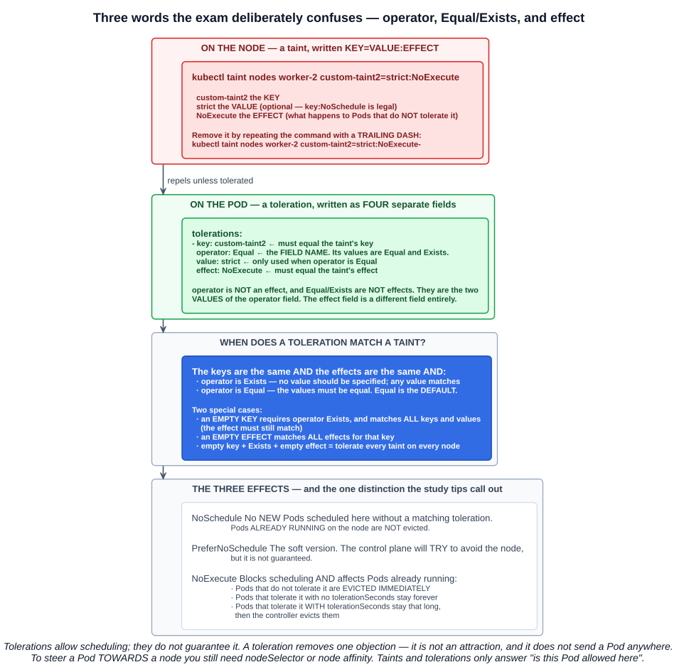
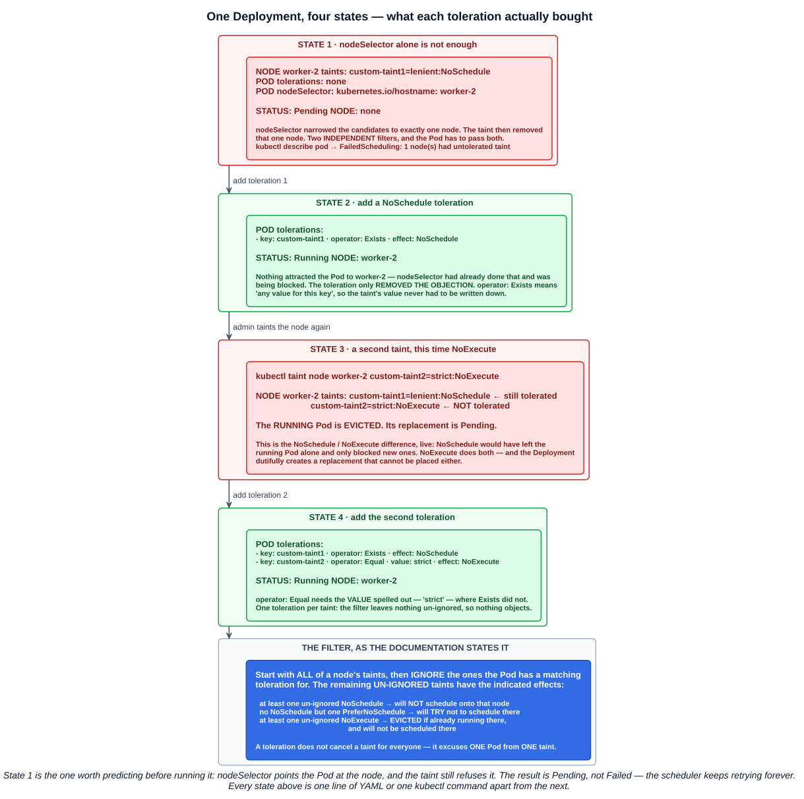

# 06 — Taints and tolerations

Chapter 05-05 listed taints and tolerations as one of the inputs to filtering. This chapter is that input in full: the mechanism that lets a **node refuse work**, and the mechanism that lets a **Pod be excused**.

---

## 1. The direction matters

> Node affinity is a property of **Pods** that **attracts** them to a set of nodes. **Taints are the opposite — they allow a node to repel a set of pods.**

| | Applied to | Says |
|---|---|---|
| **Taint** | **Nodes** | *"Do not accept any Pods that do not have a matching toleration."* |
| **Toleration** | **Pods** | *"I am allowed on nodes carrying this taint."* |

> **Tolerations allow scheduling but don't guarantee scheduling**: the scheduler also evaluates other parameters as part of its function.

That sentence is the single most useful one in the topic. **A toleration is not an attraction.** It removes an objection; it does not send the Pod anywhere. Steering a Pod *towards* a node is still `nodeSelector` or node affinity (chapter 05-05) — these two mechanisms answer different questions:

- `nodeSelector` / affinity: **which nodes do I want?**
- taints / tolerations: **which nodes will have me?**

A Pod has to pass **both** filters, and that is the whole lab in section 5.

---

## 2. The control-plane taint

The most common taint in any cluster is one nobody applied by hand:

```
node-role.kubernetes.io/control-plane:NoSchedule
```

**kubeadm-built clusters taint the control-plane node by default**, so ordinary workloads never land on the machine running the API server, scheduler and etcd. This is why `kubectl describe node` on a control plane shows a `Taints:` line while a worker usually shows `Taints: <none>`.

**Lightweight distributions do not do this.** k3s, MicroK8s and kind either remove the taint during setup or never apply it, because on a single-node lab cluster a tainted control plane would leave nowhere to run anything.

So the same `kubectl describe node` command gives different output on two clusters that are otherwise equivalent — and that is a configuration choice of the installer, not a Kubernetes behaviour. It is also the explanation from chapter 04-06 for why a DaemonSet appears to "skip" the control plane on a kubeadm cluster: **the control-plane taint is not in the DaemonSet controller's list of automatic tolerations.**

```bash
kubectl describe node control-plane | grep -i taint
kubectl get nodes -o custom-columns=NAME:.metadata.name,TAINTS:.spec.taints
```

---

## 3. Anatomy: KEY=VALUE:EFFECT



### 3.1 On the node

```bash
kubectl taint nodes worker-2 custom-taint2=strict:NoExecute
```

| Part | Meaning |
|---|---|
| **`custom-taint2`** | the **key** |
| **`strict`** | the **value** — optional; `key:NoSchedule` with no value is legal |
| **`NoExecute`** | the **effect** — what happens to Pods that do *not* tolerate it |

Removing a taint is the same command with a **trailing dash**:

```bash
kubectl taint nodes worker-2 custom-taint2=strict:NoExecute-
```

### 3.2 On the Pod

The same information, but split across **four separate fields**:

```yaml
tolerations:
- key: "custom-taint2"
  operator: "Equal"
  value: "strict"
  effect: "NoExecute"
```

**This is the distinction the study tips single out, and it is worth being pedantic about:**

- **`operator`** is a **field name**.
- **`Equal`** and **`Exists`** are the two **values that field can hold**. They are *not* effects.
- **`effect`** is a **different field entirely**, holding `NoSchedule`, `PreferNoSchedule` or `NoExecute`.

A question that offers `Exists` as an "effect", or `NoSchedule` as an "operator", is testing exactly this confusion.

### 3.3 When does a toleration match a taint?

> A toleration "matches" a taint if **the keys are the same and the effects are the same**, and:
> - the `operator` is **`Exists`** (in which case **no `value` should be specified**), or
> - the `operator` is **`Equal`** and the values should be equal.

**The default value for `operator` is `Equal`.** Omit it and you are using `Equal`, which means the `value` must match.

Two special cases:

| Rule | Effect |
|---|---|
| **Empty `key`** | The operator **must** be `Exists`. Matches **all keys and values** — but **the effect still has to match** |
| **Empty `effect`** | Matches **all effects** for that key |
| **Both empty, with `Exists`** | Tolerates **every taint on every node**. This is what a cluster-wide DaemonSet uses |

```yaml
tolerations:
- operator: "Exists"      # no key, no value, no effect — tolerate everything
```

### 3.4 The three effects

| Effect | New Pods | Pods already running |
|---|---|---|
| **`NoSchedule`** | **Not scheduled** without a matching toleration | **Not evicted** — they keep running |
| **`PreferNoSchedule`** | The control plane will **try** to avoid the node, **but it is not guaranteed** | Not evicted |
| **`NoExecute`** | **Not scheduled** without a matching toleration | **Evicted** |

**The `NoSchedule` versus `NoExecute` distinction is the other thing the study tips flag**, and it is a clean exam question: `NoSchedule` is *forward-looking only*, `NoExecute` is *retroactive as well*.

`NoExecute` has three sub-cases:

> - Pods that **do not tolerate** the taint are **evicted immediately**
> - Pods that tolerate the taint **without specifying `tolerationSeconds`** remain bound **forever**
> - Pods that tolerate the taint **with a specified `tolerationSeconds`** remain bound for that time, after which the **node lifecycle controller evicts** them

```yaml
tolerations:
- key: "key1"
  operator: "Equal"
  value: "value1"
  effect: "NoExecute"
  tolerationSeconds: 3600     # stay 1 hour after the taint appears, then go
```

**`tolerationSeconds` only means anything with `NoExecute`** — there is nothing to count down for an effect that never evicts. If the taint is removed before the time elapses, the Pod is not evicted at all.

---

## 4. Multiple taints: a filter

A node can carry several taints and a Pod several tolerations. The documentation describes the resolution as a filter:

> Start with **all of a node's taints**, then **ignore the ones for which the pod has a matching toleration**; the **remaining un-ignored taints have the indicated effects** on the pod.

| Un-ignored taints remaining | Result |
|---|---|
| At least one **`NoSchedule`** | **Will not** schedule onto that node |
| No `NoSchedule`, but at least one **`PreferNoSchedule`** | Will **try** not to schedule there |
| At least one **`NoExecute`** | **Evicted** if already running there, and **will not be scheduled** there |

A consequence worth holding onto: **a toleration does not cancel a taint for everyone.** It excuses **one Pod** from **one taint**. Other Pods still see the full set.

And the asymmetry in that table produces a genuinely surprising case. Taint a node three times and tolerate only the first two:

```bash
kubectl taint nodes node1 key1=value1:NoSchedule
kubectl taint nodes node1 key1=value1:NoExecute
kubectl taint nodes node1 key2=value2:NoSchedule      # untolerated
```

> In this case, the pod **will not be able to schedule** onto the node, because there is no toleration matching the third taint. **But it will be able to continue running if it is already running on the node** when the taint is added, because the third taint is the only one of the three that is not tolerated.

**A Pod can be in a state where it is running somewhere it could never be scheduled.** The un-ignored taint is `NoSchedule`, which blocks placement and evicts nothing.

### A note that connects back to chapter 05-05

> If you manually specify the **`.spec.nodeName`** for a Pod, that action **bypasses the scheduler**; the Pod is then bound onto the node where you assigned it, **even if there are `NoSchedule` taints on that node**. If this happens and the node also has a **`NoExecute`** taint set, **the kubelet will eject the Pod** unless there is an appropriate toleration.

`nodeName` skips the scheduler, so it skips `NoSchedule` — which is a scheduler-side decision. It does **not** skip `NoExecute`, because that one is enforced by the **kubelet and the eviction controller**, which are still in the path.

---

## 5. The lab



The whole demonstration is one Deployment and two `kubectl taint` commands.

### State 1 — nodeSelector alone is not enough

```bash
kubectl taint nodes worker-2 custom-taint1=lenient:NoSchedule
```

```yaml
# test-taint.yaml
apiVersion: apps/v1
kind: Deployment
metadata:
  labels:
    app: test-taint
  name: test-taint
spec:
  replicas: 1
  selector:
    matchLabels:
      app: test-taint
  template:
    metadata:
      labels:
        app: test-taint
    spec:
      nodeSelector:
        kubernetes.io/hostname: worker-2
      containers:
      - image: nginx
        name: nginx
```

```
NAME                          READY   STATUS    NODE
test-taint-5987d59468-kdntx   0/1     Pending   <none>
```

**`nodeSelector` narrowed the candidate nodes to exactly one. The taint then removed that one.** Two independent filters in the same filtering step, and the Pod has to clear both. The event says so directly:

```bash
kubectl describe pod -l app=test-taint | grep -A4 Events
# Warning  FailedScheduling  0/3 nodes are available:
#   1 node(s) had untolerated taint {custom-taint1: lenient},
#   2 node(s) didn't match Pod's node affinity/selector.
```

Note the Pod is **`Pending`, not `Failed`** — the scheduler will keep retrying forever, so fixing either filter resolves it without recreating anything.

### State 2 — add a NoSchedule toleration

```yaml
      tolerations:
      - key: "custom-taint1"
        operator: "Exists"
        effect: "NoSchedule"
```

```bash
kubectl apply -f test-taint.yaml
```

```
NAME                          READY   STATUS    NODE
test-taint-5987d59468-c7x7f   1/1     Running   worker-2
```

**Nothing attracted the Pod to `worker-2`** — `nodeSelector` had already done that and was being blocked. The toleration only removed the objection, and `operator: Exists` means *"any value for this key"*, so the taint's value (`lenient`) never had to appear in the manifest.

### State 3 — a NoExecute taint evicts what is already there

```bash
kubectl taint node worker-2 custom-taint2=strict:NoExecute
```

```
NAME                          READY   STATUS    NODE
test-taint-5987d59468-kdntx   0/1     Pending   <none>
```

**The running Pod is gone.** Two things happened at once, and separating them is the point of the exercise:

1. The **running** Pod did not tolerate `custom-taint2`, so `NoExecute` **evicted** it. Had the taint been `NoSchedule`, that Pod would still be running.
2. The Deployment's ReplicaSet noticed a missing replica and created a **replacement** — which cannot be scheduled either, because the same un-ignored `NoExecute` taint also blocks placement.

So the Deployment ends up in a loop it cannot resolve on its own. `custom-taint1` is still tolerated and still irrelevant; only the new taint matters.

### State 4 — add the second toleration

```yaml
      tolerations:
      - key: "custom-taint1"
        operator: "Exists"
        effect: "NoSchedule"
      - key: "custom-taint2"
        operator: "Equal"
        value: "strict"
        effect: "NoExecute"
```

```
NAME                          READY   STATUS    NODE
test-taint-xxxxxxxxxx-xxxxx   1/1     Running   worker-2
```

Two tolerations, two taints, nothing un-ignored. Note the deliberate contrast in the manifest: the first uses **`Exists`** and omits `value`; the second uses **`Equal`** and must spell out `strict`.

### Cleaning up

```bash
kubectl taint nodes worker-2 custom-taint1=lenient:NoSchedule-
kubectl taint nodes worker-2 custom-taint2=strict:NoExecute-
kubectl delete -f test-taint.yaml
```

---

## 6. Taints Kubernetes applies for you

The node controller taints nodes automatically when conditions go bad. **The scheduler checks taints, not node conditions** — the conditions are translated into taints first, so there is only one mechanism to reason about.

| Built-in taint | Applied when |
|---|---|
| **`node.kubernetes.io/not-ready`** | The `Ready` condition is **`False`** |
| **`node.kubernetes.io/unreachable`** | The `Ready` condition is **`Unknown`** — the node controller cannot reach it |
| **`node.kubernetes.io/memory-pressure`** | The node is low on memory |
| **`node.kubernetes.io/disk-pressure`** | The node is low on disk |
| **`node.kubernetes.io/pid-pressure`** | The node is low on PIDs |
| **`node.kubernetes.io/network-unavailable`** | The node's network is unavailable |
| **`node.kubernetes.io/unschedulable`** | The node is cordoned |
| **`node.cloudprovider.kubernetes.io/uninitialized`** | An external cloud provider has not finished initialising the node |

**`not-ready` and `unreachable` get the `NoExecute` effect**, which is what drains a failed node. The others are `NoSchedule`.

And Kubernetes adds tolerations for you, which explains behaviour you would otherwise find strange:

- **Every Pod** automatically gets tolerations for **`not-ready`** and **`unreachable`** with **`tolerationSeconds=300`**, unless you set them explicitly. **That five-minute delay before Pods are rescheduled off a dead node is a default toleration, not a timeout setting.**
- **DaemonSet Pods** get **`NoExecute`** tolerations for `not-ready` and `unreachable` with **no `tolerationSeconds`**, so they are **never evicted** for those reasons — the node agent should stay while the node is sick.
- The DaemonSet controller also adds **`NoSchedule`** tolerations for `memory-pressure`, `disk-pressure`, `pid-pressure`, `unschedulable` and (host-network only) `network-unavailable`.
- Pods in the **`Guaranteed` or `Burstable` QoS classes** get a `memory-pressure` toleration; **`BestEffort` Pods do not**, so they are the ones kept off a memory-pressured node.

Since **v1.29**, taint-based eviction is handled by a separate **`taint-eviction-controller`** rather than the node controller.

---

## 7. Use cases

| Use case | Shape |
|---|---|
| **Dedicated nodes** | Taint the nodes `dedicated=groupName:NoSchedule` and give the team's Pods the matching toleration. To make them use *only* those nodes, also **label** the nodes and add node affinity — the toleration alone allows the dedicated nodes, it does not restrict the Pods to them |
| **Special hardware** | Taint GPU nodes `special=true:NoSchedule` so ordinary Pods leave room for workloads that need the hardware. The **`ExtendedResourceToleration`** admission controller can add the toleration automatically to Pods requesting the extended resource |
| **Taint-based eviction** | The built-in condition taints above, draining Pods off a node that has gone bad |

The dedicated-nodes row contains the trap: **tolerations are permission, not confinement.** A Pod tolerating `dedicated=team-a` can still be scheduled onto any untainted node in the cluster. Pinning it requires affinity as well.

---

## Exam angle

- **Taints apply to NODES and repel; tolerations apply to PODS and permit.** A Pod without a matching toleration is not accepted by a tainted node.
- **A toleration allows scheduling, it does not guarantee or cause it.** To send a Pod *to* a node you still need `nodeSelector` or node affinity — `nodeSelector` plus an untolerated taint leaves the Pod **`Pending`**.
- **The taint format is `KEY=VALUE:EFFECT`**, applied with `kubectl taint nodes <node> key=value:Effect` and removed by repeating the command with a **trailing dash**.
- **`operator` is a field whose values are `Equal` (the default) and `Exists`. They are not effects.** `Exists` takes **no `value`**; `Equal` requires the values to match.
- **A toleration matches when the keys match AND the effects match AND the operator condition holds.** An **empty key with `Exists`** matches all keys and values (the effect must still match); an **empty effect** matches all effects.
- **`NoSchedule` blocks new Pods and does NOT evict running ones. `NoExecute` blocks new Pods AND evicts running ones.** `PreferNoSchedule` is the soft version — the control plane *tries* to avoid the node but it is **not guaranteed**.
- **`tolerationSeconds` is only meaningful with `NoExecute`** — how long a tolerating Pod stays bound once the taint appears, after which it is evicted. No `tolerationSeconds` means it stays indefinitely.
- **Multiple taints are a filter:** ignore the tolerated ones, and the remainder take effect. One un-ignored `NoSchedule` is enough to block placement — while leaving an already-running Pod alone.
- **kubeadm taints the control-plane node `node-role.kubernetes.io/control-plane:NoSchedule`; k3s, MicroK8s and kind do not.** This is an installer choice, and it is why a DaemonSet may appear to skip the control plane on one cluster and not another.
- **Kubernetes adds a 300-second toleration for `not-ready` and `unreachable` to every Pod**, and gives **DaemonSet Pods `NoExecute` tolerations with no `tolerationSeconds`** so they survive node problems.
- **`.spec.nodeName` bypasses `NoSchedule`** (a scheduler decision) **but not `NoExecute`** — the kubelet still ejects an untolerating Pod.

## References

- [Taints and Tolerations](https://kubernetes.io/docs/concepts/scheduling-eviction/taint-and-toleration/) — matching rules, the three effects, the multi-taint filter, built-in condition taints
- [Assigning Pods to Nodes](https://kubernetes.io/docs/concepts/scheduling-eviction/assign-pod-node/) — `nodeSelector` and affinity, the attracting half of the pair
- [kubectl taint](https://kubernetes.io/docs/reference/generated/kubectl/kubectl-commands#taint) — the imperative command and its flags
- [Creating a cluster with kubeadm](https://kubernetes.io/docs/setup/production-environment/tools/kubeadm/create-cluster-kubeadm/) — the control-plane taint applied at install time
