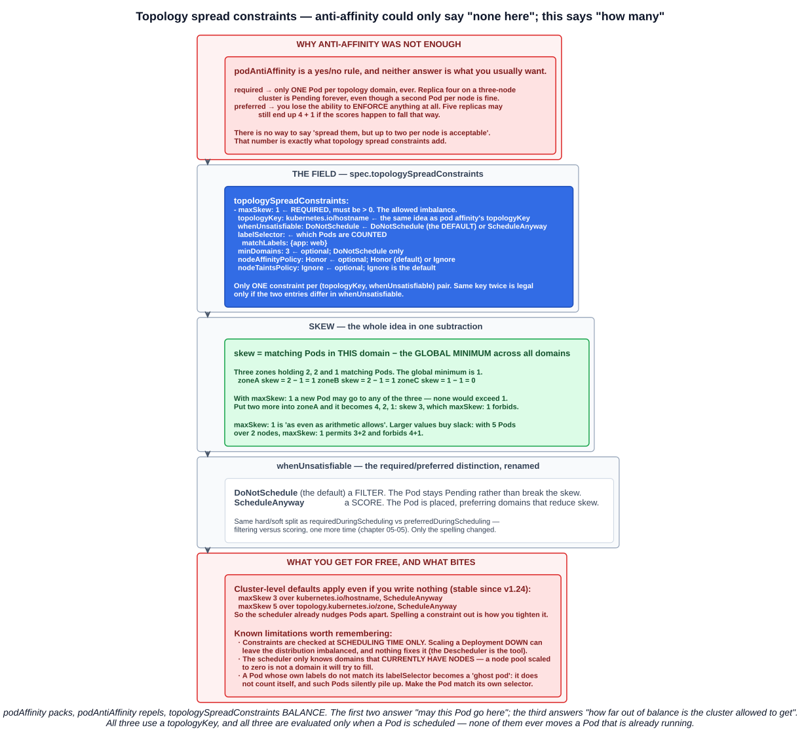

# 07 — Affinity and anti-affinity

Chapter 05-05 covered `nodeSelector`: exact-match on node labels, and nothing else. Chapter 05-06 covered taints, which repel. Affinity is the expressive version of the attracting half — rules about **which nodes a Pod should run on**, and rules about **which other Pods it should run near or away from**.

---

## 1. The two types, and why there are exactly two

> - **`requiredDuringSchedulingIgnoredDuringExecution`**: The scheduler **can't schedule the Pod unless the rule is met**. This functions like `nodeSelector`, but with a more expressive syntax.
> - **`preferredDuringSchedulingIgnoredDuringExecution`**: The scheduler **tries** to find a node that meets the rule. **If a matching node is not available, the scheduler still schedules the Pod.**


These are not two strengths of the same mechanism. **They plug into the two different stages of chapter 05-05:**

| | Stage | Behaviour | If nothing matches |
|---|---|---|---|
| **`required...`** | **Filtering** | Nodes that do not match are **removed from the feasible set** | The Pod stays **`Pending`** |
| **`preferred...`** | **Scoring** | Matching nodes get their **weight added to their score** | The Pod is **scheduled anyway**, somewhere else |

That is the whole of the study-tips page, and it is the distinction to carry into a question: **`required` is mandatory, `preferred` is best effort.** The giveaway is always *what happens when nothing matches*.

It also explains two asymmetries in the syntax that look arbitrary otherwise:

- **Only `preferred` has a `weight`.** Filtering is a yes/no question — there is nothing to rank.
- **Only `required` can leave a Pod `Pending`.** A score boost cannot block anything.

### What `IgnoredDuringExecution` means

> `IgnoredDuringExecution` means that **if the node labels change after Kubernetes schedules the Pod, the Pod continues to run.**

**Affinity is evaluated once, at scheduling time.** Remove the label that got a Pod placed and nothing happens to that Pod — in sharp contrast to a `NoExecute` taint (chapter 05-06), which *does* evict. The rule is only re-evaluated at the **next scheduling decision**: a delete, a rescheduled replica, or `kubectl replace --force`.

A `RequiredDuringSchedulingRequiredDuringExecution` variant was designed but **has never been implemented**, which is why every field name you will ever type ends in `IgnoredDuringExecution`.

---

## 2. Node affinity

> **Node affinity allows you to specify rules about which nodes your Pods should be scheduled to based on node labels**, specified in the Pod specification.

Conceptually `nodeSelector` with a real query language. It lives at **`spec.affinity.nodeAffinity`**.

### 2.1 The lab — a required rule

Label a node:

```bash
kubectl label node/worker-1 disktype=ssd
kubectl get nodes --show-labels
```

```
NAME       STATUS  ROLES    LABELS
worker-1   Ready   <none>   ...,disktype=ssd,kubernetes.io/hostname=worker-1,...
worker-2   Ready   <none>   ...,kubernetes.io/hostname=worker-2,...
```

Then ask for it:

```yaml
apiVersion: v1
kind: Pod
metadata:
  labels:
    run: node-affinity
  name: node-affinity
spec:
  affinity:
    nodeAffinity:
      requiredDuringSchedulingIgnoredDuringExecution:
        nodeSelectorTerms:
        - matchExpressions:
          - key: disktype
            operator: In
            values:
            - ssd
  containers:
  - image: nginx
    name: node-affinity
```

The Pod runs on `worker-1`, because it is the only node carrying `disktype=ssd`.

**Change the manifest so the labels no longer match** — ask for `disktype=nvme` when no node has it — and redeploy:

```bash
kubectl replace --force -f node-affinity.yaml
kubectl get pods -o wide
```

The Pod is **`Pending`** with no node. `required` removed every candidate, and nothing is left. Add the label the Pod is now asking for:

```bash
kubectl label node/worker-2 disktype=nvme
kubectl replace --force -f node-affinity.yaml     # schedules onto worker-2
```

**`kubectl replace --force` is doing real work here** (chapter 04-03). Labelling the node is not enough on its own — a Pending Pod *would* eventually schedule, but an already-running Pod will not move, because `IgnoredDuringExecution`. `replace --force` deletes and recreates the Pod, which forces a fresh scheduling decision.

### 2.2 The structure, and the OR/AND rule

The nesting has four levels and the plurals matter:

```
requiredDuringSchedulingIgnoredDuringExecution:
  nodeSelectorTerms:            # a LIST of terms
  - matchExpressions:           # a LIST of expressions inside one term
    - key: ...
      operator: ...
      values: [...]
```

> If you specify **multiple terms in `nodeSelectorTerms`**, then the Pod can be scheduled onto a node if **one of the specified terms can be satisfied (terms are ORed)**.
>
> If you specify **multiple expressions in a single `matchExpressions`** field, then the Pod can be scheduled onto a node **only if all the expressions are satisfied (expressions are ANDed)**.

**Terms OR, expressions AND.**

A term can also carry **`matchFields`** instead of (or alongside) `matchExpressions` — the same `key`/`operator`/`values` shape, but querying a node's **fields** rather than its labels. In practice the only field anyone uses is **`metadata.name`**, which makes it the affinity equivalent of `nodeName` while still going through the scheduler.

One more rule worth knowing:

> If you specify **both `nodeSelector` and `nodeAffinity`, *both* must be satisfied** for the Pod to be scheduled onto a node.

### 2.3 Operators

| Operator | Behaviour | Available in |
|---|---|---|
| **`In`** | The label value is **present in** the supplied set of strings | node + pod affinity |
| **`NotIn`** | The label value is **not contained in** the supplied set | node + pod affinity |
| **`Exists`** | **A label with this key exists** on the object (no `values`) | node + pod affinity |
| **`DoesNotExist`** | **No label with this key exists** | node + pod affinity |
| **`Gt`** | The label value parses as an integer and is **greater than** this integer | **`nodeAffinity` only** |
| **`Lt`** | The label value parses as an integer and is **less than** this integer | **`nodeAffinity` only** |

> **`NotIn` and `DoesNotExist` allow you to define node anti-affinity behavior.**

There is **no `nodeAntiAffinity` field** — negative operators are how you express it. (Taints are the other way to repel Pods from nodes, from chapter 05-06.) `Gt` and `Lt` fail scheduling outright if the value does not parse as an integer.

### 2.4 Preferred rules and weights

```yaml
spec:
  affinity:
    nodeAffinity:
      preferredDuringSchedulingIgnoredDuringExecution:
      - weight: 20
        preference:
          matchExpressions:
          - key: disktype
            operator: In
            values:
            - nvme
      - weight: 10
        preference:
          matchExpressions:
          - key: disktype
            operator: In
            values:
            - ssd
```

Note the field name change: `required` holds **`nodeSelectorTerms`**, `preferred` holds **`preference`** under each weighted entry.

> You can specify a **`weight` between 1 and 100** for each instance... the scheduler **iterates through every preferred rule that the node satisfies and adds the value of the `weight` for that expression to a sum**. The final sum is **added to the score of other priority functions** for the node.

With `worker-2` labelled `disktype=nvme` and `worker-1` labelled `disktype=ssd`, the preference order is:

```
nvme (+20)   ->   ssd (+10)   ->   any node (+0, still scheduled)
```

**A preferred rule can still lose.** The weight is added to a total that other scoring functions also contribute to — if `worker-2` is heavily loaded, a +20 may not be enough to beat `worker-1`. This is the difference between "prefer" and "require" in one sentence: the preferred rule is an *input* to a decision, not the decision.

---

## 3. Inter-pod affinity and anti-affinity


> Inter-pod affinity and anti-affinity allow you to **constrain which nodes your Pods can be scheduled on based on the labels of Pods already running on that node**, instead of the node labels.

One question separates all three rules: **whose labels am I reading?**

| | Reads | Means |
|---|---|---|
| **`nodeAffinity`** | **Node** labels | *"Put me on a node that looks like this"* |
| **`podAffinity`** | Labels of **Pods already running** | *"Put me where those Pods already are"* — co-location |
| **`podAntiAffinity`** | Labels of **Pods already running** | *"Keep me away from those Pods"* — separation |

**Pod affinity is the best-friend rule:** these Pods need to be together. **Pod anti-affinity is the opposite:** these Pods must not, or should not, share a place. The usual reasons for each:

| `podAffinity` | `podAntiAffinity` |
|---|---|
| Services that communicate constantly — co-locate for latency | **Distribute replicas** across nodes |
| Shared cache or local data locality | **Reduce the single point of failure** |
| Avoid cross-zone network charges | **Balance workloads** evenly |

Both take the same two forms as node affinity — `required` (a filter) and `preferred` (a score boost) — and both are `IgnoredDuringExecution`.

### 3.1 The lab — forcing two Pods onto the same node

A backend Pod carrying a label, and a frontend Pod that demands to be with it:

```yaml
apiVersion: v1
kind: Pod
metadata:
  labels:
    run: pod-affinity-backend
    role: backend            # <- the label the other Pod will select on
  name: pod-affinity-backend
spec:
  containers:
  - image: redis
    name: pod-affinity-backend
---
apiVersion: v1
kind: Pod
metadata:
  labels:
    run: pod-affinity-frontend
  name: pod-affinity-frontend
spec:
  affinity:
    podAffinity:
      requiredDuringSchedulingIgnoredDuringExecution:
      - labelSelector:                       # selects PODS, not nodes
          matchExpressions:
          - key: role
            operator: In
            values:
            - backend
        topologyKey: kubernetes.io/hostname  # "same node"
  containers:
  - image: nginx
    name: pod-affinity-frontend
```

Read the rule out loud: **place this Pod only on a node that already has a Pod labelled `role=backend`.** Because `topologyKey` is `kubernetes.io/hostname`, "already has" means *on that exact machine*. The scheduler puts the frontend wherever the backend landed — or leaves it `Pending` if there is no such Pod anywhere.

Two structural differences from node affinity are worth noticing:

- **`labelSelector`, not `matchExpressions` directly.** The selector is a full label query, the same grammar as a Service selector (chapter 04-12), because it is selecting **Pods**.
- **`topologyKey` is a sibling of `labelSelector`** and is **mandatory**.

The `preferred` form has its own field-name trap. Node affinity wraps each weighted entry in **`preference`**; pod affinity wraps it in **`podAffinityTerm`**:

```yaml
    podAntiAffinity:
      preferredDuringSchedulingIgnoredDuringExecution:
      - weight: 100
        podAffinityTerm:            # NOT 'preference'
          labelSelector:
            matchLabels:
              app: web
          topologyKey: kubernetes.io/hostname
```

That one is the standard "spread my replicas, but run them all anyway" rule — the most common use of anti-affinity in practice. Swap it for `required` and the surplus replicas stay `Pending` once every node already holds one.

### 3.2 Which rules actually get evaluated

A pod-affinity rule is a question about the *current state of the cluster*, so it matters whose rules are consulted when a new Pod arrives. The answer is not symmetrical:

| Rule | Honoured when scheduling a new Pod? |
|---|---|
| **The new Pod's `required`** affinity and anti-affinity | **Yes** — hard constraints, applied during node filtering |
| **The new Pod's `preferred`** affinity and anti-affinity | **Yes** — soft constraints, applied during scoring |
| **Existing Pods' `required` anti-affinity** | **Yes** — an existing Pod can refuse to have you as a neighbour |
| **Existing Pods' `preferred`** affinity and anti-affinity | **No. Ignored entirely** |

That third row is what produces the `node(s) didn't satisfy existing pods anti-affinity rules` message in section 6: **your manifest can be completely clean and still be rejected**, because a Pod that is already running declared a hard rule excluding Pods like yours.

The fourth row is the one to remember for a question: **a `preferred` rule only influences the scheduling of the Pod that declares it.** It has no retroactive pull on anything scheduled later.

### 3.3 The bootstrap problem

A Deployment whose Pods are affine to *their own* label looks like it cannot ever start — the first Pod needs a matching Pod to sit next to, and there is none. Kubernetes handles this explicitly:

> If the current Pod being scheduled is **the first in a series that have affinity to themselves**, it is **allowed to be scheduled if it passes all other affinity checks**... This ensures that **there will not be a deadlock** even if all the Pods have inter-pod affinity specified.

So the first replica places itself freely and every later one follows it. Without that rule, self-referential `podAffinity` would be unusable.

### 3.4 Namespaces

Pod labels are namespaced, so a Pod selector needs to know where to look.

> If omitted or empty, **`namespaces` defaults to the namespace of the Pod where the affinity/anti-affinity definition appears.**

There is also **`namespaceSelector`** (stable since **v1.24**), a label query over namespaces. **An empty `namespaceSelector` (`{}`) matches all namespaces**, while a null one falls back to the rule's own namespace.

Two optional beta fields narrow the selection further, and both exist for the same reason — selecting Pods *of the same revision* without rewriting the manifest each time:

- **`matchLabelKeys`** — label keys read off the **incoming Pod**, whose values are ANDed onto the `labelSelector`. Pointing it at **`pod-template-hash`** (chapter 04-05) makes a rule apply only to Pods from the same Deployment revision.
- **`mismatchLabelKeys`** — the inverse: match Pods whose values for those keys **differ** from the incoming Pod's.

### 3.5 The cost

> Inter-pod affinity and anti-affinity **require substantial amounts of processing which can slow down scheduling in large clusters significantly. We do not recommend using them in clusters larger than several hundred nodes.**

Node affinity carries no such warning — reading a node's labels is cheap. Pod affinity has to examine **the Pods already running across the cluster**, for every scheduling decision. For simple spreading, **topology spread constraints** are the cheaper modern tool — section 5.

---

## 4. topologyKey


This is the part of pod affinity that has no equivalent anywhere else in Kubernetes, and it is the part that does not stick. The docs state the rule as a sentence with two blanks:

> *"This Pod **should (or should not) run in an X** if that **X is already running one or more Pods that meet rule Y**"*, where **X is a topology domain** like node, rack, cloud provider zone or region, and **Y is the rule**.

- **`labelSelector` is Y** — *which* Pods am I talking about?
- **`topologyKey` is X** — what counts as **the same place** as those Pods?

Without X the rule is meaningless. "Schedule me with the backend" — in the same *what*? The same machine, the same rack, the same region? Those are very different instructions, and **that is why `topologyKey` is required and may never be empty.**

### 4.1 It names a node label key, not a value

> You express the topology domain (X) using a `topologyKey`, which is **the key for the node label that the system uses to denote the domain**.

**Two nodes are in the same topology domain when they carry the same *value* for that key.**

| `topologyKey` | The domains it creates |
|---|---|
| **`kubernetes.io/hostname`** | `node-1` has `=node-1`, `node-2` has `=node-2` — **every node is its own domain**, because every value differs. "Same domain" means **same machine** |
| **`topology.kubernetes.io/zone`** | `node-1` and `node-2` both have `=us-east-1a` → **one** domain. `node-3` and `node-4` have `=us-east-1b` → a second. "Same domain" means **same availability zone**, across several machines |
| **`topology.kubernetes.io/region`** | Wider still — a whole geographic region |

**The narrower the scope, the more precise the placement control.** The same rule with a different `topologyKey` gives a completely different guarantee:

| Rule | `kubernetes.io/hostname` | `topology.kubernetes.io/zone` |
|---|---|---|
| **`podAffinity`** | Same physical host — fastest communication, worst blast radius | Same AZ — low latency and no cross-zone egress, still two machines |
| **`podAntiAffinity`** | **One replica per node** | **One replica per zone** — survives losing an entire AZ |

Same `labelSelector`, same effect type. Only `topologyKey` changed.

### 4.2 Two constraints on what you can put there

> - For Pod affinity and anti-affinity, **an empty `topologyKey` field is not allowed** in either form.
> - For **`requiredDuringSchedulingIgnoredDuringExecution` Pod anti-affinity** rules, the admission controller **`LimitPodHardAntiAffinityTopology` limits `topologyKey` to `kubernetes.io/hostname`.** You can modify or disable the admission controller if you want to allow custom topologies.

So a *hard* anti-affinity rule is restricted to per-node spreading by default. An admission controller (chapter 05-01) enforcing a scheduling constraint — the stages keep showing up in each other's topics.

### 4.3 The labelling trap

> Pod anti-affinity **requires nodes to be consistently labeled** — in other words, **every node in the cluster must have an appropriate label matching `topologyKey`**. If some or all nodes are missing the specified `topologyKey` label, **it can lead to unintended behavior**.

A node with no value for the key is in no domain at all, so the rule cannot reason about it.

- **`kubernetes.io/hostname` is always safe** — the kubelet sets it on every node (chapter 05-05).
- **`topology.kubernetes.io/zone` is set by cloud providers** and is usually **absent on a bare-metal or k3s lab cluster**, so a zone-scoped rule there may silently do nothing useful.

```bash
kubectl get nodes -L topology.kubernetes.io/zone -L topology.kubernetes.io/region
```

Check before relying on it.

---

## 5. Topology spread constraints

Anti-affinity has a gap that only shows up once you try to use it for real, and this is the field that fills it.



### 5.1 Why anti-affinity was not enough

The documentation puts the limitation plainly:

> **`podAntiAffinity` repels Pods.** If you set this to `requiredDuringSchedulingIgnoredDuringExecution` mode then **only a single Pod can be scheduled into a single topology domain**; if you choose `preferredDuringSchedulingIgnoredDuringExecution` then **you lose the ability to enforce the constraint**.

That is a yes/no rule, and neither answer is usually what you want:

- **`required`** means *at most one Pod per domain, ever.* On a three-node cluster, replica four is `Pending` indefinitely — even though two Pods on a node would have been perfectly fine.
- **`preferred`** means *no guarantee at all.* Five replicas may still land 4 + 1 if the scores fall that way.

**There is no way to say "spread them out, but up to two per node is acceptable".** That number is exactly what topology spread constraints add.

> You can use **topology spread constraints** to control **how Pods are spread across your cluster among failure-domains** such as regions, zones, nodes, and other user-defined topology domains. This can help to achieve **high availability as well as efficient resource utilization**.

### 5.2 The field

```yaml
spec:
  topologySpreadConstraints:
  - maxSkew: 1
    topologyKey: kubernetes.io/hostname
    whenUnsatisfiable: DoNotSchedule
    labelSelector:
      matchLabels:
        app: web
```

| Field | Meaning |
|---|---|
| **`maxSkew`** | **Required, and must be greater than zero.** The degree to which Pods may be **unevenly distributed** |
| **`topologyKey`** | The **node label key** whose value defines a domain — the same concept as pod affinity's `topologyKey` |
| **`whenUnsatisfiable`** | **`DoNotSchedule`** (the **default**) or **`ScheduleAnyway`** |
| **`labelSelector`** | Which Pods are **counted** when measuring the distribution |
| **`minDomains`** | Optional. A **minimum number of eligible domains**; only valid with `DoNotSchedule`. Defaults to behaving as `1` |
| **`nodeAffinityPolicy`** | Optional. **`Honor`** (the default) counts only nodes matching the Pod's `nodeAffinity`/`nodeSelector`; **`Ignore`** counts all nodes |
| **`nodeTaintsPolicy`** | Optional. **`Honor`** counts untainted nodes plus tainted nodes the Pod tolerates; **`Ignore`** (the default) counts all nodes |

One structural rule:

> There can only be **one `topologySpreadConstraint` for a given `topologyKey` and `whenUnsatisfiable` value.**

So the same key may appear twice only if the two entries differ in `whenUnsatisfiable` — typically a hard per-node constraint alongside a soft per-zone one.

### 5.3 Skew

The whole mechanism is one subtraction:

```
skew  =  matching Pods in THIS domain  −  the global minimum across all domains
```

> if you select `whenUnsatisfiable: DoNotSchedule`, then `maxSkew` defines the **maximum permitted difference between the number of matching pods in the target topology and the global minimum**... For example, if you have **3 zones with 2, 2 and 1 matching pods** respectively, `MaxSkew` is set to 1 then **the global minimum is 1**.

Working that example through:

| Zone | Matching Pods | Skew |
|---|---|---|
| zoneA | 2 | 2 − 1 = **1** |
| zoneB | 2 | 2 − 1 = **1** |
| zoneC | 1 | 1 − 1 = **0** |

With `maxSkew: 1`, a new Pod may go to any of the three — none would exceed the limit. Push two more into zoneA and the counts become 4, 2, 1: a skew of **3**, which `maxSkew: 1` forbids.

**`maxSkew: 1` means "as even as arithmetic allows".** Larger values buy slack: with 5 Pods across 2 nodes, `maxSkew: 1` permits 3 + 2 and forbids 4 + 1.

`minDomains` adjusts the arithmetic rather than the rule:

> When the number of eligible domains with match topology keys is **less than `minDomains`**, Pod topology spread **treats global minimum as 0**, and then the calculation of `skew` is performed.

That is what forces a workload to actually reach into unused zones rather than balancing neatly inside the one zone it started in.

### 5.4 `whenUnsatisfiable` is required/preferred under a different name

| | Behaviour | Equivalent to |
|---|---|---|
| **`DoNotSchedule`** (default) | A **filter** — the Pod stays **`Pending`** rather than break the skew | `requiredDuringScheduling...` |
| **`ScheduleAnyway`** | A **score** — the Pod is placed, giving **higher precedence to topologies that would help reduce the skew** | `preferredDuringScheduling...` |

Filtering versus scoring, one more time (chapter 05-05). Only the spelling changed.

### 5.5 Defaults you already have

Even with no `topologySpreadConstraints` written anywhere, the scheduler is already spreading Pods. Stable since **v1.24**:

> If you don't configure any cluster-level default constraints for pod topology spreading, then kube-scheduler **acts as if you specified the following default topology constraints**:
>
> ```yaml
> defaultConstraints:
>   - maxSkew: 3
>     topologyKey: "kubernetes.io/hostname"
>     whenUnsatisfiable: ScheduleAnyway
>   - maxSkew: 5
>     topologyKey: "topology.kubernetes.io/zone"
>     whenUnsatisfiable: ScheduleAnyway
> ```

Both are `ScheduleAnyway`, so they nudge rather than enforce. **Writing a constraint explicitly is how you tighten it**, not how you turn it on.

### 5.6 Known limitations

Three, and each one has caught people out:

- **Constraints are evaluated only when a Pod is scheduled.** *"There's no guarantee that the constraints remain satisfied when Pods are removed. For example, **scaling down a Deployment may result in imbalanced Pods distribution**."* Rebalancing afterwards needs an external tool such as the **Descheduler**. This is the same `IgnoredDuringExecution` idea the rest of the chapter runs on.
- **The scheduler only knows about domains that currently contain nodes.** *"They are determined from the existing nodes in the cluster."* A node pool scaled to zero is not a domain the scheduler will try to fill, which matters on autoscaled clusters.
- **Ghost Pods.** If a Pod's own labels do not match the `labelSelector` in its own spread constraint, **it does not count itself**, such Pods accumulate on one domain, and the constraint quietly does nothing useful. *"Typically, a pod should match its own topology spread constraint selector."*

### 5.7 Choosing between the three

| | What it does | Use it to |
|---|---|---|
| **`podAffinity`** | **Attracts** — pack any number of Pods into qualifying domains | Co-locate chatty services; data locality |
| **`podAntiAffinity`** | **Repels** — `required` allows only one Pod per domain; `preferred` enforces nothing | Guarantee no two Pods share a node |
| **`topologySpreadConstraints`** | **Balances** — bounds how uneven the distribution may get | Even distribution with a tolerance; HA plus efficient utilization |

The first two answer *"may this Pod go here?"*. The third answers *"how far out of balance is the cluster allowed to get?"*. All three use a `topologyKey`, and all three are evaluated **only at scheduling time**.

For plain "spread my replicas", **topology spread constraints are the better tool**: they are cheaper than inter-pod affinity, they do not carry the several-hundred-node warning, and `maxSkew` expresses what you actually meant.

---

## 6. When scheduling fails

Everything in this chapter produces the same symptom — a `Pending` Pod — and the same diagnostic:

```bash
kubectl get pods -o wide                     # STATUS Pending, NODE <none>
kubectl describe pod <name> | grep -A6 Events
```

The message names which filter rejected each node, and the wording differs by cause:

| Message | Cause |
|---|---|
| `node(s) didn't match Pod's node affinity/selector` | A required **`nodeAffinity`** or `nodeSelector` eliminated the node |
| `node(s) didn't match pod affinity rules` | **Your** required `podAffinity` found no matching Pod in that topology domain |
| `node(s) didn't match pod anti-affinity rules` | **Your** required `podAntiAffinity` found a matching Pod there already |
| `node(s) didn't satisfy existing pods anti-affinity rules` | **Someone else's** Pod has an anti-affinity rule that excludes **you** |
| `node(s) didn't match pod topology spread constraints` | A `DoNotSchedule` constraint would be violated — placing the Pod here would exceed `maxSkew` |
| `node(s) didn't match pod topology spread constraints (missing required label)` | **The node has no label for the constraint's `topologyKey`** — the labelling trap from §4.3, with its own message |
| `node(s) had untolerated taint {...}` | A taint with no matching toleration (chapter 05-06) |
| `Insufficient cpu` / `Insufficient memory` | Resource **requests** exceed what is allocatable |

That fourth message is worth reading twice. **An anti-affinity rule on a Pod that is already running can block a Pod that has no affinity configuration of its own** — your manifest is clean, and the rejection comes from somebody else's.

The count prefix is the quickest read: `0/3 nodes are available:` followed by one clause per reason, each with the number of nodes it accounts for. **If the clauses sum to every node, nothing is feasible and the Pod will wait indefinitely.**

Two more checks worth having to hand:

```bash
kubectl get nodes --show-labels                       # does the label actually exist?
kubectl get pods -o wide -l role=backend              # does the Pod a podAffinity rule wants exist?
kubectl get nodes -L topology.kubernetes.io/zone      # is the topologyKey set on every node?
```

And the behaviour that catches people out: **a `Pending` Pod will schedule itself the moment the situation is fixed, but a `Running` Pod never moves.** `IgnoredDuringExecution` means relabelling a node does nothing to Pods already on it — `kubectl replace --force` or deleting the Pod is what forces a fresh decision.

---

## Exam angle

- **`requiredDuringSchedulingIgnoredDuringExecution` is a HARD rule** — the scheduler cannot place the Pod unless it is met, so **the Pod stays `Pending`** when nothing matches. It acts during **filtering**.
- **`preferredDuringSchedulingIgnoredDuringExecution` is a SOFT rule** — the scheduler **tries**, but **still schedules the Pod elsewhere** if nothing matches. It acts during **scoring**. **`required` = mandatory, `preferred` = best effort.**
- **Only `preferred` has a `weight` (1-100)**, added to the node's score and combined with the other scoring functions — so **a preferred rule can still lose**.
- **`IgnoredDuringExecution` means label changes after scheduling do NOT evict the Pod.** Contrast with a `NoExecute` taint, which does. **`RequiredDuringExecution` was designed but never implemented.**
- **Node affinity reads NODE labels; pod affinity and anti-affinity read the labels of PODS ALREADY RUNNING.** That is the only real difference between them.
- **In `nodeSelectorTerms`, terms are ORed and expressions within one `matchExpressions` are ANDed.** If both `nodeSelector` and `nodeAffinity` are set, **both must be satisfied**.
- **Operators: `In`, `NotIn`, `Exists`, `DoesNotExist`** everywhere, plus **`Gt` and `Lt` for `nodeAffinity` only**. **There is no `nodeAntiAffinity`** — `NotIn` and `DoesNotExist` express it.
- **`topologyKey` is mandatory for pod affinity and anti-affinity and may never be empty.** It names **a node label key**, and **two nodes are in the same domain when they share that label's value**. `kubernetes.io/hostname` means per-node; `topology.kubernetes.io/zone` means per-AZ.
- **`required` pod anti-affinity is limited to `topologyKey: kubernetes.io/hostname`** by the **`LimitPodHardAntiAffinityTopology`** admission controller.
- **Pod anti-affinity needs every node consistently labelled** with the `topologyKey`, or the behaviour is undefined.
- **Inter-pod affinity and anti-affinity are expensive** — *"not recommended in clusters larger than several hundred nodes."* Node affinity carries no such warning.
- **`podAffinity` co-locates (reduce latency); `podAntiAffinity` separates (spread replicas, remove a single point of failure).**
- **When scheduling a new Pod, existing Pods' `required` anti-affinity IS honoured but their `preferred` rules are IGNORED.** A soft rule only ever influences the Pod that declares it.
- **The first Pod in a group with affinity to itself is allowed to schedule anyway**, which is what stops self-referential `podAffinity` deadlocking.
- **`topologySpreadConstraints` balances rather than attracts or repels.** `podAffinity` packs, `podAntiAffinity` repels (and `required` allows only **one** Pod per domain), and spread constraints bound **how uneven** the distribution may get.
- **`maxSkew` is required and must be greater than zero**, and **skew = matching Pods in this domain minus the global minimum across domains**. `maxSkew: 1` is as even as arithmetic allows.
- **`whenUnsatisfiable: DoNotSchedule` (the DEFAULT) filters — the Pod stays `Pending`. `ScheduleAnyway` scores** — it is the required/preferred split under a different name.
- **Cluster-level spread defaults apply with no configuration** (stable **v1.24**): **`maxSkew: 3` over `kubernetes.io/hostname`** and **`maxSkew: 5` over `topology.kubernetes.io/zone`**, both **`ScheduleAnyway`**.
- **Spread constraints are checked only at scheduling time** — **scaling a Deployment down can leave the distribution imbalanced**, and rebalancing needs the Descheduler.
- **A Pod should match its own spread constraint's `labelSelector`** — if it does not, it becomes a "ghost pod" that never counts itself.
- **`matchFields`** queries a node's fields (in practice `metadata.name`) where `matchExpressions` queries its labels.

## References

- [Assigning Pods to Nodes](https://kubernetes.io/docs/concepts/scheduling-eviction/assign-pod-node/) — node affinity, inter-pod affinity and anti-affinity, `topologyKey`, and the operator table
- [Assign Pods to Nodes using Node Affinity](https://kubernetes.io/docs/tasks/configure-pod-container/assign-pods-nodes-using-node-affinity/) — the `disktype=ssd` task this lecture follows
- [Well-Known Labels, Annotations and Taints](https://kubernetes.io/docs/reference/labels-annotations-taints/) — `kubernetes.io/hostname`, `topology.kubernetes.io/zone` and `topology.kubernetes.io/region`
- [Pod Topology Spread Constraints](https://kubernetes.io/docs/concepts/scheduling-eviction/topology-spread-constraints/) — `maxSkew`, `whenUnsatisfiable`, the cluster-level defaults, and the comparison with pod affinity
