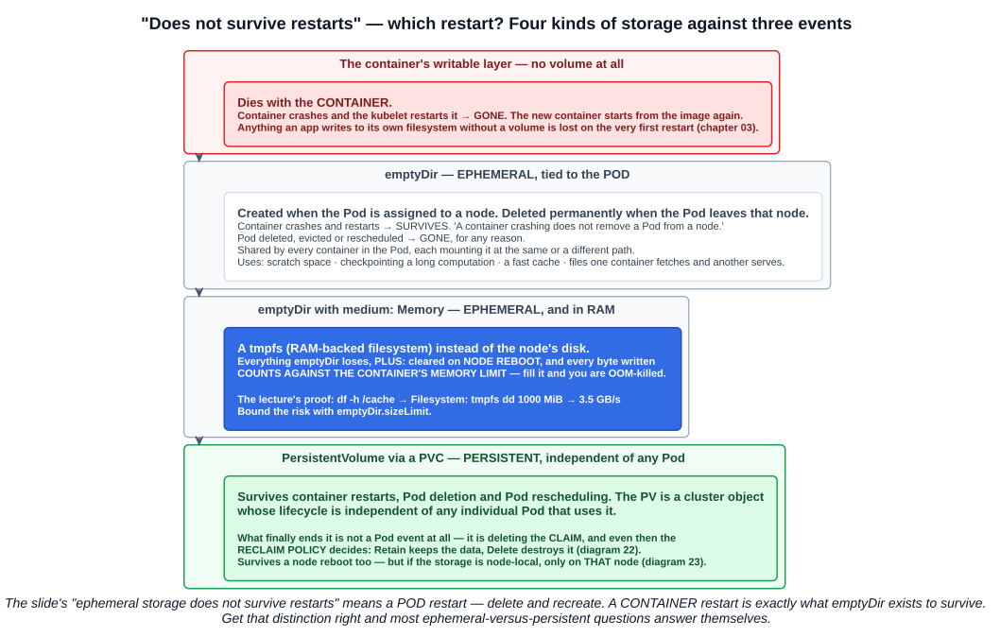
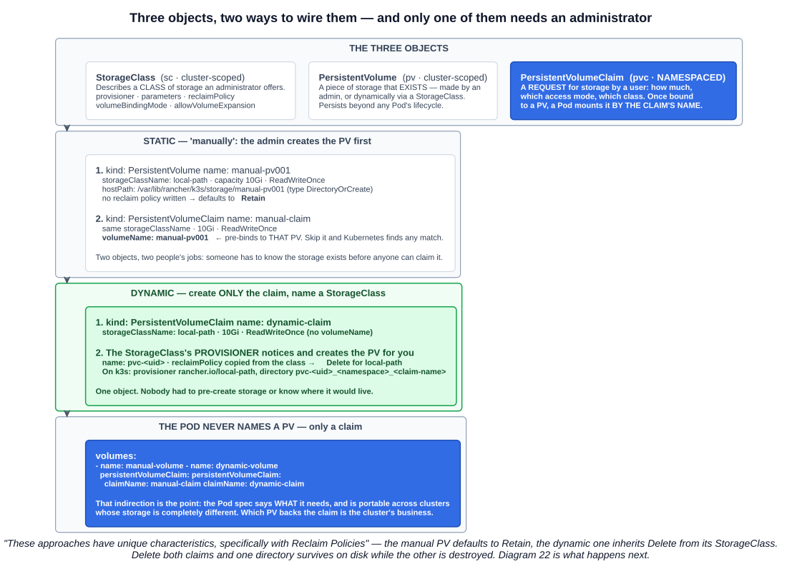
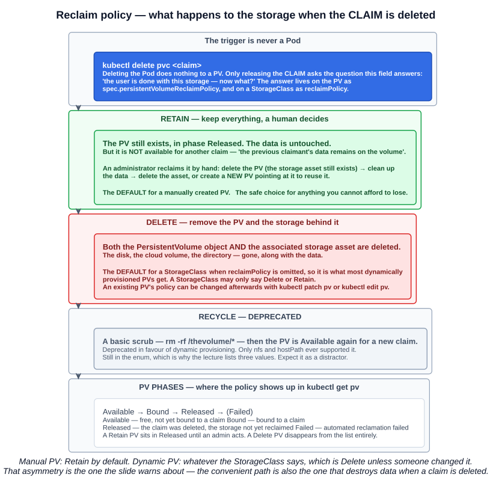
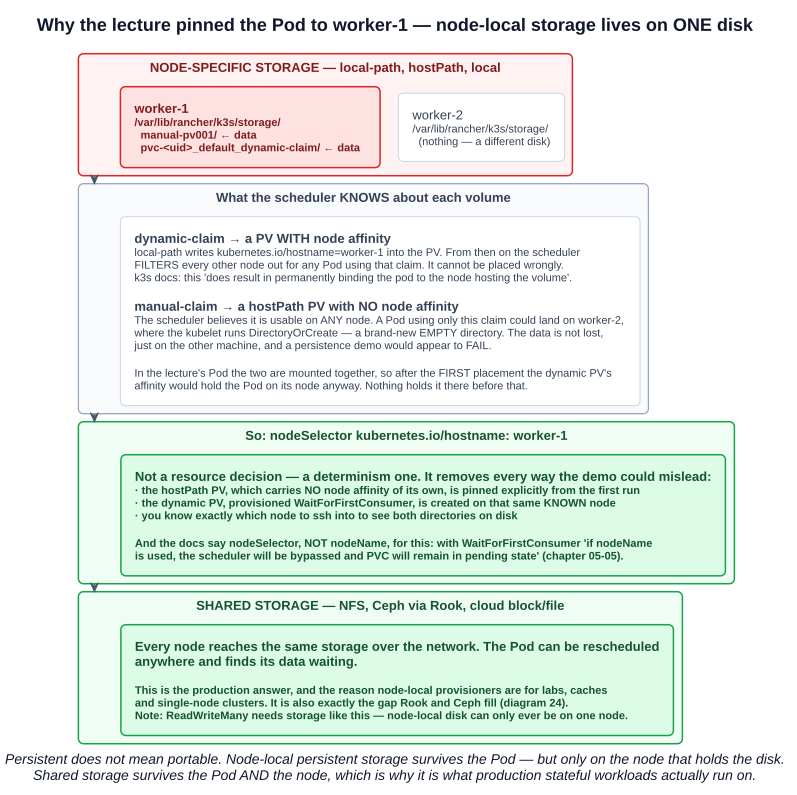
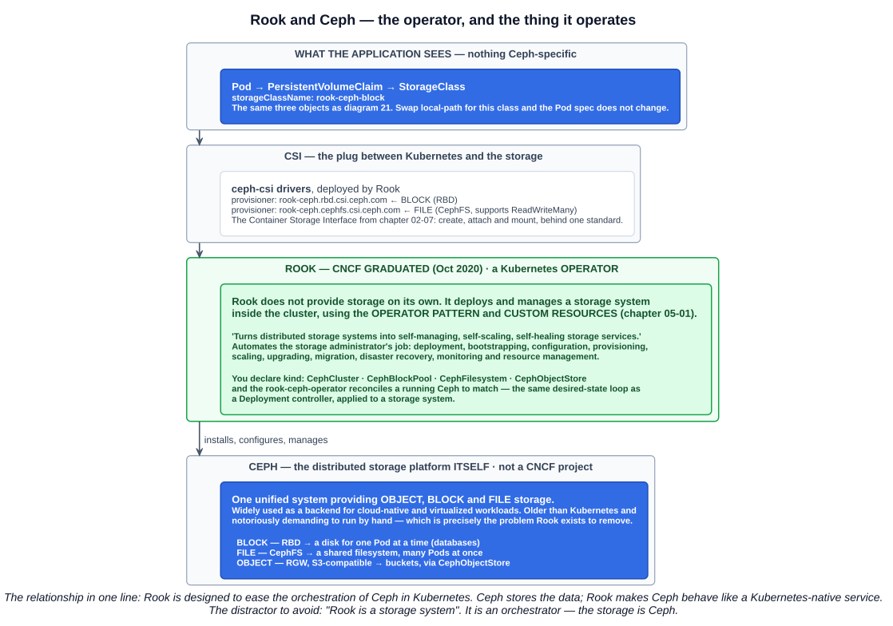

# 08 — Kubernetes storage

Containers are disposable by design, and anything written to a container's own filesystem goes with it (chapter 03-05). This chapter is how Kubernetes gives Pods storage that outlives them — and, just as importantly, the storage that deliberately does not.

The course flags this topic as one where the exam goes past the top level into **internals and specifics**: ephemeral versus persistent, reclaim policies, CNCF graduated storage solutions, and **Rook, Ceph, and the relationship between them**.

---

## 1. The two types of storage

> There are two main types of storage in Kubernetes — **Ephemeral** and **Persistent**.



| | Ephemeral | Persistent |
|---|---|---|
| **Lifetime** | Follows the **Pod** — created and deleted with it | **Independent of any Pod** that uses it |
| **Survives a container restart** | **Yes** (`emptyDir`) | Yes |
| **Survives Pod deletion** | **No** | **Yes** |
| **Defined** | **Inline in the Pod spec** | As separate API objects — PV, PVC, StorageClass |
| **Used for** | Scratch space, caches, temporary files — used as required, discarded after use | Databases, uploads, anything that must outlive a Pod |
| **Ecosystem** | Built in | Enterprise offerings plentiful; open source offerings more limited |

### "Does not survive restarts" — which restart?

The lecture slide says ephemeral storage **does not survive restarts**. That is true of a **Pod** restart — delete and recreate — and false of a **container** restart, which is exactly the case `emptyDir` exists to handle. The documentation spells out the distinction in a note:

> **A container crashing does *not* remove a Pod from a node.** The data in an `emptyDir` volume is **safe across container crashes**.

So there are really three layers, not two:

| Storage | Container crashes and restarts | Pod deleted or rescheduled |
|---|---|---|
| Container's **writable layer** (no volume) | **Lost** | Lost |
| **`emptyDir`** | **Kept** | **Lost** |
| **PersistentVolume** | Kept | **Kept** |

Get that table right and most ephemeral-versus-persistent questions answer themselves.

---

## 2. Ephemeral storage: `emptyDir`

> An `emptyDir` volume is **first created when a Pod is assigned to a node**, and **exists as long as that Pod is running on that node**. As the name says, the `emptyDir` volume is **initially empty**. **All containers in the Pod can read and write the same files** in the `emptyDir` volume, though that volume can be mounted at the same or different paths in each container. **When a Pod is removed from a node for any reason, the data in the `emptyDir` is deleted permanently.**

Typical uses, from the documentation:

- **scratch space**, such as for a disk-based merge sort
- **checkpointing** a long computation for recovery from crashes
- holding files that a **content-manager container fetches while a webserver container serves** the data — the sidecar pattern from chapter 04-02

### `medium: Memory` — a tmpfs

> The `emptyDir.medium` field controls where `emptyDir` volumes are stored. By default `emptyDir` volumes are stored on **whatever medium backs the node** such as disk, SSD, or network storage. If you set the `emptyDir.medium` field to **`"Memory"`**, Kubernetes mounts a **tmpfs (RAM-backed filesystem)** for you instead. While tmpfs is very fast, be aware that unlike disks, **tmpfs is cleared on node reboot** and **any files you write count against your container's memory limit**.

The lecture's Pod:

```yaml
apiVersion: v1
kind: Pod
metadata:
  labels:
    run: ubuntu
  name: ubuntu
spec:
  containers:
  - command:
    - sleep
    - infinity
    image: ubuntu
    name: ubuntu
    volumeMounts:
    - mountPath: /cache
      name: cache-volume
  volumes:
  - name: cache-volume
    emptyDir:
      medium: Memory
```

And the proof that it really is RAM:

```bash
kubectl exec -it ubuntu -- bash
cd /cache
df -h .
```

```
Filesystem      Size  Used Avail Use% Mounted on
tmpfs           7.7G     0  7.7G   0% /cache
```

```bash
dd if=/dev/zero of=output oflag=sync bs=1024k count=1000
# 1048576000 bytes (1.0 GB, 1000 MiB) copied, 0.298935 s, 3.5 GB/s
```

**`tmpfs` in the `Filesystem` column, and 3.5 GB/s with `oflag=sync`.** A synchronous write at that speed is not hitting a disk.

Two consequences worth keeping:

- **That gigabyte now counts against the container's memory limit.** Fill a memory-backed `emptyDir` past the limit and the container is **OOM-killed** — a storage write causing a memory failure, which is a confusing incident to debug the first time.
- **`emptyDir.sizeLimit`** bounds it:

```yaml
  volumes:
  - name: cache-volume
    emptyDir:
      medium: Memory
      sizeLimit: 500Mi
```

### The other ephemeral volume types

`emptyDir` is not the only one. Everything specified **inline in the Pod spec** and living and dying with the Pod is ephemeral:

| Type | Purpose |
|---|---|
| **`emptyDir`** | Empty at Pod startup; from the node's disk or RAM |
| **`configMap`**, **`secret`**, **`downwardAPI`** | Inject Kubernetes data into a Pod as files (chapters 04-10, 04-11) |
| **`image`** | Mount the files of a container image or artifact directly into a Pod |
| **CSI ephemeral volumes** | Provided by special CSI drivers that support it |
| **Generic ephemeral volumes** | A full PVC created and deleted **with the Pod**, from any driver that supports dynamic provisioning |

`emptyDir`, `configMap`, `downwardAPI` and `secret` are **local ephemeral storage**, managed by the **kubelet on each node**.

---

## 3. Persistent storage: three objects



| Object | Short name | Scope | What it is |
|---|---|---|---|
| **StorageClass** | `sc` | **Cluster** | **Defines the type and characteristics of storage** the cluster provides — lets administrators describe the "classes" of storage they offer |
| **PersistentVolume** | `pv` | **Cluster** | **A piece of storage** in the cluster, provisioned **by an administrator or dynamically using a StorageClass**. A resource that **persists beyond Pod lifecycles** |
| **PersistentVolumeClaim** | `pvc` | **Namespaced** | **A request for storage by a user** — the amount and characteristics needed. **Once bound to a PV, a Pod can use the PVC** to access the storage |

The scope column is a classic question (chapter 04-04): **PVs and StorageClasses are cluster-scoped; PVCs are namespaced.** Storage is an infrastructure concern owned by administrators; a claim belongs to the team asking for it.

**The Pod never names a PersistentVolume.** It mounts a claim:

```yaml
  volumes:
  - name: data
    persistentVolumeClaim:
      claimName: my-claim
```

That indirection is the design: the Pod spec says *what it needs*, and stays portable across clusters whose actual storage is completely different.

### StorageClass fields

A StorageClass carries what is needed to **create** storage on demand:

| Field | Meaning |
|---|---|
| **`provisioner`** | **Which volume plugin or CSI driver** creates the PVs — `rancher.io/local-path`, `rook-ceph.rbd.csi.ceph.com`, a cloud provider's driver |
| **`parameters`** | Provisioner-specific settings — disk type, replication, filesystem |
| **`reclaimPolicy`** | **`Delete` or `Retain`** for PVs it creates. **Defaults to `Delete`** if omitted (section 5) |
| **`volumeBindingMode`** | **`Immediate`** (the default) or **`WaitForFirstConsumer`** (section 6) |
| **`allowVolumeExpansion`** | Whether a claim may later be resized upward |

The **name** of a StorageClass is significant — it is what a PVC asks for in `storageClassName`. And one class can be marked the **default** with the annotation **`storageclass.kubernetes.io/is-default-class: "true"`**, used by any PVC that does not name a class.

### Access modes

| Mode | Short | Meaning |
|---|---|---|
| **`ReadWriteOnce`** | **RWO** | Read-write by a **single node** |
| **`ReadOnlyMany`** | **ROX** | Read-only by **many nodes** |
| **`ReadWriteMany`** | **RWX** | Read-write by **many nodes** |
| **`ReadWriteOncePod`** | **RWOP** | Read-write by a **single Pod** (stable since **v1.29**; CSI volumes only) |

**The trap in this table is the first row.** `ReadWriteOnce` is a **node**-level restriction, not a Pod-level one:

> ReadWriteOnce access mode **still can allow multiple pods to access** (read from or write to) that volume **when the pods are running on the same node**. For single pod access, please see ReadWriteOncePod.

If a question asks how to guarantee exactly one Pod can write, the answer is **RWOP**, not RWO.

Access modes describe what the **storage** can do. Node-local storage can only ever be RWO — there is only one node it is on. RWX needs genuinely shared storage such as NFS or CephFS.

### Volume mode and PV phases

**`volumeMode`** is **`Filesystem`** (the default — mounted as a directory) or **`Block`** (a raw block device with no filesystem, for software that manages its own disk layout).

A PV is always in one of four phases:

| Phase | Meaning |
|---|---|
| **`Available`** | A free resource, not yet bound to a claim |
| **`Bound`** | Bound to a claim |
| **`Released`** | The claim was deleted, but the storage has **not yet been reclaimed** |
| **`Failed`** | Automatic reclamation failed |

---

## 4. The lab: static and dynamic provisioning

> Persistent storage can be created **manually** — we create the PersistentVolume **and** the PersistentVolumeClaim — or **dynamically** — we create the PersistentVolumeClaim against a named StorageClass, and **this then creates the PersistentVolume for us**.

### What k3s gives you out of the box

The lecture uses **k3s**, which ships **Rancher's Local Path Provisioner**. Persistent volume claims work immediately, with no storage system to install:

```bash
kubectl get storageclass
```

```
NAME                   PROVISIONER             RECLAIMPOLICY   VOLUMEBINDINGMODE      ALLOWVOLUMEEXPANSION
local-path (default)   rancher.io/local-path   Delete          WaitForFirstConsumer   false
```

The class k3s installs, from its own manifest:

```yaml
apiVersion: storage.k8s.io/v1
kind: StorageClass
metadata:
  name: local-path
  annotations:
    storageclass.kubernetes.io/is-default-class: "true"
provisioner: rancher.io/local-path
volumeBindingMode: WaitForFirstConsumer
reclaimPolicy: Delete
```

Every one of those lines matters later in the chapter:

- **`is-default-class: "true"`** — any PVC naming no class gets this one.
- **`reclaimPolicy: Delete`** — every dynamically created PV here destroys its data when its claim is deleted.
- **`volumeBindingMode: WaitForFirstConsumer`** — nothing is created until a Pod actually uses the claim.

Data lands under **`/var/lib/rancher/k3s/storage`** on the node, changeable with the k3s server flag `--default-local-storage-path`.

### Static: the PV first

```yaml
apiVersion: v1
kind: PersistentVolume
metadata:
  name: manual-pv001
spec:
  storageClassName: local-path
  capacity:
    storage: 10Gi
  accessModes:
  - ReadWriteOnce
  hostPath:
    path: "/var/lib/rancher/k3s/storage/manual-pv001"
    type: DirectoryOrCreate
```

Then a claim that asks for that exact PV:

```yaml
apiVersion: v1
kind: PersistentVolumeClaim
metadata:
  name: manual-claim
spec:
  accessModes:
  - ReadWriteOnce
  volumeMode: Filesystem
  resources:
    requests:
      storage: 10Gi
  storageClassName: local-path
  volumeName: manual-pv001
```

**`volumeName`** pre-binds the claim to a specific PV. Without it, Kubernetes looks for any available PV satisfying the claim's class, size and access mode. If the named PV is already bound to someone else, the claim stays **`Pending`**.

Two details in that PV:

- **No reclaim policy is written, so it defaults to `Retain`** — the default for a **manually created** PV. That will matter in section 5.
- **`hostPath` with `type: DirectoryOrCreate`** creates an empty directory (mode `0755`) at that path if nothing is there. Other `type` values: `Directory`, `FileOrCreate`, `File`, `Socket`, `CharDevice`, `BlockDevice`, and the empty-string default that performs **no checks at all**.

### Dynamic: only the claim

```yaml
apiVersion: v1
kind: PersistentVolumeClaim
metadata:
  name: dynamic-claim
spec:
  accessModes:
  - ReadWriteOnce
  volumeMode: Filesystem
  resources:
    requests:
      storage: 10Gi
  storageClassName: local-path
```

No `volumeName`, no PV. The StorageClass's provisioner creates the PV on demand — named **`pvc-<uid>`**, with its reclaim policy **copied from the class (`Delete`)**, backed by a directory named **`pvc-<uid>_<namespace>_<claim-name>`**.

Because the class is `WaitForFirstConsumer`, this claim sits **`Pending` until a Pod uses it**. That is expected, not a fault:

```bash
kubectl get pvc
# dynamic-claim   Pending   ...   local-path
kubectl describe pvc dynamic-claim
# waiting for first consumer to be created before binding
```

### The Pod, using both

```yaml
apiVersion: v1
kind: Pod
metadata:
  labels:
    run: ubuntu
  name: ubuntu
spec:
  nodeSelector:
    kubernetes.io/hostname: worker-1
  containers:
  - command:
    - sleep
    - infinity
    image: ubuntu
    name: ubuntu
    volumeMounts:
    - mountPath: /manual
      name: manual-volume
    - mountPath: /dynamic
      name: dynamic-volume
  volumes:
  - name: manual-volume
    persistentVolumeClaim:
      claimName: manual-claim
  - name: dynamic-volume
    persistentVolumeClaim:
      claimName: dynamic-claim
```

Write into both, destroy the Pod, bring it back:

```bash
kubectl exec ubuntu -- sh -c 'echo hello > /manual/test; echo hello > /dynamic/test'
kubectl delete pod ubuntu
kubectl apply -f pod.yaml
kubectl exec ubuntu -- cat /manual/test /dynamic/test     # hello, hello
```

**Both files survive**, because both volumes are persistent. Compare the `emptyDir` Pod from section 2, where the same sequence leaves `/cache` empty.

### One thing local-path does not enforce

Both claims asked for `storage: 10Gi`. The local-path provisioner **ignores it**:

> No support for the volume capacity limit currently. The capacity limit will be ignored for now.

The directory can grow until the node's disk is full. With node-local `hostPath`-style storage, `capacity` is a **matching label**, not a quota — another reason it is a lab tool rather than a production one. (The documentation's own warning about `hostPath` makes the same point: **its usage is not counted as ephemeral storage**, so excessive use leads to node disk pressure.)

---

## 5. Reclaim policies



The slide flags this explicitly: the two provisioning approaches have **unique characteristics, specifically with reclaim policies**.

> When a user is done with their volume, they can **delete the PVC** objects from the API that allows reclamation of the resource. The **reclaim policy** for a PersistentVolume tells the cluster **what to do with the volume after it has been released of its claim**.

**The trigger is deleting the claim — never deleting a Pod.** Deleting a Pod releases nothing.

| Policy | What happens when the claim is deleted |
|---|---|
| **`Retain`** | The PV **still exists**, in phase **`Released`**, and the data is untouched. But it is **not available for another claim**, *"because the previous claimant's data remains on the volume"*. An administrator reclaims it manually |
| **`Delete`** | **Both the PersistentVolume object and the associated storage asset** in the external infrastructure are deleted |
| **`Recycle`** | **Deprecated.** A basic scrub — **`rm -rf /thevolume/*`** — then the PV is available for a new claim. **Only `nfs` and `hostPath`** support it. *"The recommended approach is to use dynamic provisioning"* |

The lecture lists all three because `Recycle` is still in the enum. Expect it as a distractor.

### The defaults are deliberately asymmetric

| How the PV was created | Default reclaim policy |
|---|---|
| **Manually** — `kind: PersistentVolume` with no policy written | **`Retain`** |
| **Dynamically** — by a StorageClass | **Whatever the class's `reclaimPolicy` says**, which **defaults to `Delete`** |

A StorageClass can only specify **`Delete` or `Retain`** — never `Recycle`.

So in the lab, deleting both claims produces two different outcomes:

```bash
kubectl delete pod ubuntu
kubectl delete pvc manual-claim dynamic-claim
kubectl get pv
```

```
NAME           CAPACITY   RECLAIM POLICY   STATUS     CLAIM
manual-pv001   10Gi       Retain           Released   default/manual-claim
```

**The dynamic PV has gone** — object and directory both. **The manual PV is `Released`**, its directory and data still on `worker-1`'s disk, and it will not bind to a new claim until an administrator intervenes.

Reclaiming a `Retain` volume by hand:

1. Delete the PersistentVolume — the storage asset itself **still exists**.
2. Clean up the data on the storage asset.
3. Delete the storage asset — or, to reuse it, **create a new PV** pointing at the same storage.

**The convenient path is also the one that destroys data.** For anything you cannot afford to lose, use a StorageClass with `reclaimPolicy: Retain`, or change the policy on an existing PV:

```bash
kubectl patch pv <name> -p '{"spec":{"persistentVolumeReclaimPolicy":"Retain"}}'
```

---

## 6. Node-local versus shared storage — and why the Pod is pinned to worker-1



### Persistent does not mean portable

The slides draw two pictures of persistent storage:

- **Node-specific** — each node has its own folder. A Pod reaches only the storage on the node it is running on.
- **Shared** — every node reaches the same storage over the network. A Pod can run anywhere and find its data.

**local-path, `hostPath` and `local` volumes are all node-specific.** The data survives the Pod, but only on the machine whose disk holds it. The k3s documentation is direct about the consequence:

> Note that this does result in **permanently binding the pod to the node hosting the volume**.

### Why `nodeSelector: kubernetes.io/hostname: worker-1`

**Not a resource decision — a determinism one.** The two volumes in the lecture's Pod are node-local, but the scheduler knows that about only one of them:

| Volume | Node affinity on the PV? | What the scheduler does |
|---|---|---|
| **`dynamic-claim`** | **Yes.** The provisioner writes `kubernetes.io/hostname=<node>` into the PV it creates | **Filters out every other node** for any Pod using the claim. It cannot be placed wrongly |
| **`manual-claim`** | **No.** A plain `hostPath` PV carries no node affinity | Treats it as usable **anywhere** |

A Pod using only `manual-claim` could land on `worker-2`, where the kubelet would run `DirectoryOrCreate` and hand it a **new, empty** directory. The data is not lost — it is on `worker-1` — but the persistence demo would look like a failure.

In the lecture's Pod the two volumes are mounted together, so after the **first** placement the dynamic PV's affinity would actually hold the Pod on its node anyway. Nothing holds it there *before* that. Pinning with `nodeSelector` removes the ambiguity entirely:

- the `hostPath` PV, which has no affinity of its own, is pinned explicitly from the first run
- the dynamic PV is provisioned on that same, known node
- you know exactly which node to inspect to see both directories on disk

### `volumeBindingMode`

That "provisioned on the same node" behaviour is what **`WaitForFirstConsumer`** buys:

| Mode | When binding and provisioning happen | Risk |
|---|---|---|
| **`Immediate`** (the default) | **As soon as the PVC is created** | For topology-constrained storage, the PV is created **without knowledge of the Pod's scheduling requirements** — *"this may result in unschedulable Pods"* |
| **`WaitForFirstConsumer`** | **Delayed until a Pod using the PVC is created**, then provisioned to match that Pod's scheduling constraints | None of the above; the claim just sits `Pending` until used |

With `Immediate`, a node-local volume could be provisioned on `worker-2` for a Pod whose `nodeSelector` demands `worker-1`, and that Pod could never run. `WaitForFirstConsumer` lets the scheduler choose the node first — honouring node selectors, affinity, taints and resource requests (chapters 05-05 to 05-07) — and the volume follows.

And the docs single out the exact choice the lecture made:

> If you choose to use `WaitForFirstConsumer`, **do not use `nodeName`** in the Pod spec to specify node affinity. If `nodeName` is used in this case, **the scheduler will be bypassed and PVC will remain in pending state**. Instead, you can use **node selector for `kubernetes.io/hostname`**.

That is chapter 05-05 paying off: `nodeName` skips the scheduler, and with `WaitForFirstConsumer` the **scheduler is what triggers provisioning**. So the claim never binds. **`nodeSelector` on `kubernetes.io/hostname` reaches the same node and keeps the scheduler in the loop.**

### `hostPath` in production

The documentation is unusually blunt:

> Using the `hostPath` volume type presents **many security risks**. If you can avoid using a `hostPath` volume, you should. For example, define a **`local` PersistentVolume**, and use that instead.

Access to the host filesystem can expose **privileged system credentials** (such as the kubelet's) or privileged APIs (such as the **container runtime socket**) usable for **container escape**. Its legitimate uses are narrow — a log shipper reading `/var/log` read-only, or a static Pod reading a host config file.

**Shared, network-attached storage is the production answer**, and it is precisely the gap the next two sections fill.

---

## 7. CSI — how storage plugs in

Every non-trivial StorageClass `provisioner` today is a **CSI driver**. The **Container Storage Interface** (chapter 02-07) is the standard that lets a storage vendor write **one driver for every orchestrator**, and it **replaced the in-tree volume plugins** that used to be compiled into Kubernetes itself.

The pieces in a running cluster:

| Piece | Runs as | Does |
|---|---|---|
| **Controller plugin** | A Deployment, anywhere | Create, delete, attach, snapshot, resize |
| **Node plugin** | A **DaemonSet** — one per node (chapter 04-06) | Stage and mount the volume on the node where the Pod runs |
| **`CSIDriver` object** | Cluster-scoped API object | Tells Kubernetes the driver exists and what it supports |

The same three PV/PVC/StorageClass objects sit on top regardless of driver. That is why the Pod spec in section 4 would not change at all if `local-path` were replaced by Ceph.

---

## 8. CNCF storage projects: Rook and Ceph



### CNCF graduated storage solutions

The study tips ask for examples. Current CNCF maturity, from the landscape:

| Project | Category | CNCF maturity | What it is |
|---|---|---|---|
| **Rook** | Storage orchestration | **Graduated** (Oct 2020) | Kubernetes operator that runs storage systems — chiefly Ceph — inside the cluster |
| **CubeFS** | Distributed file system | **Graduated** (Dec 2024) | Cloud-native distributed file and object storage |
| **etcd** | Key/value store | **Graduated** (Nov 2020) | The Kubernetes control plane's datastore (chapter 04-01) |
| **TiKV** | Distributed transactional KV | **Graduated** (Sep 2020) | Distributed transactional key-value database |
| **Vitess** | Database clustering | **Graduated** (Nov 2019) | Horizontal scaling and sharding for MySQL |
| **Longhorn** | Block storage | **Incubating** | Distributed block storage for Kubernetes, originally from Rancher |
| **OpenEBS** | Container-attached storage | **Sandbox** | Kubernetes-native local and replicated storage |
| **Ceph** | Unified storage platform | **Not a CNCF project** | Object, block and file storage — the system Rook deploys |

**Rook is the canonical answer** to "which CNCF graduated project provides storage orchestration for Kubernetes". Projects move between levels, so confirm on [landscape.cncf.io](https://landscape.cncf.io/) close to the exam.

### Rook

> Rook is a **CNCF-graduated, cloud-native storage orchestrator** for Kubernetes. **It doesn't provide storage on its own**; instead, it **deploys and manages storage systems such as Ceph inside your Kubernetes cluster** using the **operator pattern and custom resources**.

From the project's own description:

> Rook turns distributed storage systems into **self-managing, self-scaling, self-healing** storage services. It automates the tasks of a storage administrator: **deployment, bootstrapping, configuration, provisioning, scaling, upgrading, migration, disaster recovery, monitoring, and resource management**.

That is the **operator pattern** from chapter 05-01 applied to storage: CRDs add the nouns, the operator adds the verbs. You declare the storage you want as custom resources —

| Custom resource | Declares |
|---|---|
| **`CephCluster`** | The Ceph cluster itself |
| **`CephBlockPool`** | A pool for **block** storage |
| **`CephFilesystem`** | A shared **file** system |
| **`CephObjectStore`** | An S3-compatible **object** store |

— and the `rook-ceph-operator` reconciles a running Ceph to match, the same desired-state loop a Deployment controller runs. The quickstart is three files:

```bash
kubectl create -f crds.yaml -f common.yaml     # the CRDs and the rook-ceph namespace
kubectl create -f operator.yaml                # deployment.apps/rook-ceph-operator
kubectl create -f cluster.yaml                 # cephcluster.ceph.rook.io/rook-ceph
```

Rook then deploys the **ceph-csi** drivers, so applications consume Ceph through ordinary StorageClasses:

| StorageClass `provisioner` | Storage type |
|---|---|
| **`rook-ceph.rbd.csi.ceph.com`** | **Block** (RBD) — one Pod at a time, for databases |
| **`rook-ceph.cephfs.csi.ceph.com`** | **File** (CephFS) — shared, supports **ReadWriteMany** |

### Ceph

> Ceph, by contrast, is **the distributed storage platform itself**. It provides **object, block and file storage in one unified system**, and is widely used as a backend for cloud-native and virtualized workloads.

| Ceph interface | Type | Typical consumer |
|---|---|---|
| **RBD** | **Block** | A database's disk |
| **CephFS** | **File** | Many Pods sharing one filesystem |
| **RGW** | **Object**, S3-compatible | Buckets for backups, media, data lakes |

**Ceph predates Kubernetes and is not a CNCF project.** It is famously demanding to operate by hand — which is exactly the problem Rook exists to remove.

### The relationship

> **Rook is designed to ease the orchestration of Ceph in Kubernetes.**

- **Ceph stores the data.** It is the storage system.
- **Rook runs Ceph.** It is the Kubernetes operator that **installs, configures and manages Ceph**, and exposes Ceph's storage types as **Kubernetes PersistentVolumes**.

The distractor to avoid: **"Rook is a storage system."** It is an orchestrator. Ask *"where are the bytes?"* — the answer is always Ceph.

---

## Exam angle

- **The two main types of storage are ephemeral and persistent.** Ephemeral storage **follows the Pod's lifetime** and is defined **inline** in the Pod spec; persistent storage is **independent of any Pod**.
- **`emptyDir` survives a container crash but is deleted permanently when the Pod leaves the node.** "Does not survive restarts" means a **Pod** restart, not a container restart.
- **`emptyDir.medium: Memory` mounts a tmpfs** — fast, **cleared on node reboot**, and **counts against the container's memory limit**. Bound it with `sizeLimit`.
- **StorageClass defines classes of storage; PV is a piece of storage; PVC is a request for storage.** **PV and StorageClass are cluster-scoped; PVC is namespaced.** A Pod mounts a **claim**, never a PV directly.
- **Static provisioning** creates the PV and the PVC; **dynamic provisioning** creates **only the PVC** against a StorageClass, whose **provisioner creates the PV**.
- **Reclaim policies: `Retain`, `Delete`, `Recycle`.** `Retain` keeps the PV in **`Released`** with its data, unavailable for new claims until an admin acts. `Delete` removes **both the PV and the storage asset**. **`Recycle` (`rm -rf`) is deprecated** — the recommended replacement is dynamic provisioning.
- **Manually created PVs default to `Retain`. StorageClasses default to `Delete`**, and a StorageClass may only specify `Delete` or `Retain`. Deleting a **claim** triggers reclamation; deleting a Pod does not.
- **Access modes: RWO, ROX, RWX, RWOP.** **`ReadWriteOnce` is per NODE** — several Pods on one node can share it. **`ReadWriteOncePod` (stable v1.29)** guarantees a single Pod.
- **PV phases: `Available`, `Bound`, `Released`, `Failed`.**
- **`volumeBindingMode: Immediate` is the default; `WaitForFirstConsumer` delays binding until a Pod uses the claim**, so node-local storage is provisioned where the Pod is scheduled. With it, **use a `nodeSelector`, not `nodeName`** — `nodeName` bypasses the scheduler and leaves the PVC Pending.
- **Node-local storage (`hostPath`, `local`, k3s `local-path`) binds a Pod permanently to one node.** Shared network storage lets it move. **`hostPath` carries serious security risks** — prefer a `local` PV.
- **Rook is a CNCF GRADUATED storage orchestrator** (Oct 2020) that **does not provide storage itself** — it deploys and manages storage systems, chiefly **Ceph**, using the **operator pattern and custom resources**.
- **Ceph is the distributed storage platform itself**, providing **object, block and file** storage in one unified system. **Ceph is not a CNCF project.** **Rook is designed to ease the orchestration of Ceph in Kubernetes.**
- **CNCF graduated storage-related projects: Rook, CubeFS**, plus the data stores **etcd, TiKV and Vitess**. **Longhorn is Incubating.**

## References

- [Volumes](https://kubernetes.io/docs/concepts/storage/volumes/) — `emptyDir`, `medium: Memory`, `hostPath` types and its security warning
- [Persistent Volumes](https://kubernetes.io/docs/concepts/storage/persistent-volumes/) — reclaim policies, access modes, phases, `volumeName` binding
- [Storage Classes](https://kubernetes.io/docs/concepts/storage/storage-classes/) — `reclaimPolicy` default, `volumeBindingMode`, the default StorageClass
- [Rook documentation](https://rook.io/docs/rook/latest-release/) — the Rook-Ceph operator and its custom resources
