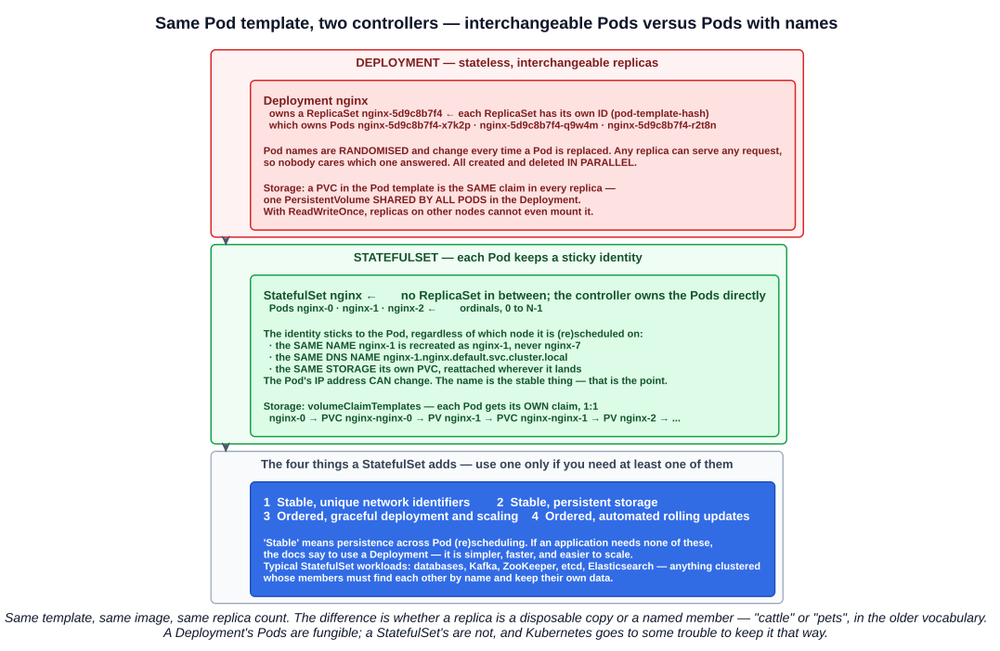
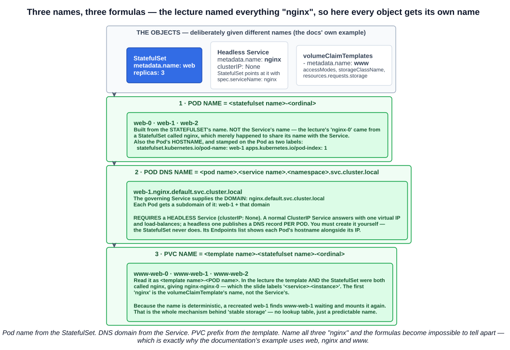
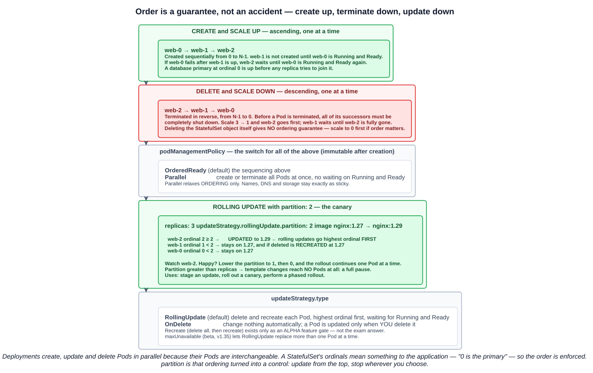

# 09 — StatefulSets

Chapter 04-05 covered Deployments, whose Pods are interchangeable by design. Chapter 05-08 covered storage that outlives a Pod. A StatefulSet is what you need when both matter at once: replicas that **are not interchangeable**, each holding **its own data** and reachable at **its own name**.

---

## 1. Purpose

> **StatefulSet is the workload API object used to manage stateful applications.** A StatefulSet runs a group of Pods, and **maintains a sticky identity for each of those Pods**. This is useful for managing applications that need **persistent storage** or a **stable, unique network identity**.

The documentation names four things a StatefulSet provides. They are the answer to "why use a StatefulSet":

| # | Guarantee | What it means |
|---|---|---|
| **1** | **Stable, unique network identifiers** | Each Pod keeps the same name and DNS name across rescheduling |
| **2** | **Stable, persistent storage** | Each Pod keeps its own PersistentVolume across rescheduling |
| **3** | **Ordered, graceful deployment and scaling** | Pods are created, scaled and terminated one at a time, in order |
| **4** | **Ordered, automated rolling updates** | Updates proceed Pod by Pod, in a defined order |

> In the above, **stable is synonymous with persistence across Pod (re)scheduling**.

And the other half of the definition — when *not* to use one:

> If an application **doesn't require any stable identifiers or ordered deployment, deletion, or scaling**, you should deploy your application using a workload object that provides a set of **stateless replicas**. **Deployment** or ReplicaSet may be better suited to your stateless needs.

Typical StatefulSet workloads are clustered systems whose members must find each other by name and keep their own data: databases (PostgreSQL, MySQL, MongoDB), Kafka, ZooKeeper, etcd, Elasticsearch.

---

## 2. StatefulSet versus Deployment



### What is the same

The manifests are nearly identical — **`replicas`**, **`selector`**, and a Pod **`template`**, under **`apps/v1`**. That is why the lecture builds a StatefulSet by generating a Deployment and editing it: there is no `kubectl create statefulset`.

```bash
kubectl create deployment nginx --image=nginx --replicas=3 --dry-run=client -o yaml > statefulset.yaml
# then: kind: StatefulSet · delete `strategy: {}` · add serviceName · add volumeClaimTemplates
```

Both are controllers reconciling a desired replica count, both support `kubectl scale`, `kubectl rollout status/history/undo`, and both can be scaled by a HorizontalPodAutoscaler.

### What is different

| | Deployment | StatefulSet |
|---|---|---|
| **Intermediate object** | **A ReplicaSet** per revision, each with its own ID (`pod-template-hash`) | **None** — the StatefulSet controller owns its Pods directly |
| **Pod names** | **Randomised** — `nginx-5d9c8b7f4-x7k2p` — and new on every replacement | **Ordinal** — `nginx-0`, `nginx-1`, `nginx-2` — and **the same on every replacement** |
| **Identity** | Pods are **interchangeable** | Each Pod has a **sticky identity**: ordinal, network identity and storage |
| **Storage** | A PVC in the template is **one claim shared by all Pods** | **`volumeClaimTemplates`** — **one PVC per Pod**, 1:1 |
| **Network** | Reached through a Service's virtual IP; individual Pods are anonymous | Each Pod gets **its own DNS name** through a **headless Service** |
| **Creation and deletion** | **In parallel** | **In order**, one at a time (by default) |
| **Rolling update** | New ReplicaSet scales up, old one scales down, using `maxSurge`/`maxUnavailable` | **Pod by Pod, highest ordinal first**, no surge |
| **Revision history** | Old **ReplicaSets** | **ControllerRevision** objects |
| **Service** | Optional | **Requires a headless Service you create yourself** |

The storage row is the slide's warning, and it is worth spelling out. A Deployment's Pod template is copied verbatim into every replica, so a `persistentVolumeClaim` in it names **the same claim** in all of them:

> **Will be shared by all Pods in the Deployment.**

With `ReadWriteOnce`, replicas scheduled to other nodes cannot even mount it (chapter 05-08). With `ReadWriteMany`, they can — and then three database replicas are writing to one set of files. Neither is what a replicated database needs. `volumeClaimTemplates` is the fix: a *template* for claims, stamped out once per Pod.

### The IP still changes

The sticky identity is the **name**, not the address. A rescheduled `nginx-1` comes back as `nginx-1`, with the same DNS name and the same volume — but very likely **a different Pod IP**. Clients that address members by DNS name never notice. That is the benefit: **a stable network ID that is useful for interacting with your StatefulSet's members**, even though the IPs underneath are not stable.

---

## 3. Naming: StatefulSet, Service and template



The lecture named the StatefulSet, the Service and the claim template all `nginx`. That is convenient to type and makes the naming rules impossible to see, because every slot holds the same word. The docs' own example uses **three different names**, and so does this section:

| Object | Name |
|---|---|
| StatefulSet | **`web`** |
| Headless Service (`spec.serviceName` points here) | **`nginx`** |
| volumeClaimTemplate | **`www`** |

### 3.1 Pod name: `<statefulset name>-<ordinal>`

> Each Pod in a StatefulSet derives its hostname from **the name of the StatefulSet and the ordinal of the Pod**. The pattern for the constructed hostname is **`$(statefulset name)-$(ordinal)`**.

So the Pods are **`web-0`, `web-1`, `web-2`**. Ordinals run **0 to N-1**.

**The Pod name comes from the StatefulSet, not the Service.** In the lecture the Pods were `nginx-0` because the *StatefulSet* was called `nginx`. That is the one correction worth making to the notes: the Service supplies the DNS **domain**, but the ordinal is appended to the StatefulSet's name.

The controller also labels each Pod with its identity, which gives you a selector per Pod:

| Label | Value |
|---|---|
| **`statefulset.kubernetes.io/pod-name`** | `web-1` — lets you attach a Service to **one specific Pod** |
| **`apps.kubernetes.io/pod-index`** | `1` — the ordinal, for routing, logs and metrics (stable since v1.32) |

### 3.2 Pod DNS name: `<pod name>.<service name>.<namespace>.svc.cluster.local`

> A StatefulSet can use a **Headless Service** to control the domain of its Pods. The domain managed by this Service takes the form: **`$(service name).$(namespace).svc.cluster.local`**... As each Pod is created, it gets a matching DNS subdomain, taking the form: **`$(podname).$(governing service domain)`**, where the governing service is defined by the **`serviceName`** field on the StatefulSet.

Putting it together:

```
web-1  .  nginx  .  default  .  svc.cluster.local
 pod     service   namespace     cluster domain
```

The lecture's slide writes the same thing as `<hostname>.<servicename>.<namespace>.svc.cluster.local` — the Pod's hostname *is* its Pod name.

| Cluster domain | Service | StatefulSet | StatefulSet domain | Pod DNS | Pod hostname |
|---|---|---|---|---|---|
| `cluster.local` | `default/nginx` | `default/web` | `nginx.default.svc.cluster.local` | `web-{0..N-1}.nginx.default.svc.cluster.local` | `web-{0..N-1}` |
| `cluster.local` | `foo/nginx` | `foo/web` | `nginx.foo.svc.cluster.local` | `web-{0..N-1}.nginx.foo.svc.cluster.local` | `web-{0..N-1}` |
| `kube.local` | `foo/nginx` | `foo/web` | `nginx.foo.svc.kube.local` | `web-{0..N-1}.nginx.foo.svc.kube.local` | `web-{0..N-1}` |

### 3.3 Why it must be a headless Service

> StatefulSets currently **require a Headless Service** to be responsible for the network identity of the Pods. **You are responsible for creating this Service.**

Recall the difference from chapter 04-08:

| Service | DNS answers `nginx.default.svc.cluster.local` with | Per-Pod DNS records? |
|---|---|---|
| **ClusterIP** | **One virtual IP**, load-balanced by kube-proxy | No |
| **Headless** (`clusterIP: None`) | **Every ready Pod's IP** directly | **Yes** — `web-0.nginx...`, `web-1.nginx...` |

A normal ClusterIP Service deliberately hides *which* Pod answers. A StatefulSet needs the opposite: a client must be able to say "talk to `web-0`, the primary", not "talk to whichever replica". Only a headless Service publishes a name per Pod.

```bash
kubectl create service clusterip nginx --clusterip=None --tcp=80:80
```

`kubectl expose` cannot target a StatefulSet (it accepts Pods, Services, ReplicationControllers, Deployments and ReplicaSets), so `create service` is the imperative route. Because the default selector it generates is `app: <service name>`, naming the Service `nginx` matches Pods labelled `app: nginx` — one reason the lecture used one name for everything.

### 3.4 The lecture's order of operations

The lecture created the StatefulSet **before** its Service existed, then created the Service. That works:

- **`serviceName` is just a string.** Nothing checks at creation time that the Service exists, so the StatefulSet and its Pods start normally.
- **DNS records appear once the headless Service does.** CoreDNS builds them from the Service's endpoints, so `nginx-1.nginx.default.svc.cluster.local` starts resolving as soon as the Service is created.

The API reference still says the Service **"must exist before the StatefulSet"**, and creating it first is the right habit — Pods that look each other up during startup (a database replica finding its primary) would otherwise fail their first lookups. DNS **negative caching** makes that worse: CoreDNS remembers a failed lookup for up to **30 seconds**, so a name queried just before it existed can stay unresolvable briefly after it does.

### 3.5 Seeing it

```bash
kubectl get endpoints nginx -o yaml
```

```yaml
metadata:
  labels:
    app: nginx
    service.kubernetes.io/headless: ""
subsets:
- addresses:
  - hostname: nginx-0
    ip: 10.42.0.5
    nodeName: control-plane
    targetRef: {kind: Pod, name: nginx-0}
  - hostname: nginx-1
    ip: 10.42.1.4
    nodeName: worker-1
  - hostname: nginx-2
    ip: 10.42.2.5
    nodeName: worker-2
```

Each address carries a **`hostname`** — that field is what CoreDNS turns into `nginx-0.nginx.default.svc.cluster.local`. A Deployment's endpoints have IPs but no hostnames, which is why its Pods get no per-Pod DNS names. Note the **`service.kubernetes.io/headless`** label marking it.

Then, from a throwaway Pod (chapter 04-08):

```bash
kubectl run --rm -i --tty curl --image=curlimages/curl --restart=Never -- sh
curl nginx-1.nginx.default.svc.cluster.local     # always web server 1, never a random replica
nslookup nginx.default.svc.cluster.local         # all three Pod IPs — no virtual IP
```

---

## 4. Ordering



### 4.1 Deployment and scaling guarantees

> - For a StatefulSet with N replicas, when Pods are being deployed, they are **created sequentially, in order from {0..N-1}**.
> - When Pods are being deleted, they are **terminated in reverse order, from {N-1..0}**.
> - **Before a scaling operation is applied to a Pod, all of its predecessors must be Running and Ready.**
> - **Before a Pod is terminated, all of its successors must be completely shutdown.**

So `web-1` is not created until `web-0` is Running and Ready, and scaling from 3 to 1 removes `web-2` first and waits until it is fully gone before touching `web-1`. If `web-0` fails part-way through, everything waits for it to recover.

The point of the ordering is that ordinals **mean something** to the application. "`web-0` is the primary; others join it" only works if `web-0` exists first and leaves last.

Two caveats:

- **Deleting the StatefulSet object gives no ordering guarantee.** *"To achieve ordered and graceful termination of the pods in the StatefulSet, it is possible to scale the StatefulSet down to 0 prior to deletion."*
- **Do not set `terminationGracePeriodSeconds: 0`** — the docs call it *"unsafe and strongly discouraged"*, because it allows two Pods with the same identity to briefly coexist.

### 4.2 `podManagementPolicy`

| Policy | Behaviour |
|---|---|
| **`OrderedReady`** (default) | The sequential behaviour above |
| **`Parallel`** | **Launch or terminate all Pods in parallel**, without waiting for Running and Ready |

**`Parallel` relaxes ordering only.** Names, DNS records and storage remain exactly as sticky. Use it for applications that need stable identity but do not care about startup order — it makes scaling much faster.

---

## 5. Updates

### 5.1 Update strategies

| `updateStrategy.type` | Behaviour |
|---|---|
| **`RollingUpdate`** (default) | **Delete and recreate each Pod, one at a time, from the largest ordinal to the smallest**, waiting for each updated Pod to be Running and Ready before moving on |
| **`OnDelete`** | **Never update automatically.** A Pod picks up the new template only when **you delete it** |

A `Recreate` strategy (delete all, then recreate) exists only behind an **alpha** feature gate and is not the exam answer.

Note the direction: **updates run from the highest ordinal down**, the same order as termination. `web-2` is updated first and `web-0`, often the most important member, is updated last.

### 5.2 Partitioned rolling updates

This is the feature the lecture highlighted, and it falls straight out of the ordering:

> If a partition is specified, **all Pods with an ordinal that is greater than or equal to the partition will be updated** when the StatefulSet's `.spec.template` is updated. **All Pods with an ordinal that is less than the partition will not be updated**, and, **even if they are deleted, they will be recreated at the previous version**.

```yaml
spec:
  updateStrategy:
    type: RollingUpdate
    rollingUpdate:
      partition: 2
```

With 3 replicas and `partition: 2`, changing the image updates **only `web-2`** (ordinal 2 ≥ 2). `web-0` and `web-1` stay on the old version — and stay there even if deleted, because the controller recreates them **at the previous version**. That last clause is what makes a partition a real guarantee rather than a timing accident.

Then the rollout continues as you lower the number:

```bash
kubectl patch statefulset web -p '{"spec":{"updateStrategy":{"rollingUpdate":{"partition":1}}}}'   # now web-1 too
kubectl patch statefulset web -p '{"spec":{"updateStrategy":{"rollingUpdate":{"partition":0}}}}'   # everything
```

> In most cases you will not need to use a partition, but they are useful if you want to **stage an update, roll out a canary, or perform a phased roll out**.

And one edge case: **a partition greater than `replicas` means template changes reach no Pods at all** — a complete pause on the rollout.

### 5.3 `maxUnavailable`

By default a StatefulSet rolling update replaces **one Pod at a time**. `spec.updateStrategy.rollingUpdate.maxUnavailable` (beta in v1.35, enabled by default) allows more, as a number or a percentage; it **cannot be 0** and **defaults to 1**. Unlike a Deployment there is **no `maxSurge`** — a Pod's identity cannot exist twice, so a StatefulSet never runs an extra copy during an update.

### 5.4 The rollout that gets stuck

> When using Rolling Updates with the default Pod Management Policy (`OrderedReady`), it's possible to get into a **broken state that requires manual intervention to repair**.

If the new template never becomes Running and Ready (a bad image, a config error), the rollout stops. **Reverting the template is not enough** — the StatefulSet keeps waiting for the broken Pod to become Ready before it will move on. You must also **delete the Pods it already tried to run** with the bad configuration; then it recreates them from the reverted template.

### 5.5 Revision history

StatefulSets track template versions with **ControllerRevision** objects rather than ReplicaSets, and keep **10** by default (`revisionHistoryLimit`). The rollout commands from chapter 04-05 work the same way:

```bash
kubectl rollout history statefulset/web
kubectl rollout undo statefulset/web --to-revision=3
kubectl get controllerrevisions
```

---

## 6. Stable storage

### 6.1 `volumeClaimTemplates`

```yaml
apiVersion: apps/v1
kind: StatefulSet
metadata:
  labels:
    app: nginx
  name: nginx
spec:
  replicas: 3
  selector:
    matchLabels:
      app: nginx
  serviceName: nginx
  template:
    metadata:
      labels:
        app: nginx
    spec:
      containers:
      - image: nginx
        name: nginx
        volumeMounts:
        - name: nginx           # must match the template name below
          mountPath: /data
  volumeClaimTemplates:
  - metadata:
      name: nginx
    spec:
      accessModes: [ "ReadWriteOnce" ]
      storageClassName: "local-path"
      resources:
        requests:
          storage: 1Gi
```

`volumeClaimTemplates` sits at the **StatefulSet spec level**, beside `template` — not inside the Pod spec. Each entry is a PVC spec with a name, and the container mounts it **by that name**, exactly like an ordinary volume. There is no `volumes:` entry in the Pod template for it; the controller adds it.

> **For each VolumeClaimTemplate entry** defined in a StatefulSet, **each Pod receives one PersistentVolumeClaim**... **If no StorageClass is specified, then the default StorageClass will be used.**

The storage itself must come from **dynamic provisioning** through the named StorageClass, or from **pre-provisioned PVs** an administrator created. On k3s that is `local-path`, so the three claims become three `pvc-<uid>` volumes, each on its Pod's node (chapter 05-08).

### 6.2 PVC names: `<template name>-<statefulset name>-<ordinal>`

```bash
kubectl get pvc
```

```
NAME            STATUS   VOLUME                                     CAPACITY   ACCESS MODES   STORAGECLASS
nginx-nginx-0   Bound    pvc-b2ff914c-e158-4044-87ff-dfd6527c8ed0   1Gi        RWO            local-path
nginx-nginx-1   Bound    pvc-...                                    1Gi        RWO            local-path
nginx-nginx-2   Bound    pvc-...                                    1Gi        RWO            local-path
```

The slide labels this `<service>-<instance>`. Precisely, it is **`<volumeClaimTemplate name>-<Pod name>`**, and the Pod name is `<statefulset name>-<ordinal>`:

```
nginx      -  nginx-0
template      pod name  (statefulset name + ordinal)
```

In the lecture the template and the StatefulSet were both called `nginx`, hence `nginx-nginx-0`. The first `nginx` is **the claim template's name**, not the Service's. With the docs' names it is `www-web-0`, `www-web-1`, `www-web-2`.

### 6.3 Why the data follows the Pod

There is no lookup table. **The claim name is deterministic**, so when `web-1` is deleted and recreated — on any node — the controller looks for a claim called `www-web-1`, finds the existing one, and mounts it. The new Pod gets the old Pod's data because it has the old Pod's name.

```bash
kubectl exec nginx-1 -- sh -c 'echo "I am nginx-1" > /data/whoami'
kubectl delete pod nginx-1
kubectl get pods -w                              # nginx-1 is recreated — same name
kubectl exec nginx-1 -- cat /data/whoami          # I am nginx-1
```

On node-local storage, the PV's node affinity also forces the recreated Pod back onto the same node (chapter 05-08). On shared storage, it can move and the volume moves with it.

### 6.4 PVCs outlive the StatefulSet

> **Deleting and/or scaling a StatefulSet down will *not* delete the volumes associated with the StatefulSet.** This is done to ensure data safety, which is generally more valuable than an automatic purge of all related StatefulSet resources.

Scale from 3 to 2 and `nginx-2` goes, but **`nginx-nginx-2` stays**. Scale back to 3 and the new `nginx-2` reattaches it — with its old data. Delete the whole StatefulSet and all three claims remain; cleaning them up is a manual `kubectl delete pvc`.

That default is now configurable with **`persistentVolumeClaimRetentionPolicy`** (stable since **v1.32**):

```yaml
spec:
  persistentVolumeClaimRetentionPolicy:
    whenDeleted: Retain    # the StatefulSet is deleted
    whenScaled: Delete     # replicas are reduced
```

Each can be **`Retain`** (the **default**, matching the old behaviour) or **`Delete`**. These apply **only** when Pods are removed by deleting or scaling down the StatefulSet. A Pod replaced after a node failure always keeps its claim.

Don't confuse this with the PV **reclaim policy** from chapter 05-08. This policy decides whether the **PVC** is deleted; the reclaim policy decides what happens to the **PV** once it is.

---

## 7. Fields you cannot change later

Four StatefulSet spec fields are **immutable**:

| Field | Why it is fixed |
|---|---|
| **`selector`** | Changing it would orphan the existing Pods (same rule as a Deployment) |
| **`serviceName`** | It is baked into every Pod's DNS identity |
| **`volumeClaimTemplates`** | Existing claims were created from it; the controller cannot reshape them |
| **`podManagementPolicy`** | Ordering semantics are fixed for the set's lifetime |

Changing any of them means deleting and recreating the StatefulSet — which, per section 6.4, **leaves the PVCs in place**. Recreate it with the same names and the new Pods pick up the old data.

That is how the lecture changed its claim template mid-demo:

```bash
kubectl delete -f statefulset.yaml && kubectl apply -f statefulset.yaml
```

A plain `kubectl apply` of a changed claim template is rejected by API validation with a **`field is immutable`** error naming `spec.volumeClaimTemplates`. (Older clusters report the same rule as one combined message listing the few fields that *may* be updated: `replicas`, `template`, `updateStrategy` and a handful of others.)

---

## Exam angle

- **A StatefulSet is the workload API object used to manage stateful applications.** It **maintains a sticky identity for each Pod** — an ordinal, a stable network identity and stable storage — that sticks to the Pod **regardless of which node it is (re)scheduled on**.
- **The four guarantees: stable unique network identifiers · stable persistent storage · ordered graceful deployment and scaling · ordered automated rolling updates.** If an application needs none of them, **use a Deployment**.
- **Deployments use ReplicaSets and randomised Pod names; StatefulSets have no ReplicaSet and use ordinal names** — `web-0`, `web-1`, `web-2`.
- **Pod name = `<statefulset name>-<ordinal>`**, ordinals 0 to N-1. **Pod DNS = `<pod name>.<service name>.<namespace>.svc.cluster.local`.** **PVC name = `<template name>-<pod name>`.** The Pod name comes from the **StatefulSet**, the DNS domain from the **Service**.
- **StatefulSets require a HEADLESS Service (`clusterIP: None`)**, referenced by **`spec.serviceName`**, to provide per-Pod DNS names — and **you must create it yourself**. A normal ClusterIP Service gives one load-balanced IP, not a name per Pod.
- **The name is stable; the Pod IP is not.** Clients use the DNS name.
- **A PVC in a Deployment's template is shared by every replica. `volumeClaimTemplates` gives each StatefulSet Pod its own PVC**, using the named StorageClass (or the default one).
- **Pods are created in order 0 to N-1, each waiting for its predecessor to be Running and Ready, and terminated in reverse.** `podManagementPolicy: Parallel` relaxes the ordering but keeps the identity.
- **Rolling updates go from the highest ordinal to the lowest.** With **`partition: N`**, only Pods with **ordinal ≥ N** are updated; lower ordinals stay on — and are **recreated at** — the old version. Used to **stage an update, roll out a canary, or perform a phased rollout**. `OnDelete` updates a Pod only when you delete it.
- **Deleting or scaling down a StatefulSet does NOT delete its PVCs**, for data safety. `persistentVolumeClaimRetentionPolicy` (`whenDeleted`/`whenScaled`, default `Retain`) can change that.
- **Deleting a StatefulSet gives no Pod termination-ordering guarantee** — scale to 0 first.

## References

- [StatefulSets](https://kubernetes.io/docs/concepts/workloads/controllers/statefulset/) — the four guarantees, the naming formulas, ordering, partitions and PVC retention
- [StatefulSet Basics](https://kubernetes.io/docs/tutorials/stateful-application/basic-stateful-set/) — a hands-on walkthrough of the same `web`/`nginx` example
- [Headless Services](https://kubernetes.io/docs/concepts/services-networking/service/#headless-services) — why `clusterIP: None` publishes per-Pod DNS records
- [DNS for Services and Pods](https://kubernetes.io/docs/concepts/services-networking/dns-pod-service/) — how hostnames and subdomains become DNS names
