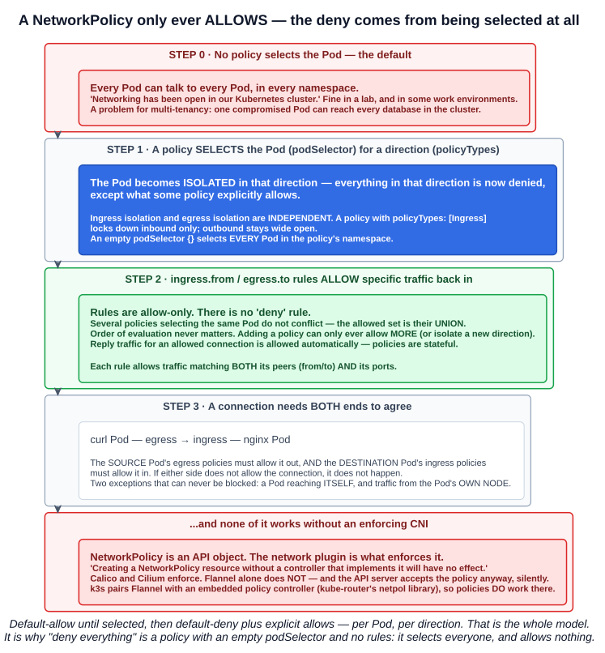
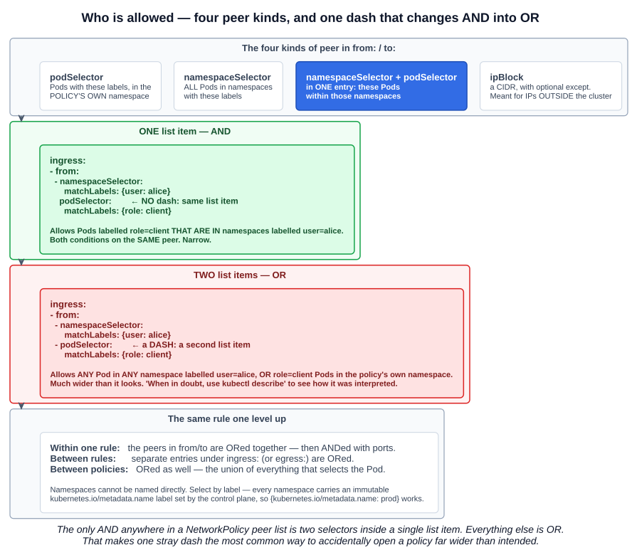
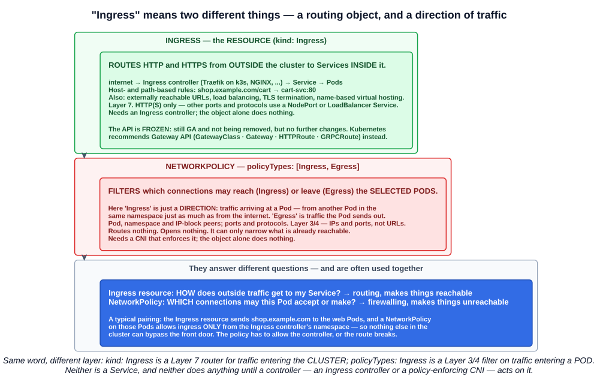

# 10 — Network policies

Every chapter so far has relied on one property of the cluster network without naming it: **any Pod can reach any other Pod**. The `curl` Pod from chapter 04-08 reached nginx across namespaces without asking anyone. NetworkPolicies are how you take that away.

---

## 1. Why: the network is open by default

> **Networking has been open in our Kubernetes cluster.**

That is the Kubernetes networking model working as designed (chapter 04-01): every Pod gets its own IP, and every Pod can reach every other Pod without NAT, in any namespace. The lecture's framing of when it matters:

| Environment | Is open networking a concern? |
|---|---|
| A learning environment | **No** |
| Less restrictive work environments | **Perhaps not** |
| **Multi-tenancy** — teams or customers sharing a cluster | **Yes. Apps should be isolated from each other** |

Namespaces do not help here. A namespace is a naming and RBAC boundary (chapters 04-04 and 05-02), **not a network boundary** — a Pod in `team-a` can reach a database in `team-b` unless something stops it.

> If you want to control traffic flow **at the IP address or port level (OSI layer 3 or 4)**, NetworkPolicies allow you to specify rules for traffic flow **within your cluster, and also between Pods and the outside world**.

What NetworkPolicies give you, in the lecture's terms:

- **Pods can be classified as isolated.**
- **We can limit access to other Pods, namespaces and/or IP blocks.**

Those three — **Pods, namespaces, IP blocks** — are the only three ways a policy can identify what a Pod may talk to:

> 1. Other pods that are allowed (exception: **a pod cannot block access to itself**)
> 2. Namespaces that are allowed
> 3. IP blocks (exception: **traffic to and from the node where a Pod is running is always allowed**)

---

## 2. How isolation works



This is the part to understand rather than memorise, because every behaviour follows from it.

### 2.1 Selected means isolated

> By default, **a pod is non-isolated** for egress; all outbound connections are allowed. **A pod is isolated for egress if there is any NetworkPolicy that both selects the pod and has "Egress" in its `policyTypes`**.

The same sentence holds for ingress. So:

1. **No policy selects a Pod** → everything is allowed, both ways.
2. **A policy selects a Pod for a direction** → that direction is now **deny by default**.
3. **The policy's rules** → allow specific traffic back in.

The deny never comes from a rule. **It comes from the Pod being selected at all.** A policy with an empty rule list is a pure "deny everything in this direction".

### 2.2 Directions are independent

Ingress isolation and egress isolation are separate switches. A policy with `policyTypes: [Ingress]` locks down what can reach the Pod and does nothing to what the Pod can reach. That is why the default-deny recipes in section 5 come in three flavours.

### 2.3 Rules only allow, and they add up

> **Network policies do not conflict; they are additive.** If any policy or policies apply to a given pod for a given direction, the connections allowed in that direction from that pod is **the union of what the applicable policies allow**. Thus, **order of evaluation does not affect the policy result**.

- **There is no deny rule.** The documentation lists it among things NetworkPolicy *cannot* do: *"the model for NetworkPolicies are deny by default, with only the ability to add allow rules."*
- **There is no priority or ordering.** Two policies selecting the same Pod are simply ORed.
- **Policies are stateful.** *"Reply traffic for those allowed connections will also be implicitly allowed"* — allow a request in, and its response goes out without a separate egress rule.

This is the same additive, allow-only model as RBAC (chapter 05-03): you cannot revoke a permission with another rule, only by removing what granted it.

### 2.4 Both ends must agree

> For a connection from a source pod to a destination pod to be allowed, **both the egress policy on the source pod and the ingress policy on the destination pod need to allow the connection**. If either side does not allow the connection, it will not happen.

### 2.5 Nothing happens without a CNI that enforces it

> Network policies are **implemented by the network plugin**... **Creating a NetworkPolicy resource without a controller that implements it will have no effect.**

The API server stores the object either way — **it accepts the policy silently** even when nothing will enforce it. Which plugins enforce (chapter 02-07):

| Plugin | Enforces NetworkPolicy? |
|---|---|
| **Calico** | **Yes** |
| **Cilium** | **Yes** (and extends it with its own L7-capable policies) |
| **Flannel** | **No** — connectivity only |
| **k3s default** | **Yes** — Flannel plus an **embedded network policy controller** built on kube-router's netpol library |

So the lecture's k3s cluster enforces policies out of the box, while a cluster on plain Flannel would accept every policy and apply none of them.

---

## 3. Anatomy of a NetworkPolicy

The lecture's manifest, adapted from the documentation's example:

```yaml
apiVersion: networking.k8s.io/v1
kind: NetworkPolicy
metadata:
  name: allow-nginx-access
  namespace: default
spec:
  podSelector:              # WHICH Pods this policy applies to (and isolates)
    matchLabels:
      run: nginx
  policyTypes:              # WHICH directions it isolates
  - Ingress
  ingress:                  # what may come IN
  - from:
    - podSelector:
        matchLabels:
          run: curl
    ports:
    - protocol: TCP
      port: 6379
  egress:                   # what may go OUT
  - to:
    - ipBlock:
        cidr: 10.0.0.0/24
    ports:
    - protocol: TCP
      port: 5978
```

| Field | Meaning |
|---|---|
| **`apiVersion: networking.k8s.io/v1`** | NetworkPolicy lives in the **`networking.k8s.io`** group. **Namespaced** — it only selects Pods in its own namespace |
| **`spec.podSelector`** | **The Pods the policy applies to.** An **empty `podSelector: {}` selects every Pod in the namespace** |
| **`spec.policyTypes`** | **`Ingress`**, **`Egress`**, or both — which directions the policy isolates |
| **`spec.ingress[].from`** | Allowed **sources** of incoming traffic |
| **`spec.egress[].to`** | Allowed **destinations** of outgoing traffic |
| **`ports`** | `protocol` (TCP, UDP or SCTP) and `port`, plus optional **`endPort`** for a range |

> Each rule allows traffic which matches **both the `from` and `ports` sections**.

### 3.1 `policyTypes` defaulting

> If no `policyTypes` are specified on a NetworkPolicy then by default **`Ingress` will always be set** and **`Egress` will be set if the NetworkPolicy has any egress rules**.

So omitting `policyTypes` is safe in the common cases, but writing it explicitly states your intent — and, as the next subsection shows, explicitly writing the wrong value has consequences.

### 3.2 Two problems in the lecture's manifest

The manifest on the slide is a teaching example built from the documentation's `role=db` sample, and two details in it would surprise you if you applied it as written:

**1. The `egress` block does nothing.** `policyTypes` is written explicitly as `[Ingress]`, so the selected Pods are **never isolated for egress**, and the `egress` rules have nothing to restrict. The API server accepts the object without complaint. If the intention is to restrict outbound traffic too, `policyTypes` must list `Egress` — or be omitted, in which case the defaulting above adds it.

**2. Port 6379 is Redis, not nginx.** The selected Pods run nginx on **port 80**. This policy isolates them for ingress and allows only TCP **6379** from the `curl` Pod — so `curl nginx` on port 80 is **blocked, even from the Pod the policy names**. Allowing the curl Pod to reach nginx needs `port: 80`. (The documentation's original selects a `role=db` Redis Pod, where 6379 is correct.)

Both are worth spotting: the second shows that `from` and `ports` are ANDed, and the first shows that `policyTypes` decides what is isolated regardless of which rules are present.

---

## 4. Selecting peers



### 4.1 The four peer kinds

| Peer | Selects |
|---|---|
| **`podSelector`** | Pods with these labels **in the policy's own namespace** |
| **`namespaceSelector`** | **All Pods** in namespaces with these labels |
| **`namespaceSelector` + `podSelector`** in one entry | **These Pods within those namespaces** |
| **`ipBlock`** | A CIDR range, with optional **`except`** sub-ranges. *"These should be **cluster-external IPs**, since Pod IPs are ephemeral and unpredictable"* |

Selectors are ordinary label selectors (chapter 04-12) — `matchLabels` or `matchExpressions`. **Namespaces cannot be named directly**, only selected by label, but the control plane sets an immutable label **`kubernetes.io/metadata.name`** on every namespace, so this targets one namespace by name:

```yaml
    - namespaceSelector:
        matchLabels:
          kubernetes.io/metadata.name: monitoring
```

### 4.2 The AND/OR trap

The documentation calls this out with *"be careful to use correct YAML syntax"*, and it is the most consequential typo in the whole API.

**One list item — AND:**

```yaml
  ingress:
  - from:
    - namespaceSelector:
        matchLabels:
          user: alice
      podSelector:          # no dash: same list item
        matchLabels:
          role: client
```

Allows Pods labelled `role=client` **that are in** namespaces labelled `user=alice`.

**Two list items — OR:**

```yaml
  ingress:
  - from:
    - namespaceSelector:
        matchLabels:
          user: alice
    - podSelector:          # a dash: a second list item
        matchLabels:
          role: client
```

Allows **any Pod in any namespace** labelled `user=alice`, **or** `role=client` Pods in the policy's own namespace. One dash, and a narrow rule becomes a wide one.

> When in doubt, use **`kubectl describe`** to see how Kubernetes has interpreted the policy.

The general rule: **the only AND in a peer list is two selectors inside one list item.** Peers within a `from`/`to` are ORed, separate rules are ORed, and separate policies are ORed.

### 4.3 Ports

```yaml
    ports:
    - protocol: TCP
      port: 32000
      endPort: 32768        # a range, stable since v1.25
```

NetworkPolicy covers **TCP, UDP and SCTP**. For anything else — **ICMP, ARP** — behaviour is **undefined** and varies by plugin, so a "deny all" policy may still let `ping` through on one CNI and not another. Testing a policy with `ping` is therefore unreliable; test with the real protocol.

---

## 5. Default policies

> By default, if no policies exist in a namespace, then **all ingress and egress traffic is allowed** to and from pods in that namespace.

The standard recipes all rely on an **empty `podSelector`**, which selects every Pod in the namespace:

**Default deny all ingress:**

```yaml
apiVersion: networking.k8s.io/v1
kind: NetworkPolicy
metadata:
  name: default-deny-ingress
spec:
  podSelector: {}
  policyTypes:
  - Ingress
```

**Default deny all egress:**

```yaml
spec:
  podSelector: {}
  policyTypes:
  - Egress
```

**Default deny everything:**

```yaml
spec:
  podSelector: {}
  policyTypes:
  - Ingress
  - Egress
```

**Allow all ingress** (an empty rule matches everything):

```yaml
spec:
  podSelector: {}
  ingress:
  - {}
  policyTypes:
  - Ingress
```

The usual production pattern is **default-deny, then allow** — one deny-all policy per namespace, plus narrow policies opening exactly what each workload needs. Because policies are additive, the deny-all keeps working underneath every allow you add.

**The DNS trap:**

> A **default deny-all egress policy also blocks DNS traffic**. If your workloads need DNS resolution, you must add a separate NetworkPolicy that allows egress to your cluster's DNS service.

Without it, every Service name lookup fails and the symptom looks like a broken application rather than a policy:

```yaml
spec:
  podSelector: {}
  policyTypes:
  - Egress
  egress:
  - to:
    - namespaceSelector:
        matchLabels:
          kubernetes.io/metadata.name: kube-system
      podSelector:
        matchLabels:
          k8s-app: kube-dns
    ports:
    - protocol: UDP
      port: 53
    - protocol: TCP
      port: 53
```

**Default policies are per namespace.** There is no cluster-wide NetworkPolicy in the core API — the docs list *"default policies which are applied to all namespaces or pods"* among the things it cannot do. Every new namespace starts wide open until someone adds its deny-all.

---

## 6. NetworkPolicy versus Ingress



The lecture's slide defines ingress as *"the process of managing incoming traffic to services within a Kubernetes cluster"*. That definition fits the **Ingress resource**. Inside a NetworkPolicy, the same word means something narrower and different, and mixing the two is a classic exam distractor.

### 6.1 Two meanings of one word

| | **Ingress resource** (`kind: Ingress`) | **NetworkPolicy ingress** (`policyTypes: [Ingress]`) |
|---|---|---|
| **What it is** | An API object that **routes** traffic | A **direction** of traffic in a filtering rule |
| **Purpose** | Make Services **reachable** from outside | Make Pods **unreachable** except where allowed |
| **Traffic it concerns** | **External** HTTP(S) entering the **cluster** | **Any** traffic entering a **Pod** — including Pod-to-Pod in the same namespace |
| **OSI layer** | **Layer 7** — hostnames, URL paths | **Layer 3/4** — IPs, ports, protocols |
| **Matches on** | Host and path → backend Service | Pod labels, namespace labels, CIDRs, ports |
| **Protocols** | **HTTP and HTTPS only** | TCP, UDP, SCTP |
| **Extras** | TLS termination, name-based virtual hosting, load balancing | None — allow or not |
| **Needs** | An **Ingress controller** (Traefik on k3s, NGINX, ...) | A **CNI that enforces policy** (Calico, Cilium, ...) |
| **Opposite direction** | None — Ingress handles inbound only | **`Egress`**, traffic a Pod sends out |
| **API group** | `networking.k8s.io/v1` | `networking.k8s.io/v1` |

Both objects share an API group and the word "ingress", and both **do nothing on their own** until a controller acts on them. That is where the similarity ends.

### 6.2 They are used together

They answer different questions, so a real deployment uses both:

- **The Ingress resource** answers *"how does outside traffic get to my Service?"* — `shop.example.com/cart` → `cart-svc:80`.
- **A NetworkPolicy** answers *"which connections may these Pods accept?"* — only from the Ingress controller's namespace.

That pairing means nothing else in the cluster can reach the web Pods by going around the front door. It also produces a common failure: **add a default-deny policy and the Ingress route breaks**, because the Ingress controller is itself a Pod whose traffic now needs an explicit allow.

### 6.3 The state of the Ingress API

Two current facts worth knowing, because course material often predates them:

- **The Ingress API is frozen.** *"The Kubernetes project recommends using **Gateway** instead of Ingress. The Ingress API has been frozen."* It remains **generally available** with **no plans to remove it**, but will get **no further changes**.
- **Gateway API is the successor.** Its stable kinds are **GatewayClass**, **Gateway**, **HTTPRoute** and **GRPCRoute**, designed to be **role-oriented**, portable and expressive — header matching and traffic weighting that Ingress could only do through controller-specific annotations.

And for the controller most people associate with Ingress: the community **ingress-nginx** project was **retired** — best-effort maintenance ended in **March 2026**, with no further releases or security fixes. Existing deployments keep working; new ones should choose a Gateway API implementation.

---

## 7. What NetworkPolicy cannot do

The documentation keeps an explicit list. The ones most likely to appear as wrong answers:

| Cannot | Use instead |
|---|---|
| **Anything TLS-related** | A **service mesh** or an **Ingress controller** |
| **Explicit deny rules** | Not possible — deny comes only from isolation |
| **Target Services by name** | Select the Pods or namespaces behind them **by label** |
| **Node-specific policies** by node identity | CIDR blocks for node IPs |
| **Default policies across all namespaces** | Third-party distributions and projects |
| **Log allowed or blocked connections** | CNI-specific tooling (for example Cilium's Hubble) |
| **Block a Pod's own loopback, or traffic from its own node** | Not possible |
| **Force cluster traffic through a common gateway** | A **service mesh** or other proxy |

The recurring answer — service mesh for TLS, identity-based and Layer 7 policy — is where section 7 of the course is heading.

Two behaviour details round it out:

- **Timing.** A Pod created just before its policy is processed **may start unprotected** briefly; once processed, new Pods are isolated before any container starts, init containers included.
- **Existing connections.** Whether a policy change cuts an *already open* connection is **implementation defined**.

---

## Exam angle

- **By default, all Pods can communicate with all other Pods, across all namespaces.** Namespaces are **not** a network boundary. NetworkPolicies add isolation, which matters most for **multi-tenancy**.
- **NetworkPolicies control traffic at OSI Layer 3/4** — IP addresses and ports for **TCP, UDP and SCTP**. Peers are identified by **Pods, namespaces or IP blocks**.
- **A Pod is isolated in a direction as soon as any policy selects it with that direction in `policyTypes`.** Unselected Pods are open. **Ingress and egress isolation are independent.**
- **Policies only allow — there are no deny rules.** They are **additive** (the union of every policy selecting the Pod), so **order does not matter**. Reply traffic is implicitly allowed.
- **A connection needs both the source Pod's egress and the destination Pod's ingress to allow it.**
- **NetworkPolicies require a CNI plugin that enforces them** (Calico, Cilium). **Flannel alone does not**; without enforcement the policy is accepted and has **no effect**.
- **An empty `podSelector: {}` selects every Pod in the namespace** — the basis of default-deny. **NetworkPolicy is namespaced.**
- **`policyTypes` defaults to `Ingress`, plus `Egress` if egress rules exist.** Written explicitly as `[Ingress]`, any egress rules are ignored.
- **In one `from`/`to` list item, `namespaceSelector` + `podSelector` are ANDed. As two list items they are ORed.**
- **A default-deny egress policy also blocks DNS** — allow UDP/TCP 53 to `kube-dns`.
- **The Ingress resource routes external HTTP(S) to Services at Layer 7 and needs an Ingress controller. NetworkPolicy `Ingress` is a direction — traffic entering a Pod — filtered at Layer 3/4 and enforced by the CNI.**
- **NetworkPolicy cannot do TLS, explicit deny, Service-name targeting or connection logging** — a **service mesh** covers the TLS and Layer 7 cases.
- **The Ingress API is frozen; Gateway API (GatewayClass, Gateway, HTTPRoute, GRPCRoute) is the recommended successor.**

## References

- [Network Policies](https://kubernetes.io/docs/concepts/services-networking/network-policies/) — isolation semantics, the four peer kinds, default policies, and what NetworkPolicy cannot do
- [Declare Network Policy](https://kubernetes.io/docs/tasks/administer-cluster/declare-network-policy/) — a hands-on walkthrough of restricting access to an nginx Service
- [Ingress](https://kubernetes.io/docs/concepts/services-networking/ingress/) — the routing resource, its controllers, and the API freeze
- [Gateway API](https://kubernetes.io/docs/concepts/services-networking/gateway/) — the recommended successor to Ingress
