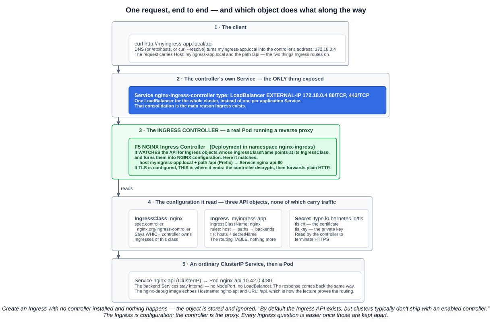
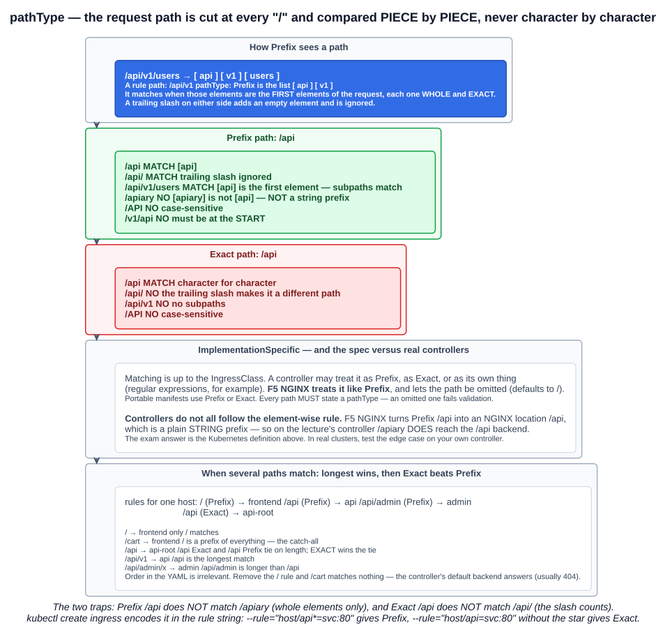
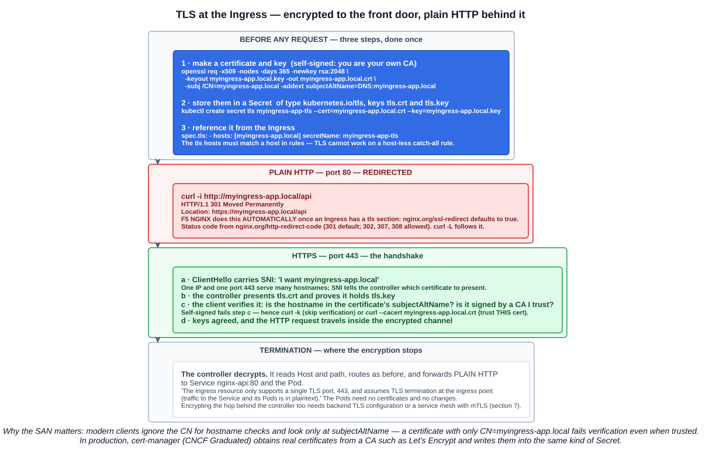

# 11 — Ingress

The course splits Ingress into three lectures: what it is and installing a controller, routing rules, and TLS. They are one topic, so this is one chapter.

Chapter 05-10 already separated the **Ingress resource** from the **ingress direction** in a NetworkPolicy. This chapter is the resource: the object that routes HTTP and HTTPS from outside the cluster to Services inside it.

---

## 1. What Ingress is, and why it exists

> Ingress exposes **HTTP and HTTPS routes from outside the cluster to Services within the cluster**. Traffic routing is controlled by **rules defined on the Ingress resource**.

> An Ingress may be configured to give Services **externally-reachable URLs**, **load balance** traffic, **terminate SSL / TLS**, and offer **name-based virtual hosting**.

### The problem it solves

From chapter 04-08, exposing a Service outside the cluster means a **NodePort** or a **LoadBalancer**. That works for one application. With twenty, it means twenty cloud load balancers (each with its own IP and bill), or twenty high-numbered NodePorts to remember — and no shared place for TLS certificates.

The lecture's case for Ingress:

| Without Ingress | With Ingress |
|---|---|
| **Each Service exposed separately** with its own LoadBalancer or NodePort | **One entry point** — a single LoadBalancer in front of the controller |
| Routing decided by **which IP or port** the client hits | **Multiple routing rules consolidated into a single resource**, by hostname and path — simpler to manage and easier to scale |
| TLS handled by every application | **SSL/TLS termination** at one place |
| Configuration scattered across Services | **A centralised point of management** |

Ingress can be thought of as an extension of the core Services: the backends are still ordinary Services, now **ClusterIP** only, reached through one shared front door.

### Limits worth knowing

- **HTTP and HTTPS only.** *"An Ingress does not expose arbitrary ports or protocols."* A database, a gRPC-over-raw-TCP service or anything non-HTTP still needs a NodePort or LoadBalancer Service.
- **One TLS port, 443.**
- **Layer 7** — it routes on hostnames and URL paths, which is exactly what a NetworkPolicy (Layer 3/4) cannot see.

---

## 2. Three pieces: resource, controller, class



This is the distinction that makes everything else make sense.

| Piece | What it is | Does it carry traffic? |
|---|---|---|
| **Ingress resource** (`kind: Ingress`) | An API object holding **routing rules** — a table of host → path → Service | **No** |
| **Ingress controller** | A **real application running in Pods**, usually a reverse proxy (NGINX, Traefik, HAProxy, Envoy). It **watches Ingress objects and configures itself** from them | **Yes** — every request passes through it |
| **IngressClass** (`kind: IngressClass`) | A small object naming **which controller** owns Ingresses of that class | No |

> You must have an Ingress controller to satisfy an Ingress. **Only creating an Ingress resource has no effect.**

And the lecture's point about clusters: **the Ingress API exists in every Kubernetes cluster, but clusters typically do not ship with a controller enabled.** The `Ingress` kind is always available; something has to be installed to act on it. (k3s is an exception — it installs **Traefik** by default. The lecture uses F5 NGINX instead.)

This is the same pattern as chapter 05-10, where a NetworkPolicy does nothing without an enforcing CNI, and chapter 05-01's CRDs, where an object does nothing without an operator. **Kubernetes stores the intent; a controller makes it real.**

### 2.1 IngressClass

```bash
kubectl get ingressclasses
```

```
NAME    CONTROLLER                     PARAMETERS   AGE
nginx   nginx.org/ingress-controller   <none>       95s
```

An IngressClass is mostly metadata. **The important field is `spec.controller`** — the identifier the controller looks for. An Ingress opts in with **`spec.ingressClassName: nginx`**, and only the controller registered for class `nginx` will act on it. This is how several controllers coexist in one cluster.

```yaml
apiVersion: networking.k8s.io/v1
kind: IngressClass
metadata:
  name: nginx
  annotations:
    ingressclass.kubernetes.io/is-default-class: "true"
spec:
  controller: nginx.org/ingress-controller
```

### 2.2 The default IngressClass

> Setting the **`ingressclass.kubernetes.io/is-default-class`** annotation to `true` on an IngressClass resource will ensure that **new Ingresses without an `ingressClassName` field specified will be assigned this default IngressClass**.

That is what the lecture's `kubectl edit ingressclass/nginx` was doing — adding that annotation so Ingresses work without naming a class.

> **If you have more than one IngressClass marked as the default**, the admission controller **prevents creating new Ingress objects that don't have an `ingressClassName`** specified.

Two defaults means no default at all — and a hard error rather than a silent guess. Note the parallel with StorageClass (chapter 05-08), whose default annotation is `storageclass.kubernetes.io/is-default-class`.

Before IngressClass existed (it arrived in **Kubernetes 1.18**), the class was set with a **`kubernetes.io/ingress.class` annotation**. That annotation is **deprecated**; you will still see it in older manifests and blog posts.

---

## 3. Two NGINX controllers, and a lot of confusion

The lecture spends time on this because the names are nearly identical:

| | **F5 NGINX Ingress Controller** | **ingress-nginx** |
|---|---|---|
| Also called | `kubernetes-ingress`, **`nginx-ingress`** | Community NGINX controller |
| Maintained by | **F5 / NGINX**, open source with enterprise editions | **Kubernetes community** (SIG Network) |
| IngressClass `controller` | **`nginx.org/ingress-controller`** | `k8s.io/ingress-nginx` |
| Annotation prefix | **`nginx.org/...`** | `nginx.ingress.kubernetes.io/...` |
| Status | **Actively developed** | **Retired** — announced November 2025, best-effort maintenance **until March 2026**, then no releases or security fixes |

**These are two different projects.** The retirement of ingress-nginx led to claims that "Ingress is being deprecated". It is not. Three different statements are true at once, and keeping them apart is worth an exam question:

| Statement | True? |
|---|---|
| **The ingress-nginx controller project is retired** | **Yes** — one controller among many |
| **The Ingress API is frozen** | **Yes** — GA, *"no further changes or updates"*, Gateway API recommended for new work (chapter 05-10) |
| **The Ingress API is deprecated or being removed** | **No** — *"The Kubernetes project has no plans to remove Ingress from Kubernetes"* |

Many other controllers — F5 NGINX, Traefik, HAProxy, Contour, Emissary and others — are actively maintained.

Annotations are where controllers diverge. Anything beyond host-and-path routing (redirects, rewrites, timeouts, rate limits) is configured through **controller-specific annotations**, so an Ingress written for one controller often does not behave the same on another. That lack of portability is one of the main things Gateway API fixes.

---

## 4. Installing the F5 NGINX controller

The lecture installs it with **Helm**, the Kubernetes package manager (section 7 of the course):

```bash
helm repo add nginx-stable https://helm.nginx.com/stable
helm repo update
helm install nginx-ingress nginx-stable/nginx-ingress \
  --namespace nginx-ingress --create-namespace
```

`--create-namespace` creates `nginx-ingress` if it does not exist. (F5's current documentation also publishes the chart as an OCI artifact: `helm install nginx-ingress oci://ghcr.io/nginx/charts/nginx-ingress`.)

Then the lecture inspects what the chart created — each object is something from an earlier chapter:

```bash
kubectl -n nginx-ingress get service
```

```
NAME                       TYPE           CLUSTER-IP      EXTERNAL-IP   PORT(S)
nginx-ingress-controller   LoadBalancer   10.43.239.182   172.18.0.5    80:31750/TCP,443:30743/TCP
```

**A single LoadBalancer Service on 80 and 443** — the one front door. On k3s the `EXTERNAL-IP` comes from k3s's built-in ServiceLB; on a cloud it would be a real load balancer.

```bash
kubectl -n nginx-ingress get endpointslices    # 443,80 → the controller Pod's IP
kubectl -n nginx-ingress get deployment        # nginx-ingress-controller 1/1
kubectl -n nginx-ingress get pods -o wide      # the reverse proxy itself
kubectl get ingressclasses                     # nginx  nginx.org/ingress-controller
```

**Installing the controller registered an IngressClass.** That is the link between "a proxy is running" and "my Ingress objects are handled".

---

## 5. Routing rules

### 5.1 The backends

The lecture creates three Pods from `spurin/nginx-debug` — an image that answers with its own hostname, IP and the URL it received, so routing is visible in the response — and gives each a ClusterIP Service:

```bash
kubectl run nginx-frontend --image=spurin/nginx-debug --port=80
kubectl run nginx-api      --image=spurin/nginx-debug --port=80
kubectl run nginx-admin    --image=spurin/nginx-debug --port=80

kubectl expose pod/nginx-frontend
kubectl expose pod/nginx-api
kubectl expose pod/nginx-admin
```

`kubectl expose` uses the Pod's `run=<name>` label as the Service selector and its `--port` as the Service port (chapter 04-08). `curl <pod IP>` from a node confirms each one answers before any Ingress exists.

### 5.2 Generating an Ingress

```bash
kubectl create ingress minimal-ingress --class=nginx-example \
  --rule="/testpath*=test:80" -o yaml --dry-run=client
```

The `--rule` string is `host/path=service:port[,tls[=secret]]`, and **a trailing `*` on the path means `pathType: Prefix`; no `*` means `Exact`**. Leave the host off for a rule that matches any host.

### 5.3 The lecture's Ingress

```yaml
apiVersion: networking.k8s.io/v1
kind: Ingress
metadata:
  name: myingress-app
spec:
  ingressClassName: nginx
  rules:
  - host: myingress-app.local
    http:
      paths:
      - path: /
        pathType: Prefix
        backend:
          service:
            name: nginx-frontend
            port:
              number: 80
      - path: /api
        pathType: Prefix
        backend:
          service:
            name: nginx-api
            port:
              number: 80
      - path: /admin
        pathType: Prefix
        backend:
          service:
            name: nginx-admin
            port:
              number: 80
```

The structure, top to bottom:

| Level | Field | Meaning |
|---|---|---|
| Ingress | **`ingressClassName`** | Which controller handles it |
| Rule | **`host`** | Which `Host` header this rule applies to. **Optional in the API** — omitted, it matches all hosts |
| Path | **`path`** + **`pathType`** | Which URL paths go to this backend (section 6) |
| Backend | **`service.name`** + **`service.port.number`** (or `.name`) | The ClusterIP Service to forward to |

> Both the **host and path must match** the content of an incoming request before the load balancer directs traffic to the referenced Service.

This shape — one host, several paths, several Services — is what the docs call **simple fanout**.

### 5.4 F5 NGINX requires a host

The API allows a rule with no `host`. **F5 NGINX does not.** Its documented restrictions:

- **When defining an Ingress resource, the `host` field is required.**
- The **`host` must be unique** among all Ingress and VirtualServer resources (unless using its "mergeable" Ingress feature).
- `path` is required for **`Exact`** and **`Prefix`**.
- **`ImplementationSpecific` is treated as `Prefix`**, except that `path` may then be omitted and **defaults to `/`**.

That is why the docs' host-less `minimal-ingress` would not be served here, and why the lecture's Ingress names `myingress-app.local`. A good example of the warning in section 3: the API is portable, controllers are not.

### 5.5 Why routing on a hostname works: the Host header

The lecture's history slide explains the mechanism under name-based routing:

| | HTTP/1.0 (1996) | HTTP/1.1 (1997) |
|---|---|---|
| Hostname in the request | **Not required** | **`Host` header mandatory** |
| Consequence | Typically **one website per IP address** | **Virtual hosting** — many domains on one server and one IP |

When you browse to `http://myingress-app.local/api`, the request carries both pieces:

```
GET /api HTTP/1.1
Host: myingress-app.local
```

The Ingress controller has one IP. **The `Host` header is how it tells `shop.example.com` from `admin.example.com`** arriving at that same address, and the path is how it tells `/api` from `/admin`. Those two strings are the entire input to Ingress routing.

Name-based virtual hosting in Ingress form — two hosts, one IP:

```yaml
  rules:
  - host: first.bar.com
    http: {paths: [{path: /, pathType: Prefix, backend: {service: {name: service1, port: {number: 80}}}}]}
  - host: second.bar.com
    http: {paths: [{path: /, pathType: Prefix, backend: {service: {name: service2, port: {number: 80}}}}]}
```

### 5.6 Host wildcards

| Rule host | `Host` header | Match? |
|---|---|---|
| `*.foo.com` | `bar.foo.com` | **Yes** — shared suffix |
| `*.foo.com` | `baz.bar.foo.com` | **No** — the wildcard covers **one DNS label only** |
| `*.foo.com` | `foo.com` | **No** — there must be one label |

### 5.7 Testing without DNS

`myingress-app.local` is not a real DNS name, so the client has to be told where it lives. The lecture shows both ways:

```bash
# 1. /etc/hosts — every program on this machine resolves it
echo "172.18.0.4 myingress-app.local" | sudo tee -a /etc/hosts
curl http://myingress-app.local/api

# 2. curl --resolve — this one request only, nothing changed on the machine
curl --resolve '*:80:172.18.0.4' http://myingress-app.local/api
```

`--resolve host:port:address` pins a name to an IP for that request. The `*` host (supported since curl 7.64.0) applies it to any hostname on port 80. Either way, **the request still carries `Host: myingress-app.local`**, which is what the controller routes on.

A third option skips name resolution entirely by setting the header yourself:

```bash
curl -H "Host: myingress-app.local" http://172.18.0.4/api
```

The result, from the nginx-debug responses:

```
http://myingress-app.local/        →  Hostname: nginx-frontend   URL: /
http://myingress-app.local/api     →  Hostname: nginx-api        URL: /api
http://myingress-app.local/admin   →  Hostname: nginx-admin      URL: /admin
```

**Same IP, same port, three different Pods** — chosen purely by path. Note the backend sees the **full original path** (`/api`, not `/`). Ingress forwards the path unchanged unless a controller-specific rewrite annotation says otherwise, so the API Pod must actually serve `/api`.

### 5.8 Requests that match nothing

> If none of the hosts or paths match the HTTP request in the Ingress objects, the traffic is routed to your **default backend**.

The default backend is normally **a setting of the controller** (typically answering **404**), though an Ingress can set **`spec.defaultBackend`** — and must, if it has no `rules` at all.

---

## 6. pathType, properly



> **Each path in an Ingress is required to have a corresponding path type.** Paths that do not include an explicit `pathType` will fail validation.

There are three, and the docs define them precisely.

### 6.1 `Exact`

> Matches the URL path **exactly** and with **case sensitivity**.

Character for character. `/api` matches `/api` and nothing else — not `/api/`, not `/api/v1`, not `/API`.

### 6.2 `Prefix` — element by element

> Matches based on a URL path prefix **split by `/`**. Matching is case sensitive and done on a **path element by element basis**. A path element refers to the list of labels in the path split by the `/` separator.

This is the part that is easy to get wrong. **Prefix is not a string prefix.** The path is cut into pieces at every `/`, and the rule's pieces must be the **first whole pieces** of the request:

```
rule     /api          →  [api]
request  /api/v1/users →  [api] [v1] [users]     MATCH: [api] is the first element
request  /apiary       →  [apiary]                NO:    "apiary" is not "api"
```

> If the last element of the path is a **substring** of the last element in request path, **it is not a match** (for example: `/foo/bar` matches `/foo/bar/baz`, but does not match `/foo/barbaz`).

A trailing slash just adds an empty element, and is ignored on either side.

### 6.3 The documentation's examples

| Kind | Rule path(s) | Request path | Matches? |
|---|---|---|---|
| Prefix | `/` | (all paths) | **Yes** |
| Exact | `/foo` | `/foo` | **Yes** |
| Exact | `/foo` | `/bar` | No |
| Exact | `/foo` | `/foo/` | **No** — the slash counts |
| Exact | `/foo/` | `/foo` | **No** |
| Prefix | `/foo` | `/foo`, `/foo/` | **Yes** |
| Prefix | `/foo/` | `/foo`, `/foo/` | **Yes** |
| Prefix | `/aaa/bb` | `/aaa/bbb` | **No** — `bb` is not `bbb` |
| Prefix | `/aaa/bbb` | `/aaa/bbb` | Yes |
| Prefix | `/aaa/bbb/` | `/aaa/bbb` | Yes, ignores trailing slash |
| Prefix | `/aaa/bbb` | `/aaa/bbb/` | Yes, matches trailing slash |
| Prefix | `/aaa/bbb` | `/aaa/bbb/ccc` | **Yes, matches subpath** |
| Prefix | `/aaa/bbb` | `/aaa/bbbxyz` | **No, does not match string prefix** |
| Prefix | `/`, `/aaa` | `/aaa/ccc` | Yes, matches `/aaa` |
| Prefix | `/`, `/aaa`, `/aaa/bbb` | `/aaa/bbb` | Yes, matches `/aaa/bbb` |
| Prefix | `/`, `/aaa`, `/aaa/bbb` | `/ccc` | Yes, matches `/` |
| Prefix | `/aaa` | `/ccc` | **No — uses the default backend** |
| Mixed | `/foo` (Prefix), `/foo` (Exact) | `/foo` | **Yes, prefers Exact** |

### 6.4 When several paths match

> Precedence will be given first to the **longest matching path**. If two paths are still equally matched, precedence will be given to paths with an **exact path type over prefix** path type.

So **order in the YAML does not matter**. The lecture's Ingress works because of this rule, not because `/` is listed first:

| Request | Candidates | Winner |
|---|---|---|
| `/` | `/` | `nginx-frontend` |
| `/cart` | `/` | `nginx-frontend` — `/` is a prefix of every path, so it is the **catch-all** |
| `/api/users` | `/`, `/api` | `nginx-api` — `/api` is longer |
| `/apiary` | `/` only, per the spec | `nginx-frontend` — `/api` is not an element-wise prefix of `/apiary` (but see 6.6) |
| `/admin/settings` | `/`, `/admin` | `nginx-admin` |

Without the `/` rule, `/cart` matches nothing and falls to the controller's default backend.

### 6.5 `ImplementationSpecific`

> With this path type, **matching is up to the IngressClass**. Implementations can treat this as a separate `pathType` or treat it identically to `Prefix` or `Exact` path types.

Controllers use it for their own matching — **regular expressions**, for example. F5 NGINX treats it as `Prefix`. Because its behaviour changes with the controller, **portable manifests use `Prefix` or `Exact`**.

### 6.6 The spec versus real controllers

Everything above is the **Kubernetes definition**, and it is the answer the exam wants. Controllers are supposed to implement it — but not all of them do so exactly, and the lecture's controller is one of the exceptions.

F5 NGINX turns each Ingress path into an NGINX `location` block. For `Exact` it writes `location = /api`, a true exact match. For **`Prefix` it writes `location /api`** — and an NGINX `location` without a modifier is a **plain string prefix**. So on F5 NGINX:

| Request | Kubernetes spec says | F5 NGINX does |
|---|---|---|
| `/api/users` | `/api` backend | `/api` backend |
| `/apiary` | **`/` backend** — not an element-wise match | **`/api` backend** — `/apiary` starts with the string `/api` |

Usually harmless, occasionally a real bug: a `/admin` Prefix rule on F5 NGINX also catches `/administrator` and `/admin-old`. If that matters, write the rule as `/admin/` plus an `Exact` rule for `/admin`, and **test the edge case on your own controller** rather than trusting the definition.

The lesson generalises: the Ingress API defines the *intent*, and the controller decides the *behaviour*. It is the same portability gap that annotations create (section 3), and one of the reasons Gateway API publishes conformance tests that implementations must pass.

### 6.7 Choosing

| Use | When |
|---|---|
| **`Prefix`** | Almost always — a section of a site or an API and everything under it (`/api`, `/static`) |
| **`Exact`** | One specific endpoint that must not swallow anything beneath it (`/healthz`, `/login`), or to win a tie against a Prefix of the same length |
| **`ImplementationSpecific`** | Only when you need a controller feature such as regex and accept the lock-in |

---

## 7. TLS



The last lecture adds HTTPS. If certificates feel foreign, chapter 05-02 already covered the core idea — a certificate is a public key plus an identity, signed by a CA the other side trusts. Here the roles are reversed: the **server** proves its identity to the **client**.

### 7.1 What TLS gives you

| Property | Meaning |
|---|---|
| **Encryption** | Nobody between client and server can read the traffic |
| **Integrity** | Nobody can alter it in transit undetected |
| **Authentication** | The client can verify it reached the real `myingress-app.local`, not an impostor |

### 7.2 Step 1 — a certificate and key

```bash
openssl req -x509 -nodes -days 365 \
  -newkey rsa:2048 \
  -keyout myingress-app.local.key \
  -out myingress-app.local.crt \
  -subj "/CN=myingress-app.local" \
  -addext "subjectAltName=DNS:myingress-app.local"
```

| Flag | Meaning |
|---|---|
| **`req -x509`** | Produce a **self-signed certificate** directly, instead of a CSR for a CA to sign (compare chapter 05-04, where a CSR went to the cluster CA) |
| **`-nodes`** | "No DES" — **do not encrypt the private key** with a passphrase. The controller must read it unattended |
| **`-days 365`** | Valid for one year |
| **`-newkey rsa:2048`** | Generate a new 2048-bit RSA key pair at the same time |
| **`-keyout` / `-out`** | Where to write the **private key** and the **certificate** |
| **`-subj "/CN=..."`** | The certificate's subject — the Common Name |
| **`-addext "subjectAltName=DNS:..."`** | The **Subject Alternative Name** — the hostname(s) the certificate is valid for |

**The SAN is the part that matters.** Modern clients ignore the CN when checking a hostname and look only at `subjectAltName`. A certificate with only `CN=myingress-app.local` fails verification even when you have told the client to trust it. Older tutorials omit `-addext`; this is why they no longer work.

**Self-signed means you are your own CA.** Nothing else trusts it. That is fine for a lab and the reason clients need extra flags below. In production, **cert-manager** (CNCF Graduated, chapter 04-11) obtains certificates from a real CA such as Let's Encrypt and renews them automatically.

### 7.3 Step 2 — a TLS Secret

```bash
kubectl create secret tls myingress-app-tls \
  --cert=myingress-app.local.crt \
  --key=myingress-app.local.key
```

This creates a Secret of **type `kubernetes.io/tls`** with exactly two keys, **`tls.crt`** and **`tls.key`** — the shape every Ingress controller expects (chapter 04-11):

```yaml
apiVersion: v1
kind: Secret
metadata:
  name: myingress-app-tls
type: kubernetes.io/tls
data:
  tls.crt: <base64 certificate>
  tls.key: <base64 private key>
```

The Secret must be in the **same namespace as the Ingress**.

### 7.4 Step 3 — reference it from the Ingress

```yaml
spec:
  ingressClassName: nginx
  tls:
  - hosts:
    - myingress-app.local
    secretName: myingress-app-tls
  rules:
  - host: myingress-app.local
    http:
      paths: ...
```

Or imperatively, with `,tls=<secret>` on the rule:

```bash
kubectl create ingress myingress-app --class=nginx \
  --rule="myingress-app.local/*=nginx-frontend:80,tls=myingress-app-tls" \
  --rule="myingress-app.local/api*=nginx-api:80" \
  --rule="myingress-app.local/admin*=nginx-admin:80"
```

> **TLS will not work on the default rule** because the certificates would have to be issued for all the possible sub-domains. Therefore, **`hosts` in the `tls` section need to explicitly match the `host` in the `rules` section**.

### 7.5 What happens on an HTTPS request

1. **The client opens a connection to port 443** and sends a ClientHello that includes **SNI** (Server Name Indication) — the hostname it wants, in plain text, *before* encryption starts.
2. **The controller picks the certificate for that hostname.** One IP and one port serve many sites; SNI is the TLS equivalent of the `Host` header. *"If the TLS configuration section in an Ingress specifies different hosts, they are multiplexed on the same port according to the hostname specified through the SNI TLS extension."*
3. **The controller presents `tls.crt`** and proves it holds the matching `tls.key`.
4. **The client verifies** that the hostname appears in the certificate's SAN and that a CA it trusts signed it.
5. **Session keys are agreed**, and the ordinary HTTP request — `Host`, path and all — travels inside the encrypted channel.

Step 4 is where a self-signed certificate fails, so testing needs one of:

```bash
curl -k --resolve 'myingress-app.local:443:172.18.0.4' https://myingress-app.local/api
#    -k: skip verification entirely (encrypted, but the server is not authenticated)

curl --cacert myingress-app.local.crt --resolve 'myingress-app.local:443:172.18.0.4' https://myingress-app.local/api
#    --cacert: trust exactly this certificate -- verification passes, which also proves the SAN is right
```

`--resolve` matters more here than for HTTP: curl must believe it is talking to `myingress-app.local` so that it sends the right SNI and checks the right name.

Inspecting what the controller actually presented:

```bash
openssl s_client -connect 172.18.0.4:443 -servername myingress-app.local </dev/null 2>/dev/null \
  | openssl x509 -noout -subject -ext subjectAltName -dates
```

### 7.6 Termination: where the encryption stops

> The Ingress resource only supports a single TLS port, 443, and **assumes TLS termination at the ingress point** (traffic to the Service and its Pods is in **plaintext**).

**The controller decrypts.** It reads `Host` and path, routes exactly as in section 5, and forwards **plain HTTP** to `nginx-api:80`. The Pods need no certificates and no changes — which is a large part of the appeal: one place to manage certificates, instead of every application.

The trade-off is that the hop inside the cluster is unencrypted. Encrypting that too means configuring backend TLS (controller-specific) or a **service mesh with mTLS** (section 7 of the course).

### 7.7 HTTP to HTTPS redirects

Once a site has HTTPS, plain HTTP should send the client there rather than serve the page unencrypted:

```bash
curl -i --resolve '*:80:172.18.0.4' http://myingress-app.local/api
```

```
HTTP/1.1 301 Moved Permanently
Location: https://myingress-app.local/api
```

The **`301`** status and the **`Location`** header tell the client "this lives at another URL now, permanently". Browsers follow it automatically; curl needs **`-L`**.

The redirect is configured through **controller annotations**, not the Ingress API — there is no redirect field in the Ingress spec. For **F5 NGINX**:

| Annotation | Default | What it does |
|---|---|---|
| **`nginx.org/ssl-redirect`** | **`true`** | **Redirect all HTTP to HTTPS when TLS is configured.** Because the default is `true`, **adding a `tls` section to the Ingress turns redirects on automatically** |
| **`nginx.org/http-redirect-code`** | **`301`** | The status code — `301`, `302`, `307` or `308` |
| **`nginx.org/redirect-to-https`** | `false` | Redirect based on the **`X-Forwarded-Proto`** header — for when TLS is terminated by a **load balancer in front of** the controller, which therefore only ever sees HTTP |
| **`nginx.org/hsts`** | `false` | Send an **HSTS** header — telling browsers to use HTTPS for this host from now on, without even trying HTTP first |

```yaml
metadata:
  annotations:
    nginx.org/ssl-redirect: "true"          # already the default once tls: is set
    nginx.org/http-redirect-code: "308"     # 308 also preserves the method (POST stays POST)
```

On the community ingress-nginx controller the equivalent is `nginx.ingress.kubernetes.io/ssl-redirect`; on Traefik it is a middleware. Same behaviour, different spelling — the portability problem from section 3 again.

| Code | Meaning | Method preserved? |
|---|---|---|
| **301** | Moved Permanently | Not guaranteed (clients may turn POST into GET) |
| **302** | Found (temporary) | Not guaranteed |
| **307** | Temporary Redirect | **Yes** |
| **308** | Permanent Redirect | **Yes** |

---

## 8. Ingress and Gateway API

Understanding Ingress first is the easiest route into **Gateway API**, which is built on the same ideas and fixes Ingress's weak spots (chapter 05-10):

| Ingress | Gateway API |
|---|---|
| **IngressClass** | **GatewayClass** |
| The controller's listener (port 80/443) | **Gateway** — an explicit object for the entry point and its listeners |
| **Ingress** rules (host + path) | **HTTPRoute** (and **GRPCRoute**) |
| Redirects, rewrites, header matching, traffic splitting via **controller-specific annotations** | **Built into the API** — portable across implementations |
| One object owned by one team | **Role-oriented** — infrastructure provider, cluster operator and application developer each own their own object |

The routing model — hostnames, paths, backends, TLS termination at the edge — carries straight over.

---

## Exam angle

- **Ingress exposes HTTP and HTTPS routes from outside the cluster to Services inside it**, by **hostname and URL path**. It can provide externally reachable URLs, load balancing, **TLS termination** and **name-based virtual hosting**.
- **Ingress is Layer 7 and HTTP(S) only.** Other ports and protocols use a **NodePort** or **LoadBalancer** Service.
- **Without Ingress, each Service is exposed separately** with its own LoadBalancer or NodePort. Ingress **consolidates routing rules into one resource** behind **one entry point**.
- **An Ingress resource does nothing without an Ingress controller**, and **clusters typically do not ship with one enabled** (k3s ships Traefik). The controller is the proxy; the Ingress is its configuration.
- **IngressClass** names the controller via **`spec.controller`**; an Ingress selects it with **`spec.ingressClassName`**. The annotation **`ingressclass.kubernetes.io/is-default-class: "true"`** makes a class the default. **More than one default blocks creating Ingresses without a class.** The old **`kubernetes.io/ingress.class` annotation is deprecated** (IngressClass arrived in 1.18).
- **`pathType` is mandatory**: **`Exact`** (exact, case-sensitive), **`Prefix`** (**element by element, split on `/`** — `/foo/bar` matches `/foo/bar/baz` but **not `/foo/barbaz`**), **`ImplementationSpecific`** (up to the IngressClass).
- **When several paths match, the longest wins; on a tie, `Exact` beats `Prefix`.** Order in the manifest does not matter. Unmatched requests go to the **default backend**.
- **Controllers may deviate from the spec** — F5 NGINX implements `Prefix` as a string prefix, so `/api` also catches `/apiary` there. For the exam, give the Kubernetes definition.
- **A `*.foo.com` host wildcard matches exactly one DNS label** — `bar.foo.com`, not `foo.com` or `baz.bar.foo.com`.
- **HTTP/1.1 made the `Host` header mandatory**, which enables virtual hosting — many domains on one IP — and is what Ingress host rules match on.
- **TLS: a Secret of type `kubernetes.io/tls` with keys `tls.crt` and `tls.key`**, referenced in **`spec.tls[].secretName`**, with **`hosts` that match the rule hosts**. **Single port 443**, **terminated at the controller** — traffic to the Pods is **plaintext**. Multiple hosts share the port via **SNI**.
- **HTTP→HTTPS redirects are controller annotations**, not part of the Ingress API. On F5 NGINX, **`nginx.org/ssl-redirect` defaults to `true`** once TLS is configured.
- **The ingress-nginx controller is retired; the Ingress API is frozen, not deprecated** — and **Gateway API** (GatewayClass, Gateway, HTTPRoute) is the recommended successor.

## References

- [Ingress](https://kubernetes.io/docs/concepts/services-networking/ingress/) — rules, the pathType definitions and examples, IngressClass, TLS
- [Ingress Controllers](https://kubernetes.io/docs/concepts/services-networking/ingress-controllers/) — why a controller is required, and a list of implementations
- [F5 NGINX Ingress Controller annotations](https://docs.nginx.com/nginx-ingress-controller/configuration/ingress-resources/advanced-configuration-with-annotations/) — `ssl-redirect`, `redirect-to-https`, `http-redirect-code`, HSTS
- [Gateway API](https://kubernetes.io/docs/concepts/services-networking/gateway/) — the recommended successor to Ingress
