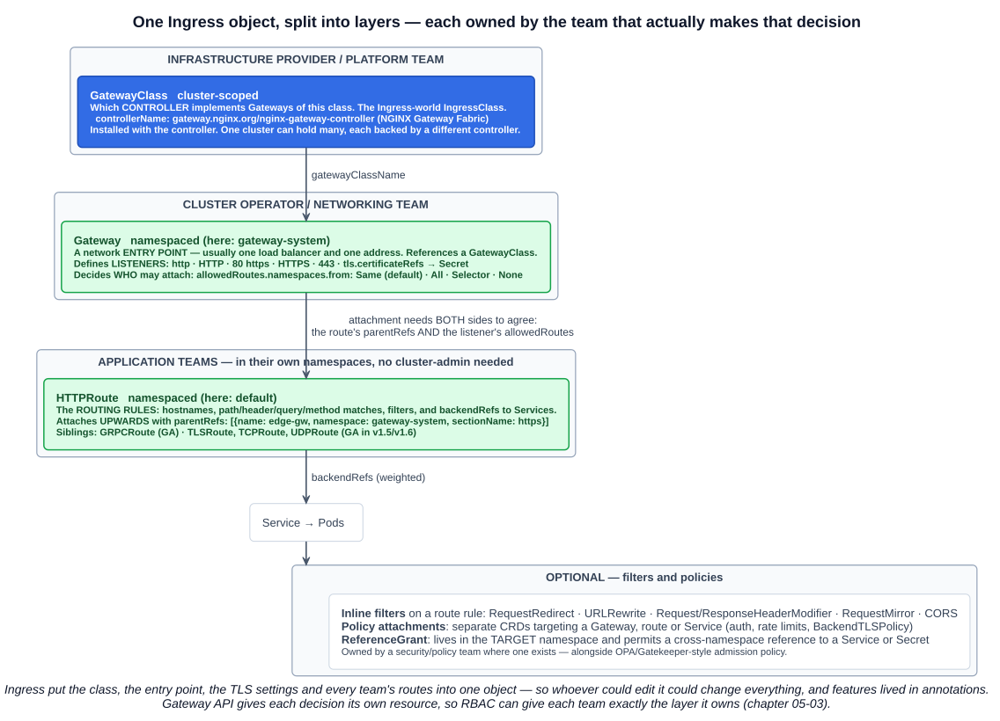
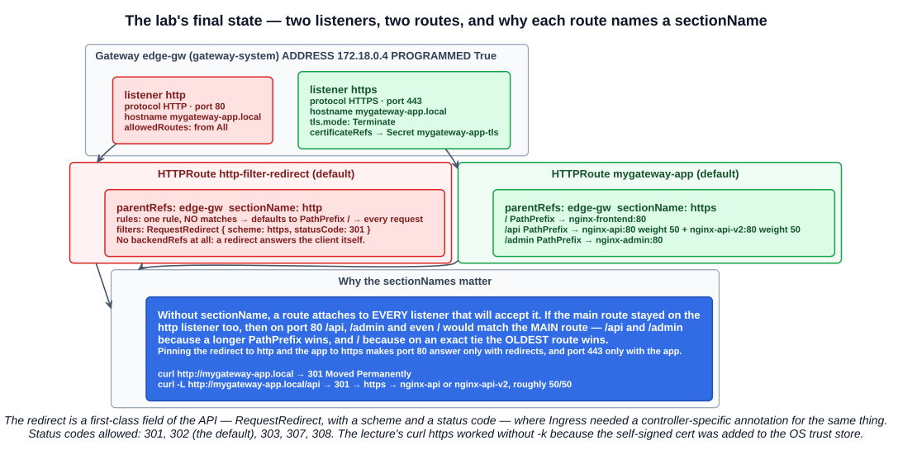
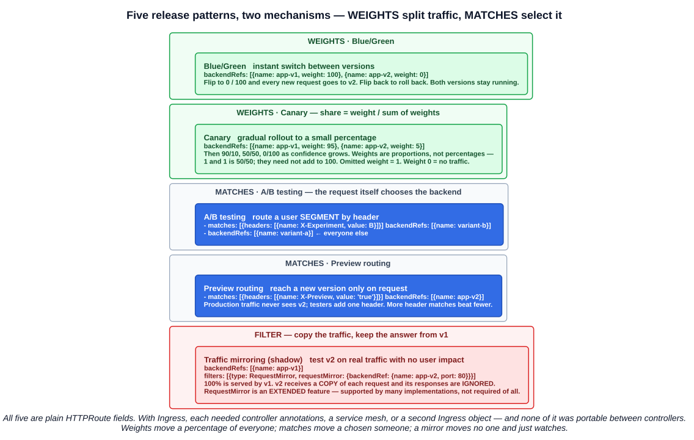

# 12 — Gateway API

Chapter 05-11 ended on Ingress's weak spots: everything in one object, and every feature beyond host-and-path routing hidden in controller-specific annotations. Gateway API is the answer to both. The study tips flag it as **new to the KCNA in the 2025 exam update**, and recommend studying it in full.

The same three backends, the same hostnames and the same TLS certificate appear here as in the Ingress chapter — which makes this a direct, side-by-side comparison.

---

## 1. What Gateway API is

> **Gateway API is a family of API kinds that provide dynamic infrastructure provisioning and advanced traffic routing.**

The lecture's summary:

| Claim | Meaning |
|---|---|
| **The next-generation successor to the Ingress API** | Kubernetes recommends it for new work; the Ingress API is frozen (chapter 05-11) |
| **Generic, expressive and role-oriented** | One model for many protocols; features as fields, not annotations; resources split by team |
| **L4 and L7 routing** | HTTP and gRPC (Layer 7), plus TLS, TCP and UDP routes (Layer 4) — Ingress is HTTP(S) only |
| **Concerns** | Path and hostname routing, **TLS termination**, **load balancing**, **multi-tenancy isolation**, **policy and guardrails** |
| **How** | **Splitting configuration into management chunks across multiple resources** |
| **Who** | **Platform teams define the controllers and load balancers; application teams define how their traffic is routed** |

Its four design principles, from the Kubernetes documentation:

| Principle | Meaning |
|---|---|
| **Role-oriented** | Kinds are modelled on the organisational roles that manage service networking |
| **Portable** | Defined as **custom resources**, supported by **many implementations** |
| **Expressive** | Header matching, traffic weighting and more — *"that were only possible in Ingress by using custom annotations"* |
| **Extensible** | Custom resources can be linked in at various layers of the API |

**Gateway API is an add-on.** It is not built into the API server like Ingress — its kinds are **CRDs** (chapter 05-01), installed separately. It is developed by **Kubernetes SIG Network** under `gateway.networking.k8s.io`; it is not a separate CNCF project.

---

## 2. The resource model



> Unlike a single Ingress resource, Gateway API uses **distinct Kubernetes resources for each layer of the routing stack**.

| Resource | Scope | What it defines | Ingress equivalent |
|---|---|---|---|
| **GatewayClass** | **Cluster** | **Which controller implements** Gateways of this class (NGINX, Envoy, ...) | **IngressClass** |
| **Gateway** | **Namespaced** | **A network entry point** — **listeners** (port, protocol, hostname, TLS) — referencing a GatewayClass | The controller's own Service and port 80/443, plus `spec.tls` — never an API object before |
| **HTTPRoute** | **Namespaced** | **Routing rules** — hostnames, paths, headers — and **`backendRefs`** to Services. Each route has a **`parentRef`** to a Gateway | The **Ingress** rules |
| **Policy / filter attachments** | Varies | **Optional** — authentication, rate limits, redirects. Either inline **filters** on a route or separate **policy CRDs** | Controller **annotations** |

The stable route kinds, and what they carry:

| Route | Layer | Status |
|---|---|---|
| **HTTPRoute** | L7 — HTTP and HTTPS | **GA** since **v1.0 (October 2023)** |
| **GRPCRoute** | L7 — gRPC | **GA** since **v1.1 (May 2024)** |
| **TLSRoute** | L4 — routes on the TLS SNI hostname, without decrypting | GA in **v1.5 (February 2026)** |
| **TCPRoute**, **UDPRoute** | L4 — raw ports | GA in **v1.6 (June 2026)** |

The Kubernetes concept page lists **four stable kinds — GatewayClass, Gateway, HTTPRoute, GRPCRoute** — and that is the set the course teaches. The newer Layer 4 graduations are worth knowing exist, but expect the four as the exam answer.

Two supporting kinds complete the picture:

- **ReferenceGrant** — permission for a **cross-namespace reference** (section 4).
- **BackendTLSPolicy** — TLS from the Gateway **to the backend**, closing the plaintext hop that Ingress termination left open (chapter 05-11).

### 2.1 How the pieces connect

```
GatewayClass  nginx            ← Gateway.spec.gatewayClassName: nginx
     │
Gateway  edge-gw               ← HTTPRoute.spec.parentRefs: [{name: edge-gw, namespace: gateway-system}]
     │                            (and the Gateway's listener must ALLOW the route's namespace)
HTTPRoute  mygateway-app       → backendRefs: [{name: nginx-api, port: 80}]
     │
Service  nginx-api  →  Pods
```

**References point upward.** A route names the Gateway it wants to attach to; the Gateway never lists its routes. That is what lets application teams add routes without editing a shared object.

**Attachment needs both sides to agree.** The route's `parentRefs` asks; the Gateway listener's **`allowedRoutes`** decides whether that namespace may attach:

| `allowedRoutes.namespaces.from` | Routes from |
|---|---|
| **`Same`** (default) | Only the Gateway's own namespace |
| **`All`** | Any namespace |
| **`Selector`** | Namespaces matching a label selector |
| **`None`** | No routes at all |

The lecture's Gateway lives in `gateway-system` and its routes in `default`, so it sets `from: All`. With the default `Same`, the routes would be rejected — a cluster operator deciding exactly which teams may use their entry point.

---

## 3. Roles and ownership

This is the part the study tips single out: **its modular structure fits how application teams like to work.**

| Role | Owns | Does |
|---|---|---|
| **Infrastructure / platform team** | **GatewayClass**, the controller install | Installs and configures gateway controllers (for example **NGINX Gateway Fabric**); creates and approves GatewayClasses |
| **Cluster operators / networking team** | **Gateway** | Creates Gateways — load balancer IPs, ports, hostnames, TLS settings. **Controls which namespaces may attach**, and could restrict which route kinds |
| **Application teams** | **HTTPRoute** (and other routes), in **their own namespaces** | Expose their Services by attaching routes to the shared Gateway via `parentRefs`. **Never need cluster-admin** — only permission to create routes in their namespace |
| **Security / policy team** (optional) | Policies, **ReferenceGrants** | Cluster-wide guardrails (OPA/Gatekeeper or policy CRDs); grant cross-namespace references |

Because each layer is a separate resource, **RBAC can grant each team exactly its layer** (chapter 05-03). A developer with `create` on `httproutes` in their namespace can ship routing changes all day and cannot touch the load balancer, the certificate or another team's routes. With Ingress, permission to edit the shared Ingress was permission to edit everything in it.

---

## 4. Advantages over Ingress

| | Ingress | Gateway API |
|---|---|---|
| **Expressiveness** | Host + path → Service. Everything else is **controller annotations** | **Listeners, TLS, header/query/method matching, redirects, rewrites, header modification, mirroring and weights are fields of the API** |
| **Consistency** | Annotations differ per controller, so manifests are not portable | One spec, with **conformance tests** that implementations run |
| **Multiple controllers** | IngressClass, but one Ingress object per class | **Many GatewayClasses coexist**, each with **multiple Gateways** — supported as standard |
| **Ownership** | One object for everyone | **Role-oriented** — each team owns its own resource |
| **Protocols** | HTTP and HTTPS | HTTP, HTTPS, **gRPC**, **TLS**, **TCP**, **UDP** |
| **Traffic splitting** | Not in the API | **Weighted `backendRefs`** |
| **Cross-namespace** | Backends in the Ingress's own namespace only | Explicit and opt-in, via **`allowedRoutes`** and **ReferenceGrant** |
| **Status** | Little more than the load balancer address | Rich **conditions** on every object (section 8) |

> The Gateway API design is role-oriented — **giving each team just the resources they need**, making it much more **expressive and consistent** than Ingress and its **dependency on controller-specific annotations**.

### 4.1 ReferenceGrant

Cross-namespace references are a security boundary, so Gateway API makes them **opt-in by the target**:

```yaml
apiVersion: gateway.networking.k8s.io/v1
kind: ReferenceGrant
metadata:
  name: allow-routes-from-prod
  namespace: backends          # lives in the namespace being REFERENCED
spec:
  from:
  - group: gateway.networking.k8s.io
    kind: HTTPRoute
    namespace: prod            # who may reference
  to:
  - group: ""
    kind: Service              # what they may reference
```

Without it, an HTTPRoute in `prod` cannot send traffic to a Service in `backends` — its `ResolvedRefs` condition goes `False` with reason `RefNotPermitted`. The same rule covers a **Gateway referencing a TLS Secret** in another namespace.

Two different mechanisms, easy to confuse:

| Mechanism | Governs | Lives in |
|---|---|---|
| **`allowedRoutes`** on a listener | Whether a **route may attach to a Gateway** | The **Gateway** |
| **ReferenceGrant** | Whether a route or Gateway may **reference a Service or Secret** in another namespace | The **target** namespace |

The lecture's route in `default` attaches to a Gateway in `gateway-system` — that is `allowedRoutes`, so **no ReferenceGrant is needed**. Its Services are in `default` alongside the route, and the TLS Secret is in `gateway-system` alongside the Gateway, so every *reference* stays within one namespace.

---

## 5. The lab: installing the pieces

The lecture's ten steps: **set up Helm → install the Gateway API CRDs → install NGINX Gateway Fabric → deploy backends → create a Gateway → create HTTPRoutes → test → add TLS → HTTP→HTTPS redirect → weighted routing.**

### 5.1 Helm and the CRDs

```bash
curl https://raw.githubusercontent.com/helm/helm/main/scripts/get-helm-4 | bash    # Helm 4
```

Gateway API is CRDs, so they come first. *"The Gateway API resources from the **standard channel** must be installed before deploying NGINX Gateway Fabric."*

```bash
kubectl kustomize "https://github.com/nginx/nginx-gateway-fabric/config/crd/gateway-api/standard?ref=v2.3.0" \
  | kubectl apply -f -
```

```
customresourcedefinition.apiextensions.k8s.io/backendtlspolicies.gateway.networking.k8s.io created
customresourcedefinition.apiextensions.k8s.io/gatewayclasses.gateway.networking.k8s.io created
customresourcedefinition.apiextensions.k8s.io/gateways.gateway.networking.k8s.io created
customresourcedefinition.apiextensions.k8s.io/grpcroutes.gateway.networking.k8s.io created
customresourcedefinition.apiextensions.k8s.io/httproutes.gateway.networking.k8s.io created
customresourcedefinition.apiextensions.k8s.io/referencegrants.gateway.networking.k8s.io created
```

`kubectl kustomize <url>` renders a kustomization from a Git URL — here pinned with `?ref=v2.3.0` to the CRD versions that release of NGINX Gateway Fabric supports. Some clusters ship the CRDs already; check before installing a second set.

**Two release channels** — a Gateway API concept with no Ingress equivalent:

| Channel | Contains |
|---|---|
| **Standard** | GA (and, historically, some beta) resources and fields — what to run in production |
| **Experimental** | Everything in Standard **plus** features still being designed |

Since v1.5 a `ValidatingAdmissionPolicy` stops you installing Experimental CRDs over Standard ones, or downgrading below 1.5, without first removing it.

### 5.2 NGINX Gateway Fabric

```bash
helm install ngf oci://ghcr.io/nginx/charts/nginx-gateway-fabric --create-namespace -n nginx-gateway
```

Installed straight from an **OCI registry** — no `helm repo add` (compare chapter 05-11). `ngf` is the release name and prefixes the Deployment name.

```bash
kubectl -n nginx-gateway get svc
```

```
NAME                       TYPE        CLUSTER-IP     EXTERNAL-IP   PORT(S)
ngf-nginx-gateway-fabric   ClusterIP   10.43.224.53   <none>        443/TCP
```

**A ClusterIP on 443, not a LoadBalancer on 80 and 443** — the opposite of the F5 Ingress controller's Service. That is because NGINX Gateway Fabric is split in two:

| Part | Runs | Does |
|---|---|---|
| **Control plane** | `ngf-nginx-gateway-fabric` Deployment in `nginx-gateway` | **Watches Gateway API resources** and translates them into NGINX configuration, delivered to data planes over **gRPC** (that is the ClusterIP 443) |
| **Data plane** | **One NGINX Deployment and Service per Gateway**, created in the **Gateway's namespace** | Carries the traffic |

> **When a new Gateway resource is created, the control plane automatically provisions a dedicated NGINX Deployment and exposes it using a Service.**

So nothing listens on port 80 yet — there is no Gateway. The **LoadBalancer with address `172.18.0.4` appears when `edge-gw` is created**. This is the "dynamic infrastructure provisioning" in Gateway API's definition: **creating a Gateway object creates the load balancer.**

```bash
kubectl get gatewayclass
```

```
NAME    CONTROLLER                                  ACCEPTED   AGE
nginx   gateway.nginx.org/nginx-gateway-controller  True       50s
```

**`ACCEPTED True`** — the controller has claimed the class. A GatewayClass whose controller is not running stays unaccepted.

### 5.3 Backends

Identical to chapter 05-11:

```bash
kubectl run nginx-frontend --image=spurin/nginx-debug --port=80
kubectl run nginx-api      --image=spurin/nginx-debug --port=80
kubectl run nginx-admin    --image=spurin/nginx-debug --port=80
kubectl expose pod nginx-frontend
kubectl expose pod nginx-api
kubectl expose pod nginx-admin
```

---

## 6. Gateway and HTTPRoute

### 6.1 The Gateway

```yaml
apiVersion: gateway.networking.k8s.io/v1
kind: Gateway
metadata:
  name: edge-gw
  namespace: gateway-system
spec:
  gatewayClassName: nginx
  listeners:
  - name: http
    protocol: HTTP
    port: 80
    hostname: mygateway-app.local
    allowedRoutes:
      namespaces:
        from: All
```

| Field | Meaning |
|---|---|
| **`gatewayClassName`** | Which controller provisions it |
| **`listeners[]`** | Each is a **port + protocol** (+ optional **hostname** and **TLS**). The Gateway natively understands **multiple listeners** |
| **`listeners[].name`** | How routes target one specific listener (**`sectionName`**) |
| **`hostname`** | This listener only accepts traffic for that host |
| **`allowedRoutes`** | Which namespaces' routes may attach |

```bash
kubectl -n gateway-system get gateway/edge-gw
```

```
NAME      CLASS   ADDRESS      PROGRAMMED   AGE
edge-gw   nginx   172.18.0.4   True         3m39s
```

**`PROGRAMMED True`** — the data plane is configured and ready, at the address NGINX Gateway Fabric just provisioned.

### 6.2 The HTTPRoute

```yaml
apiVersion: gateway.networking.k8s.io/v1
kind: HTTPRoute
metadata:
  name: mygateway-app
  namespace: default
spec:
  parentRefs:
  - name: edge-gw
    namespace: gateway-system
  hostnames:
  - mygateway-app.local
  rules:
  - matches:
    - path:
        type: PathPrefix
        value: /
    backendRefs:
    - name: nginx-frontend
      port: 80
  - matches:
    - path:
        type: PathPrefix
        value: /api
    backendRefs:
    - name: nginx-api
      port: 80
  - matches:
    - path:
        type: PathPrefix
        value: /admin
    backendRefs:
    - name: nginx-admin
      port: 80
```

Compared with the Ingress in chapter 05-11, the routing is the same and the shape is different:

| Ingress | HTTPRoute |
|---|---|
| `ingressClassName: nginx` | **`parentRefs:`** a specific **Gateway** |
| `rules[].host` | **`hostnames: []`** — once, for the whole route |
| `paths[].path` + `pathType` | **`matches[].path.type` + `.value`** |
| `pathType: Prefix` / `Exact` / `ImplementationSpecific` | **`PathPrefix`** / **`Exact`** / **`RegularExpression`** |
| `backend.service.name` + `port.number` | **`backendRefs[].name` + `port`** — a list, with optional **weights** |

### 6.3 Path matching

| `type` | Behaviour |
|---|---|
| **`Exact`** | Exactly, case-sensitive. `/abc` matches only `/abc` — **not `/abc/`, `/Abc` or `/abcd`** |
| **`PathPrefix`** | **Split by `/`, element by element**, case-sensitive; trailing `/` ignored. `/abc` matches `/abc`, `/abc/` and `/abc/def` — **not `/abcd`**. *"Semantically equivalent to the `Prefix` path type in the Kubernetes Ingress API"* (chapter 05-11 section 6) |
| **`RegularExpression`** | Case-sensitive regex; the **dialect is implementation-specific** (POSIX, PCRE, RE2...) |

A rule with **no `matches`** defaults to **`PathPrefix /`** — it matches every request. That is how the redirect route in section 7 catches everything with no match block at all.

Matches can also select on **headers**, **query parameters** and **HTTP method** — the A/B and preview patterns in section 9 use headers.

**Precedence** is spelled out in the spec, across every route attached to the listener:

1. An **`Exact`** path match
2. A **`PathPrefix`** match with the **most characters**
3. A **method** match
4. The **largest number of header matches**
5. The **largest number of query parameter matches**

Still tied? The **oldest route** (by creation timestamp) wins, then **alphabetical `namespace/name`**, then the **first matching rule** within a route. **A request matching nothing gets a 404** — the spec requires it.

### 6.4 Testing

```bash
curl --resolve '*:80:172.18.0.4' http://mygateway-app.local          # Hostname: nginx-frontend
curl --resolve '*:80:172.18.0.4' http://mygateway-app.local/api      # Hostname: nginx-api
curl --resolve '*:80:172.18.0.4' http://mygateway-app.local/admin    # Hostname: nginx-admin
```

Same technique as chapter 05-11 — `--resolve` pins the hostname to the Gateway's address, and the `Host` header does the routing.

---

## 7. TLS and the HTTP→HTTPS redirect



### 7.1 The certificate

The same `openssl` command as chapter 05-11 section 7, for the new hostname:

```bash
openssl req -x509 -nodes -days 365 -newkey rsa:2048 \
  -keyout mygateway-app.local.key -out mygateway-app.local.crt \
  -subj "/CN=mygateway-app.local" \
  -addext "subjectAltName=DNS:mygateway-app.local"
```

Then a step the Ingress lecture did not do:

```bash
cp mygateway-app.local.crt /usr/local/share/ca-certificates/
update-ca-certificates
# 1 added, 0 removed; done.
```

This adds the self-signed certificate to the **operating system's trust store** (Debian/Ubuntu). From then on, every program on that machine that uses the system store — curl included — trusts it. **That is why the lecture's `curl https://...` works without `-k` or `--cacert`.** It is the machine-wide version of `--cacert`, and on a real workstation it is something to undo afterwards.

The Secret goes in the **Gateway's** namespace, because the **Gateway** references it:

```bash
kubectl -n gateway-system create secret tls mygateway-app-tls \
  --cert=mygateway-app.local.crt --key=mygateway-app.local.key
```

### 7.2 An HTTPS listener

```yaml
  - name: https
    protocol: HTTPS
    port: 443
    hostname: mygateway-app.local
    allowedRoutes:
      namespaces:
        from: All
    tls:
      mode: Terminate
      certificateRefs:
      - kind: Secret
        name: mygateway-app-tls
```

| `tls.mode` | Meaning |
|---|---|
| **`Terminate`** | **The Gateway decrypts** — exactly the Ingress model. Required for HTTPRoute, which has to read paths and headers |
| **`Passthrough`** | **The Gateway does not decrypt** — it routes on the SNI hostname in the ClientHello and forwards the encrypted stream. **Only with TLSRoute** |

**TLS belongs to the listener, not the route.** That is the role split again: certificates are the cluster operator's concern, and application teams' routes simply attach. With Ingress, the TLS section sat inside each application's Ingress object.

`kubectl describe gateway` now reports both listeners, each with conditions such as `ResolvedRefs: True — All references are resolved` (the Secret was found) and `Conflicted: False`, and the route kinds it supports: **HTTPRoute** and **GRPCRoute**.

```bash
curl --resolve '*:80:172.18.0.4' --resolve '*:443:172.18.0.4' http://mygateway-app.local    # works
curl --resolve '*:80:172.18.0.4' --resolve '*:443:172.18.0.4' https://mygateway-app.local   # works too
```

Both work, because the route had **no `sectionName`** — so it attached to **every** listener that would accept it, http and https alike.

### 7.3 The redirect: a filter, not an annotation

```yaml
apiVersion: gateway.networking.k8s.io/v1
kind: HTTPRoute
metadata:
  name: http-filter-redirect
  namespace: default
spec:
  parentRefs:
  - name: edge-gw
    namespace: gateway-system
    sectionName: http
  hostnames:
  - mygateway-app.local
  rules:
  - filters:
    - type: RequestRedirect
      requestRedirect:
        scheme: https
        statusCode: 301
```

- **`sectionName: http`** attaches this route to **one listener only**, by name.
- **No `matches`** → `PathPrefix /` → every request.
- **No `backendRefs`** — a redirect answers the client directly.
- **`statusCode`** may be **301, 302, 303, 307 or 308**; the **default is 302**.

Compare chapter 05-11: on F5 NGINX the same behaviour was the `nginx.org/ssl-redirect` annotation, and every other controller spelled it differently. Here it is **a typed field of the standard API**, the same on every implementation.

```bash
curl    --resolve '*:80:172.18.0.4' --resolve '*:443:172.18.0.4' http://mygateway-app.local   # 301 Moved Permanently
curl -L --resolve '*:80:172.18.0.4' --resolve '*:443:172.18.0.4' http://mygateway-app.local   # follows to https
```

### 7.4 Why the main route gets `sectionName: https`

The lecture then adds **`sectionName: https`** to the main route. This is not cosmetic. Without it, the main route is still attached to the http listener, and **on port 80 it beats the redirect**:

- `/api` and `/admin` match the main route's longer `PathPrefix` — **more characters wins**.
- `/` ties at `PathPrefix /` — and the **older route wins**, which is the main route.

So the redirect would never fire. Pinning each route to its own listener makes **port 80 answer only with redirects and port 443 only with the application**. This is a good example of the precedence rules in section 6.3 doing real work.

The other filters available on a rule:

| Filter | Does | Conformance |
|---|---|---|
| **`RequestRedirect`** | Redirect — scheme, hostname, path, port, status code | **Core** |
| **`URLRewrite`** | Rewrite the hostname or path before forwarding (cannot combine with RequestRedirect) | Extended |
| **`RequestHeaderModifier`** / **`ResponseHeaderModifier`** | Add, set or remove headers | **Core** / Extended |
| **`RequestMirror`** | Send a copy of the request to another backend (section 9) | Extended |
| **`CORS`** | CORS response headers | Extended (Standard since v1.5) |
| **`ExtensionRef`** | Implementation-specific filter via a custom resource | Implementation-specific |

**Core** features must be supported by every conformant implementation; **Extended** features are optional but portable where supported. That conformance labelling is itself an advantage over Ingress annotations, where there was no such contract.

---

## 8. Status conditions

Every Gateway API object reports whether it actually worked, which makes troubleshooting much more direct than with Ingress:

| Object | Condition | Meaning |
|---|---|---|
| **GatewayClass** | **`Accepted`** | A controller has claimed this class |
| **Gateway** | **`Accepted`** | The configuration is valid |
| **Gateway** | **`Programmed`** | The data plane is configured and has an address |
| **Listener** | `ResolvedRefs`, `Conflicted` | Its certificate refs resolved; it does not clash with another listener |
| **Route** (per parent) | **`Accepted`** | It attached to that Gateway/listener |
| **Route** (per parent) | **`ResolvedRefs`** | Its `backendRefs` all resolved (or e.g. `BackendNotFound`, `RefNotPermitted`) |

```bash
kubectl get gatewayclass                 # ACCEPTED
kubectl get gateway -A                   # ADDRESS, PROGRAMMED
kubectl get httproute -A                 # HOSTNAMES
kubectl describe httproute mygateway-app # Status → Parents → Conditions
```

A route that "does nothing" almost always shows `Accepted: False` — wrong `parentRefs` namespace, a listener whose `allowedRoutes` excludes it, or a hostname the listener does not serve.

---

## 9. Weighted routing and release patterns



### 9.1 Weights

The lecture's last step splits `/api` across two versions:

```yaml
  - matches:
    - path:
        type: PathPrefix
        value: /api
    backendRefs:
    - name: nginx-api
      port: 80
      weight: 50
    - name: nginx-api-v2
      port: 80
      weight: 50
```

```bash
curl -L ... http://mygateway-app.local/api     # Hostname: nginx-api
curl -L ... http://mygateway-app.local/api     # Hostname: nginx-api-v2
curl -L ... http://mygateway-app.local/api     # Hostname: nginx-api-v2
```

> Weight specifies the **proportion** of requests forwarded to the referenced backend. This is computed as **weight / (sum of all weights)**... **Weight is not a percentage and the sum of weights does not need to equal 100.**

- `50`/`50` and `1`/`1` are the same split.
- **Omitted weight defaults to `1`.**
- **Weight `0` sends no traffic** to that backend.
- It is a **proportion over many requests**, not a strict alternation — three consecutive requests can easily go 1-then-2-then-2, as the lecture's output shows.

### 9.2 The patterns

The lecture closes with the release strategies this makes possible. Two use **weights**, two use **matches**, and one uses a **filter**:

| Pattern | Mechanism | Shape | Purpose |
|---|---|---|---|
| **Blue/green** | **Weights** | `v1: 100`, `v2: 0` → flip to `0`/`100` | **Instant switch** between versions; flip back to roll back |
| **Canary** | **Weights** | `v1: 95`, `v2: 5` → `90/10` → `50/50` → `0/100` | **Gradual rollout to a small percentage** |
| **A/B testing** | **Header match** | `X-Experiment: B` → variant B; everyone else → A | **Route by user-segment headers** |
| **Preview routing** | **Header match** | `X-Preview: true` → v2; everyone else → production | **Access a new version via a specific header** |
| **Traffic mirroring (shadow)** | **`RequestMirror` filter** | 100% served by v1; a **copy** of each request to v2 | **Copy traffic for testing, no impact** — v2's **responses are ignored** |

The header-matching shape, used by both A/B and preview:

```yaml
  rules:
  - matches:
    - headers:
      - name: X-Preview
        value: "true"
    backendRefs:
    - name: app-v2
      port: 80
  - backendRefs:            # no matches = PathPrefix / = everyone else
    - name: app-v1
      port: 80
```

The header rule wins for requests carrying the header because, with equal paths, **more header matches take precedence** (section 6.3).

And mirroring:

```yaml
  rules:
  - backendRefs:
    - name: app-v1
      port: 80
    filters:
    - type: RequestMirror
      requestMirror:
        backendRef:
          name: app-v2
          port: 80
```

With Ingress, each of these needed controller annotations, a second Ingress object or a service mesh. In Gateway API **they are all ordinary HTTPRoute fields**, which is a large part of why the study tips call out its **L7 traffic policies**.

---

## 10. Where it is going

- **Ingress is frozen; Gateway API is where new features land** (chapter 05-11). The retirement of ingress-nginx accelerated the shift, as the study tips note.
- **Migration tooling** exists: the `ingress2gateway` project converts Ingress manifests to Gateway API resources.
- **Service mesh**: the **GAMMA** initiative uses the same HTTPRoute to describe traffic **between services inside the cluster**, by attaching a route to a **Service** as its parent instead of a Gateway. One routing API for north-south and east-west traffic — the subject of section 7 of the course.

---

## Exam angle

- **Gateway API is the next-generation successor to Ingress** — **generic, expressive and role-oriented**, covering **L4 and L7** routing. It is **CRD-based**, installed separately, and developed by **Kubernetes SIG Network** under `gateway.networking.k8s.io`.
- **The core resources: GatewayClass (cluster-scoped, which controller), Gateway (namespaced, an entry point with listeners), HTTPRoute (namespaced, routing rules and `backendRefs`).** GRPCRoute is the fourth stable kind; TLSRoute, TCPRoute and UDPRoute are the Layer 4 routes.
- **IngressClass → GatewayClass**, the controller's listener → **Gateway**, **Ingress rules → HTTPRoute**, **annotations → filters and policies**.
- **Role-oriented design:** the **platform team** owns GatewayClasses and controllers, **cluster operators** own Gateways (addresses, ports, TLS, which namespaces may attach), **application teams** own routes in their own namespaces and **never need cluster-admin**.
- **Advantages over Ingress:** expressive and consistent (**no controller-specific annotations**), **multi-controller support** as standard, and role-oriented ownership.
- **A route attaches with `parentRefs`** (optionally a **`sectionName`** naming one listener); the listener's **`allowedRoutes`** (default **`Same`**) must permit it. **Cross-namespace references to Services or Secrets need a ReferenceGrant in the target namespace.**
- **TLS is configured on the Gateway listener** — `tls.mode: Terminate` (decrypt; HTTPRoute) or `Passthrough` (route on SNI; TLSRoute) with `certificateRefs` to a Secret.
- **HTTP→HTTPS redirects use the `RequestRedirect` filter** (`scheme: https`; status codes 301/302/303/307/308, default **302**) — a field of the API, not an annotation.
- **Path match types: `Exact`, `PathPrefix` (element-wise, equivalent to Ingress `Prefix`), `RegularExpression`.** A rule with no matches defaults to `PathPrefix /`. **Exact beats prefix; longer prefix beats shorter;** unmatched requests get **404**.
- **`backendRefs[].weight` is a proportion** (weight / sum of weights), **not a percentage**; default **1**; **0 sends nothing**. Weights enable **blue/green** and **canary**; **header matches** enable **A/B testing** and **preview routing**; the **`RequestMirror`** filter enables **shadow traffic** whose responses are ignored.
- **Status conditions:** GatewayClass **`Accepted`**, Gateway **`Accepted`** and **`Programmed`**, route **`Accepted`** and **`ResolvedRefs`**.

## References

- [Gateway API (Kubernetes concepts)](https://kubernetes.io/docs/concepts/services-networking/gateway/) — design principles, the resource model and request flow
- [Gateway API project site](https://gateway-api.sigs.k8s.io/) — the full spec, guides for traffic splitting, redirects and TLS, and the implementations list
- [Gateway API reference](https://gateway-api.sigs.k8s.io/reference/api-spec/) — HTTPRoute matches, filters, weights and precedence
- [NGINX Gateway Fabric](https://docs.nginx.com/nginx-gateway-fabric/) — the implementation used in the lab
