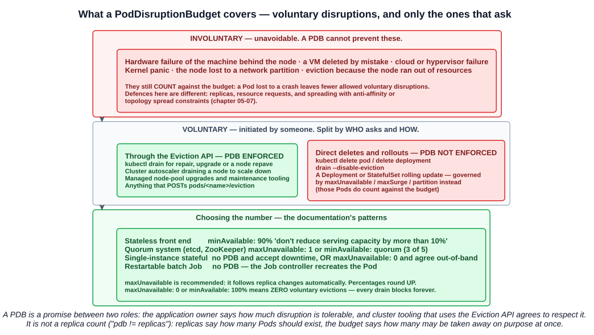
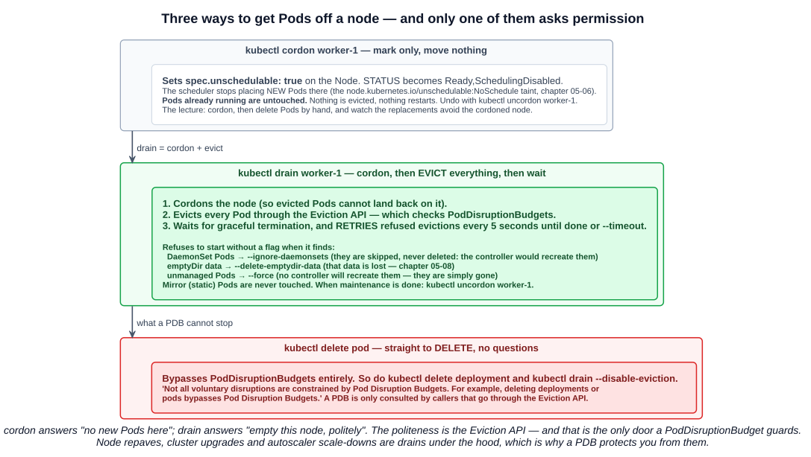
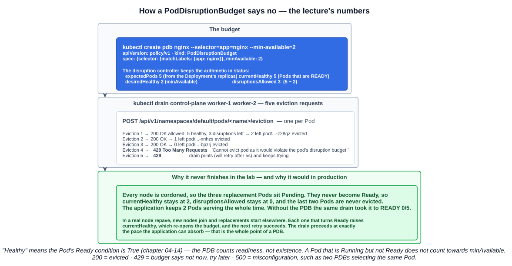

# 13 — Pod disruption budgets, cordon and drain

Replicas keep an application running when *one Pod* fails. They do nothing when an administrator — or an automated upgrade — takes away *several Pods on purpose*, at the same time. A PodDisruptionBudget is the guard for that case.

The study tips name the two things to get right: **why and when you would use a PDB — paying attention to how it relates to voluntary disruptions** — and **what `kubectl drain` and `kubectl cordon` do, and where they differ**.

---

## 1. Voluntary and involuntary disruptions

> Pods do not disappear until someone (a person or a controller) destroys them, or there is an unavoidable hardware or system software error.

The whole topic hangs on this split.

| | Involuntary disruptions | Voluntary disruptions |
|---|---|---|
| **What** | **Unavoidable** failures | Actions **someone chose to take** |
| **Examples** | **Hardware failure** of the machine backing the node · a VM **deleted by mistake** · **cloud provider or hypervisor failure** · **kernel panic** · the node **disappears in a network partition** · **eviction because the node ran out of resources** | **Application owner:** deleting a Deployment, updating a Pod template (a rollout), deleting a Pod. **Cluster administrator:** **draining a node** for repair or upgrade, **draining to scale the cluster down** (autoscaling), removing a Pod so something else fits |
| **Can a PDB prevent it?** | **No** — but they **count against** the budget | **Some of them** — section 2 |
| **Defences** | Replicas, resource requests, spreading across nodes and zones (anti-affinity, topology spread — chapter 05-07) | **PodDisruptionBudgets** |

Voluntary disruptions may come from the cluster administrator directly, from automation they run, or from the hosting provider. Node software updates, OS patching, **node repaves** (replacing nodes with freshly built ones) and **autoscalers compacting workloads onto fewer nodes** are all voluntary — and on a busy platform they are routine, not exceptional.

> On a basic Kubernetes cluster, there are **no automated voluntary disruptions** (only user-triggered ones). However, your cluster administrator or hosting provider may run some additional services which cause voluntary disruptions.

---

## 2. What a PodDisruptionBudget is

> As an application owner, you can create a PodDisruptionBudget (PDB) for each application. **A PDB limits the number of Pods of a replicated application that are down simultaneously from voluntary disruptions.**

The lecture's slogan for it: **`pdb != replicas`**.

| | Says | Owned by |
|---|---|---|
| **`replicas`** | How many Pods **should exist** | The workload (Deployment, StatefulSet) |
| **PodDisruptionBudget** | How many may be **taken away on purpose at once** | A separate `policy/v1` object |

The documentation's examples of what applications want:

- A **quorum-based** application (etcd, ZooKeeper, Consul) never wants to drop below the number needed for a quorum.
- A **web front end** never wants the replicas serving load to fall below a certain percentage.

### 2.1 Only callers that ask are bound by it

This is the most important thing to understand, and the reason the study tips stress *voluntary*.

> Cluster managers and hosting providers should use tools which **respect PodDisruptionBudgets by calling the Eviction API** instead of directly deleting pods or deployments.

> **Not all voluntary disruptions are constrained by Pod Disruption Budgets.** For example, **deleting deployments or pods bypasses Pod Disruption Budgets.**



| Action | PDB enforced? |
|---|---|
| **`kubectl drain`** (repair, upgrade, repave) | **Yes** — it uses the Eviction API |
| **Cluster autoscaler** draining a node to scale down | **Yes** |
| Anything calling **`POST .../pods/<name>/eviction`** | **Yes** |
| **`kubectl delete pod`**, **`kubectl delete deployment`** | **No** |
| **`kubectl drain --disable-eviction`** | **No** — *"This will bypass checking PodDisruptionBudgets, use with caution"* |
| **Rolling updates** of a Deployment or StatefulSet | **No** — *"workload resources are not limited by PDBs when doing rolling upgrades"*; their own `maxUnavailable`/`maxSurge`/`partition` govern that. **Those Pods do count against the budget**, though |
| **Involuntary disruptions** | **No** — but they count against the budget |

So a PDB is a **contract between two roles**: the application owner states how much disruption is tolerable; cluster tooling that goes through the Eviction API promises to respect it. The docs describe it as *"an interface between"* the cluster manager and application owner roles. If your organisation has no such separation and no automated voluntary disruptions, you may not need one.

### 2.2 The Eviction API

An eviction is a request to the API server, not a delete:

```
POST /api/v1/namespaces/<ns>/pods/<name>/eviction
```

| Response | Meaning |
|---|---|
| **`200 OK`** | **Allowed** — the Pod is deleted, honouring its **`terminationGracePeriodSeconds`** |
| **`429 Too Many Requests`** | **Not allowed right now because of a PodDisruptionBudget** — try again later |
| **`500 Internal Server Error`** | **Misconfiguration** — for example **multiple PDBs selecting the same Pod** |

If no PDB covers the Pod, the eviction is always allowed. An evicted Pod also gets a `DisruptionTarget` condition with reason **`EvictionByEvictionAPI`**, so you can tell afterwards why it went.

---

## 3. cordon, drain and uncordon



### 3.1 `kubectl cordon` — mark the node, move nothing

```bash
kubectl cordon worker-1
kubectl get nodes
```

```
NAME       STATUS                     ROLES
worker-1   Ready,SchedulingDisabled   <none>
```

Cordoning sets **`spec.unschedulable: true`** on the Node, which the control plane expresses as the **`node.kubernetes.io/unschedulable:NoSchedule`** taint (chapter 05-06). **New Pods are no longer scheduled there. Pods already running are untouched** — nothing is evicted, nothing restarts.

The lecture's first demonstration uses exactly this. Five nginx replicas are spread across three nodes; the control plane is cordoned and its two Pods are deleted:

```bash
kubectl create deployment nginx --image=nginx --replicas=5
kubectl cordon control-plane && kubectl delete pod/nginx-...-h2hf8 pod/nginx-...-l89r4 --now
```

The ReplicaSet replaces them — **on the workers**, because the control plane is cordoned. Cordon `worker-1` and delete its Pods, and all five end up on `worker-2`. Cordon controls **where replacements go**; on its own it never moves anything.

### 3.2 `kubectl drain` — empty the node, politely

> Drain node in preparation for maintenance. The given node will be **marked unschedulable** to prevent new pods from arriving. 'drain' **evicts the pods** if the API server supports eviction. Otherwise, it will use normal DELETE to delete the pods.

So **drain = cordon + evict every Pod + wait**:

1. **Cordons** the node, so evicted Pods cannot land back on it.
2. **Evicts** each Pod through the **Eviction API** — which is where PDBs are checked.
3. **Waits** for graceful termination, **retrying refused evictions** until they all succeed or `--timeout` expires.

> 'drain' waits for graceful termination. **You should not operate on the machine until the command completes.**

It deliberately refuses to start in three situations, each needing an explicit flag:

| Found on the node | Flag | What happens |
|---|---|---|
| **DaemonSet Pods** | **`--ignore-daemonsets`** | They are **skipped, never deleted** — the DaemonSet controller would recreate them immediately, since it **ignores unschedulable markings** |
| Pods using **`emptyDir`** | **`--delete-emptydir-data`** | Drain proceeds and **that data is lost** (chapter 05-08) |
| Pods **not managed by a controller** (no ReplicaSet, StatefulSet, Job or DaemonSet) | **`--force`** | They are deleted and **nothing recreates them** |

**Mirror Pods** (static Pods, chapter 04-01) are never touched — they cannot be deleted through the API server.

The other flags worth knowing:

| Flag | Default | Meaning |
|---|---|---|
| **`--timeout`** | `0s` | How long to keep trying — **zero means forever** |
| **`--grace-period`** | `-1` | Seconds each Pod gets to terminate; negative uses the Pod's own value |
| **`--disable-eviction`** | `false` | Use DELETE instead of eviction — **bypasses PDBs** |
| **`--pod-selector`** | | Only drain Pods matching a label selector |
| **`--dry-run`** | `none` | `client` or `server` to preview |

### 3.3 `kubectl uncordon` — back into service

```bash
kubectl uncordon worker-1
```

> When you are ready to put the node back into service, use **`kubectl uncordon`**, which will make the node schedulable again.

Uncordoning **does not move anything back**. Pods that were evicted stay where they were rescheduled; the node only receives new Pods from now on. Rebalancing needs a rollout or the Descheduler (chapter 05-07).

### 3.4 Side by side

| | `cordon` | `drain` | `delete pod` |
|---|---|---|---|
| Marks the node unschedulable | **Yes** | **Yes** (it cordons first) | No |
| Removes running Pods | **No** | **Yes — all of them** | Yes — the one named |
| Mechanism | Node field | **Eviction API** | DELETE |
| **Respects PDBs** | n/a | **Yes** | **No** |
| Graceful termination | n/a | Yes | Yes |
| Undo | `uncordon` | `uncordon` | — |

---

## 4. The lab: draining with and without a budget



### 4.1 Without a PDB

With all five replicas on `worker-2` and the other two nodes cordoned:

```bash
kubectl drain worker-2 --delete-emptydir-data=true --ignore-daemonsets=true
```

```
node/worker-2 cordoned
evicting pod default/nginx-77b4fdf86c-2w5tm
...
pod/nginx-77b4fdf86c-d99jm evicted
node/worker-2 drained
```

```bash
kubectl get deployment
# NAME    READY   UP-TO-DATE   AVAILABLE
# nginx   0/5     5            0
```

**All five evicted at once, and the application is down.** Every replacement is `Pending` — every node is cordoned, so there is nowhere to schedule them. Nothing in the cluster said "not all at once", because nothing knew it mattered. Five replicas gave no protection whatsoever.

### 4.2 With a PDB

After uncordoning and letting the Pods recover:

```bash
kubectl create pdb nginx --selector=app=nginx --min-available=2
```

```yaml
apiVersion: policy/v1
kind: PodDisruptionBudget
metadata:
  name: nginx
spec:
  minAvailable: 2
  selector:
    matchLabels:
      app: nginx
```

Then cordon and drain every node:

```bash
kubectl cordon control-plane worker-1 worker-2
kubectl drain control-plane worker-1 worker-2 --delete-emptydir-data=true --ignore-daemonsets=true
```

```
evicting pod default/nginx-77b4fdf86c-bpzrj
...
error when evicting pods/"nginx-77b4fdf86c-6sxp2" -n "default" (will retry after 5s):
  Cannot evict pod as it would violate the pod's disruption budget.
pod/nginx-77b4fdf86c-z28qz evicted
error when evicting pods/"nginx-77b4fdf86c-6mgpk" -n "default" (will retry after 5s):
  Cannot evict pod as it would violate the pod's disruption budget.
pod/nginx-77b4fdf86c-xnhzs evicted
pod/nginx-77b4fdf86c-bpzrj evicted
```

**Three evicted, two refused.** With 5 healthy Pods and `minAvailable: 2`, the budget allowed `5 − 2 = 3` disruptions. The fourth and fifth eviction requests got a **429**, and drain keeps retrying them every five seconds.

**The application kept two Pods serving the whole time.** In the lab the drain never completes — every node is cordoned, the three replacements stay `Pending`, never become Ready, and so never free up more budget. In a real maintenance or repave, new capacity exists: each replacement that becomes Ready raises the healthy count, the next retry succeeds, and the drain proceeds **at exactly the pace the application can absorb**.

### 4.3 Reading the budget

```bash
kubectl get pdb
```

```
NAME    MIN AVAILABLE   MAX UNAVAILABLE   ALLOWED DISRUPTIONS   AGE
nginx   2               N/A               3                     7s
```

```bash
kubectl get pdb nginx -o yaml
```

```yaml
status:
  currentHealthy: 5        # matching Pods that are Ready
  desiredHealthy: 2        # what minAvailable demands
  disruptionsAllowed: 3    # currentHealthy - desiredHealthy
  expectedPods: 5          # from the owning workload's replicas
```

**`ALLOWED DISRUPTIONS` is the number to watch.** If it reads `0`, every drain touching these Pods will block. A brand-new PDB shows `0` until the disruption controller has counted the matching Pods.

---

## 5. The spec

A PodDisruptionBudget has three fields:

| Field | Meaning |
|---|---|
| **`spec.selector`** | **Required.** The Pods it covers — normally the **same selector as the workload's controller**. In `policy/v1`, an **empty selector matches every Pod in the namespace** |
| **`spec.minAvailable`** | Pods that **must still be available after the eviction**. An integer or a percentage |
| **`spec.maxUnavailable`** | Pods that **may be unavailable after the eviction**. An integer or a percentage |

**Specify one of `minAvailable` or `maxUnavailable`, not both.**

### 5.1 "Available" means Ready

> The current implementation considers **healthy pods** as pods that have `.status.conditions` item with **`type="Ready"` and `status="True"`**.

The PDB counts **readiness**, not existence (chapter 04-14). A Pod that is Running but failing its readiness probe does not count towards `minAvailable` — so a PDB on an application with flaky readiness will block drains more often than its replica count suggests.

### 5.2 `minAvailable` versus `maxUnavailable`

| | `minAvailable: 3` | `maxUnavailable: 1` |
|---|---|---|
| With 5 replicas | Up to 2 at once | 1 at a time |
| Scale to 10 | Up to 7 at once — **the budget loosened** | Still 1 at a time |
| Scale to 3 | **0 — every drain blocks** | Still 1 at a time |

> The use of **`maxUnavailable` is recommended** as it **automatically responds to changes in the number of replicas** of the corresponding controller.

`maxUnavailable` can only be used with Pods that **share one controller** — a Deployment, ReplicaSet or StatefulSet — because the intended count comes from that controller's `replicas`.

### 5.3 Percentages round up

> If you have 7 Pods and you set `minAvailable` to `"50%"`... Kubernetes **rounds up** to the nearest integer, so in this case, **4 Pods must be available**.

`maxUnavailable` percentages also round **up**, so a disruption can slightly **exceed** the stated percentage. With a single replica, `maxUnavailable: "30%"` rounds up to 1 — **100% unavailability** is permitted.

### 5.4 Budgets that block forever

> If you set **`maxUnavailable` to 0** or **`minAvailable` to 100%** (or the number of replicas), you are requiring **zero voluntary evictions**... If you try to drain a Node where an unevictable Pod is running, **the drain never completes**.

That is legal and occasionally deliberate (section 6), but it is also the most common way a PDB breaks cluster maintenance: `replicas: 2` with `minAvailable: 2` looks safe and makes every node holding one of those Pods undrainable.

### 5.5 `unhealthyPodEvictionPolicy`

What happens to Pods that are Running but **not Ready**:

| Policy | Behaviour |
|---|---|
| **`IfHealthyBudget`** (default) | Not-ready Pods can be evicted **only if the application is currently within budget**. Gives a struggling application the best chance to recover — but a Pod stuck in **`CrashLoopBackOff`** can **block a drain** |
| **`AlwaysAllow`** | Not-ready Pods can **always** be evicted. **Recommended by the docs** so misbehaving applications do not hold node maintenance hostage |

Pods in `Pending`, `Succeeded` or `Failed` are always evictable.

### 5.6 What a PDB does not guarantee

> A disruption budget **does not truly guarantee** that the specified number/percentage of pods will always be up. For example, a node that hosts a pod from the collection may fail when the collection is at the minimum size specified in the budget... **The budget can only protect against voluntary evictions, not all causes of unavailability.**

---

## 6. Choosing a budget

The documentation's guidance, by workload type:

| Workload | Concern | Budget |
|---|---|---|
| **Stateless front end** | Don't reduce serving capacity by more than 10% | **`minAvailable: 90%`** |
| **Single-instance stateful** | Don't terminate it without talking to me | **No PDB** and tolerate downtime — **or** `maxUnavailable: 0`, agreed out of band, deleted by the owner when ready, recreated afterwards |
| **Multi-instance quorum** (Consul, ZooKeeper, etcd) | Never drop below quorum | **`maxUnavailable: 1`** (follows scale) or **`minAvailable: <quorum>`** (e.g. 3 of 5, allows more at once) |
| **Restartable batch Job** | The Job must complete | **No PDB** — the Job controller creates a replacement |

### 6.1 Protecting a fixed number of serving replicas

A common production requirement: a StatefulSet of N Pods where **at least K must be serving live traffic at all times**, including through routine node replacement. Four details decide whether a PDB actually delivers that.

**The PDB counts Ready Pods, not "serving" Pods.** If every Pod in the set is Ready but only some are actively handling traffic (an application-level notion of *active*), the budget cannot tell them apart. The clean alignment is to make **readiness mean "able to serve"** — the same signal the Service already uses to decide which Pods receive traffic (chapter 04-14). Then `minAvailable: K` protects exactly the Pods that matter.

**One budget per Pod.** Avoid separate PDBs for "active" and "standby" Pods selected by labels that change at runtime — **a Pod selected by two PDBs makes evictions fail with `500`**. One PDB over the whole StatefulSet, using its own selector, is the safe shape.

**StatefulSet Pods are replaced one identity at a time.** *"For a StatefulSet, `pod-0` would need to terminate completely before its replacement, which is also called `pod-0` but has a different UID, could be created."* Each eviction costs a full shutdown plus a full startup, so a tight budget makes a drain slow — by design. And if the Pods use **node-local storage**, the replacement can only start on the node that holds its volume (chapter 05-08), which a drained node cannot offer.

**Check how the disruption actually happens.** A PDB only helps if the node replacement **drains through the Eviction API**. Tooling that deletes VMs directly looks, from Kubernetes' point of view, like an **involuntary** disruption — the budget is never consulted. Managed upgrade processes typically do drain, but many respect PDBs only for a bounded time before proceeding anyway; confirm the behaviour and timeout with whoever runs the platform.

Pair the PDB with spreading (topology spread or anti-affinity, chapter 05-07) so that the K serving Pods are not all on the one node about to be replaced — the budget limits how many go at once, spreading limits how many are exposed to any single node.

---

## Exam angle

- **Involuntary disruptions are unavoidable** — hardware failure, kernel panic, a deleted VM, a network partition, node out-of-resources eviction. **Voluntary disruptions are chosen** — draining a node for maintenance or upgrade, autoscaler scale-down, deleting Pods or Deployments, rollouts.
- **A PodDisruptionBudget limits how many Pods of a replicated application can be down simultaneously from voluntary disruptions.** It protects **high availability during voluntary disruptions** only. **`pdb != replicas`.**
- **PDBs are enforced through the Eviction API.** `kubectl drain` and the cluster autoscaler respect them; **`kubectl delete pod`/`deployment` and `drain --disable-eviction` bypass them**. **Rolling updates are not limited by PDBs.** **Involuntary disruptions cannot be prevented**, but they **count against** the budget.
- **Eviction responses: `200` allowed · `429` blocked by a PDB, retry later · `500` misconfiguration** (e.g. two PDBs selecting one Pod).
- **`kubectl cordon` marks a node unschedulable** (`Ready,SchedulingDisabled`) and **moves nothing**. **`kubectl drain` cordons, then evicts every Pod and waits**; it needs **`--ignore-daemonsets`**, **`--delete-emptydir-data`** and **`--force`** (unmanaged Pods) where relevant. **`kubectl uncordon`** makes the node schedulable again but moves nothing back.
- **PDB fields: `selector` (required), and exactly one of `minAvailable` or `maxUnavailable`** — integers or percentages, **percentages round up**. **`maxUnavailable` is recommended** because it follows replica changes.
- **Healthy = Ready.** `ALLOWED DISRUPTIONS` = current healthy − desired healthy. **`maxUnavailable: 0` or `minAvailable: 100%` blocks every drain forever.**
- **`unhealthyPodEvictionPolicy: AlwaysAllow`** lets drains evict not-ready Pods; the default **`IfHealthyBudget`** can let a crash-looping app block a drain.
- **Quorum systems: `maxUnavailable: 1` or `minAvailable: <quorum>`. Restartable Jobs: no PDB.**

## References

- [Disruptions](https://kubernetes.io/docs/concepts/workloads/pods/disruptions/) — voluntary vs involuntary, how PDBs interact with drains, the worked example
- [Specifying a Disruption Budget for your Application](https://kubernetes.io/docs/tasks/run-application/configure-pdb/) — fields, rounding, health, `unhealthyPodEvictionPolicy`
- [API-initiated Eviction](https://kubernetes.io/docs/concepts/scheduling-eviction/api-eviction/) — the Eviction API and its 200/429/500 responses
- [Safely Drain a Node](https://kubernetes.io/docs/tasks/administer-cluster/safely-drain-node/) — `kubectl drain`, cordon and uncordon
