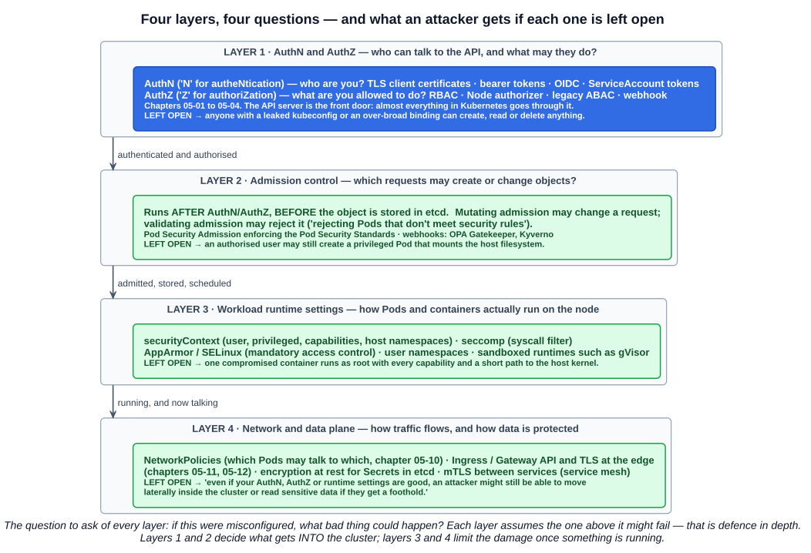
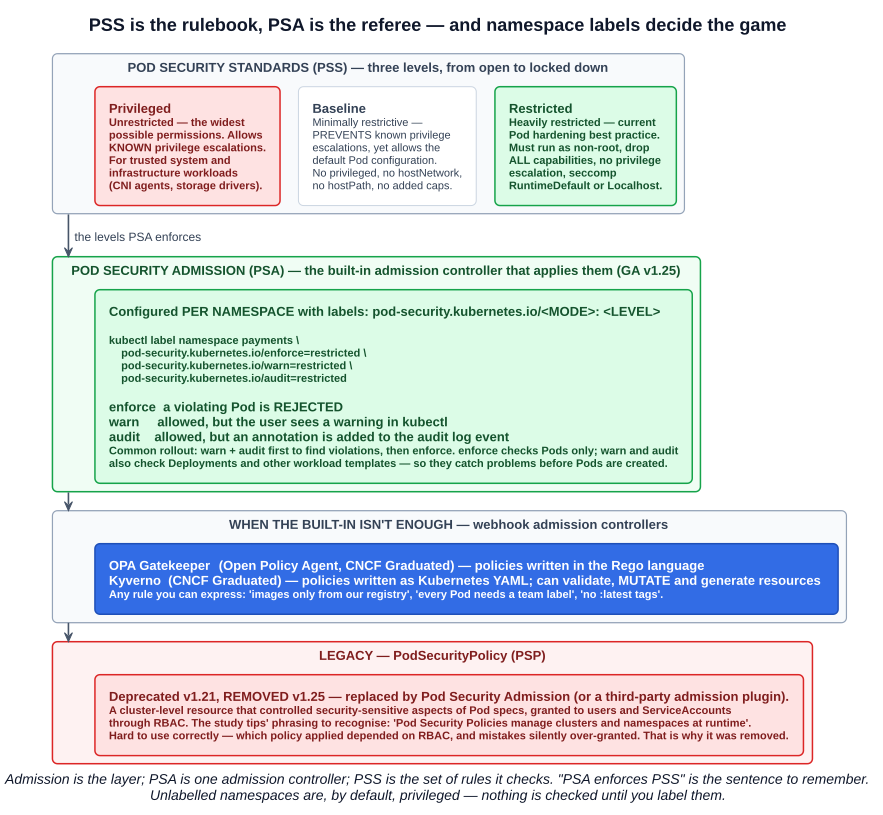
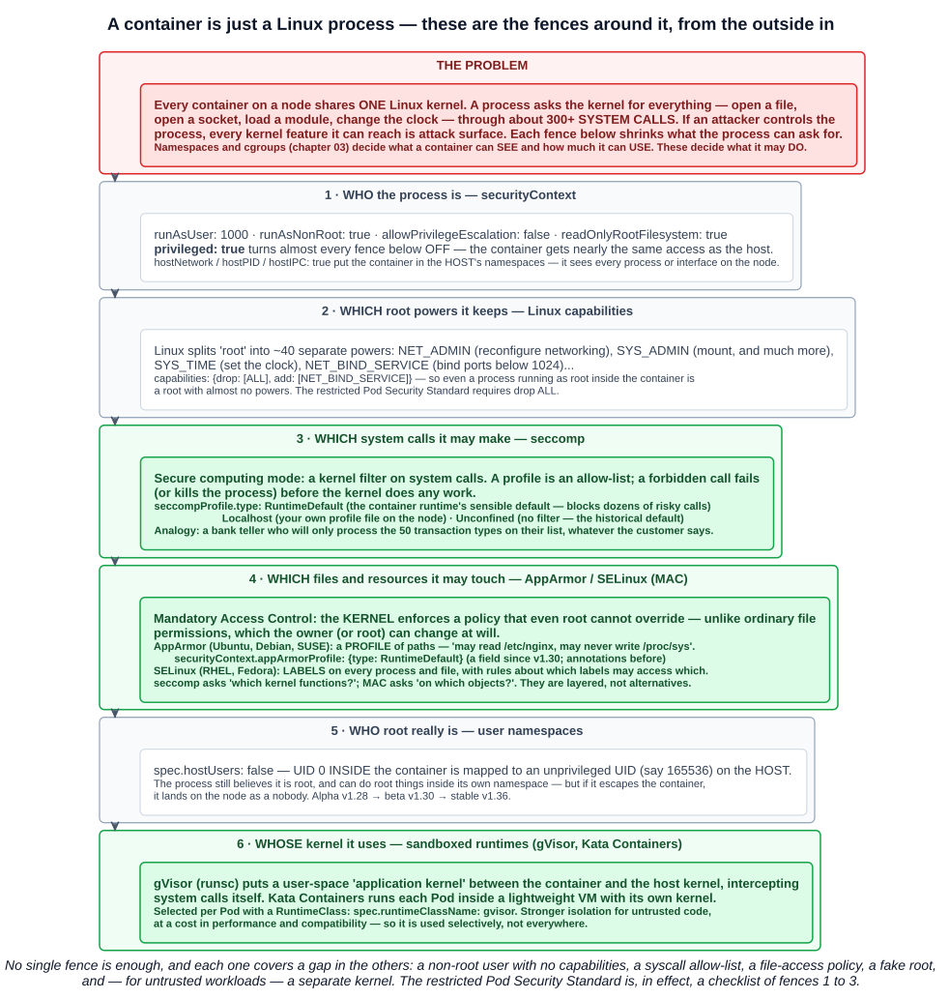
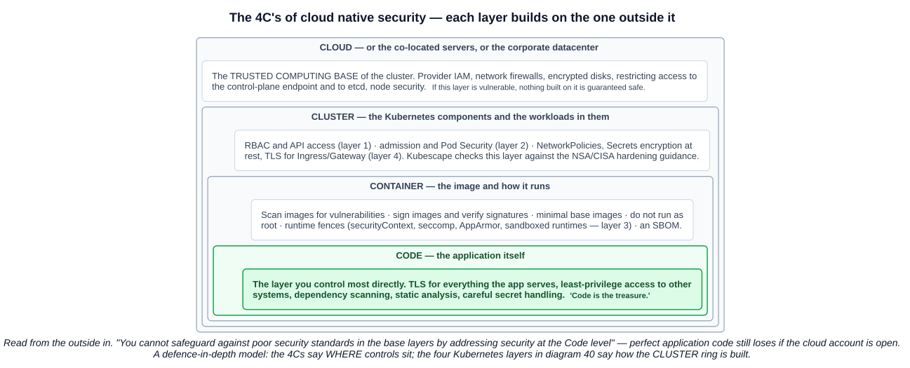

# 14 — Kubernetes security: a 10,000 foot overview

Most of section 5 has been security in disguise — RBAC, ServiceAccounts, NetworkPolicies, TLS at the edge. This chapter is the map that puts those pieces in order, plus the parts of the map not yet covered: admission policy, runtime hardening, encryption at rest and the security tooling ecosystem.

The study tips list seven things the exam can ask about, and each has a section here:

| Study-tips item | Section |
|---|---|
| 1. How Kubernetes security is structured — **the 4 layers and their roles** | 1 |
| 2. **Admission**, and how it relates to **PSA** and **PSS** | 3 |
| 3. Security tools and their function, including **Falco** and **Open Policy Agent** | 7 |
| 4. **Kubescape** for hardening to **NSA and CISA** standards | 7 |
| 5. **OpenID Connect** and its purpose (the exam may say **OIDC**) | 2.1 |
| 6. Legacy: **Pod Security Policies** | 3.4 |
| 7. **The 4C's of cloud native security** | 8 |

---

## 1. The four layers



The lecture organises Kubernetes security into four pillars — **who can talk to the cluster, what they are allowed to create or change, how workloads run at runtime, and how traffic and data are protected**:

| Layer | Question | Main controls |
|---|---|---|
| **1. AuthN & AuthZ** | **Who can talk to the Kubernetes API, and what are they allowed to do?** | Certificates, tokens, OIDC, ServiceAccounts; RBAC |
| **2. Admission control** | **Which requests are allowed to create or update objects?** | Pod Security Admission, OPA Gatekeeper, Kyverno |
| **3. Workload runtime settings** | **How do Pods and containers actually run on the nodes?** | `securityContext`, seccomp, AppArmor/SELinux, user namespaces, sandboxed runtimes |
| **4. Network and data plane** | **How does traffic flow between workloads, and how is data protected?** | NetworkPolicies, Ingress/Gateway TLS, encryption at rest |

The question the lecture asks you to keep in mind for every layer: **if this layer is misconfigured, what bad thing could happen?**

| Layer left open | Consequence |
|---|---|
| AuthN/AuthZ | A leaked kubeconfig or an over-broad RoleBinding can create, read or delete anything |
| Admission | An authorised user can still create a privileged Pod that mounts the node's filesystem |
| Runtime | One compromised container runs as root, with every capability, close to the host kernel |
| Network and data | *"Even if your AuthN, AuthZ or runtime settings are good, an attacker might still be able to **move laterally** inside the cluster or **read sensitive data** if they get a foothold"* |

Layers 1 and 2 decide **what gets into the cluster**. Layers 3 and 4 **limit the damage** once something is running. Each layer assumes the others might fail — that is **defence in depth**.

---

## 2. Layer 1: AuthN and AuthZ

> The **front door** of any cluster is the **Kubernetes API server**. Almost everything in Kubernetes goes through the API — creating Pods, scaling Deployments, applying configuration.

Two mnemonics from the lecture:

- **AuthN — "N is the N in authentication."** Answers **"Who are you?"** — via **TLS client certificates**, **bearer tokens**, **OIDC** with an identity provider, or **ServiceAccounts** for workloads.
- **AuthZ — "Z is the Z in authorization."** Answers **"What are you allowed to do?"** — in Kubernetes typically **RBAC**, plus the **Node authorizer** (which limits what kubelets can read) and, in some setups, legacy mechanisms like **ABAC**.

The three things the lecture lists for this layer, with where each was covered:

| Topic | Chapter |
|---|---|
| **TLS and certificates** for the API server and clients | 05-02 (the two directions of trust) |
| **How users and machines authenticate** — OIDC, client certificates, ServiceAccounts | 05-02, 05-04 |
| **RBAC roles and bindings** control which **verbs** and **resources** a subject can use | 05-03, 05-04 |

The request flow is always **User → AuthN → AuthZ → (admission) → API**, as in chapter 05-01.

### 2.1 OpenID Connect (OIDC)

The further-study page notes OIDC appears more often in the exam now. You don't need deep technical knowledge — you need to know **what it is and why Kubernetes uses it**.

> **OpenID Connect is an identity layer built on top of the OAuth 2.0 protocol.** It allows users to authenticate using an **external identity provider** — Google, GitHub, or a company's internal login system — and receive a **secure token** in return.

| Term | Meaning |
|---|---|
| **OAuth 2.0** | A protocol for **authorisation** — granting an application access on your behalf |
| **OIDC** | An **identity** layer on top of it — proving **who you are** |
| **IdP** | **Identity provider** — the system that actually checks your password, SSO session or MFA |
| **JWT** | **JSON Web Token** — the signed token OIDC returns |

**Why Kubernetes uses it.** Kubernetes has no user database (chapter 05-02). OIDC lets it **trust an existing identity provider** instead, which is what makes it practical for many users: the company's single sign-on decides who you are, Kubernetes just verifies the token.

**A JWT** has three parts, written `header.payload.signature`:

| Part | Contains |
|---|---|
| **Header** | The **algorithm** used for signing |
| **Payload** | **Claims** — username, email, **group membership** |
| **Signature** | Proof the token was issued by the IdP and **has not been tampered with** |

**The flow**, end to end:

1. **The user logs in at the identity provider** — username/password, SSO or MFA. Often triggered by a kubectl plugin such as **`kubectl oidc-login`** (from the kubelogin project), which opens a browser and captures the token.
2. **The IdP issues a JWT**, signed with its **private key**. kubectl stores it in the kubeconfig and sends it on every request as **`Authorization: Bearer <token>`**.
3. **The API server validates it** using the **IdP's public keys**, which it finds through the IdP's discovery URL (configured with flags such as **`--oidc-issuer-url`**, **`--oidc-client-id`**, **`--oidc-username-claim`**, **`--oidc-groups-claim`**, or the structured `AuthenticationConfiguration`, stable since v1.34). It checks the signature and expiry, then reads the username and groups from the claims.
4. **RBAC decides.** If a binding grants the user or one of their groups the verb, the request proceeds; otherwise **`403 Forbidden`**:

```
Error from server (Forbidden): User "you@example.com" cannot list resource "pods" in API group "" at the cluster scope
```

Precisely, Kubernetes uses the **`id_token`** — not the `access_token` — to identify the user. Chapter 05-02 covers the kubeconfig side of this in detail, including how enterprise SSO groups become RBAC subjects.

---

## 3. Layer 2: Admission control

> **The API received your request** → **Admission Control** → **The object is stored in etcd and becomes reality.**

Admission runs **after** authentication and authorisation and **before** anything is persisted (chapter 05-01). It is the last chance to say no.

| Kind | Does |
|---|---|
| **Mutating** | **Changes** the request — inject a sidecar, add default labels, set a security default |
| **Validating** | **Accepts or rejects** it — *"rejecting Pods that don't meet security rules"* |

Kubernetes ships with built-in admission plugins (`LimitRanger`, `ResourceQuota`, `NodeRestriction`, `PodSecurity` and more) and can call out to **webhooks** for anything else.



### 3.1 Pod Security Standards (PSS) — the rules

The PSS define **three levels**. The study tips and the lecture both say: **remember these and be able to tell them apart — they come up across all the Kubernetes exams.**

| Level | Definition | For |
|---|---|---|
| **Privileged** | *"**Unrestricted** policy, providing the **widest possible level of permissions**. This policy **allows** for known privilege escalations."* | **Trusted system workloads** — CNI agents, storage drivers, node monitoring |
| **Baseline** | *"**Minimally restrictive** policy which **prevents known privilege escalations**. Allows the default (minimally specified) Pod configuration."* | Ordinary applications, with the least friction |
| **Restricted** | *"**Heavily restricted** policy, following current Pod hardening best practices."* | Security-critical applications, and anything running untrusted code |

Examples of what each level stops:

| | Privileged | Baseline | Restricted |
|---|---|---|---|
| `privileged: true` | Allowed | **Blocked** | **Blocked** |
| `hostNetwork` / `hostPID` / `hostIPC` | Allowed | **Blocked** | **Blocked** |
| `hostPath` volumes | Allowed | **Blocked** | **Blocked** |
| Adding risky capabilities (`NET_ADMIN`, `SYS_ADMIN`) | Allowed | **Blocked** | **Blocked** |
| Running as root | Allowed | Allowed | **Must run as non-root** |
| Capabilities | Anything | Defaults | **Must drop `ALL`** (may add back only `NET_BIND_SERVICE`) |
| `allowPrivilegeEscalation` | Anything | Anything | **Must be `false`** |
| seccomp | Anything | Not `Unconfined` | **Must be `RuntimeDefault` or `Localhost`** |

**Each level builds on the one before.** Baseline is "no known escalations"; Restricted is "no known escalations *and* follow every hardening practice".

### 3.2 Pod Security Admission (PSA) — the enforcement

**Pod Security Admission is the built-in admission controller that enforces the Pod Security Standards.** It is **stable since v1.25** and on by default. **PSA enforces PSS** — the sentence to remember.

It is configured **per namespace, with labels**:

```
pod-security.kubernetes.io/<MODE>: <LEVEL>
```

```bash
kubectl label namespace payments \
  pod-security.kubernetes.io/enforce=restricted \
  pod-security.kubernetes.io/warn=restricted \
  pod-security.kubernetes.io/audit=restricted
```

| Mode | On a violation |
|---|---|
| **`enforce`** | The Pod is **rejected** |
| **`warn`** | Allowed, but **the user sees a warning** in kubectl |
| **`audit`** | Allowed, but an **annotation is added to the audit log** event |

Two practical details:

- **`warn` and `audit` also check workload templates** — Deployments, Jobs and so on — so you hear about a violation when you apply the Deployment. **`enforce` only checks the resulting Pods**, so a non-compliant Deployment is accepted and its Pods are then rejected by the ReplicaSet. The common rollout is **warn + audit first, then enforce**.
- **An unlabelled namespace defaults to `privileged`** — nothing is checked until you label it (or set cluster-wide defaults in the admission configuration).

A `<MODE>-version` label pins the rules to a specific Kubernetes version, so an upgrade does not suddenly start rejecting Pods.

### 3.3 Webhook admission controllers

When the built-in levels are not enough, policy engines run as **admission webhooks**:

| Tool | CNCF | Policy language | Notes |
|---|---|---|---|
| **Open Policy Agent (OPA)** with **Gatekeeper** | **Graduated** (Jan 2021) | **Rego** | General-purpose policy engine; Gatekeeper is its Kubernetes admission integration. Also used outside Kubernetes (APIs, Terraform, CI) |
| **Kyverno** | **Graduated** (Mar 2026) | **Kubernetes-style YAML** | Built for Kubernetes; can **validate, mutate and generate** resources |

Typical rules neither PSS nor RBAC can express: *images only from our registry*, *every Pod must have a `team` label*, *no `:latest` tags*, *every Ingress must have TLS*.

### 3.4 Legacy: PodSecurityPolicy (PSP)

> PodSecurityPolicy was **deprecated in Kubernetes v1.21**, and **removed from Kubernetes in v1.25**.

PSP was a **cluster-level** resource that controlled security-sensitive aspects of a Pod spec; users and ServiceAccounts were granted permission to *use* a policy through RBAC. The study tips' phrasing to recognise in a question: **Pod Security Policies manage clusters and namespaces at runtime.**

It was removed because it was hard to use correctly — which policy applied depended on RBAC bindings in ways that were easy to get wrong, and mistakes silently over-granted. Its replacements are **Pod Security Admission** and **third-party admission plugins** such as OPA Gatekeeper or Kyverno.

| | PodSecurityPolicy | Pod Security Admission |
|---|---|---|
| Status | **Removed v1.25** | **Stable v1.25** |
| Configured by | Cluster-level policy objects + RBAC | **Namespace labels** |
| Rules | Fully custom | The **three fixed PSS levels** |
| Customisation beyond that | Built in | OPA Gatekeeper, Kyverno |

---

## 4. Layer 3: Workload runtime settings



### 4.1 The problem these settings solve

A container is not a little virtual machine. **It is an ordinary Linux process**, fenced in by kernel features (chapter 03). And **every container on a node shares the same Linux kernel**.

A process does everything by asking the kernel — open a file, open a network socket, start another process, change the clock, load a kernel module. Those requests are called **system calls (syscalls)**, and Linux has well over 300 of them.

That is the whole security problem in one sentence: **if an attacker controls a process inside a container, every kernel feature that process is allowed to reach is attack surface — and the kernel is shared with every other Pod on the node.** A bug in one obscure syscall can be a route out of the container.

**Namespaces** and **cgroups** decide what a container can *see* and how much it can *use*. The settings in this layer decide what it is allowed to *do*. Each one is a separate fence, and they stack.

### 4.2 `securityContext` — who the process is

The `securityContext` field exists at **Pod level** (applies to every container) and **container level** (overrides for one container). It sets:

| Setting | What it controls | Secure value |
|---|---|---|
| **`runAsUser`** / **`runAsGroup`** | **Which user ID the container runs as** | A non-zero UID, e.g. `1000` |
| **`runAsNonRoot`** | Refuse to start if the image would run as root | `true` |
| **`allowPrivilegeEscalation`** | Whether a process can **gain more privileges than it started with** (setuid binaries) | `false` |
| **`privileged`** | **Whether it is allowed to be privileged** — near-full access to the host | `false` |
| **`capabilities`** | **Which Linux capabilities are added or dropped** | `drop: [ALL]` |
| **`readOnlyRootFilesystem`** | Whether the container can write to its own filesystem | `true` |
| Pod-level `hostNetwork`, `hostPID`, `hostIPC` | **Whether it can access the host network, host PIDs and so on** | `false` |

The next chapter (05-15) is entirely about `securityContext`, with the lecture's privilege-escalation demonstration. Three of these are worth understanding now:

**Root inside a container is real root.** Without user namespaces (4.6), UID 0 in the container is UID 0 on the host kernel. The container's other fences are all that stop it acting like the host's root.

**`privileged: true` turns off almost every fence.** The container gets all capabilities, access to host devices, and no seccomp or AppArmor confinement. It exists for genuine infrastructure (a CNI agent that configures node networking) and should be rare.

**`hostPID: true`** puts the container in the node's process namespace — it can see, and with enough privilege signal, every process on the machine. `hostNetwork` does the same for network interfaces.

### 4.3 Linux capabilities — which parts of root it keeps

Historically, Linux had two kinds of user: root, who could do everything, and everyone else. **Capabilities split root's power into about forty separate privileges**, each of which can be granted or removed independently:

| Capability | Grants |
|---|---|
| `NET_BIND_SERVICE` | Bind to ports below 1024 |
| `NET_ADMIN` | Reconfigure network interfaces, routes, firewall rules |
| `SYS_TIME` | Set the system clock |
| `SYS_ADMIN` | A huge catch-all — mount filesystems and much more; often called "the new root" |
| `CHOWN` | Change file ownership |

Container runtimes already drop many capabilities by default. Hardened workloads go further:

```yaml
securityContext:
  capabilities:
    drop: ["ALL"]
    add: ["NET_BIND_SERVICE"]   # only if it truly needs a low port
```

The effect: **even if the process runs as root, it is a root with almost no powers.** The **restricted** PSS level requires `drop: [ALL]`.

### 4.4 seccomp — which system calls it may make

> **Seccomp** — system call filtering for containers.

**Seccomp** ("secure computing mode") is a Linux kernel feature that puts a **filter in front of the syscall interface**. A seccomp profile lists which syscalls the process may make; anything else is refused before the kernel does any work.

An analogy: a bank teller with a list of the transactions they are allowed to process. A customer — however convincing — who asks for something not on the list is turned away at the counter. The vault (the kernel) never gets involved.

Why it matters: most applications need only a small fraction of the 300+ syscalls. A web server never needs to load a kernel module or reboot the machine. Blocking what it does not need removes those code paths from an attacker's reach, which is how seccomp has neutralised real container-escape vulnerabilities.

```yaml
securityContext:
  seccompProfile:
    type: RuntimeDefault
```

| `type` | Meaning |
|---|---|
| **`RuntimeDefault`** | The **container runtime's default profile** — blocks dozens of rarely-needed, risky syscalls while allowing what ordinary applications use. **The sensible default** |
| **`Localhost`** | **Your own profile**, a JSON file on the node (`localhostProfile: profiles/my-app.json`) — tightest, but you must know every syscall your app makes |
| **`Unconfined`** | **No filter at all** |

**The surprise:** unless configured otherwise, **Kubernetes runs containers `Unconfined`**. You get `RuntimeDefault` only if you ask for it in the Pod spec, or if the kubelet's **`seccompDefault`** setting is enabled to make it the node-wide default. Seccomp support itself has been **stable since v1.19**.

### 4.5 AppArmor and SELinux — which files and resources it may touch

> **AppArmor / SELinux** — kernel-level **MAC (Mandatory Access Control)** frameworks.

First, what "mandatory" means. Ordinary Linux file permissions are **discretionary access control (DAC)**: the owner of a file decides who can read it, and **root can override anything**. If an attacker becomes root, DAC stops nothing.

**Mandatory Access Control** is different: **the kernel enforces a policy written by the administrator, and even root cannot override it.** A process confined by MAC can be root and still be refused.

Where seccomp asks *"which kernel functions may you call?"*, MAC asks *"**on which objects** — which files, directories, sockets, capabilities?"*. They complement each other.

| | AppArmor | SELinux |
|---|---|---|
| Common on | Ubuntu, Debian, SUSE | RHEL, Fedora, CentOS |
| Model | **Profiles of paths** — *may read `/etc/nginx/**`, may never write `/proc/sys/**`, may not use raw sockets* | **Labels** on every process and file, plus rules about which process labels may access which file labels |
| Learning curve | Gentler — paths are readable | Steeper — powerful, but labels take time to understand |
| In Kubernetes | `securityContext.appArmorProfile` — **a field since v1.30** (annotations before); **stable in v1.31** | `securityContext.seLinuxOptions` (level, role, type, user) |

```yaml
securityContext:
  appArmorProfile:
    type: RuntimeDefault        # or Localhost with localhostProfile: my-profile
```

A node runs one or the other, depending on its Linux distribution — which is why both exist.

### 4.6 User namespaces — who root really is

> **User Namespaces** — mapping container users to **non-root users on the host**.

A **user namespace** gives the container its own range of user IDs. **UID 0 inside the container is mapped to an unprivileged UID — say 165536 — on the host.**

The process still believes it is root, and can do root-like things *inside its own namespace* (useful for software that insists on starting as root). But if it escapes the container, it arrives on the node as an ordinary unprivileged user, with nothing it can damage.

```yaml
spec:
  hostUsers: false
```

`hostUsers: false` opts a Pod in. The feature went **alpha in v1.28, beta in v1.30, and stable in v1.36**; it also needs support from the node's Linux kernel and container runtime.

### 4.7 Sandboxed runtimes — whose kernel it uses

> **Hardened runtimes like gVisor** — isolating workloads further from the host kernel.

Every fence so far still leaves the container talking to **the real host kernel**. Sandboxed runtimes change that:

| Runtime | How |
|---|---|
| **gVisor** (Google, `runsc`) | A **user-space "application kernel"** sits between the container and the host. It intercepts the container's syscalls and implements them itself, passing only a small, safe subset to the real kernel |
| **Kata Containers** | Runs each Pod inside a **lightweight virtual machine** with its **own kernel** — VM-strength isolation with a container-like workflow |

A Pod chooses one with a **RuntimeClass** (chapter 02-07):

```yaml
spec:
  runtimeClassName: gvisor
```

The cost is **performance and compatibility** — syscall-heavy or unusual workloads may run slower or not at all — so these are used **selectively**: multi-tenant platforms, CI runners, anything executing untrusted code.

### 4.8 Putting the fences together

| Fence | Answers | Kubernetes field |
|---|---|---|
| User / privilege settings | Who is the process, and can it gain more? | `runAsUser`, `runAsNonRoot`, `allowPrivilegeEscalation`, `privileged` |
| Capabilities | Which parts of root does it keep? | `capabilities.drop/add` |
| seccomp | Which syscalls may it make? | `seccompProfile` |
| AppArmor / SELinux | Which files and resources may it touch? | `appArmorProfile`, `seLinuxOptions` |
| User namespaces | Is its root real root on the host? | `hostUsers: false` |
| Sandboxed runtime | Does it share the host kernel at all? | `runtimeClassName` |

**No single fence is sufficient, and each covers a gap in the others.** The restricted PSS level (section 3.1) is effectively a checklist of the first three — which is how layer 2 enforces layer 3.

---

## 5. Layer 4: network and data plane

> How traffic is protected · how traffic comes in or out of the cluster · how data is stored and encrypted.

### 5.1 NetworkPolicies

> **NetworkPolicies** define which Pods can talk to which other Pods or external endpoints. **Without NetworkPolicies, most CNI plugins default to "allow all" within the cluster.**

Chapter 05-10 covers them in full. The security point is **lateral movement**: with no policies, a foothold in any Pod is a foothold next to every database in the cluster.

### 5.2 Ingress and Gateway API

> **Ingress / Gateway API** control how external traffic enters the cluster. Ingress controllers and Gateway implementations often include **TLS termination and routing rules**. **Misconfiguration can lead to exposed services or bypassed controls.**

Chapters 05-11 and 05-12. Typical mistakes: an internal admin path accidentally routed publicly, plain HTTP left enabled alongside HTTPS, or a route that lets traffic reach a Service around the controls (authentication, rate limits) applied elsewhere.

### 5.3 Encryption at rest

> **Encryption at rest** for sensitive data stored in etcd and other storage backends. Kubernetes supports **encrypting Secrets at rest**, typically with a **key management solution**.

Chapter 04-11 established that Secrets are only **base64-encoded**. By default they are also **stored unencrypted in etcd** — anyone who can read etcd, or a copy of an etcd backup, can read every Secret.

The API server can encrypt chosen resources before writing them, configured through an **`EncryptionConfiguration`** file passed with `--encryption-provider-config`:

| Provider | Meaning |
|---|---|
| **`identity`** | **No encryption** — data written as-is. **The default** |
| `aescbc`, `aesgcm`, `secretbox` | Encrypt with a **key stored in the configuration file on the control-plane node** — better, but the key sits next to the data |
| **`kms` (v2)** | **Envelope encryption via an external Key Management Service** (cloud KMS, HashiCorp Vault). Each object gets its own data key, which is itself encrypted by a key that **never leaves the KMS** — **recommended** |

Encryption in transit is the other half: TLS between every control-plane component, TLS at the edge, and mTLS between services with a service mesh.

---

## 6. The wider security landscape

The overview slide scatters other topics around the four layers. Each is a recognition-level term for the KCNA:

| Term | Meaning |
|---|---|
| **SBOM** | **Software Bill of Materials** — a machine-readable list of every component and dependency in an image, so a newly disclosed vulnerability can be traced to every affected workload |
| **Image scanning** | Checking images for known vulnerabilities (CVEs) before they run — e.g. Trivy |
| **Image signing** | Proving an image came from you and was not modified — e.g. Sigstore's cosign, the Notary Project; enforced at admission |
| **Supply-chain security** | Protecting everything from source to running image — in-toto (CNCF Graduated) records and verifies each build step |
| **mTLS** | Mutual TLS — both sides present certificates, so services authenticate each other (service mesh) |
| **Secrets management** | Keeping credentials out of images and manifests — external stores, KMS, sealed or external secrets |

---

## 7. Security tools

| Tool | CNCF | Layer | What it does |
|---|---|---|---|
| **Falco** | **Graduated** (Feb 2024) | Runtime (detection) | **Runtime threat detection.** Watches **system calls** from every container (via eBPF or a kernel module) and alerts on suspicious behaviour — a shell spawned in a container, a write to `/etc`, a read of a sensitive file, an unexpected outbound connection |
| **Open Policy Agent (OPA)** + Gatekeeper | **Graduated** (Jan 2021) | Admission (prevention) | **General-purpose policy engine**; policies in **Rego**. In Kubernetes, Gatekeeper enforces them as an admission webhook |
| **Kyverno** | **Graduated** (Mar 2026) | Admission (prevention) | **Kubernetes-native policy engine**; policies as **YAML**; validate, **mutate** and generate |
| **Kubescape** | **Incubating** (Jan 2025) | Posture (assessment) | **Security posture and compliance scanning** of clusters, YAML and Helm charts against frameworks including the **NSA/CISA Kubernetes Hardening Guidance**, **MITRE ATT&CK** and **CIS Benchmarks** |

**Prevention versus detection** is the useful distinction:

- **OPA and Kyverno** stop bad configurations **before** they are created.
- **Falco** notices bad behaviour **while** it happens — catching the attack the configuration did not prevent.
- **Kubescape** **assesses** how well the cluster is hardened overall.

### 7.1 Kubescape and the NSA/CISA guidance

The study tips call this out specifically: **Kubescape can be used to harden a cluster against NSA and CISA standards.**

The **Kubernetes Hardening Guidance** was published by the US **National Security Agency (NSA)** and the **Cybersecurity and Infrastructure Security Agency (CISA)**. It covers Pod security (non-root, read-only filesystems, no privileged containers), network separation, authentication and authorisation, audit logging, and keeping components patched. Kubescape turns it into automated checks:

```bash
kubescape scan framework nsa
kubescape scan framework mitre
kubescape scan                       # all frameworks
```

The output is a list of failed controls and a compliance score — a practical to-do list for layer 2 and layer 3 settings.

---

## 8. The 4C's of cloud native security



> You can think about security in layers. The **4C's of Cloud Native security** are **Cloud, Clusters, Containers, and Code**.

Read **from the outside in** — each layer is a boundary around the next:

| C | Is | Example controls |
|---|---|---|
| **Cloud** | The infrastructure — a cloud account, co-located servers, or a corporate datacenter. **The trusted computing base** of the cluster | Provider IAM, network firewalls, restricting access to the API endpoint and to **etcd**, node hardening |
| **Cluster** | The Kubernetes components and the workloads configured in them | RBAC, admission and Pod Security, NetworkPolicies, Secrets encryption, Kubescape |
| **Container** | The image and how it runs | Vulnerability scanning, image signing, minimal images, non-root, runtime fences |
| **Code** | The application itself — **the layer you control most directly** | TLS, least-privilege access to other systems, dependency and static analysis |

> Each layer of the Cloud Native security model **builds upon the next outermost layer**. The Code layer benefits from strong base (Cloud, Cluster, Container) security layers. **You cannot safeguard against poor security standards in the base layers by addressing security at the Code level.**

The course's mnemonic: *in the Cloud, vast and endlessly wide; where Clusters like fortresses in safety reside; guarded by Containers, strong and bold; Code is the treasure, more valuable than gold.*

**How the two models relate:** the 4C's say **where** controls live; the **four Kubernetes layers** of section 1 describe how the **Cluster** ring is built. They are complementary, not competing.

**A note on currency:** the 4C's page was part of the Kubernetes documentation up to **v1.28**. From v1.29 the docs' security overview is organised around the **CNCF cloud native security whitepaper's lifecycle phases — Develop, Distribute, Deploy, Runtime**. The 4C's remain a common exam topic, which is why the course still teaches them.

---

## Exam angle

- **Kubernetes security has four layers: AuthN & AuthZ** (who can talk to the API, what may they do) · **admission control** (which requests may create or change objects) · **workload runtime settings** (how Pods and containers run on nodes) · **network and data plane** (how traffic flows, how data is protected).
- **AuthN answers "who are you?"** — certificates, bearer tokens, **OIDC**, ServiceAccounts. **AuthZ answers "what are you allowed to do?"** — **RBAC**, Node authorizer, legacy ABAC.
- **OIDC is an identity layer on top of OAuth 2.0.** Users authenticate with an **external identity provider** and receive a signed **JWT** (`header.payload.signature`); the API server verifies it with the **IdP's public keys**, reads username and groups from its **claims**, and RBAC authorises.
- **Admission runs after AuthN/AuthZ and before the object is stored in etcd** — **mutating** (change) and **validating** (reject).
- **Pod Security Standards: Privileged** (unrestricted, allows known escalations) · **Baseline** (minimally restrictive, prevents known escalations) · **Restricted** (heavily restricted, hardening best practice).
- **Pod Security Admission enforces the PSS** (stable **v1.25**), configured with **namespace labels** `pod-security.kubernetes.io/<mode>: <level>`; modes **`enforce`** (reject), **`warn`** (user warning), **`audit`** (audit log annotation).
- **PodSecurityPolicy was deprecated in v1.21 and removed in v1.25**, replaced by Pod Security Admission or third-party admission controllers. It **managed clusters and namespaces at runtime**.
- **OPA (Gatekeeper)** and **Kyverno** are **policy engines run as admission webhooks** — OPA uses **Rego**, Kyverno uses **YAML** and can mutate. **Falco** is **runtime threat detection** from system calls. **Kubescape** scans against the **NSA/CISA hardening guidance**, MITRE ATT&CK and CIS.
- **`securityContext`** sets the user ID, privileged mode, capabilities, privilege escalation and host access. **Seccomp** filters **system calls**. **AppArmor and SELinux** are **kernel MAC** frameworks restricting file and resource access. **User namespaces** map container root to an unprivileged host user. **gVisor** isolates workloads further from the host kernel.
- **Secrets are not encrypted in etcd by default** (the `identity` provider); **encryption at rest** uses an `EncryptionConfiguration`, ideally with a **KMS**.
- **Without NetworkPolicies, most CNIs allow all traffic** within the cluster.
- **The 4C's: Cloud, Cluster, Container, Code**, from the outside in — each builds on the outer layer, and **code-level security cannot compensate for weak base layers**.

## References

- [Pod Security Standards](https://kubernetes.io/docs/concepts/security/pod-security-standards/) — the three levels and every control they check
- [Pod Security Admission](https://kubernetes.io/docs/concepts/security/pod-security-admission/) — modes, namespace labels, exemptions
- [Linux kernel security constraints for Pods and containers](https://kubernetes.io/docs/concepts/security/linux-kernel-security-constraints/) — capabilities, seccomp, AppArmor, SELinux, user namespaces
- [Encrypting Confidential Data at Rest](https://kubernetes.io/docs/tasks/administer-cluster/encrypt-data/) — `EncryptionConfiguration` and its providers
