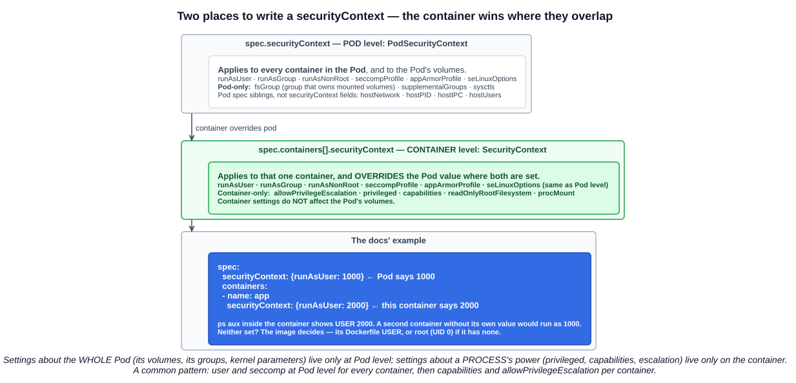
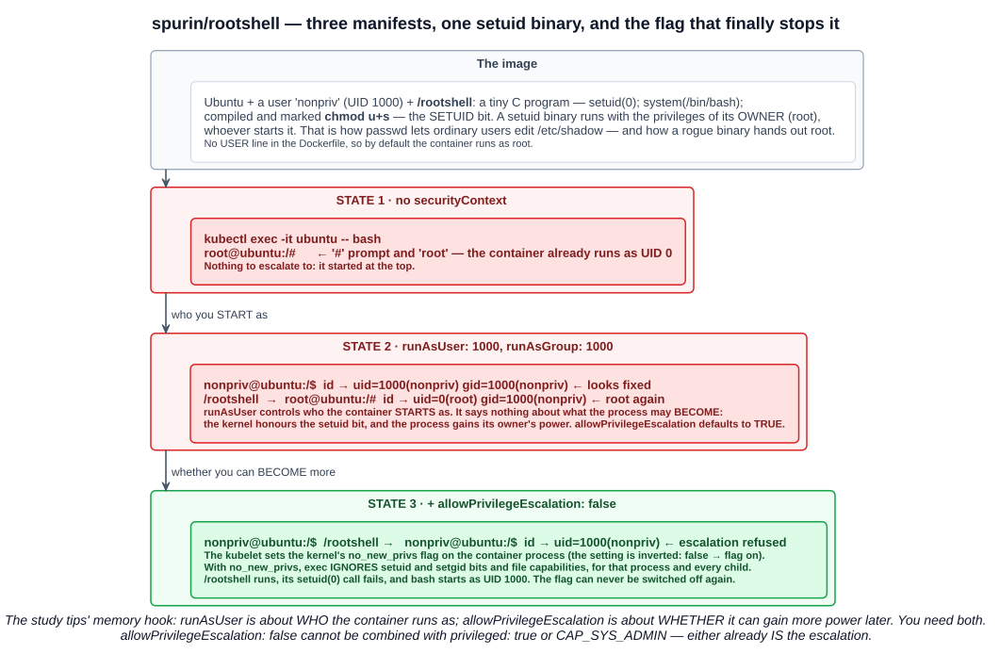

# 15 — Security contexts

Chapter 05-14 introduced `securityContext` as the first fence of layer 3, workload runtime settings. This chapter is that fence up close — and the lecture's demonstration of why one setting on its own is not enough.

The study tips single out two fields, with a memory hook worth keeping:

> **`runAsUser` is about who the container runs as**, while **`allowPrivilegeEscalation` is about whether it can gain more power later.**

---

## 1. What a security context is

> A security context defines **privilege and access control settings for a Pod or Container**.

It is the part of the Pod spec that tells the container runtime **how to start the process**: which user, which groups, which Linux capabilities, whether it may be privileged, whether it may gain privileges, which seccomp and AppArmor profiles apply, and whether its filesystem is writable.

The settings it covers, from the documentation:

| Setting | Controls |
|---|---|
| **Discretionary access control** — `runAsUser`, `runAsGroup`, `fsGroup` | Which **UID and GID** the process has, and therefore which files it may access |
| **`runAsNonRoot`** | Refuse to start the container if it would run as UID 0 |
| **`privileged`** | Run **privileged** (near-full host access) or not |
| **`capabilities`** | Give **some** of root's privileges, not all |
| **`allowPrivilegeEscalation`** | Whether a process **can gain more privileges than its parent** — for example, by executing a **setuid binary** |
| **`readOnlyRootFilesystem`** | Mount the container's root filesystem **read-only** |
| **`seccompProfile`** | Filter the process's **system calls** |
| **`appArmorProfile`**, **`seLinuxOptions`** | Mandatory access control profiles and labels |

What each of these means at the kernel level is in chapter 05-14 section 4. This chapter is about using them.

---

## 2. Pod level and container level



There are **two** `securityContext` fields, at different levels of the spec:

| | `spec.securityContext` | `spec.containers[].securityContext` |
|---|---|---|
| Type | **PodSecurityContext** | **SecurityContext** |
| Applies to | **Every container** in the Pod, and the Pod's **volumes** | **That one container** |
| Precedence | The default | **Overrides the Pod value where both are set** |
| Fields only here | **`fsGroup`**, **`supplementalGroups`**, **`sysctls`** | **`allowPrivilegeEscalation`**, **`privileged`**, **`capabilities`**, **`readOnlyRootFilesystem`**, `procMount` |
| Fields at both | `runAsUser`, `runAsGroup`, `runAsNonRoot`, `seccompProfile`, `appArmorProfile`, `seLinuxOptions` | the same |

> Security settings that you specify for a Container apply only to the individual Container, and they **override settings made at the Pod level when there is overlap**. Container settings **do not affect the Pod's Volumes**.

The split has a logic: things about **the whole Pod** — shared volumes, group membership, kernel parameters — live at Pod level; things about **one process's power** — privileged mode, capabilities, escalation — live on the container.

The docs' example of the override:

```yaml
spec:
  securityContext:
    runAsUser: 1000           # Pod default
  containers:
  - name: sec-ctx-demo-2
    image: gcr.io/google-samples/hello-app:2.0
    securityContext:
      runAsUser: 2000         # this container overrides it
      allowPrivilegeEscalation: false
```

`ps aux` inside that container shows **USER 2000**.

And if neither level sets a user, **the image decides** — the `USER` instruction in its Dockerfile, or **root (UID 0)** if there is none. Most public images have no `USER` line, which is why containers so often run as root by default.

Note also that `hostNetwork`, `hostPID`, `hostIPC` and `hostUsers` are **Pod spec fields**, siblings of `securityContext` rather than inside it — though they are security settings all the same.

---

## 3. Who the container runs as

### 3.1 `runAsUser` and `runAsGroup`

```yaml
spec:
  securityContext:
    runAsUser: 1000
    runAsGroup: 3000
    fsGroup: 2000
```

| Field | Effect |
|---|---|
| **`runAsUser`** | **The user ID the container process runs as.** Overrides the image's `USER` |
| **`runAsGroup`** | The **primary group ID**. If omitted, the primary group is **root (0)** — even when `runAsUser` is set, which is easy to miss |
| **`fsGroup`** | A **supplementary group** added to every process; **mounted volumes are made group-owned** by it, so a non-root process can write to them |
| **`supplementalGroups`** | Further supplementary groups |

With the settings above, `id` inside the container prints `uid=1000 gid=3000 groups=2000,...`, and files written to a volume are owned by group 2000.

**Why non-root matters:** without user namespaces (chapter 05-14), **UID 0 inside a container is UID 0 to the host kernel**. If a vulnerability lets a root process out of its container, it arrives on the node as root. Running as an unprivileged UID means an escape lands as nobody. That is why running as non-root is the most common container hardening recommendation — and why the **restricted** Pod Security Standard requires it.

### 3.2 `runAsNonRoot`

```yaml
securityContext:
  runAsNonRoot: true
```

`runAsUser` says *what* UID to use. **`runAsNonRoot` says what is not acceptable**: the kubelet checks the effective UID before starting the container and **refuses to start it if it would be root**:

```
Error: container has runAsNonRoot and image will run as root
```

It catches the case where nobody set `runAsUser` and the image defaults to root. A subtlety: if the image's `USER` is a **name** rather than a number, the kubelet cannot verify it, and also refuses — `image has non-numeric user (nonpriv), cannot verify user is non-root`. Setting `runAsUser` numerically avoids that.

---

## 4. Whether it can gain more power later



### 4.1 setuid binaries

Normally a program runs with the privileges of **whoever starts it**. A file with the **setuid bit** set (`chmod u+s`) is different: it runs with the privileges of **its owner**. If root owns it, anyone who runs it gets root's power for that program.

This exists for good reasons — `passwd` is setuid root so ordinary users can update their own entry in `/etc/shadow`, which only root may write. It is also a classic **privilege escalation** path: a vulnerable or deliberately malicious setuid-root binary hands root to whoever runs it.

### 4.2 The lecture's demonstration

The lecture uses **`spurin/rootshell`**, an image built for exactly this purpose:

| Part of the image | What it does |
|---|---|
| A user **`nonpriv`**, UID 1000 | An ordinary unprivileged user |
| **`/rootshell`** | A tiny C program — `setuid(0); system("/bin/bash");` — compiled and marked **`chmod u+s`**, owned by root |
| No `USER` instruction | By default the container runs as **root** |

The image's own README demonstrates it with Docker:

```bash
docker run -it --rm --user 1000:1000 spurin/rootshell:latest
nonpriv@00eac4da6562:/$ id
uid=1000(nonpriv) gid=1000(nonpriv) groups=1000(nonpriv)
nonpriv@00eac4da6562:/$ /rootshell
root@00eac4da6562:/# id
uid=0(root) gid=1000(nonpriv) groups=1000(nonpriv)
```

> This image includes a binary that allows any user to gain root privileges. It is crucial to handle this image carefully and ensure it is **never used in a sensitive or production environment**.

The Kubernetes version, in three states:

**State 1 — no security context.**

```bash
kubectl run ubuntu --image=spurin/rootshell:latest -o yaml --dry-run=client -- sleep infinity | tee ubuntu_secure.yaml
kubectl apply -f ubuntu_secure.yaml
kubectl exec -it ubuntu -- bash
```

```
root@ubuntu:/#
```

The prompt says it all: **`root`** is the user, **`#`** is the root shell prompt. With no `USER` in the image and nothing in the Pod spec, the container runs as UID 0.

**State 2 — run as a non-root user.**

```yaml
spec:
  securityContext:
    runAsUser: 1000
    runAsGroup: 1000
  containers:
  - args: ["sleep", "infinity"]
    image: spurin/rootshell:latest
    name: ubuntu
```

```bash
kubectl replace --force -f ubuntu_secure.yaml
kubectl exec -it ubuntu -- bash
```

```
nonpriv@ubuntu:/$ id
uid=1000(nonpriv) gid=1000(nonpriv) groups=1000(nonpriv)
nonpriv@ubuntu:/$ /rootshell
root@ubuntu:/# id
uid=0(root) gid=1000(nonpriv) groups=1000(nonpriv)
```

It *looks* fixed — `nonpriv` and a `$` prompt — until `/rootshell` runs. **`runAsUser` controls who the process starts as, not what it may become.** The kernel honours the setuid bit, the process gains root, and the attacker is back where state 1 started. `allowPrivilegeEscalation` **defaults to `true`**, so nothing prevented it.

**State 3 — forbid escalation.**

```yaml
  containers:
  - args: ["sleep", "infinity"]
    image: spurin/rootshell:latest
    name: ubuntu
    securityContext:
      allowPrivilegeEscalation: false
```

```
nonpriv@ubuntu:/$ /rootshell
nonpriv@ubuntu:/$ id
uid=1000(nonpriv) gid=1000(nonpriv) groups=1000(nonpriv)
```

**The escalation is refused.** The process started as 1000 and stays 1000.

### 4.3 How `allowPrivilegeEscalation` works

> `allowPrivilegeEscalation`: Controls whether a process can gain more privileges than its parent process, for example, by executing a setuid binary. This boolean value **directly controls whether the `no_new_privs` flag gets set** on the container process, though note that **the value is inverted**: if `allowPrivilegeEscalation` is true, then `no_new_privs` will be set to false.

**`no_new_privs`** is a Linux kernel flag on a process. Once it is set:

- **`exec` ignores setuid and setgid bits**, and file capabilities — a program runs with the caller's privileges, never its owner's.
- It is **inherited by every child process**.
- It **can never be cleared** for that process tree.

So in state 3, `/rootshell` still runs, but without root's privileges; its `setuid(0)` call fails, and `bash` starts as UID 1000.

Three rules worth remembering:

| Rule | Why |
|---|---|
| **It defaults to `true`** if not set | So escalation is allowed unless you say otherwise |
| **It must be `false` under the restricted PSS level** | Pod Security Admission enforces it (chapter 05-16) |
| **It cannot be `false` together with `privileged: true` or `CAP_SYS_ADMIN`** | Those settings already *are* the escalation — the combination is inconsistent and rejected |

**`runAsUser` and `allowPrivilegeEscalation` need each other.** The first starts the process low; the second keeps it there.

---

## 5. The other container-level settings

### 5.1 `privileged`

```yaml
securityContext:
  privileged: true        # avoid
```

A privileged container gets **all Linux capabilities**, **access to the host's devices**, and **no seccomp or AppArmor confinement** — close to running directly on the node. Reserve it for genuine infrastructure, such as a CNI agent configuring node networking. **Both the baseline and restricted PSS levels forbid it.**

### 5.2 `capabilities`

```yaml
securityContext:
  capabilities:
    drop: ["ALL"]
    add: ["NET_BIND_SERVICE"]
```

Drop everything, add back only what the process genuinely needs — here, binding to a port below 1024. The documentation's example shows the effect in `/proc/1/status`, where the `CapEff` bitmask changes as capabilities are added. **Restricted** requires `drop: ["ALL"]`, permitting only `NET_BIND_SERVICE` to be added.

Capability names in Kubernetes **omit the `CAP_` prefix** — `NET_ADMIN`, not `CAP_NET_ADMIN`.

### 5.3 `readOnlyRootFilesystem`

```yaml
securityContext:
  readOnlyRootFilesystem: true
```

The container cannot modify its own filesystem — an attacker cannot drop a tool, overwrite a binary or plant a persistence script. Directories the application genuinely writes to (temp files, caches) are mounted as `emptyDir` volumes (chapter 05-08).

### 5.4 `seccompProfile` and `appArmorProfile`

```yaml
securityContext:
  seccompProfile:
    type: RuntimeDefault
  appArmorProfile:
    type: RuntimeDefault
```

Both can be set at Pod or container level (chapter 05-14 sections 4.4 and 4.5). Remember that seccomp is **`Unconfined` by default** in Kubernetes unless set here or by the kubelet's `seccompDefault`.

---

## 6. A hardened baseline

Putting it together — a container that passes the **restricted** Pod Security Standard:

```yaml
apiVersion: v1
kind: Pod
metadata:
  name: hardened
spec:
  securityContext:
    runAsNonRoot: true
    runAsUser: 1000
    runAsGroup: 1000
    fsGroup: 1000
    seccompProfile:
      type: RuntimeDefault
  containers:
  - name: app
    image: nginxinc/nginx-unprivileged:stable     # built to run as non-root on port 8080
    ports:
    - containerPort: 8080
    securityContext:
      allowPrivilegeEscalation: false
      readOnlyRootFilesystem: true
      capabilities:
        drop: ["ALL"]
    volumeMounts:
    - {name: tmp, mountPath: /tmp}
  volumes:
  - {name: tmp, emptyDir: {}}
```

| Line | Fence |
|---|---|
| `runAsNonRoot`, `runAsUser`, `runAsGroup` | Starts as an ordinary user, and refuses to run as root |
| `allowPrivilegeEscalation: false` | Can never become root via setuid |
| `capabilities: drop: [ALL]` | Even root would have no special powers |
| `readOnlyRootFilesystem` + an `emptyDir` for `/tmp` | Cannot modify its own image |
| `seccompProfile: RuntimeDefault` | Dangerous syscalls blocked |

Images matter here: the stock `nginx` image starts as root to bind port 80, so it fails under these settings; `nginx-unprivileged` is built to run as a normal user on 8080. Hardening is easiest when the image was designed for it.

---

## Exam angle

- **A security context defines privilege and access control settings for a Pod or container.** Set at **Pod level** (`spec.securityContext`, all containers and volumes) or **container level** (`spec.containers[].securityContext`) — **the container value overrides the Pod value**.
- **`runAsUser` is the user ID the container process runs as** — who it runs as. Non-root is the standard best practice. **With no `runAsUser` and no image `USER`, the container runs as root (UID 0).**
- **`allowPrivilegeEscalation` controls whether a process can gain more privileges than its parent** — e.g. becoming root through a **setuid** binary — whether it can gain more power **later**. It **defaults to `true`** and works by setting the kernel's **`no_new_privs`** flag (inverted: `false` → flag set).
- **`runAsUser` alone does not stop escalation** — the lecture's `rootshell` setuid binary still returned root until `allowPrivilegeEscalation: false` was added.
- **`runAsNonRoot: true`** makes the kubelet **refuse to start** a container that would run as UID 0.
- **`runAsGroup`** sets the primary group (defaults to **0** if omitted); **`fsGroup`** (Pod level only) owns mounted volumes.
- **Container-only fields:** `allowPrivilegeEscalation`, `privileged`, `capabilities`, `readOnlyRootFilesystem`. **Pod-only:** `fsGroup`, `supplementalGroups`, `sysctls`.
- **`privileged: true`** gives all capabilities and host device access; **`allowPrivilegeEscalation: false` cannot be combined with `privileged` or `CAP_SYS_ADMIN`**.
- **Hardened container:** `runAsNonRoot`, `allowPrivilegeEscalation: false`, `capabilities.drop: [ALL]`, `readOnlyRootFilesystem: true`, `seccompProfile: RuntimeDefault` — the requirements of the **restricted** PSS.

## References

- [Configure a Security Context for a Pod or Container](https://kubernetes.io/docs/tasks/configure-pod-container/security-context/) — every field, Pod vs container precedence, capabilities, seccomp and AppArmor
- [Pod Security Standards](https://kubernetes.io/docs/concepts/security/pod-security-standards/) — which securityContext values each level allows
- [spurin/rootshell](https://github.com/spurin/rootshell) — the setuid image used in the lecture's escalation demonstration
