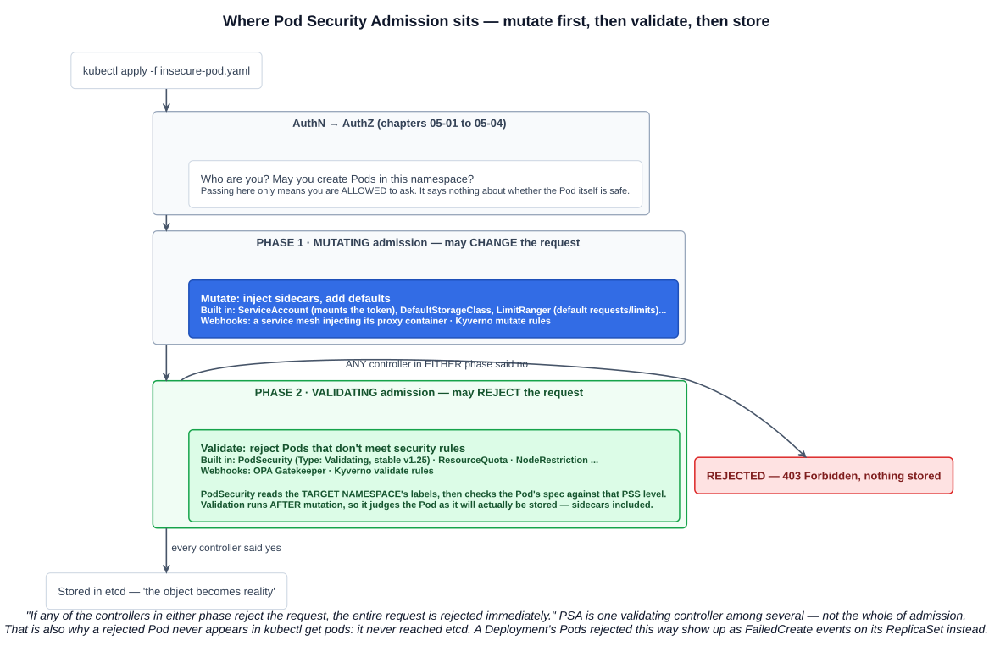
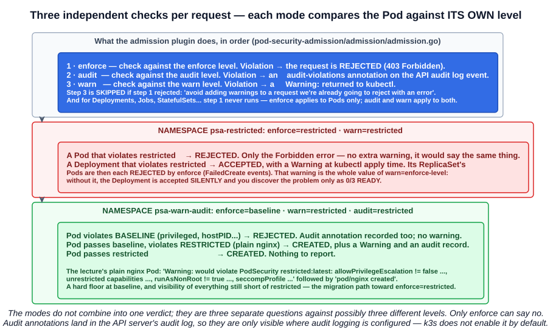

# 16 — Pod Security Admission

Chapter 05-14 introduced the Pod Security Standards and the controller that enforces them. Chapter 05-15 showed the `securityContext` fields they judge. This chapter is the enforcement in action: **Pod Security Admission (PSA) + Pod Security Standards (PSS)**, namespace by namespace.

> Pod Security Admission is **a feature responsible for checking your Pods before they are created**, making sure they meet the security standards you have set for your cluster.

---

## 1. Admission control: mutate, then validate



> Before the API server accepts a request, it is sent through **a series of admission controllers**. These can **mutate** the request, **validate** it, or **reject** it if it breaks certain rules.

> The API received your request → **Admission Control** → The object is stored in etcd and becomes reality.

The documentation describes **two phases, always in this order**:

| Phase | Does | Examples |
|---|---|---|
| **1. Mutating** | **Changes** the request — *injecting sidecars or adding defaults* | ServiceAccount token mounting, LimitRanger default requests, a service mesh's proxy injection, Kyverno mutate rules |
| **2. Validating** | **Accepts or rejects** — *rejecting Pods that don't meet security rules* | **PodSecurity**, ResourceQuota, NodeRestriction, OPA Gatekeeper, Kyverno validate rules |

> If any of the controllers in **either phase** reject the request, **the entire request is rejected immediately**.

**PSA is one validating controller** — the built-in `PodSecurity` plugin, *"Type: Validating"*, stable since **v1.25**. Running after mutation is deliberate: it judges the Pod **as it will actually be stored**, sidecars and defaults included.

---

## 2. What PSA asks, and how it decides

For every new Pod, PSA asks questions like:

- **Is the container running as root?**
- **Is it using host networking or host PID?**
- **Is it privileged?**
- **Is it mounting sensitive host paths?**

> Instead of defining complex, per-Pod policies, Pod Security Admission uses **standard security profiles** and **namespace labels** to decide what's allowed and what's not.

Those are the two halves — the **standard profiles** are the PSS levels, the **namespace labels** pick one per namespace.

### 2.1 The levels (PSS)

| Level | Lecture's summary |
|---|---|
| **Privileged** | **Basically "no restrictions".** Suitable for **system namespaces** or trusted workloads that **really do need host-level access**, like **CNI plugins or storage drivers** |
| **Baseline** | **Meant for most applications.** Blocks **known privilege-escalation paths** while staying compatible with common workloads. Rejects things like **privileged containers, hostPID/hostIPC, dangerous capabilities and host-related options** |
| **Restricted** | **"As locked down as reasonably possible."** Enforces current best practice — **no running as root, stricter capability rules, stronger requirements around securityContext fields** |

**A correction to the slide:** it says privileged suits *"trusted workloads that really **no** need host-level access"*. That is a typo — the point of the privileged level is the opposite. **These workloads genuinely *do* need host-level access** (a CNI plugin must configure the node's network; a storage driver must mount host devices), which is exactly why they cannot run under baseline.

The full list of what each level blocks is in chapter 05-14 section 3.1.

### 2.2 The modes

| Mode | Behaviour |
|---|---|
| **`enforce`** | **Actually block** non-compliant Pods |
| **`warn`** | **Allow** the Pod, but **send a warning to the user** |
| **`audit`** | **Allow** the Pod, but **log the violation** for auditing (an annotation on the audit log event) |

### 2.3 The labels

PSA works **at the namespace level**: label a namespace with the level you want, and the admission controller enforces it on any Pod created in that namespace.

```
pod-security.kubernetes.io/<MODE>: <LEVEL>
pod-security.kubernetes.io/<MODE>-version: <VERSION>
```

- **`<MODE>`** — `enforce`, `warn` or `audit`
- **`<LEVEL>`** — `privileged`, `baseline` or `restricted`
- **`<VERSION>`** — a Kubernetes minor version such as `v1.34`, or **`latest`**

**Modes are independent, and each can use a different level.** The lecture's example combines all three:

```
pod-security.kubernetes.io/enforce=privileged
pod-security.kubernetes.io/enforce-version=latest
pod-security.kubernetes.io/warn=baseline
pod-security.kubernetes.io/warn-version=latest
pod-security.kubernetes.io/audit=restricted
pod-security.kubernetes.io/audit-version=latest
```

Read it as: **block nothing, warn the user about anything worse than baseline, and record anything worse than restricted.** That is the gentle way to roll PSA out to an existing namespace — see what *would* break before enforcing it.

### 2.4 The `-version` label

The PSS rules evolve. The `-version` label pins which release's definition applies:

| Value | Meaning |
|---|---|
| **`latest`** | Always the current Kubernetes version's rules — tightens automatically on upgrade |
| **`v1.34`** (a specific version) | The rules as they were in that release — **an upgrade cannot start rejecting Pods** that passed before |

`latest` is convenient; pinning is safer for production namespaces, with the pin bumped deliberately after testing.

### 2.5 How the modes combine



The modes do **not** merge into one verdict. **Each mode compares the Pod against its own level, independently**, and only `enforce` can say no. The admission plugin's source shows the exact order:

1. **`enforce`** — check against the enforce level. Violation → **rejected** (`403 Forbidden`).
2. **`audit`** — check against the audit level. Violation → an **`audit-violations`** annotation on the API server's audit log event.
3. **`warn`** — check against the warn level. Violation → a **`Warning:`** returned to the client. **Skipped if step 1 already rejected** — *"avoid adding warnings to a request we're already going to reject with an error"*.

And one more rule decides which steps run at all: **for Pods, all three run; for workload resources (Deployments, StatefulSets, Jobs...), `enforce` never runs** — only `audit` and `warn` (section 4.2).

#### `enforce=restricted` together with `warn=restricted`

The same level in both modes looks redundant. For a **Pod** created directly, it is: a violating Pod is **rejected**, and the warning is suppressed because the error already says the same thing. You see the Forbidden message, nothing more.

The value is for **workload resources**:

| You apply | `enforce=restricted` alone | `enforce=restricted` + `warn=restricted` |
|---|---|---|
| A violating **Pod** | Rejected | Rejected (same — no extra warning) |
| A **Deployment** whose template violates | **Accepted silently.** Its ReplicaSet then fails to create every Pod — you find out from `0/3 READY` and `FailedCreate` events | Accepted, **with a `Warning:` at `kubectl apply` time** — you find out immediately. The Pods are still rejected |

So `warn` at the enforce level is an **early-warning system for Deployments**: it turns a silent failure into an immediate message. That is why the lecture, and the docs' examples, almost always set them in pairs.

#### `enforce=baseline`, `warn=restricted`, `audit=restricted`

Your reading is exactly right: **Pods are blocked only if they violate baseline. Pods that pass baseline but violate restricted are created — with a warning to the user and an audit record.**

| The Pod | Result |
|---|---|
| **Violates baseline** (privileged, hostPID, hostPath...) | **Rejected** by enforce. The audit annotation is still recorded; the warning is skipped |
| **Passes baseline, violates restricted** (an ordinary `nginx` Pod: runs as root, no seccomp, capabilities not dropped) | **Created** — plus a **warning** to the user **and** an **audit** record |
| **Passes restricted** | **Created**, nothing reported |

It sets a **hard floor at baseline** and **reports everything still short of restricted** — the standard way to migrate a namespace toward `enforce=restricted` without breaking anything on the way. Once the warnings and audit records stop appearing, raise `enforce` to `restricted`.

One practical caveat on `audit`: the annotation is written to the **API server's audit log**, which only exists if audit logging is configured. k3s, for example, *"doesn't create by default the log directory and audit policy"* — so on the lecture's cluster the audit mode records into a log nobody is writing. `warn` is visible immediately; `audit` matters on clusters with an audit pipeline feeding a SIEM.

---

## 3. The lab

### 3.1 An unlabelled namespace

```bash
kubectl create namespace psa-unrestricted
kubectl get ns psa-unrestricted --show-labels
```

```
NAME               STATUS   AGE   LABELS
psa-unrestricted   Active   14s   kubernetes.io/metadata.name=psa-unrestricted
```

The only label is `kubernetes.io/metadata.name`, set automatically on every namespace (chapter 05-10). **No `pod-security` labels means the `privileged` level applies — nothing is checked.**

A deliberately insecure Pod, generated and then edited:

```bash
kubectl -n psa-unrestricted run insecure-pod --image=nginx:stable --dry-run=client -o yaml > insecure-pod.yaml
```

```yaml
apiVersion: v1
kind: Pod
metadata:
  labels:
    run: insecure-pod
  name: insecure-pod
  namespace: psa-unrestricted
spec:
  hostNetwork: true          # the node's network namespace
  hostPID: true              # the node's process namespace
  containers:
  - image: nginx:stable
    name: insecure-pod
    securityContext:
      privileged: true       # near-full host access
      runAsUser: 0           # explicitly root
```

Four of the four questions in section 2 answered "yes".

```bash
kubectl apply -f insecure-pod.yaml
kubectl get pod -n psa-unrestricted
# insecure-pod   1/1   Running
```

**It runs.** With no labels, PSA has no level to enforce — the namespace is effectively privileged.

### 3.2 A baseline namespace

```bash
kubectl create namespace psa-baseline
kubectl label namespace psa-baseline \
  pod-security.kubernetes.io/enforce=baseline \
  pod-security.kubernetes.io/enforce-version=latest \
  pod-security.kubernetes.io/warn=baseline \
  pod-security.kubernetes.io/warn-version=latest
```

The same Pod, with only its namespace changed:

```bash
cp insecure-pod.yaml insecure-pod-baseline.yaml     # namespace: psa-baseline
kubectl apply -f insecure-pod-baseline.yaml
```

```
Error from server (Forbidden): error when creating "insecure-pod-baseline.yaml":
pods "insecure-pod" is forbidden: violates PodSecurity "baseline:latest":
host namespaces (hostNetwork=true, hostPID=true),
privileged (container "insecure-pod" must not set securityContext.privileged=true)
```

How to read that message:

| Part | Meaning |
|---|---|
| `Forbidden` | Rejected at admission — the Pod was **never stored**, so it will not appear in `kubectl get pods` |
| `violates PodSecurity "baseline:latest"` | The **level** and **version** from the namespace labels |
| `host namespaces (hostNetwork=true, hostPID=true)` | First baseline check failed |
| `privileged (container ... must not set securityContext.privileged=true)` | Second baseline check failed |

Note what is **not** listed: `runAsUser: 0`. **Baseline permits running as root** — only **restricted** forbids it. The error names exactly the controls the chosen level checks.


### 3.3 A restricted namespace

```bash
kubectl create namespace psa-restricted
kubectl label namespace psa-restricted \
  pod-security.kubernetes.io/enforce=restricted \
  pod-security.kubernetes.io/enforce-version=latest \
  pod-security.kubernetes.io/warn=restricted \
  pod-security.kubernetes.io/warn-version=latest
```

A plain nginx Pod is now rejected — it violates four restricted controls. The lecture builds the compliant version:

```bash
kubectl run -n psa-restricted nginx --image=nginx:stable -o yaml --dry-run=client | tee nginx-pod-restricted.yaml
```

```yaml
spec:
  securityContext:
    runAsNonRoot: true                    # Pod level
  containers:
  - image: nginx:stable
    name: nginx
    securityContext:
      allowPrivilegeEscalation: false
      capabilities:
        drop: ["ALL"]
      seccompProfile:
        type: RuntimeDefault
```

Each line answers one restricted check — exactly the four named in the warning in section 3.4.

**The catch worth knowing:** this Pod **passes admission and still does not run.** PSA judges the **spec**, not the **image**. `runAsNonRoot: true` is a promise the kubelet verifies at start-up, and the stock `nginx` image has no `USER` line, so it would start as root (chapter 05-15):

```bash
kubectl apply -f nginx-pod-restricted.yaml        # pod/nginx created
kubectl get pod -n psa-restricted nginx
# NAME    READY   STATUS                       RESTARTS
# nginx   0/1     CreateContainerConfigError   0
kubectl describe pod -n psa-restricted nginx | grep -A2 Events
# Error: container has runAsNonRoot and image will run as root
```

Two different gatekeepers, at two different moments:

| Check | When | Looks at |
|---|---|---|
| **Pod Security Admission** | At **admission**, before the Pod is stored | The **Pod spec** — does it *declare* the restricted settings? |
| **kubelet `runAsNonRoot` check** | At **container start**, on the node | The **actual UID** the image would run as |

The fix is an image built to run unprivileged — `nginxinc/nginx-unprivileged`, which runs as UID 101 on port 8080 — or a numeric `runAsUser`. Even then, stock nginx with `drop: [ALL]` cannot change file ownership or bind port 80, which is why images designed for non-root are the practical answer for restricted namespaces.

### 3.4 A warn-and-audit namespace

```bash
kubectl create namespace psa-warn-audit
kubectl label namespace psa-warn-audit \
  pod-security.kubernetes.io/enforce=baseline \
  pod-security.kubernetes.io/enforce-version=latest \
  pod-security.kubernetes.io/warn=restricted \
  pod-security.kubernetes.io/warn-version=latest \
  pod-security.kubernetes.io/audit=restricted \
  pod-security.kubernetes.io/audit-version=latest
```

```bash
kubectl -n psa-warn-audit run nginx --image=nginx:stable -o yaml --dry-run=client | tee nginx-pod-warn.yaml
kubectl apply -f nginx-pod-warn.yaml
```

```
Warning: would violate PodSecurity "restricted:latest":
  allowPrivilegeEscalation != false (container "nginx" must set securityContext.allowPrivilegeEscalation=false),
  unrestricted capabilities (container "nginx" must set securityContext.capabilities.drop=["ALL"]),
  runAsNonRoot != true (pod or container "nginx" must set securityContext.runAsNonRoot=true),
  seccompProfile (pod or container "nginx" must set securityContext.seccompProfile.type to "RuntimeDefault" or "Localhost")
pod/nginx created
```

**`Warning:` then `pod/nginx created`** — section 2.5 in one output. The plain Pod passes **baseline** (it is not privileged and uses no host namespaces), so enforce lets it through; it fails **restricted**, so warn reports it and audit records it. Note the wording: *"would violate"* — a warning describes what enforcing that level **would** do.

The four items in that warning are a ready-made checklist: they are precisely the four fields added in section 3.3.

---

## 4. Operating PSA

### 4.1 Labelling a namespace that already has Pods

Applying an `enforce` label to an existing namespace **does not delete or evict** anything:

> When an `enforce` policy (or version) label is added or changed, the admission plugin will **test each pod in the namespace against the new policy**. Violations are **returned to the user as warnings**.

Existing Pods keep running; only **new** Pods are rejected. That makes it easy to be surprised later — a Pod that restarts in place is fine, but if its node fails and the replacement is a *new* Pod, it is rejected.

**Preview before you commit** with a server-side dry run:

```bash
kubectl label --dry-run=server --overwrite ns psa-unrestricted \
  pod-security.kubernetes.io/enforce=baseline
```

```
Warning: existing pods in namespace "psa-unrestricted" violate the new PodSecurity enforce level "baseline:latest"
Warning: insecure-pod: host namespaces, privileged
namespace/psa-unrestricted labeled (server dry run)
```

The checks run; the label is not saved.

### 4.2 Pods versus workload resources

| Mode | Checks Pods | Checks Deployments, Jobs, StatefulSets... |
|---|---|---|
| **`enforce`** | **Yes** | **No** |
| **`warn`**, **`audit`** | Yes | **Yes** |

So with `enforce` alone, a non-compliant **Deployment is accepted** — and then **its ReplicaSet fails to create every Pod**. The only sign is a `FailedCreate` event on the ReplicaSet and a Deployment stuck at `0/3`:

```bash
kubectl describe replicaset <rs> | grep -A3 Events
# Warning  FailedCreate  ... violates PodSecurity "restricted:latest": ...
```

**Always pair `enforce` with `warn` at the same level** — then `kubectl apply` of the Deployment prints the warning immediately, before any Pod is attempted.

### 4.3 Exemptions

The admission controller's configuration can exempt requests from all three modes:

| Dimension | Exempts |
|---|---|
| **Usernames** | Requests from specific authenticated users |
| **RuntimeClassNames** | Pods using a specific runtime class (e.g. a sandboxed runtime, chapter 05-14) |
| **Namespaces** | Whole namespaces |

Exempting a user only helps when they create Pods **directly** — most Pods are created by controllers. And the docs warn **not** to exempt controller ServiceAccounts such as `replicaset-controller`, because that would exempt **anyone who can create a Deployment**.

### 4.4 Choosing levels per namespace

| Namespace | Typical labels |
|---|---|
| `kube-system`, CNI and storage namespaces | `enforce=privileged` — the workloads need host access |
| Ordinary application namespaces | `enforce=baseline`, `warn=restricted`, `audit=restricted` |
| Security-sensitive applications | `enforce=restricted` (+ `warn=restricted`) |
| Rolling out to an existing namespace | `warn` and `audit` only, then add `enforce` once clean |

### 4.5 Best practices

The lecture's closing list:

| Practice | Why |
|---|---|
| **Label namespaces intentionally** | **Don't rely on defaults** — an unlabelled namespace is effectively privileged. Decide which namespaces are privileged, baseline or restricted |
| **Treat system namespaces as special** | Namespaces like **`kube-system`** often need **privileged** to run critical components |
| **Use restricted for new workloads** | Aim for the restricted profile **from day one** — it is easier to design for security than to retrofit later |
| **Use warn/audit to avoid surprises** | Always start with **warn and audit before enabling enforcement**, especially in existing shared or production clusters |
| **Combine with other controls** | PSA is **one layer**. Combine it with **RBAC**, **NetworkPolicies** and **runtime security tools** for defence in depth (chapter 05-14) |

---

## Exam angle

- **Pod Security Admission checks Pods before they are created** against the **Pod Security Standards**. It is the built-in **`PodSecurity`** admission controller — **type: validating**, **stable v1.25**, replacing PodSecurityPolicy.
- **Admission runs in two phases: mutating first** (inject sidecars, add defaults), **then validating** (reject non-compliant objects). A rejection in either phase rejects the whole request, and **nothing is stored in etcd**.
- **PSA works per namespace via labels** `pod-security.kubernetes.io/<mode>: <level>` and an optional **`<mode>-version`** (`latest` or a version like `v1.34`).
- **Levels: privileged** (no restrictions — system workloads that need host access) · **baseline** (blocks known escalations — privileged, hostPID/hostIPC/hostNetwork, dangerous capabilities, hostPath) · **restricted** (no root, drop all capabilities, strict securityContext).
- **Modes: `enforce`** blocks · **`warn`** allows with a user warning · **`audit`** allows and records in the audit log. **Each mode can use a different level.**
- **An unlabelled namespace is effectively `privileged`.** **Baseline still allows running as root**; only restricted forbids it.
- **`enforce` checks Pods only; `warn` and `audit` also check workload resources** — so an enforce-only namespace accepts a bad Deployment whose Pods then fail to create.
- **Adding an `enforce` label does not evict existing Pods** — it warns about them. Preview with **`kubectl label --dry-run=server`**.
- **Modes are independent checks against their own levels; only `enforce` blocks.** `enforce=baseline` + `warn=restricted` + `audit=restricted` blocks baseline violations and **creates** restricted violators **with a warning and an audit record**.
- **`warn` at the same level as `enforce`** adds nothing for a directly created Pod (the rejection suppresses the warning) but **warns when you apply a non-compliant Deployment**, which `enforce` alone would accept silently.
- **PSA checks the Pod spec, not the image.** A Pod declaring `runAsNonRoot: true` is admitted, but the **kubelet** refuses to start it if the image runs as root (`CreateContainerConfigError`).
- **Best practices:** label namespaces intentionally · privileged only for system namespaces like `kube-system` · restricted for new workloads · warn/audit before enforce · combine with RBAC, NetworkPolicies and runtime security.

## References

- [Pod Security Admission](https://kubernetes.io/docs/concepts/security/pod-security-admission/) — modes, labels, workload resources, exemptions
- [Enforce Pod Security Standards with Namespace Labels](https://kubernetes.io/docs/tasks/configure-pod-container/enforce-standards-namespace-labels/) — labelling, versions and server-side dry runs
- [Admission Control in Kubernetes](https://kubernetes.io/docs/reference/access-authn-authz/admission-controllers/) — the mutating and validating phases and the `PodSecurity` plugin
