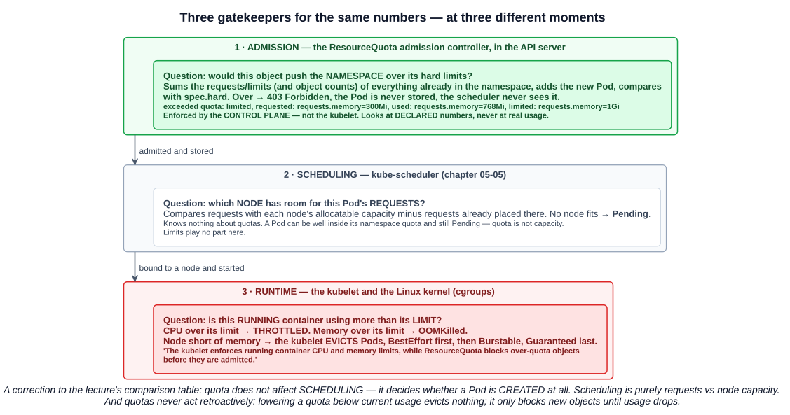
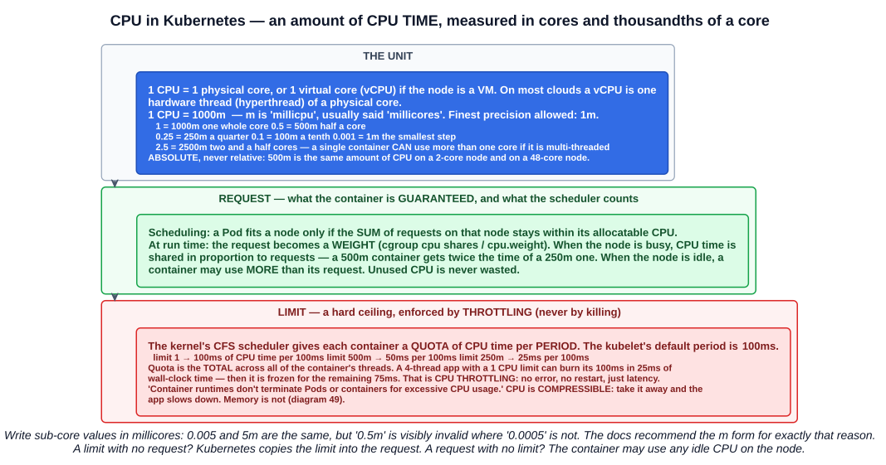
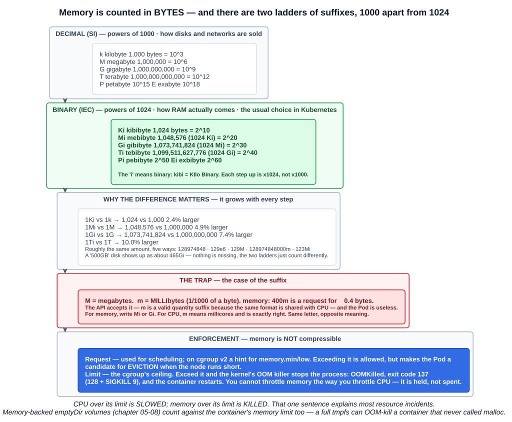

# 17 — Resource quotas, and how CPU and memory are measured

Chapter 04-04 introduced ResourceQuota alongside LimitRange. This chapter goes deeper: where a quota is enforced, what happens when one fills up, and — because every quota is written in them — exactly what CPU and memory quantities mean.

---

## 1. What a ResourceQuota is

> When several users or teams share a cluster with a fixed number of nodes, there is a concern that **one team could use more than its fair share** of resources. **Resource quotas are a tool for administrators to address this concern.**

> A resource quota, defined by a **ResourceQuota** object, provides constraints that **limit aggregate resource consumption per namespace**. A ResourceQuota can also limit the **quantity of objects that can be created in a namespace** by API kind, as well as the **total amount of infrastructure resources** that may be consumed by API objects found in that namespace.

In the lecture's words: ResourceQuotas **manage the consumption of resources in a namespace** — CPU, memory, storage, or the number of Pods — so that **no single namespace uses more than its fair share**. That prevents **resource starvation** by allocating capacity to namespaces in a **controlled and predictable** way, which is what makes them essential on **multi-tenant platforms**, where many teams share one cluster.

The pattern the documentation describes:

1. Different teams work in **different namespaces**, separated by RBAC (chapter 05-03).
2. An administrator creates **at least one ResourceQuota per namespace** — and restricts who may edit or delete it, so the limit stays enforced.
3. Teams create Pods, Services and so on; **the quota system tracks usage** against the hard limits.
4. A request that would exceed the quota is **rejected with HTTP `403 Forbidden`** and a message naming the constraint.

An example from the docs: in a cluster with **32 GiB of RAM and 16 cores**, give team A **20 GiB and 10 cores**, team B **10 GiB and 4 cores**, and hold **2 GiB and 2 cores** in reserve.

---

## 2. Where quota is enforced



This is the study tips' main point:

> Quotas are enforced by the **control plane** through the **ResourceQuota admission controller in the API server**, **not by the kubelet**.

`ResourceQuota` is one of the admission plugins **enabled by default** — it appears in the API server's default list alongside `NamespaceLifecycle`, `LimitRanger`, `ServiceAccount`, `PodSecurity` and the others (chapter 05-16). A quota applies to a namespace as soon as a ResourceQuota object exists there.

It is a **validating** step in the request path from chapter 05-01: **AuthN → AuthZ → admission → etcd**. A Pod over quota is rejected **before it is stored**, so it never appears in `kubectl get pods`, and the scheduler never sees it.

Three different components look at the same CPU and memory numbers, at three different moments:

| | Component | Asks | Looks at | Outcome when it says no |
|---|---|---|---|---|
| **1** | **ResourceQuota admission** (API server) | Would this push the **namespace** over its hard limits? | **Declared** requests, limits and object counts | **`403 Forbidden`** — not created |
| **2** | **kube-scheduler** | Which **node** has room for this Pod's **requests**? | Requests vs node **allocatable** | **`Pending`** |
| **3** | **kubelet and kernel** | Is this **running** container over its **limit**? | **Actual** usage | CPU **throttled**; memory **OOMKilled**; eviction under node pressure |

The study tips' summary: **the kubelet enforces running container CPU and memory limits, while ResourceQuota blocks over-quota objects before they are admitted.**

### 2.1 A correction to the lecture's comparison table

The slide's table says that with a requests quota, *"Pods are scheduled only if their requests do not exceed available quotas"*, and that a limits quota *"does not directly impact scheduling"*. Both rows mix up two stages:

- **Quota never affects scheduling.** It decides whether the Pod object is **created at all**. A Pod that would exceed the quota is rejected at admission; the scheduler is never involved.
- **Scheduling is purely requests vs node capacity.** A Pod comfortably inside its namespace quota can still be **`Pending`** if no node has room — **quota is a budget, not capacity**.

The table's first two columns are right: a **requests** quota caps the total that can be *requested* (the guaranteed share), a **limits** quota caps the total *ceiling* Pods may set, and **both together** bound the minimum and maximum a namespace can claim.

---

## 3. CPU: cores and millicores



### 3.1 The unit

> In Kubernetes, **1 CPU unit is equivalent to 1 physical CPU core, or 1 virtual core**, depending on whether the node is a physical host or a virtual machine.

On most cloud VMs, one **vCPU** is one **hardware thread** (hyperthread) of a physical core.

CPU is measured as **an amount of CPU time**, and fractions are allowed:

> The quantity expression **`0.1` is equivalent to `100m`**, which can be read as **"one hundred millicpu"**. Some people say **"one hundred millicores"**.

| Decimal | Millicores | Meaning |
|---|---|---|
| `2.5` | `2500m` | Two and a half cores — a multi-threaded container can use more than one core |
| `1` | `1000m` | One whole core |
| `0.5` | `500m` | Half a core |
| `0.25` | `250m` | A quarter of a core |
| `0.1` | `100m` | A tenth of a core |
| `0.001` | `1m` | **The smallest value allowed** — nothing finer than `1m` |

Two rules from the documentation:

- **CPU is always absolute, never relative.** *"`500m` CPU represents roughly the same amount of computing power whether that container runs on a single-core, dual-core, or 48-core machine."* It is not "50% of the node".
- **Prefer the `m` form below one CPU.** `5m` and `0.005` are equal, but an invalid `0.5m` is easy to spot where `0.0005` is not.

Whole numbers may be written bare (`cpu: 1`) or quoted (`cpu: "1"`) — both parse to the same quantity. The lecture quotes them, which keeps a column of quota values visually consistent.

### 3.2 What a request does

A **CPU request** is what the container is **guaranteed**:

- **For scheduling**, the scheduler places a Pod only on a node where the **sum of CPU requests** stays within the node's allocatable CPU.
- **At run time**, the request becomes a **weight** (the cgroup's CPU shares). When the node is **busy**, CPU time is divided **in proportion to requests** — a `500m` container gets twice as much as a `250m` one. When the node is **idle**, a container may use **more** than its request; spare CPU is never wasted.

### 3.3 What a limit does

A **CPU limit** is a **hard ceiling**, enforced by **throttling**.

The Linux CFS scheduler gives each container a **quota of CPU time per period**. The kubelet's default period is **100 ms**:

| CPU limit | CPU time allowed per 100 ms period |
|---|---|
| `1` | 100 ms |
| `500m` | 50 ms |
| `250m` | 25 ms |
| `2` | 200 ms (across two or more threads) |

The quota is the **total across all of the container's threads**. That produces the counter-intuitive case worth remembering: an application running **4 busy threads** with a **1-CPU limit** uses its 100 ms of CPU time in **25 ms of real time** — and is then **frozen for the remaining 75 ms** of the period. Nothing fails and nothing restarts; requests just get slow. That is **CPU throttling**, and it is a common cause of latency in Java and other multi-threaded runtimes.

> Container runtimes **don't terminate Pods or containers for excessive CPU usage**.

**CPU is a compressible resource**: take some away and the application slows down, but it keeps running.

---

## 4. Memory: bytes, and two sets of suffixes



### 4.1 The unit

> Limits and requests for `memory` are **measured in bytes**. You can express memory as a plain integer or as a fixed-point number using one of these quantity suffixes: **E, P, T, G, M, k**. You can also use the **power-of-two equivalents: Ei, Pi, Ti, Gi, Mi, Ki**.

There are **two ladders**:

**Decimal (SI) — powers of 1000.** How disk and network capacity is usually sold.

| Suffix | Name | Bytes |
|---|---|---|
| `k` | kilobyte | 1,000 (10³) |
| `M` | megabyte | 1,000,000 (10⁶) |
| `G` | gigabyte | 1,000,000,000 (10⁹) |
| `T` | terabyte | 1,000,000,000,000 (10¹²) |
| `P`, `E` | petabyte, exabyte | 10¹⁵, 10¹⁸ |

**Binary (IEC) — powers of 1024.** How RAM is actually built, and the usual choice in Kubernetes manifests.

| Suffix | Name | Bytes | Equals |
|---|---|---|---|
| `Ki` | **kibibyte** | 1,024 (2¹⁰) | 1024 bytes |
| `Mi` | **mebibyte** | 1,048,576 (2²⁰) | 1024 Ki |
| `Gi` | **gibibyte** | 1,073,741,824 (2³⁰) | 1024 Mi |
| `Ti` | **tebibyte** | 1,099,511,627,776 (2⁴⁰) | 1024 Gi |
| `Pi`, `Ei` | pebibyte, exbibyte | 2⁵⁰, 2⁶⁰ | 1024 of the step below |

The **`i`** marks the binary unit — *kibi* is **ki**lo **bi**nary, *mebi* is **me**ga **bi**nary.

### 4.2 Why the difference matters

The gap grows with every step:

| Compare | Bytes | Binary is larger by |
|---|---|---|
| `1Ki` vs `1k` | 1,024 vs 1,000 | 2.4% |
| `1Mi` vs `1M` | 1,048,576 vs 1,000,000 | 4.9% |
| `1Gi` vs `1G` | 1,073,741,824 vs 1,000,000,000 | 7.4% |
| `1Ti` vs `1T` | 1,099,511,627,776 vs 1,000,000,000,000 | 10.0% |

The documentation's example of roughly the same amount written five ways: **`128974848`, `129e6`, `129M`, `128974848000m`, `123Mi`**. And the everyday version: a disk sold as **500 GB** shows up as about **465 Gi** — nothing is missing; the two ladders simply count differently.

### 4.3 The trap: `M` versus `m`

> Pay attention to the **case** of the suffixes. **"M" means megabytes, while "m" means millibytes.** If you request **`400m`** of memory, this is a request for **0.4 bytes**.

The API accepts it — `m` is a legal quantity suffix because memory and CPU share the same quantity format — so the mistake is not caught. **For CPU, `m` means millicores and is exactly right; for memory it is almost certainly a bug.** Write memory as `Mi` or `Gi`.

### 4.4 What a request and a limit do

| | Memory request | Memory limit |
|---|---|---|
| Used for | **Scheduling**; on cgroup v2 a hint to the kernel (`memory.min`/`memory.low`) | The container's **hard ceiling** in its cgroup |
| Exceeding it | **Allowed** — but the Pod becomes a candidate for **eviction** if the node runs short of memory | The kernel's **OOM killer** stops the process: **`OOMKilled`**, exit code **137** (128 + `SIGKILL` 9), and the container restarts |

**Memory is not compressible.** CPU can be handed out in smaller slices; memory a process holds cannot be taken back without killing it. Hence the rule that explains most resource incidents:

> **CPU over its limit is slowed. Memory over its limit is killed.**

Note also that memory-backed `emptyDir` volumes count against the container's memory limit (chapter 05-08).

### 4.5 Defaults and QoS classes

- **A limit with no request:** Kubernetes copies the limit and uses it as the request.
- **A request with no limit:** the container may use idle capacity on the node, up to what is available.

The combination of requests and limits gives each Pod a **Quality of Service class**, which decides **eviction order** when a node runs short:

| QoS class | When | Evicted |
|---|---|---|
| **Guaranteed** | Every container sets CPU and memory **requests equal to limits** | **Last** |
| **Burstable** | At least one request or limit set, but not Guaranteed | Second |
| **BestEffort** | **No** requests or limits at all | **First** |

A CPU or memory quota in a namespace forces every Pod to declare those resources (section 6.2), so **a namespace with a compute quota has no BestEffort Pods**.

---

## 5. Types of quota

### 5.1 Compute

| Resource name | Caps, across all non-terminal Pods in the namespace |
|---|---|
| **`requests.cpu`** | Sum of CPU requests (`cpu` is a synonym) |
| **`requests.memory`** | Sum of memory requests (`memory` is a synonym) |
| **`limits.cpu`** | Sum of CPU limits |
| **`limits.memory`** | Sum of memory limits |
| `hugepages-<size>` | Huge page requests of that size |
| `requests.ephemeral-storage`, `limits.ephemeral-storage` | Local ephemeral storage |

### 5.2 Storage

| Resource name | Caps |
|---|---|
| **`requests.storage`** | Sum of storage requested by all PVCs |
| **`persistentvolumeclaims`** | Number of PVCs |
| `<class>.storageclass.storage.k8s.io/requests.storage` | Storage requested from **one StorageClass** (chapter 05-08) |
| `<class>.storageclass.storage.k8s.io/persistentvolumeclaims` | PVCs of **one StorageClass** |

Per-class quotas let an administrator allow plenty of cheap storage but very little of an expensive class.

### 5.3 Object count

| Syntax | Examples |
|---|---|
| **`count/<resource>`** for the core group | `count/pods`, `count/services`, `count/secrets`, `count/configmaps`, `count/persistentvolumeclaims` |
| **`count/<resource>.<group>`** for named groups | `count/deployments.apps`, `count/statefulsets.apps`, `count/jobs.batch`, `count/cronjobs.batch`, `count/widgets.example.com` (a CRD) |
| Older short form | `pods`, `services`, `configmaps`, `secrets`, `persistentvolumeclaims`, `replicationcontrollers` |

Object counts protect the **control plane** as much as the nodes — thousands of Secrets or ConfigMaps in one namespace load etcd and the API server even if they use no CPU.

**`pods`** counts Pods in a **non-terminal** state only — `Succeeded` and `Failed` Pods do not count.

### 5.4 Scopes

A quota can apply to only some Pods:

| Scope | Matches Pods that |
|---|---|
| **`BestEffort`** / **`NotBestEffort`** | Have / do not have the BestEffort QoS class |
| **`Terminating`** / **`NotTerminating`** | Have / do not have `activeDeadlineSeconds` set (Jobs) |
| **`PriorityClass`** | Use a given PriorityClass (via a `scopeSelector`) |
| `CrossNamespacePodAffinity` | Use cross-namespace pod affinity (chapter 05-07) |

```bash
kubectl create quota best-effort --hard=pods=10 --scopes=BestEffort
```

---

## 6. The lab

### 6.1 The lecture's quota

```yaml
apiVersion: v1
kind: ResourceQuota
metadata:
  name: limited
  namespace: limited
spec:
  hard:
    requests.cpu: "1"
    requests.memory: "1Gi"
    limits.cpu: "2"
    limits.memory: "2Gi"
    pods: "3"
```

Or imperatively:

```bash
kubectl create namespace limited
kubectl create quota limited -n limited \
  --hard=requests.cpu=1,requests.memory=1Gi,limits.cpu=2,limits.memory=2Gi,pods=3
```

```bash
kubectl describe quota limited -n limited
```

```
Name:            limited
Namespace:       limited
Resource         Used  Hard
--------         ----  ----
limits.cpu       0     2
limits.memory    0     2Gi
pods             0     3
requests.cpu     0     1
requests.memory  0     1Gi
```

**`Used` against `Hard`** — the quota's running ledger.

### 6.2 Pods must declare what the quota counts

```bash
kubectl run nginx -n limited --image=nginx
```

```
Error from server (Forbidden): pods "nginx" is forbidden: failed quota: limited:
must specify limits.cpu for: nginx; limits.memory for: nginx; requests.cpu for: nginx; requests.memory for: nginx
```

> If you enforce a resource quota in a namespace for either `cpu` or `memory`, you and other clients **must specify either `requests` or `limits` for that resource, for every new Pod** you submit.

The quota cannot count what a Pod does not declare, so it refuses undeclared Pods. The fix is either explicit `resources` in every Pod, or a **LimitRange** that **injects defaults** (chapter 04-04) — which is why the two are almost always deployed together.

### 6.3 A worked example

Each Pod below asks for the same resources:

```yaml
    resources:
      requests:
        cpu: 250m
        memory: 256Mi
      limits:
        cpu: 500m
        memory: 512Mi
```

Track the ledger against `limited`'s hard limits:

| After | `requests.cpu` (≤ 1) | `requests.memory` (≤ 1Gi) | `limits.cpu` (≤ 2) | `limits.memory` (≤ 2Gi) | `pods` (≤ 3) | Result |
|---|---|---|---|---|---|---|
| Pod 1 | 250m | 256Mi | 500m | 512Mi | 1 | Admitted |
| Pod 2 | 500m | 512Mi | 1 | 1Gi | 2 | Admitted |
| Pod 3 | 750m | 768Mi | 1500m | 1536Mi | 3 | Admitted |
| Pod 4 | 1 | 1Gi | 2 | 2Gi | **4** | **Rejected — `pods`** |

Pod 4 would fit every CPU and memory limit exactly (`1` ≤ `1`, `1Gi` ≤ `1Gi`, and so on — equal is allowed), but it is the **fourth** Pod:

```
Error from server (Forbidden): pods "pod4" is forbidden: exceeded quota: limited,
requested: pods=1, used: pods=3, limited: pods=3
```

Now delete Pod 3 and try a bigger Pod requesting **`512Mi`** of memory instead:

| | `requests.memory` | |
|---|---|---|
| Used (Pods 1 and 2) | 512Mi | |
| Requested | +512Mi | |
| Total | **1024Mi = 1Gi** | **Admitted** — exactly at the limit |

and one more requesting **`300Mi`** on top of 768Mi used:

```
exceeded quota: limited, requested: requests.memory=300Mi, used: requests.memory=768Mi, limited: requests.memory=1Gi
```

**768Mi + 300Mi = 1068Mi > 1024Mi**, so it is rejected. The error message gives you all three numbers — requested, used, limit — so the arithmetic is right there.

Notice what the quota did **not** look at: how much memory the Pods were **actually using**. Quota counts **declarations**. Pods 1–3 could be idle or at their limits; admission sees the same numbers either way.

### 6.4 When the quota is already full

> **Neither contention nor changes to quota will affect already created resources.**

- **Existing Pods are never evicted** because a quota is created, filled or **lowered**. Lower `requests.memory` to `512Mi` while 768Mi is in use and nothing happens to the running Pods — `Used` simply shows more than `Hard`, and **new** Pods are rejected until usage drops.
- **Deployments still get created.** A Deployment is an object that requests no CPU itself, so it is admitted; its **ReplicaSet** then fails to create the Pods that would break the quota. The symptom is a Deployment stuck below its replica count and `FailedCreate` events on the ReplicaSet — the same pattern as Pod Security Admission (chapter 05-16):

```bash
kubectl describe rs -n limited -l app=web | grep -A2 FailedCreate
# Warning  FailedCreate  ...  exceeded quota: limited, requested: pods=1, used: pods=3, limited: pods=3
```

- **Rolling updates need headroom.** A Deployment at its quota cannot surge an extra Pod during an update (chapter 04-05). Leave room for `maxSurge`, or the rollout stalls.

### 6.5 Quota is not capacity

> ResourceQuotas are **independent of the cluster capacity**. They are expressed in **absolute units**. So, if you add nodes to your cluster, this does **not** automatically give each namespace the ability to consume more resources.

The reverse also holds: if the sum of all namespace quotas exceeds what the cluster has — common, deliberate overcommitment — contention is resolved **first come, first served**, and Pods inside their quota can still sit `Pending`. A quota also places **no restriction on which nodes** a namespace's Pods use; Pods from many namespaces share nodes.

---

## 7. Quota versus LimitRange

| | ResourceQuota | LimitRange |
|---|---|---|
| Scope | **The whole namespace — the total** | **Each** Pod, container or PVC |
| Answers | "How much may this namespace use altogether?" | "How much may any one object ask for?" |
| Can inject defaults | No | **Yes** — `default` and `defaultRequest` |
| Enforced by | ResourceQuota admission plugin | LimitRanger admission plugin (a mutating and validating step) |

They are used together: the LimitRange gives every container a default request and limit, so Pods that omit `resources` are not rejected by the quota (chapter 04-04 section 6).

---

## Exam angle

- **A ResourceQuota limits aggregate resource consumption per namespace** — total CPU, memory and storage requests/limits, and the **number of objects** by kind. It stops one team using more than its fair share on a shared, multi-tenant cluster.
- **Quota is enforced by the control plane through the ResourceQuota admission controller in the API server — not by the kubelet.** It is enabled by default. A request that would exceed it is rejected with **`403 Forbidden`**.
- **Existing resources are never changed or evicted** by a quota being created, filled or lowered; only **new** objects over the limit are denied.
- **Quota does not affect scheduling.** It decides whether a Pod is created; the scheduler then places Pods by **requests vs node capacity**. **The kubelet enforces running containers' limits.**
- **With a `cpu` or `memory` quota, every new Pod must declare requests or limits for that resource**, or it is rejected — use a **LimitRange** to inject defaults.
- **1 CPU = 1 physical core or 1 virtual core. `1 = 1000m` (millicores); `0.1 = 100m`; the minimum is `1m`.** CPU is **absolute**, not a share of the node.
- **CPU request** = guaranteed share and scheduling input; **CPU limit** = hard ceiling enforced by **throttling** (CFS quota per 100 ms period). **CPU is never a reason to kill a container.**
- **Memory is measured in bytes.** Decimal suffixes **k, M, G, T** are powers of **1000**; binary **Ki, Mi, Gi, Ti** are powers of **1024** (`1Mi = 1,048,576` bytes, `1Gi = 1,073,741,824`). **`m` means millibytes** — `400m` memory is 0.4 bytes.
- **Memory over its limit → `OOMKilled`** (exit 137). Memory over its request → eviction candidate under node pressure. **QoS classes: Guaranteed, Burstable, BestEffort** — BestEffort evicted first.
- **Quota resource names:** `requests.cpu`, `requests.memory`, `limits.cpu`, `limits.memory`, `requests.storage`, `persistentvolumeclaims`, `pods`, and `count/<resource>.<group>` such as `count/deployments.apps`.
- **Quota is independent of cluster capacity** — adding nodes does not raise any quota.

## References

- [Resource Quotas](https://kubernetes.io/docs/concepts/policy/resource-quotas/) — how quotas work, the resource names, scopes, and quota vs cluster capacity
- [Resource Management for Pods and Containers](https://kubernetes.io/docs/concepts/configuration/manage-resources-containers/) — CPU and memory units, requests and limits, how the kubelet enforces them
- [Pod Quality of Service Classes](https://kubernetes.io/docs/concepts/workloads/pods/pod-qos/) — Guaranteed, Burstable, BestEffort and eviction order
- [Configure Memory and CPU Quotas for a Namespace](https://kubernetes.io/docs/tasks/administer-cluster/manage-resources/quota-memory-cpu-namespace/) — the walkthrough the study tips reference
