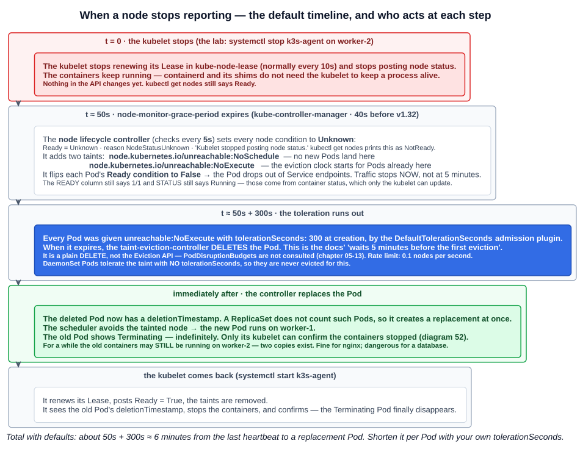
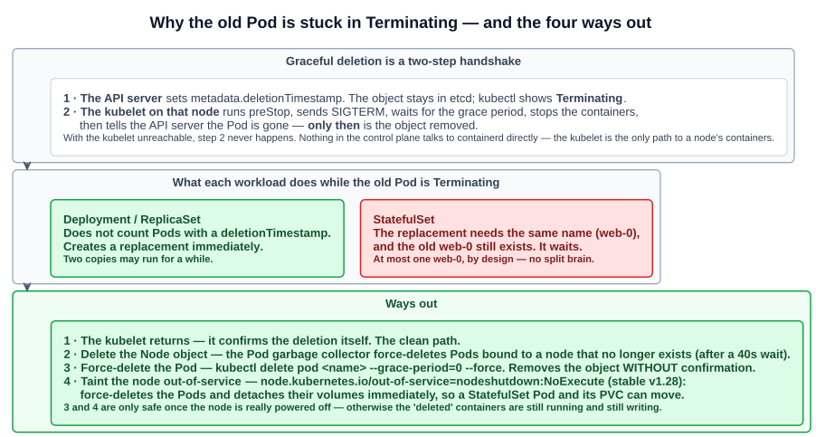

# 18 — When nodes fail: NotReady, Unknown, and the five-minute eviction

The first of the course's miscellaneous write-ups. A worked scenario: a node stops reporting while its containers keep running. What does the control plane see, when does it act, and why is the old Pod left in `Terminating`?

---

## 1. The scenario

A three-node k3s cluster (`control-plane`, `worker-1`, `worker-2`), all `Ready`. One nginx Deployment, its single Pod scheduled to `worker-2`:

```bash
kubectl create deployment --image=nginx nginx -o yaml --dry-run=client | kubectl apply -f -
kubectl get pods -o wide        # nginx-...-f88sf   1/1  Running  10.42.2.2  worker-2
```

Then the kubelet on `worker-2` is stopped. On k3s the kubelet runs inside the `k3s-agent` service, so stopping that service stops the kubelet:

```bash
# on worker-2
systemctl stop k3s-agent.service
```

**The containers do not stop.** The kubelet handed the Pod to containerd when it started it, and containerd and the per-container shims keep running without the kubelet. (k3s's systemd unit uses `KillMode=process`, so stopping the service kills only the k3s process, not the containerd and shims it started.) The node is effectively partitioned: its workloads run, but nobody is reporting on them.

What follows, watched from the control plane:

| Elapsed (approx.) | `kubectl get nodes` | `kubectl get pods -o wide` |
|---|---|---|
| Just after the stop | `worker-2  Ready` — nothing has noticed yet | `f88sf  1/1  Running  worker-2` |
| ~40-50 s later | `worker-2  NotReady` | `f88sf  1/1  Running  worker-2` — still looks healthy |
| ~5 minutes after NotReady | `worker-2  NotReady` | `f88sf  1/1  Terminating  worker-2` and a new `wq751  0/1  ContainerCreating  worker-1`, then `1/1 Running` |
| Indefinitely after that | `worker-2  NotReady` | `f88sf` stays `Terminating` |
| After `systemctl start k3s-agent` | `worker-2  Ready` | only `wq751  Running  worker-1` remains |

Three questions come out of this: why it took about five minutes, why the node is `NotReady` in one view and `Unknown` in another, and why the old Pod is stuck in `Terminating`.

---

## 2. The timeline, step by step



### Heartbeats

Nodes prove they are alive in two ways:

- **Lease objects** in the **`kube-node-lease`** namespace, one per node. The kubelet renews its Lease **every 10 seconds**. A Lease is a small object, so frequent renewals are cheap. This is the main heartbeat. `kubectl describe node` shows it under `Lease:` as `HolderIdentity` and `RenewTime`.
- **Updates to the Node's `.status`.** The kubelet posts status when something changes, or **every 5 minutes** otherwise.

### The node lifecycle controller

The node controller, part of `kube-controller-manager`, checks every node **every 5 seconds** (`--node-monitor-period`). If a node has not been heard from within **`--node-monitor-grace-period`** — **50 s by default since v1.32, 40 s before** — the controller:

1. Sets the node's `Ready` condition, and the pressure conditions, to **`Unknown`**, with reason `NodeStatusUnknown` and message *"Kubelet stopped posting node status."*
2. Adds two taints: **`node.kubernetes.io/unreachable:NoSchedule`**, so no new Pods are scheduled there, and **`node.kubernetes.io/unreachable:NoExecute`**, which starts the eviction clock for the Pods already there.
3. Sets each Pod's **`Ready` condition to `False`** and records a `NodeNotReady` event on it. The Pod drops out of its Service's endpoints, so **traffic stops within about a minute, long before the five-minute eviction**.

`kubectl get pods` still shows `1/1 Running` throughout. The READY and STATUS columns come from container status, which only the kubelet updates, so they are stale. The Pod's `Ready` *condition* is what Services use, and that one the controller does change.

### Why five minutes: a toleration, not a timer

The five minutes is not a setting on the node controller. It's a **toleration on every Pod**.

When a Pod is created, the **`DefaultTolerationSeconds`** admission plugin adds two tolerations, unless the Pod already has its own:

```yaml
tolerations:
- key: node.kubernetes.io/not-ready
  operator: Exists
  effect: NoExecute
  tolerationSeconds: 300
- key: node.kubernetes.io/unreachable
  operator: Exists
  effect: NoExecute
  tolerationSeconds: 300
```

A `NoExecute` taint evicts every Pod that doesn't tolerate it (chapter 05-06). With `tolerationSeconds`, the Pod tolerates the taint only for that long. **300 seconds after the `unreachable` taint appears, the toleration runs out** and the **taint-eviction-controller** deletes the Pod. Since v1.29 this is a separate controller inside `kube-controller-manager`; before that it was part of the node controller.

So the full default delay is about **50 s + 300 s, roughly six minutes from the last heartbeat**. The lab matches this: NotReady after about 40 s (k3s v1.31 still had the old default), Terminating about five minutes later.

**You can tune this per Pod.** A Pod that should fail over quickly sets its own toleration with a lower `tolerationSeconds`. A Pod with a lot of local state can set a higher one and wait out a short network partition. The cluster-wide default of 300 is a kube-apiserver flag: `--default-unreachable-toleration-seconds` and `--default-not-ready-toleration-seconds`.

**DaemonSet Pods** get these tolerations with **no `tolerationSeconds`**, so they are never evicted for this. A DaemonSet Pod belongs on its node; there's nowhere else for it to go.

**A correction to the docs' wording.** The nodes page says the controller triggers *API-initiated eviction*. In the source, the taint-eviction-controller sends a **plain DELETE**, adding a `DisruptionTarget` condition with reason `DeletionByTaintManager`. It does not use the Eviction API, so **PodDisruptionBudgets are not consulted** (chapter 05-13). A PDB protects against voluntary disruptions such as a drain, not against a node disappearing.

---

## 3. NotReady or Unknown?

The course's write-up flags this as confusing. **The node's `Ready` condition is `Unknown`, but `kubectl get nodes` prints `NotReady`.**

The `Ready` condition has three possible values, and `kubectl get nodes` shows only two words. The printer shows `Ready` if the condition is `True`, and `NotReady` for **anything else**, so `False` and `Unknown` look the same. (`SchedulingDisabled` is appended when the node is cordoned.)

| `Ready` condition (`describe node`) | Means | `kubectl get nodes` STATUS | Taint the controller adds |
|---|---|---|---|
| **`True`** | The kubelet reports the node is healthy | `Ready` | none |
| **`False`** | The kubelet **is reporting**, and says the node is **not healthy** (for example, no CNI plugin yet, or the runtime is down) | `NotReady` | `node.kubernetes.io/not-ready` |
| **`Unknown`** | The controller **has not heard from the kubelet** within the grace period | `NotReady` | `node.kubernetes.io/unreachable` |

`False` and `Unknown` are different problems. `False` means the kubelet is up and reporting a problem. `Unknown` means nobody knows, because the kubelet is down, the node is down, or the network is partitioned. To see which one you have, describe the node:

```bash
kubectl describe node worker-2
# Taints:     node.kubernetes.io/unreachable:NoExecute
#             node.kubernetes.io/unreachable:NoSchedule
# Conditions:
#   Type             Status   ...  Reason             Message
#   MemoryPressure   Unknown  ...  NodeStatusUnknown  Kubelet stopped posting node status.
#   DiskPressure     Unknown  ...  NodeStatusUnknown  Kubelet stopped posting node status.
#   PIDPressure      Unknown  ...  NodeStatusUnknown  Kubelet stopped posting node status.
#   Ready            Unknown  ...  NodeStatusUnknown  Kubelet stopped posting node status.

kubectl get node worker-2 -o jsonpath='{.status.conditions[?(@.type=="Ready")].status}{"\n"}'   # Unknown
```

Every condition goes to `Unknown`, not just `Ready`. Without the kubelet, nothing knows about memory, disk or PID pressure either.

---

## 4. Why the old Pod is stuck in Terminating



Deleting a Pod is a **two-step handshake**:

1. The **API server** sets `metadata.deletionTimestamp`. The object stays in etcd, and kubectl shows it as `Terminating`.
2. The **kubelet on that Pod's node** stops the containers (preStop hook, SIGTERM, grace period, SIGKILL) and then tells the API server the Pod is gone. **Only then** is the object removed.

The taint-eviction-controller can do step 1. With the kubelet unreachable, **nobody can do step 2**. The control plane has no other way to reach `worker-2`'s containers: it never talks to containerd directly, only through the kubelet. So the Pod stays `Terminating` until the kubelet comes back. As the course puts it, there is no route to the kubelet and containerd on `worker-2`.

### Why a Deployment recovers anyway, and a StatefulSet does not

| | Deployment (ReplicaSet) | StatefulSet |
|---|---|---|
| Counts the Terminating Pod? | **No.** Pods with a `deletionTimestamp` are not counted as active | **Yes.** The Pod's name is still taken |
| Replacement | Created **immediately**, on a healthy node | **Waits**: it needs the same name (`web-0`), and the old `web-0` still exists |
| Risk | The old container may **still be running** on the partitioned node, so two copies exist for a while | None. That's the point: **at most one `web-0`**, to avoid two copies writing the same data (chapter 05-09) |

In the lab, the replacement started on `worker-1` while the original kept running on `worker-2`. That's harmless for nginx. For something that owns data, it's why StatefulSets refuse to do the same.

### The ways out

| Option | How | When it's safe |
|---|---|---|
| **The kubelet returns** | Restart the kubelet or the node. It sees the `deletionTimestamp`, stops the containers and confirms. | Always. This is the clean path |
| **Delete the Node object** | `kubectl delete node worker-2`. The **Pod garbage collector** force-deletes Pods bound to a node that no longer exists, after a 40 s quarantine. | When the machine is gone for good |
| **Force-delete the Pod** | `kubectl delete pod <name> --grace-period=0 --force` removes the object **without** the kubelet's confirmation | Only when you **know** the containers are stopped. Otherwise they keep running, and for a StatefulSet a second `web-0` can start |
| **Non-graceful node shutdown** | `kubectl taint node worker-2 node.kubernetes.io/out-of-service=nodeshutdown:NoExecute` (**stable since v1.28**). Force-deletes the Pods and **detaches their volumes immediately**, so a StatefulSet Pod and its PersistentVolume can move | Only after confirming the node is **powered off**, not mid-reboot. Remove the taint yourself once the node is recovered |

---

## 5. Eviction rate limits and zones

The controller doesn't evict a whole cluster at once just because the control plane lost contact. Taint-based eviction is rate-limited per availability zone (zones come from the node label `topology.kubernetes.io/zone`):

| Situation | Behaviour | Flag (kube-controller-manager) |
|---|---|---|
| Normal | Evict from at most **one node every 10 seconds** | `--node-eviction-rate` = **0.1** per second |
| At least **55%** of a zone's nodes unhealthy | The zone counts as unhealthy, and the rate is reduced | `--unhealthy-zone-threshold` = **0.55** |
| …and the cluster has **≤ 50 nodes** | Evictions **stop** in that zone | `--large-cluster-size-threshold` = **50** |
| …and the cluster has more than 50 nodes | Slower rate: one node every 100 s | `--secondary-node-eviction-rate` = **0.01** |
| **Every** zone fully unhealthy | **No evictions at all**: the controller assumes the problem is control-plane connectivity, not the nodes | — |

The last row is the important one. If the control plane loses its network, it would otherwise conclude that every node failed and delete every Pod. Instead it does nothing, and the workloads keep running.

---

## 6. Not to be confused with

Several different mechanisms remove Pods from nodes. The exam likes to mix them up:

| Mechanism | Triggered by | Who acts | Respects PDBs? |
|---|---|---|---|
| **Taint-based eviction** (this chapter) | Node `Ready` is `Unknown` or `False` for longer than the Pod's `tolerationSeconds` | taint-eviction-controller in **kube-controller-manager** | **No.** It's a plain delete |
| **Drain** (chapter 05-13) | An administrator: `kubectl drain` | kubectl, through the **Eviction API** | **Yes** |
| **Node-pressure eviction** | The node is healthy but **short of memory, disk or PIDs** | The **kubelet** on that node, BestEffort Pods first (chapter 05-17) | No |
| **Graceful node shutdown** | The OS is shutting down and the kubelet notices | The **kubelet**, within its configured shutdown grace period | No |
| **Preemption** | A higher-priority Pod can't be scheduled | **kube-scheduler** | Best effort only |

---

## Exam angle

- **Lease objects in `kube-node-lease`**, renewed every **10 s**, are the node heartbeat. The node controller checks every **5 s** and marks a silent node after **`node-monitor-grace-period`** (**50 s** since v1.32, 40 s before).
- A node that stops reporting gets **`Ready = Unknown`**, shown as **`NotReady`** by `kubectl get nodes`. `False` means the kubelet is reporting that it's unhealthy; `Unknown` means it's not reporting at all. **`kubectl describe node` shows the difference.**
- Taints: **`node.kubernetes.io/unreachable`** for `Unknown`, **`node.kubernetes.io/not-ready`** for `False`, each as `NoSchedule` **and** `NoExecute`.
- **The 5 minutes = `tolerationSeconds: 300`**, added to every Pod by the **DefaultTolerationSeconds** admission plugin. Tune it per Pod. **DaemonSet Pods are never evicted** for this, since they have no `tolerationSeconds`.
- A Pod on an unreachable node stays **`Terminating`** because **only its kubelet can confirm deletion**. A **Deployment** replaces it immediately. A **StatefulSet** waits, because the name is still taken. The fix is non-graceful shutdown: the **`node.kubernetes.io/out-of-service`** taint, stable in v1.28.
- **Distractor:** "the scheduler moves the Pod". The scheduler never moves Pods. The Pod is deleted and its controller creates a new one, which the scheduler then places.

## References

- [Nodes](https://kubernetes.io/docs/concepts/architecture/nodes/) — heartbeats, the node controller, the 5-minute eviction, and rate limits by zone
- [Node Status](https://kubernetes.io/docs/reference/node/node-status/) — node conditions, `Unknown` after the grace period, and Lease intervals
- [Taint based Evictions](https://kubernetes.io/docs/concepts/scheduling-eviction/taint-and-toleration/#taint-based-evictions) — the built-in taints, the `tolerationSeconds=300` default, DaemonSet tolerations
- [Non-graceful node shutdown handling](https://kubernetes.io/docs/concepts/cluster-administration/node-shutdown/#non-graceful-node-shutdown) — the `out-of-service` taint and StatefulSet recovery
