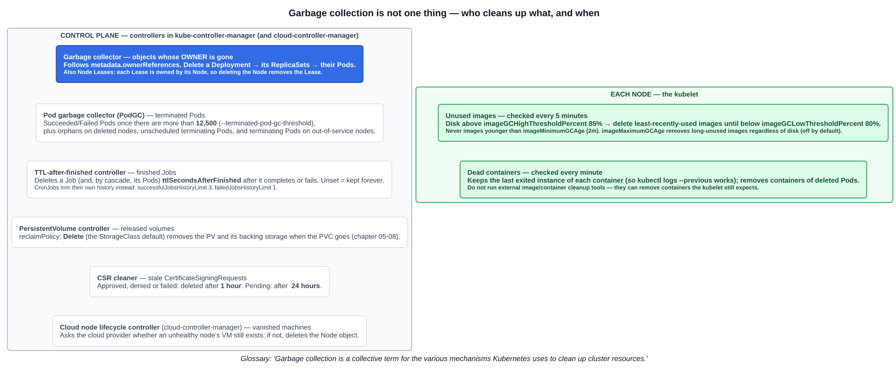
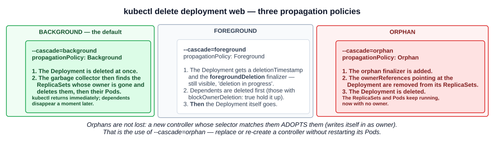

# 19 — Garbage collection

The second miscellaneous write-up. Without garbage collection, the leftovers of everyday work would pile up: finished Pods, completed Jobs, the ReplicaSets of deleted Deployments, old images on every node. Cleaning them up is not one component's job. It's a set of separate mechanisms, each with its own trigger.

---

## 1. Definition and scope

> **Garbage collection is a collective term for the various mechanisms Kubernetes uses to clean up cluster resources.**

The key word is *collective*. The documentation lists what gets cleaned up:

- Terminated Pods
- Completed Jobs
- Objects without owner references (orphaned objects)
- Unused containers and images
- Dynamically provisioned PersistentVolumes with a StorageClass reclaim policy of `Delete`
- Stale or expired CertificateSigningRequests (CSRs)
- Nodes deleted on a cloud (with a cloud controller manager) or on-premises (with a similar addon)
- Node Lease objects

The list is in the docs, but it doesn't say **who** does each one. That's the more useful question, and it's how the exam tends to ask it:



| Resource | Cleaned up by | Trigger / default |
|---|---|---|
| **Dependents of a deleted object** (ReplicaSets of a Deployment, Pods of a ReplicaSet, Pods of a Job) | **Garbage collector** controller (kube-controller-manager) | The owner in `metadata.ownerReferences` no longer exists |
| **Terminated Pods** (`Succeeded` / `Failed`) | **Pod garbage collector (PodGC)** | More than **12,500** terminated Pods in the cluster (`--terminated-pod-gc-threshold`). Below that they stay, so you can still read their logs |
| Pods bound to a **deleted node**, unscheduled terminating Pods, terminating Pods on an **out-of-service** node | **PodGC** | Immediately (orphans after a 40 s quarantine). See chapter 05-18 |
| **Finished Jobs** | **TTL-after-finished controller** | `spec.ttlSecondsAfterFinished` seconds after the Job completes or fails (stable **v1.23**). **Unset means kept forever** |
| A **CronJob's** old Jobs | **CronJob controller** | `successfulJobsHistoryLimit` **3**, `failedJobsHistoryLimit` **1** (chapter 04-09) |
| **PersistentVolumes** with `reclaimPolicy: Delete` | **PersistentVolume controller** | The bound PVC is deleted. `Delete` is the default for dynamically provisioned volumes (chapter 05-08) |
| **CertificateSigningRequests** | **CSR cleaner** controller | Approved, denied or failed: **1 hour**. Pending: **24 hours** |
| **Node objects** for machines that no longer exist | **Node lifecycle controller in the cloud-controller-manager** | The cloud provider reports that the unhealthy node's VM is gone |
| **Node Leases** (`kube-node-lease`) | **Garbage collector** | Each Lease has its **Node as owner**, so deleting the Node deletes the Lease |
| **Unused images** | **The kubelet**, on each node | Checked every **5 minutes**. Disk above **`imageGCHighThresholdPercent` (85%)** → delete least-recently-used images until below **`imageGCLowThresholdPercent` (80%)**. Images younger than `imageMinimumGCAge` (**2 m**) are never removed |
| **Dead containers** | **The kubelet** | Checked every **minute**. Keeps the most recent exited instance of each container, so `kubectl logs --previous` works. Removes containers belonging to deleted Pods |

Two things to notice:

- **Most cleanup runs in the control plane, as controllers in `kube-controller-manager`. Image and container cleanup is the kubelet's job, on each node.** It's local disk, and only the kubelet knows which images and containers its Pods still need. The docs warn against **external image or container cleanup tools**, because they can remove containers the kubelet still expects to exist.
- **Deleting a Namespace** removes everything inside it, but that's the **namespace controller**, not the garbage collector. The namespace sits in `Terminating` while its contents are deleted.

---

## 2. Owners and dependents

The garbage collector works from one field. Every object a controller creates carries **`metadata.ownerReferences`** pointing at its owner:

```bash
kubectl get pod web-7d4b9c-x2k9p -o jsonpath='{.metadata.ownerReferences}' | python -m json.tool
```

```json
[
  {
    "apiVersion": "apps/v1",
    "kind": "ReplicaSet",
    "name": "web-7d4b9c",
    "uid": "6f0b2c8e-...",
    "controller": true,
    "blockOwnerDeletion": true
  }
]
```

| Field | Meaning |
|---|---|
| **`uid`** | The owner is identified by its **UID**, not just its name. A deleted Deployment re-created with the same name is a **different** owner |
| **`controller: true`** | This owner is the **managing controller**. An object can have several owners, but only one controller |
| **`blockOwnerDeletion: true`** | In a **foreground** deletion, this dependent must be deleted before the owner can be. Controllers set it automatically |

The chain for a Deployment is **Deployment → ReplicaSet → Pod**. Each level points at the one above it (chapter 04-05).

**Owner references are not labels.** A Service finds its EndpointSlices with labels, *and* each EndpointSlice also has the Service as its owner. Labels are for **selecting**: which Pods does this Service route to? Owner references are for **lifecycle**: what goes when this object is deleted? The docs add that owner references also help controllers avoid interfering with objects they don't control.

Two rules:

- **Cross-namespace owner references are not allowed.** A namespaced dependent's owner must be in the **same namespace**, or be cluster-scoped. An owner reference that breaks this rule is treated as absent, so the dependent can be deleted. The garbage collector reports it with a warning event, `OwnerRefInvalidNamespace`.
- A **cluster-scoped** dependent can only have **cluster-scoped** owners.

---

## 3. Cascading deletion

When you delete an owner, the **propagation policy** decides what happens to its dependents:



| Policy | kubectl | What happens |
|---|---|---|
| **Background** (**the default**) | `--cascade=background` | The owner is deleted **immediately**. The garbage collector then deletes the dependents in the background |
| **Foreground** | `--cascade=foreground` | The owner enters *deletion in progress*: it gets a `deletionTimestamp` and the **`foregroundDeletion` finalizer**, and stays visible. Dependents are deleted first (those with `blockOwnerDeletion: true` hold it up), **then** the owner |
| **Orphan** | `--cascade=orphan` | The **`orphan` finalizer** is added. The owner reference is **removed** from each dependent, then the owner is deleted. **The dependents keep running** |

```bash
kubectl delete deployment web                          # background: Deployment, then RS, then Pods
kubectl delete deployment web --cascade=foreground     # Pods and RS first; Deployment visible until done
kubectl delete deployment web --cascade=orphan         # Deployment gone; ReplicaSet and Pods keep running
kubectl get rs,pods -l app=web                         # the orphans, now with no ownerReferences
```

Through the API, the same choice is `propagationPolicy` in the `DeleteOptions` body: `Background`, `Foreground` or `Orphan`.

**Orphaning is how you replace a controller without restarting its Pods.** Orphaned objects aren't lost. A new controller whose selector matches them **adopts** them by adding itself as their owner. For example, recreate the Deployment with the same selector, and it adopts the existing ReplicaSet.

### Finalizers: why deletions sometimes hang

A **finalizer** is a key in `metadata.finalizers` that tells the API server: *don't remove this object until whoever owns this key has done their cleanup.* A delete only sets `deletionTimestamp`. The object disappears when its finalizer list is empty.

You've already met several:

| Finalizer | Holds up | Until |
|---|---|---|
| `foregroundDeletion` | The owner, during foreground deletion | Its blocking dependents are gone |
| `orphan` | The owner, during orphan deletion | The owner references have been removed from its dependents |
| `kubernetes.io/pv-protection` | A PersistentVolume | No PVC is bound to it |
| `kubernetes.io/pvc-protection` | A PersistentVolumeClaim | No Pod is using it |

An object stuck in `Terminating` with no kubelet involved (unlike the Pods in chapter 05-18) is usually waiting on a finalizer whose controller is gone or failing. Removing the finalizer by hand works, but it skips whatever cleanup that finalizer was there to guarantee.

---

## Exam angle

- **Garbage collection = a collective term** for several cleanup mechanisms, not one component. **Most are controllers in kube-controller-manager. Images and dead containers are cleaned up by the kubelet** on each node.
- **`metadata.ownerReferences`** links dependents to owners, **by UID**. **Cross-namespace owner references are disallowed.** Labels select; owner references control lifecycle.
- **Cascading deletion:** **background is the default** (owner first, dependents after). **Foreground** deletes dependents first, using the `foregroundDeletion` finalizer and `blockOwnerDeletion`. **Orphan** (`--cascade=orphan`) leaves the dependents running.
- **Numbers:** PodGC threshold **12,500** terminated Pods. Image GC **85% high / 80% low**. Images checked every **5 min**, containers every **1 min**. CSRs **1 h** (approved/denied/failed) and **24 h** (pending). **`ttlSecondsAfterFinished`** for Jobs (unset means kept forever). CronJob history **3 / 1**.
- **Distractor:** "completed Jobs are deleted automatically". They aren't, unless `ttlSecondsAfterFinished` is set (or a CronJob's history limit trims them).

## References

- [Garbage Collection](https://kubernetes.io/docs/concepts/architecture/garbage-collection/) — the scope list, cascading deletion, and image and container GC
- [Owners and Dependents](https://kubernetes.io/docs/concepts/overview/working-with-objects/owners-dependents/) — `ownerReferences`, `blockOwnerDeletion`, and finalizers on owners
- [Use Cascading Deletion in a Cluster](https://kubernetes.io/docs/tasks/administer-cluster/use-cascading-deletion/) — `--cascade` and `propagationPolicy` in practice
- [Automatic Cleanup for Finished Jobs](https://kubernetes.io/docs/concepts/workloads/controllers/ttlafterfinished/) — `ttlSecondsAfterFinished`
