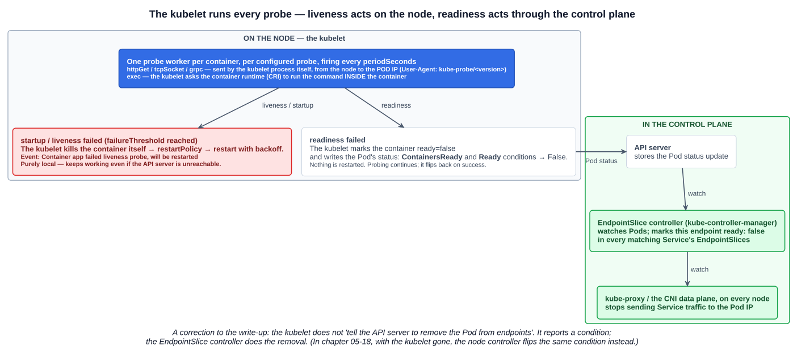
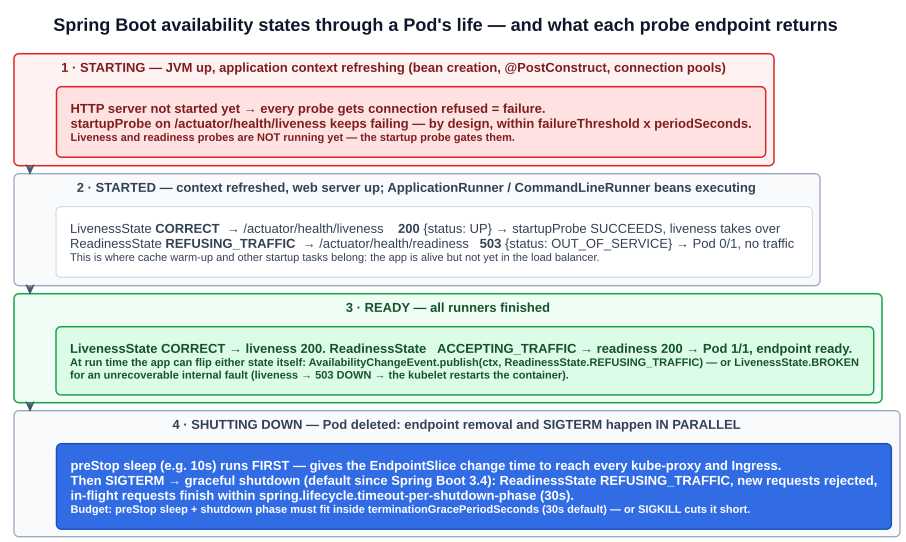

# 20 — Probes and the kubelet, and Spring Boot's health endpoints

The third miscellaneous write-up. Chapter 04-14 covered what the three probes are and how they gate each other. This chapter covers the machinery: **who runs a probe, and where a result goes**. Then it applies that to a real application stack. Section 3, on Spring Boot Actuator, goes beyond the KCNA. It's the practical side of the same mechanism.

---

## 1. The kubelet runs every probe

> **Probes don't act on their own. They are instructions for the kubelet**, which continuously runs these checks and reports status or restarts containers when needed.

A probe is configuration in the Pod spec. **Nothing in the control plane probes anything.** The kubelet on the Pod's node does all of it:

| Probe | The kubelet asks | On failure the kubelet… |
|---|---|---|
| **Liveness** | Is the container still alive? | **Restarts the container** |
| **Readiness** | Is it ready to serve traffic? | **Marks it not ready.** The Pod drops out of Service endpoints. **No restart** |
| **Startup** | Has the application finished starting? | Restarts it if it never succeeds. **While the startup probe runs, liveness and readiness are paused.** Once it succeeds, they take over |

How the kubelet carries it out:

- **One probe worker per container, per configured probe.** Each fires every `periodSeconds`. After a kubelet restart, each waits a random fraction of the period first, so the probes don't all fire at once.
- **`httpGet`, `tcpSocket` and `grpc` are sent by the kubelet process itself, from the node, to the Pod's IP.** Two practical consequences:
  - An app that listens only on `127.0.0.1` fails every HTTP probe, because the probe arrives on the Pod IP.
  - The request carries `User-Agent: kube-probe/<version>` and `Accept: */*`, so it's easy to pick out (or filter) in access logs. Redirects are followed only to the same host.
- **`exec` is not run by the kubelet directly.** The kubelet asks the **container runtime**, over the CRI, to run the command **inside the container**. That costs a process on every check, which is why chapter 04-14 prefers `httpGet`.

---

## 2. Where a result goes



The two failure paths are different:

**Liveness and startup failures are handled entirely on the node.** The kubelet kills the container, records the event `Container app failed liveness probe, will be restarted`, and restarts it under the Pod's `restartPolicy`, with back-off. No control-plane component is involved. **This keeps working even when the API server is unreachable.**

**A readiness failure has to cross the cluster.** Four steps:

1. The kubelet marks the container `ready: false`, and sets the Pod's **`ContainersReady`** and **`Ready`** conditions to `False` in the status it writes to the **API server**.
2. The **EndpointSlice controller** (in kube-controller-manager) watches Pods. It marks this Pod's endpoint `ready: false` in every matching Service's EndpointSlices.
3. **kube-proxy**, or the CNI's data plane, on every node watches EndpointSlices and **stops routing** Service traffic to the Pod IP.
4. Ingress controllers and Gateway implementations (chapters 05-11 and 05-12) watch the same EndpointSlices.

**A correction to the write-up.** It says the kubelet *tells the API server to remove the Pod from Service endpoints*. The kubelet doesn't edit endpoints. It reports a **condition**, and the **EndpointSlice controller** removes the endpoint. The difference matters in two ways:

- Readiness changes take a moment to reach every node, because there are several watch hops.
- If the kubelet itself is gone, the **node controller** sets the same `Ready` condition to `False` instead (chapter 05-18).

---

## 3. Spring Boot: which endpoint for which probe, and why

### 3.1 What Actuator's health endpoint is

Spring Boot Actuator exposes **`/actuator/health`**. By default, it's **the only Actuator endpoint exposed over HTTP**. It combines every **`HealthIndicator`** in the application context:

- **Auto-configured indicators** for what's on the classpath: `db` (each `DataSource`), `diskSpace`, `ping`, `redis`, `mongo`, `kafka`, and so on.
- **Your own**: any bean that implements `HealthIndicator`.

Each indicator reports a status. The overall status is the **worst** one, in the order **`DOWN` > `OUT_OF_SERVICE` > `UP` > `UNKNOWN`**. The HTTP status code follows:

| Health status | HTTP |
|---|---|
| `UP` | **200** |
| `UNKNOWN` | 200 |
| `DOWN` | **503** |
| `OUT_OF_SERVICE` | **503** |

That 200/503 mapping is what makes Actuator endpoints usable as `httpGet` probes. The kubelet counts **200-399 as success** and anything else as failure (chapter 04-14).

**Why `/actuator/health` itself is the wrong probe target.** It includes `db`, `redis` and every other dependency. Point a liveness probe at it and a 30-second database blip turns every replica `DOWN` at once. The kubelet then restarts the whole fleet, and every Pod cold-starts against a database that is already struggling. That's the restart storm from chapter 04-14, section 4.3.

### 3.2 The model behind the probes: availability state

Since Spring Boot 2.3, the application keeps two in-memory states, available by injecting **`ApplicationAvailability`**:

| State | Values | Meaning |
|---|---|---|
| **`LivenessState`** | **`CORRECT`** / **`BROKEN`** | Is the app's internal state OK? Or is it broken beyond self-repair, so the platform should restart it? |
| **`ReadinessState`** | **`ACCEPTING_TRAFFIC`** / **`REFUSING_TRAFFIC`** | Should the platform send it traffic right now? |

Spring Boot changes these states itself as the application moves through its lifecycle:



| Phase | Liveness | Readiness | HTTP server |
|---|---|---|---|
| **Starting**: application context refreshing (beans, `@PostConstruct`, pools) | `BROKEN` | `REFUSING_TRAFFIC` | Not started, so probes get **connection refused** |
| **Started**: context refreshed; `ApplicationRunner` / `CommandLineRunner` beans running | **`CORRECT`** | `REFUSING_TRAFFIC` | Up, but readiness returns 503 |
| **Ready**: all runners finished | `CORRECT` | **`ACCEPTING_TRAFFIC`** | Serving |
| **Graceful shutdown** (after SIGTERM) | `CORRECT` | `REFUSING_TRAFFIC` | In-flight requests finish; new ones are rejected |

So **live = the application context started successfully**, and **ready = the startup tasks are done too**. That's why the docs say startup work such as cache warm-up belongs in **`ApplicationRunner` / `CommandLineRunner`, not `@PostConstruct`**. Work in a runner keeps the Pod *live but not ready*. Work in `@PostConstruct` delays the context refresh itself, which uses up the startup probe's time budget.

### 3.3 The probe endpoints

Actuator publishes each state as a **health group**, a sub-endpoint that contains only the indicators you choose:

| Endpoint | Contains, by default | Returns |
|---|---|---|
| **`/actuator/health/liveness`** | **Only `livenessState`** | `CORRECT` → **200** `{"status":"UP"}` · `BROKEN` → **503** `{"status":"DOWN"}` |
| **`/actuator/health/readiness`** | **Only `readinessState`** | `ACCEPTING_TRAFFIC` → **200** `{"status":"UP"}` · `REFUSING_TRAFFIC` → **503** `{"status":"OUT_OF_SERVICE"}` |

**"By default, Spring Boot does not add other health indicators to these groups."** The probe endpoints don't check your database. That's deliberate.

When they exist:

- **Spring Boot 4.0+**: always on.
- **Spring Boot 2.3–3.x**: turned on automatically only when Spring Boot **detects Kubernetes**, which it does by finding `*_SERVICE_HOST` and `*_SERVICE_PORT` environment variables (chapter 04-08's Service environment variables). Set `management.endpoint.health.probes.enabled=true` to get them anywhere else, for example in a local test.

**What the liveness endpoint actually tests.** `livenessState` only becomes `BROKEN` if your code says so. So in practice, a passing liveness check proves that **the JVM is up, the application context is running, and the web server can accept a request and run it on a worker thread**. That last part is the real deadlock detector: if every request thread is stuck, the probe request times out and the kubelet restarts the container.

**Run the probes on the main port.** If Actuator runs on a separate management port (`management.server.port`), it gets its own web server, port and thread pool. Probes there can pass while the main application can't accept a single connection. The fix the docs recommend:

```yaml
management:
  endpoint:
    health:
      probes:
        add-additional-paths: true    # also serve the groups on the MAIN port: /livez and /readyz
```

**Endpoints that are not probes.** `/actuator/startup` sounds like a startup-probe target, but it returns a **timeline of startup steps** for diagnosis (it needs `BufferingApplicationStartup`). It doesn't say whether startup has finished. `/actuator/info` returns build metadata. Neither belongs in a probe.

### 3.4 The recommendation

| Kubernetes probe | Spring Boot endpoint | Why |
|---|---|---|
| **`startupProbe`** | **`/actuator/health/liveness`** (or `/livez`) | Both the Kubernetes and the Spring docs say a startup probe should check **the same endpoint as the liveness probe**. Its only job is to keep liveness from killing a JVM that is still booting. Liveness turns `CORRECT` exactly when the context has started. Set `failureThreshold × periodSeconds` above your worst cold start |
| **`livenessProbe`** | **`/actuator/health/liveness`** (or `/livez`) | Tests only the app's own internal state, **never external systems**. A failure leads to a restart, and a restart can't fix someone else's database |
| **`readinessProbe`** | **`/actuator/health/readiness`** (or `/readyz`) | 503 during startup tasks, during graceful shutdown, and whenever the app sheds load. Add dependency checks to this group only, and only after thinking it through (below) |

The Spring docs add that a startup probe is *"not necessarily needed"*, because readiness already fails until startup is done. That's true for **traffic**. But without a startup probe, the **liveness** probe still runs during boot. For a JVM that takes 90 seconds to start, that's the boot loop from chapter 04-14, section 3.1. **For a slow-starting Spring Boot service, define the startup probe.**

### 3.5 Putting dependencies in readiness: the judgment call

The readiness group can include more indicators:

```yaml
management:
  endpoint:
    health:
      group:
        readiness:
          include: readinessState, db      # now a database outage takes this Pod out of rotation
```

The Spring docs' reasoning, briefly:

- **A dependency each instance has to itself** (its own local cache, a sidecar, its own connection to something) is a good readiness check. If it fails, this Pod can't serve, but the other replicas can.
- **A dependency every replica shares** (the database everyone uses) is a trade-off. Include it, and an outage marks **all** replicas unready at once. A `ClusterIP` Service with zero ready endpoints then **refuses connections** rather than returning a 503. Leave it out, and handle the failure higher up the stack with a circuit breaker and a fallback.
- **A non-essential dependency** (one you already wrap with circuit breakers and fallbacks) should **never** be in readiness.

**Never put any of them in liveness.**

### 3.6 Changing the state from your own code

The availability state isn't read-only. Publish an **`AvailabilityChangeEvent`**, and the probe endpoints follow:

```java
@Component
class LocalCacheVerifier {

    private final ApplicationEventPublisher publisher;

    LocalCacheVerifier(ApplicationEventPublisher publisher) {
        this.publisher = publisher;
    }

    void checkLocalCache() {
        try {
            // ...
        } catch (CacheCompletelyBrokenException ex) {
            // unrecoverable inside this JVM: liveness -> 503 DOWN -> the kubelet restarts the container
            AvailabilityChangeEvent.publish(publisher, ex, LivenessState.BROKEN);
        }
    }
}
```

```java
// temporarily overloaded: readiness -> 503, the Pod leaves the Service endpoints, nothing restarts
AvailabilityChangeEvent.publish(publisher, this, ReadinessState.REFUSING_TRAFFIC);
// ...later
AvailabilityChangeEvent.publish(publisher, this, ReadinessState.ACCEPTING_TRAFFIC);
```

A custom readiness check is an ordinary `HealthIndicator` bean, added to the group by its name:

```java
@Component("downstreamCache")                   // indicator id: downstreamCache
class DownstreamCacheHealthIndicator implements HealthIndicator {
    public Health health() {
        return cache.isConnected()
                ? Health.up().build()
                : Health.down().withDetail("reason", "cache connection lost").build();
    }
}
```

```yaml
management.endpoint.health.group.readiness.include: readinessState, downstreamCache
```

(`HealthIndicator` and `Health` are in `org.springframework.boot.actuate.health` up to Spring Boot 3.x, and moved to `org.springframework.boot.health.contributor` in 4.0.)

### 3.7 Shutting down without dropping requests

When a Pod is deleted, two things happen **at the same time**:

- The control plane marks the Pod terminating, and the EndpointSlice change starts travelling out to every kube-proxy and Ingress controller.
- The kubelet starts stopping the container.

If the app stops accepting connections before every node has heard the endpoint change, some requests still arrive and fail. Readiness can't help here: the Pod is already on its way out of the endpoints, and the problem is how long that update takes to reach everyone.

The pattern:

1. A **`preStop` sleep** runs **before** SIGTERM is sent, so it holds the app up while the endpoint change spreads. The `sleep` action is on by default since Kubernetes **v1.30** and stable in **v1.34**. On older clusters use `exec` with `sleep`, which needs a shell in the image.
2. Spring Boot's **graceful shutdown**, **on by default since Spring Boot 3.4** (`server.shutdown=graceful`), then stops accepting new requests and lets in-flight ones finish. It waits up to `spring.lifecycle.timeout-per-shutdown-phase`, **30 s by default**.
3. **`terminationGracePeriodSeconds`** (default **30**) must cover **preStop + the shutdown phase**. Otherwise the kubelet sends SIGKILL partway through.

### 3.8 A complete example

```yaml
# application.yaml
management:
  endpoint:
    health:
      probes:
        enabled: true                  # needed on 2.3-3.x outside Kubernetes; harmless otherwise
        add-additional-paths: true     # /livez and /readyz on the main port
server:
  shutdown: graceful                   # the default from 3.4
spring:
  lifecycle:
    timeout-per-shutdown-phase: 20s
```

```yaml
# Deployment Pod template (excerpt)
spec:
  terminationGracePeriodSeconds: 45    # >= preStop (10) + shutdown phase (20) + margin
  containers:
  - name: orders
    image: registry.example.com/orders:1.4.2
    ports:
    - {name: http, containerPort: 8080}
    startupProbe:
      httpGet: {path: /livez, port: http}
      periodSeconds: 5
      failureThreshold: 36             # 36 x 5s = 3 minutes to start
    livenessProbe:
      httpGet: {path: /livez, port: http}
      periodSeconds: 10
      timeoutSeconds: 3                # the 1s default is tight for a JVM under GC
      failureThreshold: 3
    readinessProbe:
      httpGet: {path: /readyz, port: http}
      periodSeconds: 5
      timeoutSeconds: 3
      failureThreshold: 3
    lifecycle:
      preStop:
        sleep: {seconds: 10}
```

Three more practical points:

- **The kubelet sends no credentials.** If Spring Security protects Actuator, allow `/livez`, `/readyz` and `/actuator/health/**` without authentication. Otherwise every probe gets a 401 and fails.
- Prefer `httpGet` to an `exec` probe that runs `curl`. Many JVM base images, distroless ones especially, have no `curl` or shell, and `exec` costs a process per check.
- Use `/actuator/health` with `show-details` for **monitoring and dashboards**, not for probes.

---

## Exam angle

- **The kubelet executes probes.** No control-plane component does. Probes are instructions in the Pod spec, carried out on the Pod's node.
- **Liveness or startup failure → the kubelet restarts the container**, locally. **Readiness failure → no restart.** The Pod's `Ready` condition becomes `False`, and the **EndpointSlice controller** removes it from Service endpoints.
- **While a startup probe is running, liveness and readiness are not.** It runs only until its first success.
- `httpGet`, `tcpSocket` and `grpc` come **from the kubelet on the node to the Pod IP**. **`exec` runs inside the container through the container runtime.**
- **Distractor:** "a failed readiness probe restarts the Pod" (it doesn't), or "the API server / scheduler runs health checks" (the kubelet does).

## References

- [Liveness, Readiness, and Startup Probes](https://kubernetes.io/docs/concepts/workloads/pods/probes/) — what each probe does and that the kubelet performs them
- [Configure Liveness, Readiness and Startup Probes](https://kubernetes.io/docs/tasks/configure-pod-container/configure-liveness-readiness-startup-probes/) — HTTP probe headers, redirects, and startup probe sizing
- [Spring Boot — Kubernetes Probes](https://docs.spring.io/spring-boot/reference/actuator/endpoints.html#actuator.endpoints.kubernetes-probes) — the liveness/readiness groups, `add-additional-paths`, external checks, and lifecycle states
- [Spring Boot — Application Availability](https://docs.spring.io/spring-boot/reference/features/spring-application.html#features.spring-application.application-availability) — `LivenessState`, `ReadinessState`, and `AvailabilityChangeEvent`
