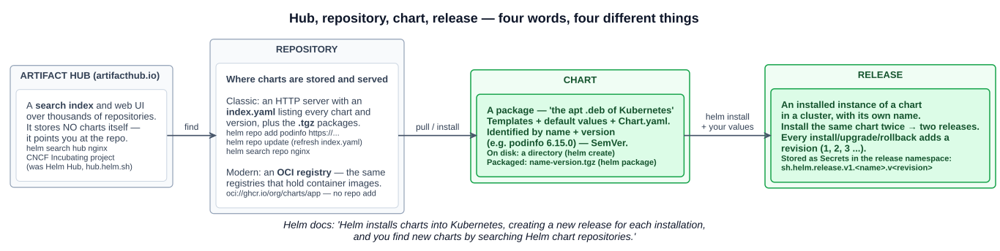
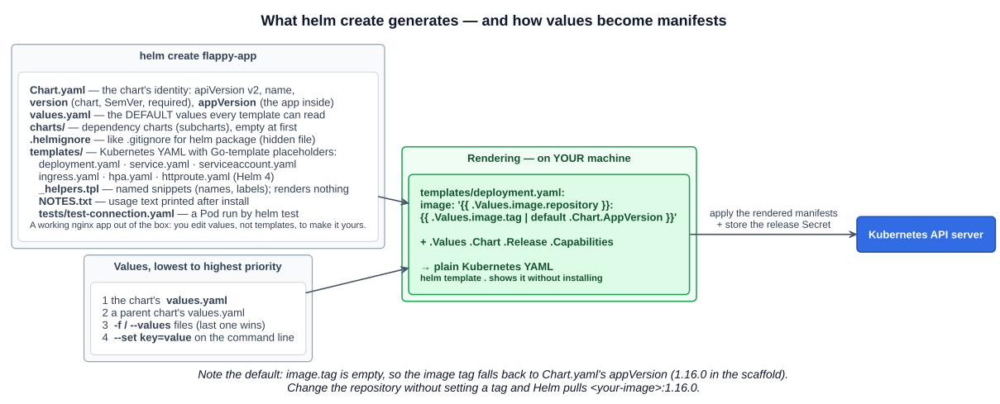
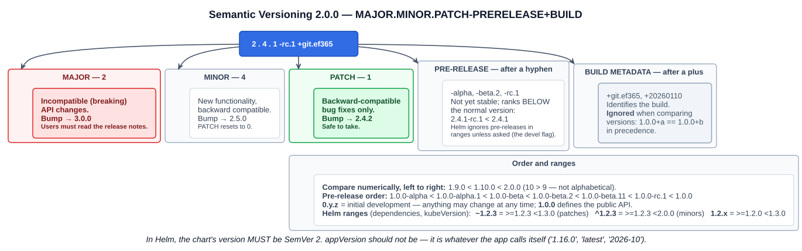
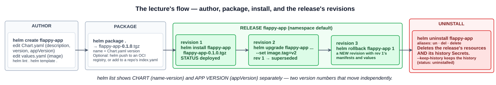

# 21 — Helm and Helm charts

> **Helm is the package manager for Kubernetes.** A Helm **chart** is a package: it contains all of the resource definitions needed to run an application, tool, or service inside a Kubernetes cluster.

The lecture's framing: Helm is **the apt or yum of Kubernetes**. Instead of writing and applying a dozen manifests by hand, you install a **versioned package** of preconfigured resources, give it your own values, and Helm handles the install, upgrades and rollbacks as one unit.

The study tips set the bar for the exam: **understand Helm as a package manager, know the common files, and know the basic commands** — for example, removing a chart.

---

## 1. Four words: hub, repository, chart, release

These four terms are what makes Helm confusing at first. Each one is a different thing:



| Term | What it is | apt analogy | Commands |
|---|---|---|---|
| **Chart** | **A package.** Templates plus default values plus metadata (`Chart.yaml`), identified by **name + version**. A directory on disk, or a `.tgz` archive once packaged | A `.deb` file | `helm create`, `helm package`, `helm show values` |
| **Repository** | **Where charts are stored and shared.** Classic form: an **HTTP server** with an **`index.yaml`** listing every chart and version, plus the `.tgz` files. Modern form: an **OCI registry**, the same kind of registry that holds container images | An apt source (`/etc/apt/sources.list`) | `helm repo add`, `helm repo update`, `helm search repo` |
| **Artifact Hub** | **A search index**, at [artifacthub.io](https://artifacthub.io). A website that lists charts from **many repositories**. It stores **no charts itself**; it tells you which repository to add | A package search site | `helm search hub` |
| **Release** | **An installed instance of a chart** in a cluster, under a name you choose. Install the same chart twice and you get **two releases**. Each install, upgrade or rollback adds a numbered **revision** | An installed package | `helm install`, `helm list`, `helm upgrade`, `helm uninstall` |

**On the hub-vs-repository confusion:** Artifact Hub is the **index you search**, and a repository is **where a chart actually lives**. `helm search hub nginx` asks Artifact Hub and prints Artifact Hub URLs. Add `--list-repo-url` to get the repository's URL, then `helm repo add <name> <url>` it. `helm search repo nginx` searches only repositories you've already added, using their cached `index.yaml`. That's why `helm repo update` comes before it. Artifact Hub replaced the old **Helm Hub** (`hub.helm.sh`), and is itself a **CNCF Incubating** project.

**On OCI registries:** an OCI registry needs no `helm repo add`. You install straight from a reference such as `helm install ngf oci://ghcr.io/nginx/charts/nginx-gateway-fabric`. That's how chapter 05-12 installed NGINX Gateway Fabric. The Helm docs now recommend OCI registries for sharing charts.

**Where a release lives:** Helm has **no server component and no database of its own**. It renders the chart on your machine, sends the manifests to the API server, and stores each revision's record as a **Secret** in the release's namespace: type `helm.sh/release.v1`, named `sh.helm.release.v1.<release>.v<revision>`. That's what `helm list` and `helm history` read back.

```bash
kubectl get secrets -l owner=helm                      # one Secret per release revision
```

**Helm 2 had a server.** It was an in-cluster component called **Tiller**, with broad cluster permissions. **Helm 3 (November 2019) removed Tiller**, so Helm now acts with **your own kubeconfig credentials and RBAC** (chapters 05-02 to 05-04). **Helm 4** followed in **November 2025**. It still installs `apiVersion: v2` charts, and adds server-side apply support and a new plugin system.

---

## 2. Installing Helm

Helm is a single binary on your machine. Nothing is installed in the cluster.

```bash
# The installer script (the lecture used get-helm-3; current Helm is 4)
curl -fsSL -o get_helm.sh https://raw.githubusercontent.com/helm/helm/main/scripts/get-helm-4
chmod 700 get_helm.sh
./get_helm.sh

# Or a package manager
brew install helm                  # macOS
winget install Helm.Helm           # Windows (also: choco install kubernetes-helm, scoop install helm)
sudo snap install helm --classic   # Linux

helm version
```

The docs also offer `curl ... | bash` *"if you want to live on the edge"*. Downloading the script first lets you read it before running it.

---

## 3. `helm create`: what it generates

`helm create flappy-app` is a **scaffold generator**. It writes a **working starter chart**, which by default deploys nginx. You then edit it to describe your own application. Nothing is installed in the cluster at this point. You've only created a directory.

```
flappy-app/
├── Chart.yaml            # the chart's identity and version
├── values.yaml           # default configuration values
├── charts/               # dependency charts (subcharts) — empty
├── .helmignore           # files to leave out of the package (hidden: tree does not show it)
└── templates/
    ├── NOTES.txt         # text printed after install/upgrade (also templated)
    ├── _helpers.tpl      # named template snippets: names, labels. Leading _ = renders no manifest
    ├── deployment.yaml
    ├── hpa.yaml          # rendered only if autoscaling.enabled
    ├── ingress.yaml      # rendered only if ingress.enabled
    ├── httproute.yaml    # Helm 4 scaffold: Gateway API route, only if enabled (chapter 05-12)
    ├── service.yaml
    ├── serviceaccount.yaml
    └── tests/
        └── test-connection.yaml   # a Pod that wgets the Service; run by `helm test`
```



### The three files that matter

**`Chart.yaml`: what the chart is.**

```yaml
apiVersion: v2              # chart API version — v2 for Helm 3 and 4
name: flappy-app
description: A Helm chart for Kubernetes
type: application           # or 'library': reusable helpers only, cannot be installed
version: 0.1.0              # the CHART's version — required, must be SemVer
appVersion: "1.16.0"        # the APPLICATION's version — informational, any string, quote it
```

**`version` and `appVersion` are two different numbers.** `version` changes whenever the **chart** changes (templates, defaults). It names the package: `helm package` produces `flappy-app-0.1.0.tgz`. `appVersion` is the version of the **software inside**. `helm list` shows them as separate columns:

```
NAME        NAMESPACE  REVISION  STATUS    CHART             APP VERSION
flappy-app  default    1         deployed  flappy-app-0.1.0  1.16.0
```

In the lecture, `APP VERSION` still reads `1.16.0`, the scaffold's default, because only the image was changed.

**`values.yaml`: the default configuration.** These are the knobs the templates read. The lecture changed the image to his own application:

```yaml
replicaCount: 1
image:
  repository: <registry>/<your-app>   # was: nginx
  pullPolicy: IfNotPresent
  tag: "latest"                       # was: "" — see the trap below
service:
  type: ClusterIP
  port: 80
```

**`templates/`: Kubernetes YAML with placeholders.** Helm uses **Go templates**. Each `{{ ... }}` is filled in from values and built-in objects:

```yaml
# templates/deployment.yaml (excerpt from the scaffold)
spec:
  replicas: {{ .Values.replicaCount }}
  template:
    spec:
      containers:
        - name: {{ .Chart.Name }}
          image: "{{ .Values.image.repository }}:{{ .Values.image.tag | default .Chart.AppVersion }}"
```

| Built-in object | Holds |
|---|---|
| **`.Values`** | The merged values (see below) |
| **`.Chart`** | The contents of `Chart.yaml` (`.Chart.Name`, `.Chart.Version`, `.Chart.AppVersion`) |
| **`.Release`** | The release being installed (`.Release.Name`, `.Release.Namespace`, `.Release.Revision`) |
| `.Capabilities` | What the cluster supports (Kubernetes version, API versions) |

**The scaffold's image-tag trap:** `image.tag` defaults to `""`, and the template falls back to `.Chart.AppVersion`. Change `image.repository` to your own image but leave `tag` empty, and Helm deploys **`<your-image>:1.16.0`**, a tag your image almost certainly doesn't have. The result is `ErrImagePull`. Set `tag`, or set `appVersion` to your application's real version. (Setting `appVersion` is the better habit, because then `helm list` is accurate too.)

### Where values come from, lowest to highest priority

1. The chart's own **`values.yaml`**
2. A parent chart's `values.yaml` (for subcharts)
3. Files passed with **`-f` / `--values`**. If there are several, **the last one wins**
4. **`--set key=value`** on the command line

```bash
helm install web ./flappy-app -f values-prod.yaml --set replicaCount=3
helm show values podinfo/podinfo > my-values.yaml    # start from a chart's defaults
helm get values web                                   # what was actually supplied to a release
```

That's the main reason to use Helm: **one chart, different values per environment**, with no copied manifests.

---

## 4. Semantic Versioning

Every chart `version` **must be SemVer 2**. It also governs Kubernetes, container image tags and most of the software you depend on:



**`MAJOR.MINOR.PATCH`**, and you increment:

| Part | When | Example from 2.4.1 |
|---|---|---|
| **MAJOR** | You make **incompatible** API changes | **3.0.0**. Minor and patch reset to 0 |
| **MINOR** | You add functionality in a **backward-compatible** way | **2.5.0**. Patch resets to 0 |
| **PATCH** | You make **backward-compatible bug fixes** | **2.4.2** |

The rest of the specification:

- **Pre-release**: a hyphen and identifiers, as in `2.5.0-alpha.1`, `2.5.0-beta.2`, `2.5.0-rc.1`. A pre-release **ranks lower** than its normal version: `2.5.0-rc.1 < 2.5.0`. Order: `1.0.0-alpha < 1.0.0-alpha.1 < 1.0.0-beta < 1.0.0-beta.2 < 1.0.0-beta.11 < 1.0.0-rc.1 < 1.0.0`.
- **Build metadata**: a plus and identifiers, as in `1.0.0+git.ef365`. It's **ignored for precedence**: `1.0.0+a` and `1.0.0+b` rank equal.
- **Comparison is numeric, field by field**: `1.9.0 < 1.10.0`. That's 10 versus 9, not alphabetical order.
- **`0.y.z` is initial development.** Anything may change at any time. **`1.0.0`** is when the public API is declared stable. `helm create` starts at `0.1.0`.
- **Once a version is released, its contents must never change.** Any change is a new version.

**Ranges.** These are used in `Chart.yaml` dependencies and in `kubeVersion`. Helm uses the Masterminds/semver syntax:

| Range | Means | Allows |
|---|---|---|
| `~1.2.3` | `>= 1.2.3 < 1.3.0` | **Patch** updates |
| `^1.2.3` | `>= 1.2.3 < 2.0.0` | **Minor and patch** updates (anything that should be compatible) |
| `1.2.x` | `>= 1.2.0 < 1.3.0` | Wildcard |

Kubernetes uses the same scheme. **v1.36.2** is major 1, minor 36, patch 2. The project has stayed at major version 1 since 2015, adding features in a new minor version roughly every four months.

---

## 5. The lecture's workflow: create, package, install, uninstall



```bash
helm create flappy-app && cd flappy-app
vim Chart.yaml                         # description, version, appVersion
vim values.yaml                        # image.repository / image.tag
helm lint .                            # catch chart errors
helm template .                        # render locally — see the exact YAML Helm will apply

helm package .                         # Successfully packaged chart and saved it to: .../flappy-app-0.1.0.tgz
helm install flappy-app flappy-app-0.1.0.tgz     # install FROM the package (could also be: helm install flappy-app .)

helm list                              # NAME  NAMESPACE  REVISION  STATUS  CHART  APP VERSION
kubectl get deploy,pods,svc            # ordinary Kubernetes objects — Helm created them, it does not run them
kubectl port-forward svc/flappy-app 8080:80

helm uninstall flappy-app              # release "flappy-app" uninstalled
```

`helm install` accepts **any chart source**: a directory (`.`), a packaged `.tgz`, `repo/chart` from an added repository, an `oci://` reference, or a URL. The lecture packaged the chart first to show the full path. A `.tgz` is what you would push to a repository or registry for other people to install.

**What `helm uninstall` does.** It **deletes every Kubernetes resource in the release** and, by default, **its history** (the release Secrets), so the release name can be used again. Its aliases are **`helm un`**, **`helm del`** and **`helm delete`**. `--keep-history` keeps the record, with status `uninstalled`. **PersistentVolumeClaims created by a StatefulSet's `volumeClaimTemplates` are not part of the release, so they survive an uninstall** (chapter 05-09), along with their data.

---

## 6. Essential commands

| Task | Command |
|---|---|
| **Find** charts on Artifact Hub | `helm search hub <keyword>` (`--list-repo-url` to get the repo URL) |
| **Add / refresh / list / remove** a repository | `helm repo add <name> <url>` · `helm repo update` · `helm repo list` · `helm repo remove <name>` |
| **Search** your added repositories | `helm search repo <keyword>` (`--versions` to list every version) |
| **Inspect** a chart before installing | `helm show chart <chart>` · `helm show values <chart>` · `helm show readme <chart>` |
| **Download** a chart without installing | `helm pull <chart> [--untar]` |
| **Install** | `helm install <release> <chart> [-n ns --create-namespace] [-f values.yaml] [--set k=v] [--version 1.2.3]` |
| **Install or upgrade** in one step (CI-friendly) | `helm upgrade --install <release> <chart> ...` |
| **Upgrade** | `helm upgrade <release> <chart> [-f ...] [--set ...]` (new revision) |
| **Roll back** | `helm rollback <release> [revision]` (also creates a **new** revision) |
| **List** releases | `helm list` (current namespace) · `helm list -A` (all namespaces) |
| **Release details** | `helm status <release>` · `helm history <release>` · `helm get values <release>` · `helm get manifest <release>` |
| **Remove** a release | **`helm uninstall <release>`** |
| **Author** | `helm create <name>` · `helm lint` · `helm template` · `helm package` · `helm dependency update` |
| **Test** a release | `helm test <release>` (runs the chart's `templates/tests/` Pods) |
| **OCI** | `helm registry login <host>` · `helm push <chart>.tgz oci://<host>/<path>` |

```bash
# A typical third-party install, end to end
helm repo add podinfo https://stefanprodan.github.io/podinfo
helm repo update
helm search repo podinfo                             # CHART VERSION and APP VERSION columns
helm show values podinfo/podinfo > values.yaml       # edit
helm install web podinfo/podinfo -n web --create-namespace -f values.yaml
helm upgrade web podinfo/podinfo -n web --set replicaCount=3
helm history web -n web
helm rollback web 1 -n web
helm uninstall web -n web
```

---

## Exam angle

- **Helm = the package manager for Kubernetes**, often compared to apt or yum. **CNCF Graduated (May 2020).** A **chart** is the package. A **release** is an installed instance of a chart. A **repository** stores charts (`index.yaml` + `.tgz`, or an OCI registry). **Artifact Hub** is where you **search** for charts across repositories.
- **Chart files:** **`Chart.yaml`** (name, **`version`**, **`appVersion`**, `apiVersion: v2`), **`values.yaml`** (defaults), **`templates/`** (Go-templated manifests, `_helpers.tpl`, `NOTES.txt`), **`charts/`** (dependencies).
- **Removing a chart:** **`helm uninstall <release>`** (aliases `un`, `del`, `delete`). It deletes the release's resources and history. `helm install`, `helm upgrade`, `helm rollback`, `helm list`, `helm repo add`, `helm search hub|repo`, `helm create` and `helm package` round out the basics.
- **Helm 3 removed Tiller**, Helm 2's in-cluster server. Helm runs **client-side** with your kubeconfig, and stores releases as **Secrets** in the release namespace.
- **SemVer:** **MAJOR** = breaking, **MINOR** = backward-compatible features, **PATCH** = backward-compatible fixes. A chart `version` must be SemVer; `appVersion` need not be.
- **Distractor:** "Helm is a CI/CD tool" or "Helm runs the application". Helm packages, installs and versions manifests. Kubernetes runs the resulting objects, and GitOps tools such as Argo CD and Flux (section 7) can drive Helm.

## References

- [Introduction to Helm](https://helm.sh/docs/intro/introduction/) — charts, repositories, releases, and Helm's architecture
- [Using Helm](https://helm.sh/docs/intro/using_helm/) — `search hub` vs `search repo`, install, values, upgrade, rollback, uninstall
- [Charts](https://helm.sh/docs/topics/charts/) — `Chart.yaml` fields, SemVer requirements, and version ranges
- [Semantic Versioning 2.0.0](https://semver.org/) — the specification
